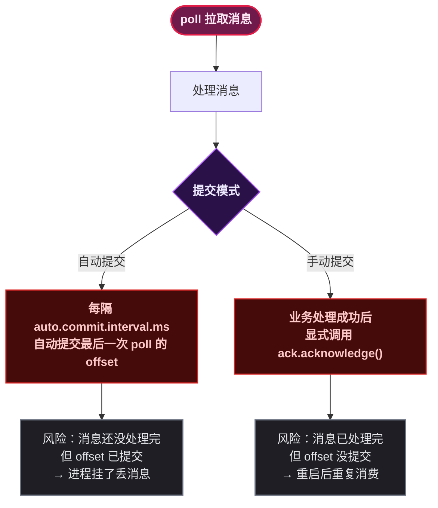
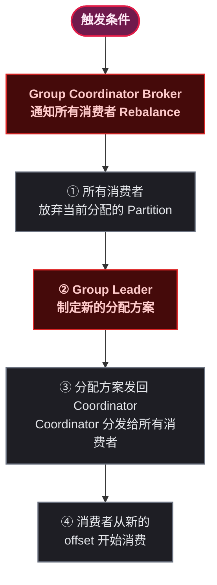

# Kafka Consumer 深入

> 📖 <strong>前置阅读</strong>：本文假设读者已掌握 SpringBoot Kafka 的基本消费操作（`@KafkaListener`）。如果还不熟悉，建议先阅读 [<strong>SpringBoot Kafka 全操作指南</strong>]()。

## 一、⚡ 问题切入：消费者重启后，怎么知道上次读到哪了？

RabbitMQ 的答案是"消息消费后就删了，不需要记位置"。RocketMQ 的答案是"Broker 帮你记 offset"。Kafka 的答案是——<strong>消费者自己记</strong>，记在一个叫 `__consumer_offsets` 的内部 Topic 里：

```
消费者在 Partition-2 上消费到 offset=1500
        ↓ 提交 offset
__consumer_offsets Topic:
    Key:   (order-consumer-group, order-topic, 2)
    Value: offset=1500

消费者重启 ↓
        ↓ 读取 offset
从 offset=1501 继续消费
```

这个设计是 Kafka 和 RabbitMQ/RocketMQ <strong>最核心的消费端差异</strong>——Kafka 的消费者对自己的消费进度负全责。如果消费者忘记提交 offset，重启后就会从上次提交的位置重新消费，产生<strong>重复消息</strong>。

## 二、Offset 提交机制

### 2.1 自动提交 vs 手动提交

Kafka 提供了两种 Offset 提交方式：

| 提交方式 | 配置 | 行为 | 风险 |
|------|------|------|------|
| <strong>自动提交</strong> | `enable-auto-commit: true` | 每隔 `auto.commit.interval.ms`（默认 5s）自动提交 `poll` 返回的最大 offset | 消息可能没处理完就提交了——进程挂了会丢消息 |
| <strong>手动提交</strong> | `enable-auto-commit: false` + `ack-mode: manual` | 消费者处理完消息后显式调用 `ack.acknowledge()` | 消息可能处理完了但没提交——重启后重复消费 |



<strong>手动提交比自动提交更安全</strong>——至少你知道什么时候提交了。消息重复消费可以用幂等解决，但消息丢失无法恢复。

### 2.2 Spring Kafka 的七种提交模式

```yaml
spring:
  kafka:
    listener:
      # 关闭自动提交——使用 Listener 级别的提交控制
      ack-mode: manual
```

| ack-mode | 提交时机 | 性能 | 可靠性 |
|------|------|:---:|:---:|
| `record` | 每条消息处理后自动提交 | 最低（每条都提交） | 高 |
| `batch` | 每批 poll 完成后自动提交 | 中 | 中 |
| `time` | 定时提交（配合 `ack-time`） | 中 | 中 |
| `count` | 消费 N 条后提交（配合 `ack-count`） | 中 | 中 |
| `count_time` | 数量或时间任一满足 | 中 | 中 |
| <strong>`manual`</strong> | 手动调用 `ack.acknowledge()`——下一轮 poll 时提交 | 高 | 高 |
| <strong>`manual_immediate`</strong> | 手动调用后立即提交——不等下一轮 poll | 高 | 最高 |

```java
// manual: 调用 acknowledge()，在下一轮 poll 时提交
@KafkaListener(topics = "order-topic", groupId = "order-group")
public void handle(OrderMessage msg, Acknowledgment ack) {
    processOrder(msg);
    ack.acknowledge();  // 标记为已处理，下一轮 poll 时提交
}

// manual_immediate: 调用 acknowledge()，立即提交
@KafkaListener(topics = "order-topic", groupId = "order-group")
public void handle(OrderMessage msg, Acknowledgment ack) {
    processOrder(msg);
    ack.acknowledge();  // 立即提交——不等下一轮 poll
}
```

> ⚠️ 新手提示：`manual` 和 `manual_immediate` 的核心区别——`manual` 是<strong>延迟提交</strong>（下一轮 poll 时提交），减少网络 I/O 次数；`manual_immediate` 是<strong>立即提交</strong>，可靠性更高但每次处理完都发生一次网络请求。单条消息处理时间长的选 `manual_immediate`，高吞吐量场景选 `manual`。

### 2.3 __consumer_offsets —— Kafka 的内部 Topic

所有 Offset 提交最终都写入 `__consumer_offsets` 这个内部 Topic：

```
__consumer_offsets (默认 50 个 Partition)

消息示例：
Key:   [ConsumerGroup: "order-group", Topic: "order-topic", Partition: 2]
Value: Offset=1500, Timestamp=2024-01-15T10:30:00

提交操作的本质：
    Producer (消费者侧) 向 __consumer_offsets 发送一条消息
    消息内容是"我在这个 Partition 的消费进度是 X"
```

可以用命令行查看某个 ConsumerGroup 的消费进度：

```bash
docker exec -it kafka \
  /opt/kafka/bin/kafka-consumer-groups.sh \
  --bootstrap-server localhost:9092 \
  --group order-consumer-group \
  --describe

# 输出示例：
# GROUP                  TOPIC         PARTITION  CURRENT-OFFSET  LOG-END-OFFSET  LAG
# order-consumer-group   order-topic   0          1500            1505            5
# order-consumer-group   order-topic   1          3200            3200            0
# order-consumer-group   order-topic   2          800             820             20
```

<strong>关键列</strong>：

| 列 | 含义 | 需要关注 |
|------|------|------|
| `CURRENT-OFFSET` | ConsumerGroup 当前的消费位置 | — |
| `LOG-END-OFFSET` | Partition 最新消息的 offset | — |
| <strong>`LAG`</strong> | 积压量 = LOG-END-OFFSET - CURRENT-OFFSET | 持续增长 = 消费跟不上生产 |

## 三、Rebalance —— Partition 重新分配

### 3.1 什么触发 Rebalance

Rebalance 是 Kafka 的 ConsumerGroup 内部协调机制——当组内实例变化时，<strong>Partition 重新分配给各个消费者实例</strong>。

| 触发条件 | 发生了什么 |
|------|------|
| <strong>消费者实例加入</strong> | 新实例启动、加入 ConsumerGroup → Partition 重新分配 |
| <strong>消费者实例离开</strong> | 实例宕机、重启、主动关闭 → 它的 Partition 分给其他实例 |
| <strong>Topic Partition 增加</strong> | 增加 Partition 数 → 新 Partition 需要分配消费者 |
| <strong>消费者心跳超时</strong> | `session.timeout.ms`（默认 45s）没发心跳 → Group Coordinator 认为它挂了 |

### 3.2 Rebalance 的过程



<strong>Rebalance 期间</strong>：<strong>整个 ConsumerGroup 停止消费</strong>。从 Revoke 到 Resume 之间，消息一直在 Partition 上堆积但不消费——这就是 Consumer Lag 突然飙升的原因。

### 3.3 四种分区分配策略

Kafka 支持四种分配策略，决定"哪个消费者分到哪些 Partition"：

| 策略 | 配置值 | 行为 | 优点 | 缺点 |
|------|------|------|------|------|
| <strong>Range</strong>（默认） | `org.apache.kafka.clients.consumer.RangeAssignor` | 按 Topic 逐个分配，每个 Topic 内按 Partition 序号范围分 | 简单 | 不均匀——部分消费者多分 |
| <strong>RoundRobin</strong> | `RoundRobinAssignor` | 所有 Partition 排成一列，消费者轮询取 | 均匀 | Rebalance 时大规模重新分配 |
| <strong>Sticky</strong> | `StickyAssignor` | 尽量均匀 + Rebalance 时尽量保持原有分配 | 均匀 + 稳定 | 比前两个复杂 |
| <strong>CooperativeSticky</strong> | `CooperativeStickyAssignor` | Sticky + 增量 Rebalance（不解冻未变化的 Partition） | <strong>最优</strong>——减少 Rebalance 影响范围 | Kafka 2.4+ |

```java
// 演示 Range 策略的不均匀问题
// Topic-A 有 3 个 Partition，2 个消费者
Range 策略：
    消费者-1 → Partition-0, Partition-1  (2 个)
    消费者-2 → Partition-2               (1 个) ← 不均匀！

// 同样的场景，RoundRobin 策略：
RoundRobin 策略：
    消费者-1 → Partition-0, Partition-2  (2 个)
    消费者-2 → Partition-1               (1 个) ← 仍然不均匀
```

<strong>CooperativeSticky 的优势</strong>——增量 Rebalance：

```
传统的 Eager Rebalance（Range / RoundRobin / Sticky）：
    所有消费者 → 释放所有 Partition → 重新分配 → 继续消费
    ✗ 整个 ConsumerGroup 停止消费！

CooperativeSticky（增量 Rebalance）：
    只释放需要移动的 Partition → 其他 Partition 继续消费 → 分配新 Partition
    ✓ 只有部分 Partition 暂停消费
```

```yaml
# 推荐配置——使用 CooperativeSticky
spring:
  kafka:
    consumer:
      properties:
        partition.assignment.strategy:
          org.apache.kafka.clients.consumer.CooperativeStickyAssignor
```

### 3.4 Rebalance 与重复消费

Rebalance 是重复消费的<strong>第一来源</strong>：

```
消费者 A 正在处理 Partition-0 的 offset=100~150
    ↓ 处理到 offset=120 时，Rebalance！
Partition-0 被分配给消费者 B
    ↓
消费者 B 从上次提交的 offset=100 开始消费
    ↓
offset=100~120 的消息 → 被消费者 A 和消费者 B 都处理了 → 重复！
```

<strong>解决方案</strong>：

1. <strong>Consumer 做幂等</strong>——用业务 Key 去重（`orderId + action` 作为去重键）
2. <strong>调大超时时间</strong>——减少不必要的 Rebalance
3. <strong>使用 CooperativeSticky</strong>——减少 Rebalance 影响范围

```java
// 幂等消费——不管 Rebalance 怎么重分配，同一条消息不会被处理两次
@KafkaListener(topics = "order-topic", groupId = "order-group")
public void handle(ConsumerRecord<String, OrderMessage> record, Acknowledgment ack) {
    String idempotentKey = "kafka:consumed:" + record.topic()
            + ":" + record.partition() + ":" + record.offset();

    // Redis SETNX 原子判重
    Boolean firstTime = redisTemplate.opsForValue()
            .setIfAbsent(idempotentKey, "1", Duration.ofHours(24));

    if (Boolean.FALSE.equals(firstTime)) {
        log.warn("重复消息，跳过: offset={}", record.offset());
        ack.acknowledge();  // 重复消息也要提交——否则下次还拉回来
        return;
    }

    try {
        processOrder(record.value());
        ack.acknowledge();
    } catch (Exception e) {
        // 处理失败 → 删除幂等标记，允许重试时重新处理
        redisTemplate.delete(idempotentKey);
        // 不调用 acknowledge() → 消息会被重新投递
    }
}
```

### 3.5 Rebalance 相关的关键超时参数

| 参数 | 含义 | 默认值 | 建议值 |
|------|------|:---:|:---:|
| `session.timeout.ms` | 心跳超时——消费者超过这个时间没发心跳，Coordinator 认为它挂了 | `45000` (45s) | 保持默认或调大到 60s |
| `heartbeat.interval.ms` | 心跳间隔——消费者多久发一次心跳 | `3000` (3s) | session.timeout 的 1/3 |
| <strong>`max.poll.interval.ms`</strong> | 两次 poll 的最大间隔——超过这个时间消费者被认为"卡住了" | `300000` (5min) | 根据单批消息处理时间调整 |
| `max.poll.records` | 每次 poll 拉取的最大消息数 | `500` | 单条消息处理慢时调小 |

<strong>`max.poll.interval.ms` 是最容易出问题的参数</strong>——如果消费者处理一批消息的时间超过了这个值（默认 5 分钟），Kafka 认为消费者卡住了，触发 Rebalance：

```yaml
# 如果单条消息处理耗时 2 秒，max.poll.records=500
# 最坏情况：500 条 × 2 秒 = 1000 秒 ≈ 16 分钟 > 5 分钟 → Rebalance！
# 解决方案：
spring:
  kafka:
    consumer:
      max-poll-records: 50           # 每次只拉 50 条
      properties:
        max.poll.interval.ms: 600000  # 拉到 10 分钟
```

## 四、多线程消费模型

### 4.1 Kafka 的消费线程特点

Kafka 和 RabbitMQ/RocketMQ 有一个重要的消费端差异：<strong>Kafka 的单个 Consumer 实例不是线程安全的</strong>——不能在多个线程中共享同一个 `KafkaConsumer` 实例。

但可以用以下方式实现多线程消费：

### 4.2 方式一：concurrency 配置（推荐）

```java
// 同一个 @KafkaListener 起 3 个 KafkaConsumer 线程
// 每个线程独立 poll，独立提交 offset
@KafkaListener(
    topics = "order-topic",
    groupId = "order-group",
    concurrency = "3"   // ← 起 3 个 KafkaConsumer 实例
)
public void handle(OrderMessage msg, Acknowledgment ack) {
    processOrder(msg);
    ack.acknowledge();
}
```

```yaml
# 或者在配置文件中统一设置
spring:
  kafka:
    listener:
      concurrency: 3
```

<strong>concurrency 的含义</strong>：

```
Topic: order-topic (6 个 Partition)
ConsumerGroup: order-group, concurrency=3

KafkaConsumer-1 → Partition-0, Partition-1  (独立的线程 + TCP 连接)
KafkaConsumer-2 → Partition-2, Partition-3
KafkaConsumer-3 → Partition-4, Partition-5

每个线程独立 poll、独立提交 offset——互不影响
```

> ⚠️ 新手提示：`concurrency` 不要超过 Topic 的 Partition 总数。6 个 Partition + concurrency=10 = 有 4 个 KafkaConsumer 永远闲着——Kafka 规定<strong>一个 Partition 只能被同一个 ConsumerGroup 内的一个消费者消费</strong>。

### 4.3 方式二：消息内异步处理（小心 Offset 丢失）

```java
@KafkaListener(topics = "order-topic", groupId = "order-group")
public void handle(OrderMessage msg, Acknowledgment ack) {
    // 收到消息后立即提交 offset——然后用线程池异步处理
    ack.acknowledge();

    // 异步处理——注意：如果这里抛异常，消息已经"丢了"
    CompletableFuture.runAsync(() -> {
        try {
            processOrder(msg);
        } catch (Exception e) {
            log.error("异步处理失败: orderId={}", msg.getOrderId(), e);
            // 消息的 offset 已提交——无法重试了！
        }
    });
}
```

<strong>这种方式有风险</strong>——offset 已提交，如果异步处理失败，消息就丢了。只适用于"丢了也没关系"的非关键业务。

### 4.4 方式三：池化处理 + 批量提交

更好的做法是——先处理整批，处理成功后统一提交：

```java
@KafkaListener(topics = "order-topic", groupId = "order-group")
public void handleBatch(List<OrderMessage> messages, Acknowledgment ack) {
    // 用线程池并发处理一批消息
    List<CompletableFuture<Void>> futures = messages.stream()
        .map(msg -> CompletableFuture.runAsync(() -> processOrder(msg)))
        .toList();

    // 等待整批处理完成
    CompletableFuture.allOf(futures.toArray(new CompletableFuture[0]))
        .join();  // 阻塞等待——整批处理完

    // 全部成功才提交
    ack.acknowledge();
}
```

<strong>三种多线程方式对比</strong>：

| 方式 | 并发粒度 | 可靠性 | 适用场景 |
|------|------|:---:|------|
| `concurrency` | Partition 级别——每个线程处理多个 Partition | 高 | <strong>通用推荐</strong>——单条处理耗时 100ms 以内 |
| 异步提交（先 ACK 再处理） | 消息级别 | 低 | 日志、埋点——丢了无所谓 |
| 池化批量处理 | 消息级别 | 高 | 单条处理耗时长（> 500ms）且处理时间波动大 |

## 五、完整 Consumer 配置速查

| 参数 | 分类 | 含义 | 默认值 |
|------|------|------|:---:|
| `group.id` | 组 | ConsumerGroup 名称 | — |
| `auto.offset.reset` | 进度 | 第一次消费时从哪里开始——`earliest` / `latest` / `none` | `latest` |
| `enable.auto.commit` | 进度 | 是否自动提交 offset | `true` |
| `auto.commit.interval.ms` | 进度 | 自动提交间隔 | `5000` |
| `max.poll.records` | 拉取 | 每次 poll 最大消息数 | `500` |
| <strong>`max.poll.interval.ms`</strong> | 拉取 | 两次 poll 的最大间隔——超时触发 Rebalance | `300000` (5min) |
| <strong>`session.timeout.ms`</strong> | 心跳 | 心跳超时——超时认为消费者挂了 | `45000` (45s) |
| `heartbeat.interval.ms` | 心跳 | 心跳间隔 | `3000` |
| `partition.assignment.strategy` | Rebalance | 分配策略 | `RangeAssignor` |
| `fetch.min.bytes` | 拉取 | 每次拉取的最小数据量（凑够才返回） | `1` |
| `fetch.max.wait.ms` | 拉取 | 每次拉取的最大等待时间 | `500` |
| `request.timeout.ms` | 超时 | 请求超时 | `30000` |

## 🎯 总结

1. <strong>Offset 是消费者自己的责任</strong>：存在 `__consumer_offsets` 内部 Topic，由消费者提交。自动提交有丢消息风险，手动提交有重复消费风险——<strong>手动提交 + 幂等去重</strong>是生产标配。

2. <strong>Rebalance 是重复的第一来源</strong>：实例增减时 Partition 重新分配，正在处理但未提交的消息会被新消费者重新拉取。解决方案是<strong>幂等 + CooperativeSticky 增量 Rebalance</strong>。

3. <strong>`max.poll.interval.ms` 最容易被忽略</strong>：单批消息处理时间超过这个值就会触发 Rebalance。处理慢时调大这个值或调小 `max.poll.records`。

4. <strong>多线程消费首选 concurrency</strong>：每个线程独立的 KafkaConsumer 实例——线程安全、可靠性最高。concurrency 不要超过 Partition 数。

5. <strong>CooperativeSticky > Sticky > RoundRobin > Range</strong>：Kafka 2.4+ 默认用 CooperativeSticky——最均匀且支持增量 Rebalance。

> 📖 <strong>下一步阅读</strong>：消费端的全部控制力都搞清楚了。接下来进入 Kafka 的流处理引擎——`Kafka Streams` DSL、精确一次语义、Log Compaction。继续阅读 [<strong>Kafka Streams 与高级特性</strong>]()。
