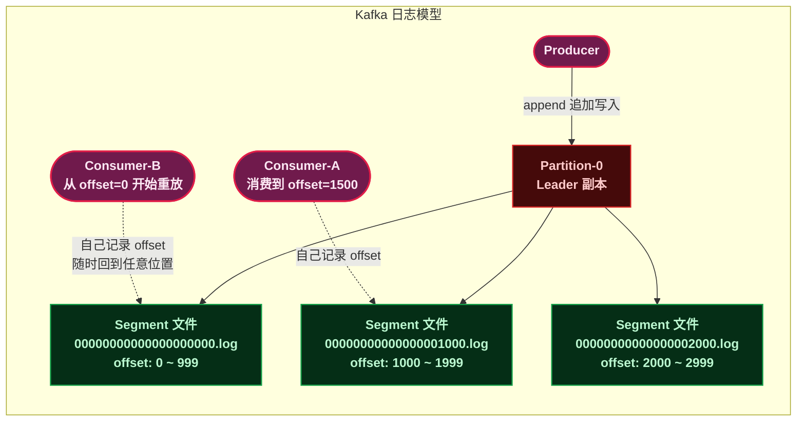

# Kafka：分布式提交日志，不是消息队列

> 📖 <strong>前置阅读</strong>：本文假设读者已理解消息队列的基本价值（异步、解耦、削峰填谷），最好读过 RabbitMQ 或 RocketMQ 的任意一篇基础文章。有了 MQ 概念再学 Kafka 事半功倍。

## 一、⚡ 问题切入：RabbitMQ 和 RocketMQ 有什么共同的"毛病"？

先回顾 RabbitMQ 和 RocketMQ 的消费模型：

```
RabbitMQ: Consumer 收到消息 → 手动 basicAck → Broker 删除消息
RocketMQ: Consumer 收到消息 → 返回 CONSUME_SUCCESS → offset 推进
```

<strong>共同点</strong>：消息被消费者<strong>确认（ACK）后，Broker 就把它删了</strong>。消息在 Broker 上的生命周期是"暂存"——它存在只是为了等待消费者拿走。

这个模型有一个隐含的限制：<strong>一条消息只能被消费一次</strong>。想重放消息？RabbitMQ 做不到（消息已经删了），RocketMQ 可以重置 offset 但受 CommitLog 保留时间限制。

这时候再看 Kafka 的设计：<strong>消息消费后不删除</strong>。消息存在磁盘上，按时间或大小策略统一过期，消费者想从哪个位置读就从哪个位置读。

```
Kafka: Consumer 自己管 offset，随时可以回到过去的某个位置重读
       消息不是被消费掉的——是按时间自然过期的
```

这就是 Kafka 和 RabbitMQ/RocketMQ <strong>本质上的不同</strong>——Kafka 不是一个消息队列，它是一个<strong>分布式提交日志（Distributed Commit Log）</strong>。

## 二、🧬 Kafka 是什么：分布式提交日志

### 2.1 核心定义

Kafka 的官方定位：<strong>分布式、分区化、多副本的提交日志服务</strong>。

每个词都精准定义了 Kafka 的核心特征：

| 特征 | 含义 | 与 RabbitMQ/RocketMQ 的区别 |
|------|------|------|
| <strong>分布式</strong> | 多 Broker 组成集群，数据分布存储 | 类似 RocketMQ 的多 Broker，但 RabbitMQ 集群是元数据共享 |
| <strong>分区化</strong> | 每个 Topic 分为多个 Partition，Partition 内消息严格有序 | RocketMQ 也有 Queue 分区，但 Partition 的核心价值是<strong>水平扩展和消息重放</strong> |
| <strong>多副本</strong> | 每个 Partition 有一个 Leader + 多个 Follower | 类似 RocketMQ 的主从，但 Kafka 的副本选举基于 Controller |
| <strong>提交日志</strong> | 消息以追加写的方式持久化，不可修改，不可删除（直到过期） | <strong>这是最根本的区别——RabbitMQ/RocketMQ 的消息消费后删除，Kafka 的消息消费后保留</strong> |

### 2.2 为什么叫"提交日志"？

想象一个只追加写入的日志文件：

```
Log File: messages.log
──────────────────────────────
offset 0:  2024-01-15 订单A 创建
offset 1:  2024-01-15 订单A 付款
offset 2:  2024-01-15 订单B 创建
offset 3:  2024-01-15 订单A 发货
offset 4:  2024-01-16 订单C 创建
...
```

这个日志文件<strong>永远只追加写</strong>，从不修改或删除现有记录。读取者可以从任意 offset 开始读，也可以重复读。Kafka 的 Partition 就是这个模型的分布式版本。



<strong>RabbitMQ/RocketMQ 是"消息队列"——消息被取走了就没了。Kafka 是"消息日志"——消息在那里，你爱读几遍读几遍。</strong>这个区别决定了 Kafka 的应用场景远超传统 MQ——日志收集、流处理、事件溯源（Event Sourcing）、数据管道——这些场景都需要消息<strong>持久保存并可重放</strong>。

## 三、🗺️ 核心组件逐一拆解

### 3.1 Broker —— 存储节点

Broker 是 Kafka 的存储和分发节点。一个 Kafka 集群由多个 Broker 组成。每个 Broker 可以存储多个 Partition 的副本。Broker 之间通过 Controller（控制器）协调——KRaft 协议下 Controller 从 Broker 中选举产生。

### 3.2 Topic 与 Partition —— 核心的分区模型

Topic 是消息的逻辑分类，Partition 是 Topic 的物理分片。

```
Topic: order-events (3 个 Partition)

Partition-0 (Leader 在 Broker-1)     Partition-1 (Leader 在 Broker-2)     Partition-2 (Leader 在 Broker-3)
┌──────────────────────┐       ┌──────────────────────┐       ┌──────────────────────┐
│ offset: 0 → msg-A    │       │ offset: 0 → msg-B    │       │ offset: 0 → msg-C    │
│ offset: 1 → msg-D    │       │ offset: 1 → msg-E    │       │ offset: 1 → msg-F    │
│ offset: 2 → msg-G    │       │ offset: 2 → msg-H    │       │ offset: 2 → msg-I    │
└──────────────────────┘       └──────────────────────┘       └──────────────────────┘
```

Kafka 的 Partition 和 RocketMQ 的 Queue 类似——都是 Topic 的物理分片。但在 Kafka 中，<strong>Partition 是顺序保证的最小单位</strong>：同一个 Partition 内消息严格有序，跨 Partition 无序。

<strong>Partition 的数量决定了并行度</strong>：一个 ConsumerGroup 中，最多有 Partition 数量的消费者实例<strong>真正在工作</strong>——超过的实例闲着。

### 3.3 ConsumerGroup —— Kafka 的消费协调模型

Kafka 的 ConsumerGroup 和 RocketMQ 的概念一致——<strong>组内实例协作消费，每条消息只被组内一个实例消费</strong>。但有一个关键区别：

<strong>Partition 和消费者实例的关系</strong>：

```
ConsumerGroup: order-group, Topic: order-events (6 个 Partition)

实例A → Partition-0, Partition-1
实例B → Partition-2, Partition-3
实例C → Partition-4, Partition-5

如果起第 4 个实例D → 闲着——因为只有 6 个 Partition
如果宕了 1 个实例 → Rebalance，Partition 重新分配给剩余实例
```

> ⚠️ 新手提示：Kafka 的 Partition 数量必须<strong>大于等于</strong>预期的消费者实例数。如果你计划部署 10 个实例但只有 6 个 Partition，有 4 个实例永远收不到消息。

### 3.4 Offset —— 消费者自己的"书签"

Kafka 的消费者<strong>自己管理消费进度</strong>——称为 Offset。消费者读完 offset=1500 的消息后，向 Kafka 提交"我已经读到 1500 了"。重启后从 1501 继续读。

这和 RabbitMQ 完全不同——RabbitMQ 是 Broker 推消息给消费者然后删除；RocketMQ 的 offset 也存在 Broker。Kafka 的 offset <strong>消费者自己提交到 Kafka 的一个内部 Topic（`__consumer_offsets`）</strong>。

```java
// Offset 提交的实际含义
Consumer 告诉 Kafka：
    "我在 Topic=order-events, Partition=0, ConsumerGroup=order-group
     的消费进度是 offset=1500"

// 重启后：
Consumer 问 Kafka：
    "Topic=order-events, Partition=0, ConsumerGroup=order-group
     的消费进度是多少？"
Kafka 回答：offset=1500
Consumer 从 offset=1500 开始继续消费
```

### 3.5 Kafka vs RabbitMQ vs RocketMQ 本质区别

| 维度 | RabbitMQ | RocketMQ | Kafka |
|------|:---:|:---:|:---:|
| <strong>数据模型</strong> | Queue（消息队列） | Queue（消息队列） | Log（提交日志） |
| <strong>消息消费后</strong> | 删除 | 偏移量推进（CommitLog 统一过期） | 偏移量推进（按时间/大小过期） |
| <strong>消息重放</strong> | 不支持 | 支持（重置 offset） | 原生支持——核心设计目标 |
| <strong>顺序保证</strong> | 单 Queue FIFO（但并发破坏） | 单 Queue 严格有序 | 单 Partition 严格有序 |
| <strong>吞吐量上限</strong> | 数万 msg/s | 十万级 msg/s | <strong>百万级 msg/s</strong> |
| <strong>注册中心</strong> | Erlang 节点自发现 | NameServer | KRaft（去 ZK） |
| <strong>消费模式</strong> | Push | Push（长轮询 Pull） | <strong>纯 Pull</strong> |
| <strong>典型场景</strong> | 业务异步、灵活路由 | 事务消息、高吞吐业务 | <strong>日志/流处理/大数据管道</strong> |

## 四、日志存储的物理结构

### 4.1 Partition 在磁盘上的真实形态

```mermaid
flowchart TD
classDef startEnd fill:#701a4c,stroke:#e11d48,stroke-width:2px,color:#fce7f3,font-weight:bold;
classDef process fill:#1e1e24,stroke:#6b7280,stroke-width:1.5px,color:#e5e7eb;
classDef data fill:#052e16,stroke:#16a34a,stroke-width:1.5px,color:#bbf7d0,font-weight:bold;
classDef highlight fill:#450a0a,stroke:#dc2626,stroke-width:1.5px,color:#fecaca,font-weight:bold;

    subgraph DISK ["Kafka 数据目录 /var/lib/kafka/data/order-events-0/"]
        direction TB
        SEG1_FILE["00000000000000000000.log\n消息数据文件（顺序写）\noffset 0 ~ 999"]
        SEG1_IDX["00000000000000000000.index\n稀疏索引（offset → 文件位置）"]
        SEG1_TIME["00000000000000000000.timeindex\n时间戳索引（timestamp → offset）"]

        SEG2_FILE["00000000000000001000.log\noffset 1000 ~ 1999"]
        SEG2_IDX["00000000000000001000.index"]
        SEG2_TIME["00000000000000001000.timeindex"]
    end

    class SEG1_FILE,SEG2_FILE data;
    class SEG1_IDX,SEG2_IDX,SEG1_TIME,SEG2_TIME process;
```



<strong>Segment 文件</strong>：每个 Partition 由多个 Segment 文件组成，文件名是起始 offset。当当前 Segment 达到 `log.segment.bytes`（默认 1GB）或 `log.segment.ms`（默认 7 天），Kafka 滚动创建新 Segment。

### 4.2 零拷贝 —— 为什么 Kafka 吞吐量这么高？

Kafka 消费消息时，数据从磁盘到网络发送<strong>不经过用户态</strong>——利用 Linux 的 `sendfile` 系统调用实现<strong>零拷贝（Zero Copy）</strong>：

```
传统方式（4 次拷贝，2 次 CPU 拷贝）：
    磁盘 → 内核缓冲区 → 用户缓冲区 → 内核 Socket 缓冲区 → 网卡

Kafka sendfile（2 次拷贝，0 次 CPU 拷贝）：
    磁盘 → 内核缓冲区 ──────────→ 内核 Socket 缓冲区 → 网卡
                   （DMA 直接拷贝，CPU 不参与）
```

这是 Kafka 单机吞吐量能达到 100 万 msg/s 的底层原因之一——配合顺序读写，磁盘 I/O 几乎不是瓶颈。

## 五、🔧 Docker 安装（KRaft 模式，无需 Zookeeper）

Kafka 3.3+ 支持 KRaft（Kafka Raft）模式——不再需要 Zookeeper：

```bash
# 1. 创建 KRaft 配置文件
mkdir -p ~/kafka/config ~/kafka/data

cat > ~/kafka/config/server.properties << 'EOF'
# 节点 ID
node.id=1
process.roles=broker,controller

# 配置 Controller 选举
controller.quorum.voters=1@localhost:29093

# 监听地址
listeners=PLAINTEXT://0.0.0.0:9092,CONTROLLER://0.0.0.0:29093
advertised.listeners=PLAINTEXT://localhost:9092

# 日志目录
log.dirs=/var/lib/kafka/data
EOF

# 2. 格式化存储目录（生成 Cluster ID）
docker run --rm -v ~/kafka/config:/etc/kafka -v ~/kafka/data:/var/lib/kafka/data \
  apache/kafka:3.7.0 \
  /opt/kafka/bin/kafka-storage.sh format \
  --config /etc/kafka/server.properties \
  --cluster-id $(uuidgen)

# 3. 启动 Kafka
docker run -d --name kafka \
  -p 9092:9092 \
  -v ~/kafka/config:/etc/kafka \
  -v ~/kafka/data:/var/lib/kafka/data \
  apache/kafka:3.7.0
```

## 六、👋 第一条消息（纯 Kafka Client）

### 6.1 依赖

```xml
<dependency>
    <groupId>org.apache.kafka</groupId>
    <artifactId>kafka-clients</artifactId>
    <version>3.7.0</version>
</dependency>
```

### 6.2 生产者

```java
import org.apache.kafka.clients.producer.*;
import java.util.Properties;

public class FirstProducer {
    public static void main(String[] args) throws Exception {
        Properties props = new Properties();
        props.put("bootstrap.servers", "localhost:9092");
        props.put("key.serializer",
                "org.apache.kafka.common.serialization.StringSerializer");
        props.put("value.serializer",
                "org.apache.kafka.common.serialization.StringSerializer");

        KafkaProducer<String, String> producer = new KafkaProducer<>(props);

        // 发送消息：Topic=first-topic, Key=null, Value=消息内容
        ProducerRecord<String, String> record =
                new ProducerRecord<>("first-topic", "Hello Kafka！第一条消息");

        // 同步发送——等待确认
        RecordMetadata metadata = producer.send(record).get();
        System.out.printf("发送成功: topic=%s, partition=%d, offset=%d%n",
                metadata.topic(), metadata.partition(), metadata.offset());
        // 输出: 发送成功: topic=first-topic, partition=0, offset=0

        producer.close();
    }
}
```

<strong>逐行解释</strong>：

| 配置 | 含义 |
|------|------|
| `bootstrap.servers` | Kafka 集群地址。只要有一台活着就能发现整个集群 |
| `key.serializer` | Key 的序列化器——网络传输前把 Key 对象转字节数组 |
| `value.serializer` | Value 的序列化器——和 Key 同理 |
| `producer.send(record).get()` | 同步发送，`get()` 阻塞直到 Broker 返回元数据 |

### 6.3 消费者

```java
import org.apache.kafka.clients.consumer.*;
import java.time.Duration;
import java.util.Properties;
import java.util.Collections;

public class FirstConsumer {
    public static void main(String[] args) {
        Properties props = new Properties();
        props.put("bootstrap.servers", "localhost:9092");
        props.put("group.id", "first-consumer-group");  // ConsumerGroup 名称
        props.put("key.deserializer",
                "org.apache.kafka.common.serialization.StringDeserializer");
        props.put("value.deserializer",
                "org.apache.kafka.common.serialization.StringDeserializer");
        // 从最早的消息开始消费（第一次连 Kafka 时）
        props.put("auto.offset.reset", "earliest");

        KafkaConsumer<String, String> consumer = new KafkaConsumer<>(props);
        consumer.subscribe(Collections.singletonList("first-topic"));

        while (true) {
            // poll——主动拉取一批消息（阻塞最多 1 秒）
            var records = consumer.poll(Duration.ofSeconds(1));
            for (ConsumerRecord<String, String> r : records) {
                System.out.printf("收到: offset=%d, key=%s, value=%s%n",
                        r.offset(), r.key(), r.value());
            }
            // poll 返回后自动提交 offset（默认 auto.commit）
        }
    }
}
```

<strong>Kafka 消费者的几个独特之处</strong>：

- <strong>`poll` 是循环调用的</strong>——不像 RabbitMQ 的 `DeliverCallback` 由 Broker 推送，Kafka 的消费者必须主动 `poll`。这是纯 Pull 模型的体现
- <strong>`group.id` 必填</strong>——Kafka 的消息<strong>总是</strong>在 ConsumerGroup 的上下文中消费。即使只有一个实例也要指定组名
- <strong>`auto.offset.reset`</strong>：`earliest`（从第一个 offset 开始）、`latest`（从最新 offset 开始）、`none`（没有 offset 时报错）

## 七、🎯 总结

本文从 Kafka 与 RabbitMQ/RocketMQ 的本质差异出发——<strong>Kafka 是分布式提交日志，不是消息队列</strong>——拆解了核心架构：

1. <strong>Partition 是日志文件的分片</strong>：每个 Partition 是一个只追加写的日志，由多个 Segment 文件组成。Partition 内严格有序，跨 Partition 无序。

2. <strong>ConsumerGroup 协作消费</strong>：每条消息只被组内一个实例消费，Partition 数量 ≥ 实例数时才全部忙碌。Offset 由消费者管理和提交——随时可以回到过去重读。

3. <strong>零拷贝 sendfile</strong>：消费时数据从磁盘到网卡不经用户态，这是百万级吞吐的底层保障。

4. <strong>KRaft 去 Zookeeper</strong>：Kafka 3.3+ 不再需要 ZK，Kraft 模式简化部署。

Docker 单节点 + 纯 Java Client 的第一条消息已跑通。下一篇用 SpringBoot 替代这套样板代码。

> 📖 <strong>下一步阅读</strong>：Kafka 底层模型搞清楚了，下一篇用 SpringBoot 一把梭——`KafkaTemplate` 发送 + `@KafkaListener` 消费 + JSON 自动序列化。继续阅读 [<strong>SpringBoot Kafka 全操作指南</strong>]()。
