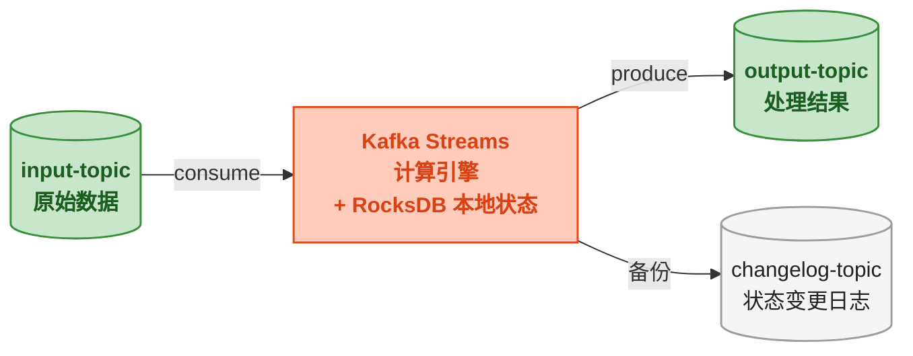

# Kafka Streams 与高级特性

> 📖 <strong>前置阅读</strong>：本文假设读者已掌握 Kafka Consumer/Producer 的使用和 Offset/Partition 概念。如果还不熟悉，建议先阅读 [<strong>Consumer 深入：位移管理与 Rebalance</strong>]()。

## 一、⚡ 问题切入：用 Consumer + Producer 写流处理有什么毛病？

假设需要统计每个商品的<strong>近 5 分钟销量</strong>。用 Consumer + Producer 写：

```java
// 用 Consumer + Producer 实现滑动窗口计数——代码量爆炸
Map<String, List<Long>> windowCache = new HashMap<>();
// 还需要处理：窗口过期清理、状态持久化、故障恢复、乱序数据...
```

这个需求正是<strong>流处理引擎</strong>的用武之地。Kafka Streams 是 Kafka 官方的流处理库——它不是另一个需要部署的服务（不像 Flink/Spark Streaming），而是<strong>一个 Java 库</strong>，跑在你的应用进程里。

<strong>Kafka Streams 本质</strong>：Consume → 计算 → Produce，全部走 Kafka，中间状态存在 Kafka 的本地 RocksDB 实例中。



## 二、Kafka Streams 核心概念

### 2.1 KStream vs KTable

Kafka Streams 有两个核心抽象，理解它们的区别是正确使用的前提：

| 抽象 | 含义 | 类比 | 操作 |
|------|------|------|------|
| <strong>KStream</strong> | 无界的<strong>插入流</strong>——每条消息都是独立事件 | 数据库的 INSERT 日志 | map、filter、flatMap、join KStream |
| <strong>KTable</strong> | 有界的<strong>更新流</strong>——同一个 Key 的消息会覆盖 | 数据库的 UPSERT 日志（当前快照） | aggregate、join KTable、toStream |
| <strong>GlobalKTable</strong> | 全量 KTable——每个实例有一份完整副本 | 全量缓存的维表 | join（不需要 co-partition） |

```
KStream 行为：
Key=A, Value=100  →  "Key=A 的订单金额是 100"     ← 新事件
Key=A, Value=200  →  "Key=A 的订单金额是 200"     ← 另一个新事件（不覆盖）

KTable 行为：
Key=A, Value=100  →  当前状态: {A: 100}
Key=A, Value=200  →  当前状态: {A: 200}             ← 覆盖了 100
Key=A, Value=null →  当前状态: { }                  ← 删除了
```

### 2.2 有状态操作与无状态操作

| 无状态操作 | 含义 | 有状态操作 | 含义 |
|------|------|------|------|
| `map` | 转换每条消息 | `count` | 计数 |
| `filter` | 过滤消息 | `aggregate` | 自定义聚合 |
| `flatMap` | 一条变多条 | `reduce` | 归约 |
| `branch` | 分流 | `join` | 流-流 / 流-表 Join |
| `groupBy` | 分组（为聚合做准备） | `windowedBy` | 窗口聚合 |

<strong>有状态操作</strong>需要本地状态存储——Kafka Streams 用 RocksDB（可替换为内存）。这个状态通过内部的 changelog Topic 备份到 Kafka——如果应用重启，从 changelog 恢复状态。

## 三、SpringBoot Kafka Streams 实战

### 3.1 依赖与配置

```xml
<dependency>
    <groupId>org.apache.kafka</groupId>
    <artifactId>kafka-streams</artifactId>
</dependency>
<dependency>
    <groupId>org.springframework.kafka</groupId>
    <artifactId>spring-kafka</artifactId>
</dependency>
```

```yaml
spring:
  kafka:
    bootstrap-servers: localhost:9092
    streams:
      application-id: order-streams-app     # Kafka Streams 应用 ID——作为 ConsumerGroup 名
      properties:
        # 精确一次语义——Producer 幂等 + 事务
        processing.guarantee: exactly_once_v2
        # 副本数——Streams 内部 Topic（changelog / repartition）的副本因子
        replication.factor: 1
        # 状态存储目录
        state.dir: /tmp/kafka-streams
```

<strong>`processing.guarantee` 的两个级别</strong>：

| 级别 | 行为 | 开销 |
|------|------|:---:|
| `at_least_once`（默认） | 消息可能被处理多次——不加事务 | 最低 |
| `exactly_once_v2` | 消息被消费、处理、生产都是精确一次——使用事务 | 有一定性能开销 |

### 3.2 第一个 Stream：过滤大额订单

```java
@Configuration
@EnableKafkaStreams
public class OrderStreamConfig {

    private static final String INPUT_TOPIC = "order-topic";
    private static final String OUTPUT_TOPIC = "large-order-topic";

    @Bean
    public KStream<String, OrderMessage> orderStream(StreamsBuilder builder) {
        // 1. 从 input-topic 创建 KStream
        KStream<String, OrderMessage> stream =
                builder.stream(INPUT_TOPIC,
                    Consumed.with(Serdes.String(), orderSerde()));

        // 2. 过滤：只保留金额 > 5000 的订单
        KStream<String, OrderMessage> largeOrders = stream
                .filter((key, order) -> order.getAmount().compareTo(new BigDecimal("5000")) > 0)
                // 3. 转换：添加标记
                .mapValues(order -> {
                    System.out.printf("大额订单: orderId=%d, amount=%s%n",
                            order.getOrderId(), order.getAmount());
                    return order;
                });

        // 4. 输出到 output-topic
        largeOrders.to(OUTPUT_TOPIC,
                Produced.with(Serdes.String(), orderSerde()));

        return stream;
    }

    // 自定义 Serde——处理 OrderMessage 的序列化/反序列化
    private Serde<OrderMessage> orderSerde() {
        // 使用 Spring Kafka 的 JsonSerde
        return new JsonSerde<>(OrderMessage.class);
    }
}
```

这个流做的事情：从 `order-topic` 读取每条订单消息 → 过滤掉金额 ≤ 5000 的 → 把大额订单写入 `large-order-topic`。

### 3.3 有状态聚合：每个商品的订单数统计

```java
@Bean
public KStream<String, OrderMessage> orderCountStream(StreamsBuilder builder) {
    KStream<String, OrderMessage> stream =
            builder.stream("order-topic",
                Consumed.with(Serdes.String(), orderSerde()));

    // 按 productName 分组 → 统计每个商品的订单数
    KTable<String, Long> productOrderCount = stream
            .groupBy(
                // 重新选择 Key——按商品名分组
                (key, order) -> order.getProductName(),
                Grouped.with(Serdes.String(), orderSerde())
            )
            // 统计：每次收到一条消息，count + 1
            .count(Materialized.as("product-order-count-store"));

    // 把 KTable 转回 KStream 输出到结果 Topic
    productOrderCount.toStream()
            .mapValues((product, count) ->
                    product + " 的订单数: " + count)
            .to("product-count-topic",
                Produced.with(Serdes.String(), Serdes.String()));

    return stream;
}
```

状态存储细节：

```
Kafka Streams 自动创建内部 Topic:
    order-streams-app-product-order-count-store-changelog

本地 RocksDB 实例:
    /tmp/kafka-streams/order-streams-app/.../product-order-count-store/

重启时:
    RocksDB 从 changelog Topic 恢复状态 → 计数接着之前的继续
```

### 3.4 窗口聚合：近 5 分钟每个商品的销量

```java
@Bean
public KStream<String, OrderMessage> windowedCountStream(StreamsBuilder builder) {
    KStream<String, OrderMessage> stream =
            builder.stream("order-topic",
                Consumed.with(Serdes.String(), orderSerde()));

    // 翻滚窗口（Tumbling Window）：每 5 分钟一个窗口，窗口间不重叠
    stream.groupBy((key, order) -> order.getProductName(),
                   Grouped.with(Serdes.String(), orderSerde()))
            .windowedBy(TimeWindows.ofSizeWithNoGrace(Duration.ofMinutes(5)))
            .count(Materialized.as("product-window-count-store"))
            .toStream()
            .foreach((windowedKey, count) -> {
                // windowedKey.key() → 商品名
                // windowedKey.window().start() → 窗口开始时间
                // windowedKey.window().end() → 窗口结束时间
                System.out.printf("[%s ~ %s] %s = %d 单%n",
                        windowedKey.window().startTime(),
                        windowedKey.window().endTime(),
                        windowedKey.key(),
                        count);
            });

    return stream;
}
```

<strong>三种窗口类型</strong>：

```
Tumbling Window（翻滚窗口）：固定大小，不重叠
  |---- win1 ----|---- win2 ----|---- win3 ----|  → 时间轴
  0             5              10            15

Hopping Window（跳跃窗口）：固定大小，有重叠
  |------ win1 ------|
        |------ win2 ------|
              |------ win3 ------|  → 时间轴
  0     2     4     6     8    10

Sliding Window（滑动窗口）：基于消息时间差——两个 Join 的消息时间差 < N
  msg1-|--60s--|-msg2    → 窗口 = (msg1.time, msg2.time)
```

```java
// Hopping Window——窗口大小 10 分钟，每 2 分钟前进一次（窗口重叠）
.windowedBy(TimeWindows.ofSizeAndGrace(Duration.ofMinutes(10), Duration.ofMinutes(2)))

// Sliding Window——用于 Join（两个流中的消息时间差 < 60s）
// 见 3.6 Stream-Stream Join
```

### 3.5 流-表 Join：订单信息关联商品维表

```java
@Bean
public KStream<String, EnrichedOrder> joinStream(StreamsBuilder builder) {
    // KStream——订单流（事实数据）
    KStream<String, OrderMessage> orderStream =
            builder.stream("order-topic",
                Consumed.with(Serdes.String(), orderSerde()));

    // KTable——商品信息（维表数据）
    KTable<String, ProductInfo> productTable =
            builder.table("product-info-topic",
                Consumed.with(Serdes.String(), productSerde()));

    // 流-表 Join：订单流 join 商品表 → 订单带上商品信息
    KStream<String, EnrichedOrder> enriched = orderStream
            // 把 Key 从 orderId 换成 productName——为了让 Key 匹配
            .selectKey((key, order) -> order.getProductName())
            .join(productTable,
                // Join 函数——订单和商品信息合并
                (order, product) -> new EnrichedOrder(
                    order.getOrderId(),
                    order.getUserId(),
                    order.getProductName(),
                    product != null ? product.getCategory() : "UNKNOWN",
                    order.getAmount()
                ),
                Joined.with(Serdes.String(), orderSerde(), productSerde())
            );

    enriched.to("enriched-order-topic",
            Produced.with(Serdes.String(), enrichedSerde()));

    return orderStream;
}
```

<strong>KStream-KTable Join 的执行模式</strong>：

```
KStream (order-topic):
  "iPhone 15" → order-10001     ← 订单事件，来了就 Join
  "iPhone 15" → order-10002     ← 又来一单

KTable (product-info-topic):
  "iPhone 15" → {category: "手机", price: 6999}  ← 维表数据，最新的覆盖旧的

Join 结果 (enriched-order-topic):
  order-10001 + "iPhone 15" + 手机品类
  order-10002 + "iPhone 15" + 手机品类

关键是：KStream 的每条消息都触发 Join，使用 KTable 的<strong>当前值</strong>
```

### 3.6 流-流 Join：订单和支付按时间窗口关联

```java
@Bean
public KStream<String, OrderPaidInfo> streamStreamJoin(StreamsBuilder builder) {
    KStream<String, OrderMessage> orderStream =
            builder.stream("order-topic",
                Consumed.with(Serdes.String(), orderSerde()))
                .filter((key, order) -> "created".equals(order.getAction()))
                .selectKey((key, order) -> String.valueOf(order.getOrderId()));

    KStream<String, PaymentMessage> paymentStream =
            builder.stream("payment-topic",
                Consumed.with(Serdes.String(), paymentSerde()))
                .selectKey((key, payment) -> String.valueOf(payment.getOrderId()));

    // 流-流 Join：只 Join 时间差在 30 分钟内的订单和支付
    KStream<String, OrderPaidInfo> joined = orderStream.join(
            paymentStream,
            (order, payment) -> new OrderPaidInfo(
                order.getOrderId(),
                order.getAmount(),
                payment.getPayTime(),
                payment.getPayAmount()
            ),
            // 窗口：支付必须在订单创建后的 30 分钟内发生
            JoinWindows.ofTimeDifferenceWithNoGrace(Duration.ofMinutes(30)),
            StreamJoined.with(Serdes.String(), orderSerde(), paymentSerde())
    );

    joined.to("order-paid-topic",
            Produced.with(Serdes.String(), orderPaidSerde()));

    return orderStream;
}
```

### 3.7 完整 Topology：多个流组合

以上所有操作可以串联成一个完整的处理拓扑：

```java
@Bean
public KStream<String, OrderMessage> fullTopology(StreamsBuilder builder) {
    KStream<String, OrderMessage> source =
            builder.stream("order-topic",
                Consumed.with(Serdes.String(), orderSerde()));

    // 分支 1：大额订单 → 单独输出
    source.filter((key, order) ->
            order.getAmount().compareTo(new BigDecimal("5000")) > 0)
            .to("large-order-topic",
                Produced.with(Serdes.String(), orderSerde()));

    // 分支 2：创建事件 → 按商品统计
    source.filter((key, order) -> "created".equals(order.getAction()))
            .groupBy((key, order) -> order.getProductName())
            .count()
            .toStream()
            .to("product-count-topic",
                Produced.with(Serdes.String(), Serdes.String()));

    // 分支 3：创建事件 → 商品销量窗口统计
    source.filter((key, order) -> "created".equals(order.getAction()))
            .groupBy((key, order) -> order.getProductName())
            .windowedBy(TimeWindows.ofSizeWithNoGrace(Duration.ofMinutes(5)))
            .count()
            .toStream()
            .foreach((windowedKey, count) ->
                System.out.printf("窗口[%s~%s] %s = %d 单%n",
                        windowedKey.window().startTime(),
                        windowedKey.window().endTime(),
                        windowedKey.key(), count));

    return source;
}
```

## 四、Log Compaction —— Kafka 的"当前快照"机制

### 4.1 问题：KTable 的 changelog 无限增长

KTable 表示"每个 Key 的当前值"——但它的 changelog Topic 存储了<strong>所有历史值</strong>。如果一个 Key 更新了 100 次，changelog 里就有 100 条消息——恢复状态时需要读取所有 100 条。

Log Compaction 解决了这个问题——<strong>只保留每个 Key 的最新值，删除旧的</strong>。

### 4.2 Log Compaction 原理

```
Compaction 前（changelog Topic）:
  Key=A, Value=v1, offset=0
  Key=B, Value=v2, offset=1
  Key=A, Value=v3, offset=2     ← A 的新值
  Key=C, Value=v4, offset=3
  Key=A, Value=v5, offset=4     ← A 的最新值
  Key=B, Value=v6, offset=5     ← B 的新值

Compaction 后：
  Key=A, Value=v5, offset=4     ← 保留最新的
  Key=B, Value=v6, offset=5     ← 保留最新的
  Key=C, Value=v4, offset=3     ← 保留唯一的

旧值 v1, v2, v3, v6 被删除——只保留每个 Key 的最新值
```

<strong>Log Compaction 不是按时间过期</strong>——它是按 Key 去重。配合时间过期（`retention.ms`），Kafka 可以同时做两种清理：按时间删除老消息 + 按 Key 压缩重复消息。

```bash
# 创建 Compact Topic
docker exec -it kafka \
  /opt/kafka/bin/kafka-topics.sh --create \
  --topic product-info-topic \
  --bootstrap-server localhost:9092 \
  --config cleanup.policy=compact \
  --config min.cleanable.dirty.ratio=0.5
```

| 参数 | 含义 |
|------|------|
| `cleanup.policy=compact` | 启用 Log Compaction |
| `cleanup.policy=compact,delete` | 同时启用时间和 Key 清理 |
| `min.cleanable.dirty.ratio` | 脏数据比例达到多少时触发清理（默认 0.5） |
| `delete.retention.ms` | 有墓碑标记（Value=null）的记录多久后删除（默认 24h） |

> ⚠️ 新手提示：Log Compaction 不会压缩<strong>当前活跃的 Segment</strong>——只压缩旧的 sealed Segment。这意味着最新写入的消息不会被 Compaction 影响。如果要立即看到 Compaction 效果，需要先让 Segment 滚动（满足 `segment.bytes` 或 `segment.ms`）。

## 五、Kafka Streams 与其他流处理框架对比

| 维度 | Kafka Streams | Apache Flink | Spark Streaming |
|------|:---:|:---:|:---:|
| <strong>部署</strong> | 应用内 Java 库——不需要额外集群 | 独立集群（JobManager + TaskManager） | 独立集群（Spark Cluster） |
| <strong>状态管理</strong> | RocksDB 本地 + Kafka changelog | 内置状态后端（RocksDB 等） | 依赖 HDFS/Checkpoint |
| <strong>精确一次</strong> | exactly_once_v2（基于 Kafka 事务） | 原生精确一次（Checkpoint Barrier） | 通过 WAL + 幂等 |
| <strong>依赖</strong> | 只依赖 Kafka | 依赖 ZooKeeper + HDFS/S3 | 依赖 YARN/Mesos/K8s |
| <strong>运维复杂度</strong> | <strong>最低</strong>——和应用一起部署 | 高——需要独立运维 | 高——需要 Spark 集群运维 |
| <strong>适用场景</strong> | Kafka 为中心的数据处理——无外部依赖 | 大规模复杂流处理——需要多种 Source/Sink | 微批处理（秒级延迟） |

## 🎯 总结

1. <strong>Kafka Streams 是库，不是服务</strong>：在你的 SpringBoot 应用里引入 `kafka-streams` 依赖，用 `StreamsBuilder` 描述计算逻辑——不需要额外部署 Flink/Spark 集群。

2. <strong>KStream 是事件流，KTable 是快照表</strong>：KStream 每条消息都是独立事件（不覆盖）；KTable 以最新值覆盖旧值（类似数据库表的更新）。理解二者的 Join 语义——流-表 Join 使用 KTable 的当前值；流-流 Join 在滑动时间窗口内匹配。

3. <strong>有状态操作透明恢复</strong>：`count`、`aggregate`、`join` 的状态存在本地 RocksDB，通过 changelog Topic 备份到 Kafka。应用重启后自动从 changelog 恢复——不需要手动持久化。

4. <strong>Log Compaction 按 Key 去重</strong>：只保留每个 Key 的最新值，适合维表、KTable changelog 等"当前快照"场景。和按时间过期（`retention.ms`）是独立的两种清理策略。

5. <strong>选 Kafka Streams 的判断标准</strong>：全部数据来源和输出都是 Kafka + 不需要复杂的外部 Join + 团队不想多运维一个流处理集群。如果 Source/Sink 涉及 MySQL、Redis、ES 等外部系统，选 Flink。

> 📖 <strong>下一步阅读</strong>：Kafka 流处理也搞定了。最后一步——生产环境部署。Kafka 集群怎么搭？KRaft 模式的 Controller 选举怎么配？Prometheus 监控看哪些指标？继续阅读 [<strong>生产环境部署与调优</strong>]()。
