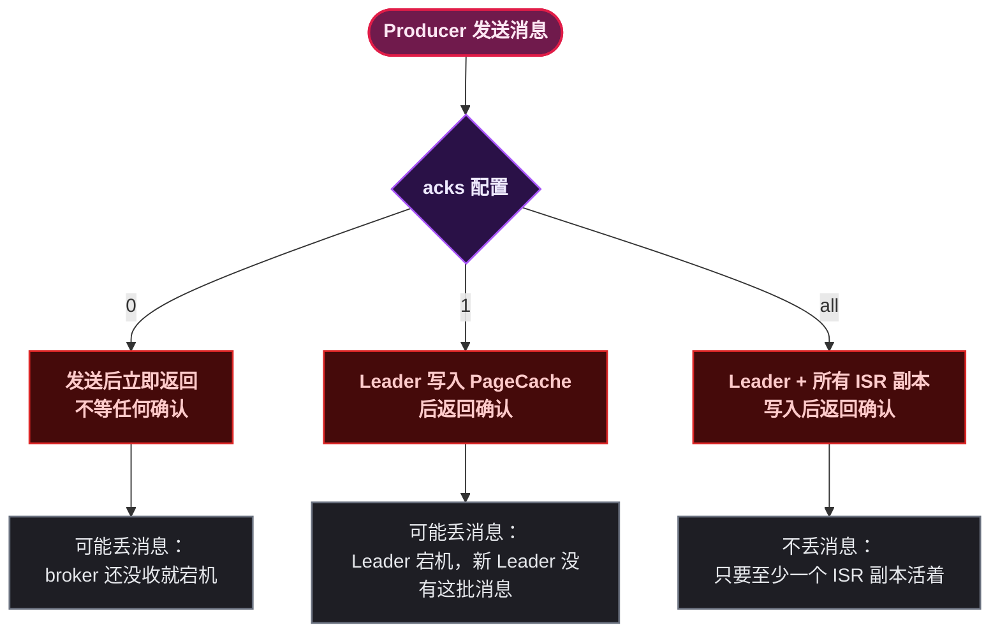

# Kafka Producer 深入

> 📖 <strong>前置阅读</strong>：本文假设读者已掌握 SpringBoot Kafka 的基本发送操作（`KafkaTemplate.send`）。如果还不熟悉，建议先阅读 [<strong>SpringBoot Kafka 全操作指南</strong>]()。

## 一、⚡ 问题切入：消息到底发到了哪个 Partition？

上一篇用 `kafkaTemplate.send("order-topic", key, msg)` 发送消息时，生产者背后发生了三件事：

1. <strong>Partitioner 决定</strong>消息进入哪个 Partition
2. <strong>消息攒批</strong>——在内存 Buffer 中等待 `batch.size` 或 `linger.ms` 条件触发
3. <strong>根据 acks 配置</strong>决定什么时候认为发送成功

当你看到日志里 `partition=1, offset=0` 时，背后是这三个步骤的协作。每个步骤都有配置项可以调整——它们直接影响<strong>消息顺序、可靠性、吞吐量</strong>。

## 二、分区策略 —— 消息路由的第一个环节

### 2.1 默认分区策略

Kafka Producer 的 `Partitioner` 接口决定了每条消息进入哪个 Partition。默认实现是 `DefaultPartitioner`：

```java
// DefaultPartitioner 的逻辑（简化版）
public int partition(String topic, Object key, byte[] keyBytes,
                     Object value, byte[] valueBytes, Cluster cluster) {

    int numPartitions = cluster.partitionsForTopic(topic).size();

    if (keyBytes == null) {
        // Key 为 null → 使用 Sticky 分区（粘性分区）
        // 不是轮询！是把一批消息都发到同一个 Partition，等 batch 满了才换下一个
        return stickyPartition(topic, numPartitions);
    } else {
        // Key 不为 null → 用 murmur2 哈希 % Partition 数量
        return Utils.murmur2(keyBytes) % numPartitions;
    }
}
```

<strong>规则一：Key 为 null → Sticky Partition</strong>。Kafka 2.4 之前是轮询（Round Robin——每条消息换一个 Partition），2.4+ 改为 Sticky——把一批消息"粘"在同一个 Partition 上，等这个 Batch 满了或时间到了才切到下一个 Partition。这减少了网络请求次数——把同一批的消息打成一个请求发给同一个 Broker。

<strong>规则二：Key 不为 null → 哈希 Partition</strong>。同一个 Key 的消息永远进入同一个 Partition——这是 Kafka 保证消息有序的基础。

```java
// 示例：发送三条订单消息
kafkaTemplate.send("order-topic", "order-10001", msg1); // → Partition-2
kafkaTemplate.send("order-topic", "order-10001", msg2); // → Partition-2 （同一个 Key）
kafkaTemplate.send("order-topic", "order-10002", msg3); // → Partition-0 （不同 Key）
```

```mermaid
flowchart LR
classDef startEnd fill:#701a4c,stroke:#e11d48,stroke-width:2px,color:#fce7f3,font-weight:bold;
classDef condition fill:#2a1147,stroke:#a855f7,stroke-width:1.5px,color:#ede9fe,font-weight:bold;
classDef process fill:#1e1e24,stroke:#6b7280,stroke-width:1.5px,color:#e5e7eb;
classDef data fill:#052e16,stroke:#16a34a,stroke-width:1.5px,color:#bbf7d0,font-weight:bold;

    MSG([Producer.send\ntopic, key, value]) --> Q1{key == null ?}
    Q1 -- "是" --> STICKY[Sticky 分区\n粘在同一个 Partition 直到 Batch 满]
    Q1 -- "否" --> HASH["murmur2(key) % N\n哈希取模"]
    STICKY --> PART_N[{Partition-N}]
    HASH --> PART_N

    class MSG startEnd;
    class Q1 condition;
    class STICKY,HASH process;
    class PART_N data;
```

### 2.2 自定义分区器

如果默认的哈希策略不满足需求——比如需要把特定地区的订单发到特定 Partition——可以实现 `Partitioner` 接口：

```java
public class RegionPartitioner implements Partitioner {

    @Override
    public int partition(String topic, Object key, byte[] keyBytes,
                         Object value, byte[] valueBytes, Cluster cluster) {
        // 从消息 Header 中读取地区信息
        // （实际实现走消息 Header，这里展示逻辑）
        String region = extractRegion(value);
        int numPartitions = cluster.partitionsForTopic(topic).size();

        // 华南地区的消息 → 前一半 Partition
        // 华北地区的消息 → 后一半 Partition
        if ("south".equals(region)) {
            return Math.abs(key.hashCode()) % (numPartitions / 2);
        } else {
            return (numPartitions / 2) + Math.abs(key.hashCode()) % (numPartitions / 2);
        }
    }

    @Override
    public void configure(Map<String, ?> configs) { }

    @Override
    public void close() { }

    private String extractRegion(Object value) { /* ... */ return "south"; }
}
```

在配置中指定自定义分区器：

```yaml
spring:
  kafka:
    producer:
      properties:
        partitioner.class: com.example.demo.RegionPartitioner
```

> ⚠️ 新手提示：自定义分区器<strong>很少需要</strong>。Kafka 的默认哈希分区已经覆盖了"同一 Key 进同一 Partition"的核心需求。如果需要按地区、业务类型分区，通常是在 Topic 层面设计多个 Topic（`order-south`、`order-north`），而不是在分区器里做复杂逻辑。

### 2.3 指定 Partition 发送

如果需要完全控制目标 Partition，在 `send` 时直接指定：

```java
// 强制发到 Partition-0
kafkaTemplate.send("order-topic", 0, key, msg);

// 通过 ProducerRecord 指定
ProducerRecord<String, OrderMessage> record =
    new ProducerRecord<>("order-topic", 0, key, msg);
kafkaTemplate.send(record);
```

指定 Partition 后，分区器被绕过——消息直接进入指定 Partition。

## 三、ACK 机制 —— 消息可靠性的控制钮

### 3.1 acks 的三个级别

`acks` 是 Kafka Producer 最关键的可靠性配置——它决定了<strong>Producer 等多少个副本确认后才认为发送成功</strong>。

| acks | 行为 | 可靠性 | 吞吐量 | 适用场景 |
|------|------|:---:|:---:|------|
| <strong>`acks=0`</strong> | 不等待任何确认——消息发出去就认为成功 | 最低（可能丢消息） | 最高 | 日志、埋点大数据——丢几百万条无所谓 |
| <strong>`acks=1`</strong>（默认） | Leader 写入 PageCache 后返回确认 | 中（Leader 宕机丢消息） | 高 | 一般业务——可容忍少量丢失 |
| <strong>`acks=all` / `acks=-1`</strong> | 所有 ISR 副本确认后才返回 | 最高 | 较低 | 订单、支付——一条都不能丢 |



### 3.2 acks=all 的代价

`acks=all` 需要所有 ISR（In-Sync Replicas）副本确认。如果 ISR 中只有一个副本（Leader 自身），`acks=all` 等价于 `acks=1`——Leader 宕机照样丢。

所以<strong>`min.insync.replicas`</strong> 必须配合 `acks=all` 一起设置：

```yaml
spring:
  kafka:
    producer:
      acks: all
      properties:
        # 最少有多少个 ISR 副本确认才认为发送成功
        min.insync.replicas: 2
```

<strong>min.insync.replicas=2 的含义</strong>：Partition 有 3 个副本（1 Leader + 2 Follower），至少 2 个写入成功才返回确认。如果 ISR 数量掉到 2 以下（比如一个 Follower 挂了），Producer 会收到 `NotEnoughReplicasException`——宁可失败也不丢消息。

```
配置: acks=all, min.insync.replicas=2, 总共 3 个副本

正常情况：                          Follower-1 挂了：
Leader      ✓ 写入成功               Leader      ✓ 写入成功
Follower-1  ✓ 写入成功               Follower-1  ✗ 挂了
Follower-2  ✓ 写入成功               Follower-2  ✓ 写入成功
→ 3 个 ISR ≥ 2 → 成功返回            → 2 个 ISR ≥ 2 → 成功返回

仅剩 Leader 时：                     
Leader      ✓ 写入成功               ISR = 1 < 2
Follower-1  ✗ 挂了                   → NotEnoughReplicasException
Follower-2  ✗ 挂了                   → 发送失败，不丢消息
```

### 3.3 acks 配置对延迟的影响

```yaml
# 低延迟（日志场景）
spring.kafka.producer.acks: 0
spring.kafka.producer.linger-ms: 0

# 均衡（一般业务）
spring.kafka.producer.acks: 1
spring.kafka.producer.retries: 3

# 高可靠（支付场景）
spring.kafka.producer.acks: all
spring.kafka.producer.retries: 5
spring.kafka.producer.properties.min.insync.replicas: 2
```

## 四、幂等生产者 —— Kafka 的省心模式

### 4.1 什么问题需要幂等

```
Producer 发送 msg-A → Broker 写入成功 → 网络超时 Producer 没收到 ACK
                                                    ↓
                                          Producer 重试 → 消息重复！
```

Kafka 的解决办法是<strong>幂等生产者（Idempotent Producer）</strong>——开启后，Broker 自动进行消息去重。

### 4.2 工作原理

开启幂等后，Producer 为每条消息分配一个 `Producer ID (PID) + Sequence Number`：

```
Producer-1 (PID=1001) 发送消息：
    msg-1: PID=1001, Seq=0  → Broker 收到，记录 (PID=1001, Seq=0) 已存在
    msg-2: PID=1001, Seq=1  → Broker 收到，记录 (PID=1001, Seq=1) 已存在
    msg-2: PID=1001, Seq=1  → Broker 发现重复 → 丢弃，返回成功 ✓
    msg-3: PID=1001, Seq=3  → Broker 发现 Seq 跳跃 → 报错 OutOfOrderSequenceException ✗
```

Broker 维护了每个 Partition 上每个 PID 的最后 Sequence Number。收到消息时：
- Seq = lastSeq + 1 → 正常，写入
- Seq ≤ lastSeq → 重复，丢弃但返回成功（不报错）
- Seq > lastSeq + 1 → 乱序，报错

### 4.3 开启幂等只需一行配置

```yaml
spring:
  kafka:
    producer:
      # 开启幂等——自动设置 acks=all, retries=Integer.MAX_VALUE, max.in.flight.requests.per.connection≤5
      properties:
        enable.idempotence: true
```

开启 `enable.idempotence=true` 后，Kafka 自动调整三个参数：

| 参数 | 自动调整为 | 原因 |
|------|:---:|------|
| `acks` | `all` | 必须所有 ISR 确认 |
| `retries` | `Integer.MAX_VALUE` | 无限重试——因为有幂等兜底 |
| `max.in.flight.requests.per.connection` | ≤ 5 | 控制未确认请求数——保证顺序不被打乱 |

<strong>一句话总结</strong>：开启幂等后，同一个 Producer 实例发出的消息不会重复（至少一次语义 → 精确一次语义）。但仅限于<strong>同一个 Producer 实例</strong>——如果 Producer 重启（PID 变了），重复的消息无法判重。

```java
// SpringBoot 中开启幂等生产者
// application.yml
spring.kafka.producer.properties.enable.idempotence: true

// 发送代码无需任何改动
kafkaTemplate.send("order-topic", String.valueOf(msg.getOrderId()), msg);
// 自动享受幂等——重复消息被 Broker 丢弃
```

> ⚠️ 新手提示：幂等生产者只解决<strong>Producer 重试导致的重复</strong>。Consumer 端的重复消费（Rebalance、Offset 回退等）仍需要消费者自己做幂等——用唯一 Key 去重。这是两个不同层面的问题。

## 五、事务消息 —— 跨 Topic 原子写入

### 5.1 事务要解决的问题

幂等生产者保证单 Partition 内消息不重复。但如果需要<strong>同时向两个 Topic 发消息，要么都成功、要么都失败</strong>——幂等不够，需要事务。

典型场景：下单时，同时向 `order-topic` 写入订单数据、向 `inventory-topic` 写入库存扣减记录——两条消息必须原子写入。

### 5.2 Spring Kafka 事务配置

```yaml
spring:
  kafka:
    producer:
      # 事务需要指定 transactional.id
      transactional-id-prefix: tx-order-
      # 开启事务后，幂等自动开启
      properties:
        enable.idempotence: true
```

```java
@Service
public class OrderTransactionService {

    @Autowired
    private KafkaTemplate<String, Object> kafkaTemplate;

    // ===== 事务发送：两个 Topic 原子写入 =====
    @Transactional  // Spring 的 @Transactional + Kafka 事务
    public void createOrderWithInventory(OrderMessage order, InventoryMessage inventory) {
        // 这 4 条消息要么全成功，要么全失败
        kafkaTemplate.send("order-topic",
                String.valueOf(order.getOrderId()), order);
        kafkaTemplate.send("inventory-topic",
                String.valueOf(inventory.getSkuId()), inventory);
        kafkaTemplate.send("notification-topic",
                String.valueOf(order.getUserId()), buildNotification(order));
        kafkaTemplate.send("audit-topic", null, buildAuditLog(order));

        // 如果这里抛异常 → 上面 4 条消息全部回滚
        // 如果正常返回 → 事务提交 → 4 条消息才对消费者可见
    }
}
```

或者用编程式事务：

```java
@Service
public class OrderTransactionService {

    @Autowired
    private KafkaTemplate<String, Object> kafkaTemplate;

    public void createOrderWithInventory(OrderMessage order, InventoryMessage inventory) {
        // 编程式事务——手动控制生命周期
        kafkaTemplate.executeInTransaction(operations -> {
            operations.send("order-topic",
                    String.valueOf(order.getOrderId()), order);
            operations.send("inventory-topic",
                    String.valueOf(inventory.getSkuId()), inventory);
            return true; // 返回 true → 提交；抛异常或返回 false → 回滚
        });
    }
}
```

### 5.3 事务的消费端配合

事务消息发送后<strong>不是立即可见</strong>——只有事务提交后，消息才对消费者可见。但如果消费者也使用事务，需要配合 `isolation.level`：

```yaml
spring:
  kafka:
    consumer:
      properties:
        # read_committed: 只读取已提交的事务消息（未提交的不可见）
        # read_uncommitted: 读取所有消息，包括未提交的（默认）
        isolation.level: read_committed
```

| isolation.level | 行为 | 适用场景 |
|------|------|------|
| `read_uncommitted`（默认） | 消息写入即消费——无论事务是否提交，消息立即可见 | 对事务不敏感的消费者 |
| `read_committed` | 只有事务提交后的消息才可见——未提交的自动跳过 | 需要事务一致性的消费者 |

### 5.4 事务和幂等对比

| 特性 | 幂等（enable.idempotence） | 事务（transactional.id） |
|------|:---:|:---:|
| <strong>解决的问题</strong> | Producer 重试导致的重复消息 | 跨 Topic/Partition 原子写入 |
| <strong>精确一次范围</strong> | 单 Partition 内 | 跨 Topic 间 |
| <strong>性能影响</strong> | 极小——只多一次 PID Sequence 检查 | 较大——需要事务协调 |
| <strong>Consumer 配合</strong> | 不需要 | 需要 `isolation.level=read_committed` |
| <strong>依赖</strong> | 无 | 需要开启幂等（自动） |
| <strong>使用建议</strong> | <strong>默认开启</strong>——几乎没有代价 | 只在真正需要跨 Topic 原子写入时使用 |

> ⚠️ 新手提示：不要一上来就开事务。Kafka 的事务有性能开销——每次提交涉及事务协调器的通信。绝大多数场景<strong>幂等生产者就够了</strong>。只在确实需要"跨 Topic 原子写入"时才用事务。

## 六、吞吐量调优 —— batch.size、linger.ms、compression.type

前面三个参数直接控制 Producer 的吞吐量。

### 6.1 消息攒批流程

```
Producer 的 sendBuffer (32MB)

  [msg-1] [msg-2] [msg-3] ... [msg-N]
      ↓
  条件一：攒够 batch.size (默认 16KB) → 发送
  条件二：等了 linger.ms (默认 0) → 发送
  条件三：sendBuffer 满了 → 阻塞或报错
```

### 6.2 参数调优指南

| 参数 | 调大 | 调小 | 默认值 | 建议值 |
|------|------|------|:---:|:---:|
| `batch-size` | 更高吞吐，更多内存 | 更低延迟 | 16384 (16KB) | 32768 ~ 131072 (32KB ~ 128KB) |
| `linger-ms` | 更高吞吐（等更多消息凑批） | 更低延迟（立即发） | 0 | 5 ~ 20 |
| `compression-type` | 节省网络带宽，消耗 CPU | 节省 CPU，多用带宽 | `none` | `snappy` 或 `lz4` |
| `buffer-memory` | 高吞吐可以攒更多消息 | 节省内存 | 33554432 (32MB) | 高吞吐场景 64MB ~ 128MB |
| `max.request.size` | 更大的单请求 | 降低延迟 | 1048576 (1MB) | 保持默认 |

```yaml
spring:
  kafka:
    producer:
      batch-size: 65536       # 64KB——凑满才发，减少网络请求
      linger-ms: 10           # 等 10ms——攒更多消息一起发
      compression-type: lz4   # LZ4 压缩——比 snappy 快，压缩率相近
      properties:
        buffer-memory: 67108864  # 64MB 发送缓冲区
        max.request.size: 1048576  # 1MB 单请求上限
```

<strong>选 compression-type 的依据</strong>：

| 算法 | 压缩比 | 速度 | 适用场景 |
|------|:---:|:---:|------|
| `none` | — | 最快 | 内网环境——带宽不是瓶颈 |
| `snappy` | 中等 | 快 | 通用推荐——兼顾速度和压缩率 |
| `lz4` | 中等 | 最快 | 延迟敏感 + 需要压缩 |
| `gzip` | 最高 | 慢 | 带宽极贵——如跨区域专线 |
| `zstd` | 高 | 快 | Kafka 2.1+——新一代平衡选择 |

## 七、完整参数速查表

Kafka Producer 的核心参数全在这里：

| 参数 | 分类 | 含义 | 默认值 |
|------|------|------|:---:|
| `bootstrap.servers` | 连接 | Broker 地址列表 | — |
| `key.serializer` | 序列化 | Key 序列化器 | — |
| `value.serializer` | 序列化 | Value 序列化器 | — |
| <strong>`acks`</strong> | 可靠性 | 0 / 1 / all | `1` |
| `retries` | 可靠性 | 发送失败重试次数 | `Integer.MAX_VALUE` |
| `enable.idempotence` | 可靠性 | 幂等生产者 | `false` |
| `transactional.id` | 可靠性 | 事务 ID | `null` |
| `min.insync.replicas` | 可靠性 | 最少 ISR 副本数 | `1` |
| `max.in.flight.requests.per.connection` | 可靠性/吞吐 | 未确认请求数上限 | `5` |
| <strong>`batch.size`</strong> | 吞吐量 | 批量发送大小（字节） | `16384` |
| <strong>`linger.ms`</strong> | 吞吐量 | 批量等待时间（毫秒） | `0` |
| <strong>`compression.type`</strong> | 吞吐量 | 压缩算法 | `none` |
| `buffer.memory` | 吞吐量 | 发送缓冲区大小（字节） | `33554432` |
| `max.request.size` | 吞吐量 | 单请求大小上限（字节） | `1048576` |
| `request.timeout.ms` | 超时 | 请求超时 | `30000` |
| `delivery.timeout.ms` | 超时 | 交付超时（含重试） | `120000` |

## 🎯 总结

1. <strong>分区策略</strong>：Key 为 null → Sticky（同 Partition 粘到 Batch 满）；Key 不为 null → murmur2 哈希。需要顺序时必须指定 Key——同 Key 进同 Partition。

2. <strong>ACK 三级</strong>：`acks=0`（不等确认，最快）、`acks=1`（Leader 确认，默认）、`acks=all`（所有 ISR 确认，最可靠）。`all` 必须配合 `min.insync.replicas≥2`——否则等于 `acks=1`。

3. <strong>幂等生产者</strong>：`enable.idempotence=true`——Broker 通过 PID+Sequence 自动去重，Producer 重试不会产生重复。几乎零性能开销，<strong>建议默认开启</strong>。

4. <strong>事务消息</strong>：`transactional.id` + `@Transactional` 实现跨 Topic 原子写入。消费者配合 `isolation.level=read_committed`。只在真正需要原子写入时使用——不是一个"开了更好"的选项。

5. <strong>吞吐量三参数</strong>：`batch.size`（凑多少发）、`linger.ms`（等多久发）、`compression.type`（怎么压缩）。这三个参数比改 JVM 参数更直接有效。

> 📖 <strong>下一步阅读</strong>：Producer 的发送端全拆完了。消费端的 Offset 提交、Rebalance 机制、重复消费问题和多线程消费模型还没细讲。继续阅读 [<strong>Consumer 深入：位移管理与 Rebalance</strong>]()，拆解 Kafka Consumer 的全部控制力。
