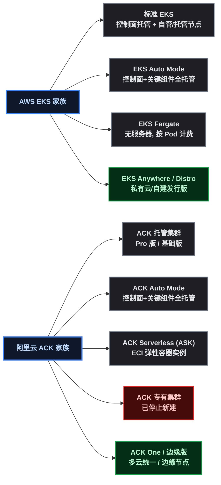
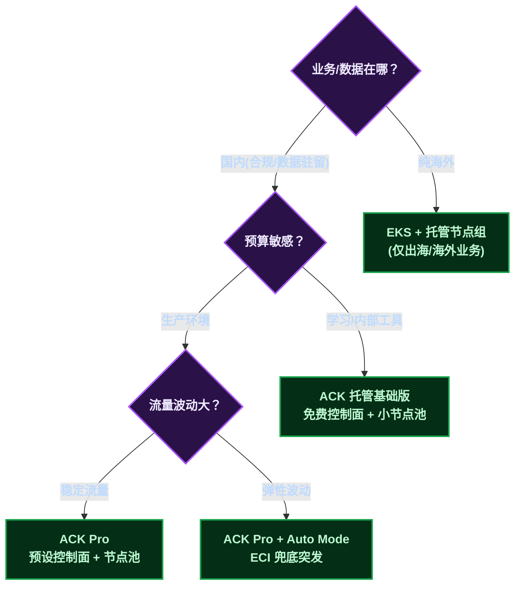

# 两大云托管 K8s 摆一起：差在哪，小公司怎么选

上一篇《Java 开发工程师的 K8s 职责清单》里用一小节对比了 AWS EKS 和阿里云 ACK，写的时候发现这个题目值得单独成篇——两家都在做"托管"，但**计费模型、产品线布局、生态绑定的差异**直接决定学习成本和选型结果，尤其对预算敏感的中小企业。

这篇把两家云托管 K8s 摊开对比：先看产品线布局，再看计费模型（最影响选型的部分），然后是全维度差异表，最后给中小企业三档推荐配置。文末记录了本次调研的时间与文档版本，方便读者核对时效。

> ⚠️ 声明：本文所有对比数据来自对两家官方文档的**实际检索**（检索时间见文末附录），不依赖二手资料。价格可能随时调整，实际以云厂商账单为准。

## 1. 产品线布局：两家各摆了几个形态

先说总览。两家都从"标准托管集群"出发，各自长出了一整条产品线：

几个值得注意的点：

- **形态高度对应**：EKS 的 Fargate ≈ ACK 的 Serverless（ASK）+ ECI；EKS Auto Mode ≈ ACK Auto Mode；EKS Anywhere ≈ ACK 的边缘/混合形态。行业在同一个方向上收敛。
- **ACK 专有集群已停止新建**——这是官方公告确认的（文档页面明确标注"已停止新建集群"）。自建控制面这条路在阿里云上被正式关闭了，托管是唯一方向。
- **EKS 的差异化**：EKS Distro/Anywhere 把"AWS 管理面"延伸到私有云，是 AWS 在混合云上的筹码；阿里云对应的是 ACK One（多云集群管理）和边缘节点池。

## 2. 计费模型：最影响选型的一节

控制面计费是两家**最本质**的差异，直接决定学习成本和小团队起步成本。

| 项目 | AWS EKS | 阿里云 ACK |
|------|------|------|
| 控制面（标准版本支持） | **0.10 美元/小时/集群** ≈ 73 美元/年 | 基础版**免费**；Pro 版 0.64 元/小时 ≈ 4,600 元/年 |
| 扩展版本支持 | 0.60 美元/小时（标准 + 0.50） | 无此概念，走版本节奏管理 |
| Serverless 形态 | Fargate 按 Pod 计费（另计） | ECI 按实例计费（另计） |
| 节点费用 | EC2 实例费（另计） | ECS 实例费（另计） |
| 其他关联 | 无强制关联产品 | 基础版不强制，Pro 可选预设控制面 |

算一笔小账（控制面部分，不含节点）：

- **个人学习**：EKS 一个集群挂一年 ≈ 73 美元；ACK 托管基础版 **0 元**（限制：单账号最多 2 个集群、单集群最多 10 个 Worker 节点，不可提额——对学习和测试完全够用）。
- **小团队生产**：ACK Pro 版 0.64 元/小时 ≈ 4,600 元/年/集群，换来 100 集群配额、5000 节点上限和预设控制面（性能可预期）；EKS 的控制面账单是 73 美元/年，但要注意：**EKS 所有集群都要付控制面费**，多环境（dev/staging/prod 各一个集群）就是 ×3。

**EKS 的隐藏卖点**：扩展版本支持（Standard + Extended）允许付费延长 Kubernetes 版本生命周期——对"不想频繁升级"的生产环境有价值；ACK 走阿里云自己的版本节奏，没有付费延长选项。

## 3. 全维度差异表

| 维度 | AWS EKS | 阿里云 ACK |
|------|------|------|
| 控制面 | 全托管 | 全托管（基础版免费 / Pro 版收费） |
| 控制面规格 | 预置控制面板（Provisioned Control Plane，可选容量级别） | Pro 预设控制面（Pro XL / 2XL / 4XL，可升降档） |
| 集群形态 | 标准 / Auto Mode / Fargate / Anywhere | 托管（Pro/基础）/ Auto Mode / Serverless（ASK）/ 专有（停新） |
| 节点管理 | 托管节点组 / 自管节点 / Fargate | 节点池（托管）/ ECI |
| 网络插件 | VPC CNI（Pod 直连 VPC，单一方案） | Terway（VPC 原生）/ Flannel 可选 |
| 身份体系 | IRSA（IAM Roles for Service Accounts） | RRSA（RAM Roles for Service Accounts） |
| 镜像仓库 | ECR | ACR |
| 监控 | CloudWatch Container Insights / 托管 Prometheus（AMP） | ARMS 托管监控 |
| 日志 | CloudWatch Logs | SLS 日志服务 |
| 负载均衡 | ALB / NLB | SLB |
| 集群规模 | 按需扩展 | 基础版 2 集群 / 10 节点（固定上限）；Pro 版 100 集群 / 5000 节点 |
| 混合云/边缘 | EKS Anywhere / Outposts | ACK One / 边缘节点池 |

**对开发者最实用的三条结论**：

1. **网络差异最小**：两家都是 VPC 原生网络（Pod 拿 VPC 地址），Terway 和 VPC CNI 概念等价，只是 ACK 多给了 Flannel 这个兼容选项。
2. **身份体系是"同构换名"**：IRSA 和 RRSA 做的事情完全一样——给 ServiceAccount 绑云上角色，让 Pod 拿到最小权限访问云资源。学一个，另一个自动会。
3. **监控/日志/镜像全是生态绑定**：选云 = 选生态，这些产品没有通用替代，迁移成本都在这里。

## 4. 中小企业推荐配置

结合上面的差异，给三档参考配置。前提先说清楚：**国内业务（数据驻留合规）基本锁定阿里云**——数据出境、等保、备案这些因素下，AWS 中国区之外的区域不满足国内合规；出海或纯海外业务才谈得上 EKS。

### 档位一：个人学习 / 内部工具（月成本 ≈ 0 ~ 100 元）

| 项 | 推荐 |
|------|------|
| 集群 | ACK 托管**基础版**（控制面免费） |
| 节点 | 1 ~ 3 台 2C4G 按量 ECS（随用随关） |
| Serverless 补充 | ACK Serverless（ECI）跑突发任务，按秒计费 |
| 监控 | ARMS 免费额度 / 自建 Prometheus（基础版够用） |

要点：基础版的 2 集群/10 节点上限对学习完全够，控制面 0 元是最大优势。EKS 在这个档位的劣势是控制面年费 73 美元——除非团队已经在 AWS 生态。

### 档位二：小团队生产（月成本 ≈ 500 ~ 2000 元）

| 项 | 推荐 |
|------|------|
| 集群 | ACK 托管 **Pro 版**（预设控制面 Pro 起步） |
| 节点 | 节点池 3 ~ 5 台 4C8G（按量 + 抢占式混跑） |
| 多环境 | dev/staging 用基础版省钱，prod 用 Pro 版 |
| 监控/日志 | ARMS + SLS（开箱即用） |

要点：Pro 版的预设控制面解决"控制面扩容不确定"的生产痛点；多环境策略（dev 免费、prod 付费）是控制成本的关键姿势。EKS 对应方案是标准 EKS + 托管节点组，控制面账单按环境数累加。

### 档位三：成长型 / 弹性波动业务（月成本视流量）

| 项 | 推荐 |
|------|------|
| 集群 | ACK Pro + **Auto Mode**（控制面+关键组件全托管） |
| 弹性 | 节点池自动伸缩 + ECI 兜底突发流量 |
| 成本优化 | 抢占式实例跑无状态任务，Spot 策略 |
| 容灾 | 多可用区节点池 + ACK One 跨集群 |

要点：Auto Mode 是两家共同的"下一代"方向——把节点运维也托管掉；突发流量用 ECI 兜底可以避免"为峰值买常驻机器"。

## 5. 附录：调研时间与文档版本

本文对比数据来自以下官方文档的**实际检索**（浏览器直接访问，非二手资料）：

| 来源 | 文档 | 检索/更新时间 |
|------|------|------|
| AWS | EKS 定价页（中文站） | 2026-08 访问 |
| AWS | EKS 用户指南：Manage compute resources | 2026-08 访问 |
| 阿里云 | ACK 集群概述（ACK托管与专有集群） | 文档更新时间 **2026-05-19** |
| 阿里云 | ACK 产品计费 | 2026-08 访问 |
| 阿里云 | ACK Serverless（ASK）+ ECI 文档 | 文档更新 2026-06-07 |
| 阿里云 | RRSA 使用文档 | 文档更新 2026-08-11 |

**时效性提示**：云产品价格和功能迭代很快（EKS 的"预置控制面板"、ACK 的"Auto Mode"都是较新的能力），读者选型前请以官方文档最新内容为准。

## 6. 总结

两家云托管 K8s 的对比，可以浓缩成三句话：

1. **形态同构，行业趋同**：Auto Mode、预设控制面、Serverless 全对齐——托管战争的焦点已经从"管不管控制面"变成"还能替你管掉什么"；
2. **计费差异最实在**：ACK 基础版免费控制面适合学习与小团队，EKS 控制面按小时计费但扩展版本支持是独有卖点；
3. **生态绑定决定选型**：IRSA/RRSA、ARMS/CloudWatch、ACR/ECR 全绑定，**国内业务合规锁定阿里云，出海业务才谈 EKS**——中小企业按"数据在哪、预算多少、波动多大"三条走决策树即可。

（本篇无图片/视频占位。）
