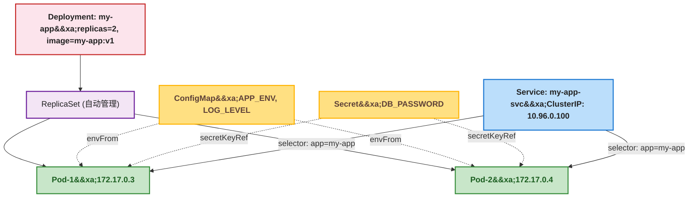
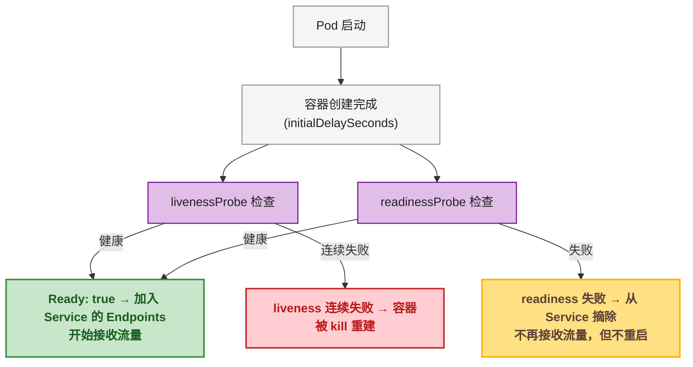
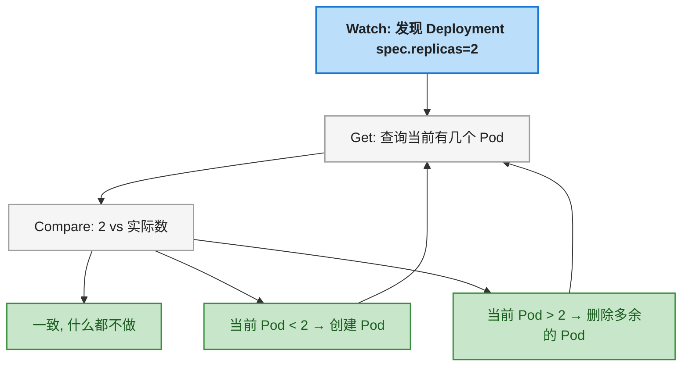

# 第1步：写出你的第一个 K8s 应用

## 一、目标说明

上一篇文章把 Docker 和 K8s 的概念地图铺开了。这篇文章要做的是：**真正动手，在本地 K8s 集群上部署一个完整的应用**。

读完这篇文章，读者能：

- 验证本地 K8s 环境是否可用
- 写出一个完整的 Deployment YAML（并理解每一行在说什么）
- 写出 Service 让 Pod 可以稳定访问
- 用 ConfigMap 和 Secret 把配置从镜像里拆出来
- 用 `kubectl apply` 把整套东西一键部署
- 通过 `kubectl port-forward` 在浏览器里访问应用

---

## 二、前置条件

| 前置条件 | 要求 | 验证命令 |
|----------|------|----------|
| Docker Desktop 已安装 | 4.x+ | `docker version` |
| Kubernetes 已开启 | Docker Desktop Settings → Kubernetes → Enable Kubernetes | `kubectl cluster-info` |
| kubectl 已安装 | Docker Desktop 自带 | `kubectl version --client` |
| 上一篇的概念理解 | 知道 Image / Container / Pod / Deployment / Service 是什么 | 脑子过一遍层级：Image → Container → Pod → Deployment |

如果 `kubectl cluster-info` 输出类似以下内容，说明环境就绪：

```
Kubernetes control plane is running at https://127.0.0.1:6443
CoreDNS is running at https://127.0.0.1:6443/api/v1/...
```

> ⚠️ 新手提示：Docker Desktop 的 K8s 是单节点集群（你的电脑就是唯一一个 Node），但不影响学习——Deployment、Service、ConfigMap 的行为跟生产多节点集群完全一致。唯一区别是没地方看"跨 Node 调度"。

---

## 三、环境搭建

### 3.1 确认 Node 就绪

```bash
kubectl get nodes
```

期望输出：

```
NAME             STATUS   ROLES           AGE   VERSION
docker-desktop   Ready    control-plane   1d    v1.28.x
```

`STATUS` 必须是 **Ready**。如果不是，等一两分钟再试（Docker Desktop 启动 K8s 需要时间）。

### 3.2 创建一个工作目录

```bash
mkdir ~/k8s-first-app
cd ~/k8s-first-app
```

所有 YAML 文件都放在这个目录下。

---

## 四、分步实践

要部署的应用很简单：一个 Spring Boot（或任何 HTTP 服务）暴露 `/health` 端点。数据库密码从 Secret 注入，环境配置从 ConfigMap 注入。

整个部署涉及 4 个资源：



### 4.1 第一步：创建 Namespace（可跳过，但建议做）

把所有实验资源放进独立的 Namespace，避免跟系统资源混在一起，清理也方便：

```yaml
apiVersion: v1
kind: Namespace
metadata:
  name: my-first-app
```

保存为 `00-namespace.yaml`，执行：

```bash
kubectl apply -f 00-namespace.yaml
```

后续所有命令都加 `-n my-first-app`。

### 4.2 第二步：创建 ConfigMap —— 非敏感配置

ConfigMap 存的是"换了环境要改、但不涉及密码"的东西：

```yaml
apiVersion: v1
kind: ConfigMap
metadata:
  name: app-config
  namespace: my-first-app
data:
  APP_ENV: "production"
  LOG_LEVEL: "info"
  SERVER_PORT: "8080"
```

保存为 `01-configmap.yaml`。

**每一行解释：**

| 字段 | 含义 |
|------|------|
| `apiVersion: v1` | ConfigMap 属于核心 API 组 v1 版本 |
| `kind: ConfigMap` | 资源类型 |
| `metadata.name` | 给 ConfigMap 起名字，后面 Deployment 通过这个名字引用它 |
| `metadata.namespace` | 放在哪个 Namespace（ConfigMap 只在同 Namespace 内可见） |
| `data` | 键值对，key 是大写的环境变量名，value 是值 |

> ⚠️ 新手提示：ConfigMap 的大小上限是 **1MB**。别想把几百 KB 的 JSON 配置文件塞进去——配置文件应该用挂载方式（Volume Mount），后面会讲。

### 4.3 第三步：创建 Secret —— 敏感信息

```yaml
apiVersion: v1
kind: Secret
metadata:
  name: app-secret
  namespace: my-first-app
type: Opaque
stringData:
  DB_PASSWORD: "MySecretP@ssw0rd!"
  REDIS_PASSWORD: "RedisP@ss123"
```

保存为 `02-secret.yaml`。

**每一行解释：**

| 字段 | 含义 |
|------|------|
| `type: Opaque` | 通用类型 Secret，可以存任意键值对（Opaque = 不透明的，即 K8s 不关心里面是什么） |
| `stringData` | **明文**写密码，`kubectl apply` 时 K8s 自动 Base64 编码存到 `data` 字段 |
| `data` vs `stringData` | `data` 要求值已经是 Base64 编码，`stringData` 可以直接写明文（省去手动 `echo -n xxx | base64`） |

> ⚠️ 新手提示：`stringData` 只是**写入时**的便利字段。Secret 存到 etcd 后只有 `data`（Base64 编码）。Base64 ≠ 加密，任何人拿到 `kubectl get secret -o yaml` 然后 `echo "xxx" | base64 -d` 就能看到明文。生产环境加密需要 Sealed Secrets 或云 KMS。

### 4.4 第四步：创建 Deployment —— 主角登场

这是整篇文章最重要的 YAML：

```yaml
apiVersion: apps/v1
kind: Deployment
metadata:
  name: my-app
  namespace: my-first-app
  labels:
    app: my-app
spec:
  replicas: 2
  selector:
    matchLabels:
      app: my-app
  template:
    metadata:
      labels:
        app: my-app
    spec:
      containers:
      - name: app
        image: nginx:1.25-alpine
        ports:
        - containerPort: 80
        env:
        - name: DB_PASSWORD
          valueFrom:
            secretKeyRef:
              name: app-secret
              key: DB_PASSWORD
        envFrom:
        - configMapRef:
            name: app-config
        resources:
          requests:
            memory: "64Mi"
            cpu: "100m"
          limits:
            memory: "128Mi"
            cpu: "200m"
        livenessProbe:
          httpGet:
            path: /
            port: 80
          initialDelaySeconds: 10
          periodSeconds: 10
        readinessProbe:
          httpGet:
            path: /
            port: 80
          initialDelaySeconds: 5
          periodSeconds: 5
```

保存为 `03-deployment.yaml`。

**逐段拆解：**

#### metadata —— 资源的"身份证"

```yaml
metadata:
  name: my-app               # Deployment 的名字
  namespace: my-first-app    # 放在哪个 Namespace
  labels:
    app: my-app              # 标签，Service 用这个标签找到 Pod
```

> ⚠️ 新手提示：Deployment 的 `labels` 和 `spec.selector.matchLabels` 以及 `spec.template.metadata.labels` 是三个东西，但它们通常**设置成一样的值**。第一次看这段大概率一脸懵——下面展开。

#### spec.selector —— "这个 Deployment 管哪些 Pod"

```yaml
spec:
  selector:
    matchLabels:
      app: my-app            # 管所有带 "app=my-app" 标签的 Pod
```

这行告诉 Deployment："你的管辖范围是所有带了 `app=my-app` 标签的 Pod"。如果 Deployment 发现管辖的 Pod 数量不对（少了或多了），就会去修正。

#### spec.template —— Pod 模板（"如果不够，就照这个模子造"）

```yaml
spec:
  template:
    metadata:
      labels:
        app: my-app          # 新 Pod 打上这个标签（必须匹配 selector!）
    spec:                    # Pod 的内容规格
```

> ⚠️ 新手提示：`template.metadata.labels` **必须**包含 `selector.matchLabels` 里的所有键值对。如果不匹配，Deployment 会说"我管 3 个 Pod，但我找不到它们"——因为标签对不上。

#### containers —— Pod 里跑什么

```yaml
containers:
- name: app
  image: nginx:1.25-alpine   # 镜像名（默认从 Docker Hub 拉）
  ports:
  - containerPort: 80        # 容器监听哪个端口（声明式，不影响实际监听）
```

| 字段 | 必须？| 说明 |
|------|:---:|------|
| `name` | 必须 | 容器的名字，Pod 内唯一 |
| `image` | 必须 | 镜像名 + tag，默认从 Docker Hub 拉 |
| `containerPort` | 建议写 | 只是一个"声明"（不写容器也能监听），但写了别人看 YAML 才知道端口 |

#### env 和 envFrom —— 环境变量注入

```yaml
env:
- name: DB_PASSWORD                  # 环境变量名
  valueFrom:                         # 从外部来源拿值
    secretKeyRef:
      name: app-secret               # Secret 的名字
      key: DB_PASSWORD               # Secret 里的哪个 key

envFrom:
- configMapRef:
    name: app-config                 # 把整个 ConfigMap 的所有 key 都注入为环境变量
```

两种注入方式的区别：

| 方式 | 适用场景 |
|------|----------|
| `env[].valueFrom.secretKeyRef` | 只需要 Secret 里的某一个 key，或者想改环境变量名 |
| `envFrom[].configMapRef` | 把整个 ConfigMap 的所有 key 都注入（key 名 = 环境变量名） |

#### resources —— CPU 和内存限制

```yaml
resources:
  requests:             # 调度时"保底"分配的量
    memory: "64Mi"
    cpu: "100m"         # 100m = 0.1 核
  limits:               # 容器能使用的上限
    memory: "128Mi"
    cpu: "200m"
```

| 字段 | 含义 | 超限后果 |
|------|------|----------|
| `requests` | 调度器保证分配的**最低**资源 | 没有 requests 的 Pod 可能被调度到资源已满的 Node |
| `limits` | 容器能用的**上限** | CPU 超限→被限流（变慢），内存超限→**OOMKilled（直接杀）** |

> ⚠️ 新手提示：**务必给所有容器设置 memory limits**。没有 limits 的容器内存泄漏会吃掉整个 Node 的内存，导致其他 Pod 被 Evicted（驱逐）。这是生产环境最常见的血案。

#### 探针 —— livenessProbe 和 readinessProbe

```yaml
livenessProbe:          # 存活探针：容器还活着吗？
  httpGet:
    path: /
    port: 80
  initialDelaySeconds: 10   # 启动后等 10 秒再开始检查
  periodSeconds: 10         # 每 10 秒检查一次

readinessProbe:         # 就绪探针：能接流量了吗？
  httpGet:
    path: /
    port: 80
  initialDelaySeconds: 5
  periodSeconds: 5
```

**这两个探针解决完全不同的问题：**



| 探针 | 失败后果 | 典型用例 |
|------|----------|----------|
| `livenessProbe` | **Kill 容器，重建** | 死锁、无限循环、进程僵死 |
| `readinessProbe` | **从 Service 摘除**（不重建）| 依赖还没就绪（数据库还没连上）、预热中、临时过载 |

> ⚠️ 新手提示：**livenessProbe 的 `initialDelaySeconds` 一定要大于应用启动时间**。如果应用需要 30 秒启动，你把 liveness 设成 5 秒——恭喜，Pod 永远起不来，陷入"启动→探针失败→被 kill→重启→启动→探针失败"的死循环（CrashLoopBackOff）。

### 4.5 第五步：创建 Service —— 给 Pod 一个不变的联系方式

```yaml
apiVersion: v1
kind: Service
metadata:
  name: my-app-svc
  namespace: my-first-app
spec:
  type: ClusterIP
  selector:
    app: my-app
  ports:
  - port: 80           # Service 自己监听的端口
    targetPort: 80     # Pod 中容器的端口
    protocol: TCP
```

保存为 `04-service.yaml`。

**每一行解释：**

| 字段 | 含义 |
|------|------|
| `type: ClusterIP` | 集群内部 IP（默认），只能集群内访问 |
| `selector.app: my-app` | 找所有带 `app=my-app` 标签的 Pod |
| `port: 80` | 访问 Service 时用的端口 |
| `targetPort: 80` | 请求转发到 Pod 容器的哪个端口 |
| `protocol: TCP` | 默认 TCP，可不写 |

### 4.6 第六步：一键部署

所有 YAML 写好后，目录结构：

```
~/k8s-first-app/
├── 00-namespace.yaml
├── 01-configmap.yaml
├── 02-secret.yaml
├── 03-deployment.yaml
└── 04-service.yaml
```

执行（注意文件顺序——Namespace 先创建）：

```bash
kubectl apply -f 00-namespace.yaml
kubectl apply -f 01-configmap.yaml
kubectl apply -f 02-secret.yaml
kubectl apply -f 03-deployment.yaml
kubectl apply -f 04-service.yaml
```

或者一次性 apply 整个目录：

```bash
kubectl apply -f ~/k8s-first-app/
```

K8s 会自动按资源依赖排序（先 Namespace，再 ConfigMap/Secret，再 Deployment，最后 Service——虽然 K8s 实际上不严格限制顺序，但建议按依赖关系 apply）。

---

## 五、部署验证

### 5.1 检查 Deployment 状态

```bash
kubectl get deploy -n my-first-app
```

期望输出：

```
NAME     READY   UP-TO-DATE   AVAILABLE   AGE
my-app   2/2     2            2           30s
```

`READY` 列 `2/2` 表示 2 个 Pod 全部就绪。

### 5.2 检查 Pod 状态

```bash
kubectl get pods -n my-first-app
```

期望输出：

```
NAME                      READY   STATUS    RESTARTS   AGE
my-app-5d8f7b6c9-abcde   1/1     Running   0          45s
my-app-5d8f7b6c9-fghij   1/1     Running   0          45s
```

如果 `STATUS` 不是 `Running`，进入排查模式：

```bash
kubectl describe pod <pod-name> -n my-first-app    # 看 Events 区域
kubectl logs <pod-name> -n my-first-app             # 看容器日志
```

### 5.3 验证 ConfigMap 和 Secret 注入

```bash
kubectl exec -n my-first-app <pod-name> -- env | grep APP_ENV
kubectl exec -n my-first-app <pod-name> -- env | grep DB_PASSWORD
```

期望分别输出 `APP_ENV=production` 和 `DB_PASSWORD=MySecretP@ssw0rd!`。

### 5.4 用 port-forward 访问应用

Service 类型是 ClusterIP，只能集群内访问。开发调试时用 port-forward 把 Pod 端口映射到本地：

```bash
kubectl port-forward -n my-first-app svc/my-app-svc 8080:80
```

打开浏览器访问 `http://localhost:8080`，看到 nginx 欢迎页即部署成功。

> 📌 前置知识：`port-forward` 只在调试阶段用，**不适合生产**。它的原理是在 kubectl 和 API Server 之间建立一条隧道，流量走 kubectl 进程中转——关了终端就断。

### 5.5 体验一把滚动更新

修改 `03-deployment.yaml` 中的镜像版本：

```yaml
image: nginx:1.25-alpine   →   image: nginx:1.26-alpine
```

再次 apply：

```bash
kubectl apply -f 03-deployment.yaml
```

在另一个终端窗口实时观察：

```bash
kubectl get pods -n my-first-app -w
```

会看到旧 Pod 一个接一个变成 Terminating，新 Pod 一个接一个变成 Running——整个过程服务不中断（因为有 2 个副本，至少 1 个始终在运行）。

### 5.6 回滚

```bash
kubectl rollout undo deploy/my-app -n my-first-app
```

回滚到上一个版本。查看历史记录：

```bash
kubectl rollout history deploy/my-app -n my-first-app
```

### 5.7 清理

```bash
kubectl delete namespace my-first-app
```

删除整个 Namespace，里面的 Deployment、Service、ConfigMap、Secret、Pod 全部自动清理。一行搞定。

---

## 六、原理简述

### 6.1 Deployment 控制器循环

Controller Manager 里的 Deployment Controller 运行着一个调谐循环：



这个循环**不是在代码层 for 循环**，而是通过 Watch API Server 事件驱动的。任何资源变更都会触发 Controller 重新检查期望状态和实际状态。

### 6.2 kubectl apply 背后发生了什么

`kubectl apply -f 03-deployment.yaml` 这条命令的背后：

1. kubectl 读取 YAML 文件，序列化成 JSON
2. 向 API Server 发 `POST /apis/apps/v1/namespaces/my-first-app/deployments`
3. API Server 认证 → 授权 → 准入控制 → 写入 etcd
4. Deployment Controller Watch 到新 Deployment → 创建 ReplicaSet
5. ReplicaSet Controller Watch 到新 ReplicaSet → 创建 Pod（此时 `nodeName` 为空）
6. Scheduler Watch 到未调度的 Pod → 选一个 Node → 更新 `nodeName`
7. 对应 Node 上的 kubelet Watch 到分配给自己的 Pod → 调用 Container Runtime 拉镜像、创建容器
8. 容器启动成功 → kubelet 上报 Running → API Server → etcd

这一整套流程通常在 **几秒内** 完成。

---

## 七、总结与下一步

### 7.1 YAML 清单

写 K8s YAML 的最少必要知识：

| 资源 | 最少必填字段 | 一句话用途 |
|------|-------------|-----------|
| Deployment | `spec.replicas` + `selector` + `template` | 管理 Pod 副本、滚动更新、回滚 |
| Service | `spec.selector` + `spec.ports` | 给 Pod 提供稳定 IP 和负载均衡 |
| ConfigMap | `data` | 注入非敏感环境变量 |
| Secret | `stringData`（或 `data`）| 注入密码、Token 等敏感信息 |
| Namespace | `metadata.name` | 资源分组（调试/清理方便） |

### 7.2 下一步

下一篇文章《第 2 步：让 Pod 活得久一点》将深入：

- livenessProbe 和 readinessProbe 的 4 种探测方式（httpGet / tcpSocket / exec / grpc）
- resources 配错导致的血案（OOMKilled、Evicted、CPU Throttling）
- 环境变量注入的 3 种方式（env / envFrom / Volume Mount）
- Pod 为什么一直 Pending / CrashLoopBackOff / ImagePullBackOff
