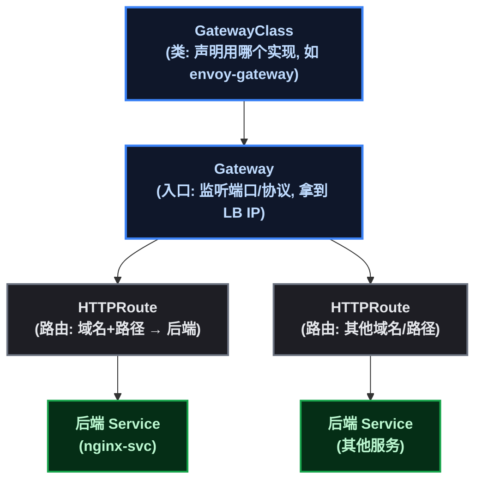
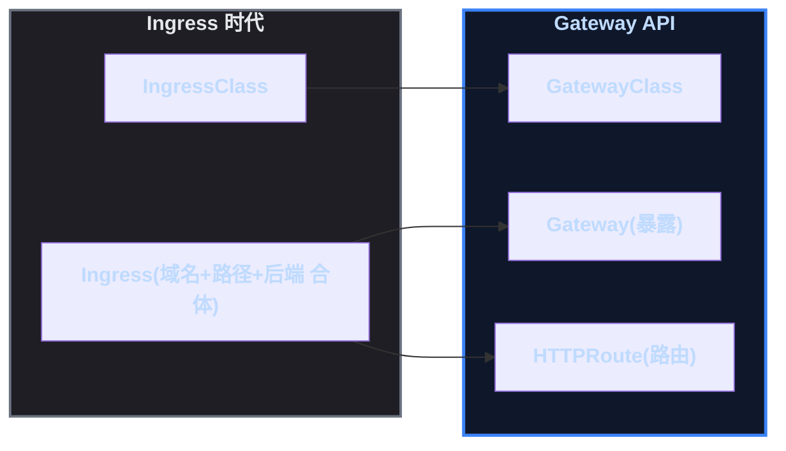

# Ingress 归档了，流量入口的新标准长什么样

先说一个 2026 年的重要事实（本文写作时实测验证）：**kubernetes/ingress-nginx 仓库已于 2026 年 3 月归档**——GitHub API 返回 ` archived: true ` ，最后 release 是 v1.15.1（2026-03-19）。标准 Ingress Controller 停止更新了，但存量集群里的 Ingress 资源不会消失（照常工作），只是**新项目的流量入口应该选新标准：Gateway API**（本文写作时最新 v1.6.1，2026-07 发布，活跃迭代中）。

系列前一篇《Service 与 Ingress 实战》学的 Ingress 并没有白学——Gateway API 的设计目标之一就是**吸收 Ingress 的经验、补上它的短板**，两者资源模型一一对应。这篇在 kind 上用 Envoy Gateway 把 Gateway API 全链路打通：原理（三级资源模型）→ 实践（全部命令）→ 真实踩坑 → 迁移对照。

## 1. 动机先行：为什么要有 Gateway API

| Ingress 的痛点 | Gateway API 的回应 |
|------|------|
| 一个 IngressClass / Ingress 资源，表达力有限（只能按域名+路径路由） | 拆分三级资源：**GatewayClass → Gateway → HTTPRoute**，每级各司其职、可独立复用 |
| 路由规则与暴露方式混在一个资源里 | 暴露（Gateway）与路由（HTTPRoute）**解耦**：同一个 Gateway 可以被多个 HTTPRoute 挂载 |
| 协议扩展靠注解（ ` nginx.ingress.kubernetes.io/xxx ` ），非标准 | 资源模型原生支持 HTTP/TLS/TCP/UDP，扩展用标准 CRD |
| 不同实现行为不一致（nginx/traefik/...） | 规范定义了资源的状态语义（Accepted/Programmed），实现行为更一致 |

**一句话**：Ingress 是"路由规则 + 入口绑在一起"的早期设计，Gateway API 把它拆成"谁提供服务（GatewayClass）→ 入口长什么样（Gateway）→ 流量怎么路由（HTTPRoute）"三层——分层带来复用和表达力。

## 2. 原理：三级资源模型



| 资源 | 一句话职责 | 类比 Ingress 时代 |
|------|------|------|
| **GatewayClass** | 声明"用哪个实现"（envoy-gateway / nginx 等） | 类似 IngressClass，但表达力更强 |
| **Gateway** | 声明"入口长什么样"：监听端口、协议、拿到对外 IP | 类似 Ingress 里的暴露部分（独立出来了） |
| **HTTPRoute** | 声明"流量怎么路由"：域名 + 路径 → 后端 Service | 类似 Ingress 里的路由规则（独立出来了） |

**与 Ingress 的对应关系**（迁移时照着搬就行）：

| Ingress 时代 | Gateway API |
|------|------|
| `IngressClass` | `GatewayClass` |
| ` Ingress ` （暴露 + 路由合体） | ` Gateway ` （暴露）+ ` HTTPRoute ` （路由） |
| `spec.rules[].host` | `HTTPRoute.spec.hostnames` |
| `spec.rules[].http.paths[].path` | `HTTPRoute.spec.rules[].matches[].path` |
| `spec.rules[].http.paths[].backend.service` | `HTTPRoute.spec.rules[].backendRefs` |

## 3. 实践：kind + Envoy Gateway 全打通

环境：kind 一主二从集群（learn）+ metallb（IP 池 ` 172.18.255.1-250 ` ）+ 已有 Service ` nginx-svc ` （3 副本 nginx:1.25，selector ` app=nginx-demo ` ）。

### 3.1 安装 Gateway API CRD

```bash
curl -sL -o /tmp/gateway-crd.yaml \
  "https://github.com/kubernetes-sigs/gateway-api/releases/download/v1.6.1/standard-install.yaml"
kubectl apply -f /tmp/gateway-crd.yaml
```

### 3.2 部署 Envoy Gateway（CNCF 实现，本文选用）

```bash
curl -sL -o /tmp/eg-install.yaml \
  "https://github.com/envoyproxy/gateway/releases/download/v1.9.0/install.yaml"
kubectl apply -f /tmp/eg-install.yaml        # 34 个资源: CRD + 控制器 + RBAC

# 控制器镜像要预载进 kind 节点(节点内 containerd 直连公网拉不动):
docker pull envoyproxy/gateway:v1.9.0
kind load docker-image envoyproxy/gateway:v1.9.0 --name learn
kubectl get pods -n envoy-gateway-system     # envoy-gateway-xxx 1/1 Running
```

### 3.3 创建 GatewayClass（install.yaml 不创建，需手动）

```yaml
apiVersion: gateway.networking.k8s.io/v1
kind: GatewayClass
metadata:
  name: envoy-gateway
spec:
  controllerName: gateway.envoyproxy.io/gatewayclass-controller
```

```bash
kubectl apply -f - <<'EOF'
apiVersion: gateway.networking.k8s.io/v1
kind: GatewayClass
metadata:
  name: envoy-gateway
spec:
  controllerName: gateway.envoyproxy.io/gatewayclass-controller
EOF
kubectl get gatewayclass envoy-gateway
# NAME            CONTROLLER                                      ACCEPTED
# envoy-gateway   gateway.envoyproxy.io/gatewayclass-controller   True
```

### 3.4 创建 Gateway（入口，metallb 分配 IP）

```yaml
apiVersion: gateway.networking.k8s.io/v1
kind: Gateway
metadata:
  name: eg-gw
  namespace: default
spec:
  gatewayClassName: envoy-gateway
  listeners:
  - name: http
    port: 80
    protocol: HTTP
```

```bash
kubectl apply -f eg-gw.yaml
kubectl get gateway eg-gw
# NAME    CLASS           ADDRESS        PROGRAMMED
# eg-gw   envoy-gateway   172.18.255.4   True
```

**注意**：Gateway 的 `PROGRAMMED=True` 意味着控制器已经为它创建了数据面（envoy 代理 pod）——数据面镜像同样要预载：

```bash
docker pull envoyproxy/envoy:distroless-v1.39.0
kind load docker-image envoyproxy/envoy:distroless-v1.39.0 --name learn
kubectl get pods -n envoy-gateway-system -l gateway.envoyproxy.io/owning-gateway-name=eg-gw
# envoy-default-eg-gw-63522087-xxx   2/2 Running
```

### 3.5 创建 HTTPRoute（路由规则）并验证

```yaml
apiVersion: gateway.networking.k8s.io/v1
kind: HTTPRoute
metadata:
  name: nginx-demo-route
  namespace: default
spec:
  parentRefs:
  - name: eg-gw
  hostnames:
  - nginx.local
  rules:
  - backendRefs:
    - name: nginx-svc
      port: 80
```

```bash
kubectl apply -f route.yaml
curl -H "Host: nginx.local" http://172.18.255.4      # HTTP 200, Welcome to nginx!
curl http://172.18.255.4                              # 无匹配 Host → HTTP 404
```

**实测结果**： ` Host: nginx.local ` → **200**（ ` <title>Welcome to nginx!</title> ` ）；不带 Host → **404**——路由匹配精确生效，和 Ingress 的体验一致，但资源是拆开的、可复用的。

## 4. 真实踩坑记录（复现必看）

| # | 坑 | 症状 | 解法 |
|---|------|------|------|
| 1 | **ingress-nginx 已归档** | GitHub API ` archived: true ` （2026-03） | 新项目用 Gateway API；存量照常跑 |
| 2 | **NGF v2.6.7 配置生成 bug** | ` failed to parse config ... "server_tokens" directive ` ——官方配套 nginx 1.31.3 解析不了自己生成的配置（v2.6.7 release notes 明示配套 nginx 1.31.3） | 换 Envoy Gateway（或降级 NGF 旧版） |
| 3 | 控制器镜像节点内拉不动 | ` dial tcp ... i/o timeout ` / ImagePullBackOff | 宿主机 ` docker pull ` （走代理）+ ` kind load docker-image ` |
| 4 | **数据面是独立镜像**（NGF v2 和 Envoy 都是） | 主镜像 load 了，数据面 pod 还是 ImagePullBackOff | 看数据面 pod 事件里要什么镜像，单独 load（Envoy 数据面是 ` envoyproxy/envoy:distroless-v1.39.0 ` ） |
| 5 | Envoy install.yaml 不创建 GatewayClass | 控制器日志 ` failed to get GatewayClass "envoy-gateway" not found ` 、Gateway 卡 PROGRAMMED=False | 手动创建 GatewayClass |
| 6 | kind load 大镜像慢（低配机器） | 命令 300s 超时被 kill | 后台跑（ ` background=true ` ）；再 load 同镜像会提示 ` already present on all nodes ` |

**坑 2 的细节**（值得单独说）：NGINX Gateway Fabric v2.6.7 是 ingress-nginx 归档后最自然的"继任者"，但实测它的配置生成器有 bug——生成的 ` server_tokens ` 指令连它自己配套的 nginx 1.31.3 都解析失败（ ` Config apply failed, rollback successful ` ），数据面永远不就绪。这是**发布级 bug**（官方配套版本自相矛盾），不是操作问题。GitHub issue 无现成 workaround，遂换 Envoy Gateway——**这也说明"Gateway API 是标准，实现可换"正是它的设计价值**。

## 5. Ingress → Gateway API 迁移思路



1. **存量不动**：正在跑的 Ingress 照常工作（控制器不更新但能跑）；
2. **新流量走新标准**：新域名/新服务用 Gateway API（Gateway + HTTPRoute）；
3. **逐条迁移**：按第 2 节的对应表把 Ingress 规则翻译成 HTTPRoute，验证后删 Ingress 资源；
4. **实现选择**：标准 API 之下实现可换——Envoy Gateway（CNCF，本文用）、NGINX Gateway Fabric（但注意 2.6.7 的配置 bug）、Traefik 等，都遵循同一套资源模型。

## 6. 总结

三个记忆点：

1. **Ingress 没有消失，但停止演进**——存量照跑，新项目选 Gateway API（2026 年的事实）；
2. **Gateway API 的核心是分层**：GatewayClass（用哪个实现）→ Gateway（入口长什么样）→ HTTPRoute（流量怎么路由），暴露与路由解耦是它相对 Ingress 的最大改进；
3. **标准 API + 可换实现**：这次实践里 NGF 出 bug 直接换 Envoy Gateway，资源模型一行不用改——这就是"标准"的价值。

（本篇无图片/视频占位。）
