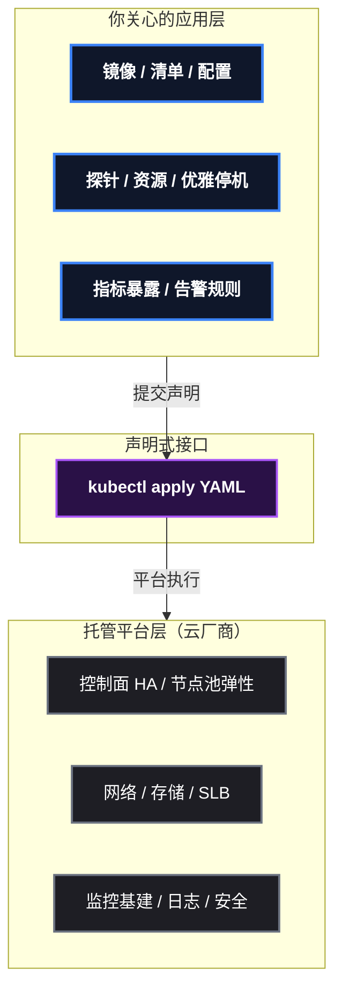
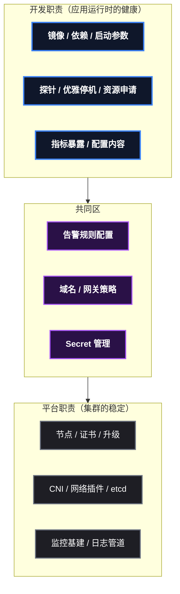

# 开发背一半运维：你的 K8s 职责边界在哪

云原生时代，开发工程师的职责边界变了。以前是"写完代码扔给运维"，现在是"应用怎么跑也写进代码"——Dockerfile、探针、资源申请、优雅停机，这些曾经属于运维的东西，现在都是**开发要交付的代码的一部分**。

但反过来，开发也不该全包运维：集群的节点、证书、网络插件，那不是你的活。这篇给 Java 开发工程师一张清单——**必须会什么、不用学什么、Java 专属的坑有哪些、边界到底划在哪**。本系列的十篇文章是这个清单的展开，这篇是入口。

## 1. 一句话框架：开发背一半运维

判断职责归属，用一条标准就够：

> **"我写的这个应用，在集群里能不能健康地跑起来、出问题我自己能不能查"——这是开发的活；"集群本身能不能稳定运转"——这是平台的活。**

- 应用的健康 = 镜像、探针、资源配置、优雅停机、指标暴露——**开发用代码负责**；
- 集群的稳定 = 节点、etcd、CNI、证书、升级——**平台/运维负责**，开发只需要知道它们存在。

至于中小公司没有专职运维、开发被迫全包——那是资源约束下的现实，不是理想的职责划分。能力可以全栈，但边界心里要有数：**"运维的事"永远会挤占开发时间，不清边界就会被无限稀释。**

## 2. 必须会：八项清单

每一项都标注了"怎么算会了"——能独立完成才算过关。

| # | 技能 | 一句话原理 | 验证标准 | 对应文章 |
|:--:|------|------|------|------|
| 1 | **镜像构建** | 多阶段 Dockerfile 把构建与运行分离，体积从 500MB 级压到 300MB 级 | 能写出 JRE 运行镜像，知道层缓存 | 课1：镜像构建 |
| 2 | **Deployment** | 声明式滚动更新，改清单而不是手工 `docker run` | 能改镜像滚动升级、回滚 | 课1：Deployment 实战 |
| 3 | **配置注入** | ConfigMap/Secret 让配置外部化，改配置不重建镜像 | 能注入环境变量和文件，知道 Secret 只是 base64 | 课3：配置注入 |
| 4 | **Service/Ingress** | ClusterIP 内部调用、NodePort/LB 对外暴露、Ingress 管域名路由 | 能说清三种类型各给谁用 | 课2：Service/Ingress |
| 5 | **探针** | readiness 摘流量、liveness 重启、startup 保护慢启动 | 能给 Spring Boot 配齐三件套 | 课4：探针 |
| 6 | **资源申请** | requests 管调度、limits 管上限，不设就是裸奔 | 能给应用填合理数值并解释依据 | 课5：资源管理 |
| 7 | **优雅停机** | readiness 摘流 + preStop 缓冲 + graceful 处理在途 | 发版时在途请求不断连 | 课5：优雅停机 |
| 8 | **可观测性** | 应用暴露指标端点，监控才有意义 | 能说出 `/actuator/prometheus` 暴露了什么 | 课6：可观测性 |

贯穿八项的还有一个基本功：**排障**—— ` kubectl logs ` 、 ` kubectl describe ` 、 ` kubectl exec ` 是开发者的手电筒，遇到问题第一反应是"进 Pod 看一眼"而不是"重启试试"。

## 3. 云 K8s 替你承担了什么，你只需要关心什么

云原生时代（尤其 ACK 托管版）最大的变化不是"K8s 更好用了"，而是**集群运维从你的世界里被整体移除了**。对照自建集群，看得最清楚：

| 层面 | 自建集群：你要管 | 云托管版：平台替你管 |
|------|------|------|
| 控制面 | 部署 apiserver/etcd/scheduler，管证书、管备份 | 托管，API 开箱即用，控制面 HA |
| 节点 | 买机器、装系统、装 kubelet、处理硬件故障 | 节点池，一键扩缩容，坏节点自动替换 |
| 网络 | 装 CNI、调网络插件、排 overlay 问题 | VPC 一体化，安全组管通断 |
| 存储 | 自己搭 NFS、挂云盘、管 PVC 生命周期 | 动态供应：声明 PVC 自动创建云盘 |
| 入口 | 自己搭 Ingress Controller、配 LB | LoadBalancer 类型 Service 自动建 SLB |
| 镜像 | 自己搭 registry、管镜像仓库 | ACR 私有仓库 + 镜像安全扫描 |
| 监控基建 | 自己部署 Prometheus/Grafana 并维护 | ARMS 托管监控，开箱即用 |
| 日志 | 自己搭 ELK/Loki、管采集管道 | SLS 日志服务，agent 一装即采 |
| 升级/HA/证书 | 集群升级、etcd 备份、证书轮换 | 全托管，点按钮升级 |

**你只需要关心什么？** 回到第 2 节的八项——那就是全部：镜像、Deployment、配置、Service/Ingress、探针、资源、优雅停机、可观测性接入。平台把"集群怎么转"全部拿走，把"应用怎么跑"留给你。

**关键认知：你和集群的交互只剩"声明"**。托管时代你不是在"操作集群"，而是在**提交声明**——写 YAML（我想要什么）， ` kubectl apply ` 提交，平台负责"怎么实现"。探针、资源、优雅停机这些声明是应用侧最后的"代码"，所以它们才必须是开发的活。

下面第 4 节"不用学"就是这个图的必然推论：平台已经替你承担了，你当然不用会操作。

### 3.1 同样是"托管"，AWS EKS 和阿里云 ACK 差在哪

"托管"听起来一样，但两家实现细节差异很大，直接影响选型和**学习成本**。以下对比基于 2026 年 8 月对两家官方文档的实际检索（价格以实时账单为准）：

| 维度 | AWS EKS | 阿里云 ACK |
|------|------|------|
| 集群形态 | 标准 EKS / Auto Mode | 托管集群（Pro/基础）/ 专有集群（**已停止新建**）/ Auto Mode / Serverless（ASK） |
| 控制面计费 | **0.10 美元/小时/集群**（扩展版本支持 0.60 美元） | 基础版**免费**；Pro 版 0.64 元/小时 |
| 控制面规格 | 预置控制面板（可选控制面容量级别） | Pro 预设控制面（Pro XL / 2XL / 4XL，可升降档） |
| Serverless 形态 | Fargate（按 Pod 计费） | ECI 弹性容器实例（ACK Serverless 集群） |
| 节点管理 | 托管节点组 / 自管节点 | 节点池（托管） |
| 集群规模 | 按需扩展 | 基础版单账号 2 集群、单集群 10 节点（个人够用，不可提额）；Pro 版 100 集群 / 5000 节点 |
| 网络插件 | VPC CNI（Pod 直连 VPC，单一方案） | Terway（VPC 原生）/ Flannel 可选 |
| 身份体系 | IRSA（IAM Roles for Service Accounts） | RRSA（RAM Roles for Service Accounts） |
| 镜像仓库 | ECR | ACR |
| 监控 | CloudWatch Container Insights / 托管 Prometheus | ARMS 托管监控 |
| 日志 | CloudWatch Logs | SLS 日志服务 |
| 负载均衡 | ALB / NLB | SLB |

对开发者最有意义的三个差异：

**1. 计费模型决定学习成本**。ACK 托管基础版**不收集群管理费**（只付节点钱），单账号 2 集群、单集群 10 节点的上限对个人学习测试完全够用——这是低成本上手云上 K8s 的优势；EKS 每个集群每小时 0.10 美元，学习集群挂一个月就是一笔可见账单（约 73 美元/年/集群）。反过来，EKS 的"扩展版本支持"允许付费延长 K8s 版本生命周期，ACK 则按版本节奏管理。

**2. 产品线高度同构，说明行业在趋同**。两家都在做"Auto Mode（控制面+关键组件全托管）、预设控制面（性能可预期）、Serverless 形态"——托管战争的焦点已经不是"管不管控制面"，而是"**还能替你管掉什么**"。学通一家的概念，另一家只是改名字（IRSA/RRSA、ARMS/CloudWatch、ACR/ECR、SLB/ALB）。

**3. 选型即选生态**。身份体系绑定 IAM/RAM、监控绑定自家产品、镜像绑定自家仓库——跨云迁移时这些都是沉没成本。个人学习不必纠结（概念通用），企业选型才需要把"生态绑定"算进总拥有成本。

## 4. 不用学：三类运维课（认清边界）

这三类不是"不重要"，是**不需要你会操作**——托管版（ACK）已经替你做了：

| 免学项 | 它是什么 | 为什么不用学 |
|------|------|------|
| kubeadm 装集群 | 二进制部署控制面、初始化集群 | ACK 开箱即用，集群是"买来的"不是"装出来的" |
| HA / etcd 备份 / 证书轮换 | 控制面高可用、数据备份、PKI 管理 | 平台生命周期管理，云厂商全包 |
| CNI 网络插件 | flannel/calico 的原理与排障 | 托管版网络由平台维护，开发只用 Service/Ingress |

原则是：**学概念（知道它们是什么、为什么存在），不学操作（不用会装、会修）**。面试能讲清"etcd 存什么"，现场不用会备份 etcd。

## 5. Java 专属的五个坑

前八项是通用技能，这一节是 **Java 专属**——每个坑都配了"症状 → 原理 → 解法"。

### 坑 1：JVM 堆按宿主机内存算，容器里被杀

**症状**：Pod 内存占用看着没超 limits，却被 OOMKilled；或 JVM 堆上限远大于容器限额。

**原理**：JVM 默认按**宿主机**内存算堆（老版本 `-Xmx` 取物理内存 1/4），容器里看到的还是宿主机数值——堆没超容器限额的错觉就是这么来的。

**解法**：Java 10+ 用 ` -XX:MaxRAMPercentage=75 ` （按容器限额的 75% 设堆），本系列镜像就是这么配的。别手写 ` -Xmx ` 写死。

### 坑 2：慢启动撞上探针，无限重启

**症状**：Pod 一直 CrashLoopBackOff，日志里应用其实在正常启动，只是 20 秒后才就绪。

**原理**：Spring Boot 启动要 5 ~ 30 秒（类加载 + 初始化），liveness 探针在启动完成前就失败，被 kubelet 反复重启。

**解法**：加 ` startupProbe ` （宽限 30 ~ 60 秒），启动期只让 startup 说话，启动完 liveness 再接管。

### 坑 3：发版必现 502 / 连接中断

**症状**：滚动升级瞬间，用户请求偶发 502，或日志里在途请求被掐断。

**原理**：Pod 收到 SIGTERM 立即退出，在途请求没人处理；或流量还在打到正在退出的 Pod。

**解法**：三层配合——readiness 先摘流（新 Pod 就绪前旧的不退）+ preStop 缓冲（sleep 5 等流量摘完）+ 应用内 graceful（Spring Boot 的 `server.shutdown: graceful` 处理完在途请求）。

### 坑 4：配置写死在代码/镜像里

**症状**：改个数据库地址要重新构建镜像；不同环境用同一份配置。

**原理**：配置没外部化，环境差异全耦合在镜像里。

**解法**：ConfigMap 管非敏感配置、Secret 管密码，环境变量或文件挂载注入。改配置 = 改 ConfigMap，不重建镜像。

### 坑 5：日志写文件，容器一重启全没

**症状**： ` kubectl logs ` 看不到应用日志；Pod 重启后日志文件消失。

**原理**：容器日志只认 **stdout/stderr**—— ` kubectl logs ` 读的是容器标准输出，文件日志既看不到也随容器消亡（除非挂卷）。

**解法**：Java 应用日志输出到 stdout（Logback 配 ` ConsoleAppender ` ），采集管道（Loki/ELK）从 stdout 收。这也是本系列唯一没展开、但生产必踩的坑——补在这里。

## 6. 职责边界：一张表划清

| 场景 | 开发 | 平台/运维 |
|------|:---:|:---:|
| 镜像、依赖、启动参数 | ✅ | |
| 探针、优雅停机、资源申请 | ✅ | |
| 配置内容（ConfigMap 值） | ✅ | |
| Secret 管理机制、密钥轮换 | | ✅（内容开发给） |
| Service/Ingress 定义 | ✅（参与） | ✅（网关/证书） |
| 指标暴露 | ✅ | |
| 采集管道、监控基建（Prometheus 本身） | | ✅ |
| 告警规则 | ✅（业务指标） | ✅（基础设施） |
| 集群生命周期（节点/证书/升级） | | ✅ |
| 镜像安全扫描 | ✅（依赖漏洞） | ✅（准入控制） |

## 7. 遇到问题去哪查：症状索引

| 现象 | 第一反应 | 去查 |
|------|------|------|
| Pod 一直 Pending | `kubectl describe` 看调度事件 | 课5：资源管理（requests 超量） |
| CrashLoopBackOff | `kubectl logs` 看启动日志 | 课4：探针（慢启动/探针误杀） |
| 发版断连 / 502 | 看 deployment 滚动过程 | 课5：优雅停机 |
| 配置不生效 | `kubectl get cm/secret` 对比 | 课3：配置注入 |
| 访问不通 | 从 Pod 内 curl Service DNS | 课2：Service/Ingress |
| 指标看不到 | 先 curl `/actuator/prometheus` | 课6：可观测性 |
| 镜像构建慢 / 拉取失败 | 看层缓存与镜像源 | 课1：镜像构建 |
| 命令记不住 | 别背，用速查 | Kubectl 生存手册 |

## 8. 总结

一张清单收尾：

- **必须会八项**：镜像、Deployment、配置、Service/Ingress、探针、资源、优雅停机、可观测性——每一项都是"应用运行时健康"的一部分，是开发的代码责任；
- **平台替你承担了**：控制面、节点、网络、存储、入口、镜像、监控基建、日志——托管的本质是把"集群运维"从你的世界整体移除，留给你的是"应用声明"（YAML 即接口）；
- **不用学三类**：kubeadm、HA/etcd、CNI——概念知道，操作免学，边界在此；
- **Java 五个坑**：JVM 内存、慢启动、发版 502、配置写死、日志写文件——症状都见过，解法都在清单里。

一句话：**开发背一半运维——应用这半边是你的，集群那半边不是**。中小公司没有专职运维时你可以全包，但那是因为"没人干"，不是因为"这本来就该你干"。心里有边界，手上才有优先级。

