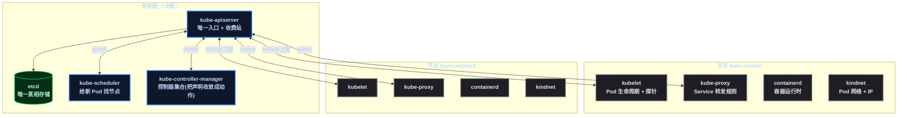
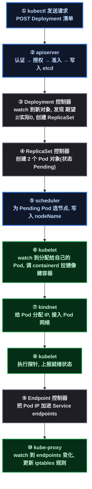
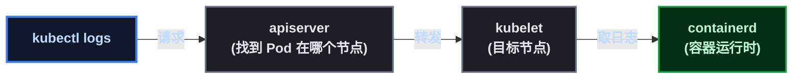

# 谁在干活：kubectl 命令背后的组件分工

系列前十几篇，集群一直当"黑盒"用—— ` kubectl apply ` 一个清单，应用就起来了，至于**是谁把这件事做完的**，没拆开看过。对兼职运维来说，这个黑盒必须拆开：排障的第一问不是"怎么修"，而是"**哪一环出了问题、该看谁**"——Pod 一直 Pending 是调度的问题还是资源的问题？探针失败是应用的问题还是 kubelet 的问题？服务访问不通是 Service 配置还是网络插件？**组件职责 = 排障归属地图**。

这篇用一条生产里每天都在用的命令（ ` kubectl apply ` ）当主线案例，把控制面四个组件和节点四个组件的职责、工作流程讲清楚，并用 kind 集群上的**实测事件**证明"谁在干活"。理论向，不做源码级剖析——兼职运维只需要知道"每个组件干什么、出了事找谁"。

## 1. 组件全景：控制面管"想"，节点管"做"

K8s 的所有组件分成两组，职责边界非常清晰：

- **控制面（control plane）**：负责**决策**——存状态、做调度、收敛声明，全在控制面；
- **节点（node）**：负责**执行**——拉镜像、起容器、转发流量、管网络，全在节点。



在 kind 里这些组件都是真实运行的 Pod（生产 K8s 同款，只是 kind 把它们跑在 Docker 里）。看它们：

```bash
kubectl get pods -n kube-system
```

我集群上的实际输出（组件清单）：

```text
etcd-learn-control-plane                    Running   ← 控制面
kube-apiserver-learn-control-plane          Running   ← 控制面
kube-controller-manager-learn-control-plane Running   ← 控制面
kube-scheduler-learn-control-plane          Running   ← 控制面
kube-proxy-9wt6c / -c8cxk / -f4rp4          Running   ← 每节点一个
kindnet-4bc92 / -9mmgq / -bpnbc             Running   ← 每节点一个(CNI)
coredns-589f44dc88-fnj77 / -l6rjv           Running   ← 集群 DNS
```

### 1.1 控制面四组件：一句话职责

| 组件 | 一句话职责 | 对应命令/现象 |
|------|------|------|
| **kube-apiserver** | K8s 的**唯一入口**：所有读写请求都过它，负责认证（你是谁）、授权（你能干什么）、准入（合不合规），然后读写 etcd | `kubectl` 的任何命令第一站都是它 |
| **etcd** | **唯一真相**：集群所有状态（资源对象、配置、期望状态）的键值存储，带 watch 能力 | 集群状态持久化都在这 |
| **kube-scheduler** | **调度器**：给新 Pod 挑一个合适的节点（看资源余量、污点、亲和性），只决定"放哪"，不负责"启动" | Pod 一直 Pending → 找它 |
| **kube-controller-manager** | **控制器集合**：Deployment 控制器、ReplicaSet 控制器、Node 控制器……每个控制器一个控制回路，把"声明"收敛成"动作" | ` kubectl scale ` 、自愈、滚动全是它 |

> 📌 前置知识：apiserver 是"收费站"，etcd 是"账本"——收费站把所有请求登记进账本，其他组件（scheduler/controller/kubelet）全都通过 watch 账本变化来感知"该干活了"，干完活再写回账本。**所有组件不直接对话，只通过 apiserver + etcd 间接协作**——这是理解一切工作流程的关键。

### 1.2 节点四组件：一句话职责

| 组件 | 一句话职责 | 对应命令/现象 |
|------|------|------|
| **kubelet** | 节点代理（agent）：管理分配给本节点的 Pod（创建/销毁容器）、**执行探针**、向 apiserver 上报节点和 Pod 状态 | 探针失败、节点 NotReady → 找它 |
| **kube-proxy** | 把 Service 的虚拟 IP 翻译成转发规则（iptables/ipvs），实现负载均衡 | 服务访问不通 → 找它 |
| **containerd** | 容器运行时：真正拉镜像、创建/启动/停止容器 | 镜像拉取失败 → 找它 |
| **kindnet（CNI）** | 给每个 Pod 分配 IP、打通节点间 Pod 通信 | Pod 网络不通 → 找它 |

生产里 CNI 通常是 Calico/Cilium/Flannel，kind 用的是简化版 kindnet——**职责相同，实现不同**。

## 2. 案例主线： ` kubectl apply ` 的完整旅程

现在把一条日常命令拆开，看它背后控制面和节点怎么接力。用 ` kubectl apply -f deploy.yaml ` （创建 Deployment）为例：



每一步的主角（控制面 3 个 + 节点 2 个接力）：

| 步 | 主角 | 在做什么 |
|:--:|------|------|
| ①② | kubectl → **apiserver** | 请求进收费站：你是谁（认证）、能干什么（授权）、合不合规（准入）→ 落库 etcd |
| ③ | **Deployment 控制器** | watch 到新 Deployment，算账：期望 2 副本、实际 0 → 创建 ReplicaSet（控制器回路的活） |
| ④ | **ReplicaSet 控制器** | 继续算账：RS 期望 2、实际 0 → 创建 2 个 Pod 对象 |
| ⑤ | **scheduler** | 看到 Pending 的 Pod → 按资源/污点挑节点 → 把 `nodeName` 写进 Pod |
| ⑥ | **kubelet** | 看到"分配给本节点的 Pod" → 调 containerd 拉镜像、创建容器 |
| ⑦ | **kindnet** | 给 Pod 发 IP、接进网络（CNI 的活） |
| ⑧ | **kubelet** | 探针（startup/readiness）通过 → 上报 Pod Ready |
| ⑨⑩ | **Endpoint 控制器 + kube-proxy** | Pod IP 进 endpoints → iptables 规则更新 → 流量可达 |

**注意第⑤步的细节**：scheduler 只是"在账本上写了个 nodeName"——真正把容器拉起来的是第⑥步的 kubelet。**决策和执行严格分离**，这就是为什么 Pod Pending 时你该先查调度（⑤），Pod 起不来时该查节点侧（⑥⑦⑧）。

## 3. 实测证据：events 里写着"谁在干活"

理论说完，上实证。在 kind 集群创建一个 Deployment，然后看它的 **Event 对象**——每个事件的 `reportingComponent` 字段就是干活的组件名：

```bash
kubectl create deployment event-demo --image=nginx:1.25 --replicas=1
kubectl get events -o jsonpath='{range .items[*]}{.reason} ← {.reportingComponent}{"\n"}{end}'
```

实测输出（精简）：

```text
ScalingReplicaSet ← deployment-controller     # 控制面: Deployment 控制器发现期望1实际0
SuccessfulCreate  ← replicaset-controller     # 控制面: RS 控制器创建了 Pod
Scheduled         ← default-scheduler          # 控制面: 调度器把 Pod 分给 learn-worker2
Pulled            ← kubelet                   # 节点: kubelet 让 containerd 拉镜像
Created           ← kubelet                   # 节点: 容器创建
Started           ← kubelet                   # 节点: 容器启动
```

**一条命令，四个组件接力**，每个事件都带着签名——这就是"谁在干活"的铁证。以后排查时 `kubectl get events` 永远是你判断"卡在哪一环"的第一工具。

## 4. 读路径：get / describe / logs 是谁在响应

写路径（apply）是接力赛，读路径同样分工明确：

| 命令 | 请求路径 | 谁在响应 |
|------|------|------|
| `kubectl get pods` | kubectl → apiserver → 从 etcd/缓存读 | apiserver（状态是各 kubelet 持续上报的） |
| `kubectl describe pod` | 同上 + 关联 events | apiserver 聚合状态与事件 |
| `kubectl logs` | kubectl → apiserver → **转发给目标节点的 kubelet** → containerd 取日志 | kubelet（所以节点挂了 logs 也会失败） |
| `kubectl exec` | 同上 | kubelet → containerd → 容器内执行 |



**排障启示**： ` kubectl logs ` 失败但应用活着 → 大概率是 kubelet 或网络的问题（不是应用的问题）； ` get ` 能看到但 ` logs ` 看不到 → 节点侧出事了。

## 5. 排障归属地图：症状 → 先看哪个组件

这是组件知识最实用的落点——遇到症状，先定位是哪一环：

| 症状 | 该看谁 | 常用命令 |
|------|------|------|
| Pod 一直 **Pending** | scheduler（选不上节点）| `kubectl describe pod` 的 Events（调度器会把拒绝原因写进去） |
| Pod **CrashLoopBackOff** | kubelet + 探针配置 | ` kubectl get pods ` 看 RESTARTS、 ` logs ` 看应用 |
| **CreateContainerConfigError** | kubelet（配置引用缺失）| `describe` 看具体缺哪个 ConfigMap/Secret |
| **ImagePullBackOff** | kubelet + containerd（拉镜像）| `describe` 看拉取错误、检查镜像名/tag/凭证 |
| 节点 **NotReady** | kubelet（节点代理失联）| ` kubectl get node -o wide ` 、SSH 上节点看 kubelet 服务 |
| 服务访问**不通但 Pod 正常** | kube-proxy / Service 配置 / endpoints | ` kubectl get endpoints ` 、 ` describe svc ` 看 selector |
| **Pod 间网络不通** | CNI（kindnet/Calico）| 看 CNI Pod 状态、Pod IP 是否分配 |
| ` kubectl ` 命令**全部报错** | apiserver（收费站挂了）| ` kubectl cluster-info ` 、看 apiserver Pod |

**一句话记忆**：资源层面的事找控制面（scheduler/controller），运行时的事找节点（kubelet/containerd），流量的事找 kube-proxy，网络的事找 CNI。

## 6. kind 与生产、ACK 的差异

kind 里这些组件和真实 K8s **几乎一致**（kubeadm 式部署，控制面组件以静态 Pod 跑在 control-plane 节点上），所以学习完全有效。但上云后有一个重要变化：

| 场景 | 控制面组件 | 节点组件 |
|------|------|------|
| kind | 自己跑（可看可改） | 自己跑 |
| 自建生产（kubeadm） | 自己运维（升级/备份/HA） | 自己运维 |
| **ACK 托管版** | **平台托管，看不到 Pod 也不需要管** | **还是你的**（kubelet/kube-proxy/CNI 在节点上） |

对兼职运维的启示：**ACK 上你接触最多的节点组件是 kubelet 和 CNI**（节点 NotReady、Pod 卡在某节点、镜像拉取失败这些还是要自己看），控制面组件（apiserver/etcd/scheduler）**懂原理即可**—— ` kubectl ` 命令照样走 apiserver，调度逻辑还是那套，只是"修 apiserver"这件事从你的世界消失了（这正是系列《云 K8s 替你承担了什么》说的：控制面托管）。

## 7. 总结

把组件拆开看，K8s 的架构其实一句话：**所有组件不直接对话，只通过 apiserver + etcd 间接协作**——apiserver 是收费站，etcd 是账本，scheduler 负责"想清楚放哪"，controller-manager 负责"发现差距就动手"，kubelet 负责"动手落地"，kube-proxy 和 CNI 负责"让流量和网络成立"。

三个记忆点：

1. **写路径是接力赛**：apply → apiserver → Deployment/RS 控制器 → scheduler → kubelet → containerd/CNI → 就绪，每个事件都带组件签名（ ` reportingComponent ` ）；
2. **排障先定位归属**：Pending 找 scheduler、起不来找 kubelet、流量不通找 kube-proxy、网络不通找 CNI——组件职责就是排障地图；
3. **上云后一半消失一半保留**：ACK 托管了控制面（不用管 apiserver/etcd），但节点侧的 kubelet/CNI 还是兼职运维的活——**懂原理才能用好托管**。

