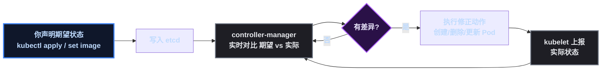
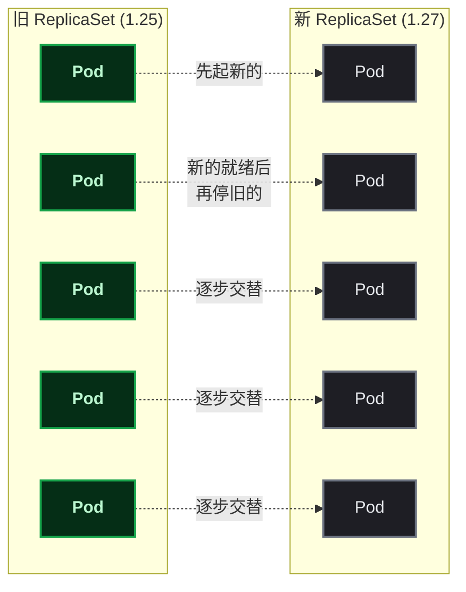

# 把应用跑上集群：Deployment 的一堂实战课

上一篇搭好了 kind 三节点集群，但这只是"系统盘"——真正的 K8s 学习从**把应用跑上去**才刚开始。这篇文章用一次完整的实战演示：部署 3 副本 nginx、观察调度器怎么分配节点、扩容、滚动更新发新版、故意发布坏版本看集群卡死、最后回滚救回来。全程真实操作和真实输出，每个环节都解释"为什么是这样"。

> 📌 前置知识：建议先读过本系列前一篇（kind 搭建一主二从集群），至少知道控制面/工作节点/kubelet 是什么。这篇文章的操作都在那个集群上进行。

## 这次要做什么

```
目标：在 kind 一主二从集群上，跑通 Deployment 的完整生命周期
流程：部署 → 观察调度 → 查看对象层级 → 扩容 → 滚动更新 → 坏版本发布 → 回滚
收获：亲眼验证"期望状态/控制器循环/调度器/滚动更新"这些概念
```

## 前置条件与环境准备

| 项 | 本次实测 |
|---|---|
| 集群 | kind ` learn ` ，1 控制面 + 2 工作节点，K8s v1.36.1 |
| 工具 | kubectl v1.36.4 |
| 镜像 | nginx:1.25 与 nginx:1.27（预载入节点） |

### 关键一步：镜像怎么进节点

kind 集群里拉镜像有个容易忽略的坑：**节点内部的 containerd 不走宿主机 Docker 的代理配置**，直接从 Docker Hub 拉。国内网络直连大概率超时。所以先把镜像拉到宿主机（走代理），再一次性导入所有节点：

```bash
# 宿主机拉镜像（Docker daemon 已配代理）
docker pull nginx:1.25
docker pull nginx:1.27

# 导入集群所有节点（等价于"把镜像送进每个节点"）
kind load docker-image nginx:1.25 nginx:1.27 --name learn
```

> ⚠️ 新手提示： ` kind load ` 要把几百 MB 镜像分别灌进每个节点容器，4 线程的机器上会明显卡顿（负载能飙到 10+），耐心等，别并发跑多个导入。

> 📌 概念注脚：这个"先把镜像放到节点上"的动作，模拟的就是生产里"镜像进私有仓库（如阿里云 ACR）→ 节点从仓库拉取"的前半段。上云后节点自动从 ACR 拉，你只需要把镜像推上去。

## 第1步：部署 3 副本，观察调度

```bash
kubectl create deployment nginx-demo --image=nginx:1.25 --replicas=3
kubectl get pods -o wide
```

真实输出（重点看 NODE 列）：

```
NAME                         READY   STATUS    IP           NODE
nginx-demo-5474c98dc4-lhcq7   1/1     Running   10.244.2.2   learn-worker
nginx-demo-5474c98dc4-mxkt4   1/1     Running   10.244.1.2   learn-worker2
nginx-demo-5474c98dc4-p5g5v   1/1     Running   10.244.2.3   learn-worker
```

这 3 行输出信息量巨大：

| 观察点 | 说明 |
|---|---|
| 3 副本分布在 2 个 worker（2+1） | **调度器**在按节点分散 Pod，不会全堆在一个节点 |
| control-plane 一个都没有 | 控制面节点带**污点**（Taint） ` NoSchedule ` ，业务 Pod 默认不上去——这是保护机制 |
| IP 是 10.244.2.x / 10.244.1.x | kindnet 给每个节点分配独立子网，跨节点通信走覆盖网络 |

## 第2步：看对象层级

```bash
kubectl get deploy,rs,pods
```

```
deployment.apps/nginx-demo         3/3
replicaset.apps/nginx-demo-5474c98dc4   3
pod/nginx-demo-5474c98dc4-xxx      1/1 Running
```

三层管理链一目了然：**Deployment 管 ReplicaSet，ReplicaSet 管 Pod**。Pod 名字里的 `5474c98dc4` 就是所属 ReplicaSet 的哈希——看到相同前缀就知道是"一家人"。

## 第3步：扩容，看调度器重新平衡

```bash
kubectl scale deployment nginx-demo --replicas=5
kubectl get pods -o wide
```

5 个副本最终分布：learn-worker 2 个 + learn-worker2 3 个。调度器把新增的 2 个 Pod 放到了副本更少的节点——集群自动负载均衡。

> ⚠️ 新手提示：扩容只是改一个数字，剩下的全是控制器在工作——这就是"声明式"：你告诉集群"我要 5 个"，集群自己想办法。

## 第4步：滚动更新（发新版）

```bash
kubectl set image deployment/nginx-demo nginx=nginx:1.27
kubectl rollout status deployment/nginx-demo
```

实时输出节选：

```
Waiting for deployment rollout to finish: 2 out of 5 new replicas have been updated...
Waiting for deployment rollout to finish: 4 out of 5 new replicas have been updated...
Waiting for deployment rollout to finish: 2 old replicas are pending termination...
deployment "nginx-demo" successfully rolled out
```

新版本 Pod 逐个起来，旧版本 Pod 逐个下线——**全程服务不中断**。再查层级会发现：老 ReplicaSet（1.25）缩到 0，新 ReplicaSet（1.27）扩到 5，两个版本归档共存。

## 第5步：故意发布坏版本

```bash
kubectl set image deployment/nginx-demo nginx=nginx:999   # 不存在的镜像
```

等一会儿看 Pod 状态：

```
nginx-demo-669f7ff5f-4rc9c   ImagePullBackOff
nginx-demo-669f7ff5f-b9n4t   ErrImagePull
```

镜像拉不到 → Pod 起不来 → 新版本永远无法就绪 → **发布卡死**。Deployment 的条件会变成 `Progressing: False (ProgressDeadlineExceeded)`——默认 10 分钟没进展就宣告失败。这就是生产里"发版卡住"的典型形态。

> ⚠️ 新手提示：坏版本不会"报错弹出来"，而是"僵在那里反复重试"。看 ` kubectl get events ` 能看到根因（本次是 ` dial tcp ... i/o timeout ` ——kind 节点拉镜像不走代理导致的网络超时；真实环境里节点能访问镜像仓库，行为一致但报错会不同）。

## 第6步：回滚（以及一个真实的坑）

```bash
kubectl rollout undo deployment/nginx-demo
```

正常预期是回到上一个版本。但这次实战中出现了意外：** ` rollout undo ` 打印了 "rolled back"，实际却没生效**——查 ` kubectl describe deploy ` 发现 ` NewReplicaSet ` 仍然是坏版本，Pod 还在 ImagePullBackOff 循环重建。

> ⚠️ 教训（生产级）：**回滚命令"说成功"不等于"真成功"**。必须用 `kubectl get deploy -o wide` 看 IMAGES 列确认，或 `rollout status` 确认收敛。

最可靠的恢复方式是显式声明期望状态（这招对一切"卡死"状态通用）：

```bash
kubectl set image deployment/nginx-demo nginx=nginx:1.27
kubectl rollout status deployment/nginx-demo
# 输出: deployment "nginx-demo" successfully rolled out
```

## 部署验证

```bash
kubectl get deploy nginx-demo -o wide   # 5/5, IMAGES=nginx:1.27
kubectl get pods -o wide                # 全部 Running, 3 个在 worker, 2 个在 worker2
```

## 原理：这一切为什么自动发生

### 1. 期望状态与控制器循环

K8s 一切自动化都建立在同一个机制上：



所以"扩容"只是把期望从 3 改成 5，控制器检测到差异（实际 3 ≠ 期望 5）就自动补 2 个；"坏版本卡死"是因为无论控制器怎么重试，Pod 都到不了就绪——差异永远无法消除。

### 2. 滚动更新为什么不断服



策略由两个参数控制（默认各 25%）：**maxSurge**（允许超出期望的临时 Pod 数）和 **maxUnavailable**（允许同时不可用的旧 Pod 数）。两者共同保证：任意时刻，可用副本数不低于期望的 75%、总副本数不超过期望的 125%。这就是"发版不中断"的数学保证。

## 总结与下一步

### 本课收获速查

| 概念 | 你亲眼看到的证据 |
|---|---|
| 调度器 | 副本自动分散、扩容后重新平衡 |
| 污点 | control-plane 永远不跑业务 Pod |
| 对象层级 | Deployment → ReplicaSet → Pod |
| 滚动更新 | 新旧 RS 渐进交替，服务不中断 |
| 声明式 | 改一个数字/一行镜像，其余控制器完成 |
| 排障 | ImagePullBackOff / rollout status / get events |

### 踩坑速查

| 坑 | 现象 | 解法 |
|---|---|---|
| 节点拉镜像超时 | ImagePullBackOff + dial tcp timeout | 宿主 `docker pull` + `kind load` 预载 |
| undo 假成功 | 打印 rolled back 但模板没变 | 用 `get deploy -o wide` 验证；显式 `set image` 恢复 |
| 卡死状态判断 | Progressing: False | `kubectl describe deploy` 看条件与 NewReplicaSet |

### 下一步

集群里已经有跑着的应用了，接下来自然是**让外部能访问它**：模块 2 Service + Ingress（ClusterIP → NodePort → Ingress 域名接入），把"部署 → 暴露 → 访问"的完整链路打通。这也是上云后每天都要做的两件事之一。

系列文章：kind 搭建集群 → Deployment 实战（本篇）→ Service/Ingress 实战。
