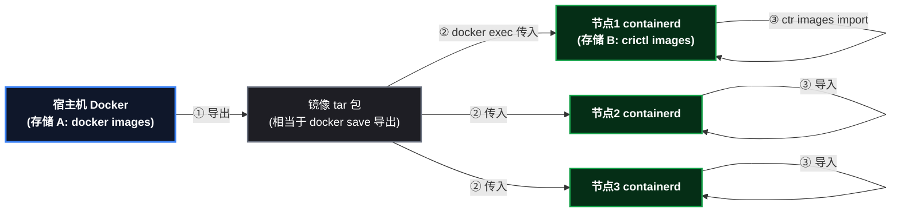
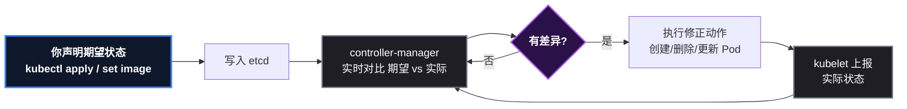
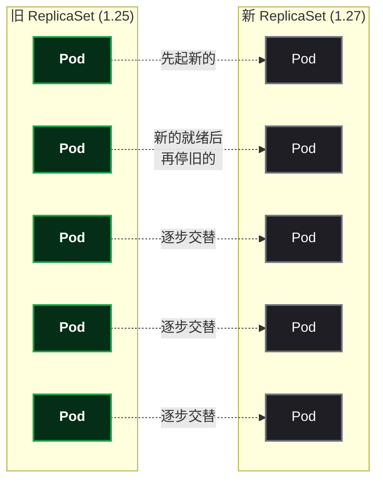
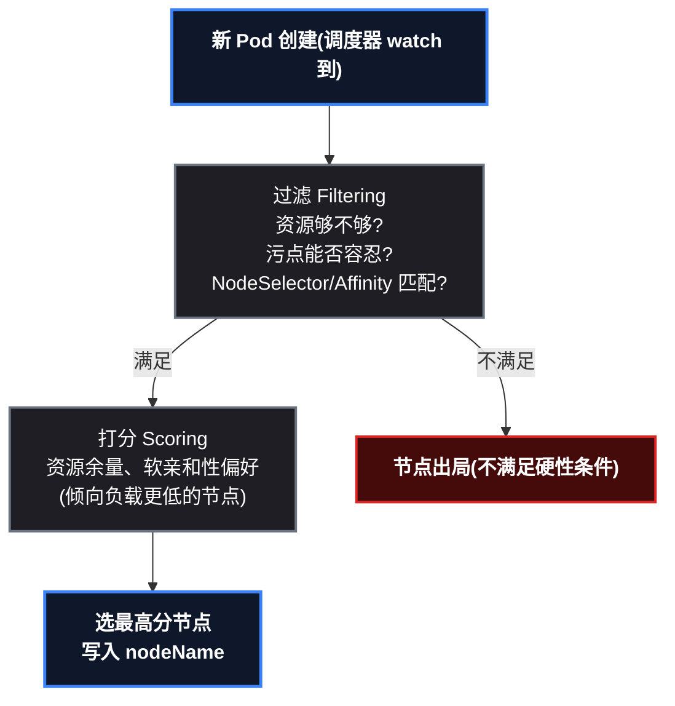

# 把应用跑上集群：Deployment 的一堂实战课

上一篇搭好了 kind 三节点集群，但这只是"系统盘"——真正的 K8s 学习从**把应用跑上去**才刚开始。这篇文章用一次完整的实战演示：部署 3 副本 nginx、观察调度器怎么分配节点、扩容、滚动更新发新版、故意发布坏版本看集群卡死、最后回滚救回来。全程真实操作和真实输出，每个环节都解释"为什么是这样"。

> 📌 前置知识：建议先读过本系列前一篇（kind 搭建一主二从集群），至少知道控制面/工作节点/kubelet 是什么。这篇文章的操作都在那个集群上进行。

## 这次要做什么

```
目标：在 kind 一主二从集群上，跑通 Deployment 的完整生命周期
流程：部署 → 观察调度 → 查看对象层级 → 扩容 → 滚动更新 → 坏版本发布 → 回滚
收获：亲眼验证"期望状态/控制器循环/调度器/滚动更新"这些概念
```

## 前置条件与环境准备

| 项 | 本次实测 |
|---|---|
| 集群 | kind ` learn ` ，1 控制面 + 2 工作节点，K8s v1.36.1 |
| 工具 | kubectl v1.36.4 |
| 镜像 | nginx:1.25 与 nginx:1.27（预载入节点） |

### 关键一步：镜像怎么进节点

kind 集群里拉镜像有个容易忽略的坑：**节点内部的 containerd 不走宿主机 Docker 的代理配置**，直接从 Docker Hub 拉。国内网络直连大概率超时。所以先把镜像拉到宿主机（走代理），再一次性导入所有节点：

```bash
# 宿主机拉镜像（Docker daemon 已配代理）
docker pull nginx:1.25
docker pull nginx:1.27

# 导入集群所有节点（等价于"把镜像送进每个节点"）
kind load docker-image nginx:1.25 nginx:1.27 --name learn
```

**"加载进入每个节点"到底是什么意思？** kind 的"容器即节点"是嵌套结构：节点是一个 Docker 容器，容器内跑着 **containerd**（节点自己的容器运行时）——kubelet 只认 containerd。于是镜像存储有两层、**互不相通**：

- 宿主机 Docker 的镜像存储（ ` docker images ` 看到的是它）；
- 节点容器内 containerd 的镜像存储（ ` crictl images ` 看到的是它）。

` docker pull ` 的镜像落在宿主机那层，节点里的 containerd 根本看不见。 ` kind load ` 就是**人工搬运**——三步走、对每个节点重复一遍：



① **导出**：读取宿主机 Docker 里的镜像（相当于 ` docker save ` 打成 tar）；② **传输**： ` docker exec ` 把 tar 传进节点容器；③ **导入**：节点内用 ` ctr images import ` （containerd 的命令行工具）导入。命令输出里的 "Loading image ... across 3 nodes!" 就是这个动作对 3 个节点各做一遍。

**为什么每个节点都要？** 调度器可能把 Pod 放到任何节点（过滤 + 打分，见原理第 3 节）——不预载的节点一旦被选中，kubelet 从 containerd 找不到镜像、又拉不到，就是 ImagePullBackOff。所以 kind 全量复制：load 一次，所有节点都有。

验证镜像确实进了节点（节点内 containerd 视角，和 kubelet 同款；IMAGE ID 与宿主机一致证明是同一个镜像）：

```bash
docker exec learn-worker crictl images | grep nginx
# docker.io/library/nginx  1.25  e784f4560448b  192MB
# docker.io/library/nginx  1.27  1e5f3c5b981a9  197MB
```

> ⚠️ 新手提示： ` kind load ` 要把几百 MB 镜像分别灌进每个节点容器，4 线程的机器上会明显卡顿（负载能飙到 10+），耐心等，别并发跑多个导入。

> 📌 概念注脚：这个"先把镜像放到节点上"的动作，模拟的就是生产里"镜像进私有仓库（如阿里云 ACR）→ 节点从仓库拉取"的前半段。上云后节点自动从 ACR 拉，你只需要把镜像推上去。

## 第1步：部署 3 副本，观察调度

```bash
kubectl create deployment nginx-demo --image=nginx:1.25 --replicas=3
kubectl get pods -o wide
```

真实输出（重点看 NODE 列）：

```
NAME                         READY   STATUS    IP           NODE
nginx-demo-5474c98dc4-lhcq7   1/1     Running   10.244.2.2   learn-worker
nginx-demo-5474c98dc4-mxkt4   1/1     Running   10.244.1.2   learn-worker2
nginx-demo-5474c98dc4-p5g5v   1/1     Running   10.244.2.3   learn-worker
```

这 3 行输出信息量巨大：

| 观察点 | 说明 |
|---|---|
| 3 副本分布在 2 个 worker（2+1） | **调度器**在按节点分散 Pod，不会全堆在一个节点 |
| control-plane 一个都没有 | 控制面节点带**污点**（Taint） ` NoSchedule ` ，业务 Pod 默认不上去——这是保护机制 |
| IP 是 10.244.2.x / 10.244.1.x | kindnet 给每个节点分配独立子网，跨节点通信走覆盖网络 |

> 🤔 读者此刻一定会问：**分布为什么是 2+1？谁决定的？control-plane 的污点到底是什么？**——这不是随机，是调度器（kube-scheduler）的决策，完整的机制（过滤 + 打分、污点/容忍度、NodeSelector、节点亲和性）见原理第 3 节，那里有实测演示。

**补充：声明式（YAML）才是生产主流**。上面用的是 `kubectl create deployment` 命令式创建——适合临时快速实验，但生产环境几乎不用它，原因是：命令式是"我告诉你怎么做"，声明式是"我告诉你我要什么，你负责收敛"；YAML 清单是文本，**能进 git 版本化、能 diff 评审、能复用、能回滚**——这才是基础设施即代码（IaC）的形态。

同一个 Deployment 的声明式写法（这也是全系列博客一直用的姿势）：

```yaml
# nginx-demo.yaml
apiVersion: apps/v1
kind: Deployment
metadata:
  name: nginx-demo
spec:
  replicas: 3
  selector:
    matchLabels:
      app: nginx-demo
  template:
    metadata:
      labels:
        app: nginx-demo
    spec:
      containers:
      - name: nginx
        image: nginx:1.25
        ports:
        - containerPort: 80
```

```bash
kubectl apply -f nginx-demo.yaml      # 声明式部署(实测输出同前: 3 副本分散到 2 个 worker)
kubectl apply -f nginx-demo.yaml      # 再执行一次 → deployment.apps/nginx-demo unchanged
```

**第二次 apply 返回 `unchanged`**——这是声明式最直观的优越性：**幂等**。同样的清单执行多少次结果都一样，命令式 `create` 重复执行会直接报 AlreadyExists。生产里 CI/CD 每天对同一套清单跑 apply 是常态，幂等性保证了"跑不坏"。

| 对比 | 命令式 `kubectl create deployment ...` | 声明式 `kubectl apply -f xxx.yaml` |
|------|------|------|
| 语义 | "按我说的做" | "这是我想要的最终状态，帮我收敛" |
| 可版本化 | ❌ 命令不在仓库里 | ✅ YAML 进 git，可 diff/评审/回滚 |
| 幂等性 | ❌ 重复执行报错 | ✅ 重复执行 `unchanged` |
| 适合场景 | 临时实验、快速验证 | 生产、CI/CD、多环境复用 |

**结论：命令式适合"试一下"，声明式是"正式做法"**——后面的滚动更新、回滚、配置管理，全部用 YAML 展开，这也是为什么本文"关键一步"要提前把 YAML 思维建立起来。

## 第2步：看对象层级

```bash
kubectl get deploy,rs,pods
```

```
deployment.apps/nginx-demo         3/3
replicaset.apps/nginx-demo-5474c98dc4   3
pod/nginx-demo-5474c98dc4-xxx      1/1 Running
```

三层管理链一目了然：**Deployment 管 ReplicaSet，ReplicaSet 管 Pod**。Pod 名字里的 `5474c98dc4` 就是所属 ReplicaSet 的哈希——看到相同前缀就知道是"一家人"。

## 第3步：扩容，看调度器重新平衡

```bash
kubectl scale deployment nginx-demo --replicas=5
kubectl get pods -o wide
```

5 个副本最终分布：learn-worker 2 个 + learn-worker2 3 个。调度器把新增的 2 个 Pod 放到了副本更少的节点——集群自动负载均衡。

> ⚠️ 新手提示：扩容只是改一个数字，剩下的全是控制器在工作——这就是"声明式"：你告诉集群"我要 5 个"，集群自己想办法。

## 第4步：滚动更新（发新版）

```bash
kubectl set image deployment/nginx-demo nginx=nginx:1.27
kubectl rollout status deployment/nginx-demo
```

实时输出节选：

```
Waiting for deployment rollout to finish: 2 out of 5 new replicas have been updated...
Waiting for deployment rollout to finish: 4 out of 5 new replicas have been updated...
Waiting for deployment rollout to finish: 2 old replicas are pending termination...
deployment "nginx-demo" successfully rolled out
```

新版本 Pod 逐个起来，旧版本 Pod 逐个下线——**全程服务不中断**。再查层级会发现：老 ReplicaSet（1.25）缩到 0，新 ReplicaSet（1.27）扩到 5，两个版本归档共存。

## 第5步：故意发布坏版本

```bash
kubectl set image deployment/nginx-demo nginx=nginx:999   # 不存在的镜像
```

等一会儿看 Pod 状态：

```
nginx-demo-669f7ff5f-4rc9c   ImagePullBackOff
nginx-demo-669f7ff5f-b9n4t   ErrImagePull
```

镜像拉不到 → Pod 起不来 → 新版本永远无法就绪 → **发布卡死**。Deployment 的条件会变成 `Progressing: False (ProgressDeadlineExceeded)`——默认 10 分钟没进展就宣告失败。这就是生产里"发版卡住"的典型形态。

> ⚠️ 新手提示：坏版本不会"报错弹出来"，而是"僵在那里反复重试"。看 ` kubectl get events ` 能看到根因（本次是 ` dial tcp ... i/o timeout ` ——kind 节点拉镜像不走代理导致的网络超时；真实环境里节点能访问镜像仓库，行为一致但报错会不同）。

## 第6步：回滚（以及一个真实的坑）

```bash
kubectl rollout undo deployment/nginx-demo
```

正常预期是回到上一个版本。但这次实战中出现了意外：** ` rollout undo ` 打印了 "rolled back"，实际却没生效**——查 ` kubectl describe deploy ` 发现 ` NewReplicaSet ` 仍然是坏版本，Pod 还在 ImagePullBackOff 循环重建。

> ⚠️ 教训（生产级）：**回滚命令"说成功"不等于"真成功"**。必须用 `kubectl get deploy -o wide` 看 IMAGES 列确认，或 `rollout status` 确认收敛。

最可靠的恢复方式是显式声明期望状态（这招对一切"卡死"状态通用）：

```bash
kubectl set image deployment/nginx-demo nginx=nginx:1.27
kubectl rollout status deployment/nginx-demo
# 输出: deployment "nginx-demo" successfully rolled out
```

## 部署验证

```bash
kubectl get deploy nginx-demo -o wide   # 5/5, IMAGES=nginx:1.27
kubectl get pods -o wide                # 全部 Running, 3 个在 worker, 2 个在 worker2
```

## 原理：这一切为什么自动发生

### 1. 期望状态与控制器循环

K8s 一切自动化都建立在同一个机制上：



所以"扩容"只是把期望从 3 改成 5，控制器检测到差异（实际 3 ≠ 期望 5）就自动补 2 个；"坏版本卡死"是因为无论控制器怎么重试，Pod 都到不了就绪——差异永远无法消除。

### 2. 滚动更新为什么不断服



策略由两个参数控制（默认各 25%）：**maxSurge**（允许超出期望的临时 Pod 数）和 **maxUnavailable**（允许同时不可用的旧 Pod 数）。两者共同保证：任意时刻，可用副本数不低于期望的 75%、总副本数不超过期望的 125%。这就是"发版不中断"的数学保证。

### 3. Pod 是怎么分配到节点的：调度器、污点、容忍度、NodeSelector 与节点亲和性

回到第 1 步的问题：**3 个副本为什么是 2+1 分布在两个 worker？为什么从来不落 control-plane？**——不是随机，每一步都是调度器的决策。

**调度器（kube-scheduler）怎么选节点**：两步走，先过滤、再打分：



- **过滤（Filtering）**：硬性条件，不满足直接出局——资源够不够、节点的污点 Pod 能不能容忍、NodeSelector / 亲和性匹不匹配；
- **打分（Scoring）**：候选节点按优先级排序（资源余量、软亲和偏好），调度器倾向把 Pod 放到副本更少、负载更低的节点；
- **"2+1 分散"是打分逻辑的自然结果**：两个 worker 资源相同时分数接近，多副本被均衡地分散开——看起来像随机，其实是"确定性决策 + 负载均衡目标"。

**四个控制手段，一张表分清**：

| 概念 | 一句话作用 | 写在谁上 | 硬/软 |
|------|------|------|------|
| **污点（Taint）** | 节点说"我有特殊要求，普通 Pod 别来" | 节点 | 硬 |
| **容忍度（Toleration）** | Pod 说"这个污点我能忍" | Pod | 硬（与污点配对） |
| **NodeSelector** | Pod 说"我只去带这个标签的节点" | Pod | 硬 |
| **节点亲和性（Node Affinity）** | NodeSelector 的进化：表达式匹配 + 软硬分级 | Pod | 硬 / 软 |

**污点与容忍度：为什么业务 Pod 永远不落 control-plane**

控制面节点自带污点（kind 集群实测）：

```bash
kubectl describe node learn-control-plane | grep -A2 Taints
# Taints:  node-role.kubernetes.io/control-plane:NoSchedule
```

`NoSchedule` 的含义：**没有对应容忍度的 Pod 不允许调度到这个节点**——控制面组件（etcd/apiserver）独享控制面节点，业务 Pod 默认被拒之门外。这就是保护机制。Pod 若想上去（一般不该），要显式声明容忍度：

```yaml
tolerations:
- key: node-role.kubernetes.io/control-plane
  operator: Exists
  effect: NoSchedule
```

典型应用：GPU 节点打污点，只有声明了容忍度的 GPU 任务才能上去。

**NodeSelector：最直白的"我要去那台机器"**

给节点打标签，Pod 指名道姓（实测演示）：

```bash
kubectl label node learn-worker disktype=ssd    # 1. 给节点打标签
```

```yaml
# 2. Pod 声明: 我只去带 disktype=ssd 的节点
spec:
  nodeSelector:
    disktype: ssd
```

实测结果：Pod 精确落在 learn-worker（ ` Running learn-worker ` ）。

**硬性条件的含义**：没有匹配的节点就 **Pending**。对照组实测（声明 ` disktype=hdd ` ，集群里没有这个标签）——调度器拒绝消息原文：

```text
0/3 nodes are available: 1 node(s) had untolerated taint(s),
2 node(s) didn't match Pod's node affinity/selector.
```

这一句话同时演示了两个机制：**控制面的污点拒绝了 1 个节点**（untolerated taint），**两个 worker 没有匹配标签**（didn't match selector）——3 个节点全军覆没，Pod Pending。排查 Pending 时 `kubectl describe pod` 的这行事件就是答案。

**节点亲和性（Node Affinity）：NodeSelector 的进化版**

NodeSelector 只能"等于"，亲和性支持表达式（ ` In ` / ` NotIn ` / ` Exists ` / ` Gt ` / ` Lt ` ），且分软硬两种：

- **requiredDuringSchedulingIgnoredDuringExecution**（硬）：必须满足，否则不调度——NodeSelector 的超集；
- **preferredDuringSchedulingIgnoredDuringExecution**（软）：尽量满足，满足加分、不满足也调度。

典型场景：大内存任务"优先"去大内存节点（软亲和），GPU 任务"必须"去 GPU 节点（硬亲和 + 污点容忍双保险）。

**一句话总结**：污点是节点侧"拒绝"，容忍度是 Pod 侧"申请"，NodeSelector / 亲和性是 Pod 侧"指名道姓"——调度器先过滤（硬条件出局）再打分（均衡优先），Pod 最终落在哪，是这些规则共同决定的结果，**从来不是随机**。

## 总结与下一步

### 本课收获速查

| 概念 | 你亲眼看到的证据 |
|---|---|
| 调度器 | 副本自动分散、扩容后重新平衡 |
| 污点 | control-plane 永远不跑业务 Pod |
| 对象层级 | Deployment → ReplicaSet → Pod |
| 滚动更新 | 新旧 RS 渐进交替，服务不中断 |
| 声明式 | 改一个数字/一行镜像，其余控制器完成 |
| 排障 | ImagePullBackOff / rollout status / get events |

### 踩坑速查

| 坑 | 现象 | 解法 |
|---|---|---|
| 节点拉镜像超时 | ImagePullBackOff + dial tcp timeout | 宿主 `docker pull` + `kind load` 预载 |
| undo 假成功 | 打印 rolled back 但模板没变 | 用 `get deploy -o wide` 验证；显式 `set image` 恢复 |
| 卡死状态判断 | Progressing: False | `kubectl describe deploy` 看条件与 NewReplicaSet |

### 下一步

集群里已经有跑着的应用了，接下来自然是**让外部能访问它**：模块 2 Service + Ingress（ClusterIP → NodePort → Ingress 域名接入），把"部署 → 暴露 → 访问"的完整链路打通。这也是上云后每天都要做的两件事之一。

系列文章：kind 搭建集群 → Deployment 实战（本篇）→ Service/Ingress 实战。
