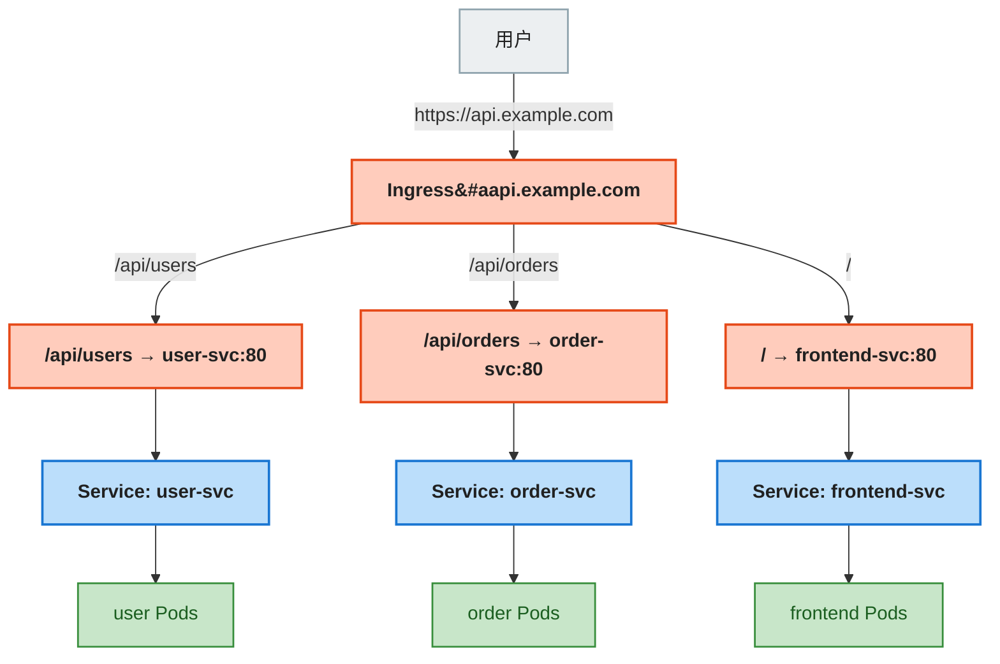
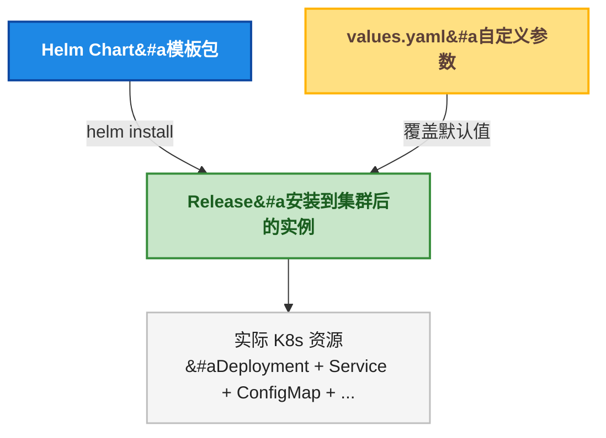
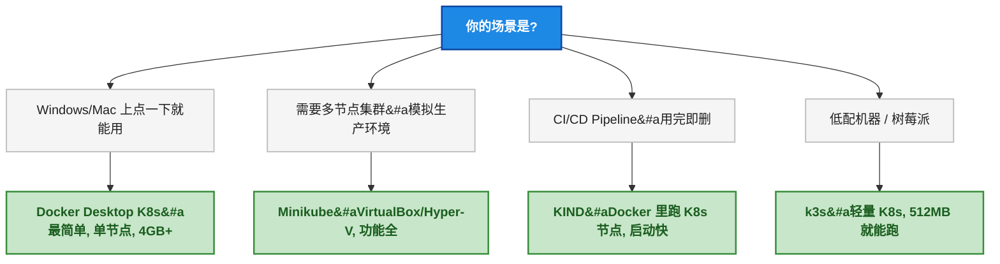
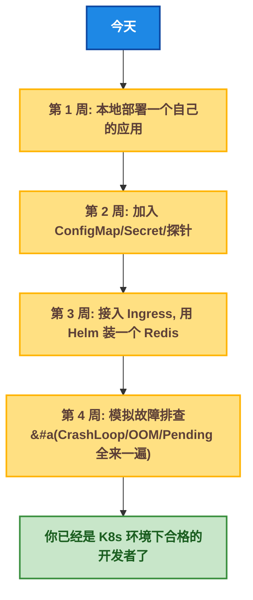

# 开发者 K8s 全景图

## 一、目标说明

前四篇文章把 K8s 的概念地基、YAML 编写、探针配置、kubectl 命令全拆完了。这篇是**收网篇**——把剩下的重要但散落的知识点串起来，然后画一条清晰的线：**什么归你管，什么扔给运维**。

读完这篇文章，读者能：

- 写出完整的 Ingress YAML，理解域名路由规则
- 用 Helm 安装和管理应用（`helm install` / `upgrade` / `rollback`）
- 选择适合自己场景的本地 K8s 环境
- 知道 StatefulSet、HPA、Job/CronJob、PVC 是干什么的、什么时候需要
- 认清 Dev vs Ops 的分界线，不再背不该背的锅

---

## 二、前置条件

| 前置条件 | 要求 |
|----------|------|
| 理解 Service（ClusterIP/NodePort）| 第 0 ~ 1 步已覆盖 |
| 会基本的 kubectl 操作 | 第 3 步已覆盖 |
| 了解域名和 HTTP 路径的基本概念 | `api.example.com/users` 这种格式能看懂 |

---

## 三、分步实践

### 3.1 Ingress —— 域名路由，外部流量的大门

#### 3.1.1 为什么需要 Ingress？

Service 的三种类型：

| Service 类型 | 外部访问 | 问题 |
|-------------|:---:|------|
| ClusterIP | 不能 | 只能集群内用 |
| NodePort | 能（`NodeIP:30000-32767`）| 端口丑、不能基于域名路由，一个端口只能绑一个 Service |
| LoadBalancer | 能（云 LB 分配公网 IP）| **每个 Service 都要创建一个 LB，烧钱** |

Ingress 解决的问题：**用一个入口（一个 LB / 一个公网 IP），根据域名和路径把流量分发到不同的 Service**。



> ⚠️ 新手提示：Ingress 本身**只是一个 YAML 规则**（同 Service 一样是虚拟概念）。真正干活的是 **Ingress Controller**（比如 nginx-ingress、traefik）。你需要先在集群里部署 Ingress Controller，Ingress 规则才会生效。Docker Desktop 不内置 Ingress Controller，需要自己装。

#### 3.1.2 安装 Ingress Controller（以 nginx-ingress 为例）

```bash
# Docker Desktop / Minikube 环境
kubectl apply -f https://raw.githubusercontent.com/kubernetes/ingress-nginx/controller-v1.8.2/deploy/static/provider/cloud/deploy.yaml

# 确认 Controller Pod 已 Running
kubectl get pods -n ingress-nginx -w
```

#### 3.1.3 写 Ingress YAML

```yaml
apiVersion: networking.k8s.io/v1
kind: Ingress
metadata:
  name: my-app-ingress
  namespace: my-first-app
  annotations:
    nginx.ingress.kubernetes.io/rewrite-target: /    # nginx 专用：路径重写
spec:
  ingressClassName: nginx
  rules:
  - host: api.example.local                          # 域名（本地测试可配 hosts）
    http:
      paths:
      - path: /users
        pathType: Prefix                             # Prefix / Exact / ImplementationSpecific
        backend:
          service:
            name: user-svc
            port:
              number: 80
      - path: /orders
        pathType: Prefix
        backend:
          service:
            name: order-svc
            port:
              number: 80
```

**逐字段解释：**

| 字段 | 含义 |
|------|------|
| `ingressClassName: nginx` | 指定用哪个 Ingress Controller（一个集群可以有多个） |
| `rules[].host` | 匹配请求的 `Host` 头（域名），不写则匹配所有域名 |
| `rules[].http.paths[].path` | URL 路径匹配规则 |
| `pathType: Prefix` | 前缀匹配（`/users` 匹配 `/users`、`/users/123`、`/users/123/profile`） |
| `pathType: Exact` | 精确匹配（只匹配 `/users`，不匹配 `/users/123`） |
| `backend.service` | 流量转发到哪个 Service 的哪个端口 |

#### 3.1.4 本地测试 Ingress

```bash
# 1. 配本地 hosts（因为 api.example.local 不是真实域名）
# macOS/Linux: sudo echo "127.0.0.1 api.example.local" >> /etc/hosts
# Windows: 以管理员身份编辑 C:\Windows\System32\drivers\etc\hosts

# 2. port-forward Ingress Controller 的 Service 到本地
kubectl port-forward -n ingress-nginx svc/ingress-nginx-controller 80:80

# 3. 测试
curl -H "Host: api.example.local" http://localhost/users
```

> ⚠️ 新手提示：Ingress 最常见的两个坑——(1) 忘记部署 Ingress Controller，写了 Ingress YAML apply 了但完全不生效；(2) `pathType: Prefix` 的 `/` 是匹配**所有路径**，如果你把这个路径指向了错误的后端，所有请求都被它吃掉。

### 3.2 Helm —— K8s 的包管理器

#### 3.2.1 为什么需要 Helm？

部署一个 MySQL 到 K8s，需要写 Deployment + Service + ConfigMap + Secret + PVC + ServiceAccount ——至少 6 个 YAML 文件。Helm 把这一套东西打包成 **Chart**（类似 `apt` 的 `.deb` 包或 `npm` 的 `package`），一条命令安装。



#### 3.2.2 安装 Helm

```bash
# macOS
brew install helm

# Windows (choco)
choco install kubernetes-helm

# Linux
curl https://raw.githubusercontent.com/helm/helm/main/scripts/get-helm-3 | bash

# 验证
helm version
```

#### 3.2.3 核心命令（开发者必须会）

```bash
# === 添加仓库 ===
helm repo add bitnami https://charts.bitnami.com/bitnami
helm repo update                                    # 更新仓库索引

# === 搜索 ===
helm search repo mysql                              # 搜 Chart
helm search repo bitnami/mysql --versions           # 看有哪些版本

# === 安装 ===
helm install my-mysql bitnami/mysql \               # 安装 Chart，取名为 my-mysql
  --namespace my-first-app \
  --set auth.rootPassword=MyP@ss123 \               # 用 --set 覆盖默认参数
  --set auth.database=myapp

# === 查看 ===
helm list -n my-first-app                           # 列出已安装的 Release
helm status my-mysql -n my-first-app                # 查看 Release 状态
helm get values my-mysql -n my-first-app            # 查看用了哪些参数

# === 升级 ===
helm upgrade my-mysql bitnami/mysql \
  --namespace my-first-app \
  --set auth.rootPassword=NewP@ss456

# === 回滚 ===
helm rollback my-mysql 1 -n my-first-app            # 回滚到版本 1
helm history my-mysql -n my-first-app               # 查看版本历史

# === 卸载 ===
helm uninstall my-mysql -n my-first-app
```

#### 3.2.4 自定义 values.yaml

`--set` 适合少量参数，多参数用 `values.yaml`：

```yaml
# my-values.yaml
auth:
  rootPassword: "MySecureP@ss"
  database: "myapp"
primary:
  persistence:
    enabled: true
    size: 8Gi
  resources:
    requests:
      memory: "256Mi"
      cpu: "250m"
    limits:
      memory: "512Mi"
      cpu: "500m"
```

```bash
helm install my-mysql bitnami/mysql -n my-first-app -f my-values.yaml
```

> ⚠️ 新手提示：**Helm 3 不再需要 Tiller**（Helm 2 的服务端组件）。Helm 3 直接通过 kubeconfig 跟 API Server 通信，跟 kubectl 一样。如果有人跟你说"装 Helm 之前要先装 Tiller"——那人在用十年前的教程。

#### 3.2.5 哪些场景用 Helm？

| 场景 | 方式 |
|------|------|
| 装中间件（MySQL、Redis、Kafka、ES）| `helm install` 官方或 Bitnami 的 Chart |
| 装基础设施（Prometheus、Grafana、Jaeger）| `helm install` 社区 Chart |
| 部署自己的微服务 | 也可以写 Chart，但简单场景用 `kubectl apply` 够了 |
| CI/CD 中自动化部署 | `helm upgrade --install`（幂等的，不存在就装、存在就升级） |

### 3.3 本地 K8s 环境选型



| 工具 | 启动速度 | 内存需求 | 多节点 | 适用 |
|------|:---:|:---:|:---:|------|
| **Docker Desktop K8s** | 慢（首次 ~2min）| 4GB+ | 不支持 | Windows/Mac 开发，最简单 |
| **Minikube** | 中等 | 4GB+ | 支持 | 需要多节点模拟、功能最全 |
| **KIND** | **快（~30s）** | 2GB+ | 支持 | CI/CD、快速创建/销毁 |
| **k3s** | 中等 | 512MB+ | 支持 | 边缘设备、树莓派、低配 VPS |

> ⚠️ 新手提示：如果只是学习，Docker Desktop 自带 K8s 就够。如果你在 CI 里跑集成测试需要 K8s——用 KIND（Kubernetes IN Docker），它在 Docker 容器里跑 K8s 组件，30 秒起一个集群，测试完直接删。

### 3.4 高级资源速览 —— 知道存在就行，不一定会写

#### 3.4.1 StatefulSet —— 有状态应用专用

适用场景：数据库、消息队列、分布式存储——这些需要**稳定的 Pod 名称 + 稳定的存储 + 有序启停**。

| 对比 | Deployment | StatefulSet |
|------|-----------|-------------|
| Pod 命名 | `my-app-随机后缀`（如 `5d8f7b6c9-abcde`）| `my-db-0`、`my-db-1`、`my-db-2`（有序编号） |
| 启停顺序 | 并行创建/删除 | 0 → 1 → 2 顺序启动，反向停止 |
| 存储 | 所有 Pod 共享 PVC 或不用存储 | **每个 Pod 独享一个 PVC**（volumeClaimTemplates） |
| 网络标识 | Pod IP 会变 | 每个 Pod 有稳定的 DNS 名（`my-db-0.my-db-svc.default.svc`） |

> 📌 前置知识：理解 PVC（PersistentVolumeClaim）和 StorageClass 的基本概念——PVC 是 Pod 申请存储的"申请表"，StorageClass 是"哪种类型的存储"（SSD / HDD / 云盘）。

#### 3.4.2 HPA（HorizontalPodAutoscaler）—— 自动扩缩容

```yaml
apiVersion: autoscaling/v2
kind: HorizontalPodAutoscaler
metadata:
  name: my-app-hpa
spec:
  scaleTargetRef:
    apiVersion: apps/v1
    kind: Deployment
    name: my-app
  minReplicas: 2
  maxReplicas: 10
  metrics:
  - type: Resource
    resource:
      name: cpu
      target:
        type: Utilization
        averageUtilization: 70       # 平均 CPU 超过 70% 就扩容
```

HPA 每 15 秒检查一次指标（需要 `metrics-server`），高于阈值加 Pod，低于阈值减 Pod。开发者需要知道 HPA **存在**，但具体阈值和策略是运维/架构师定的。

#### 3.4.3 DaemonSet —— 每个 Node 跑一个 Pod

典型用途：日志采集（Fluentd / Filebeat）、监控 Agent（Prometheus Node Exporter）、网络插件（Calico / Flannel）。

**开发者不需要写 DaemonSet**，但需要知道它的存在——看到每个 Node 上都有一个同名 Pod 不要惊讶。

#### 3.4.4 Job / CronJob —— 一次性任务和定时任务

```yaml
apiVersion: batch/v1
kind: Job
metadata:
  name: db-migration
spec:
  template:
    spec:
      containers:
      - name: migrate
        image: my-app-migrate:v1.0
      restartPolicy: Never
```

CronJob 是加了 `schedule`（Cron 表达式）的 Job：

```yaml
apiVersion: batch/v1
kind: CronJob
metadata:
  name: nightly-backup
spec:
  schedule: "0 2 * * *"        # 每天凌晨 2 点
  jobTemplate:
    spec:
      template:
        spec:
          containers:
          - name: backup
            image: backup-tool:v1.0
          restartPolicy: Never
```

> ⚠️ 新手提示：Job 的 `restartPolicy` **只能**是 `Never` 或 `OnFailure`，不能是 `Always`。Job 跑完就完，不需要常驻。如果用 `Always`——K8s 不允许，直接拒绝。

#### 3.4.5 PVC（PersistentVolumeClaim）—— 持久化存储

Pod 重启后容器内的文件全丢。需要持久化的数据（数据库文件、上传的图片）存在 PVC 里：

```yaml
apiVersion: v1
kind: PersistentVolumeClaim
metadata:
  name: mysql-data
spec:
  accessModes:
  - ReadWriteOnce                  # 只能一个 Pod 读写
  resources:
    requests:
      storage: 10Gi
```

在 Deployment/StatefulSet 中引用：

```yaml
volumes:
- name: mysql-storage
  persistentVolumeClaim:
    claimName: mysql-data
```

开发者需要知道怎么声明 PVC，但 **StorageClass 和 PV（PersistentVolume）是运维配置的**。

#### 3.4.6 那些"知道存在就行"的资源

| 资源 | 用途 | 开发者需要会吗 |
|------|------|:---:|
| ServiceAccount | Pod 访问 API Server 的身份 | 写 YAML 时知道有这个字段 |
| Role / RoleBinding | Namespace 级权限控制 | 不关你事→运维配 |
| ClusterRole | 集群级权限控制 | 不关你事→运维配 |
| NetworkPolicy | Pod 间网络隔离 | 了解概念即可 |
| ResourceQuota | Namespace 资源配额 | 不关你事→运维配 |
| LimitRange | 默认资源限制 | 了解即可 |
| PodDisruptionBudget | 自愿中断时最少可用 Pod 数 | 了解概念即可 |

### 3.5 Dev vs Ops —— 那条该死的分界线

```mermaid
flowchart TD
  DEV["开发者需要会"]
  OPS["运维负责"]

  DEV --> D1["写 Deployment / Service / ConfigMap / Secret / Ingress YAML"]
  DEV --> D2["配 resources / livenessProbe / readinessProbe"]
  DEV --> D3["用 kubectl get / describe / logs / exec / port-forward 排查"]
  DEV --> D4["用 Helm install / upgrade / rollback"]
  DEV --> D5["写 PVC 声明存储需求"]
  DEV --> D6["让 Pod 从 CrashLoopBackOff 变回 Running"]

  OPS --> O1["搭建 K8s 集群 (kubeadm / 托管 K8s)"]
  OPS --> O2["配置 CNI 网络插件 (Calico / Flannel / Cilium)"]
  OPS --> O3["管理 StorageClass 和 PV"]
  OPS --> O4["配置 RBAC 权限 (Role / ClusterRole)"]
  OPS --> O5["管理 ResourceQuota / LimitRange"]
  OPS --> O6["运维 etcd 集群 (备份/恢复/扩缩)"]
  OPS --> O7["配置 NetworkPolicy 网络隔离"]
  OPS --> O8["管理节点 (扩缩/污点/标签)"]
  OPS --> O9["管理 Ingress Controller 本身"]

  classDef dev fill:#C8E6C9,stroke:#388E3C,stroke-width:2px,color:#1B5E20,font-weight:bold
  class DEV dev
  class D1,D2,D3,D4,D5,D6 dev

  classDef ops fill:#FFCCBC,stroke:#E64A19,stroke-width:2px,color:#212121,font-weight:bold
  class OPS ops
  class O1,O2,O3,O4,O5,O6,O7,O8,O9 ops
```



| 开发者的事 | 运维的事 |
|-----------|---------|
| 写 Deployment / Service / ConfigMap / Ingress YAML | 搭建 K8s 集群 |
| 配 liveness / readiness 探针 | 配置 CNI 网络插件 |
| 设置 resources requests / limits | 管理 StorageClass / PV |
| 用 kubectl 排查 Pod 问题 | 配置 RBAC 权限 |
| 用 Helm 安装升级应用 | 运维 etcd |
| 声明 PVC（申请存储） | 管理 Node（扩缩/污点） |
| 让 Pod 从 CrashLoopBackOff 变回 Running | 配置 NetworkPolicy / ResourceQuota |
| 写 Dockerfile、打镜像、推镜像 | 管理 Ingress Controller**本身** |

> ⚠️ 新手提示："开发者写 Ingress YAML，运维管 Ingress Controller"——这条分界线最容易搞混。开发者写路由规则（哪个域名 → 哪个 Service），运维安装升级 Ingress Controller（nginx-ingress / traefik）。Controller 挂了找运维，路由不生效找自己的 YAML。

---

## 四、原理简述：Service Mesh 的一行注释

随着微服务增多，开发者开始面对一个新的复杂度：**服务间通信**。

Ingress 管的是"外部流量进来"，但微服务之间的调用（A 调 B 调 C）不经过 Ingress。当有 50 个微服务互相调用时，以下问题会出现：

- 某个服务挂了怎么熔断？
- 怎么实现金丝雀发布（10% 流量到新版）？
- 怎么看到请求在服务间的完整链路？

这催生了 **Service Mesh**（如 Istio、Linkerd）。它在每个 Pod 旁注入一个 **Sidecar 代理**（通常是 Envoy），接管所有进出流量：

```
不配 Service Mesh:
  Service-A → Service-B → Service-C

配了 Service Mesh:
  Service-A → Sidecar-A → Sidecar-B → Service-B → Sidecar-B → Sidecar-C → Service-C
```

Service Mesh 对开发者透明——你的代码不用改，Sidecar 替你处理了重试、超时、熔断、链路追踪。

> 📌 前置知识：理解 Sidecar 模式（第 0 步 Pod 章节已有）。Service Mesh 是 Sidecar 模式在服务通信领域的大规模应用。不是本系列重点，但值得知道它的存在和要解决的问题。

---

## 五、总结与下一步

### 5.1 系列回顾

五篇文章，从零到"能在 K8s 环境里做开发的合格开发者"：

| 步骤 | 标题 | 核心收获 |
|:---:|------|---------|
| 第 0 步 | Docker 是什么，K8s 为什么要存在 | 17 个核心概念速查表 + K8s 架构全景图 |
| 第 1 步 | 写出你的第一个 K8s 应用 | Deployment + Service + ConfigMap + Secret YAML 写法 |
| 第 2 步 | 让 Pod 活得久一点 | 探针配置、QoS 等级、配置注入、Volume Mount |
| 第 3 步 | kubectl 生存手册 | 每日命令 + 9 种故障诊断流程 |
| 第 4 步 | 开发者 K8s 全景图 | Ingress、Helm、本地环境选型、Dev vs Ops 分界线 |

### 5.2 从今日起的实践路径



### 5.3 下一步学习方向

| 方向 | 内容 | 优先级 |
|------|------|:---:|
| CI/CD 集成 | GitHub Actions / GitLab CI 自动构建镜像 + 部署到 K8s | ⭐⭐⭐ |
| 日志收集 | Loki / ELK + Filebeat，生产排查必备 | ⭐⭐⭐ |
| 监控告警 | Prometheus + Grafana，CPU/内存/QPS 仪表盘 | ⭐⭐ |
| Service Mesh | Istio / Linkerd，金丝雀发布、链路追踪 | ⭐⭐ |
| GitOps | ArgoCD / Flux，用 Git 管理 K8s 配置 | ⭐ |
| Operator | 开发自己的 Controller，自动化运维逻辑 | ⭐（纯开发向） |

> 本系列到此结束。记住一句话：**不要试图成为 K8s 管理员，但一定要成为能把应用稳稳跑在 K8s 上的开发者。**
