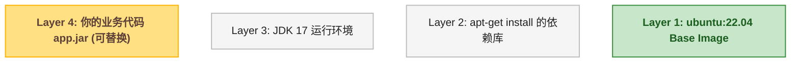
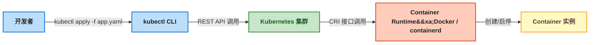
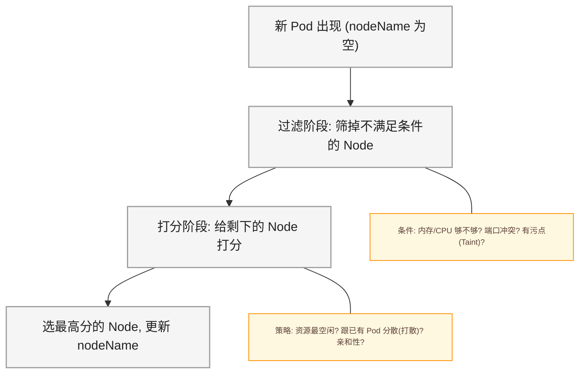
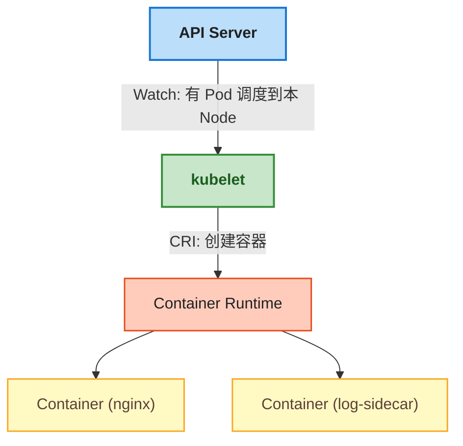
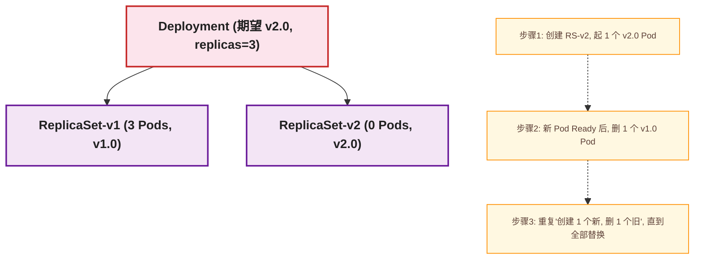
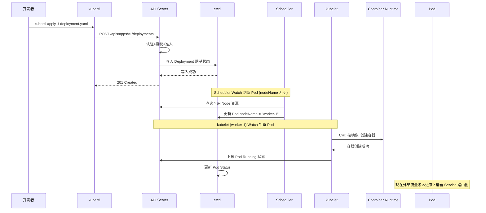
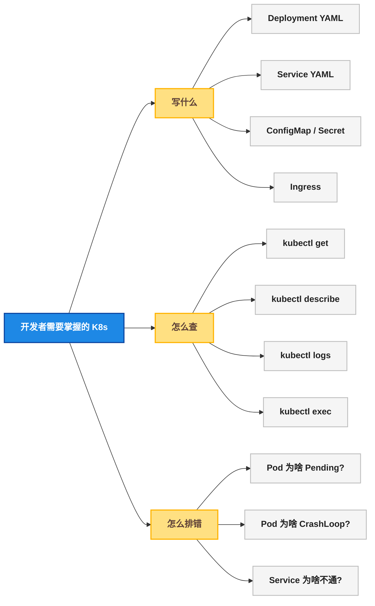

# Docker 与 K8s：从困惑到搞懂

## 一、目标说明

这篇文章要解决一个问题：**一个从来没碰过容器的后端开发，怎么搞懂 Docker 和 K8s 那一堆名词？**

读完这篇文章，读者能搞清楚以下事情：

- Docker 的 Image（镜像）和 Container（容器）到底是什么关系
- 为什么有了 Docker 还不够，还要搞一个 K8s 出来
- K8s 的 Master / Worker Node 上各自跑了哪些组件，它们怎么配合
- Pod、Deployment、Service、ConfigMap、Secret、Namespace 这些概念分别解决什么问题
- 一个 `kubectl apply` 命令背后，K8s 集群里发生了什么

> ⚠️ 新手提示：这篇文章**不会**让你动手敲任何命令。目的是在脑子里建一张"K8s 全景地图"。有了这张地图，后面写 YAML、敲 kubectl 的时候才知道每一行是在操作什么东西。

---

## 二、前置条件

读者需要具备以下基础（都很基本）：

| 前置知识 | 要求程度 | 验证方式 |
|----------|:---:|------|
| Linux 基本命令 | 会用 `cd`、`ls`、`cat`、`ps` | 打开终端敲一下看看 |
| 进程概念 | 知道一个程序运行起来就是一个进程 | 打开任务管理器看一眼 |
| IP + 端口 | 知道 `127.0.0.1:8080` 是什么意思 | 用过浏览器访问 `localhost` 即可 |
| YAML 格式 | 见过 YAML，知道缩进表示层级 | 写过 Spring Boot 的 `application.yml` 就算 |

如果以上都 OK，往下看。

---

## 三、环境搭建（脑子里的环境）

这一节不装任何软件，只在脑子里搭一个"概念沙盒"。

### 3.1 先搞清楚：没有 Docker 的时候，部署一个 Java 应用有多痛苦

某开发者在服务器上部署一个 Spring Boot 应用：

```bash
# 1. 装 JDK 17（服务器上可能装的是 JDK 8，先卸载再装新的）
# 2. 配置环境变量 JAVA_HOME
# 3. 上传 jar 包到服务器
# 4. nohup java -jar app.jar > app.log 2>&1 &
# 5. 祈祷不要出问题
```

问题清单（写过的都懂）：

- 换了台机器，JDK 版本不对，启动报 `UnsupportedClassVersionError`
- 服务器上已经有别的应用占了 8080 端口
- 重启服务器后进程没了，得手动拉起来
- 三台机器要部署三次，改配置改到怀疑人生

Docker 解决的就是这个 **"在我机器上能跑，到你机器上跑不了"** 的问题。

### 3.2 Image（镜像）和 Container（容器）—— 两个被严重滥用的词

用一张图把这两个概念钉死在脑子里：


**Image（镜像）= 只读模板，像游戏安装包**

- 下载了《黑神话：悟空》的安装包（Image），还没安装
- 安装包是只读的，不能改
- 可以在 10 台电脑上各装一次——每台电脑各自跑各自的游戏进程

Image 内部是**分层文件系统**（UnionFS）：



每一层都是只读的。Docker 用 UnionFS 把这些层"叠"成一个完整的文件系统。换 JDK 版本？只需要替换 Layer 3，不用重装整个操作系统。

**Container（容器）= Image 的运行实例，像安装后正在运行的游戏**

- Image + 一个额外的**可写层**（Writable Layer）
- 容器本质上是宿主机上的一个**进程**，但被 Linux Namespace 隔离了
- 容器有自己的进程空间、网络、文件系统——看起来像一台独立的小机器

> ⚠️ 新手提示：容器**不是**虚拟机。虚拟机要虚拟整个操作系统内核，容器直接共用宿主机内核，所以容器启动快（秒级）、占用小（MB 级）。这点理解错了后面全歪。

**Image 和 Container 的关键区别：**

| 维度 | Image | Container |
|------|-------|-----------|
| 类比 | 安装包 | 运行中的程序 |
| 可写性 | 只读 | 有可写层 |
| 数量 | 一个 Image 可以跑出 N 个 Container |
| 生命周期 | 存 registry 里，不"运行" | 有 `running` / `stopped` / `exited` 状态 |
| 删除 | 删除 Image 不影响已有 Container | 删除 Container 后，可写层的数据全丢 |

有了 Docker，前面那个 Java 部署问题变成了：

```bash
# 1. 构建镜像（在你的开发机上）
docker build -t my-app:v1.0 .

# 2. 推送到镜像仓库
docker push my-registry/my-app:v1.0

# 3. 在任意一台服务器上拉镜像跑起来
docker run -d -p 8080:8080 my-registry/my-app:v1.0
```

JDK？打进了镜像。环境变量？打进了镜像。依赖库？打进了镜像。**镜像就是"可运行的部署单元"。**

---

## 四、Docker 和 K8s 的关系 —— 为什么有了 Docker 还要 K8s？

### 4.1 Docker 只管"一台机器上的容器"

Docker 做得很好的事情：

- `docker build` → 构建镜像
- `docker run` → 在本机启动一个容器
- `docker stop` / `docker rm` → 停止 / 删除容器
- `docker logs` → 查看容器日志

Docker **做不了**的事情：

- 容器挂了自动重启？Docker 可以（`--restart=always`），但这是在单机上
- 一台机器宕机，容器自动迁移到另一台？做不到
- 100 个容器分布在 5 台机器上，怎么均匀调度？做不到
- 容器之间怎么互相发现、怎么负载均衡？自己搞

这些就是 **Kubernetes（K8s）** 要解决的问题。

### 4.2 一句话定义

> Docker 是**单机容器运行时**（负责把镜像变成运行的容器），K8s 是**集群容器编排平台**（负责决定哪些容器跑在哪些机器上、跑几个、死了怎么拉起来、它们之间怎么通信）。



> ⚠️ 新手提示：K8s 1.24 之后**不再默认支持 Docker 作为容器运行时**（改用 containerd），但对开发者来说几乎无感——镜像还是那个镜像，Dockerfile 还是那个 Dockerfile。变化的只是 K8s 跟容器运行时之间的接口，开发者感知不到。

---

## 五、K8s 架构全景 —— 集群里到底有什么

先看一张全景图，再逐个拆解。


### 5.1 Control Plane（Master Node）—— 集群的大脑

**API Server（kube-apiserver）**

> 📌 前置知识：REST API、HTTP 请求 / 响应

API Server 是集群的**唯一入口**。一切操作——`kubectl apply`、`kubectl get`、Dashboard 点击——最终都是向 API Server 发 HTTP 请求。

关键特点：

- **无状态**：可以部署多个实例做高可用
- **唯一能操作 etcd 的组件**：其他所有组件都不能直接访问 etcd，必须通过 API Server
- **认证 + 授权 + 准入控制**：你是谁、你能干什么、你的请求合不合法——三道关卡全在 API Server 过

**etcd**

简单理解：**etcd 是一个分布式的 KV（Key-Value）存储**，存的是整个集群的"期望状态"和"当前状态"。

- 有多少个 Deployment？存在 etcd
- 每个 Deployment 有几个 Pod？存在 etcd
- 哪些 Node 在线？存在 etcd
- 所有 Secret 和 ConfigMap 的内容？存在 etcd

> ⚠️ 新手提示：etcd 是 K8s 唯一的**有状态**组件。etcd 挂了 = 集群失忆 = 所有操作卡死（已有 Pod 还能跑，但新建、修改、删除全废）。生产环境 etcd 至少 3 节点。

**Scheduler（kube-scheduler）**

Scheduler 只做一件事：**给新创建的 Pod 找一个合适的 Node**。

它不直接创建容器，只是在 etcd 里把 Pod 的 `nodeName` 字段从空填成目标 Node 的名字。真正的创建动作由 kubelet 完成。

调度逻辑大致是：



**Controller Manager（kube-controller-manager）**

里面跑着一堆 Controller，每个 Controller 都是一个**控制循环**：

```
观察当前状态 → 对比期望状态 → 如果不一致 → 执行操作 → 回到第一步
```

比如 Deployment Controller 的工作循环：

- 期望 `replicas: 3`
- 当前只有 2 个 Pod 在跑
- 不一致！创建 1 个新 Pod

> ⚠️ 新手提示：Controller Manager **不直接创建 Pod**。它会创建 ReplicaSet，ReplicaSet 再创建 Pod。这个过程通过向 API Server 写入资源对象来完成，不是"直接下令"。

### 5.2 Worker Node —— 跑 Pod 的机器

**kubelet**

kubelet 是每个 Node 上**唯一的守护进程**。它做三件事：

1. **Watch API Server**：监听有没有调度到自己 Node 上的 Pod
2. **调用 Container Runtime**：通过 CRI（Container Runtime Interface）拉镜像、创建容器
3. **上报状态**：定期向 API Server 报告本 Node 的健康状况和 Pod 运行状态

关系图很简单：



**kube-proxy**

kube-proxy 在每个 Node 上维护一套 **iptables（或 IPVS）规则**，实现 Service 的负载均衡。

后面讲 Service 的时候会详细展开，现在先记住：**kube-proxy 是 Service 虚拟 IP 能工作的原因**。

**Container Runtime（容器运行时）**

就是实际拉镜像、创建容器、启停容器的那个程序。常见选择：

| 运行时 | 说明 |
|--------|------|
| containerd | K8s 1.24+ 默认推荐，Docker 底层也用它 |
| CRI-O | 专为 K8s 设计，轻量 |
| Docker（dockershim 已废弃）| 1.24 之前默认支持 |

---

## 六、核心概念层级 —— 从 Container 到 Deployment 的完整链条

这一节是整篇文章**最重要的部分**。理解这些概念之间的层级关系，后面写 YAML 才不会写出"精神分裂的配置"。

### 6.1 全景层级图

已经在上面的 DrawIO 图中展示了完整链条。这里逐个拆解。

### 6.2 Container（容器）

开发者最熟悉的层次。一个镜像跑起来就是一个容器。开发者日常：

- 写 Dockerfile
- `docker build -t my-app:v1.0 .`
- `docker run -d -p 8080:8080 my-app:v1.0`

但在 K8s 里，**开发者不直接操作 Container**。Container 被包裹在 Pod 里面，作为 Pod 的一部分存在。

### 6.3 Pod —— 最小调度单元，不是最小运行单元

Pod 是 K8s 里**能创建和管理的最小单位**。关键特征：

- **1 个 Pod = 1 ~ N 个容器**
- 同一个 Pod 内的所有容器共享：
  - 同一个网络命名空间 → 同一个 IP 地址 → 容器之间用 `localhost` 通信
  - 同一个 IPC 命名空间 → 共享内存通信
  - 可以挂载相同的存储卷
- Pod 是**临时的（ephemeral）**——Pod 重启后 IP 会变！

<div style="max-width:640px;margin:16px auto;padding:12px;background:#E3F2FD;border:1.5px solid #1565C0;border-radius:8px;">

<div style="font-size:13px;font-weight:bold;color:#1565C0;margin-bottom:8px;">Pod 内部结构示意（自上而下）</div>

<div style="background:#BBDEFB;border:1.5px solid #1976D2;border-radius:6px;padding:4px 10px;margin-bottom:6px;font-size:12px;color:#212121;">
  Pod IP: 172.17.0.5（整个 Pod 共享一个 IP）
</div>

<div style="display:flex;gap:8px;margin-bottom:6px;">
  <div style="flex:1;background:#C8E6C9;border:1.5px solid #388E3C;border-radius:4px;padding:6px 10px;font-size:11px;color:#1B5E20;text-align:center;">
    <strong>Container A</strong><br/>nginx:1.25 (端口 80)
  </div>
  <div style="flex:1;background:#C8E6C9;border:1.5px solid #388E3C;border-radius:4px;padding:6px 10px;font-size:11px;color:#1B5E20;text-align:center;">
    <strong>Container B</strong><br/>log-collector (Sidecar)
  </div>
</div>

<div style="background:#E8EAF6;border:1.5px dashed #3F51B5;border-radius:4px;padding:4px 10px;font-size:11px;color:#283593;">
  共享存储卷 (Volume): /var/log, 容器 A 写入, 容器 B 读取
</div>

</div>

**常见 Pod 模式：**

| 模式 | 容器组成 | 例子 |
|------|----------|------|
| 单容器 Pod | 1 个主容器 | 90% 的场景，就是一个应用 |
| Sidecar 模式 | 主容器 + 辅助容器 | nginx + 日志收集器 |
| Init Container | 初始化容器 + 主容器 | 先跑迁移脚本，再启动应用 |

> ⚠️ 新手提示：**不要**把多个不相关的应用塞进同一个 Pod。Pod 是"一起调度、一起启停、共享生命周期"的最小单位。如果两个服务可以独立扩缩容——它们就应该在不同的 Deployment、不同的 Pod 里。

### 6.4 ReplicaSet —— Pod 副本数的"保安"

ReplicaSet 只做一件事：**确保"期望数量的 Pod 副本"始终在运行**。

```
期望 replicas = 3
  → Pod-A 挂了？
    → 当前只有 2 个
      → 立即创建 1 个新的
        → 恢复 3 个
```

开发者**几乎不直接操作 ReplicaSet**。99.99% 的情况是通过 Deployment 间接管理。ReplicaSet 只是 Deployment 的"内部实现细节"。

### 6.5 Deployment —— 开发者最常用的控制器

Deployment 是**无状态应用**的标准部署方式。它提供了：

| 能力 | 命令 | 效果 |
|------|------|------|
| 滚动更新 | `kubectl set image deploy/my-app app=my-app:v2.0` | 逐步用新版 Pod 替换旧版 Pod，服务不中断 |
| 回滚 | `kubectl rollout undo deploy/my-app` | 恢复到上一个版本 |
| 扩缩容 | `kubectl scale deploy/my-app --replicas=5` | 从 3 副本扩到 5 副本 |
| 暂停 / 恢复 | `kubectl rollout pause/resume` | 暂停更新，观察一段时间再继续 |

滚动更新的内部机制：



### 6.6 Service —— 给 Pod 一个"不变的联系方式"

Pod 的 IP 会变（重启、重建、调度到其他 Node 都换 IP）。如果前端直接连 Pod IP，Pod 一重启前端就 502。

Service 提供一个**永不变化的虚拟 IP（ClusterIP）**，并自动把流量转发到匹配的 Pod：


**Service 通过 Label Selector 找到 Pod：**

```
Service 定义:
  selector:
    app: user-api    ← 找所有带 "app=user-api" 标签的 Pod

Pod-A 标签: {app: user-api}  ← 匹配! 纳入 Endpoints
Pod-B 标签: {app: user-api}  ← 匹配! 纳入 Endpoints
Pod-C 标签: {app: other}     ← 不匹配, 忽略
```

**Service 的三种常用类型：**

| 类型 | 访问范围 | 用途 |
|------|----------|------|
| `ClusterIP` | 集群内部 | 微服务之间互相调用（默认） |
| `NodePort` | 集群外（NodeIP:30000-32767）| 开发调试、简单暴露 |
| `LoadBalancer` | 集群外（云厂商分配公网 IP）| 生产环境对外暴露 |

> ⚠️ 新手提示：Service 不是 Nginx，不是 HAProxy。它**本身不是一个进程在监听端口**。Service 只是一个"规则描述"——kube-proxy 读取这个规则，在每台 Node 上写 iptables/IPVS 规则来实现流量转发。所以 Service 没有"CPU 占用"、没有"内存泄露"，它就是一个虚拟概念。

### 6.7 ConfigMap 和 Secret —— 把配置从镜像里拆出来

镜像应该**与环境无关**。同一个 `my-app:v1.0` 镜像，在开发环境和生产环境通过不同的 ConfigMap/Secret 注入配置：

**ConfigMap —— 明文配置：**

```yaml
apiVersion: v1
kind: ConfigMap
metadata:
  name: app-config
data:
  APP_ENV: "production"
  LOG_LEVEL: "info"
  DATABASE_URL: "jdbc:mysql://db-host:3306/mydb"
```

**Secret —— 敏感信息（Base64 编码，注意不是加密！）：**

```yaml
apiVersion: v1
kind: Secret
metadata:
  name: app-secret
type: Opaque
stringData:
  DB_PASSWORD: "your-password"
  API_TOKEN: "sk-xxxxx"
```

> ⚠️ 新手提示：Secret 只是 **Base64 编码**，不是加密！任何人拿到 `kubectl get secret` 权限就能解码看到明文。生产环境加密方案通常是 Sealed Secrets 或外部 KMS（云厂商密钥管理服务）。

ConfigMap/Secret 可以通过三种方式注入 Pod：

| 注入方式 | 适用场景 |
|----------|----------|
| 环境变量 | 应用代码 `System.getenv("DB_PASSWORD")` 读取 |
| 文件挂载 | 配置文件 `application.yml` 整体替换 |
| 命令行参数 | 少数需要启动参数传入的场景 |

### 6.8 Namespace —— 逻辑隔离，不是物理隔离

Namespace 只是给资源加了"分组标签"：

- `default`：不带 `-n` 参数时的默认 Namespace
- `kube-system`：K8s 自己的系统组件（CoreDNS、kube-proxy 等）
- 自定义：`dev`、`staging`、`prod` 按环境分

> ⚠️ 新手提示：不同 Namespace 的 Pod **默认网络互通**（除非配了 NetworkPolicy）。Namespace 不是安全边界，只是组织边界。不要把"生产数据库密码"和"开发数据库密码"放在同一个 Namespace 就觉得安全了——该用 RBAC 配额 RBAC，该用 Secret 加密用 Secret 加密。

---

## 七、一个请求的完整旅程

把以上所有概念串起来。从开发者敲下命令，到用户访问到 Pod，完整链路如下：



> 📌 前置知识：sequenceDiagram 语法可以参考 Mermaid 官方文档，这里每个箭头都表示一次 API 调用或 Watch 事件。

---

## 八、概念速查表

本文提到的所有概念汇总（后续文章也会反复出现）：

| 概念 | 一句话定义 | 开发者需要会什么 |
|------|-----------|----------------|
| **Image** | 只读的容器模板，分层文件系统 | 写 Dockerfile，打镜像 |
| **Container** | Image 的运行实例，本质是进程 | `docker run` / `docker logs` |
| **Pod** | 最小调度单元，1~N 个容器的家 | 写 Pod YAML，理解共享网络/存储 |
| **Node** | 跑 Pod 的物理机或虚拟机 | 知道 Pod 会被调度到不同 Node |
| **Deployment** | 无状态应用的控制器 | **必会**：写 Deployment YAML、滚动更新、回滚 |
| **ReplicaSet** | Pod 副本数的维护者 | 不需要直接操作，Deployment 代管 |
| **Service** | Pod 的稳定网络入口（固定 IP） | **必会**：写 Service YAML，理解 label selector |
| **ConfigMap** | 非敏感配置 | **必会**：写 ConfigMap，注入环境变量/文件 |
| **Secret** | 密码、Token 等敏感信息 | **必会**：写 Secret，注意 Base64 ≠ 加密 |
| **Namespace** | 资源逻辑分组 | 会 `-n <ns>` 切换命名空间 |
| **Ingress** | 七层 HTTP 路由（域名→Service） | 会写 Ingress YAML（下一篇详讲） |
| **kubectl** | 开发者跟 K8s 交互的命令行 | **必会**：get / describe / logs / exec / port-forward |
| **kubelet** | 每个 Node 上的守护进程 | 不需要直接操作 |
| **kube-proxy** | Service 负载均衡的实现者 | 不需要直接操作，但要知道它存在 |
| **etcd** | 集群状态数据库 | 不需要直接操作（运维管） |
| **API Server** | 集群唯一入口 | 不需要直接操作 |
| **Scheduler** | Pod 调度决策 | 不需要直接操作 |

---

## 九、总结与下一步

### 9.1 脑图总结



### 9.2 记住三句话

1. **Docker 管单机，K8s 管集群**：Docker = 把镜像跑成容器，K8s = 决定哪个容器跑哪台机器、跑几个、死了怎么拉
2. **概念链条不能断**：Dockerfile → Image → Container → Pod → ReplicaSet → Deployment → Service，每一层都在解决上一层的问题
3. **开发者不需要当 K8s 管理员**：etcd、Scheduler、CNI 网络插件、RBAC 这些是运维的事。开发者只需要会写 Deployment/Service/ConfigMap/Ingress YAML + 会用 kubectl 排查

### 9.3 下一步

下一篇文章《第1步：写出你的第一个 K8s 应用》将动手实操：

- 用 Docker Desktop 打开 Kubernetes
- 写出第一个 Deployment + Service + ConfigMap + Secret YAML
- `kubectl apply` 部署到本地 K8s 集群
- 用 `kubectl port-forward` 访问你的应用
- 修改镜像版本，看滚动更新怎么自动完成
