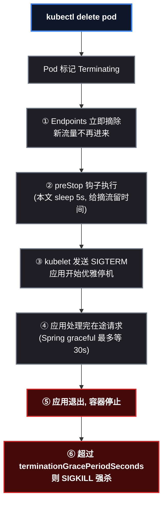
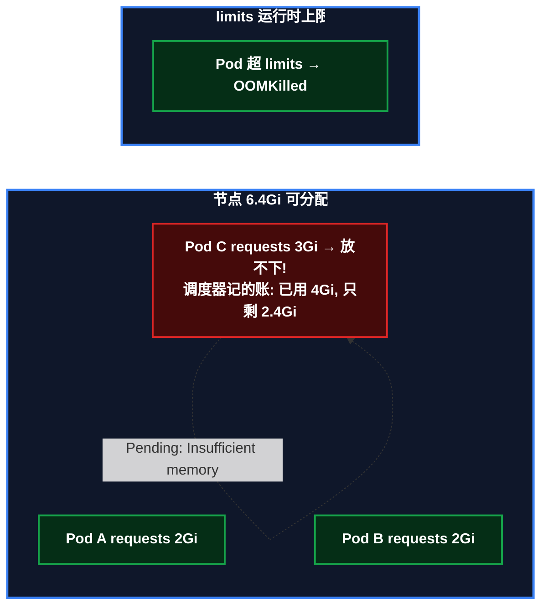

# 让应用体面地死，别被 OOM 悄悄杀

上一篇的探针解决了"应用是死是活"的自动判定，这一篇解决剩下的两个生产问题：**发版/缩容时正在处理的请求怎么办**（优雅停机），以及**节点资源怎么科学分配、应用怎么不被内存杀掉**（资源管理）。前者让应用"体面地死"，后者让应用"活着且不挤爆别人"。两件事都是 Java 应用上 K8s 后事故率最高的场景。

> 📌 前置知识：本文是 kind 系列第 6 篇，需要已完成前 5 篇——kind 集群、 ` k8s-demo-app ` 已部署（本文用 1.1 版，新增了 ` /api/slow ` 慢接口用于演示）、探针已配置。

## 这次要做什么

```
目标1: 配置优雅停机, 验证 Pod 被删时在途请求存活
目标2: 理解 requests/limits 资源账本, 实测 Pending 与 OOMKilled
产出: 生产级 YAML + 两组可复现演示 + 一个诚实的对照组分析
```

---

# 第一部分：优雅停机

## 原理：Pod 被删除时发生了什么

Kubernetes 删除 Pod 的完整时序（每个环节都有讲究）：



三个保护机制配合（缺一不可）：

| 机制 | 配置在哪 | 作用 |
|---|---|---|
| **readiness 摘流** | Deployment（上篇已配） | 应用"要死了"时先从 Endpoints 摘掉，新请求不再进来 |
| **preStop 缓冲** | Deployment lifecycle | 给摘流留时间（sleep 5s），避免 SIGTERM 来得太快 |
| **graceful 停机** | 应用内 `server.shutdown: graceful` | 收到 SIGTERM 后处理完在途请求才退出 |

时间预算： ` terminationGracePeriodSeconds ` （本文 35s）= preStop(5s) + graceful 处理在途(≤30s)，超出则 SIGKILL 强杀。

## 第0步：准备演示素材（慢接口 + 测试 Pod）

课 4 的演示需要一个"慢接口"来模拟长事务——瞬时接口体现不出"在途请求"。给应用加一个睡 10 秒的端点：

```java
// HelloController.java 追加
@GetMapping("/api/slow")
public String slow() throws Exception {
    Thread.sleep(10000);   // 10 秒, 模拟长事务 / 大文件下载
    return "slow-done";
}
```

重建镜像并更新 deployment（依赖层已缓存，只需几分钟）：

```bash
cd /root/k8s-demo-app
docker build -t k8s-demo-app:1.1 .        # 依赖层缓存生效, 只重编译源码
kind load docker-image k8s-demo-app:1.1 --name learn
kubectl set image deployment/demo-app demo=k8s-demo-app:1.1
kubectl rollout status deployment/demo-app --timeout=120s
```

准备集群内的测试 Pod（演示中用它在集群里发请求，模拟"另一个服务"）：

```bash
kubectl run dns-test --image=busybox:1.36 --restart=Never --command -- sleep 3600
kubectl wait --for=condition=Ready pod/dns-test --timeout=60s
```

> 📌 为什么演示要"直接打 Pod IP"而不是走 Service？因为 Service 会把请求负载均衡到两个副本，无法确定慢请求落在哪个 Pod；直连 Pod IP 才能保证"请求一定在目标 Pod 上"，演示才确定可复现。

## 第1步：配置（应用侧 + 集群侧）

应用侧（ ` application.yml ` ，系列第 4 篇已内置）：

```yaml
server:
  shutdown: graceful            # 收到 SIGTERM 后等待在途请求完成
spring:
  lifecycle:
    timeout-per-shutdown-phase: 30s   # 最多等 30 秒
```

集群侧（Deployment 追加）：

```yaml
spec:
  terminationGracePeriodSeconds: 35   # 总预算: preStop + graceful
  template:
    spec:
      containers:
      - name: demo
        lifecycle:
          preStop:
            exec:
              command: ["sh", "-c", "sleep 5"]   # 摘流缓冲
```

部署后先**验证应用实际生效的停机模式**（防止环境变量悄悄覆盖镜像配置——这是本次实操踩过的坑）：

```bash
POD=$(kubectl get pods -l app=demo-app -o jsonpath='{.items[0].metadata.name}')
kubectl exec $POD -- env | grep -i shutdown || echo "内置 graceful"
# 无输出 = 用镜像内 application.yml 的 graceful
# 有 SERVER_SHUTDOWN=xxx = 被环境变量覆盖了, 需清理 (见第3步的坑)
```

## 第2步：演示——慢请求在 Pod 被删时存活

应用新增 ` /api/slow ` （睡 10 秒返回，模拟长事务）。直接打 Pod IP（绕过 Service 负载均衡，确定命中目标 Pod）：

```bash
# 取目标 Pod 和它的 IP
POD=$(kubectl get pods -l app=demo-app -o jsonpath='{.items[0].metadata.name}')
PIP=$(kubectl get pod $POD -o jsonpath='{.status.podIP}')

# 后台发起 10 秒慢请求
kubectl exec dns-test -- sh -c \
  "wget -qO- -T 15 http://$PIP:8080/api/slow > /tmp/slow.out 2>&1; echo EXIT=\$? > /tmp/slow.exit" &

sleep 2
# 2 秒后删除该 Pod
kubectl delete pod $POD --wait=false

wait
# 结果
kubectl exec dns-test -- cat /tmp/slow.exit    # EXIT=0
kubectl exec dns-test -- cat /tmp/slow.out     # slow-done

# 被删 Pod 的日志（优雅停机实锤）
kubectl logs $POD --tail=50 | grep -iE "graceful|shutdown"
# Commencing graceful shutdown. Waiting for active requests to complete
# Graceful shutdown complete
```

**结果解读**：慢请求在第 2 秒被打断（Pod 被删），但应用在第 7 秒才收到 SIGTERM（preStop 5s），随后 graceful 模式等待在途请求——第 10 秒请求完成、响应送达，第 13 秒应用才真正退出。**请求全程无感知**。

## 对照组：为什么"关闭优雅停机"没有复现断连？

按预期，把 `SERVER_SHUTDOWN=immediate` + 去掉 preStop 应该能看到请求被切断——但实测**连续两次都是 EXIT=0**（请求照样完成）。这个"失败的对照组"比成功的演示更有教学价值：

| 原因 | 说明 |
|---|---|
| endpoints 先行摘除 | Pod 进入 Terminating 瞬间就被移出 Service 后端，新连接根本不会进来 |
| Spring 会写完响应 | 即使 immediate，已建立的连接上 Spring 仍会尽量写完当前响应 |
| 单请求场景太简单 | 真实生产断连发生在**长事务 + 连接池复用**场景——同一个连接上多个请求交替，进程一死全部遭殃 |

> ⚠️ 结论：生产环境的断连防护不能依赖任何单层——**readiness 摘流 + preStop 缓冲 + graceful 处理在途**三层配合才是正解。对照组没复现断连，恰恰证明了前两层（摘流 + 缓冲）在简单场景下已经足够。

## 第3步：一个真实的坑—— ` kubectl set env ` 的变量清不掉

这次实操直接踩中：第一轮演示慢请求被切断（EXIT=1），排查半天误以为是优雅停机失效，最后发现是之前演示对照组时 ` kubectl set env SERVER_SHUTDOWN=immediate ` 的残留——** ` kubectl apply -f ` 旧清单并不会清掉 ` kubectl set env ` 加的环境变量**（列表字段的合并语义问题），而环境变量优先级高于镜像内配置，导致应用一直在 immediate 模式。显式删除才是确定性的：

```bash
kubectl set env deployment/demo-app SERVER_SHUTDOWN-   # 变量名加 - 号 = 删除
```

> ⚠️ 排查这类问题看两处： ` kubectl get deploy xxx -o yaml | grep 变量名 ` （deployment 里还有没有）和 ` kubectl exec <pod> -- env | grep 变量名 ` （Pod 里实际有没有）——两者可能不一致。

---

# 第二部分：资源管理

## 原理：requests 与 limits 是两本账

| 参数 | 谁用 | 作用 | 超了会怎样 |
|---|---|---|---|
| ` requests ` （请求） | **调度器** | 记账：决定 Pod 放哪个节点 | 没有节点放得下 → Pod 卡 Pending |
| ` limits ` （上限） | **运行时**（cgroup） | 限额：限制 Pod 实际可用资源 | 超内存 → 内核 OOM 杀容器 |



**副本数上限公式**： ` 节点可分配资源 ÷ 单副本 requests ` 。两个 worker 合计约 12.8Gi 可分配，单副本 requests 4Gi → 上限 3 个（2 节点 × 1 个 + 余量不足第二个）——这就是"节点不多但能跑很多副本 / 节点很多但只能跑几个副本"的真相：**决定副本数的从来不是节点数量，是资源账本**。

## 第1步：演示——资源账本（requests 过大 → Pending）

```bash
# 给 Pod 设 requests.memory=4Gi, 扩容到 4 副本 (4×4Gi=16Gi > 12.8Gi)
kubectl patch deployment demo-app --type=json -p='[
  {"op":"add","path":"/spec/template/spec/containers/0/resources",
   "value":{"requests":{"memory":"4Gi"}}}
]'
kubectl scale deployment demo-app --replicas=4
sleep 25
kubectl get pods -l app=demo-app -o wide
# 2 个 Running (每个节点各 1 个), 2 个 0/1 Pending

# 看调度器为什么拒绝
kubectl describe pod <Pending的Pod> | grep -A3 FailedScheduling
# Warning  FailedScheduling  0/3 nodes are available:
#   1 node(s) had untolerated taint(s),        ← control-plane 的 NoSchedule
#   2 Insufficient memory                       ← 两个 worker 账本都不够
```

调度器像记账员：4Gi × 2 副本已经占满两个节点（每节点 6.4Gi 剩 2.4Gi 不够 4Gi），第三、四个副本**没有节点可放 → Pending**。恢复： ` kubectl patch ` 移除 resources + ` kubectl scale --replicas=2 ` 。

## 第2步：演示——OOMKilled（limits 太小被内核杀）

```bash
# 设 limits.memory=100Mi (JVM+Spring 实际需要 ~200MB)
kubectl patch deployment demo-app --type=json -p='[
  {"op":"add","path":"/spec/template/spec/containers/0/resources",
   "value":{"limits":{"memory":"100Mi"}}}
]'
sleep 40
kubectl get pods -l app=demo-app
# 新 Pod: 0/1 CrashLoopBackOff  2     ← 反复被 OOM 杀
# 恢复后残留 Pod: 0/1 OOMKilled          ← 内核 OOM 的直接证据
```

**原理**：limits 通过 cgroup 限制容器内存，JVM 试图分配超过 100Mi → 内核 OOM killer 直接杀容器 → kubelet 重启 → 又 OOM → CrashLoopBackOff 循环。

恢复（移除 limits，回到 2 副本）：

```bash
kubectl patch deployment demo-app --type=json -p='[
  {"op":"remove","path":"/spec/template/spec/containers/0/resources"}
]'
kubectl scale deployment demo-app --replicas=2
kubectl rollout status deployment/demo-app --timeout=120s
# 观察: 残留的坏 Pod 会以 OOMKilled 状态被清理, 新 Pod 正常
```

## Java 应用必须配合的 JVM 参数

```dockerfile
ENTRYPOINT ["java", "-XX:MaxRAMPercentage=75", "-jar", "app.jar"]
```

JVM 默认按**物理内存的 1/4** 设置堆上限——容器限制 512Mi 时堆会试图吃 1.9Gi，直接 OOM。`-XX:MaxRAMPercentage=75` 让堆按**容器限制**（cgroup）自适应：限制 512Mi → 堆上限 384Mi，限制 2Gi → 堆上限 1.5Gi。**这是 Java 应用上 K8s 的必备参数，没有之一**。

> ⚠️ 生产建议：requests 与 limits 通常成对配置（经验值 requests = limits 或留少量余量），避免"调度时按小账本、运行时按大胃口"造成的节点超卖雪崩。

## 踩坑速查表

| # | 坑 | 现象 | 解法 |
|---|---|---|---|
| 1 | `kubectl set env` 变量残留 | apply 旧清单后 Pod 仍有旧 env | `kubectl set env deploy/xxx VAR-` 显式删除 |
| 2 | 副本数上不去 | 新 Pod 一直 Pending | `describe pod` 看 `FailedScheduling` → 调小 requests 或加节点 |
| 3 | 应用反复重启 | CrashLoopBackOff + OOMKilled | limits 太小 / 缺 `MaxRAMPercentage` |
| 4 | 只配 requests 不配 limits | 节点超卖 → 内存被打爆 | 成对配置 |

## 总结与下一步

**本课验证的两个机制**：优雅停机让在途请求体面完成（日志实锤），资源账本决定副本上限（Pending 实锤）与生死（OOMKilled 实锤）。加上上一篇的探针，应用在集群里已经做到"活得好、死得体、不挤人"。

**下一步**：把"观察回路"建起来——给应用接上 ` /actuator/prometheus ` （Micrometer 指标），接入 Prometheus + Grafana，让探针（控制回路）和监控（观察回路）双轨并行。这也是本系列的收官篇。

系列文章：kind 搭建集群 → Deployment 实战 → Service/Ingress 实战 → Spring Boot 容器化与配置注入 → 探针三兄弟 → 优雅停机与资源管理（本篇）→ 可观测性（预告）。
