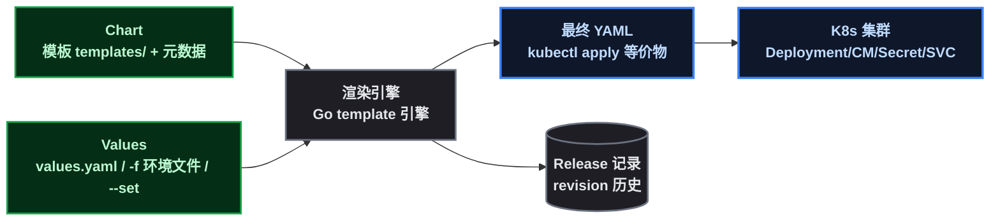

# YAML 堆成山之后：Helm 把清单变成包

系列前几课，我们一直用 `kubectl apply -f xxx.yaml` 部署应用——一个应用三四个清单文件，改环境就复制粘贴。这套姿势在小规模没问题，但想象一下真实场景：**10 个微服务 × dev/staging/prod 三个环境 = 30 套 YAML**，改一个端口要改 30 处，漏改一处就是环境事故，更别提回滚和复用。

Helm 就是来治这个病的——它是 **K8s 的包管理器**（类比 Java 的 Maven、Linux 的 apt）：把一套应用清单打包成 Chart，用参数渲染出任意环境，顺带管好安装/升级/回滚的完整生命周期。这一课把 demo-app 从 kubectl 迁移到 Helm，全程实测。

## 1. 动机先行：没有 Helm 之前有多痛

| 痛点 | 没有 Helm 时 | 有 Helm 后 |
|------|------|------|
| 多环境维护 | 每个环境复制一套 YAML，手改差异 | **一套模板 + 参数**（values 文件）渲染所有环境 |
| 参数化 | 改镜像 tag 要改 YAML 文件 | `--set image.tag=1.3` 或改 values |
| 版本管理 | YAML 散落各处，无版本概念 | Chart 有版本，release 有 revision |
| 回滚 | 手动恢复旧 YAML（痛苦） | `helm rollback` 一条命令 |
| 复用 | 复制整个目录 | 打包成 Chart 分发（像 npm 包） |
| 依赖 | 手动装各组件 | Chart 依赖声明（如依赖 ingress-nginx） |

**一句话**：kubectl 是"我要这个资源"，Helm 是"我要这套应用"——粒度从单资源提升到整个应用。

## 2. 原理先行：Chart、Release、Values

Helm 三个核心概念：

- **Chart（图表）**：一套应用的标准目录结构—— ` Chart.yaml ` （元数据）+ ` values.yaml ` （默认参数）+ ` templates/ ` （带 ` {{ }} ` 占位符的模板）；
- **Release（发布）**：Chart 的一次**安装实例**—— ` helm install demo-app ./chart ` 产生一个叫 ` demo-app ` 的 release，每次升级产生新 revision（可回滚）；
- **Values（参数）**：注入模板的值，来源优先级：`--set` 命令行 > `-f` 环境文件 > `values.yaml` 默认值。



模板语法就是 Go template：`{{ .Values.replicaCount }}` 引用参数，`{{- if .Values.probes.enabled }}...{{- end }}` 做条件渲染，`{{ .Release.Name }}` 引用 release 名（用它做资源名前缀，**同一套 Chart 装 dev/prod 两个 release 互不冲突**）。

## 3. 实践一：把 demo-app 清单改写成 Chart

### 3.1 安装 Helm

```bash
export https_proxy=http://127.0.0.1:7890 http_proxy=http://127.0.0.1:7890   # 国内环境
curl -sL -o /tmp/helm.tar.gz "https://get.helm.sh/helm-v3.15.4-linux-amd64.tar.gz"
tar -xzf /tmp/helm.tar.gz -C /tmp && mv /tmp/linux-amd64/helm /usr/local/bin/
helm version --short   # v3.15.4
```

### 3.2 Chart 结构

把前几课的 Deployment/ConfigMap/Secret/Service 四份清单收进一个目录：

```text
demo-app-chart/
├── Chart.yaml          # 元数据: name/version/appVersion
├── values.yaml         # 默认参数
├── values-dev.yaml     # 开发环境覆盖(可选)
├── values-prod.yaml    # 生产环境覆盖(可选)
└── templates/
    ├── deployment.yaml # {{ .Values.xxx }} 模板
    ├── configmap.yaml
    ├── secret.yaml
    └── service.yaml
```

` Chart.yaml ` ：

```yaml
apiVersion: v2
name: demo-app
description: k8s-demo-app Helm Chart
type: application
version: 0.1.0          # chart 版本
appVersion: "1.3"      # 应用版本
```

### 3.3 模板化的核心：参数替换 + 条件渲染

` values.yaml ` （全部可调参数）：

```yaml
replicaCount: 2
image:
  repository: k8s-demo-app
  tag: "1.3"
service:
  type: ClusterIP
  port: 8080
config:
  appMessage: hello-from-helm-default
  appMode: production
secret:
  dbPassword: S3cr3t-P@ss
gracePeriod: 35
preStopSleep: 5
probes:
  enabled: true
```

`templates/deployment.yaml` 的关键行（镜像、副本数、探针开关全参数化；**资源名用 `{{ .Release.Name }}` 前缀**）：

```yaml
metadata:
  name: {{ .Release.Name }}
spec:
  replicas: {{ .Values.replicaCount }}
  template:
    metadata:
      labels:
        app: {{ .Release.Name }}
    spec:
      containers:
        - name: demo
          image: "{{ .Values.image.repository }}:{{ .Values.image.tag }}"
          envFrom:
            - configMapRef:
                name: {{ .Release.Name }}-config
            - secretRef:
                name: {{ .Release.Name }}-secret
          lifecycle:
            preStop:
              exec:
                command: ["sh", "-c", "sleep {{ .Values.preStopSleep }}"]
          {{- if .Values.probes.enabled }}
          startupProbe:
            httpGet:
              path: /actuator/health
              port: 8080
            periodSeconds: 5
            failureThreshold: 30
          {{- end }}
```

> ⚠️ 新手提示： ` {{- if }} ` 的 ` - ` 是"吃掉相邻空白"，保证渲染出的 YAML 缩进正确。 ` if ` 块内部内容必须和容器字段保持**同一缩进**——这是 Helm 模板最容易写错的地方， ` helm template ` 预览 + ` helm lint ` 检查能兜底。

### 3.4 校验与多环境渲染

```bash
helm lint demo-app-chart                    # 语法检查
helm template demo-app demo-app-chart       # 渲染预览(不部署)
```

**多环境的价值在这一步显现**——同一套模板，两个环境文件渲染出两套清单：

```bash
helm template demo-app-dev demo-app-chart -f demo-app-chart/values-dev.yaml | grep APP_MESSAGE
# APP_MESSAGE: "hello-from-dev-values"
helm template demo-app-prod demo-app-chart -f demo-app-chart/values-prod.yaml | grep APP_MESSAGE
# APP_MESSAGE: "hello-from-prod-values"
```

`values-dev.yaml` 只写差异（1 副本、旧镜像、dev 消息），其他继承默认值——**不用再复制整套 YAML 了**。

## 4. 实践二：发布生命周期（install → upgrade → rollback）

### 4.1 迁移：从 kubectl 交给 Helm

先删掉 kubectl 管理的旧资源（清单要改名，避免冲突），再 ` helm install ` ：

```bash
kubectl delete deploy/demo-app cm/demo-config secret/demo-secret svc/demo-app-svc
helm install demo-app ./demo-app-chart
helm list   # demo-app  deployed  REVISION 1
kubectl get pods -l app=demo-app   # 资源名: demo-app / demo-app-config / demo-app-secret / demo-app-svc
```

> 📌 注意 Service 名：模板里 ` {{ .Release.Name }}-svc ` = ` demo-app-svc ` ，正好和 Prometheus 的抓取目标一致——**release 命名要照顾外部依赖的约定名**。

验证配置注入生效（Helm 渲染的 ConfigMap 值进了应用环境变量）：

```bash
kubectl exec <pod> -- curl -s http://localhost:8080/api/hello
# {"message":"hello-from-helm-default", ...}
```

### 4.2 升级：--set 改参数

```bash
helm upgrade demo-app ./demo-app-chart --set replicaCount=3 --set config.appMessage=hello-after-upgrade
```

**预期**：REVISION 2，副本数变 3。**实测结果**：副本数 ✅ 变了，但 message ❌ 没变——第三个新 Pod 是新值，前两个老 Pod 是旧值。这就是本课最大的坑，见 4.3。

### 4.3 坑：ConfigMap 内容变更不触发滚动更新

**症状**： ` helm upgrade --set config.appMessage=xxx ` 后，三个 Pod 返回的消息不一致——老 Pod 旧值、新起 Pod 新值：

```text
demo-app-79f7ffb74b-5m5jx → hello-from-helm-default   (49s 前启动, 旧值)
demo-app-79f7ffb74b-ltrl6 → hello-after-upgrade        (25s 前启动, 新值)
```

**排查**： ` kubectl get cm demo-app-config ` 确认 ConfigMap 已经是新值——问题不在 Helm 渲染，而在 K8s 机制：**Deployment 的 Pod 模板里 envFrom 引用的是 ConfigMap 的"名字"，ConfigMap 内容变了但名字没变，Pod 模板哈希不变 → 已运行的 Pod 不重启 → 环境变量永远是启动时的值**。只有新创建的 Pod 才读到新值。

**治本解法（Helm 惯例）**：在 Deployment 模板里加两个注释，把 ConfigMap/Secret 的内容哈希进 Pod 模板——内容一变哈希就变，Pod 模板跟着变，自动滚动：

```yaml
template:
  metadata:
    annotations:
      checksum/config: {{ include (print $.Template.BasePath "/configmap.yaml") . | sha256sum }}
      checksum/secret: {{ include (print $.Template.BasePath "/secret.yaml") . | sha256sum }}
```

加完注释再 upgrade，滚动自动发生，所有 Pod 都是新值：

```text
demo-app-ff4d9cbf7-72jpn → hello-from-checksum-v3
demo-app-ff4d9cbf7-rx8sz → hello-from-checksum-v3
```

> ⚠️ 新手提示：这是 Helm 使用者必踩的坑（不带 checksum 的 chart 改配置不生效）。很多现成 chart 模板里都带这行注释，就是这个原因。

### 4.4 回滚：Helm 的杀手锏

```bash
helm rollback demo-app 2    # 回到 REVISION 2
```

实测输出 ` Rollback was a success! Happy Helming! ` ，滚动后所有 Pod 回到 revision 2 的值（hello-after-upgrade）。 ` helm history ` 完整记录了这个故事：

```text
REVISION  STATUS      DESCRIPTION
1         superseded  Install complete
2         superseded  Upgrade complete
3         superseded  Upgrade complete
4         deployed    Rollback to 2
```

**回滚 = 一条命令 + 一个 revision 号**——对比传统运维"备份还原"的痛苦，这就是 Helm 管理发布的价值。

## 5. 原理复盘：Helm 到底管了什么

| 层面 | kubectl 直管 | Helm 管理后 |
|------|------|------|
| 资源创建 | 每个 YAML 单独 apply | 一个 Chart 一个 release |
| 参数化 | 无（改文件） | values / --set / 环境文件 |
| 多环境 | 复制整套 YAML | 一套模板 + 覆盖文件 |
| 版本历史 | 无 | release revision 全记录 |
| 回滚 | 手动恢复 | `helm rollback <rev>` |
| 卸载 | 逐个删资源 | `helm uninstall demo-app` |

**Helm 的元数据存在哪**：release 历史和渲染结果存在集群的 Secret 里（ ` helm list ` 、 ` helm history ` 读的就是它）——所以 release 是可审计、可回滚的。

**和 kubectl 的关系**：不是替代而是封装——Helm 渲染出的 YAML 最终仍由 K8s API 执行（等于批量 kubectl apply + 状态跟踪）。生产里二者配合：kubectl 管临时调试，Helm 管应用发布。

## 6. 总结

这一课把"发版"从手工劳动变成了三个动作：

1. **模板化**：Chart 把清单变成参数化的包，一套模板渲染所有环境（对应 Maven 之于 Java）；
2. **生命周期**：install / upgrade / rollback / uninstall 全由 release 管理，revision 可回滚；
3. **一个必背的坑**：ConfigMap/Secret 内容变更不触发滚动——**加 checksum 注释**是 Helm 惯例，不带它改配置等于没改。

到这一课，发布链路完整了：镜像（课1）→ 配置（课3）→ 健康（课4）→ 优雅停机（课5）→ **Helm 打包发布（课8）**。下一步就是把整套东西搬上 ACK——用 Helm 发布、云盘存储、SLB 接入，见系列后续。

（本篇无图片/视频占位。）
