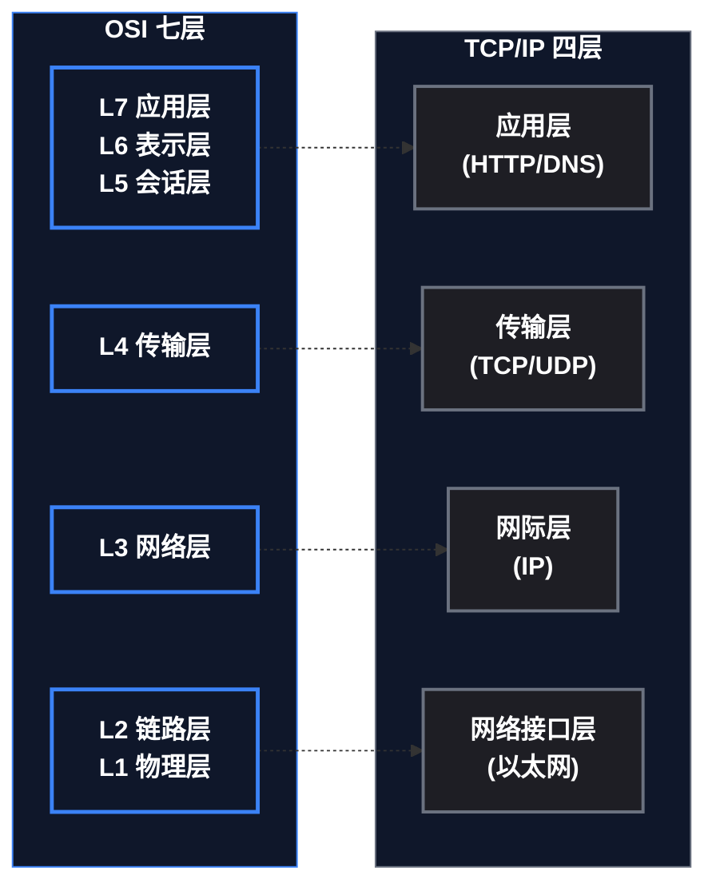
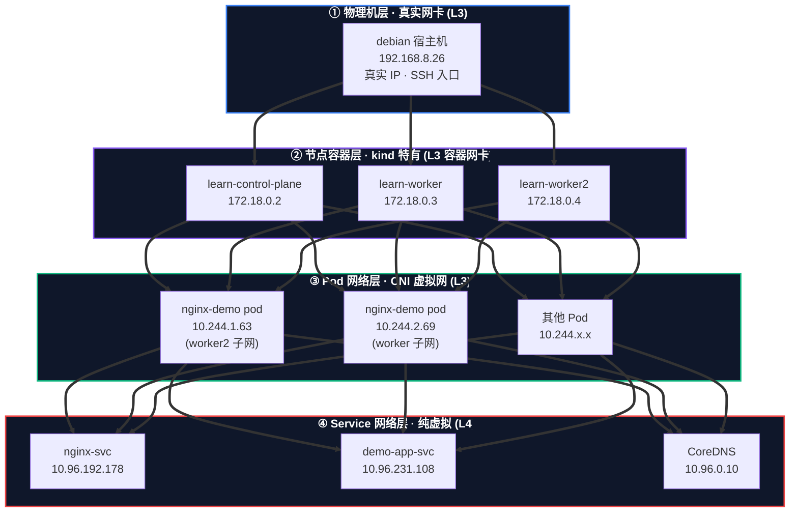
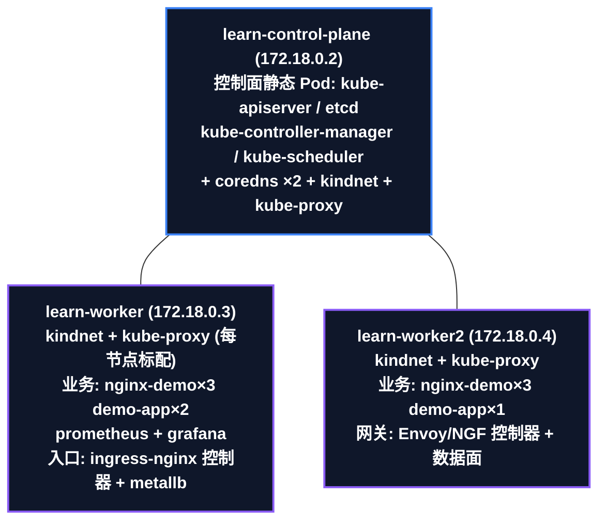
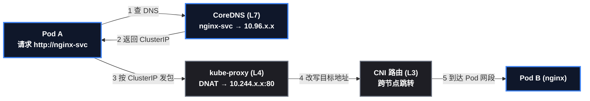

# 为什么 K8s 网络这么难懂

因为 K8s 的"网络"根本不是一张网，而是**多张网叠在一起**，而且不同组件在**不同的协议层**各干各的。以本文的 kind 集群为例，从外到内是**四层**：

| 层 | 网段（本文 kind 集群实测） | 谁的"地盘" |
|------|------|------|
| 物理机/宿主机 | ` 192.168.8.26 ` （debian 宿主机） | **真实网卡**（kind 之外的真实世界） |
| 节点容器（kind 特有） | ` 172.18.0.0/16 ` （节点 IP：172.18.0.2/3/4） | **kind 节点 = Docker 容器**，这是 Docker 网络分给节点容器的 IP，不是物理机 IP |
| Pod 网段 | ` 10.244.0.0/16 ` （Pod IP：10.244.1.x、10.244.2.x） | 集群内每个 Pod 一个 IP（CNI 的虚拟网） |
| Service 网段 | ` 10.96.0.0/16 ` （ClusterIP：10.96.x.x） | 虚拟的"服务名"入口 |

> ⚠️ 新手提示：**kind 里看到的 172.18.0.x 是"节点容器"的 IP，不是物理机 IP**——kind 的"容器即节点"让节点本身就是 Docker 容器（网络栈因此多一层）。kubeadm/生产集群没有这一层：节点就是物理机/虚拟机，**节点 IP = 物理机 IP**（如 192.168.8.26）。看下面的图就清楚了。

再加上：CoreDNS 在 **L7** 解析服务名、kube-proxy 在 **L4** 做转发、kindnet/CNI 在 **L3** 管 Pod IP 和路由、Ingress 在 **L7** 做域名路由——初学者拿着传统网络的知识套进来，发现"Pod 的 IP 不是 DNS 服务器的 IP"、"Service 的 IP 没有网卡"，自然就绕晕了。

这篇先用 OSI/TCP-IP 建立坐标系，再把 K8s 的每个通用组件**放进对应的层**，最后辨析那些最容易混的概念。

## 1. OSI 七层与 TCP/IP 四层回顾（坐标系）

### 1.1 OSI 七层（通俗版）

| 层 | 名字 | 一句话职责 | 传统世界的样子 |
|------|------|------|------|
| L7 | 应用层 | 应用程序的"语言"：HTTP、DNS、FTP | 你写的接口、浏览器请求 |
| L6 | 表示层 | 数据格式、加密、压缩 | 编码转换（现在大多并入应用层） |
| L5 | 会话层 | 建立/维持/断开会话 | 登录状态、连接保持（现在大多并入应用层） |
| L4 | 传输层 | 端到端传输：**端口** + 可靠性（TCP/UDP） | "发给哪台机器的哪个服务"——端口号在这层 |
| L3 | 网络层 | **IP 地址** + 路由：跨网络寻址 | 路由器的活：数据包怎么跳到目标网段 |
| L2 | 数据链路层 | MAC 地址 + 帧：同网段内交付 | 交换机：把帧交给同网段的下一跳 |
| L1 | 物理层 | 比特流：网线、信号 | 网卡、网线、无线信号 |

**记忆口诀**：从下往上——"物理传比特、链路找 MAC、网络定 IP、传输分端口、应用懂语义"。

**封装与解封装**（理解分层的关键）：数据从应用层出发，每往下一层就包一层"信封"（L4 加端口信息、L3 加 IP 地址、L2 加 MAC 地址），接收方每往上一层就拆一层信封。就像寄快递：你写地址（应用层），快递公司贴面单（网络层），货车按路段交接（链路层），每个环节只关心自己那一层的信息。

### 1.2 TCP/IP 四层与 OSI 的映射

**关键认知**：TCP/IP 把 OSI 的 L5-L7 合并成"应用层"，L1-L2 合并成"网络接口层"，中间 L3/L4 一一对应。**我们讨论 K8s 网络时，主要用到的是 L2/L3/L4/L7**（L1 网线、L5/L6 已并入应用层，基本不参与讨论）。

## 2. K8s 的多层网络（全景框架）

**读图方法**：四层容器（①②③④），每层装着自己的 **IP 实例**——物理机层只有 192.168.8.26，节点层是 3 个容器 IP，Pod 层是真实的 10.244.x.x，Service 层是虚拟的 10.96.x.x（CoreDNS 10.96.0.10 也在其中）。**"哪个 IP 属于哪层"从图上一眼可见**；粗箭头是数据包穿透路径。颜色从蓝（真实）渐变到红（纯虚拟），文字为高对比浅色。

**各层网络的定位**：

| 层 | 谁在用 | 谁维护 | 本质 |
|------|------|------|------|
| 物理机网段 | 宿主机操作系统 | 你的基础设施（物理机/虚拟机） | **真实存在的网卡 IP**（如 debian 的 192.168.8.26） |
| 节点容器网段（kind 特有） | kind 节点容器 | Docker 网络（kind 网络） | 容器网卡 IP；**kubeadm/生产集群没有这层**，节点 IP 就是物理机 IP |
| Pod 网段 | 每个 Pod（虚拟网卡） | **CNI 插件**（kind 里是 kindnet，生产是 Calico/Terway/Flannel） | 集群内部的"虚拟网"，Pod 们在这个网段里互访 |
| Service 网段 | Service 的 ClusterIP | **kube-proxy**（iptables/ipvs 规则） | **纯虚拟的**——没有任何网卡有这个 IP，它只存在于转发规则里 |

> ⚠️ 新手提示： ` 10.96.0.1 ` 是集群 API Server 的 Service、 ` 10.96.0.10 ` 是 CoreDNS 的 Service——它们也在 Service 网段里，说明"集群的 DNS 本身也是一个 Service"。这就是"Pod 的 IP 不是 DNS 服务器的 IP"的来源：**Pod IP 是 10.244.x.x，DNS 的 IP 是 10.96.0.10，它们本来就在不同的网**。

## 3. K8s 通用组件逐层对应（职责地图）

不管 kind 还是 kubeadm，下面这些组件都有（名字可能略有差异），按协议层放：

| OSI 层 | K8s 组件 | 在这一层干什么 | 传统世界的对应物 |
|------|------|------|------|
| **L1/L2**（物理/链路） | 节点网卡、Docker bridge、CNI 的 veth 对 | 把比特和帧在节点/容器间搬动；veth 对 = 一根"虚拟网线" | 网线、交换机 |
| **L3**（网络） | **CNI（kindnet/Calico/Terway）** | 给 Pod 分配 IP（IPAM）、维护路由规则，让跨节点 Pod 能互通 | 路由器 + DHCP |
| **L4**（传输） | **kube-proxy + Service** | 把"ClusterIP:端口" DNAT 到后端 Pod（iptables/ipvs 规则）；Endpoints 提供后端列表 | 负载均衡器（四层） |
| **L7**（应用） | **CoreDNS** | 解析服务名 → ClusterIP（ ` nginx-svc ` → ` 10.96.x.x ` ） | DNS 服务器 |
| **L7**（应用） | **Ingress / Gateway API** | 按域名 + 路径路由到 Service；终止 TLS | 反向代理 / Nginx |

**一句话总览**：CNI 管"Pod 之间怎么走"（L3），kube-proxy 管"流量怎么到 Service 后端"（L4），DNS 管"名字怎么变成 IP"（L7），Ingress 管"域名怎么找到 Service"（L7）——**各管一层，互不越界**。

### 3.5 组件在集群里的位置地图（实测）

上面讲了"每个组件干什么"，这一节回答"每个组件在哪"——使用者脑袋里必须有的那张图。**本文 kind 集群实测分布**：

**部署形态决定"它在哪"**：

| 组件 | 部署形态 | 位置（实测） | 数量 |
|------|------|------|:---:|
| kube-apiserver / etcd / controller-manager / scheduler | **静态 Pod**（绑定节点，kubeadm 方式） | 全部在 control-plane 节点 | 各 1 |
| kube-proxy | **DaemonSet**（每节点必有一个） | 3 个节点各 1 个 | 3 |
| kindnet（CNI） | **DaemonSet** | 3 个节点各 1 个 | 3 |
| coredns | Deployment | 都调度到了 control-plane（**它有控制面污点的容忍度**） | 2 |
| ingress-nginx 控制器 | Deployment | learn-worker | 1 |
| Envoy Gateway / NGF 控制器 | Deployment | learn-worker2 | 各 1 |
| 业务 Pod（nginx-demo 等） | Deployment | 分散在两个 worker | 按副本 |

**四个位置认知（记住这张图）**：

1. **控制面 4 件套永远在控制面节点**——kubeadm 方式下是静态 Pod（绑定节点、名字带节点名）；**上 ACK 托管版后这 4 个消失**（平台托管，你看不到也管不到）；
2. **DaemonSet = 每节点标配**：kube-proxy 和 CNI 是"每个节点必须有一个"，新节点加入自动补齐——排障时"某节点网络不通"先看这两样在不在；
3. **业务 Pod 永不上 control-plane**（污点 ` NoSchedule ` ，前面学过）；**coredns 是例外**——系统组件带容忍度，能上控制面（实测两个副本都在 control-plane）；
4. 上云后节点侧组件（kube-proxy/CNI/kubelet）**依然每节点存在**——它们就是"节点标配"，不管自建还是托管。

### 3.6 Spring Cloud 开发者视角：这些概念你早就见过

如果你是 Spring Cloud 开发者，上面每个组件都能找到"老熟人"——而且对比之后会发现一个贯穿全文的洞察：

| K8s 概念（这篇学的） | Spring Cloud 里的对应 | 核心区别 |
|------|------|------|
| **Service（ClusterIP）+ Endpoints** | Nacos 注册中心 / 服务发现 | Nacos 要代码集成（ ` @EnableDiscoveryClient ` + 心跳续约）；Service 是平台声明（ ` selector ` 自动匹配 Pod、Endpoints 自动维护）——**服务发现从应用代码下沉到平台层** |
| **CoreDNS 服务名解析** | Eureka/Nacos 地址簿 + Feign/Ribbon 拿实例 | 都是"名字 → 地址"，但 DNS 不用引依赖、不用写 ` @FeignClient ` ——服务名直接当 URL 用 |
| **kube-proxy 负载均衡** | Ribbon / Spring Cloud LoadBalancer | Ribbon 是**客户端负载均衡**（写在调用方代码里）；kube-proxy 是**平台透明负载均衡**（iptables DNAT，调用方无感知）——**负载均衡也从代码下沉到平台** |
| **Ingress / Gateway API** | Spring Cloud Gateway | 同是 L7 网关（域名/路径路由），但 Spring Cloud Gateway 是**要自己部署维护的应用**；Ingress 是**声明式资源**（控制器实现，平台管） |
| **Pod IP 会变** | 服务实例 IP 会变（重启换 IP） | 传统微服务靠 Nacos 心跳续约兜住；K8s 由 Service 的 Endpoints 自动兜住——调用方始终无感 |

**一句话主线**：*Spring Cloud 用代码解决的问题（注册、发现、负载均衡），K8s 全部下沉到平台层*——代码里不再需要 Nacos 客户端、不需要 Ribbon 依赖，剩下的只是"声明一个 Service，平台帮你搞定服务发现和负载均衡"。这就是"云原生"对微服务架构最直接的含义。

> 📌 对 Spring Cloud 开发者：回到第 2 节的三层网络——传统微服务的"内网"就是同一个网段直连；K8s 把"内网"拆成了 **Pod 网（实例 IP）+ Service 虚拟网（服务名入口）** 两层，你的服务间调用从"走 Nacos 拿实例 IP"变成"走 DNS 拿 Service 名"——**概念一样，位置从应用层搬到了平台层**。

## 4. 最容易混的概念辨析

### 4.1 四个 IP，四种身份

| IP | 网段（实测） | 是谁 | 存在形式 | 别人怎么用它 |
|------|------|------|------|------|
| **物理机 IP** | 192.168.8.26（debian 宿主机） | 真实世界的服务器 | **真实网卡** | SSH 进服务器；kind 之外的一切访问 |
| 节点 IP | 172.18.0.2/3/4（kind 里是**容器** IP） | kind 节点 = Docker 容器 | 容器网卡（kubeadm 里=物理机 IP） | NodePort 访问（`节点IP:端口`） |
| Pod IP | 10.244.1.x / 10.244.2.x | 每个 Pod 的虚拟网卡 | veth 虚拟网卡 | 集群内互访，但**会变**（Pod 重建就换） |
| ClusterIP | 10.96.x.x | Service 的"虚拟 IP" | **只存在于转发规则**，无网卡 | 集群内访问 `服务名` 时 DNS 解析到它 |

**四个 IP 不能互相替代**： ` curl http://192.168.8.26 ` （物理机）能 SSH 但跟集群无关； ` curl http://172.18.0.3 ` （节点容器）走 Docker 网络； ` curl http://10.244.1.63 ` （Pod IP）在集群内能通，但 Pod 一重建就失效； ` curl http://10.96.x.x ` （ClusterIP）稳定，但只在集群内通。**每一层 IP 只在它自己那层网络里有效**——这就是多层网络容易绕晕的根源。

### 4.2 三个端口，三种语义

| 端口 | 在哪 | 作用 |
|------|------|------|
| 容器端口（containerPort） | Pod 内部 | 应用监听的端口（如 nginx 的 80） |
| 服务端口（port / targetPort） | Service 定义 | port = 对外暴露的端口；targetPort = 转发到容器的哪个端口 |
| 节点端口（nodePort） | 每个节点上 | NodePort 类型的 Service 在节点上开的端口（30000-32767），外部走 `节点IP:nodePort` |

### 4.3 三个"路由/转发"动作，别混

| 动作 | 在哪层 | 谁做 | 例子 |
|------|------|------|------|
| **路由** | L3 | CNI（kindnet） | Pod 10.244.1.x 要访问 10.244.2.x，按路由表跳到对应节点 |
| **DNAT 转发** | L4 | kube-proxy（iptables/ipvs） | ClusterIP:80 → PodIP:80 的地址转换 |
| **反向代理** | L7 | Ingress / Gateway | 域名 `nginx.local` + 路径 → 转发到某个 Service |

**最经典的混**：把 kube-proxy 的 iptables 当成"防火墙规则"或"七层代理"——它既不是防火墙也不是代理，是**四层的地址转换**（DNAT），工作在传输层，不管 HTTP 内容和域名。

### 4.4 "DNS 解析" vs "路由转发"，是两件事

- **DNS（CoreDNS，L7）**：把名字变 IP—— ` nginx-svc ` → ` 10.96.x.x ` 。它**不转发流量**，只回答"这个服务名是哪个 IP"。
- **kube-proxy（L4）**：把流量送到——拿着 ClusterIP 去查转发规则，DNAT 到后端 Pod。它**不做名字解析**。

两者串联才是完整链路：**问 DNS 拿 IP（L7）→ 交给网络栈按 IP 转发（L4/L3）**。

## 5. 一条请求的完整旅程（串层看）

### 5.1 集群内：Pod A 调用 Pod B（微服务互调）

**每一跳的层**：① DNS 解析（L7，CoreDNS）→ ③ 发往 ClusterIP（L3/L4）→ ④ 地址转换（L4，kube-proxy）→ ⑤ 路由送达（L3，CNI）。**一次调用，跨了应用层、传输层、网络层三个层，每个层都有对应的 K8s 组件**。

### 5.2 集群外：浏览器访问

**多了一层 L7**：浏览器 → Ingress（L7 按域名路由）→ Service（L4 负载均衡）→ Pod。这就是"从内到外全打通"的完整网络视图。

## 6. 总表：一层、一组件、一职责

| 层 | 组件 | 一句话职责 | 常见误解 |
|------|------|------|------|
| L1/L2 | 网卡/veth/Docker bridge | 比特与帧的搬运 | — |
| L3 | CNI（kindnet/Calico/Terway） | 分配 Pod IP + 跨节点路由 | 以为 Pod IP 是节点 IP |
| L4 | kube-proxy + Service | ClusterIP 的 DNAT 转发 + 负载均衡 | 以为是防火墙或七层代理 |
| L7 | CoreDNS | 服务名 → ClusterIP | 以为 DNS 管转发 |
| L7 | Ingress / Gateway API | 域名/路径 → Service | 以为它做四层转发 |

**三个记忆锚点**：

1. **多层网络**：物理机（真实网卡）→ 节点（kind 里是容器 IP，kubeadm 里=物理机 IP）→ Pod 网（CNI 的虚拟网）→ Service 网（纯虚拟，只存在于规则里）；
2. **组件分层不越界**：CNI 管 L3、kube-proxy 管 L4、DNS/Ingress 管 L7——谁出问题就找对应层的组件；
3. **传统知识完全适用**：K8s 没有发明新协议，它只是把"路由、NAT、DNS、反向代理"这些传统网络组件**搬进了集群内部，并换成了 K8s 的名字**——用 OSI 当坐标系，每个组件立刻找到自己的位置。
