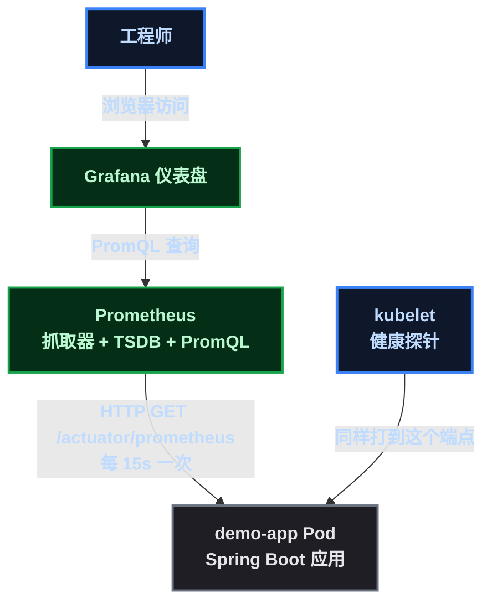
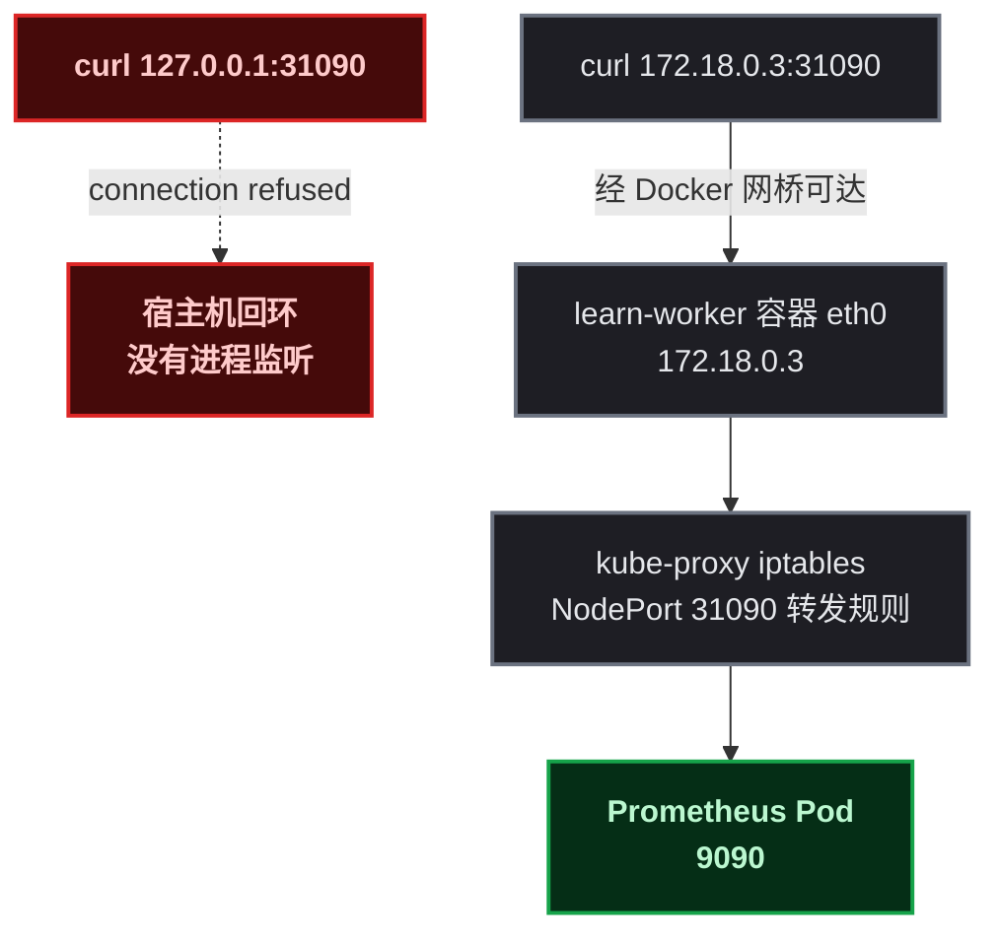
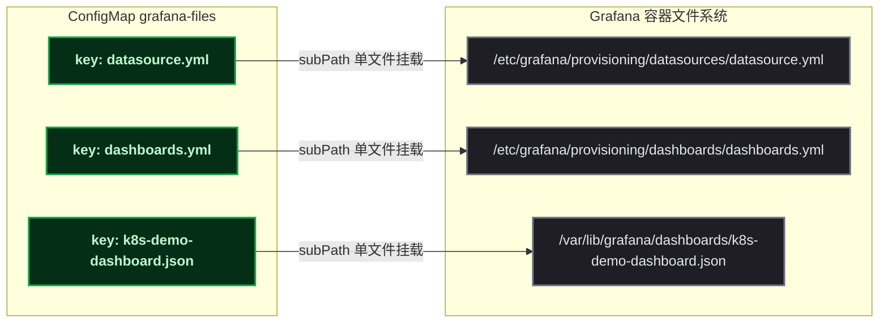

# 四个坑，一条可观测性链路

上一篇文章（探针三兄弟）结尾我留了个预告：Prometheus 是和应用同源的"观察回路"，探针负责让 kubelet 直接干预，Prometheus 负责把应用的运行状态变成数值曲线。这篇就是兑现——给 demo-app 装上指标端点，在 kind 集群里部署 Prometheus 抓取，再用 Grafana 把指标画成面板。

我原本以为最花时间的会是写 PromQL 查询，结果真正花时间的是一连串"我以为能访问、实际不能"的报错。四个坑踩下来，反而把 kind 的网络模型、集群内 DNS 的边界、ConfigMap 挂载的机制全摸了一遍。这篇文章就按踩坑的顺序写——坑是主线，知识点是副产品。

## 先把坑亮出来

| # | 坑 | 症状一句话 | 背后的机制 |
|:--:|------|------|------|
| ① | NodePort 端口超出合法区间 | Service 创建被 API 拒绝 | NodePort 默认只允许 30000-32767 |
| ② | 宿主机访问不到 NodePort | `127.0.0.1:31090` 连接被拒 | kind 节点是独立网络命名空间的容器，NodePort 绑在节点 eth0 上 |
| ③ | 集群外解析不了 Service 域名 | 宿主机 curl `demo-app-svc` 直接失败 | ClusterIP 的 DNS 由集群内 CoreDNS 提供，只服务集群内的 Pod |
| ④ | Grafana 预置数据源不生效 | 数据源列表为空 | provisioning 只扫描 ` datasources/ ` 、 ` dashboards/ ` 子目录，ConfigMap 整卷挂载是扁平的 |

四个坑的共同点是：**一切看起来都部署成功了，直到访问/验证那一刻才发现不对劲**。所以每踩一个坑，我都会把"症状长什么样、我查了什么、怎么解决"完整记下来，方便对号入座。

## 1. 目标与前置条件

**目标**：把 demo-app 的指标（HTTP 请求量、延迟、JVM 内存）从 `/actuator/prometheus` 端点，经 Prometheus 采集入库，最终在 Grafana 仪表盘上画出实时曲线。一条完整的"应用 → 指标 → 可视化"链路。

**前置条件**（沿用本系列前面文章的环境）：

| 项 | 说明 |
|------|------|
| kind 集群 | ` learn ` ，1 主 2 从，K8s v1.36.1 |
| demo-app | Spring Boot 3.3.5 + Java 17，Deployment 2 副本，有 `/api/hello` |
| 节点 IP | `kubectl get nodes -o wide` 查看（我这里是 172.18.0.2/3/4） |
| 网络 | 国内环境拉镜像需要代理（Docker daemon 配好即可）， ` prom/prometheus:v2.53.0 ` 和 ` grafana/grafana:11.1.0 ` 两个镜像约 600MB |

验证环境：

```bash
kubectl get nodes
kubectl get deploy demo-app
curl -s http://<任意节点IP>:8080/actuator/health   # 前置文章配了 NodePort 的话
```

## 2. 原理先行：可观测性的"观察回路"

### 2.1 从探针说起

K8s 里管应用健康的有两套东西，同源于 Spring Boot Actuator，但职责完全不同：

- **探针（控制回路）**：kubelet 按固定间隔打 ` /actuator/health ` ，返回码决定"摘流量"还是"重启"。它是**二进制判定**——好/坏，然后**直接干预**。
- **Prometheus（观察回路）**：按固定间隔拉取指标存成时间序列，再通过查询/告警让人**看到趋势**。它不干预，只记录和呈现。

上一篇文章演示的是前者，这篇是后者。两者共用同一个指标端点，互不干扰——后面你会看到，Prometheus 甚至把 kubelet 打探针的请求都记进了指标里。

### 2.2 Prometheus 的拉取模型

Prometheus 和传统监控（比如 Zabbix 的 agent 主动上报）最大的区别是**拉取（pull）模型**：

- 每个被监控对象暴露一个 HTTP 端点（ ` /actuator/prometheus ` ），内容是一段纯文本指标，每行 ` 指标名{标签=值} 数值 ` ；
- Prometheus 每隔 ` scrape_interval ` （默认 15s）主动去 GET 这个端点，把结果存入自己的时序数据库 TSDB（Time Series Database，时序数据库）；
- 查询用 PromQL（Prometheus Query Language，Prometheus 查询语言），比如 `rate(metric[1m])` 表示"最近 1 分钟的每秒速率"。

对应用开发者来说，接入成本极低：**应用只需要"暴露"指标，不需要知道 Prometheus 在哪**。Micrometer（Java 应用指标采集库）负责把 JVM、HTTP、GC 等数据整理成 Prometheus 文本格式，Spring Boot 一行配置就能开启。

### 2.3 整体架构



注意一个关键设计：Prometheus 的抓取目标（target）我写的是 ` demo-app-svc:8080 ` ，这是集群内的 Service DNS。**它决定了 Prometheus 必须部署在集群内**——这个"为什么"会在坑③里用一次真实的失败讲透。

## 3. 第一步：给应用装上指标端点

### 3.1 这一步在做什么

Spring Boot 的 Actuator 默认只暴露 ` health ` 、 ` info ` 等少数端点。要让 Prometheus 能抓，需要两件事：

1. 引入 `micrometer-registry-prometheus` 依赖——它注册一个 Prometheus 格式的指标导出器；
2. 在 `application.yml` 里把 `prometheus` 端点加入暴露名单。

### 3.2 改代码

`pom.xml` 增加依赖（版本由 Spring Boot 父 POM 统一管理）：

```xml
<dependency>
    <groupId>io.micrometer</groupId>
    <artifactId>micrometer-registry-prometheus</artifactId>
</dependency>
```

`src/main/resources/application.yml` 修改暴露名单：

```yaml
management:
  endpoints:
    web:
      exposure:
        include: health,info,prometheus
  metrics:
    distribution:
      percentiles-histogram:
        http.server.requests: true   # 发布直方图桶, Grafana P95 面板依赖 _bucket 序列
```

> ⚠️ 新手提示：上面 ` percentiles-histogram ` 这一节**必须加**。Spring Boot 默认不发布直方图桶（ ` _bucket ` 序列），不加的话 Prometheus 里查不到 ` http_server_requests_seconds_bucket ` ，后面 Grafana 的 P95 面板会是空的（这个坑我一开始也踩了：P95 查询返回 ` nan ` ，排查才发现是配置缺失）。

### 3.3 重建镜像并滚动升级

```bash
docker build -t k8s-demo-app:1.2 .
kind load docker-image k8s-demo-app:1.2 --name learn
kubectl set image deployment/demo-app demo=k8s-demo-app:1.2
kubectl rollout status deployment/demo-app
```

> ⚠️ 新手提示： ` kubectl set image ` 的写法是 ` deployment/<名字> <容器名>=<新镜像> ` 。我第一次写成了 ` kubectl set image deployment/demo-app k8s-demo-app=k8s-demo-app:1.2 ` ，报错 ` error: unable to find container named "k8s-demo-app" ` ——因为 Deployment 里容器名是 ` demo ` ，不是镜像名。用 ` kubectl get deploy demo-app -o jsonpath='{.spec.template.spec.containers[*].name}' ` 查一下就知道。

### 3.4 验证端点

```bash
POD=$(kubectl get pods -l app=demo-app -o jsonpath='{.items[0].metadata.name}')
kubectl exec $POD -- curl -s -o /dev/null -w "HTTP %{http_code}\n" http://localhost:8080/actuator/prometheus
kubectl exec $POD -- curl -s http://localhost:8080/actuator/prometheus | head -8
```

预期输出：

```text
HTTP 200
# HELP application_ready_time_seconds Time taken for the application to be ready to service requests
# TYPE application_ready_time_seconds gauge
application_ready_time_seconds{main_application_class="com.demo.k8s.DemoApplication"} 5.125
# HELP application_started_time_seconds Time taken to start the application
# TYPE application_started_time_seconds gauge
application_started_time_seconds{main_application_class="com.demo.k8s.DemoApplication"} 5.058
```

我这份端点一共输出了 210 行指标，包括 JVM 内存/GC/线程、HTTP 请求、磁盘等。格式就是 Prometheus 文本协议：`# HELP` 是说明，`# TYPE` 声明指标类型（gauge/counter/histogram），然后是数据行。

## 4. 第二步：把 Prometheus 请进集群

### 4.1 为什么是"请进集群"

Prometheus 有三种部署位置：集群内 Pod、集群外虚拟机、云厂商托管（阿里云 ACK 对应 ARMS Prometheus）。这次选集群内，原因很朴素——**抓取目标写的是 Service DNS，只有集群内能解析**。等坑③踩完你会有更深的体会。

清单拆成三块：ConfigMap 放 `prometheus.yml` 抓取配置、Deployment 跑 Prometheus 本体、Service 用 NodePort 暴露 9090 端口方便验证。

### 4.2 清单

` deploy-prometheus.yaml ` ：

```yaml
apiVersion: v1
kind: ConfigMap
metadata:
  name: prometheus-config
data:
  prometheus.yml: |
    global:
      scrape_interval: 15s      # 抓取节奏: 观察回路 15s 一次
      evaluation_interval: 15s
    scrape_configs:
      - job_name: k8s-demo-app
        metrics_path: /actuator/prometheus   # Spring Boot 指标端点
        static_configs:
          - targets: ['demo-app-svc:8080']  # 走 Service DNS, 由 kube-proxy 负载均衡到两个副本
---
apiVersion: apps/v1
kind: Deployment
metadata:
  name: prometheus
  labels:
    app: prometheus
spec:
  replicas: 1
  selector:
    matchLabels:
      app: prometheus
  template:
    metadata:
      labels:
        app: prometheus
    spec:
      containers:
        - name: prometheus
          image: prom/prometheus:v2.53.0
          args:
            - --config.file=/etc/prometheus/prometheus.yml
            - --storage.tsdb.path=/prometheus
            - --storage.tsdb.retention.time=7d
          ports:
            - containerPort: 9090
          volumeMounts:
            - name: config
              mountPath: /etc/prometheus
            - name: data
              mountPath: /prometheus
      volumes:
        - name: config
          configMap:
            name: prometheus-config
        - name: data
          emptyDir: {}   # 学习环境: 重启即清空, 生产用 PVC
---
apiVersion: v1
kind: Service
metadata:
  name: prometheus-svc
spec:
  type: NodePort
  selector:
    app: prometheus
  ports:
    - port: 9090
      targetPort: 9090
      nodePort: 31090
```

### 4.3 坑①：NodePort 端口超出合法区间

第一版我把 Service 的 `nodePort` 写成了 39090，apply 的结果很有意思：

```text
configmap/prometheus-config created
deployment.apps/prometheus created
The Service "prometheus-svc" is invalid: spec.ports[0].nodePort: Invalid value: 39090: provided port is not in the valid range. The range of valid ports is 30000-32767
```

**症状**：ConfigMap 和 Deployment 都创建成功了，只有 Service 被拒绝——所以坑不是"全部失败"而是"部分失败"，不看输出根本发现不了。

**排查**：错误信息其实已经把答案说全了：NodePort 合法区间是 30000-32767。这是 kube-apiserver 的默认配置（ ` --service-node-port-range ` ），预留 30000 以下给系统组件和其他用途。

**解法**：把 39090 改成 31090，重新 apply。顺带说一句，这就是 K8s 文档常说的"端口是集群级稀缺资源"——NodePort 全集群共用一份端口表，不像云上 SLB 每个服务一个独立端口。

```bash
kubectl apply -f deploy-prometheus.yaml
kubectl get pods -l app=prometheus -o wide
```

预期： ` prometheus ` Pod ` 1/1 Running ` ，Service ` 9090:31090/TCP ` 。

### 4.4 镜像拉取提示

国内环境 ` prom/prometheus:v2.53.0 ` 直连 Docker Hub 大概率超时。我在 Docker daemon 里配了代理（ ` /etc/docker/daemon.json ` ）， ` docker pull ` 先走代理下载，再 ` kind load docker-image ` 导入三个节点：

```bash
docker pull prom/prometheus:v2.53.0
kind load docker-image prom/prometheus:v2.53.0 --name learn
```

## 5. 第三步：验证抓取回路

### 5.1 坑②：宿主机访问不到 NodePort

Prometheus 起来了，第一件事当然是打开它的页面看看抓取状态。我习惯先 curl 探路，于是：

```bash
curl -s http://127.0.0.1:31090/api/v1/targets
```

**症状**：输出为空——不对，准确说是"我什么都没看到"。因为我把 curl 直接管道给了 python3 解析 JSON，报了一串 `JSONDecodeError: Expecting value: line 1 column 1 (char 0)`。这个报错很误导人，它只是说"输入不是 JSON"，没说网络层面发生了什么。**排查的第一步是先看原始输出，而不是直接解析**：

```bash
curl -sv http://127.0.0.1:31090/api/v1/targets -o /dev/null
```

```text
*   Trying 127.0.0.1:31090...
* connect to 127.0.0.1 port 31090 from 127.0.0.1 port 36350 failed: Connection refused
* Failed to connect to 127.0.0.1 port 31090 after 0 ms: Could not connect to server
```

**排查过程**：连接被拒。但 Pod 明明 Running，Service 也有 endpoints：

```bash
kubectl get endpoints prometheus-svc   # ENDPOINTS: 10.244.2.44:9090，正常
kubectl logs deployment/prometheus     # 日志显示 Listening on [::]:9090，正常
```

资源全正常，端口却没监听在 127.0.0.1 上。这时才反应过来：**kind 的"节点"不是一个进程，而是一个 Docker 容器，有自己的网络命名空间**。kube-proxy 的 NodePort 规则监听在节点容器的 eth0（172.18.0.x，Docker 网桥分配的地址）上，跟宿主机回环地址没有关系。



**解法**：访问地址从 `127.0.0.1` 换成节点 IP：

```bash
curl -s http://172.18.0.3:31090/api/v1/targets
```

**这个坑值得记两笔**：

1. kind 默认不会把 NodePort 映射到宿主机端口（除非创建集群时配 ` extraPortMappings ` ），所以本系列前面所有实验都是"节点 IP + NodePort"这个姿势，这不是巧合，是 kind 的网络模型决定的；
2. 换到云上（ACK），NodePort 和节点 IP 也不再是主要入口——对外流量走 SLB，这个对比放到原理复盘里展开。

### 5.2 坑③：集群外解析不了 Service 域名

抓取目标验证通过之后，我想给 demo-app 制造一点真实流量，让曲线有内容。很自然地想从宿主机发起：

```bash
for i in $(seq 1 20); do curl -s -o /dev/null http://demo-app-svc:8080/api/hello; done
```

**症状**：curl 退出码 6（ ` Could not resolve host: demo-app-svc ` ）。又是"我以为能访问"系列。

**原因**： ` demo-app-svc ` 是 ClusterIP Service 的 DNS 名，完整域名是 ` demo-app-svc.default.svc.cluster.local ` 。这个域名由**集群内的 CoreDNS** 提供解析，CoreDNS 只服务集群里的 Pod——宿主机根本不在它的服务范围内，自然解析不到。

**解法**：流量要从 Pod 内部发起，把"客户端"挪进集群：

```bash
POD=$(kubectl get pods -l app=demo-app -o jsonpath='{.items[0].metadata.name}')
for i in $(seq 1 30); do
  kubectl exec $POD -- curl -s -o /dev/null http://demo-app-svc:8080/api/hello
done
```

**这个坑反过来解释了一个设计决策**：为什么 Prometheus 要部署在集群内？因为它的抓取目标 `demo-app-svc:8080` 依赖集群内 DNS。如果 Prometheus 在集群外，target 就得写成"节点 IP + NodePort"，等于绕一大圈还多一跳。**监控组件离被监控对象越近，网络边界越少**——这也是生产环境里 Prometheus 通常和业务跑在同一个集群/网段的原因。

### 5.3 制造流量并查询

等一个抓取周期（15s），然后查 Prometheus 的指标。先看抓取目标是否健康：

```bash
curl -s http://172.18.0.3:31090/api/v1/targets
```

预期输出（ ` health ` 为 ` up ` ， ` lastScrape ` 是最近抓取时间）：

```text
k8s-demo-app | up | 2026-08-24T01:55:15.88191961Z |
```

再查两个典型指标。HTTP 请求速率按 URI 分组：

```bash
curl -s "http://172.18.0.3:31090/api/v1/query?query=sum%20by%20(uri)%20(rate(http_server_requests_seconds_count%5B1m%5D))"
```

JVM 堆内存按实例聚合（除以 1048576 转成 MiB）：

```bash
curl -s "http://172.18.0.3:31090/api/v1/query?query=sum(jvm_memory_used_bytes%7Barea%3D%22heap%22%7D)%20by%20(instance)"
```

我实测的结果：

| 指标 | 值 | 解读 |
|------|-----|------|
| `/api/hello` | 0.20 req/s | 30 次请求 ÷ 150s 窗口，对得上 |
| ` /actuator/health ` 系列 | 0.29 req/s | **kubelet 探针的请求也被记进来了**——控制回路和观察回路在同一端点"共舞" |
| `/actuator/prometheus` | 0.067 req/s | 正是 1/15s 的抓取节奏 |
| JVM 堆内存 | 30.3 MiB/实例 | `jvm_memory_used_bytes` 按实例聚合 |

` /actuator/health ` 系列这一行是这轮实验最意外的收获：探针（控制回路）每 10 秒打一次健康检查，Prometheus（观察回路）每 15 秒抓一次指标，两套系统各自工作、互不干扰，但后者的数据里完整留下了前者的足迹。两张"回路图"第一次在数据层面合体了。

```text
# 小细节: 探针路径的 uri 标签完整值是 /actuator/health/**  (末尾 ** 是 Spring 对子路径的通配表示)
# 所以查询结果里它和精确路径 /actuator/health 分成了两行
```

## 6. 第四步：Grafana 登场

### 6.1 原理：把配置当代码

Prometheus 的 PromQL 能查，但工程师不会天天敲 API。Grafana（可视化仪表盘）负责把查询变成面板。

Grafana 支持两种配置方式：页面里手动点，或者**预置（provisioning）**——把数据源、仪表盘写成文件放在指定目录，启动时自动加载。后者才是"配置即代码"的正路：进 Git、走 CI、集群重建后仪表盘自动恢复。

provisioning 的目录约定（重点，坑④全靠它）：

```text
/etc/grafana/provisioning/
├── datasources/    # 数据源定义, 扫描 *.yml
├── dashboards/     # 仪表盘 provider 定义, 扫描 *.yml
├── alerting/       # 告警 (本实验未用)
└── ...
```

注意： ` dashboards/ ` 目录下放的是"provider 配置"（告诉 Grafana 去哪找仪表盘 JSON），仪表盘 JSON 本体放在 provider 指定的路径（我用的 ` /var/lib/grafana/dashboards/ ` ）。

### 6.2 坑④：预置不生效

我把三个文件（数据源、dashboard provider、仪表盘 JSON）放进一个 ConfigMap，整个挂到 ` /etc/grafana/provisioning ` ，部署完一查：

```bash
curl -s -u admin:admin http://172.18.0.3:32090/api/datasources
```

**症状**：返回 `[]`，数据源列表是空的。Dashboard 搜索同样是空。

**排查第一步——看挂载布局**：

```bash
kubectl exec deploy/grafana -- ls -R /etc/grafana/provisioning
```

```text
/etc/grafana/provisioning:
access-control  alerting  dashboards  datasources  notifiers  plugins

/etc/grafana/provisioning/dashboards:
/etc/grafana/provisioning/datasources:
```

问题一目了然： ` datasources/ ` 、 ` dashboards/ ` 子目录是空的，我的三个文件躺在哪里？被整卷挂载到了**目录根部**——ConfigMap 的每个 key 变成一个文件，平铺在挂载点下， ` datasource.yml ` 、 ` dashboards.yml ` 、 ` k8s-demo-dashboard.json ` 全在 ` /etc/grafana/provisioning/ ` 下，而 Grafana 只扫描两个子目录，于是什么都没加载。

**第一轮错误的解法**：我心想"那把 key 改成带斜杠的不就进子目录了？"——ConfigMap 的 key 确实支持路径式命名（有些工具就是这么用的）。结果 apply 被 API 拒绝：

```text
The ConfigMap "grafana-provisioning" is invalid:
* data[dashboards/dashboards.yml]: Invalid value: "dashboards/dashboards.yml":
  a valid config key must consist of alphanumeric characters, '-', '_' or '.'
  (e.g. 'key.name', or 'KEY_NAME', or 'key-name', regex used for validation is '[-._a-zA-Z0-9]+')
```

**症状**：ConfigMap key 的校验正则 `[-._a-zA-Z0-9]+` 不允许 `/`，这条路根本走不通。K8s 的 ConfigMap key 只能表达"文件名"，表达不了"目录层级"。

**正解——subPath 挂载**：同一个 ConfigMap，在 `volumeMounts` 里用 `subPath` 把每个 key 精确挂载到目标子目录的完整路径。kubelet 会负责创建父目录：



> ⚠️ 新手提示： ` subPath ` 是"单文件挂载"，和整卷挂载有个重要区别——**ConfigMap 更新后，subPath 挂载的文件不会热更新**，要重建 Pod 才生效。学习环境无所谓，生产里改仪表盘要么重建 Pod，要么接受重启，别指望"改完 ConfigMap 面板自动变"。

### 6.3 清单（正解版）

` deploy-grafana.yaml ` ：

```yaml
apiVersion: v1
kind: ConfigMap
metadata:
  name: grafana-files
data:
  datasource.yml: |
    apiVersion: 1
    datasources:
      - name: Prometheus
        uid: prometheus
        type: prometheus
        url: http://prometheus-svc:9090   # 集群内 DNS, 直连 Prometheus Service
        access: proxy
        isDefault: true
  dashboards.yml: |
    apiVersion: 1
    providers:
      - name: k8s-demo
        orgId: 1
        folder: ''
        type: file
        disableDeletion: false
        updateIntervalSeconds: 30
        options:
          path: /var/lib/grafana/dashboards
  k8s-demo-dashboard.json: |
    {
      "annotations": {"list": []},
      "editable": true,
      "graphTooltip": 1,
      "title": "k8s-demo-app 可观测性",
      "uid": "k8sdemo",
      "time": {"from": "now-30m", "to": "now"},
      "refresh": "10s",
      "schemaVersion": 39,
      "version": 1,
      "panels": [
        {
          "id": 1,
          "type": "timeseries",
          "title": "HTTP 请求速率 (req/s)",
          "datasource": {"type": "prometheus", "uid": "prometheus"},
          "gridPos": {"h": 8, "w": 12, "x": 0, "y": 0},
          "fieldConfig": {"defaults": {"unit": "reqps"}, "overrides": []},
          "targets": [{"expr": "sum by (uri) (rate(http_server_requests_seconds_count[1m]))", "legendFormat": "{{uri}}", "refId": "A"}]
        },
        {
          "id": 2,
          "type": "timeseries",
          "title": "HTTP 延迟 P95 (s)",
          "datasource": {"type": "prometheus", "uid": "prometheus"},
          "gridPos": {"h": 8, "w": 12, "x": 12, "y": 0},
          "fieldConfig": {"defaults": {"unit": "s"}, "overrides": []},
          "targets": [{"expr": "histogram_quantile(0.95, sum(rate(http_server_requests_seconds_bucket[5m])) by (le))", "legendFormat": "p95", "refId": "A"}]
        },
        {
          "id": 3,
          "type": "timeseries",
          "title": "JVM 堆内存 (MiB)",
          "datasource": {"type": "prometheus", "uid": "prometheus"},
          "gridPos": {"h": 8, "w": 12, "x": 0, "y": 8},
          "fieldConfig": {"defaults": {"unit": "decmbytes"}, "overrides": []},
          "targets": [{"expr": "sum(jvm_memory_used_bytes{area=\"heap\"}) by (instance)", "legendFormat": "{{instance}}", "refId": "A"}]
        },
        {
          "id": 4,
          "type": "timeseries",
          "title": "JVM 活跃线程数",
          "datasource": {"type": "prometheus", "uid": "prometheus"},
          "gridPos": {"h": 8, "w": 12, "x": 12, "y": 8},
          "fieldConfig": {"defaults": {"unit": "short"}, "overrides": []},
          "targets": [{"expr": "jvm_threads_live_threads", "legendFormat": "{{instance}}", "refId": "A"}]
        }
      ]
    }
---
apiVersion: apps/v1
kind: Deployment
metadata:
  name: grafana
  labels:
    app: grafana
spec:
  replicas: 1
  selector:
    matchLabels:
      app: grafana
  template:
    metadata:
      labels:
        app: grafana
    spec:
      containers:
        - name: grafana
          image: grafana/grafana:11.1.0
          env:
            - name: GF_SECURITY_ADMIN_PASSWORD
              value: admin   # 学习环境: admin/admin; 生产必须改
          ports:
            - containerPort: 3000
          volumeMounts:
            - name: grafana-files
              mountPath: /etc/grafana/provisioning/datasources/datasource.yml
              subPath: datasource.yml
            - name: grafana-files
              mountPath: /etc/grafana/provisioning/dashboards/dashboards.yml
              subPath: dashboards.yml
            - name: grafana-files
              mountPath: /var/lib/grafana/dashboards/k8s-demo-dashboard.json
              subPath: k8s-demo-dashboard.json
      volumes:
        - name: grafana-files
          configMap:
            name: grafana-files
---
apiVersion: v1
kind: Service
metadata:
  name: grafana-svc
spec:
  type: NodePort
  selector:
    app: grafana
  ports:
    - port: 3000
      targetPort: 3000
      nodePort: 32090
```

仪表盘四个面板的查询分别是：HTTP 请求速率（按 URI 分组）、HTTP 延迟 P95（ ` histogram_quantile ` 从直方图算分位数）、JVM 堆内存、JVM 活跃线程。

> 📌 前置知识：P95 是说"95% 的请求延迟低于这个值"。 ` http_server_requests_seconds ` 是 histogram（直方图）类型指标，Micrometer 按延迟分桶记录计数， ` histogram_quantile(0.95, ...) ` 从桶分布估算分位数——比直接算平均延迟更能暴露长尾问题。

### 6.4 首次启动很慢，别以为挂了

apply 之后等 Pod Running，curl 健康检查却连续 6 次（约 90 秒）都返回 000。查日志发现它一直在跑数据库迁移：

```text
logger=migrator ... msg="Migration successfully executed" id="create dashboard_provisioning"
logger=migrator ... msg="Migration successfully executed" id="add unique index dashboard_version.dashboard_id and dashboard_version.version"
```

Grafana 首次启动会在内置 SQLite 上执行几十个迁移（初始化库表），我这台机器是 i3 双核小服务器，跑了约一分半。**判断"起来了没有"别靠一次 curl，用轮询**：

```bash
for i in $(seq 1 10); do
  sleep 15
  CODE=$(curl -s -o /dev/null -w "%{http_code}" http://172.18.0.3:32090/api/health)
  echo "尝试 $i: HTTP $CODE"
  [ "$CODE" = "200" ] && break
done
```

预期：最终输出 ` 尝试 N: HTTP 200 ` 。

## 7. 第五步：验证可视化

### 7.1 API 验证

Grafana 起来后，用 API 依次确认"数据源已加载 → 仪表盘已加载 → 面板查得到数据"：

```bash
# 1. 数据源
curl -s -u admin:admin http://172.18.0.3:32090/api/datasources
# 2. 仪表盘
curl -s -u admin:admin "http://172.18.0.3:32090/api/search?query=k8s-demo"
# 3. 数据源连通性（经 Grafana 代理查 Prometheus）
curl -s -u admin:admin "http://172.18.0.3:32090/api/datasources/proxy/uid/prometheus/api/v1/query?query=sum(rate(http_server_requests_seconds_count%5B5m%5D))"
```

我实测的第三条返回 ` 总请求速率: 0.3684210526315789 ` ——Grafana 已经能隔着一层代理从 Prometheus 查到实时数据。

### 7.2 怎么打开仪表盘

浏览器打开 ` http://<节点IP>:32090 ` ，账号 ` admin ` / 密码 ` admin ` （环境变量 ` GF_SECURITY_ADMIN_PASSWORD ` 设的，生产环境务必换掉）。登录后左侧 Dashboard 里就有预置的「k8s-demo-app 可观测性」。

如果你和我一样不在服务器局域网内，用 SSH 隧道把端口转回本地：

```bash
ssh -L 32090:<节点IP>:32090 用户名@服务器
# 浏览器打开 http://localhost:32090
```

打开仪表盘后，再从 Pod 里打几十次 ` /api/hello ` ，10 秒刷新间隔下，请求速率面板的曲线会立刻立起来。

## 8. 原理复盘

### 8.1 坑与机制对照

| 坑 | 症状 | 机制 | 以后怎么避 |
|:--:|------|------|------|
| ① NodePort 超区间 | apply 部分失败，Service 被拒 | NodePort 合法区间 30000-32767 | 记住区间，或用 `kubectl apply` 的输出校验 |
| ② 127.0.0.1 访问不到 NodePort | connection refused | kind 节点是独立网络命名空间的容器 | 一律用节点 IP；生产里入口是 SLB 不是节点 |
| ③ 集群外解析不了 Service DNS | curl exit 6 | CoreDNS 只服务集群内 Pod | 客户端进集群；监控组件与业务同集群 |
| ④ provisioning 不生效 | 数据源列表为空 | Grafana 只扫子目录；ConfigMap key 不支持 `/` | 目录级挂载用 subPath，一个 key 一个文件 |

四条里前三条其实是同一个主题的三种表现：**"访问路径"和"网络边界"没对上**。K8s 里"服务"有多个入口（ClusterIP、NodePort、Ingress、SLB），每个入口有自己的可达范围，部署时先想清楚"谁在哪个网络里、走哪个入口"。

### 8.2 双回路合体

这轮实验把上一篇文章的双回路框架落实到了数据层：

| | 控制回路（探针） | 观察回路（Prometheus） |
|------|------|------|
| 执行者 | kubelet | Prometheus |
| 请求端点 | `/actuator/health` 系列 | `/actuator/prometheus` |
| 判定 | 二进制：好/坏 | 连续数值：趋势 |
| 动作 | 摘流量、重启 | 记录、查询、告警 |
| 节奏 | 秒级（10s） | 15s 抓取 |
| 证据 | RESTARTS 计数 | `rate()` 曲线 |

而且两个回路在数据层面相遇了：Prometheus 抓到的指标里，health 探针路径的请求速率正是 kubelet 探针打出来的。同一套 Actuator 端点，服务两套系统，各取所需。

### 8.3 换到 ACK 会怎样

kind 上的每个"手动步骤"，在托管版都有对应物：

| 学习环境（kind） | 阿里云 ACK |
|------|------|
| 自己部署 Prometheus + Grafana | 云监控 / ARMS Prometheus 托管，免运维 |
| NodePort + 节点 IP 访问 | 通过 SLB（LoadBalancer 类型 Service 自动创建） |
| `emptyDir` 存指标，重启即丢 | 云上托管存储，长期保留 |
| 手动改 ConfigMap 重建 Pod | 配置进 GitOps 流水线 |

但"部署方式"变了，"原理"没变：指标还是从 `/actuator/prometheus` 拉，查询还是 PromQL，仪表盘还是 Grafana。**学习时亲手踩过 NodePort 区间、DNS 边界、挂载布局的坑，到托管环境反而能更清楚地看出"平台帮我省掉了哪些事"**——这是本系列一直坚持"原理先行、亲手部署"的原因。

## 9. 总结

这一篇从"给应用加三行配置"开始，到"仪表盘画出实时曲线"结束，中间踩了四个坑。回头看，最值钱的不是最终跑通的 YAML，而是那几次"我以为能访问、实际不能"的时刻——它们把 kind 的网络模型、CoreDNS 的边界、ConfigMap 挂载的机制，从"看过文档"变成了"长过教训"。

一句话收获：**可观测性链路的价值不在组件本身，而在"应用暴露指标 → 采集入库 → 可视化 → 告警"这条回路的每一环都验证过、可复现**。这也是为什么我把完整清单和真实报错都留在文章里——读者按图索骥，四个坑可以一次跳过三个。

下一步自然的方向是告警（Alertmanager：指标超过阈值往钉钉/飞书推消息），以及把日志接入 Loki 和指标做关联分析。探针、指标、日志三条腿都齐了，应用的可观测性才算闭环。

（本篇无图片/视频占位。）
