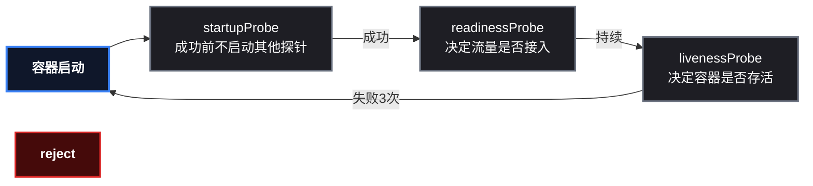
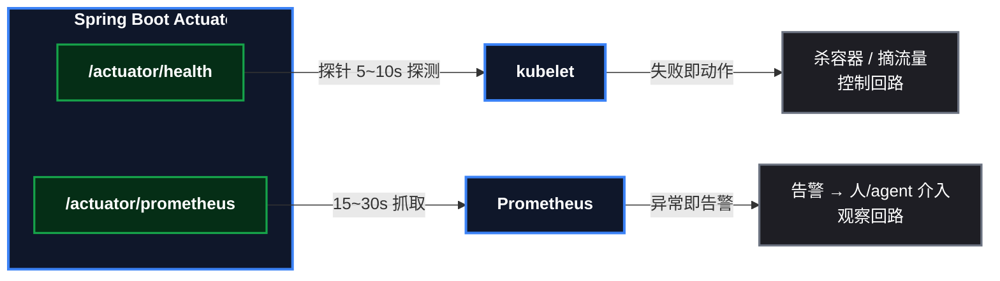

# 让集群知道你的应用是死是活：探针三兄弟实战

应用部署进集群只是第一步——K8s 号称"自愈"，但**它怎么知道你的应用是死是活**？答案就是探针（Probe）。三个探针分别回答三个问题：**启动好了没？能不能接客？还活着吗？** 这一篇用上一篇文章构建的 Spring Boot 应用，把三个探针逐一配上并**现场演示**它们的工作机制：readiness 如何拦住流量、liveness 如何自动救活假死的应用、startup 如何防止"启动慢被误杀"。

> 📌 前置知识：本文是 kind 系列第 5 篇，需要已完成前 4 篇的环境——kind 集群、 ` k8s-demo-app ` 应用已部署（含 ConfigMap 注入）、 ` demo-app-svc ` Service 已创建。应用已内置 Actuator 探针端点（上篇预埋的 ` management.endpoint.health.probes.enabled=true ` ）。

## 这次要做什么

```
目标：给 demo-app 配置三种探针，并亲眼验证三种机制
产出：生产级探针 YAML + 三个可复现的演示 + 探针与 Prometheus 的定位对比
主角：k8s-demo-app（Spring Boot 3.3.5，Actuator 已暴露探针端点）
```

## 原理：三个探针各管什么

| 探针 | 回答的问题 | 失败后果 | 生产意义 |
|---|---|---|---|
| **startup** | 应用启动好了没？ | 容器被重启 | 给 JVM 冷启动免死金牌，治"启动慢被误杀" |
| **readiness** | 能接客了吗？ | **只摘流量，不杀容器** | 发版不断服、依赖故障自动摘流 |
| **liveness** | 还活着吗？ | 容器被杀重启 | 死锁/假死自动恢复 |

三个探针的配合时序：



> ⚠️ 新手提示：最容易混淆的是 readiness 和 liveness 的失败后果——**readiness 失败只摘流量（Pod 还在）**，**liveness 失败会杀容器**。生产事故里"DB 抖动引发雪崩"的根源，就是 liveness 探针错误地检查了数据库：DB 挂 30 秒 → liveness 失败 → 所有实例被反复杀。**liveness 只该查进程级健康**（如 JVM 活着），下游依赖的健康交给 readiness。

## 前置条件

| 项 | 说明 |
|---|---|
| 集群 | kind ` learn ` （1 主 2 从，K8s v1.36.1） |
| 应用 | `demo-app` Deployment（2 副本，k8s-demo-app:1.0） |
| 服务 | ` demo-app-svc ` （ClusterIP:8080，用于流量测试） |
| 测试工具 | busybox 镜像（用于在集群内发起请求） |

## 第1步：给应用加上三个探针

完整 Deployment 配置（直接在上一篇的部署文件上追加探针段）：

```yaml
# deploy-demo-probes.yaml
apiVersion: apps/v1
kind: Deployment
metadata:
  name: demo-app
spec:
  replicas: 2
  selector:
    matchLabels:
      app: demo-app
  template:
    metadata:
      labels:
        app: demo-app
    spec:
      containers:
      - name: demo
        image: k8s-demo-app:1.0
        ports:
        - containerPort: 8080
        envFrom:
        - configMapRef:
            name: demo-config
        startupProbe:                    # ① 启动探针: 给 JVM 最多 150 秒
          httpGet:
            path: /actuator/health
            port: 8080
          periodSeconds: 5               # 每 5 秒探一次
          failureThreshold: 30           # 30 次失败才放弃 (30×5=150s 窗口)
        readinessProbe:                  # ② 就绪探针: 就绪才接流量
          httpGet:
            path: /actuator/health/readiness
            port: 8080
          initialDelaySeconds: 5         # 启动 5 秒后再开始探测
          periodSeconds: 5
          failureThreshold: 3
        livenessProbe:                   # ③ 存活探针: 假死就重启
          httpGet:
            path: /actuator/health/liveness
            port: 8080
          initialDelaySeconds: 20        # 给启动留时间
          periodSeconds: 10
          failureThreshold: 3            # 连续 3 次失败 (~30s) 杀容器
```

参数速查：

| 参数 | 含义 | 本文取值 |
|---|---|---|
| `initialDelaySeconds` | 容器启动后等多久才开始探测 | startup 0 / readiness 5 / liveness 20 |
| `periodSeconds` | 探测周期 | 5 ~ 10 秒 |
| `timeoutSeconds` | 单次探测超时（默认 1） | 默认 |
| `failureThreshold` | 连续失败几次才判死 | 3 次（startup 用 30 次做长窗口） |

部署并确认探针生效：

```bash
kubectl apply -f deploy-demo-probes.yaml
kubectl rollout status deployment/demo-app --timeout=120s
# deployment "demo-app" successfully rolled out

kubectl get pods -l app=demo-app | awk '{print $1, $2, $3, $4}'
# demo-app-c546b6b9d-xxx   1/1 Running 0

# 确认探针配置
kubectl describe pod <pod名> | grep -E "Startup:|Readiness:|Liveness:"
# Liveness:   http-get http://:8080/actuator/health/liveness delay=20s timeout=1s period=10s #failure=3
# Readiness:  http-get http://:8080/actuator/health/readiness delay=5s timeout=1s period=5s #failure=3
# Startup:    http-get http://:8080/actuator/health delay=0s timeout=1s period=5s #failure=30
```

## 第2步：演示 readiness 守门（发版时新 Pod 不进流量）

先准备一个测试 Pod，模拟"集群内另一个服务"发起请求：

```bash
kubectl run dns-test --image=busybox:1.36 --restart=Never --command -- sleep 3600
kubectl wait --for=condition=Ready pod/dns-test --timeout=60s
```

触发滚动重启，在滚动过程中反复请求，观察流量落在哪些 Pod：

```bash
kubectl rollout restart deployment/demo-app
sleep 3
# 滚动中: 连发 6 次请求, 统计命中的 Pod
for i in 1 2 3 4 5 6; do
  kubectl exec dns-test -- wget -qO- http://demo-app-svc:8080/api/hello 2>/dev/null \
    | grep -oE '"pod":"[^"]+"'
done | sort | uniq -c
# 预期: 只出现旧 Pod 的哈希前缀 (如 6f9656559c-xxx × 4 + × 2), 没有新 Pod
```

关键观察：

```bash
# 滚动中: endpoints 只包含就绪 Pod
kubectl get endpoints demo-app-svc -o jsonpath="{.subsets[0].addresses[*].ip}"
# 只有旧 Pod 的 IP

# 等滚动完成
kubectl rollout status deployment/demo-app --timeout=120s
# deployment "demo-app" successfully rolled out

# 就绪后: 流量切换到新 Pod
for i in 1 2 3 4 5 6; do
  kubectl exec dns-test -- wget -qO- http://demo-app-svc:8080/api/hello 2>/dev/null \
    | grep -oE '"pod":"[^"]+"'
done | sort | uniq -c
# 预期: 全部是新 Pod 哈希 (如 c546b6b9d-xxx)
```

> 📌 原理回顾（系列第 3 篇）：Service 的 Endpoints 只收录**就绪**的 Pod——readiness 探针就是这个"就绪"的判官。没有它，新 Pod 还在起 JVM 就被打流量，发版瞬间就是一片 5xx。

## 第3步：演示 liveness 自愈（假死被自动救活）

模拟"应用无响应"：临时把 liveness 探针指向一个不存在的路径（等价于应用假死、端点不可用）：

```bash
kubectl patch deployment demo-app --type=json -p='[
  {"op":"replace","path":"/spec/template/spec/containers/0/livenessProbe/httpGet/path","value":"/actuator/health/nowhere"},
  {"op":"replace","path":"/spec/template/spec/containers/0/livenessProbe/failureThreshold","value":1},
  {"op":"replace","path":"/spec/template/spec/containers/0/livenessProbe/periodSeconds","value":5},
  {"op":"replace","path":"/spec/template/spec/containers/0/livenessProbe/initialDelaySeconds","value":10}
]'
sleep 45
kubectl get pods -l app=demo-app | awk '{print $1, $2, $3, $4}'
# 新 Pod RESTARTS 攀升 (2, 3, 4...)
```

看事件，自愈机制一目了然：

```bash
kubectl get events --sort-by=.lastTimestamp | grep -iE "liveness|killing" | tail -4
# Warning  Unhealthy  Liveness probe failed: HTTP probe failed with statuscode: 404
# Normal   Killing    Container demo failed liveness probe, will be restarted
```

恢复正确配置：

```bash
kubectl patch deployment demo-app --type=json -p='[
  {"op":"replace","path":"/spec/template/spec/containers/0/livenessProbe/httpGet/path","value":"/actuator/health/liveness"},
  {"op":"replace","path":"/spec/template/spec/containers/0/livenessProbe/failureThreshold","value":3},
  {"op":"replace","path":"/spec/template/spec/containers/0/livenessProbe/periodSeconds","value":10},
  {"op":"replace","path":"/spec/template/spec/containers/0/livenessProbe/initialDelaySeconds","value":20}
]'
kubectl rollout status deployment/demo-app --timeout=120s
# deployment "demo-app" successfully rolled out
```

> ⚠️ 冷知识（实测踩坑）：想模拟"进程假死"时，第一反应是 `kubectl exec <pod> -- kill -STOP 1` 冻结 JVM——**但 SIGSTOP 发给容器 PID 1 会被内核静默忽略**（进程状态保持 S）。内核对待命名空间 init 进程有特殊信号语义。所以演示假死要走"让探针端点不可用"的路径，别在 SIGSTOP 上浪费时间。

## 第4步：演示 startup 防误杀（启动窗口太小会怎样）

把 startup 窗口临时改成 2 秒（JVM 实际启动要 12 秒+），看"启动慢被误杀"：

```bash
kubectl patch deployment demo-app --type=json -p='[
  {"op":"replace","path":"/spec/template/spec/containers/0/startupProbe/periodSeconds","value":2},
  {"op":"replace","path":"/spec/template/spec/containers/0/startupProbe/failureThreshold","value":1}
]'
sleep 50
kubectl get pods -l app=demo-app | awk '{print $1, $2, $3, $4}'
# 新 Pod: 0/1 CrashLoopBackOff  4   ← 无限重启循环

kubectl get events --sort-by=.lastTimestamp | grep -iE "startup" | tail -2
# Warning  Unhealthy  Startup probe failed: ... connection refused
# Normal   Killing    Container demo failed startup probe, will be restarted
```

恢复正确配置（重新应用标准文件即可）：

```bash
kubectl apply -f deploy-demo-probes.yaml
kubectl rollout status deployment/demo-app --timeout=120s
kubectl get pods -l app=demo-app | awk '{print $1, $2, $3, $4}'
# 两个副本: 1/1 Running 0
```

> ⚠️ 新手提示：startupProbe 的失败窗口就是"给 JVM 的免死金牌时长"。Java 冷启动 10 ~ 30 秒很常见，窗口建议按"最坏情况启动时间 × 2"来配（本文 30 次 × 5 秒 = 150 秒）。配置太小，就是第 4 步演示的 CrashLoopBackOff。

## 探针与 Prometheus：同一个 Actuator，两条回路

细心的读者会发现：探针用的端点和监控用的端点**都来自 Spring Boot Actuator**——同源，但完全不同工：

| 维度 | K8s 探针 | Prometheus |
|---|---|---|
| 消费方 | kubelet（集群控制面） | Prometheus 服务器 |
| 判定 | 二进制：200 或非 200 | 数值 + 时间序列 |
| 动作 | **直接干预**：杀容器 / 摘流量 | **只观察**：存数据 / 告警 |
| 频率 | 5 ~ 10 秒 | 15 ~ 30 秒 |
| 回路性质 | 控制回路（自动止损） | 观察回路（留痕告警） |



两者还有衔接点：Spring Boot 的 ` /actuator/health ` 会自动聚合所有下游依赖的健康状态（DB、Redis、磁盘）——MySQL 断开时，readiness 探针自动摘流（秒级自愈），Prometheus 的指标同时异常并告警（留痕）。**探针负责"自动止损"，Prometheus 负责"留痕告警"**。下一篇将给应用接上 ` /actuator/prometheus ` ，把观察回路建起来。

## 踩坑速查表

| # | 坑 | 现象 | 解法 |
|---|---|---|---|
| 1 | liveness 查数据库 | DB 抖动 30s → 所有实例被杀 → 雪崩 | liveness 只查进程级健康；下游依赖交给 readiness |
| 2 | startup 窗口太小 | CrashLoopBackOff | 窗口 = 最坏启动时间 × 2（本文 150s） |
| 3 | SIGSTOP 模拟假死 | 进程状态不变，探针照常通过 | 内核忽略发给容器 PID 1 的 SIGSTOP；用"端点不可用"模拟 |
| 4 | 忘记恢复演示补丁 | Deployment 一直异常 | 演示后 `kubectl apply -f deploy-demo-probes.yaml` 一键恢复 |

## 总结与下一步

**本课验证的三个机制**：readiness 摘流守门（滚动更新时流量只进就绪 Pod）、liveness 自愈（探针失败 → 杀容器 → 自动重启）、startup 防误杀（启动窗口是 JVM 的免死金牌）。

**下一步**：应用在集群里"活着"了，接下来要让它"体面地死"——优雅停机（ ` server.shutdown=graceful ` + preStop + ` terminationGracePeriodSeconds ` ），以及"别被 OOM 杀死"（requests/limits + ` -XX:MaxRAMPercentage ` ）。这两块合为下一篇。

系列文章：kind 搭建集群 → Deployment 实战 → Service/Ingress 实战 → Spring Boot 容器化与配置注入 → 探针三兄弟（本篇）→ 优雅停机与资源管理。
