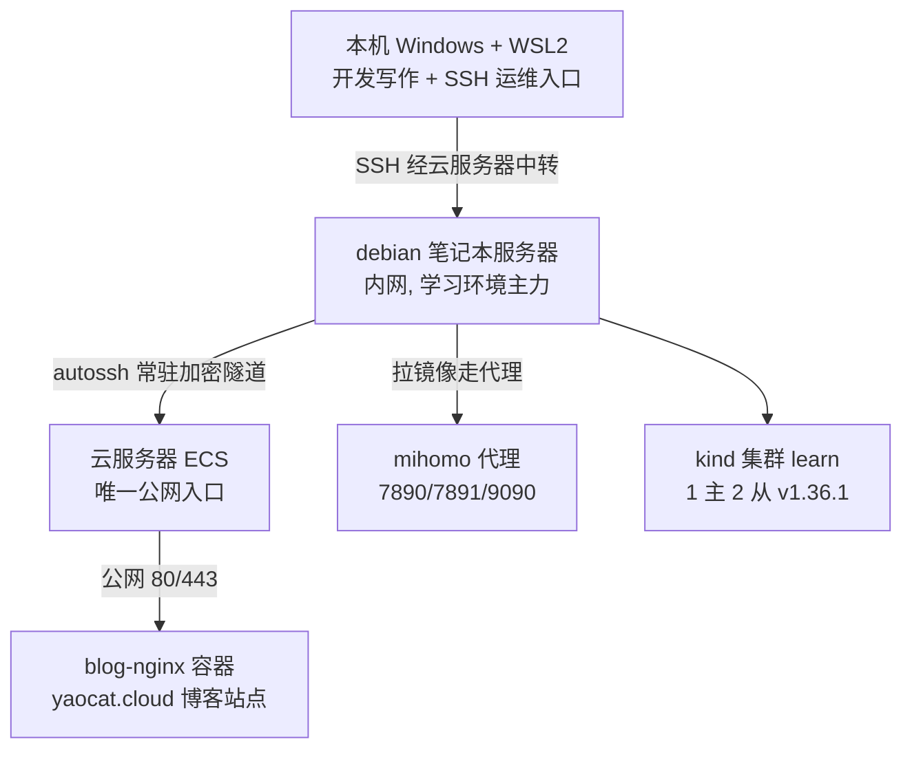
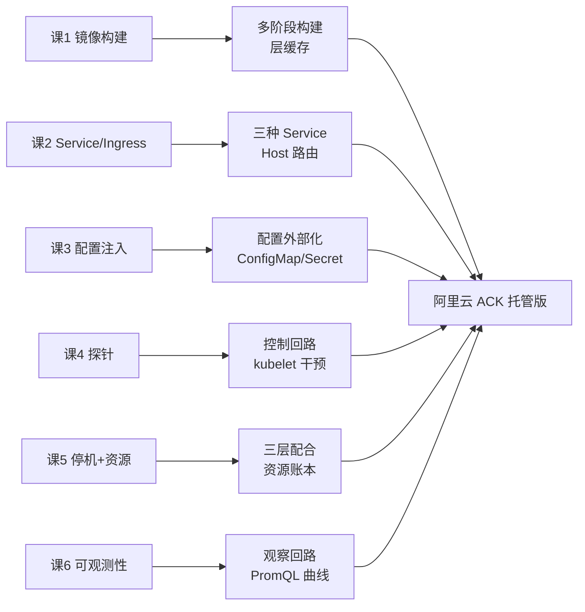
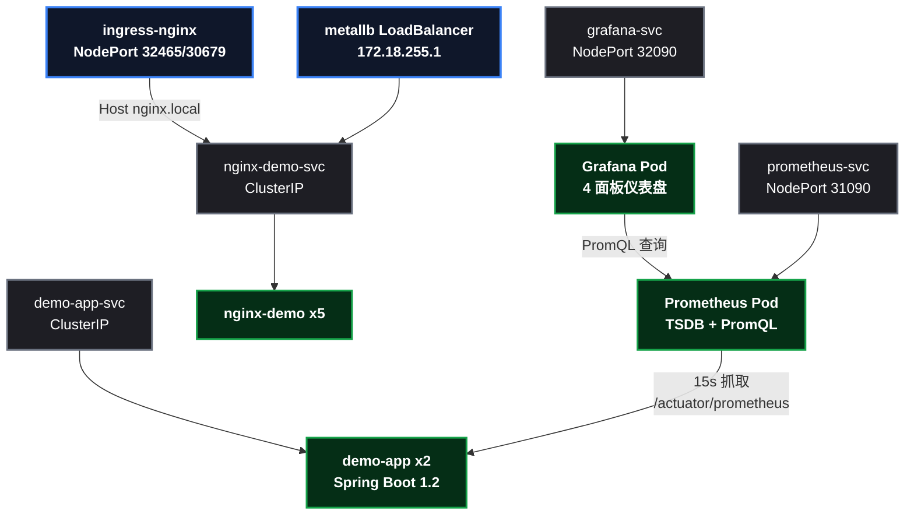

# 八篇博客、两台服务器：K8s 学习资产清点

这个系列写到这里，第八篇了。从一台退役的笔记本服务器（i3 双核、7.6G 内存）搭起 kind 集群开始，到 Prometheus 抓出第一根指标曲线、Grafana 画出第一张仪表盘结束——六课实战、八篇博客，一路踩的坑全记在了文章里。

这篇不教新东西，做三件事：**清点两台服务器上现在跑着的资产**（写文章时我重新登服务器核实过，不是凭记忆）、**按课时梳理"看+复现"分别能学到什么**、**把整个系列的复现成本交代清楚**。想入坑的读者可以从这篇倒着挑文章看。

## 1. 资产清点：两台服务器，各司其职

先说分工：一台**云服务器**（有公网 IP）当唯一公网入口——跑博客站点、接收反向隧道；一台**内网笔记本服务器**（没有公网 IP）当学习环境主力——跑 kind 集群和全套监控。本机（开发机）通过 SSH 经云服务器中转，随时能进内网服务器干活。

### 1.1 内网笔记本服务器（学习主力）

写这篇时登上去核实过的真实清单：

| 类别 | 资产 | 说明 |
|------|------|------|
| 运行时 | Docker 29.6.2 | daemon 配置了代理，拉镜像不超时 |
| 集群工具 | kind v0.32.0 / kubectl v1.36.4 / k9s v0.51.0 | k9s 终端仪表盘，排查利器 |
| **集群** | learn：1 主 2 从，K8s v1.36.1 | 3 个 kind 节点容器，已稳定运行 |
| 网络插件 | metallb（IP 池 172.18.255.x） | 模拟云上 SLB 的 LoadBalancer 行为 |
| 入口 | ingress-nginx（NodePort 32465/30679） | Host 路由 + 陌生 Host 返 404 |
| 业务应用 | nginx-demo × 5 副本（NodePort 32613 / LB） | 系列第 2 课的 Service/Ingress 演示 |
| 业务应用 | demo-app × 2 副本（镜像 1.2） | Spring Boot 3.3.5，集齐 ConfigMap/Secret/探针/优雅停机/指标端点 |
| **监控** | Prometheus v2.53.0（NodePort 31090） | 15s 抓取 demo-app，目标状态 up |
| **监控** | Grafana 11.1.0（NodePort 32090） | 预置数据源 + 4 面板仪表盘 |
| 系统服务 | mihomo（7890/7891/9090） | 代理；autossh 隧道（常驻连云服务器） |
| 源码与清单 | `/root/k8s-demo-app` + 5 个 deploy YAML | 全部演示资源在服务器上可复现 |

Docker 里躺着 11 个业务相关镜像： ` k8s-demo-app ` 1.0/1.1/1.2（3 个版本见证镜像构建课的迭代）、构建用的 ` maven:3.9-eclipse-temurin-17 ` （504MB）、运行用的 ` eclipse-temurin:17-jre ` （294MB）、 ` nginx:1.27/1.25 ` 、metallb 的 controller/speaker、 ` prom/prometheus:v2.53.0 ` （271MB）、 ` grafana/grafana:11.1.0 ` （453MB），还有测试用的 ` busybox ` 。

### 1.2 云服务器（公网入口 + 博客）

| 类别 | 资产 | 说明 |
|------|------|------|
| 博客站点 | `blog-nginx` 容器（nginx:alpine） | 80/443 映射，HTTPS 提供 yaocat.cloud |
| SSH 防护 | sshd + fail2ban | 公网暴力破解防护 |
| 隧道接收 | 受限账号 + 反向转发监听 | 只允许建立转发通道，无 shell、无登录能力 |
| 已退役 | ~~apache2~~ | 按现代实践卸载，80 端口让给 nginx |

两台机器加起来，就是这个系列的全部"不动产"：**一个跑着 9 个业务 Pod 的学习集群 + 一套完整的 Prometheus/Grafana 监控 + 一个对外博客站 + 一条随时随地能进内网的安全通道**。硬件成本约等于零——学习集群跑在一台旧笔记本上。

## 2. 系列地图：八篇博客一篇一篇看

| # | 博客 | 课时 | 核心内容 |
|:--:|------|:--:|------|
| ① | KindLocalK8sClusterSetup | 课0 | kind 搭建 1 主 2 从集群、节点资源成本 |
| ② | K8sDeploymentHandsOn | 课1 | 镜像构建、Deployment 滚动升级 |
| ③ | SSHReverseTunnelIntranetAccess | 基建 | 内网穿透：SSH 反向隧道四层防护 |
| ④ | K8sServiceIngressPractice | 课2 | 三种 Service 类型 + Ingress 路由 |
| ⑤ | SpringBootContainerizeAndConfig | 课3 | Spring Boot 容器化 + ConfigMap/Secret 注入 |
| ⑥ | K8sProbesPractice | 课4 | readiness/liveness/startup 三兄弟 + SIGSTOP 冷知识 |
| ⑦ | K8sGracefulShutdownResources | 课5 | 优雅停机三层配合 + requests/limits 资源账本 |
| ⑧ | K8sObservabilityPractice | 课6 | Micrometer + Prometheus + Grafana 全链路 |

建议阅读顺序就是上面这个顺序：环境 → 镜像 → 网络 → 配置 → 健康 → 停机/资源 → 可观测性。每篇都自带前置条件表和验证命令，按顺序可以一路复现下来。

## 3. 六课"看+复现"分别学到什么

这一节是整篇的核心：每个课时，看完原理、亲手复现演示之后，读者口袋里应该留下什么。

### 课1：镜像构建——"应用进集群的第一关"

- **原理要点**：多阶段构建（构建阶段与运行阶段分离）、层缓存机制、镜像体积差异的来源。
- **动手演示**：用多阶段 Dockerfile 把 504MB 的构建镜像瘦身到 317MB 运行镜像；改一行代码，观察层缓存让二次构建从 20 分钟缩到几分钟。
- **收获**：理解"为什么生产 Java 镜像用 JRE 不用 JDK"、"为什么改依赖要重建整个依赖层"。这是后面所有课的地基——每课都要重新构建镜像。

### 课2：Service 与 Ingress——"应用怎么被访问"

- **原理要点**：ClusterIP（集群内）、NodePort（节点外）、LoadBalancer（云上）三种暴露方式的适用场景；Ingress 的 Host 路由与默认 404。
- **动手演示**：同一个 nginx-demo 用三种方式暴露，用 `kubectl exec` 验证 ClusterIP DNS，用 curl 的 Host 头验证路由规则。
- **收获**：建立"访问路径"的肌肉记忆——生产里对外流量走 SLB（对应本课 LoadBalancer），内部调用走 Service DNS，Ingress 负责 7 层路由。

### 课3：配置注入——"代码与配置分离"

- **原理要点**：ConfigMap 管非敏感配置、Secret 管敏感配置（base64 只是编码不是加密）；环境变量与文件挂载两种注入方式； ` kubectl set env ` 的坑（变量清不掉）。
- **动手演示**：把应用的欢迎语从 ConfigMap 注入，验证 `/api/hello` 返回集群里的值；Secret 以环境变量和文件两种方式挂载。
- **收获**：理解"配置外部化"对发版的意义——改配置不用重新构建镜像。顺带想清楚和 Nacos 这类配置中心的取舍：K8s 原生配置适合部署态，动态配置中心适合运行态。

### 课4：探针——"控制回路"

- **原理要点**：readiness（摘流量）、liveness（重启）、startup（慢启动保护）三兄弟的分工；探针是 kubelet 的二进制判定 + 直接干预。
- **动手演示**：readiness 摘流守门（流量只打新 Pod）、liveness 指向 404 路径触发自愈（RESTARTS 计数上涨）、startup 窗口太短导致 CrashLoopBackOff。
- **收获**：Java 应用慢启动是常态，startup 探针是必修课；探针配不好，发版就是事故现场。

### 课5：优雅停机与资源管理——"体面地死，别被 OOM 杀"

- **原理要点**：优雅停机三层配合（readiness 摘流 → preStop 缓冲 → 应用处理在途请求）；requests 决定调度、limits 决定上限的资源账本模型。
- **动手演示**：10 秒慢请求在 Pod 删除时存活（EXIT=0 实锤）；requests 超量导致 Pending（ ` Insufficient memory ` ）；limits 过小导致 OOMKilled 循环重启。
- **收获**：两个发版最关心的命题——"发版会不会断连"和"应用会不会被系统杀"。JVM 堆设置 vs 容器内存限额的关系也在这课讲透。

### 课6：可观测性——"观察回路"

- **原理要点**：Prometheus 拉取模型（应用只暴露、Prometheus 主动抓）；指标 → TSDB → PromQL 的链路；Grafana provisioning 配置即代码；探针与 Prometheus 双回路并存。
- **动手演示**：给应用加三行配置暴露 ` /actuator/prometheus ` ；集群内部署 Prometheus 抓取；打流量后用 ` rate() ` 、 ` histogram_quantile() ` 查询；Grafana 预置数据源和仪表盘。
- **收获**：四类"我以为能访问、实际不能"的坑（NodePort 区间、kind 网络命名空间、ClusterIP DNS 边界、provisioning 子目录），把 K8s 网络模型和 ConfigMap 挂载机制一次性摸透。

### 一张图看懂学习地图

这个系列刻意**砍掉**的东西也要说清楚：kubeadm 安装、etcd 备份、HA 高可用、CNI 插件原理——这些是自建集群的运维课，托管版（ACK）全部免学。学习目标从一开始就锚定"Spring Boot 开发者视角 + 云上托管版"，每课的概念都能在 ACK 里找到对应物（LoadBalancer → SLB、NodePort → 云监控暴露方式、自己部署的 Prometheus → ARMS 托管监控）。

## 4. 集群内资产一图流

把第 1 节拆开看，集群内部现在是这样的：

9 个业务 Pod、5 个 Service、两套监控组件，全部跑在 7.6G 内存的旧笔记本上（集群节点约占用 5 ~ 6G，业务 Pod 只申请了约 190Mi）。这本身就说明了 kind 学习环境的门槛有多低。

## 5. 复现成本：要准备什么

想完整复现这个系列，清单如下：

| 项 | 要求 | 说明 |
|------|------|------|
| 硬件 | 一台 8G 内存以上的 x86 机器 | 我用的 i3 双核旧笔记本，虚拟机/云主机都行 |
| 软件 | Docker + kind + kubectl | kind 不需要真虚拟机，秒级建集群 |
| 网络 | 能访问 Docker Hub / GitHub | 国内需要代理，系列第 1 篇写了配置方法 |
| 时间 | 每课 30 ~ 90 分钟 | 不含写博客；卡住时看对应文章的"坑"节 |
| 技能 | Docker 基础 + Spring Boot 基本用法 | Java 版本 17 即可 |

每篇文章都满足"读者照着命令 + 预期输出就能复现"的标准：演示用的接口代码、镜像重建命令、完整 YAML、恢复命令、真实报错原文，全部在文内。

## 6. 踩坑沉淀：系列最值钱的部分

整个系列踩过的坑，按"类型"归档比按"课时"归档更有复用价值：

| 类型 | 坑 | 症状一句话 | 出处 |
|------|------|------|:--:|
| 网络边界 | NodePort 超出 30000-32767 | apply 部分失败，Service 被拒 | ⑧ |
| 网络边界 | kind 的 NodePort 绑在节点 IP | `127.0.0.1` 拒连，节点 IP 正常 | ⑧ |
| 网络边界 | ClusterIP DNS 只在集群内 | 宿主机 curl Service 域名失败 | ⑧ |
| 网络边界 | 直连 Pod IP 绕过负载均衡 | 目的是确定命中目标副本 | ⑦ |
| 配置状态 | `kubectl set env` 的变量清不掉 | 慢请求 EXIT=1 误判为停机失效 | ⑦ |
| 配置状态 | apply 旧清单清不掉已加 env | 排查时 jsonpath 抓到旧 Pod 具欺骗性 | ⑦ |
| 配置状态 | ConfigMap key 不允许斜杠 | 预置配置想表达子目录被 API 拒绝 | ⑧ |
| 配置状态 | Grafana provisioning 只扫子目录 | 数据源列表为空，挂载布局扁平 | ⑧ |
| 资源 | requests 超节点容量 | Pod 一直 Pending， ` Insufficient memory ` | ⑦ |
| 资源 | limits 过小 | OOMKilled 无限循环重启 | ⑦ |
| 行为 | SIGSTOP 对容器 PID 1 无效 | 模拟假死失败，进程状态仍 S | ⑥ |
| 行为 | curl 管道解析 JSON 报错 | JSONDecodeError 掩盖真实网络错误 | ⑧ |

十二个坑，前八个是"你以为生效了、实际没有"的静默失败——这类坑光看文档永远学不到，必须亲手踩一次。

## 7. 当前状态与下一步

写这篇时集群已经连续运行两天，9 个 Pod 全部健康，Prometheus 抓取目标 ` up ` ，博客站点对外正常。这个环境不是一次性道具，是随时可以继续加课的实验台。

系列本身留了两个自然的延伸方向：

1. **告警闭环**：Alertmanager 接上钉钉/飞书 webhook——指标超过阈值自动通知，正好把"观察回路"升级成"告警回路"；
2. **日志链路**：Loki + promtail 接入，凑齐"指标 + 日志"两条腿，和 Prometheus 做关联分析。

再往后就是云上实战：把 kind 里建立的肌肉记忆（LoadBalancer、探针、资源、可观测性）映射到阿里云 ACK 托管版，真刀真枪跑一个生产形态的 Spring Boot 服务。

## 8. 总结

一台旧笔记本、一台云服务器、六课实战、八篇博客、十二个坑——这就是这个系列的全部家当。资产清点完，最想对读者说的是：**这套东西的门槛比想象中低**，旧笔记本就能跑；**收获比想象中高**，因为每个概念都经过了"原理 → 动手 → 踩坑 → 复盘"的完整闭环。

如果只能带走一句话：K8s 对 Spring Boot 开发者不是运维黑话，而是"镜像怎么进集群、流量怎么进来、应用怎么活着、指标怎么看见"这四件事——这个系列把这四件事各讲了两遍：一遍是原理，一遍是亲手复现。

