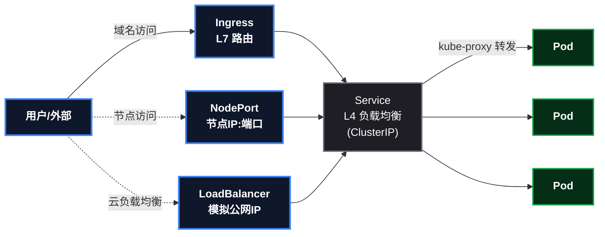
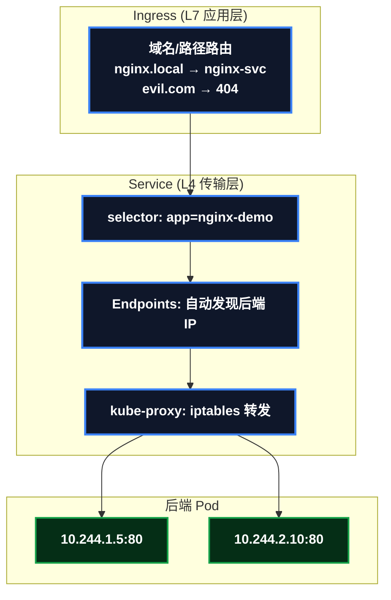

# 让集群里的应用被外面访问到：Service 与 Ingress 四连击

应用部署进集群只是第一步——**怎么让"别人"访问到它**才是日常。这个"别人"可能是集群里的另一个服务（微服务互调），可能是集群外的机器，也可能是互联网上的用户。K8s 用四种递进的暴露方式回答这个问题：ClusterIP → NodePort → LoadBalancer → Ingress。

这篇文章完整记录在 kind 一主二从集群上把这四种方式逐一打通的实战过程：每个阶段的命令、预期输出、原理，以及真实踩过的五个坑。跟着做一遍，你对"服务发现和流量入口"的理解就成型了——这也是日后上阿里云 ACK 时每天都要面对的东西。

> 📌 前置知识：需要已有一个 kind 集群，并且集群里有一个跑着的 Deployment（本文沿用上一篇实战部署的 ` nginx-demo ` ，5 副本，镜像 nginx:1.27）。国内网络环境需要宿主机 Docker 配好代理（见本系列第一篇）。

## 这次要做什么

```
目标：把 nginx-demo 从"只有集群内可见"逐步暴露到"域名可访问"
阶段：ClusterIP(集群内) → NodePort(节点) → LoadBalancer(模拟公网) → Ingress(域名路由)
收获：理解 Service 的选择器/Endpoints/负载均衡，以及 Ingress 的 L7 路由
```

### 概念热身：四种方式各解决什么（先建立直觉再看图）

**读者此刻一定会问**：ClusterIP、NodePort 是什么？为什么要四种方式？——一句话：**一个服务从"集群内可见"到"公网域名可访问"，每向外暴露一层，就多一种方式**。顺着"我想让谁访问"这个需求递进，四个概念就都有了：

| 需求递进 | 方式 | 一句话（它是干嘛的） |
|------|------|------|
| ① 服务在 Pod 里，Pod IP 会变（重启就换），集群内其他服务怎么稳定找到它？ | **ClusterIP** | 给一组 Pod 一个集群内固定"虚拟 IP"（VIP）+ 名字，别人用名字访问，不关心 Pod 换没换 |
| ② 我想从集群外访问（浏览器、外部系统）？ | **NodePort** | 在每个节点上开一个端口（如 32613），外部访问 `节点IP:端口` 就能打到 Service |
| ③ 生产流量大，想要一个统一的公网入口？ | **LoadBalancer** | 云负载均衡器（本文用 metallb 模拟），分配一个对外 IP，流量先到它再进集群 |
| ④ 有多个服务，想按域名/路径分发？ | **Ingress** | L7 网关：按 `域名 + 路径` 路由到不同 Service（如 api.xxx.com → A 服务，www.xxx.com → B 服务） |

**记住递进关系**：ClusterIP 是基础（所有方式最终都打到它）→ NodePort 是"集群外访问"的最简实现 → LoadBalancer 是"统一对外入口" → Ingress 是"按域名路由"。后面每个阶段都会细讲原理和实操。

**现在带着这四个直觉，看完整链路图**（看不懂的细节不用慌，每个方块在对应阶段都会拆开讲）：



## 第一阶段：ClusterIP + 集群内 DNS（微服务互调的基础）

### 创建 Service

```bash
kubectl expose deployment nginx-demo --port=80 --target-port=80 --name=nginx-svc
kubectl get svc nginx-svc
# 输出: nginx-svc   ClusterIP   10.96.192.178   <none>   80/TCP
kubectl get endpoints nginx-svc
# 输出: 10.244.1.5:80,10.244.1.6:80,10.244.2.10:80 + 2 more...
```

**YAML 版本（主流写法）**： ` kubectl expose ` 适合快速试，但生产/团队协作用 **YAML**——配置一目了然、可进 git 评审、可复用（与 Deployment 篇的"声明式才是主流"同一逻辑）。同样的 Service 用 YAML 写（注意 ` selector ` 字段就是"自动匹配 Pod"的声明）：

```yaml
# svc.yaml
apiVersion: v1
kind: Service
metadata:
  name: nginx-svc
spec:
  type: ClusterIP
  selector:
    app: nginx-demo
  ports:
  - port: 80
    targetPort: 80
```

```bash
kubectl apply -f svc.yaml        # 实测输出: service/nginx-svc created
kubectl get svc nginx-svc
# 与 expose 版行为完全一致 —— selector 声明决定一切, endpoints 自动填充
```

> ⚠️ 新手提示：如果前面已经用 `kubectl expose` 创建过同名 Service，先 `kubectl delete svc nginx-svc` 再 apply，或换个名字验证（两种方式效果相同）。

**关键认知**：Service 没有"注册"任何东西——它靠**标签选择器**（selector）自动匹配 Pod，匹配结果实时出现在 **Endpoints** 里。Pod 挂了重建、IP 变了，Endpoints 自动更新。这就是"Nacos 注册中心"的替代品：**服务发现被下沉到了平台层**。

### 测试集群内 DNS

先起一个长驻测试 Pod（注意别用 ` --rm ` ，非交互环境会报错）：

```bash
kubectl run dns-test --image=busybox:1.36 --restart=Never --command -- sleep 3600
kubectl wait --for=condition=Ready pod/dns-test --timeout=60s

# 服务名解析 → ClusterIP
kubectl exec dns-test -- nslookup nginx-svc
# Name: nginx-svc.default.svc.cluster.local
# Address: 10.96.192.178

# 完整域名（svc.命名空间.svc.cluster.local 三段式）
kubectl exec dns-test -- nslookup nginx-svc.default.svc.cluster.local

# 服务名当 URL 直接用（模拟微服务间调用）
kubectl exec dns-test -- wget -qO- http://nginx-svc | head -3

# 清理
kubectl delete pod dns-test
```

> 📌 对 Spring Cloud 开发者：在 K8s 里，服务间调用 URL 从"注册中心地址"变成了"服务名"。你的 Java 服务之间可以直接 `http://nginx-svc` 互调，甚至不需要 Feign 的服务发现组件——这就是服务发现从应用层下沉到平台层的含义。

> ⚠️ 新手提示： ` kubectl run xxx --rm ` 必须配合 ` -it ` （交互终端）使用，纯非交互环境会报 ` --rm should only be used for attached containers ` 。长驻 Pod + ` kubectl exec ` 是脚本化的标准姿势。

## 第二阶段：NodePort（集群外通过节点 IP 访问）

```bash
kubectl expose deployment nginx-demo --port=80 --target-port=80 --type=NodePort --name=nginx-np
kubectl get svc nginx-np
# 输出: nginx-np   NodePort   10.96.241.2   <none>   80:32613/TCP

# 从宿主机访问（kind 节点 IP 是 172.18.0.x，宿主机可达）
curl -s http://172.18.0.3:32613 | head -1   # 返回 HTML
curl -s http://172.18.0.4:32613 | head -1   # 另一个节点也通
```

**YAML 版本（主流写法）**：`--type=NodePort` 一行在 YAML 里就是 `type` 字段，而且 YAML 可以**显式指定节点端口**（expose 只能随机分配）：

```yaml
# svc-np.yaml
apiVersion: v1
kind: Service
metadata:
  name: nginx-np
spec:
  type: NodePort
  selector:
    app: nginx-demo
  ports:
  - port: 80
    targetPort: 80
    nodePort: 32614        # 显式指定节点端口(30000-32767), expose 只能随机
```

```bash
kubectl apply -f svc-np.yaml        # service/nginx-np created
curl -s http://172.18.0.3:32614 | head -1    # 实测 HTTP 200, 与 expose 版行为一致
```

NodePort 的原理：每个节点上的 **kube-proxy** 用 iptables 规则把"节点IP:32613" DNAT 到后端 Pod。可以亲眼看一下规则落地形态：

```bash
docker exec learn-worker iptables-save | grep "32613" | grep -v REJECT
# KUBE-NODEPORTS 链里的转发规则
```

> ⚠️ 新手提示：刚创建 Service 时立刻查 iptables 会看到 ` has no endpoints ... REJECT ` ——那是 Endpoints 还没填充的竞态，等两三秒就正常。生产排障时看到 REJECT 规则，先怀疑"Service 选择器没匹配到 Pod"。

## 第三阶段：LoadBalancer（metallb 模拟云负载均衡）

kind 没有云厂商的负载均衡器，用 **metallb** 模拟：它从配置的 IP 池里给 LoadBalancer 类型的 Service 分配一个"公网 IP"。阿里云 ACK 上这一步由 SLB 自动完成，行为完全一致。

### 安装 metallb

```bash
# 1. 下载清单（国内走代理）
curl -x http://127.0.0.1:7890 -sL -o /tmp/metallb.yaml \
  https://raw.githubusercontent.com/metallb/metallb/v0.14.9/config/manifests/metallb-native.yaml

# 2. 应用清单（坑：webhook 会先拒绝连接，等 Pod 就绪后再配 IP 池）
kubectl apply -f /tmp/metallb.yaml
kubectl wait -n metallb-system --for=condition=ready pod --all --timeout=180s

# 3. 配置 IP 池（从 kind 节点所在网段里划一段）
cat > /tmp/metallb-config.yaml <<'EOF'
apiVersion: metallb.io/v1beta1
kind: IPAddressPool
metadata:
  name: kind-pool
  namespace: metallb-system
spec:
  addresses:
  - 172.18.255.1-172.18.255.250
---
apiVersion: metallb.io/v1beta1
kind: L2Advertisement
metadata:
  name: kind-l2
  namespace: metallb-system
spec:
  ipAddressPools:
  - kind-pool
EOF
kubectl apply -f /tmp/metallb-config.yaml
```

### 创建 LoadBalancer 类型 Service

```bash
kubectl expose deployment nginx-demo --port=80 --target-port=80 --type=LoadBalancer --name=nginx-lb
kubectl get svc nginx-lb
# 输出: nginx-lb   LoadBalancer   10.96.125.156   172.18.255.1   80:32466/TCP
curl -s http://172.18.255.1 | head -1   # 用"公网 IP"访问成功
```

**YAML 版本（主流写法）**：LoadBalancer 的 YAML 与 NodePort 几乎一样，只改 ` type ` （云上还会加 ` annotations ` 控制负载均衡器规格，如带宽/计费——这是命令式做不到的）：

```yaml
# svc-lb.yaml
apiVersion: v1
kind: Service
metadata:
  name: nginx-lb
spec:
  type: LoadBalancer
  selector:
    app: nginx-demo
  ports:
  - port: 80
    targetPort: 80
```

```bash
kubectl apply -f svc-lb.yaml        # service/nginx-lb created
kubectl get svc nginx-lb            # EXTERNAL-IP 由 metallb 分配(实测: 172.18.255.3, 池内按序)
curl -s http://172.18.255.3 | head -1    # 实测 HTTP 200
```

> 📌 三个阶段串起来看：ClusterIP / NodePort / LoadBalancer 的 YAML **结构几乎一样**，只差 `type` 字段和个别属性——这正是"Service 是一种资源，类型是它的一个字段"的直观体现。

> ⚠️ 新手提示（本阶段最大的坑）：metallb 的 Pod 起不来，最常见的症状是**配置 IP 池时报 webhook 拒绝连接**（ ` failed to call webhook ... connection refused ` ）——根因是 controller 还没就绪，而不是配置写错。而 controller 起不来，大概率又是**节点直连拉镜像超时**（metallb 镜像在 quay.io，kind 节点内 containerd 不走宿主代理）。解法：宿主机 ` docker pull ` （走代理）+ ` kind load docker-image ` 预载入所有节点。

## 第四阶段：Ingress（域名 / 路径路由）

### 安装 ingress-nginx（kind 专用清单）

```bash
# 1. 下载 kind 版清单
curl -x http://127.0.0.1:7890 -sL -o /tmp/ingress-nginx.yaml \
  https://raw.githubusercontent.com/kubernetes/ingress-nginx/controller-v1.12.0/deploy/static/provider/kind/deploy.yaml
```

**坑 1：节点需要打 `ingress-ready=true` 标签。** kind 清单里 controller 带 nodeSelector，要求节点有这个标签才允许调度（这是 kind 官方的规范做法——显式声明"哪些节点愿意接收 Ingress 流量"）：

```bash
kubectl label node learn-worker learn-worker2 ingress-ready=true
```

> 📌 这个坑其实是教学点：**nodeSelector 是控制"Pod 调度到哪些节点"的声明式手段**，生产里常用于把 Ingress 控制器、监控采集器等固定到指定节点池。

**坑 2：镜像摘要引用拉不到。** 清单里的镜像写的是 `tag@sha256:...` 摘要形式——即使本地已预载镜像，containerd 仍要联网解析摘要，直连 registry.k8s.io 超时。去掉摘要、只留 tag：

```bash
sed -i "s/@sha256:[a-f0-9]\{64\}//g" /tmp/ingress-nginx.yaml
# 预载镜像（宿主机代理拉取 + kind load，见 metallb 阶段）
docker pull registry.k8s.io/ingress-nginx/controller:v1.12.0
docker pull registry.k8s.io/ingress-nginx/kube-webhook-certgen:v1.5.0
kind load docker-image registry.k8s.io/ingress-nginx/controller:v1.12.0 \
  registry.k8s.io/ingress-nginx/kube-webhook-certgen:v1.5.0 --name learn
```

**坑 3：已存在的 Job 不可变。** 如果之前用带摘要的清单应用过，admission 补丁 Job 会一直 ImagePullBackOff——Job 创建后不可更新，必须删掉让新清单重建：

```bash
kubectl apply -f /tmp/ingress-nginx.yaml
kubectl wait -n ingress-nginx --for=condition=ready pod --all --timeout=180s
# 若旧 Job 卡住: kubectl delete job -n ingress-nginx ingress-nginx-admission-create ingress-nginx-admission-patch
# 然后重新 apply
```

**坑 4：hostPort 在 kind 节点内不生效，用 NodePort 访问。** 清单给 controller 配了 hostPort 80/443，但在 kind 节点里端口绑定没生效。不过清单同时创建了 **NodePort 类型 Service**（80→32465），从节点 IP 加端口访问即可：

```bash
kubectl get svc -n ingress-nginx
# ingress-nginx-controller   NodePort   80:32465/TCP,443:30679/TCP
```

### 创建 Ingress 规则并验证

```bash
kubectl apply -f - <<'EOF'
apiVersion: networking.k8s.io/v1
kind: Ingress
metadata:
  name: nginx-ing
spec:
  ingressClassName: nginx
  rules:
  - host: nginx.local
    http:
      paths:
      - path: /
        pathType: Prefix
        backend:
          service:
            name: nginx-svc
            port:
              number: 80
EOF

# 验证 1: 匹配域名 → 200 + nginx HTML
curl -s -H "Host: nginx.local" http://172.18.0.4:32465 | head -1

# 验证 2: 未匹配域名 → 404（默认后端隔离）
curl -s -o /dev/null -w "HTTP %{http_code}\n" -H "Host: evil.com" http://172.18.0.4:32465
```

## 原理：Service 与 Ingress 的分工



| 层 | 谁 | 干什么 | 对应 Spring Cloud |
|---|---|---|---|
| L7 | Ingress | 按域名/路径路由到 Service，可做 TLS 终止 | Spring Cloud Gateway |
| L4 | Service + kube-proxy | 稳定虚拟 IP + 负载均衡到 Pod | Ribbon/LoadBalancer |
| 发现 | coredns + Endpoints | 服务名解析 + 后端自动发现 | Nacos 注册中心 |

**Spring Cloud 开发者视角：四种方式逐一对照**。上面表格是"层"的对照，这里把四种暴露方式逐个对位：

| 这篇的方式 | Spring Cloud 体系里的对应 | 核心区别 |
|------|------|------|
| **ClusterIP + CoreDNS**（第一阶段） | Nacos 注册中心 + Feign/Ribbon | Nacos 要代码集成（ ` @EnableDiscoveryClient ` + 心跳续约）；ClusterIP 是平台声明（ ` selector ` 自动匹配）——**服务发现从代码下沉到平台层** |
| **NodePort**（第二阶段） | 无直接对应（传统用 nginx 反代暴露端口） | NodePort 是平台批量开端口（30000-32767），nginx 反代要手配 upstream |
| **LoadBalancer**（第三阶段） | 云 SLB / 自建 Nginx 集群 | 声明式自动创建（metallb 模拟）vs 手动申请/配置负载均衡器 |
| **Ingress**（第四阶段） | Spring Cloud Gateway | 都是 L7 域名/路径路由 + TLS 终止；但 SCG 是**要自己部署维护的 Java 应用**，Ingress 是**声明式资源**（控制器实现，平台管） |

**主线洞察**：Spring Cloud 体系里，服务发现（Nacos）、负载均衡（Ribbon）、网关（SCG）是**三个独立的代码组件**，要分别引入依赖、写配置；K8s 用 **Service + DNS + kube-proxy + Ingress** 四个平台资源整套替代——代码里什么都不用引入，只剩"声明"。

> 📌 对 Spring Cloud 开发者：四种方式的递进（集群内 → 节点 → 统一入口 → 域名路由）对照微服务体系的"入口演进"——微服务时代服务间靠 Nacos 直连、对外统一走 SCG 网关；K8s 把这套入口能力**全部平台化**：ClusterIP≈Nacos 直连、LoadBalancer≈SLB、Ingress≈SCG。概念不变，位置从应用层搬到了平台层。

## 踩坑速查表（复现必看）

> ⚠️ **2026 年 3 月起，标准 Ingress Controller（ingress-nginx）已归档停止维护**（GitHub 实测 ` archived: true ` ，最后 release v1.15.1）。存量 Ingress 照常工作，但**新项目的流量入口建议用新标准 Gateway API**——本文的 Ingress 原理仍然有效（它是 Gateway API 的设计基础），完整实战见：

> 📎 **《Gateway API 实战：ingress-nginx 归档后的新标准（kind + Envoy Gateway 全打通）》**：[点此阅读](/posts/kubernetes/GatewayApiPractice/)

| # | 坑 | 症状 | 解法 |
|---|---|---|---|
| 1 | `kubectl run --rm` 非交互报错 | `--rm should only be used for attached containers` | 长驻 Pod + `kubectl exec` |
| 2 | 新建 Service 查 iptables 是 REJECT | `has no endpoints` | Endpoints 填充竞态，等几秒；持久出现则查 selector |
| 3 | metallb webhook 拒绝连接 | `failed to call webhook ... connection refused` | controller 未就绪；先等 Pod 再配 IP 池 |
| 4 | 节点拉镜像超时 | ImagePullBackOff + dial tcp timeout | 宿主机代理拉取 + `kind load docker-image` 预载 |
| 5 | ingress-nginx 调度失败 | `didn't match Pod's node affinity/selector` | 节点打 `ingress-ready=true` 标签 |
| 6 | 镜像摘要引用拉取失败 | 本地有镜像仍 ImagePullBackOff | `sed` 去掉 `@sha256:...` 只留 tag |
| 7 | 旧 Job 卡在 ImagePullBackOff | 改清单没用 | Job 不可变，删除后重新 apply |
| 8 | hostPort 不生效 | 节点内无 80/443 监听 | 改用 NodePort Service 端口访问 |

## 总结：上云后的对应关系

| kind 里学的 | 阿里云 ACK 上的样子 |
|---|---|
| metallb 分配的 IP | SLB/ALB 自动创建的公网 IP |
| ingress-nginx（自己装） | 控制台勾选托管版 Ingress 控制器 |
| kind load 预载镜像 | 推送到 ACR，节点自动拉取 |
| `nginx.local` 域名 | 你的备案域名 + DNS 解析 |

**一句话总结**：Service 解决"把流量稳定送到 Pod"（L4），Ingress 解决"按域名路径分流"（L7），两者叠加就是完整的"部署 → 暴露 → 访问"链路。这套理解直接平移到 ACK——除了 IP 来源和安装方式，其余完全一样。

系列文章：kind 搭建集群 → Deployment 实战 → Service/Ingress 实战（本篇）→ 配置注入（ConfigMap/Secret）。
