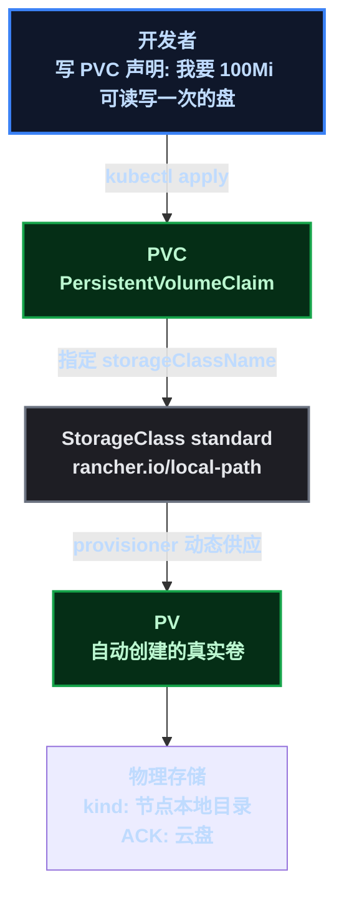
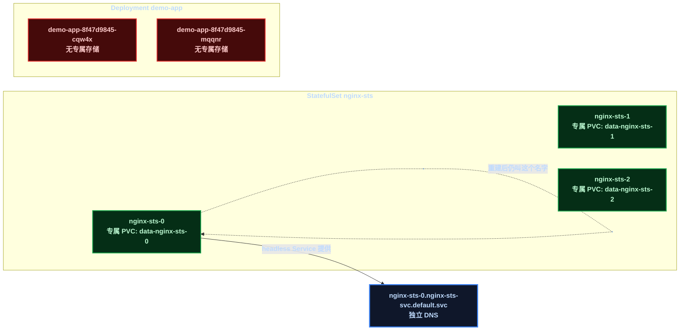

# 有状态应用上集群：名字、盘、顺序一个都不能乱

系列前七课全在讲**无状态应用**——Deployment 的 Pod 随便重建、随便换节点，名字是随机后缀，数据不留本地。这当然好，但现实里有状态的东西怎么办？数据库、Redis、Elasticsearch——它们要求"我是谁"固定不变、"我的数据"不能丢、初始化顺序不能乱。

这一课补齐工作负载的最后一块拼图：**StatefulSet（有状态应用控制器）**和它背后的**存储抽象（PV / PVC / StorageClass）**。全部在 kind 上实测，最后映射到 ACK 的云盘动态供应。

## 1. 目标与前置条件

**目标**：理解 StatefulSet 与 Deployment 的本质区别；掌握存储三层抽象与动态供应机制；亲手验证"稳定标识、专属存储、有序滚动"三大保证。

**前置条件**（沿用系列环境）：

| 项 | 说明 |
|------|------|
| kind 集群 | ` learn ` ，1 主 2 从，K8s v1.36.1 |
| StorageClass | kind **自带** ` standard ` （ ` rancher.io/local-path ` ， ` WaitForFirstConsumer ` ），无需安装任何组件 |
| 镜像 | ` busybox:1.36 ` （测试写入）、 ` nginx:1.27/1.25 ` （滚动演示） |

```bash
kubectl get nodes
kubectl get storageclass   # 应看到 standard (default)
```

## 2. 原理先行：两个问题，两套机制

### 2.1 存储三层抽象：开发者只写"声明"

K8s 的存储不是"挂一块盘"这么简单，它把存储拆成三层，让**开发者与存储实现解耦**：

- **PV（PersistentVolume，持久卷）**：一块真实的存储——云上是一块云盘、物理机是一个目录。它属于**集群**，由管理员/系统创建；
- **PVC（PersistentVolumeClaim，持久卷声明）**：开发者写的"我要 100Mi 的盘，可读写一次"——**声明需求**，不关心盘从哪来；
- **StorageClass（存储类）**：动态供应的"模板"——定义了用哪种 provisioner（云盘/本地目录）、什么回收策略。PVC 指定存储类后，**provisioner 自动创建 PV 并绑定**，开发者全程不碰真实存储。



**WaitForFirstConsumer**（本集群 storageclass 的绑定模式）值得单独说：PVC 创建后先 ` Pending ` ，**等第一个使用它的 Pod 被调度到节点后**，才在那个节点上创建卷并绑定——好处是卷落在"真正用它的节点"旁边，避免"卷在 A 节点、Pod 在 B 节点"的跨机访问。云上的云盘绑定也是这个模式。

### 2.2 StatefulSet 三大保证：无状态与有状态的分水岭

Deployment 的 Pod 是无名氏： ` demo-app-8f47d9845-cqw4x ` ，删除重建换个随机后缀。StatefulSet 的 Pod 是户籍人口： ` nginx-sts-0 ` 、 ` nginx-sts-1 ` 、 ` nginx-sts-2 ` ——靠**三个机制**保证身份稳定：

| 保证 | 机制 | 无状态(Deployment) 对照 |
|------|------|------|
| **稳定网络标识** | 固定 Pod 名 + headless Service（ ` clusterIP: None ` ），每个 Pod 有独立 DNS： ` nginx-sts-0.nginx-sts-svc.default.svc ` | 随机后缀，无独立 DNS |
| **专属存储** | ` volumeClaimTemplates ` ：给**每个副本**自动创建专属 PVC（ ` data-nginx-sts-0/1/2 ` ），Pod 死了卷不丢 | 所有副本共享或不用卷 |
| **有序部署/更新/删除** | 按索引顺序：创建 0→1→2，滚动更新 2→1→0，删除 2→1→0 | 全并行 |



**一句话记忆**：Deployment 管"一群长得一样的牛"，StatefulSet 管"一群有名有姓、各带各的行李、按次序上下车的人"。

## 3. 演示 A：PVC 动态供应与数据持久化

### 3.1 清单与创建

` pvc-demo.yaml ` （一个 PVC + 一个往里写文件的 Pod）：

```yaml
apiVersion: v1
kind: PersistentVolumeClaim
metadata:
  name: data-demo
spec:
  accessModes: [ReadWriteOnce]
  storageClassName: standard
  resources:
    requests:
      storage: 100Mi
---
apiVersion: v1
kind: Pod
metadata:
  name: writer
spec:
  containers:
    - name: writer
      image: busybox:1.36
      command: ["sh", "-c", "echo hello-persist > /data/hello.txt && sleep 3600"]
      volumeMounts:
        - name: data
          mountPath: /data
  volumes:
    - name: data
      persistentVolumeClaim:
        claimName: data-demo
```

```bash
kubectl apply -f pvc-demo.yaml
kubectl describe pvc data-demo
```

### 3.2 预期输出：事件序列就是原理本身

`kubectl describe pvc data-demo` 的 Events 完整展示了动态供应的每一步：

```text
Normal  WaitForFirstConsumer    persistentvolume-controller   waiting for first consumer to be created before binding
Normal  Provisioning           rancher.io/local-path_...     External provisioner is provisioning volume for claim "default/data-demo"
Normal  ProvisioningSucceeded  rancher.io/local-path_...     Successfully provisioned volume pvc-c68e5fe6-...
```

三个事件对应原理里的三个动作：**等消费者 → 开始供应 → 供应成功**。随后 PVC 变 ` Bound ` ，PV 自动出现：

```text
NAME        STATUS   VOLUME                                    CAPACITY   ACCESS MODES   STORAGECLASS   AGE
data-demo   Bound    pvc-c68e5fe6-ece5-4f62-867b-178acc02713c  100Mi      RWO            standard       21s
```

> 📌 前置知识： ` RWO ` （ReadWriteOnce，单节点读写）——云盘类存储的特性，只能被一个节点挂载，对应云盘"挂到一台机器"的物理限制； ` Delete ` 回收策略——删除 PVC 时 PV 连同底层数据一起删（生产要谨慎，可改用 ` Retain ` ）。

### 3.3 持久化实锤：删 Pod，数据还在

```bash
kubectl exec writer -- cat /data/hello.txt   # hello-persist
kubectl delete pod writer                     # 把"用卷的人"干掉
kubectl apply -f pvc-demo.yaml                # 重建同名 Pod(实际是新 Pod 对象)
kubectl exec writer -- cat /data/hello.txt   # 还是 hello-persist!
```

**核心认知**：Pod 是临时的、卷是永久的。删 Pod 只删"使用关系"，PVC/PV 和里面的数据原封不动——这正是生产里"应用重启不丢数据"的机制。**恢复命令**：

```bash
kubectl delete -f pvc-demo.yaml               # 删 Pod + PVC, PV 因 Delete 策略自动清理
```

## 4. 演示 B：StatefulSet 三大保证实测

### 4.1 清单：headless Service + volumeClaimTemplates

` statefulset-demo.yaml ` ：

```yaml
apiVersion: v1
kind: Service
metadata:
  name: nginx-sts-svc
spec:
  clusterIP: None            # headless Service: 无 ClusterIP, 每个 Pod 有独立 DNS
  selector:
    app: nginx-sts
  ports:
    - port: 80
      targetPort: 80
---
apiVersion: apps/v1
kind: StatefulSet
metadata:
  name: nginx-sts
spec:
  serviceName: nginx-sts-svc
  replicas: 3
  selector:
    matchLabels:
      app: nginx-sts
  template:
    metadata:
      labels:
        app: nginx-sts
    spec:
      containers:
        - name: nginx
          image: nginx:1.27
          volumeMounts:
            - name: data
              mountPath: /usr/share/nginx/html
  volumeClaimTemplates:        # 每个副本自动生成专属 PVC: data-nginx-sts-0/1/2
    - metadata:
        name: data
      spec:
        accessModes: [ReadWriteOnce]
        storageClassName: standard
        resources:
          requests:
            storage: 50Mi
```

### 4.2 保证一：稳定网络标识 + 专属存储

```bash
kubectl apply -f statefulset-demo.yaml
kubectl rollout status statefulset/nginx-sts --timeout=120s
kubectl get pods -l app=nginx-sts -o custom-columns=NAME:.metadata.name,NODE:.spec.nodeName
kubectl get pvc | grep nginx-sts
```

预期输出（Pod 名固定、每个 Pod 一块专属盘）：

```text
NAME          NODE
nginx-sts-0   learn-worker2
nginx-sts-1   learn-worker
nginx-sts-2   learn-worker2

data-nginx-sts-0   Bound   pvc-126a269d-...   50Mi   RWO   standard
data-nginx-sts-1   Bound   pvc-8087fed3-...   50Mi   RWO   standard
data-nginx-sts-2   Bound   pvc-d07aab84-...   50Mi   RWO   standard
```

独立 DNS 验证（注意**必须写完整 FQDN**，这是我踩过的小坑——写 ` nginx-sts-0.nginx-sts-svc.default.svc ` 会 ` NXDOMAIN ` ，补上 ` cluster.local ` 后缀才对）：

```bash
kubectl exec writer -- nslookup nginx-sts-0.nginx-sts-svc.default.svc.cluster.local
```

```text
Name:  nginx-sts-0.nginx-sts-svc.default.svc.cluster.local
Address: 10.244.1.46
```

> ⚠️ 新手提示：headless Service 的 DNS 和普通 Service 不同——普通 Service 解析出 ClusterIP，headless 直接解析出 **Pod IP 列表**（每个 Pod 一个 A 记录）。应用要连"某个固定副本"（如主库）时，就写 `podname.servicename` 这种域名。

### 4.3 保证二：稳定标识——删了重建还是它

```bash
kubectl delete pod nginx-sts-1
sleep 12
kubectl get pods -l app=nginx-sts -o custom-columns=NAME:.metadata.name
```

预期输出：重建后的 Pod **仍然叫 `nginx-sts-1`**（Deployment 会给你一个随机后缀的新名字，StatefulSet 不会）。

### 4.4 保证三：有序滚动更新——倒序 2→1→0

```bash
kubectl set image statefulset/nginx-sts nginx=nginx:1.25
sleep 3
kubectl get pods -l app=nginx-sts -o custom-columns=NAME:.metadata.name,IMAGE:.spec.containers[0].image
```

我抓拍的瞬间（滚动刚开始）：

```text
NAME          IMAGE        READY
nginx-sts-0   nginx:1.27   True
nginx-sts-1   nginx:1.27   True
nginx-sts-2   nginx:1.25   False
```

**倒序实锤**：索引最大的 ` nginx-sts-2 ` 先更新（还在变 Ready）， ` nginx-sts-0/1 ` 纹丝不动。等 2 就绪后才轮到 1，最后才是 0——保证"有状态应用更新时，永远只有一个副本在变"，主从架构里这是安全底线（先更从库，最后更主库）。

**恢复命令**：

```bash
kubectl delete -f statefulset-demo.yaml
kubectl delete pvc data-nginx-sts-0 data-nginx-sts-1 data-nginx-sts-2   # StatefulSet 删除不会自动删 PVC
```

## 5. 原理复盘：kind 的 local-path 与 ACK 云盘

| 概念 | kind（本课） | ACK 云上 |
|------|------|------|
| StorageClass | ` standard ` （local-path，节点本地目录） | ` alicloud-disk-* ` （云盘 provisioner） |
| 动态供应 | 声明 PVC → local-path 自动建目录 | 声明 PVC → **自动创建云盘**（真正的一块盘） |
| WaitForFirstConsumer | 绑定在 Pod 所在节点 | 云盘绑定到 Pod 所在可用区/节点 |
| 回收策略 | Delete | Delete / Retain 可选 |

**动态供应的价值在这一课才真正显现**：开发者全程只写 ` PVC + storageClassName ` ，盘从哪来、多大、怎么回收全由 StorageClass 决定——本地是目录、云上是云盘，**同一份 YAML 两端通用**。这就是"声明式"的极致：不写"创建一块云盘"，只写"我要 100Mi"。

**生产建议**（Java 开发者视角）：数据库这类核心状态服务**优先用云托管**（RDS 等，别自己上 K8s 运维数据库）；StatefulSet 真正适合的是 Redis、ES、消息队列这类**中间件的自建**，以及需要"固定节点身份"的场景（如主从选举）。真要用，记住三件事：headless Service 别漏、PVC 记得备份、 ` Delete ` 策略下删 PVC = 删数据。

## 6. 总结

这一课把"有状态"这个词从抽象变成了三条可验证的保证：

1. **名字稳定**（headless Service + 固定 Pod 名）——应用知道"我是谁"；
2. **盘稳定**（volumeClaimTemplates 专属 PVC）——数据不随 Pod 生死；
3. **顺序稳定**（有序部署/滚动/删除）——多副本有状态应用的更新永远只有一个在变。

存储抽象则是四两拨千斤的设计：**开发者写 PVC，StorageClass 造 PV**——本地一个目录、云上一块盘，同一份清单。系列到此，工作负载的拼图完整了：无状态（Deployment）、配置（ConfigMap/Secret）、健康（探针）、生命周期（优雅停机/资源）、有状态（StatefulSet/存储）、观察（Prometheus/Grafana）——这套组合拳，就是 ACK 上跑生产应用的完整知识底座。

（本篇无图片/视频占位。）
