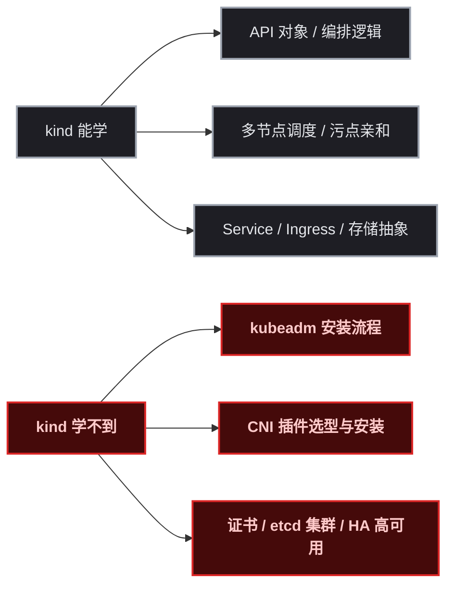
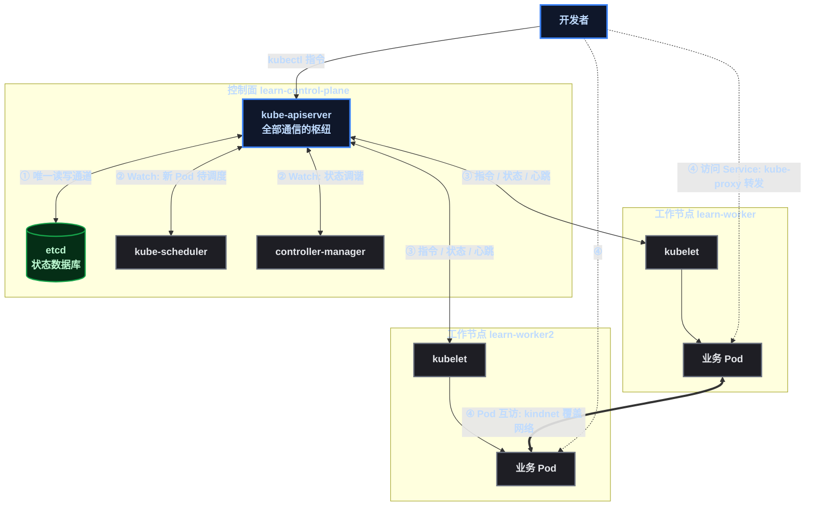
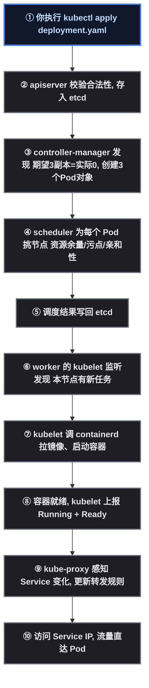
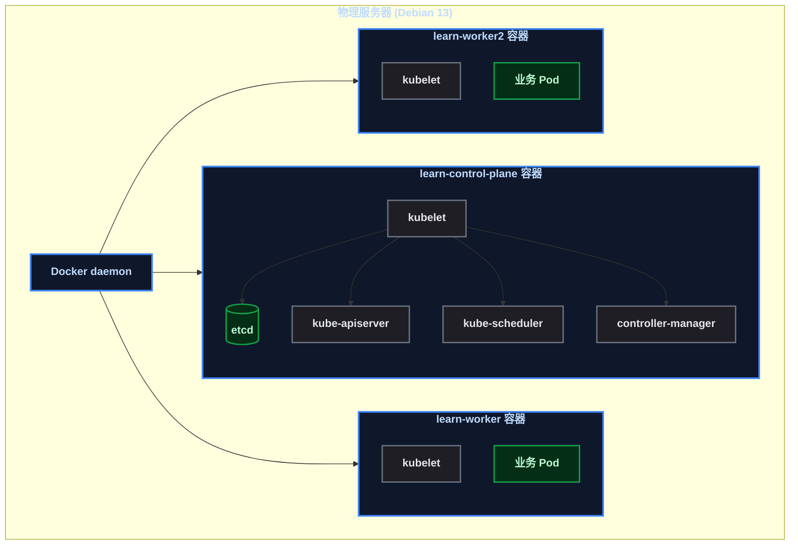
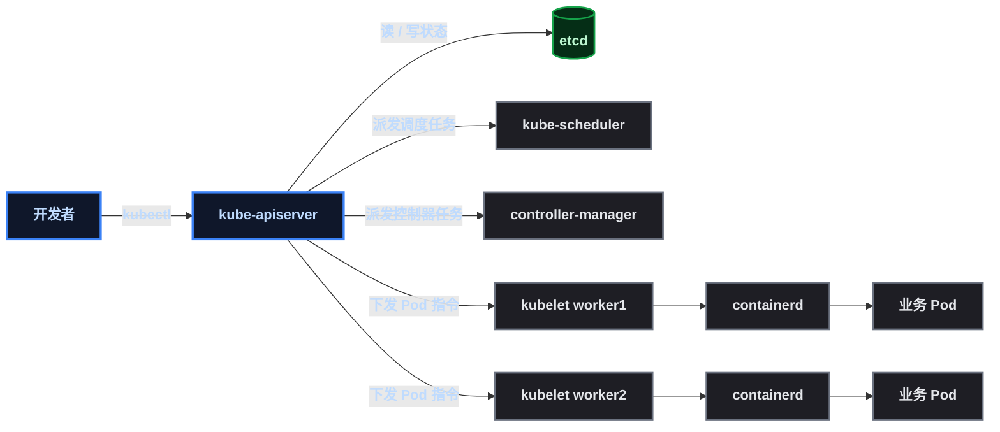
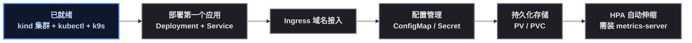

# 一主二从的 K8s，kind 半小时就位

想学 Kubernetes，第一道坎不是概念，是**环境**：三台物理机？买不起。云厂商的托管集群？按小时计费，练手都心疼。直到某开发者把 kind（Kubernetes IN Docker）跑起来——一条命令，一台普通服务器，1 主 2 从三节点集群直接立起来，用完 `kind delete cluster` 一键销毁，成本几乎为零。

这篇文章完整记录这次实操：**硬件要什么配置、国内网络怎么绕过、kind / kubectl / k9s 怎么装、那个 9 行的 YAML 到底在说什么、以及集群里跑起来的每个组件是什么**。跟着走一遍，你也能拥有一套属于自己的 K8s 练手环境。

## 这次要做什么

```
目标：在一台 Linux 服务器上，用 kind 创建一个 1 控制面 + 2 工作节点的 Kubernetes 集群
产出：kind + kubectl + k9s 三件套，集群可通过 kubectl 正常管理
用途：本地化学习 K8s，为日后云 ECS（阿里云等）快速上手打底
```

> 📌 前置知识：需要会用 Linux 基础命令（curl、systemctl、docker）、知道容器是什么。K8s 概念零基础也可以，本文会讲清楚每个装好的组件是干嘛的。

开始之前，先把丑话说在前头——**kind 的边界**：



kind 是**用 Docker 模拟节点**（每个"节点"是一个跑着完整 Linux 的容器），所以它教不会你"怎么在裸机上装出 K8s"——那些是上云前的功课，本文不展开。先把 kind 能教的部分学扎实。

## 先看全局：一主二从的节点们是怎么互相交流的

> 📌 在看后面的安装步骤之前，先花 3 分钟把这张图看懂——它就是这个集群的全部骨架。后面装的东西，全是图里的某个角色。



### 四条通信链路（图里的 ①②③④）

| 链路 | 谁和谁 | 怎么交流 | 特点 |
|---|---|---|---|
| ① 控制面内部 | apiserver ↔ etcd | apiserver 是唯一能读写 etcd 的组件 | 其他组件都不能直接碰 etcd |
| ② 控制面内部 | apiserver ↔ scheduler / controller-manager | Watch（监听）模式：scheduler 盯"没调度的 Pod"，CM 盯"实际 ≠ 期望" | 不主动干活，等变化才响应 |
| ③ 控制面 ↔ 节点 | apiserver ↔ kubelet | kubelet 主动连接 apiserver：接收指令 + 上报状态 + 心跳续租（Lease） | 节点约 40 秒没心跳会被标记 NotReady |
| ④ 数据面 | Pod ↔ Pod、外部 ↔ Service | 不经过控制面！Pod 互访走 kindnet（VXLAN 覆盖网络），Service 流量由 kube-proxy 的 iptables 规则转发 | 业务数据流和控制指令流完全分离 |

> 最直白的一句话原理：**控制面是"大脑"，只管发指令和记状态；数据面是"手脚"，只管跑业务流量。** 大脑和手脚各走各的路——所以 apiserver 就算挂了，已经在跑的 Pod 之间业务流量依然通（只是不能再调度、不能自愈）。

### 一次完整协作：部署 nginx 时全链路发生了什么



注意第 ④ 步：调度器挑中的可能是 learn-worker 也可能是 learn-worker2——这就是多节点的意义，**Pod 跑在哪是调度器根据集群整体资源动态决定的**。部署后可以执行 ` kubectl get pods -o wide ` 看 3 个副本分散在不同节点上，亲眼验证这张图。

## 前置条件

### 硬件：到底要多好的机器？

这是被问得最多的。直接给实测数据——本次用来跑 1 主 2 从的服务器：

| 项目 | 最低建议 | 推荐配置 | 本次实测 |
|---|---|---|---|
| CPU | 2 核 | 4 核 | i3-7100U，4 线程 @2.4GHz |
| 内存 | 4 GB | 8 GB | 7.6 GB（可用 6.2 GB） |
| 磁盘 | 10 GB 空闲 | 20 GB+ | 448 GB（空闲 419 GB） |
| 系统 | Linux + Docker | Debian 12+ / Ubuntu 22.04+ | Debian 13 (trixie)，内核 6.12 |

> ⚠️ 新手提示：内存是硬指标。kind 的每个"节点"不是轻量容器，而是**容器里跑完整 systemd + kubelet**，资源成本如下——控制面节点约 1.5 ~ 2 GB（etcd 最吃内存），工作节点每个约 1 ~ 1.5 GB。1 主 2 从 ≈ 4.5 GB 起步，还要留空间给业务 Pod。

| kind 节点 | 资源成本 | 内部跑了什么 |
|---|---|---|
| control-plane | 约 1.5 ~ 2 GB RAM + 1 核 | etcd + kube-apiserver + kube-scheduler + controller-manager + kubelet + kube-proxy |
| worker ×2 | 每个约 1 ~ 1.5 GB RAM + 1 核 | kubelet + kube-proxy + containerd |

实测结论：**4 核 8 GB 跑 1 主 2 从，流畅**；如果只有 4 GB，建议 1 主 1 从（约 3 GB），学习价值不缩水多少。

### 软件：装之前先确认

```bash
# 验证 Docker 已装且运行中
docker --version          # 本次: Docker version 29.6.2
systemctl is-active docker  # 输出 active
docker compose version    # 本次: v5.3.1（后续部署应用用得上）
```

### 网络：国内环境的关键一步

kind 创建集群要拉镜像（kindest/node，约 1.4 GB），kubectl / k9s 要从 GitHub 下载——国内直连大概率慢或失败。本次服务器上正好跑着一个 mihomo 代理（监听 ` 127.0.0.1:7890 ` ），全部下载走它。

> ⚠️ 新手提示：如果你的机器没有代理，可以先试直连；不行再配代理。代理只影响"拉取"，不影响集群本身运行。

**给 Docker daemon 也配上代理（拉 kindest/node 镜像的关键）**。上面的 `curl -x` 只解决 kind / kubectl 二进制下载；kind 创建集群时 `Ensuring node image` 拉 kindest/node 镜像是 **Docker daemon 发起的请求**——daemon 不认识 curl 的代理参数，要在它自己的配置里单独配（Docker 20.10+ 支持 daemon.json 的 `proxies` 段，本次服务器的真实配置）：

```bash
cat > /etc/docker/daemon.json <<'EOF'
{
  "proxies": {
    "http-proxy": "http://127.0.0.1:7890",
    "https-proxy": "http://127.0.0.1:7890",
    "no-proxy": "127.0.0.0/8,localhost,192.168.0.0/16"
  }
}
EOF
systemctl restart docker
```

验证代理生效：

```bash
docker info | grep -i proxy
# HTTP Proxy: http://127.0.0.1:7890
# HTTPS Proxy: http://127.0.0.1:7890
# No Proxy: 127.0.0.0/8,localhost,192.168.0.0/16
```

两个容易误解的点：

1. **daemon 代理只管"daemon 自己发起的请求"**（docker pull / build 拉镜像）；kind 节点容器运行起来后是容器自己的网络（直连），不走 daemon 代理——好在 kindest/node 镜像预装了 K8s 组件镜像（见 1.5 节），节点内 kubeadm init 不需要联网拉组件，所以**节点容器不需要代理配置**，代理只服务于"拉镜像"这一下；
2. 如果 daemon.json 里已有其他配置（存储驱动、镜像加速等），要**合并**而不是整文件覆盖——先 `cat /etc/docker/daemon.json` 看现状再改。

> ⚠️ 新手提示： ` systemctl restart docker ` 会重启所有容器——纯学习环境无所谓，但机器上若有正在跑的容器（比如生产服务器），先确认再动手。

## 第1步：安装 kind

kind 就一个二进制，下载、校验、放 `/usr/local/bin` 完事：

```bash
# 1. 下载（走代理；无代理就去掉 -x 参数）
curl -x http://127.0.0.1:7890 -sL -m 120 -o /tmp/kind \
  https://kind.sigs.k8s.io/dl/v0.32.0/kind-linux-amd64

# 2. 校验 SHA256（防止下载到被篡改的文件）
#    官方校验值: https://kind.sigs.k8s.io/dl/v0.32.0/kind-linux-amd64.sha256sum
EXPECTED=50030de23cf40a18505f20426f6a8506bedf13c6e509244bd1fa9463721b0f54
ACTUAL=$(sha256sum /tmp/kind | awk '{print $1}')
[ "$EXPECTED" = "$ACTUAL" ] && echo "✅ SHA256 校验通过"

# 3. 安装到 PATH
chmod +x /tmp/kind && mv /tmp/kind /usr/local/bin/kind

# 4. 验证
kind version   # 输出: kind v0.32.0 go1.26.3 linux/amd64
```

> ⚠️ 新手提示：踩过的坑有两个。一是 ` sha256sum -c ` 会按校验文件里写的文件名（ ` kind-linux-amd64 ` ）去找文件，你下载时如果改名存成 ` kind ` ，它会报 ` FAILED open or read ` ——所以直接对比哈希值最省事。二是 ` /usr/local/bin ` 目录属于 root，普通用户没写权限；服务器上用 root 执行没问题，在 WSL2 里就得 ` sudo ` 或者 ` wsl -d Debian -u root ` 免密以 root 执行。

## 第2步：安装 kubectl

kubectl 是操作集群的"遥控器"（命令行客户端），同样一个二进制：

```bash
# 1. 查询当前稳定版本号（走代理）
V=$(curl -x http://127.0.0.1:7890 -sL -m 30 https://dl.k8s.io/release/stable.txt)
echo $V    # 本次: v1.36.4

# 2. 下载对应版本
curl -x http://127.0.0.1:7890 -sL -m 180 -o /usr/local/bin/kubectl \
  https://dl.k8s.io/release/$V/bin/linux/amd64/kubectl
chmod +x /usr/local/bin/kubectl

# 3. 验证
kubectl version --client   # 输出: Client Version: v1.36.4
```

> 📌 前置知识：kubectl 只是客户端，连不上集群也能打印版本。集群本身是 kind 创建的，kubectl 的"连接配置"（kubeconfig）由 kind 自动生成并写进 ` ~/.kube/config ` ，这一步后面会自动发生。

## 第3步：编写集群配置文件

kind 支持命令行直接 ` kind create cluster ` （默认单节点），但多节点集群要用配置文件。本次的 ` kind-config.yaml ` ，全文 9 行：

```yaml
# kind 学习集群配置: 1 control-plane + 2 worker
# 用法: kind create cluster --name learn --config kind-config.yaml
kind: Cluster
apiVersion: kind.x-k8s.io/v1alpha4
name: learn
nodes:
  - role: control-plane
  - role: worker
  - role: worker
```

逐行拆解：

| 字段 | 含义 | 备注 |
|---|---|---|
| `kind: Cluster` | 告诉 kind 这是集群定义文件 | 固定写法 |
| `apiVersion: kind.x-k8s.io/v1alpha4` | kind 配置文件的 API 版本 | 跟随 kind 版本，照抄即可 |
| ` name: learn ` | 集群名字 | 会作为前缀出现在容器名上（ ` learn-control-plane ` ） |
| `nodes:` | 节点列表，一个 `- role` 就是一个节点 | **想加节点就复制一行 `- role: worker`** |

> ⚠️ 新手提示：这就是 kind 多节点"贵"在哪的源头——每个 `role` 都会变成一个跑完整 systemd 的容器。想验证"单节点够不够学"，把 `nodes` 删到只剩 control-plane 即可，改完重建集群只要几分钟。

## 第4步：创建一主二从集群

```bash
kind create cluster --name learn --config /root/kind-config.yaml
```

预期输出（每个 ✓ 都是一大堆初始化工作）：

```
Creating cluster "learn" ...
 • Ensuring node image (kindest/node:v1.36.1) 🖼  ...      # 拉镜像, 首次约 1.4GB, 最耗时
 ✓ Ensuring node image (kindest/node:v1.36.1) 🖼
 • Preparing nodes 📦 📦 📦   ...
 ✓ Preparing nodes 📦 📦 📦                               # 创建 3 个节点容器
 • Writing configuration 📜  ...
 ✓ Writing configuration 📜
 • Starting control-plane 🕹️  ...
 ✓ Starting control-plane 🕹️                             # kubeadm init: etcd + apiserver 等
 • Installing CNI 🔌  ...
 ✓ Installing CNI 🔌                                      # 装网络插件 kindnet
 • Installing StorageClass 💾  ...
 ✓ Installing StorageClass 💾                             # 装 local-path 存储类
 • Joining worker nodes 🚜  ...
 ✓ Joining worker nodes 🚜                                # 两个 worker 执行 kubeadm join
Set kubectl context to "kind-learn"                       # 自动切换 kubeconfig 上下文
```

> ⚠️ 新手提示：镜像拉取是唯一可能卡很久的环节（首次 1.4 GB 走代理约几分钟）。如果中途失败，多半是网络问题，配好代理重跑即可——kind 会复用已拉好的镜像层，不是从头再来。

## 第5步：验证集群

```bash
kubectl get nodes -o wide
```

预期输出：三个节点全部 ` Ready ` ：

```
NAME                  STATUS   ROLES           AGE   VERSION   INTERNAL-IP   OS-IMAGE                      CONTAINER-RUNTIME
learn-control-plane   Ready    control-plane   56s   v1.36.1   172.18.0.2    Debian GNU/Linux 13 (trixie)   containerd://2.3.1
learn-worker          Ready    <none>          38s   v1.36.1   172.18.0.3    Debian GNU/Linux 13 (trixie)   containerd://2.3.1
learn-worker2         Ready    <none>          38s   v1.36.1   172.18.0.4    Debian GNU/Linux 13 (trixie)   containerd://2.3.1
```

> ⚠️ 新手提示：刚创建完立刻 ` kubectl get nodes ` ，看到的很可能是 ` NotReady ` ——**这是正常的**。CNI 网络插件（kindnet）还在各个节点上启动，等 30 秒左右再查就全 ` Ready ` 了。别急着删集群重来，先喝口水。

再确认集群内部组件与健康状态：

```bash
kubectl get pods -A        # 看 kube-system 里的核心组件
kubectl get sc             # 看 StorageClass（本次: standard, local-path 提供者）
kubectl get cs             # 控制面健康检查: scheduler / controller-manager / etcd 全部 ok
kubectl cluster-info       # 显示 API Server 地址（本次: https://127.0.0.1:36513）
```

## 第6步：安装 k9s（可选但推荐）

k9s 是 K8s 的终端 UI——不用记一堆命令，用键盘就能浏览 Pod、看日志、进容器。下载包里有多个文件，只解压需要的二进制：

```bash
curl -x http://127.0.0.1:7890 -sL -m 120 -o /tmp/k9s.tar.gz \
  https://github.com/derailed/k9s/releases/latest/download/k9s_Linux_amd64.tar.gz
tar -xzf /tmp/k9s.tar.gz k9s
mv k9s /usr/local/bin/k9s && chmod +x /usr/local/bin/k9s
k9s version    # 本次: v0.51.0
```

> ⚠️ 新手提示：k9s 的 ` checksums.txt ` 下载地址会 302 重定向到 GitHub 文件服务器， ` curl ` 不带 ` -L ` 会只存到一段跳转提示文本， ` sha256sum -c ` 自然报错。要么加 ` -L ` ，要么干脆跳过校验（二进制来自官方 releases，风险可控）。

使用：直接敲 ` k9s ` 进入界面，按 ` 0 ` 查看所有命名空间，回车进入 Pod 列表， ` l ` 看日志， ` s ` 进 Shell。

## 核心概念：装好的这些东西到底是什么

### 1. kind 的"容器即节点"原理

kind 最反直觉的地方：**集群的"节点"不是虚拟机，也不是裸机，而是 Docker 容器**。但每个容器里跑的不是单个进程，而是一整套 Linux 环境：



每个节点容器内部：**systemd 作为 init 系统** → 拉起 **kubelet**（节点代理）→ kubelet 再通过 **containerd**（容器运行时）管理本节点的 Pod。控制面节点容器里，etcd、kube-apiserver 这些组件以"静态 Pod"的形式由 kubelet 直接托管。

这就是为什么 kind 节点"重"：一个容器内跑了一整台最小 Linux。这也是 kind 能"以假乱真"的原因——**kubelet 视角里，它管理的就是一个真实节点**，调度、污点、驱逐这些机制全部真实生效。

### 1.5 为什么第二次创建集群快得多

第一次 `kind create cluster` 会卡在 `Ensuring node image` 好一会儿（拉取 kindest/node 镜像，几百 MB）；第二次创建同一个镜像的集群时，这一步**秒过**。这不是 kind 开挂了，是三层机制叠加：

**第一层：宿主机 Docker 镜像缓存（最主要）**。kindest/node 就是标准 Docker 镜像——第一次 create 时 ` docker pull ` 到本地，第二次 create kind 检查本地已存在（ ` docker image inspect ` 命中），直接复用，**零网络下载**。"Ensuring node image" 从"拉几百 MB"变成"检查命中"。

**第二层：镜像分层复用**。即使以后 kindest/node 更新了版本，Docker 按层存储（content-addressable）——公共基础层（Debian 层）不重拉，只拉差异层，更新成本也远低于全量。

**第三层：node image 预装一切的设计（kind 快的根本）**。kindest/node 镜像在构建时就已经打包好了 systemd + containerd + kubelet + kubeadm + crictl，并且**预加载了 K8s 组件镜像**（kube-apiserver、etcd、coredns、pause 等，构建时导入镜像层）。所以 `kind create` 只是"把预装好的容器跑起来 + 本地跑一遍 kubeadm init"——**全程没有联网拉组件的环节**，几十秒完成。

对比传统 kubeadm 安装你就明白差距在哪：裸机要先装 docker + kubeadm + kubelet，然后 `kubeadm init` 时**联网拉取 apiserver/etcd/coredns 等一堆组件镜像**（国内还要配代理）；kind 把这些耗时**前置到镜像构建阶段（一次性）**，使用者拿到的是"开箱即装"的节点镜像。

一句话：**kind 把"装 K8s"的耗时全部前置进镜像，create 只是把容器跑起来**；第二次快，则是因为连"拉镜像"这一步都被本地缓存跳过了。

### 2. 控制面与工作节点如何分工

K8s 集群就两类角色，理解这一张图就抓住了 K8s 的主干：



| 组件 | 位置 | 一句话职责 |
|---|---|---|
| kube-apiserver | 控制面 | 所有操作（kubectl 命令）的唯一入口，K8s 的"门卫+收发室" |
| etcd | 控制面 | 整个集群的"唯一真相"数据库，所有资源状态都存在这里 |
| kube-scheduler | 控制面 | 决定新 Pod 放哪个节点（看资源、看污点亲和） |
| controller-manager | 控制面 | 保证"期望状态"：副本少了补、Pod 挂了重启 |
| kubelet | 每个节点 | 节点代理，执行 apiserver 下发的指令，管本节点的 Pod |
| kube-proxy | 每个节点 | 实现 Service 的流量转发规则 |
| kindnet | 每个节点 | CNI（Container Network Interface，容器网络接口）插件，打通 Pod 间网络 |
| coredns | 集群内 | 集群 DNS，让 `mysql.default.svc` 这种域名可解析 |

> 📌 顺带说清两个常见词：**kubeconfig** 是 kubectl 的连接凭据文件（ ` ~/.kube/config ` ），kind 创建完集群会自动写好并切换 context（ ` kind-learn ` ）；**StorageClass** 是"存储模板"，本次装的是 local-path 提供者，让 PVC 能动态创建本地磁盘卷，学持久化存储时就用它。

## 总结与下一步

### 本次踩坑速查

| 坑 | 现象 | 解法 |
|---|---|---|
| 镜像拉不动 | 建集群卡在 Ensuring node image | Docker daemon 配代理（daemon.json 的 proxies 段），重启 docker |
| SHA256 校验失败 | `sha256sum -c` 报 FAILED open | 校验文件里的文件名和你存的文件名不一致，直接比对哈希值 |
| 节点 NotReady | 刚建完所有节点 NotReady | 正常，CNI 还在初始化，等 30 秒 |
| /usr/local/bin 无权限 | 普通用户 mv 被拒 | root 执行，或 WSL2 用 `wsl -d Debian -u root` |
| **inotify 实例耗尽** | 已有集群常驻时，**建第二个集群**报 ` could not find a log line that matches "Reached target..." ` | 提高 ` fs.inotify.max_user_instances ` （见下方详解） |

### 踩坑详解：inotify 实例耗尽——多集群同跑的隐形冲突

这篇博客原本到此为止，但实际使用一段时间后，我在"不删旧集群、再建一个新集群"的场景里踩了一个隐蔽的坑，值得单独记录——它和"多集群同跑"强相关，早晚会撞上。

**场景**：第一个集群 ` learn ` （一主二从）已经常驻运行，想在它旁边再建一个集群做演示（ ` kind create cluster --name learnbyself --config kind-config-learn.yaml ` ）。

**症状一（kind 侧）**：建集群卡在 Preparing nodes，然后报：

```text
✗ Preparing nodes 📦 📦 📦
ERROR: failed to create cluster: could not find a log line that matches "Reached target .*Multi-User System.*|detected cgroup v1"
```

这个报错的字面意思是"等了很久，没等到节点内的 systemd 启动完成的日志"——kind 认为节点没起来。但光看它不知道 systemd 为什么没起来。

**症状二（容器侧，关键）**：用 ` --retain ` 重试让失败的节点容器保留下来， ` docker logs learnbyself-control-plane ` 看到真相：

```text
INFO: starting init
systemd 257 running in system mode
Welcome to Debian GNU/Linux 13 (trixie)!
Failed to create control group inotify object: Too many open files
Failed to allocate manager object: Too many open files
[!!!!!!] Failed to allocate manager object.
Exiting PID 1...
```

**systemd 在容器里启动时挂了**：它需要创建一个 inotify 对象来监听 cgroup 变化（"control group inotify object"），创建失败，直接放弃启动——PID 1 退出，节点容器等于没起来，kind 自然等不到就绪日志。

**排查过程**（从表象到根因）：

1. 先排除配置和镜像——同样一份配置第一个集群建得好好的，镜像也是同一个 ` kindest/node:v1.36.1 ` ；
2. 看残留容器日志定位到 systemd 的 fd 报错；
3. 查系统文件描述符总量： ` cat /proc/sys/fs/file-nr ` 显示 3671（远低于上限）——**排除"文件描述符总数耗尽"**；
4. 怀疑对象转向 inotify（内核的"文件系统事件通知"机制，systemd 依赖它监听 cgroup）：
   - 上限： ` sysctl fs.inotify.max_user_instances ` → **128**
   - 当前占用： ` find /proc/[0-9]*/fd -lname "anon_inode:inotify" 2>/dev/null | wc -l ` → **137**
   - **占用 137 > 上限 128，实锤**。

**原理**：内核按**每用户**限制 inotify 实例数（默认 128），而容器里的 root 进程和宿主机 root 是同一个 uid——第一个集群跑起来后，3 个节点的 systemd / containerd / kubelet / apiserver 各自持有 inotify 实例，已经吃掉 137 个；第二个集群的 systemd 再创建就超限，被内核拒绝。

**解决**：提高上限即可，一行命令即时生效，**无需重启 docker、无需动第一个集群**：

```bash
sysctl -w fs.inotify.max_user_instances=1024
echo "fs.inotify.max_user_instances=1024" > /etc/sysctl.d/99-inotify.conf   # 永久生效
```

改完重试 ` kind create cluster ` ，秒过。

**启示**：学习环境"不删旧集群、另起新集群"（演示、对比、练手）是刚需，inotify 额度是第一个会撞的隐形墙——单集群永远碰不到，双集群必现。提前调大（1024 够用）或控制常驻容器数量，可以免踩。排查这个坑的过程本身也值得记住：**kind 报"等不到 systemd 日志"时，别盯着 kind 看，用 `--retain` + `docker logs` 直接看节点容器里 systemd 说了什么**——真相永远在日志里。

### 下一步学什么



集群里目前只有 K8s 自身的骨架（kube-system 命名空间），还没有任何业务应用——下一步就是部署第一个 Deployment，把"镜像 → Pod → Service → 访问"这条链路亲手打通。建议跟着"部署一个 3 副本 nginx"走一遍，你会亲眼看到它被调度到两个 worker 节点上，那一刻对"集群"的理解才算真正落地。

本文所有步骤均在一台真实 Linux 服务器上实测通过（kind v0.32.0 / Kubernetes v1.36.1 / kubectl v1.36.4 / k9s v0.51.0）。有问题欢迎评论区交流。
