# ☸️ 从 Docker Compose 到 Kind：在 WSL 上用 Kind 入门 Kubernetes 全指南

## 📌 一、问题切入：你已经会用 Docker Compose，然后呢

假设你在 WSL（Windows Subsystem for Linux，Windows 内置的 Linux 子系统）上维护着一个项目， `docker-compose.yml` 里定义了 nginx、应用服务、Redis、MySQL 四个容器：

```yaml
version: "3.8"
services:
  nginx:
    image: nginx:1.25
    ports: ["80:80"]
    volumes: ["./nginx.conf:/etc/nginx/nginx.conf:ro"]
  app:
    build: ./app
    ports: ["5000:5000"]
    environment:
      REDIS_HOST: redis
      MYSQL_HOST: mysql
    depends_on: [redis, mysql]
  redis:
    image: redis:7-alpine
  mysql:
    image: mysql:8
    environment:
      MYSQL_ROOT_PASSWORD: secret
```

`docker compose up -d` 一键启动。但当你需要面对以下需求时，Compose 开始显得吃力：

- 应用服务需要根据 CPU 负载 **自动扩缩容** （高峰期 5 个副本，低峰 1 个）
- 某个副本挂了需要 **自动重启 + 流量自动切走**
- 需要 **滚动更新** （逐个替换旧版本容器，不中断服务）
- 多个项目共享同一个 Redis 集群，需要 **配置统一管理**

这些问题就是 Kubernetes（简称 K8s，容器编排平台）解决的领域。但 K8s 的学习曲线出了名的陡峭——minikube 要装虚拟机、k3s 有多余的 systemd 依赖、Docker Desktop 收费。 **Kind（Kubernetes in Docker）** 就是最适合新手在本地入门 K8s 的工具。

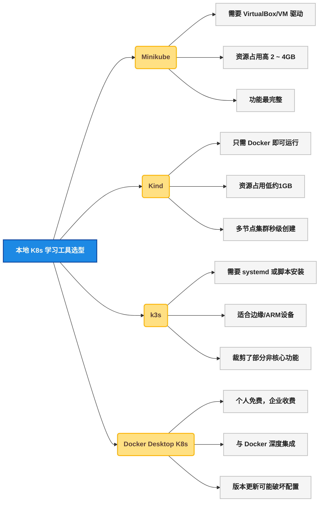

### 🛠️ 1.1 Kind 解决了什么

Kind 的原理很简单： **它把 K8s 的每个节点（control-plane / worker）都跑在 Docker 容器里。** 你本机安装了 Docker，Kind 就用 Docker 容器模拟一个完整的 K8s 集群。

核心优势：

- **零额外依赖** ：只要本机有 Docker，就能跑 Kind
- **多节点** ：一个命令创建 1 个 control-plane + 3 个 worker 的集群
- **秒级创建/销毁** ： `kind create cluster` 约 30 秒完成， `kind delete cluster` 瞬间清理
- **与 WSL 深度兼容** ：WSL 2 自带 Linux 内核 + Docker 支持，Kind 运行体验接近原生 Linux

## 🔍 二、环境准备：在 WSL 上安装 Kind

### 🛠️ 2.1 前置条件

| 组件 | 最低版本 | 作用 |
|------|:---:|------|
| **WSL** | WSL 2 | 提供 Linux 内核，容器运行的基础 |
| **Docker** | 24.0+ | 运行 Kind 创建的节点容器 |
| **kubectl** | 1.28+ | 与 K8s 集群交互的命令行工具 |
| **Kind** | 0.20+ | 创建和管理本地 K8s 集群 |

**步骤一：确认 WSL 版本**

```bash
wsl --version
#  预期输出：WSL 版本 2.x.x
```

如果是 WSL 1，执行升级：

```bash
wsl --update
wsl --set-default-version 2
```

**步骤二：在 WSL 内安装 Docker**

Kind 依赖 Docker 运行节点容器。在 WSL 终端（Ubuntu/Debian）内执行：

```bash
#  卸载旧版本（如果有）
sudo apt remove docker docker-engine docker.io containerd runc

#  安装依赖
sudo apt update
sudo apt install -y ca-certificates curl gnupg

#  添加 Docker 官方 GPG 密钥
sudo install -m 0755 -d /etc/apt/keyrings
curl -fsSL https://download.docker.com/linux/ubuntu/gpg | sudo gpg --dearmor -o /etc/apt/keyrings/docker.gpg

#  添加 Docker APT 源
echo "deb [arch=$(dpkg --print-architecture) signed-by=/etc/apt/keyrings/docker.gpg] \
  https://download.docker.com/linux/ubuntu $(lsb_release -cs) stable" | \
  sudo tee /etc/apt/sources.list.d/docker.list > /dev/null

#  安装 Docker
sudo apt update
sudo apt install -y docker-ce docker-ce-cli containerd.io

#  将当前用户加入 docker 组（避免每次都要 sudo）
sudo usermod -aG docker $USER
```

重新打开 WSL 终端使 `docker` 组生效，验证安装：

```bash
docker run --rm hello-world
#  预期输出：Hello from Docker!
```

**步骤三：安装 kubectl**

```bash
curl -LO "https://dl.k8s.io/release/$(curl -L -s https://dl.k8s.io/release/stable.txt)/bin/linux/amd64/kubectl"
sudo install -o root -g root -m 0755 kubectl /usr/local/bin/kubectl
rm kubectl
kubectl version --client
#  预期输出：Client Version: v1.28.x
```

**步骤四：安装 Kind**

```bash
[ $(uname -m) = x86_64 ] && curl -Lo ./kind https://kind.sigs.k8s.io/dl/v0.24.0/kind-linux-amd64
chmod +x ./kind
sudo mv ./kind /usr/local/bin/kind
kind version
#  预期输出：kind v0.24.0
```

### 🛠️ 2.2 安装全流程一览

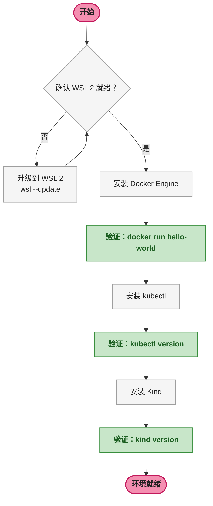

## ⚙️ 三、第一个 Kind 集群

### 🖥️ 3.1 创建单节点集群

```bash
kind create cluster --name my-first-cluster
```

Kind 默认行为：
1. 拉取 `kindest/node` 镜像（约 500MB，含 K8s 核心二进制 + containerd）
2. 启动一个 Docker 容器作为 K8s 节点（control-plane 角色）
3. 在容器内初始化 K8s 控制面组件（kube-apiserver / controller-manager / scheduler / etcd）
4. 将 `kubectl` 的 kubeconfig 指向新集群

```bash
#  查看集群状态
kubectl cluster-info
#  预期输出：
#  Kubernetes control plane is running at https://127.0.0.1:xxxxx
#  CoreDNS is running at https://127.0.0.1:xxxxx/api/v1/...

kubectl get nodes
#  NAME                               STATUS   ROLES           AGE   VERSION
#  my-first-cluster-control-plane     Ready    control-plane   30s   v1.28.x
```

### 🖥️ 3.2 创建多节点集群（模拟生产环境）

单节点只能学基本概念。多节点才能体验调度（Scheduling）、污点容忍（Taint/Toleration）、跨节点服务发现等高级特性。

创建 `kind-config.yaml` ：

```yaml
kind: Cluster
apiVersion: kind.x-k8s.io/v1alpha4
nodes:
  - role: control-plane
  - role: worker
  - role: worker
  - role: worker
```

```bash
kind create cluster --name multi-node --config kind-config.yaml

#  验证多节点
kubectl get nodes
#  NAME                      STATUS   ROLES           AGE   VERSION
#  multi-node-control-plane  Ready    control-plane   45s   v1.28.x
#  multi-node-worker         Ready    <none>          30s   v1.28.x
#  multi-node-worker2        Ready    <none>          28s   v1.28.x
#  multi-node-worker3        Ready    <none>          25s   v1.28.x
```

### 📦 3.3 Kind 节点容器的真面目

Kind 的每个"节点"本质上就是一个 Docker 容器。可以切换到 `multi-node` 集群后查看：

```bash
docker ps --format "table {{.Names}}\t{{.Image}}\t{{.Status}}"
#  预期输出：
#  NAMES                         IMAGE                    STATUS
#  multi-node-control-plane      kindest/node:v1.28.0     Up 2 minutes
#  multi-node-worker             kindest/node:v1.28.0     Up 2 minutes
#  multi-node-worker2            kindest/node:v1.28.0     Up 2 minutes
#  multi-node-worker3            kindest/node:v1.28.0     Up 2 minutes
```

**这就是 Kind 区别于 minikube 的核心设计** ：不引入虚拟机，直接用 Docker 容器模拟 K8s 节点。每个容器内部跑了 containerd（容器运行时）、kubelet（节点代理）、以及对应角色的 K8s 组件。

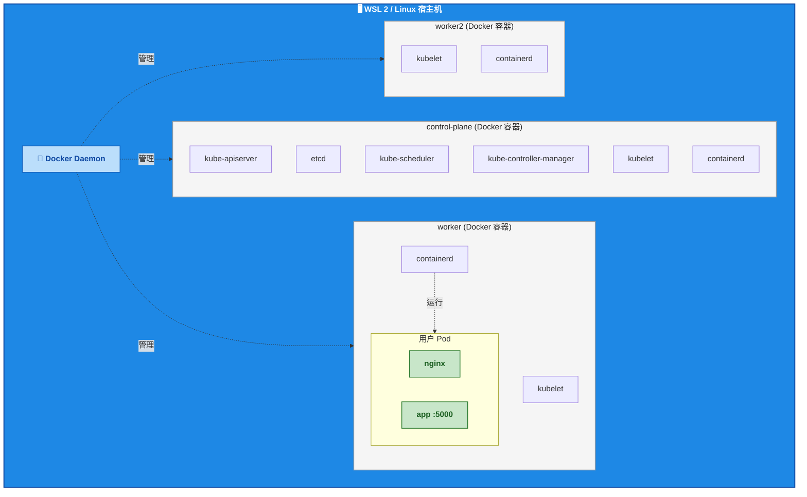

## 📊 四、K8s 核心概念：用 Kind 逐个验证

K8s 有几十种资源类型，但新手只需要掌握 8 个核心概念就能完成 80% 的工作，这些概念在任何云厂商的 K8s 服务中完全通用：

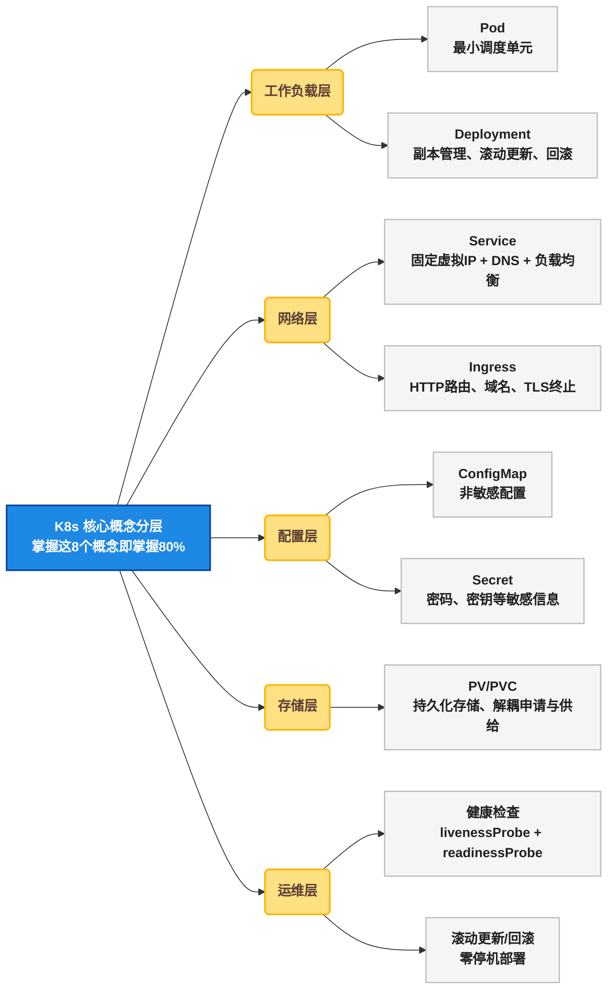

### 📦 4.1 Pod（容器组）

Pod 是 K8s 的最小调度单元（K8s 中最小的可部署单位）。一个 Pod 可以包含 1 个或多个共享网络和 IPC 的容器。

**与 Docker Compose 的类比** ：Docker Compose 中每个 `services` 下的条目是一个独立容器。K8s 中 Pod 是容器的"包装"，大多数情况下一个 Pod 只跑一个容器（与应用服务一一对应）。

创建 `pod-nginx.yaml` ：

```yaml
apiVersion: v1
kind: Pod
metadata:
  name: nginx-pod
  labels:
    app: nginx
spec:
  containers:
    - name: nginx
      image: nginx:1.25
      ports:
        - containerPort: 80
```

应用并验证：

```bash
kubectl apply -f pod-nginx.yaml
kubectl get pods
#  NAME        READY   STATUS    RESTARTS   AGE
#  nginx-pod   1/1     Running   0          10s

kubectl describe pod nginx-pod  # 查看 Pod 详细信息
kubectl logs nginx-pod          # 查看容器日志
kubectl exec -it nginx-pod -- /bin/bash  # 进入容器
```

### 🔄 4.2 Deployment（部署）

Deployment 管理 Pod 的副本数量、声明式更新和回滚。 **它是比裸 Pod 更高一层的抽象** ——你不会在生产环境直接创建 Pod，而是创建 Deployment，让 Deployment 管理 Pod。

创建 `deployment-nginx.yaml` ：

```yaml
apiVersion: apps/v1
kind: Deployment
metadata:
  name: nginx-deploy
spec:
  replicas: 3
  selector:
    matchLabels:
      app: nginx
  template:
    metadata:
      labels:
        app: nginx
    spec:
      containers:
        - name: nginx
          image: nginx:1.25
          ports:
            - containerPort: 80
```

验证核心能力：

```bash
kubectl apply -f deployment-nginx.yaml

#  1. 副本数管理——自动创建了 3 个 Pod
kubectl get pods -l app=nginx
#  NAME                            READY   STATUS    RESTARTS   AGE
#  nginx-deploy-5d4b8c7f9-abc12   1/1     Running   0          20s
#  nginx-deploy-5d4b8c7f9-def34   1/1     Running   0          20s
#  nginx-deploy-5d4b8c7f9-ghi56   1/1     Running   0          20s

#  2. 自愈能力——手动删除一个 Pod，Deployment 立即重建
kubectl delete pod nginx-deploy-5d4b8c7f9-abc12
kubectl get pods -l app=nginx  # 立即看到新 Pod 被创建

#  3. 滚动更新——更新镜像版本，逐个替换 Pod
kubectl set image deployment/nginx-deploy nginx=nginx:1.26
kubectl rollout status deployment/nginx-deploy

#  4. 回滚——更新失败了可以回退
kubectl rollout undo deployment/nginx-deploy
```

### 🌐 4.3 Service（服务发现 + 负载均衡）

Pod 的 IP 会随着 Pod 的重建而变化（Pod 被删除再重建时，IP 会改变）。Service 为一组 Pod 提供 **固定的虚拟 IP（ClusterIP）和 DNS 名称** ，并自动做负载均衡。

创建 `service-nginx.yaml` ：

```yaml
apiVersion: v1
kind: Service
metadata:
  name: nginx-svc
spec:
  selector:
    app: nginx
  ports:
    - port: 80
      targetPort: 80
  type: ClusterIP
```

验证：

```bash
kubectl apply -f service-nginx.yaml

kubectl get svc nginx-svc
#  NAME         TYPE        CLUSTER-IP      EXTERNAL-IP   PORT(S)   AGE
#  nginx-svc    ClusterIP   10.96.123.45    <none>        80/TCP    5s

#  从集群内部访问（通过临时 Pod 测试）
kubectl run test --rm -it --image=busybox -- wget -qO- http://nginx-svc
#  预期输出：nginx 欢迎页 HTML
```

**关键点** ： `selector: app: nginx` 告诉 Service"把流量转发到所有带 `app: nginx` 标签的 Pod"。Service 用 Label Selector（标签选择器）关联 Pod，而不是硬编码 IP。

### 🔐 4.4 ConfigMap + Secret（配置管理）

Docker Compose 中，环境变量直接写在 `docker-compose.yml` 的 `environment` 字段下。在 K8s 中，配置被抽取到 ConfigMap 和 Secret 中，Pod 通过环境变量或挂载文件引用。

创建 `configmap-app.yaml` ：

```yaml
apiVersion: v1
kind: ConfigMap
metadata:
  name: app-config
data:
  REDIS_HOST: "redis-svc"
  MYSQL_HOST: "mysql-svc"
  LOG_LEVEL: "debug"
---
apiVersion: v1
kind: Secret
metadata:
  name: app-secret
type: Opaque
stringData:
  MYSQL_PASSWORD: "secret123"
  REDIS_PASSWORD: ""
```

创建引用 ConfigMap 和 Secret 的 Deployment：

```yaml
apiVersion: apps/v1
kind: Deployment
metadata:
  name: app-with-config
spec:
  replicas: 1
  selector:
    matchLabels:
      app: myapp
  template:
    metadata:
      labels:
        app: myapp
    spec:
      containers:
        - name: app
          image: myapp:latest
          envFrom:
            - configMapRef:
                name: app-config
            - secretRef:
                name: app-secret
```

```bash
kubectl apply -f configmap-app.yaml
kubectl get configmap app-config
kubectl get secret app-secret
kubectl describe configmap app-config  # 查看配置内容
```

### 🚪 4.5 Ingress（HTTP 路由 + 域名）

Service 的 `ClusterIP` 只在集群内部可达， `NodePort` 需要占用宿主机端口（30000 ~ 32767）且不支持域名路由。 **Ingress 是 K8s 原生的七层负载均衡** ，提供 HTTP/HTTPS 路由、基于域名的虚拟主机、TLS 终止。

Kind 需要额外安装 Ingress 控制器。推荐 `ingress-nginx` （一个基于 Nginx 的 Ingress Controller）：

```bash
#  在 Kind 集群上部署 ingress-nginx（预配置 Kind 兼容的 NodePort）
kubectl apply -f https://raw.githubusercontent.com/kubernetes/ingress-nginx/main/deploy/static/provider/kind/deploy.yaml

#  等待就绪
kubectl wait --namespace ingress-nginx \
  --for=condition=ready pod \
  --selector=app.kubernetes.io/component=controller \
  --timeout=120s
```

创建 `ingress-app.yaml` ：

```yaml
apiVersion: networking.k8s.io/v1
kind: Ingress
metadata:
  name: app-ingress
  annotations:
    nginx.ingress.kubernetes.io/rewrite-target: /
spec:
  ingressClassName: nginx
  rules:
    - host: app.local
      http:
        paths:
          - path: /
            pathType: Prefix
            backend:
              service:
                name: app-svc
                port:
                  number: 5000
    - host: api.app.local
      http:
        paths:
          - path: /api
            pathType: Prefix
            backend:
              service:
                name: app-svc
                port:
                  number: 5000
```

验证（在 WSL 终端内测试，或配 hosts 文件）：

```bash
kubectl apply -f ingress-app.yaml
kubectl get ingress
#  NAME          CLASS   HOSTS                    ADDRESS      PORTS
#  app-ingress   nginx   app.local,api.app.local  localhost    80

#  测试 Ingress 路由
curl -H "Host: app.local" http://localhost/
curl -H "Host: api.app.local" http://localhost/api
```

**Ingress 解决了 Service 无法做到的事** ：同一个 80 端口，通过 `Host` 头路由到不同的后端服务或路径。生产环境中，Ingress Controller 通常对接云厂商的 LoadBalancer，自动创建公网 IP。

### 💾 4.6 PV/PVC（持久化存储）

**Pod 重启，容器内的数据就没了——这是设计如此。** 要持久化数据（比如 MySQL 的数据文件），需要 PV（PersistentVolume，集群级别的存储资源）和 PVC（PersistentVolumeClaim，用户对存储的申请）。

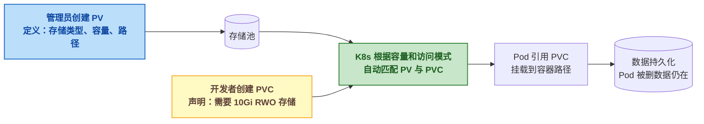

在 Kind 中演示 PV/PVC。创建 `pv-mysql.yaml` ：

```yaml
---
#  存储管理员：创建 PV
apiVersion: v1
kind: PersistentVolume
metadata:
  name: mysql-pv
spec:
  capacity:
    storage: 1Gi
  accessModes:
    - ReadWriteOnce
  persistentVolumeReclaimPolicy: Retain
  hostPath:
    path: /data/mysql   # Kind 节点容器内的路径
---
#  开发者：创建 PVC，声明需要 1Gi
apiVersion: v1
kind: PersistentVolumeClaim
metadata:
  name: mysql-pvc
spec:
  accessModes:
    - ReadWriteOnce
  resources:
    requests:
      storage: 1Gi
```

在 Deployment 中引用 PVC（替换之前的 `hostPath` 临时方案）：

```yaml
spec:
  containers:
    - name: mysql
      image: mysql:8
      volumeMounts:
        - name: mysql-data
          mountPath: /var/lib/mysql
  volumes:
    - name: mysql-data
      persistentVolumeClaim:
        claimName: mysql-pvc
```

验证持久化：

```bash
kubectl apply -f pv-mysql.yaml
kubectl get pv   # STATUS: Bound——PVC 已自动绑定 PV
kubectl get pvc  # STATUS: Bound

#  验证数据不丢：写数据 → 删 Pod → 新 Pod 自动创建 → 数据还在
kubectl exec -it mysql-xxx -- mysql -e "CREATE DATABASE testdb;"
kubectl delete pod mysql-xxx
kubectl get pods  # Deployment 自动重建 Pod
kubectl exec -it mysql-new-xxx -- mysql -e "SHOW DATABASES;"  # testdb 还在
```

**PV/PVC 的核心设计思想** ：存储的 **供给** （管理员创建 PV）和 **消费** （开发者创建 PVC）解耦。同一份 YAML 在本地 Kind 用 `hostPath` ，上了云把 PV 改成云硬盘（阿里云 NAS/云盘），PVC 和 Deployment 的 YAML 一行不用改。

### 💓 4.7 健康检查（LivenessProbe + ReadinessProbe）

K8s 的健康检查分两种探针（Probe），作用完全不同：

| 探针类型 | 作用 | 检查失败后的行为 | 典型场景 |
|---------|------|------|------|
| **livenessProbe** （存活探针） | 容器是否"活着" | **重启容器** | 死锁、内存泄漏、进程崩溃 |
| **readinessProbe** （就绪探针） | 容器是否"准备好接收流量" | **从 Service 摘除** | 启动预热、依赖服务未就绪、连接池耗尽 |
| **startupProbe** （启动探针） | 容器是否"已完成启动" | **阻塞其他探针** | 慢启动应用（Java 应用冷启动 30s+） |

创建 `deployment-with-probes.yaml` ：

```yaml
apiVersion: apps/v1
kind: Deployment
metadata:
  name: app-health
spec:
  replicas: 2
  selector:
    matchLabels:
      app: health-app
  template:
    metadata:
      labels:
        app: health-app
    spec:
      containers:
        - name: app
          image: myapp:latest
          ports:
            - containerPort: 5000
          startupProbe:           # 启动探针——容器启动后等 10s 再开始检查
            httpGet:
              path: /healthz
              port: 5000
            initialDelaySeconds: 10
            failureThreshold: 30  # 最多等 30×10=300s
            periodSeconds: 10
          livenessProbe:          # 存活探针——/healthz 返回非 200 则重启
            httpGet:
              path: /healthz
              port: 5000
            periodSeconds: 15
            failureThreshold: 3   # 连续 3 次失败 = 45s 后重启
          readinessProbe:         # 就绪探针——/ready 返回非 200 则停止转发流量
            httpGet:
              path: /ready
              port: 5000
            periodSeconds: 5
            failureThreshold: 2   # 连续 2 次失败 = 10s 后摘除
```

验证：

```bash
kubectl apply -f deployment-with-probes.yaml

#  查看探针状态
kubectl describe pod -l app=health-app | grep -A5 "Liveness\|Readiness\|Startup"

#  模拟故障：让 /healthz 返回 500
kubectl exec -it app-health-xxx -- curl -X POST http://localhost:5000/simulate/crash
#  观察 Pod 被重启
kubectl get pods -w  # RESTARTS 列从 0 变成 1
```

**Docker Compose 的 `healthcheck` 只检查存活** 。K8s 多出来的 `readinessProbe` 是滚动更新的关键——只有当新 Pod readiness 就绪后，旧 Pod 才会被终止，确保用户请求不中断。

### 🔄 4.8 滚动更新与回滚（零停机部署）

滚动更新（Rolling Update）是 K8s 最核心的生产特性之一：更新镜像版本时， **逐个替换 Pod，保持指定数量的 Pod 始终可用** 。

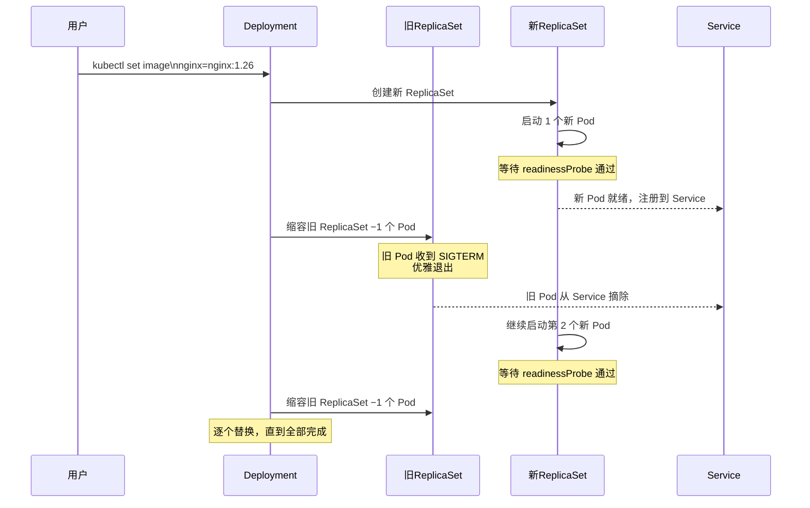

滚动更新策略在 Deployment 的 `spec.strategy` 中配置：

```yaml
spec:
  replicas: 3
  strategy:
    type: RollingUpdate
    rollingUpdate:
      maxSurge: 1        # 更新期间最多额外创建 1 个 Pod（峰值 4 个）
      maxUnavailable: 0  # 更新期间至少保持 3 个 Pod 可用（零中断）
```

实操演示：

```bash
#  部署 nginx:1.25 的 3 个副本
kubectl create deployment nginx-rollout --image=nginx:1.25 --replicas=3

#  触发滚动更新（另一个终端 watch Pod 状态）
kubectl get pods -w &

#  更新镜像
kubectl set image deployment/nginx-rollout nginx=nginx:1.26
kubectl rollout status deployment/nginx-rollout
#  预期输出：deployment "nginx-rollout" successfully rolled out

#  查看更新历史
kubectl rollout history deployment/nginx-rollout
#  REVISION  CHANGE-CAUSE
#  1         <none>
#  2         <none>

#  回滚到上一个版本
kubectl rollout undo deployment/nginx-rollout
kubectl rollout status deployment/nginx-rollout

#  回滚到指定版本
kubectl rollout undo deployment/nginx-rollout --to-revision=1

#  暂停/恢复——灰度发布的基础
kubectl rollout pause deployment/nginx-rollout   # 暂停更新
kubectl set image deployment/nginx-rollout nginx=nginx:1.27
kubectl rollout resume deployment/nginx-rollout  # 恢复，一次性应用变更
```

**滚动更新 + readlinessProbe 的组合** 是零停机部署的完整方案：新 Pod 必须通过就绪检查才接收流量，旧 Pod 在流量切走后才被终止。

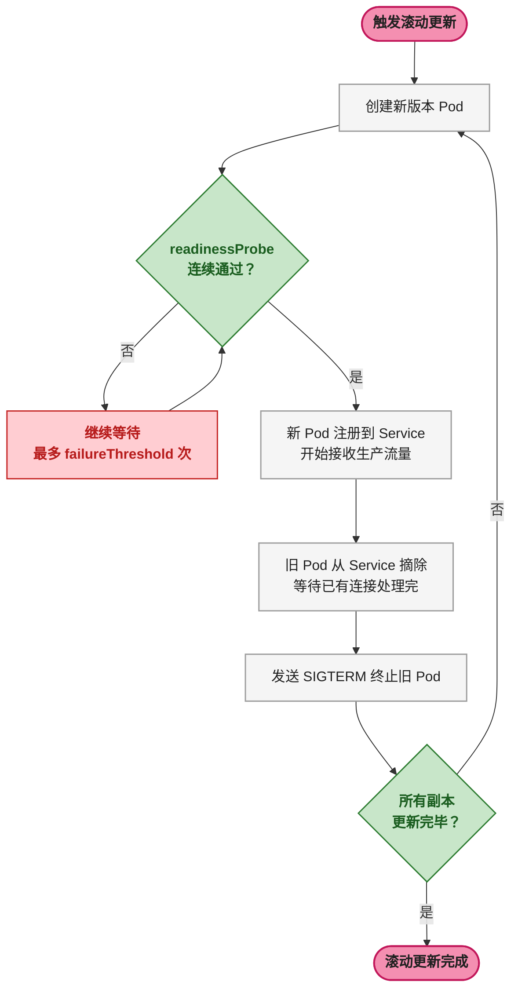

### 🛠️ 4.9 概念对比：Docker Compose vs K8s

| 概念 | Docker Compose | Kubernetes | 说明 |
|------|---------------|-----------|------|
| 容器单元 | `services` 下的每个条目 | Pod（可含多个容器） | K8s 多一层抽象 |
| 副本管理 | `deploy: replicas: 3` （Compose v3） | Deployment `replicas: 3` | K8s 功能更完善（HPA 自动扩缩） |
| 服务发现 | 通过 `service-name` 自动 DNS | Service + CoreDNS | 两者类似 |
| 配置管理 | 环境变量写在 compose 文件里 | ConfigMap / Secret | K8s 配置与工作负载分离 |
| 网络 | 默认 bridge 网络 | CNI 插件（Calico/Flannel） | K8s 网络模型更灵活 |
| 存储 | 命名卷（named volume） | PersistentVolume / PersistentVolumeClaim | K8s 抽象层级更多 |
| 健康检查 | `healthcheck` | livenessProbe / readinessProbe | K8s 区分存活和就绪探针 |
| 滚动更新 | `docker compose up -d --no-deps` | Deployment 原生滚动更新 | K8s 更自动化 |

## 🛠️ 五、实战迁移：Docker Compose → Kind

这是本篇的核心环节：把开篇那个 `docker-compose.yml` （nginx + app + redis + mysql）完整迁移到 Kind 集群中。

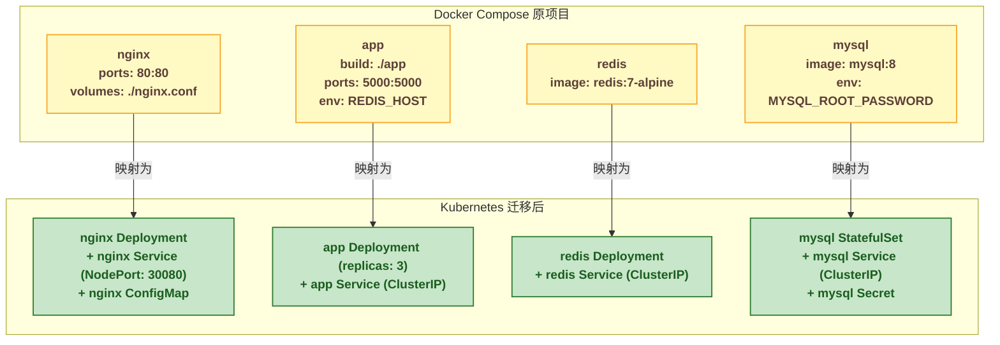

### 🖥️ 5.1 第一步：创建集群并映射端口

Kind 需要在创建时声明宿主机端口映射，这样后续才能从 Windows 浏览器访问 K8s 内的 nginx。

创建 `kind-migration.yaml` ：

```yaml
kind: Cluster
apiVersion: kind.x-k8s.io/v1alpha4
nodes:
  - role: control-plane
    extraPortMappings:
      - containerPort: 30080
        hostPort: 80
        protocol: TCP
```

```bash
kind create cluster --name migration --config kind-migration.yaml
kubectl get nodes
```

### 🌐 5.2 第二步：MySQL（有状态服务）

数据库有状态——挂掉重启后必须保留数据。K8s 中 `StatefulSet` 比 `Deployment` 更适合有状态服务（提供稳定的网络标识和持久化存储）。这里为简化先使用 `Deployment` ，仅用 `hostPath` 临时演示。

创建 `mysql.yaml` ：

```yaml
apiVersion: v1
kind: Secret
metadata:
  name: mysql-secret
type: Opaque
stringData:
  root-password: "secret123"
---
apiVersion: v1
kind: Service
metadata:
  name: mysql-svc
spec:
  selector:
    app: mysql
  ports:
    - port: 3306
      targetPort: 3306
---
apiVersion: apps/v1
kind: Deployment
metadata:
  name: mysql
spec:
  replicas: 1
  selector:
    matchLabels:
      app: mysql
  template:
    metadata:
      labels:
        app: mysql
    spec:
      containers:
        - name: mysql
          image: mysql:8
          env:
            - name: MYSQL_ROOT_PASSWORD
              valueFrom:
                secretKeyRef:
                  name: mysql-secret
                  key: root-password
          ports:
            - containerPort: 3306
```

### 🔢 5.3 第三步：Redis

创建 `redis.yaml` ：

```yaml
apiVersion: v1
kind: Service
metadata:
  name: redis-svc
spec:
  selector:
    app: redis
  ports:
    - port: 6379
      targetPort: 6379
---
apiVersion: apps/v1
kind: Deployment
metadata:
  name: redis
spec:
  replicas: 1
  selector:
    matchLabels:
      app: redis
  template:
    metadata:
      labels:
        app: redis
    spec:
      containers:
        - name: redis
          image: redis:7-alpine
          ports:
            - containerPort: 6379
```

### 🌐 5.4 第四步：应用服务

创建 `app.yaml` （核心——这里演示 ConfigMap 如何替代 Docker Compose 的 `environment` ）：

```yaml
apiVersion: v1
kind: ConfigMap
metadata:
  name: app-config
data:
  REDIS_HOST: "redis-svc"
  MYSQL_HOST: "mysql-svc"
---
apiVersion: v1
kind: Service
metadata:
  name: app-svc
spec:
  selector:
    app: myapp
  ports:
    - port: 5000
      targetPort: 5000
---
apiVersion: apps/v1
kind: Deployment
metadata:
  name: app
spec:
  replicas: 3
  selector:
    matchLabels:
      app: myapp
  template:
    metadata:
      labels:
        app: myapp
    spec:
      containers:
        - name: app
          image: myapp:latest
          ports:
            - containerPort: 5000
          envFrom:
            - configMapRef:
                name: app-config
          env:
            - name: MYSQL_PASSWORD
              valueFrom:
                secretKeyRef:
                  name: mysql-secret
                  key: root-password
```

**关键变化对照** ：Docker Compose 中的 `environment: REDIS_HOST: redis` 变成了 ConfigMap 中的 `REDIS_HOST: "redis-svc"` 。 `redis` （Compose service name）变成 `redis-svc` （K8s Service 名称作为 DNS 名），这是迁移的核心思路—— **把 Docker Compose 的服务名替换为 K8s Service 的 DNS 名** 。

### 🚪 5.5 第五步：Nginx（对外流量入口）

K8s 中 Service 的 `type: NodePort` 将 Service 端口映射到节点宿主机的某个端口（30000 ~ 32767）。配合 Kind 的 `extraPortMappings` （hostPort 80 → containerPort 30080），实现 `localhost:80 → nginx Service → nginx Pod` 的链路。

创建 `nginx-k8s.yaml` ：

```yaml
apiVersion: v1
kind: ConfigMap
metadata:
  name: nginx-config
data:
  nginx.conf: |
    events { worker_connections 1024; }
    http {
        upstream app_backend {
            server app-svc:5000;
        }
        server {
            listen 80;
            location / {
                proxy_pass http://app_backend;
            }
        }
    }
---
apiVersion: v1
kind: Service
metadata:
  name: nginx-svc
spec:
  type: NodePort
  selector:
    app: nginx
  ports:
    - port: 80
      targetPort: 80
      nodePort: 30080
---
apiVersion: apps/v1
kind: Deployment
metadata:
  name: nginx
spec:
  replicas: 1
  selector:
    matchLabels:
      app: nginx
  template:
    metadata:
      labels:
        app: nginx
    spec:
      containers:
        - name: nginx
          image: nginx:1.25
          ports:
            - containerPort: 80
          volumeMounts:
            - name: nginx-config-vol
              mountPath: /etc/nginx/nginx.conf
              subPath: nginx.conf
      volumes:
        - name: nginx-config-vol
          configMap:
            name: nginx-config
```

**Compose 到 K8s 的关键映射** ：

| Compose 写法 | K8s 对应 | 说明 |
|-------------|---------|------|
| `volumes: ./nginx.conf:/etc/nginx/nginx.conf` | ConfigMap + Volume 挂载 | 配置文件不再是宿主机文件，而是集群内的 ConfigMap 资源 |
| `upstream app_backend { server app:5000; }` | `upstream app_backend { server app-svc:5000; }` | 服务名从 Compose 服务名改为 K8s Service DNS 名 |
| `ports: "80:80"` | Service NodePort 30080 + Kind extraPortMappings | Compose 直接映射宿主机端口，K8s 通过 Service+NodePort 再映射 |

### 🔄 5.6 第六步：一键部署所有资源

所有 YAML 文件放在同一目录下：

```bash
ls *.yaml
#  app.yaml  mysql.yaml  nginx-k8s.yaml  redis.yaml

kubectl apply -f .

#  验证所有资源
kubectl get all
#  NAME                         READY   STATUS    RESTARTS   AGE
#  pod/app-5d4b8c7f9-abc12      1/1     Running   0          30s
#  pod/app-5d4b8c7f9-def34      1/1     Running   0          30s
#  pod/app-5d4b8c7f9-ghi56      1/1     Running   0          30s
#  pod/mysql-7c8d9f6-xyz78      1/1     Running   0          25s
#  pod/nginx-8b9c6d5-asd45      1/1     Running   0          20s
#  pod/redis-9d8c7b6-pqr90      1/1     Running   0          28s
#
#  NAME                 TYPE        CLUSTER-IP      EXTERNAL-IP   PORT(S)
#  service/app-svc      ClusterIP   10.96.100.1     <none>        5000/TCP
#  service/mysql-svc    ClusterIP   10.96.100.2     <none>        3306/TCP
#  service/nginx-svc    NodePort    10.96.100.3     <none>        80:30080/TCP
#  service/redis-svc    ClusterIP   10.96.100.4     <none>        6379/TCP
#
#  NAME                     READY   UP-TO-DATE   AVAILABLE   AGE
#  deployment.apps/app      3/3     3            3           30s
#  deployment.apps/mysql    1/1     1            1           25s
#  deployment.apps/nginx    1/1     1            1           20s
#  deployment.apps/redis    1/1     1            1           28s
```

在浏览器访问 `http://localhost` ，流量路径为：

```
浏览器 → WSL localhost:80 → Kind 容器 30080 → nginx Service NodePort → nginx Pod → app Service ClusterIP → app Pod (其中一个副本)
```

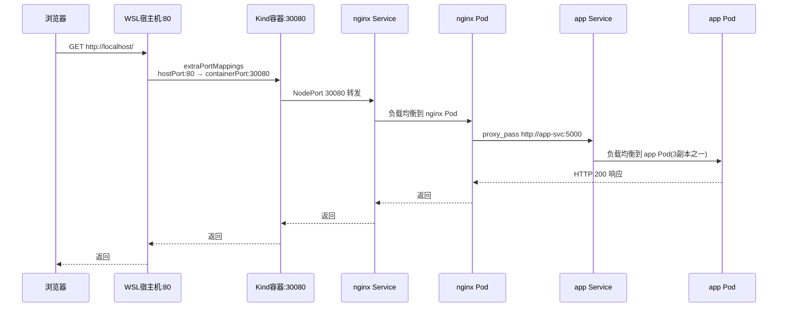

### 📌 5.7 清理

```bash
kind delete cluster --name migration
#  所有 Docker 节点容器被删除，磁盘空间立即释放
```

## 📋 六、日常 Kind 操作速查

| 操作 | 命令 | 说明 |
|------|------|------|
| 创建集群 | `kind create cluster --name xxx` | 默认单节点 |
| 创建多节点 | `kind create cluster --config kind.yaml` | 通过配置文件定义节点拓扑 |
| 查看集群列表 | `kind get clusters` | 显示所有集群 |
| 切换 kubectl 上下文 | `kubectl cluster-info --context kind-xxx` | Kind 自动注册 kubeconfig |
| 加载本地镜像 | `kind load docker-image myapp:latest --name xxx` | 将本机构建的镜像加载到 Kind 节点 |
| 删除集群 | `kind delete cluster --name xxx` | 删除集群和所有节点容器 |
| 查看节点容器 | `docker ps --filter "name=xxx"` | 底层还是 Docker |

## 🔧 七、K8s 学习三阶段路线

K8s 的学习常被过度复杂化——很多人一上来就买云服务、配 Terraform、研究 Service Mesh，结果基础没打牢，反而被云厂商的各种概念绕晕。以下三阶段路线能让每一步都有明确的边界。

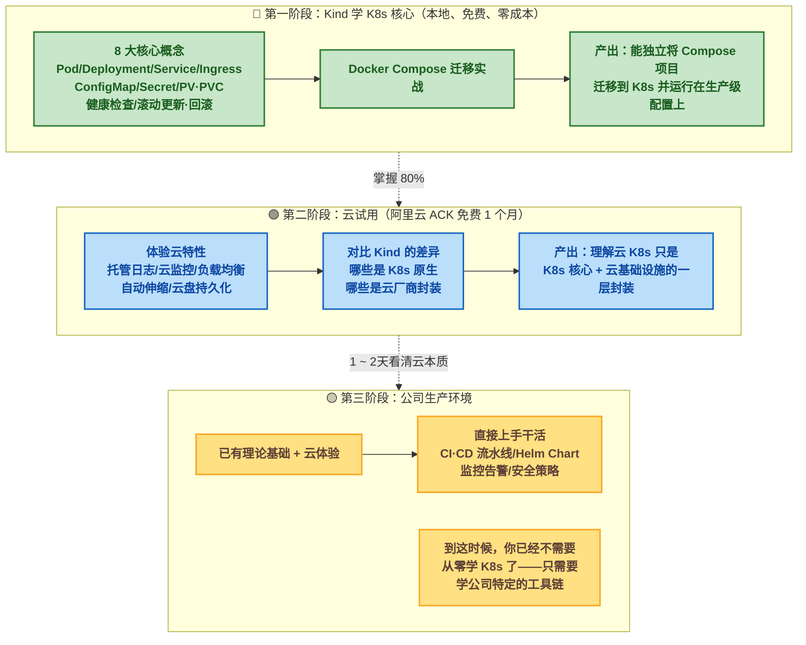

### 🎓 第一阶段：Kind 学 K8s 核心（现在）

**目标** ：用 Kind 把 8 大核心概念（Pod / Deployment / Service / Ingress / ConfigMap / Secret / PV·PVC / 健康检查与滚动更新）全部手动实践一遍，把 Docker Compose 项目完整迁移到 K8s 上。

**为什么用 Kind 而不是直接上云** ：

| 对比维度 | Kind 本地 | 直接买云 K8s |
|---------|----------|------------|
| 成本 | 零 | 阿里云 ACK 最低约 300 元/月起 |
| 创建速度 | 30 秒 | 10 ~ 15 分钟（等云资源就绪） |
| 犯错成本 | 删掉重建，零损失 | 配错安全组可能导致公网暴露 |
| 学习聚焦 | 纯 K8s 概念，没有云概念噪音 | 要同时学 K8s + SLB + NAS + 日志服务 |
| 网络限制 | 仅本地 | 需要公网/VPC 配置 |

**Kind 不是用来模拟"云环境"的，而是用来模拟"K8s 核心"的。** 学 K8s 核心，用 Kind 是最快、最省钱的方式。

当你把 Deployment 的滚动更新、Ingress 的域名路由、PV/PVC 的存储解耦、健康检查的两种探针全部在 Kind 上亲手跑过一遍后， **这 80% 的知识在任何云厂商的 K8s 服务中完全通用** 。

### ☁️ 第二阶段：开免费试用，体验"云特性"

**目标** ：用一个云 K8s 免费试用账号（如阿里云 ACK 新用户 1 个月免费），体验 K8s 核心之外的"云层"。

**要体验的内容** ：

| 云特性 | Kind 能做到吗？ | 云上如何体验 |
|-------|:---:|------|
| **托管控制面** | 否（Kind 的控制面也在容器里） | ACK 免费试用，控制面由阿里云维护，你只看到 kubeconfig |
| **云负载均衡（SLB）** | 否（Kind 用 NodePort） | 创建 `type: LoadBalancer` 的 Service，自动分配公网 IP |
| **云盘持久化** | 可以（hostPath 模拟） | PV 的 `storageClassName` 改为 `alicloud-disk-ssd` ，自动创建云盘 |
| **托管日志（SLS）** | 否 | 在 ACK 控制台一键开启，所有容器 stdout 自动投递到日志服务 |
| **云监控** | 否 | ACK 自带节点/Pod 级别的 CPU/内存/网络监控面板 |
| **弹性伸缩（HPA + CA）** | HPA 可练（metrics-server），CA 不行 | ACK 配置 HPA 策略 + 节点自动伸缩，压测观察自动扩容 |

第二阶段通常 **1 ~ 2 天** 就能摸清楚。因为核心逻辑（Deployment 怎么扩缩、Service 怎么负载均衡、Ingress 怎么路由）你已经在第一阶段用 Kind 跑通了。云上只是把 `hostPath` 换成云盘、把 `NodePort` 换成 LoadBalancer、把 `kubectl logs` 换成云日志控制台。

**第二阶段的关键认知** ：

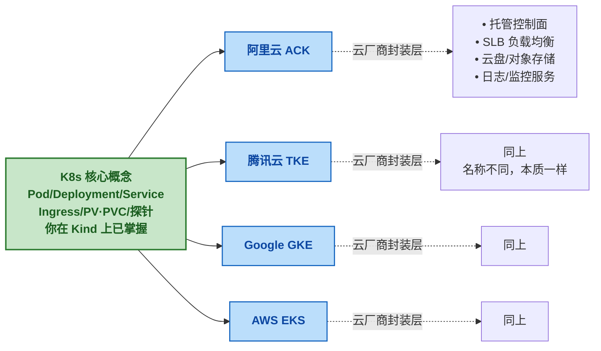

**云 K8s 服务 = K8s 核心 + 云基础设施封装** 。你把核心学扎实了，切换云厂商只是换个 YAML 注解、换个 StorageClass 名字的问题。

### 🚀 第三阶段：公司买单，上生产

到这一步，你已经有了 Kind 打下的理论基础和云试用的实操经验。入职后面对公司的 K8s 生产环境，你的状态是：

- **不用从零学 K8s** ，因为你已经在 Kind 上把所有核心概念跑过一遍
- **不用从头学云** ，因为你已经在免费试用中见过了云负载均衡、云盘、托管日志
- **只需要学公司特定的工具链** ：Helm Chart 怎么写、CI/CD 流水线怎么配、Prometheus 告警规则怎么定义、安全策略（PodSecurityPolicy/NetworkPolicy）怎么设置

这些工具链具体到每家公司都不一样——但 **K8s 核心 API 不会变** 。 `kubectl get pods` 、 `kubectl describe deployment` 、 `kubectl logs` 在任何环境（Kind / ACK / GKE / EKS）下的输出含义完全一致。

## 📦 八、总结

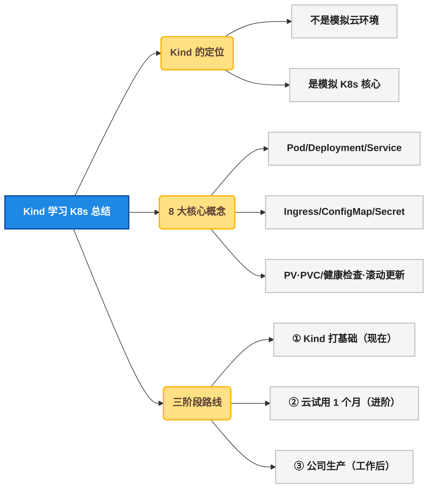

**三个核心理念** ：

1. **Kind 不是用来模拟"云环境"的，而是用来模拟"K8s 核心"的** 。学 K8s 核心，用 Kind 是最快、最省钱、最正确的方式
2. **学"云服务"，用云厂商的免费试用** 。当你在 Kind 上把 Deployment、Service、Ingress、PV/PVC 玩得滚瓜烂熟，再开一个免费试用的云 K8s 集群，你会发现云上只是多了一层基础设施封装——1 ~ 2 天就搞定了
3. **K8s 核心概念在任何云上完全通用** 。 `kubectl` 命令的输出含义、YAML 的 `apiVersion` 和 `kind` 字段、Deployment 的滚动更新策略——这些在 Kind、ACK、GKE、EKS 上完全一致。把核心打扎实，切换云厂商只是换个注解、换个 StorageClass 名字的问题
