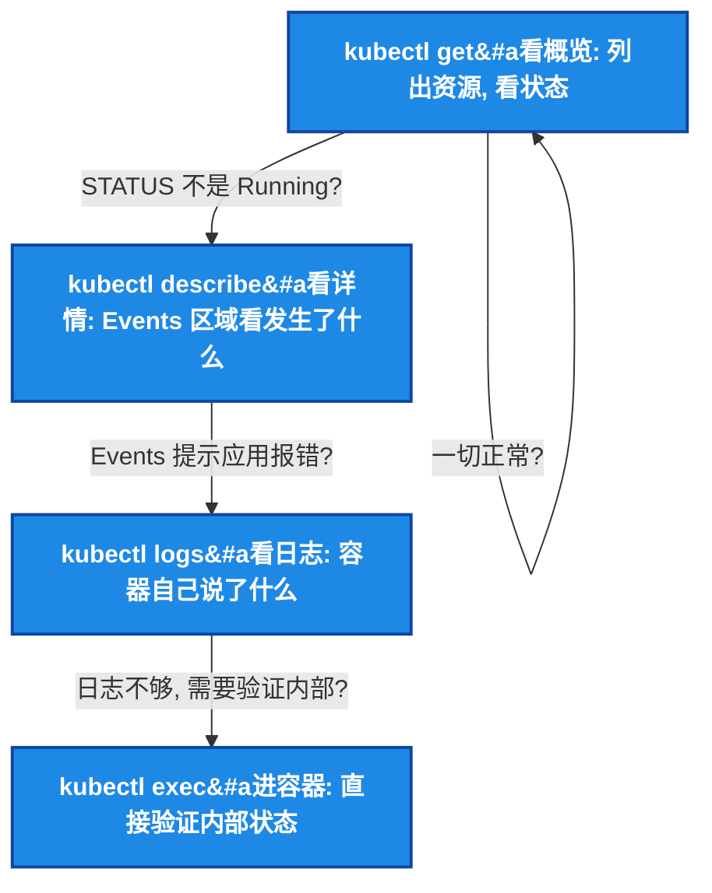
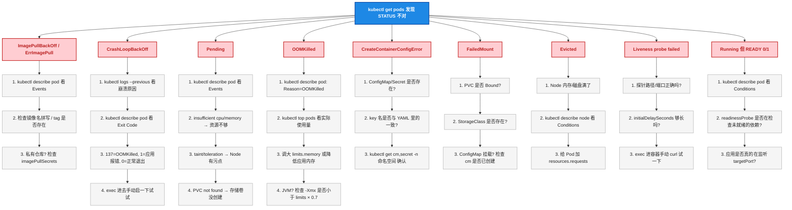
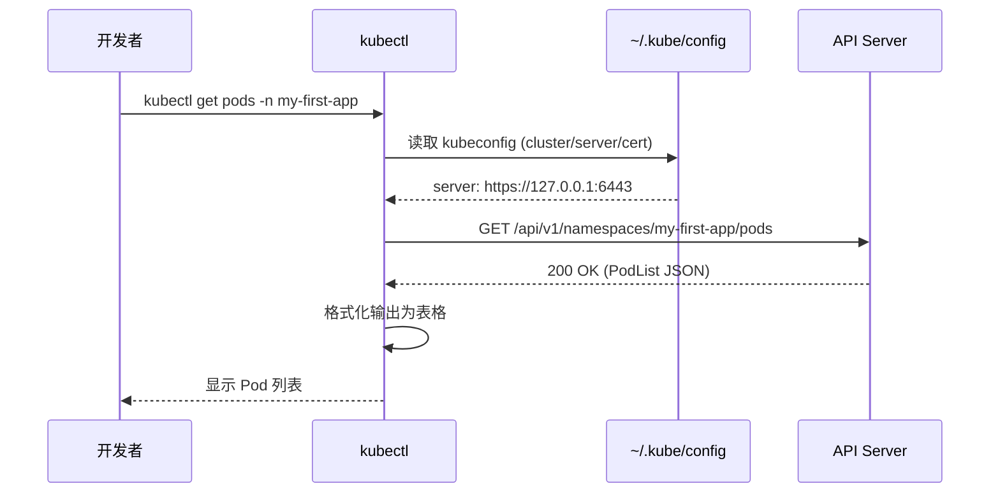

# 第3步：kubectl 生存手册 —— 开发者每天必敲的命令

## 一、目标说明

前三篇文章把概念、YAML、配置都讲完了。这一篇不讲"是什么"，只讲 **"怎么查"**和 **"怎么排"** 。

这是整个系列**最实用的一篇**——开发者 90% 跟 K8s 打交道的时间，不是写 YAML，而是在这几个命令之间反复横跳：

```
kubectl get → kubectl describe → kubectl logs → kubectl exec — 然后回到 get
```

读完这篇文章，读者能：

- 用 4 个核心查看命令快速定位问题
- 用 3 个交互命令深入容器内部或桥接流量
- 掌握 9 种 Pod 异常状态的完整诊断流程
- 用 `-o wide/json/yaml` 和 `--sort-by` 提取关键信息
- 建立"从现象到根因"的排查肌肉记忆

---

## 二、前置条件

| 前置条件 | 要求 |
|----------|------|
| 本地 K8s 环境可用 | `kubectl cluster-info` 正常 |
| 有几个 Pod 在跑 | 前几篇文章的 my-first-app 即可 |
| 理解 Pod / Deployment / Service 是什么 | 至少知道它们是干什么的 |

---

## 三、环境准备

沿用前面的 Namespace，确认有资源在跑：

```bash
kubectl get all -n my-first-app
```

如果已经删了，重新 apply：

```bash
kubectl apply -f ~/k8s-first-app/
```

---

## 四、分步实践

### 4.1 第一步：资源查看四件套 —— 90% 的日常就是这个循环



#### 4.1.1 `kubectl get` —— 第一眼

```bash
# 查看 Pod
kubectl get pods -n my-first-app

# 查看所有资源
kubectl get all -n my-first-app

# 加 -o wide 看更多列（Pod IP、Node 名）
kubectl get pods -n my-first-app -o wide

# 加 --show-labels 看标签（排 Service 不通时很有用）
kubectl get pods -n my-first-app --show-labels

# 看多个 Namespace
kubectl get pods --all-namespaces

# 实时监控（-w = watch）
kubectl get pods -n my-first-app -w
```

`-o wide` 额外显示的列：

| 资源 | 额外列 | 用途 |
|------|--------|------|
| Pod | IP、NODE | 看 Pod 在哪个 Node、IP 是多少 |
| Service | CLUSTER-IP、EXTERNAL-IP、PORT(S) | 看虚拟 IP 和端口映射 |
| Deployment | READY、UP-TO-DATE、AVAILABLE | `READY 2/2` 说明全部就绪 |
| Node | STATUS、ROLES、AGE、VERSION | 有哪些 Node 可用 |

> ⚠️ 新手提示：`kubectl get all -n <ns>` **并不会列出所有资源**。它只列 Pod、Service、Deployment、ReplicaSet、StatefulSet、DaemonSet、Job、CronJob。ConfigMap、Secret、Ingress、PVC 等不会出现在 `get all` 中，需要显式指定资源名。

#### 4.1.2 `kubectl describe` —— 第二眼，看 Events

`get` 只看表面状态，`describe` 看**发生了什么**：

```bash
kubectl describe pod <pod-name> -n my-first-app
```

输出分三个区域：

| 区域 | 内容 | 重点看什么 |
|------|------|-----------|
| 头部 | Name、Namespace、Node、Status、IP | Pod 在哪个 Node、IP 是什么 |
| Conditions | PodScheduled / Initialized / ContainersReady / Ready | 哪个 Condition 是 False？ |
| Events | 按时间倒序的事件列表 | **最下面是最新事件，直接拉到底** |

Events 区域示例（正常 Pod）：

```
Events:
  Type    Reason     Age   From               Message
  ----    ------     ----  ----               -------
  Normal  Scheduled  5m    default-scheduler  Successfully assigned my-first-app/my-app-xxx to docker-desktop
  Normal  Pulling    5m    kubelet            Pulling image "nginx:1.25-alpine"
  Normal  Pulled     5m    kubelet            Successfully pulled image "nginx:1.25-alpine"
  Normal  Created    5m    kubelet            Created container app
  Normal  Started    5m    kubelet            Started container app
```

Events 区域示例（有问题的 Pod）：

```
Events:
  Warning  Failed     10s   kubelet  Error: ImagePullBackOff
  Warning  Failed     10s   kubelet  Failed to pull image "ngix:1.25": not found
  Normal   Pulling    25s   kubelet  Pulling image "ngix:1.25"
```

> ⚠️ 新手提示：`kubectl describe pod` 的 Events **不是标准日志**，是对外发布的事件摘要。太旧的 Events 会被 K8s 自动清理（默认保留 1 小时）。不要依赖 Events 来做长期审计。

#### 4.1.3 `kubectl logs` —— 第三眼，听容器怎么说

```bash
# 基础
kubectl logs <pod-name> -n my-first-app

# 加 --tail 看最后 N 行
kubectl logs <pod-name> -n my-first-app --tail=200

# 加 -f 实时追踪（Ctrl+C 退出）
kubectl logs <pod-name> -n my-first-app -f

# 多容器 Pod 指定容器名
kubectl logs <pod-name> -c <container-name> -n my-first-app

# 查看上一次崩溃的日志（CrashLoopBackOff 时的救命命令）
kubectl logs <pod-name> -n my-first-app --previous

# 看最近 5 分钟的日志
kubectl logs <pod-name> -n my-first-app --since=5m

# 按时间过滤
kubectl logs <pod-name> -n my-first-app --since-time="2023-01-08T10:00:00Z"
```

> ⚠️ 新手提示：`--previous` 是 CrashLoopBackOff 时的 **第一个命令**。Pod 重启后当前容器的日志是空的（刚启动），上一次崩溃的日志在 `--previous` 里。跟医院看病一样——你要的是发病时的症状，不是急救后的状态。

**前置 Pod 日志**（删除后 Pod 都没了还能看？不能。Pod 删了日志就没了。生产环境建议接 Loki / ELK / 云厂商日志服务。）

#### 4.1.4 `kubectl get events` —— 全局视角

```bash
# 当前 Namespace 的所有事件
kubectl get events -n my-first-app

# 按时间倒序
kubectl get events -n my-first-app --sort-by='.lastTimestamp'

# 只看 Warning
kubectl get events -n my-first-app --field-selector type=Warning

# 全集群（需要权限）
kubectl get events --all-namespaces --sort-by='.lastTimestamp'
```

### 4.2 第二步：交互三件套 —— 进容器、桥流量、操纵部署

#### 4.2.1 `kubectl exec` —— 进容器

```bash
# 进入容器 shell
kubectl exec -it <pod-name> -n my-first-app -- /bin/sh

# alpine 镜像用 ash（没有 bash）
kubectl exec -it <pod-name> -n my-first-app -- /bin/ash

# 单次执行命令
kubectl exec <pod-name> -n my-first-app -- cat /etc/hosts
kubectl exec <pod-name> -n my-first-app -- env | sort
kubectl exec <pod-name> -n my-first-app -- ps aux
kubectl exec <pod-name> -n my-first-app -- df -h

# 多容器 Pod 指定容器
kubectl exec -it <pod-name> -c <container-name> -n my-first-app -- /bin/sh
```

**进容器后必查的几项：**

| 命令 | 查什么 |
|------|--------|
| `env \| sort` | 环境变量是否正确注入 |
| `cat /etc/hosts` | DNS 解析是否正确 |
| `cat /etc/resolv.conf` | DNS 服务器配置（CoreDNS 地址） |
| `nc -zv <svc-name> <port>` | 能否连通其他 Service |
| `ps aux` | 进程是否在运行 |
| `df -h` | 磁盘用量 |
| `free -m` | 内存用量 |

> ⚠️ 新手提示：生产环境 Pod 的基础镜像通常是 **distroless** 或 **scratch** 的——里面没有 shell、没有 `ls`、没有 `curl`。这种 Pod `kubectl exec` 进不去。Google 的 distroless 镜像以安全著称，但也意味着任何需要在容器内执行命令的调试方式都失效了。要么在开发环境用 debug 镜像，要么用 ephemeral container（`kubectl debug`，v1.18+）。

#### 4.2.2 `kubectl port-forward` —— 调试神器

```bash
# 把 Pod 端口映射到本地
kubectl port-forward pod/<pod-name> 8080:80 -n my-first-app

# 把 Service 端口映射到本地
kubectl port-forward svc/<svc-name> 8080:80 -n my-first-app

# 指定监听地址（默认 127.0.0.1）
kubectl port-forward svc/<svc-name> 8080:80 -n my-first-app --address=0.0.0.0
```

**适用场景：**

- 调试 ClusterIP Service（没有外部 IP，只能集群内访问）
- 临时访问数据库 Pod
- 本地 IDE 调试远程 K8s 里的服务

> ⚠️ 新手提示：`port-forward` 走的是 kubectl → API Server → kubelet → Pod 的 SPDY 隧道，**不适合长期使用或生产流量**。关掉终端隧道就断。生产环境要暴露服务请用 Ingress 或 LoadBalancer。

#### 4.2.3 `kubectl rollout` —— 控制部署节奏

```bash
# 滚动重启所有 Pod（ConfigMap/Secret 更新后部署用）
kubectl rollout restart deploy/<deploy-name> -n my-first-app

# 回滚到上一个版本
kubectl rollout undo deploy/<deploy-name> -n my-first-app

# 回滚到指定版本
kubectl rollout undo deploy/<deploy-name> --to-revision=3 -n my-first-app

# 查看部署历史
kubectl rollout history deploy/<deploy-name> -n my-first-app

# 查看指定版本详情
kubectl rollout history deploy/<deploy-name> --revision=3 -n my-first-app

# 暂停滚动更新（观察一阵再继续）
kubectl rollout pause deploy/<deploy-name> -n my-first-app

# 恢复
kubectl rollout resume deploy/<deploy-name> -n my-first-app

# 查看更新状态
kubectl rollout status deploy/<deploy-name> -n my-first-app
```

> ⚠️ 新手提示：修改了 ConfigMap/Secret 后，环境变量注入的方式 **不会自动重启 Pod**。必须 `kubectl rollout restart` 重建 Pod 才能生效。文件挂载方式会 60 ~ 90 秒内自动同步，也不需要重启。

### 4.3 第三步：输出格式化 —— 快速提取关键信息

#### 4.3.1 `-o wide` —— 多几个关键列

```bash
kubectl get pods -n my-first-app -o wide
# NAME                     READY  STATUS   RESTARTS  AGE  IP            NODE
# my-app-5d8f7b6c9-abcde  1/1    Running  0         1m   10.1.0.15     docker-desktop
```

#### 4.3.2 `-o yaml` 和 `-o json` —— 看完整定义

```bash
# 输出完整 YAML（包含 status 和 spec）
kubectl get pod <pod-name> -n my-first-app -o yaml

# 输出 JSON（方便 jq 处理）
kubectl get pod <pod-name> -n my-first-app -o json | jq '.status.phase'
kubectl get pod <pod-name> -n my-first-app -o json | jq '.spec.containers[].image'
```

#### 4.3.3 `-o jsonpath` —— 精准提取

```bash
# 提取 Pod IP
kubectl get pod <pod-name> -n my-first-app -o jsonpath='{.status.podIP}'

# 提取所有 Pod 的镜像
kubectl get pods -n my-first-app -o jsonpath='{.items[*].spec.containers[*].image}'

# 提取 Pod name + IP（自定义输出）
kubectl get pods -n my-first-app -o jsonpath='{range .items[*]}{.metadata.name}{" "}{.status.podIP}{"\n"}{end}'
```

#### 4.3.4 `--sort-by` —— 排序

```bash
# 按重启次数排序（找经常重启的 Pod）
kubectl get pods -n my-first-app --sort-by='.status.containerStatuses[0].restartCount'

# 按 CPU 使用排序（需要 metrics-server）
kubectl top pods -n my-first-app --sort-by=cpu

# 按内存排序
kubectl top pods -n my-first-app --sort-by=memory

# Events 按时间排序
kubectl get events -n my-first-app --sort-by='.lastTimestamp'
```

#### 4.3.5 `--field-selector` 和 `-l` —— 过滤

```bash
# 按状态过滤
kubectl get pods -n my-first-app --field-selector=status.phase=Running

# 按标签过滤（Label Selector）
kubectl get pods -n my-first-app -l app=my-app

# 多条件标签
kubectl get pods -n my-first-app -l 'app in (my-app,my-app-v2),env!=dev'

# 按 Node 过滤
kubectl get pods --all-namespaces --field-selector=spec.nodeName=docker-desktop
```

### 4.4 第四步：9 种 Pod 异常的诊断流程

这张图贴在工位上，线上出问题直接走流程：



#### 逐状态补充关键命令

**ImagePullBackOff：**

```bash
kubectl describe pod <pod> -n my-first-app | grep -A5 "Events"
# 看是不是 "Failed to pull image ... not found"
```

**CrashLoopBackOff：**

```bash
kubectl logs <pod> --previous -n my-first-app --tail=50
kubectl describe pod <pod> -n my-first-app | grep "Exit Code"
```

Exit Code 速查：

| Exit Code | 含义 | 常见原因 |
|:---:|------|----------|
| 0 | 正常退出 | 程序执行完退出了（CMD 写得不对？） |
| 1 | 应用错误 | 启动报错、配置不对 |
| 137 | SIGKILL | OOMKilled 或手动 `kubectl delete pod` |
| 139 | SIGSEGV | 段错误（C/Go 程序空指针） |
| 143 | SIGTERM | 优雅终止信号（K8s 正常删除 Pod） |

**Pending：**

```bash
kubectl describe pod <pod> -n my-first-app | grep -A10 "Events"
# 找 "0/N nodes are available" 后面的描述
```

**OOMKilled：**

```bash
kubectl describe pod <pod> -n my-first-app | grep -A3 "State"
# State: Terminated, Reason: OOMKilled, Exit Code: 137
kubectl top pods -n my-first-app          # 需要 metrics-server
```

### 4.5 第五步：进阶技巧——不是每天用，但关键时救命

#### 4.5.1 `kubectl diff` —— 看看 apply 会改什么

```bash
kubectl diff -f 03-deployment.yaml -n my-first-app
```

实际 apply 之前先 `diff` 一下——避免手滑把生产配置改出问题。

#### 4.5.2 `kubectl cp` —— 在容器和本地之间拷文件

```bash
# 从容器拷出来
kubectl cp my-first-app/<pod>:/var/log/app.log ./app.log

# 拷进容器
kubectl cp ./config.yaml my-first-app/<pod>:/etc/app/config.yaml
```

> ⚠️ 新手提示：`kubectl cp` 依赖 `tar` 命令，**容器里必须有 `tar`**。distroless 镜像没有 tar，cp 会报错。

#### 4.5.3 `kubectl debug`（v1.18+）—— 给 distroless Pod 注入调试容器

```bash
# 复制一个 Pod 并注入调试容器
kubectl debug <pod> -n my-first-app --image=busybox -it -- /bin/sh

# 通过 node 调试
kubectl debug node/<node-name> -it --image=busybox -- chroot /host
```

#### 4.5.4 `kubectl explain` —— 忘记字段名时的救星

```bash
kubectl explain deployment.spec.template.spec.containers
kubectl explain deployment.spec.template.spec.containers.livenessProbe
kubectl explain pod.spec.volumes --recursive
```

不翻文档、不 Google，直接在终端里查字段含义和类型。

### 4.6 第六步：日常操作速查卡

把最常用的命令印在脑子里（或贴在显示器旁）：

```bash
# === 查看 ===
kubectl get pods -n <ns> -o wide                    # 看 Pod 状态 + IP + Node
kubectl get deploy -n <ns>                           # 看 Deployment 就绪数
kubectl get svc,ep -n <ns>                           # 看 Service 和 Endpoints
kubectl get events -n <ns> --sort-by='.lastTimestamp' # 看最近事件

# === 详情 ===
kubectl describe pod <pod> -n <ns>                   # 看 Events + Conditions
kubectl describe deploy <deploy> -n <ns>             # 看滚动更新策略

# === 日志 ===
kubectl logs <pod> -n <ns> --tail=200 -f             # 实时看日志
kubectl logs <pod> -n <ns> --previous                # 看上一次崩溃日志

# === 进容器 ===
kubectl exec -it <pod> -n <ns> -- /bin/sh            # 进容器排查

# === 调试 ===
kubectl port-forward svc/<svc> 8080:80 -n <ns>       # 本地访问
kubectl rollout restart deploy/<deploy> -n <ns>      # 滚动重启

# === 扩缩 ===
kubectl scale deploy/<deploy> --replicas=5 -n <ns>   # 扩到 5 副本

# === 清理 ===
kubectl delete pod <pod> -n <ns>                     # 删 Pod (会自动重建)
kubectl delete -f xxx.yaml -n <ns>                   # 删资源
kubectl delete namespace <ns>                         # 删整个 Namespace
```

---

## 五、模拟排查实战

用一篇场景串联所有命令。

**场景：** 部署了新版本后，`kubectl get pods` 发现一个 Pod 在 CrashLoopBackOff。

### 排查步骤（一步不能跳）：

```bash
# Step 1: 看 Pod 概况
kubectl get pods -n my-first-app
# my-app-v2-7d9f8c5b-xxxxx   0/1   CrashLoopBackOff   5 (2m ago)   10m

# Step 2: 看上一次崩溃日志
kubectl logs my-app-v2-7d9f8c5b-xxxxx -n my-first-app --previous --tail=100
# panic: runtime error: invalid memory address or nil pointer dereference
# /app/main.go:42

# Step 3: 确认 Exit Code
kubectl describe pod my-app-v2-7d9f8c5b-xxxxx -n my-first-app | grep "Exit Code"
# Exit Code: 2

# Step 4: 看 Events 时间线
kubectl describe pod my-app-v2-7d9f8c5b-xxxxx -n my-first-app | tail -20
# Warning  BackOff  10s ago  kubelet  Back-off restarting failed container

# Step 5: 检查环境变量是否正确注入
kubectl exec my-app-v2-7d9f8c5b-yyyyy -n my-first-app -- env | grep DB_HOST
# (另一个正在 Running 的 Pod)

# Step 6: 确认 ConfigMap 内容
kubectl get cm app-config -n my-first-app -o yaml

# Step 7: 如果是新版本的问题 → 立即回滚
kubectl rollout undo deploy/my-app-v2 -n my-first-app
# deployment.apps/my-app-v2 rolled back

# Step 8: 确认恢复
kubectl get pods -n my-first-app -w
# my-app-v2-xxxxxxxxx   1/1   Running   0   5s
```

以上 8 步，从发现问题到回滚恢复，熟练后 **2 分钟内** 搞定。

---

## 六、原理简述

kubectl 的所有命令最终都变成对 API Server 的 HTTP 请求：



**kubeconfig（`~/.kube/config`）里有什么：**

| 字段 | 用途 |
|------|------|
| `clusters` | 集群地址 + CA 证书 |
| `users` | 用户证书 / Token |
| `contexts` | cluster + user + namespace 的组合 |

切换集群/Namespace：

```bash
kubectl config get-contexts                        # 列出所有 context
kubectl config use-context <context-name>           # 切换集群
kubectl config set-context --current --namespace=prod  # 切换默认 Namespace
```

> ⚠️ 新手提示：每次在 `prod` 和 `dev` 之间切换，养成 `kubectl config current-context` 先看一下的习惯。**在 prod Namespace 里 `kubectl delete pod` 的效果跟在 dev 里一模一样**——但后果天差地别。

---

## 七、总结与下一步

### 7.1 肌肉记忆

| 我想…… | 敲这个 |
|--------|--------|
| 看 Pod 状态 | `kubectl get pods -n <ns>` |
| 看 Pod 为什么挂了 | `kubectl describe pod <pod> -n <ns>` |
| 看应用崩溃日志 | `kubectl logs <pod> --previous -n <ns>` |
| 看实时日志 | `kubectl logs <pod> -f -n <ns>` |
| 进容器排查 | `kubectl exec -it <pod> -n <ns> -- /bin/sh` |
| 本地调试 Service | `kubectl port-forward svc/<svc> 8080:80 -n <ns>` |
| 重启 Pod（新配置生效）| `kubectl rollout restart deploy/<name> -n <ns>` |
| 紧急回滚 | `kubectl rollout undo deploy/<name> -n <ns>` |
| 看全集群事件 | `kubectl get events --all-namespaces --sort-by='.lastTimestamp'` |

### 7.2 下一步

下一篇文章（本系列最后一篇）《第 4 步：开发者 K8s 全景图》将涵盖：

- Ingress 七层路由（域名 → Service → Pod）
- Helm 包管理入门（`helm install` / `helm upgrade` / values 覆盖）
- 本地 K8s 环境选型（Docker Desktop vs Minikube vs KIND vs k3s）
- 那些"知道存在就行"的高级资源（StatefulSet / HPA / NetworkPolicy / RBAC）
- Dev 和 Ops 的分界线——什么归你管，什么扔给运维
