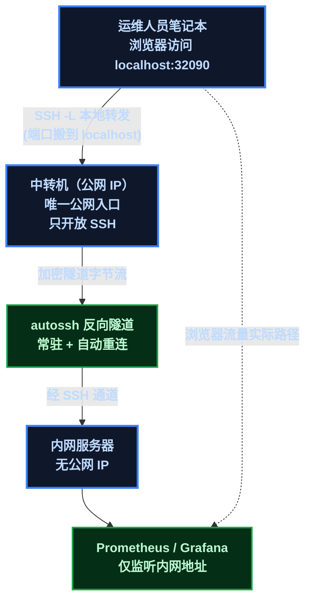
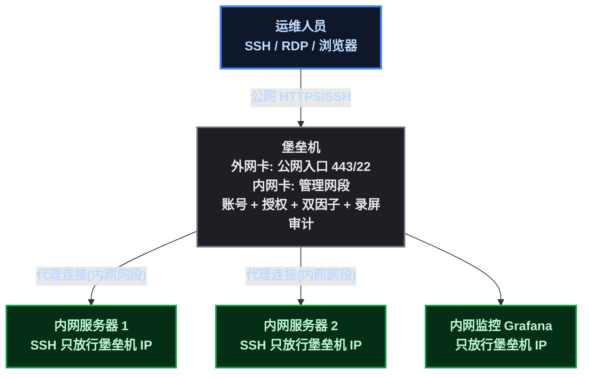
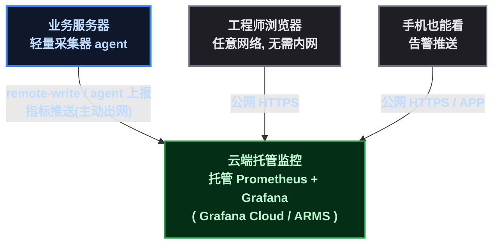
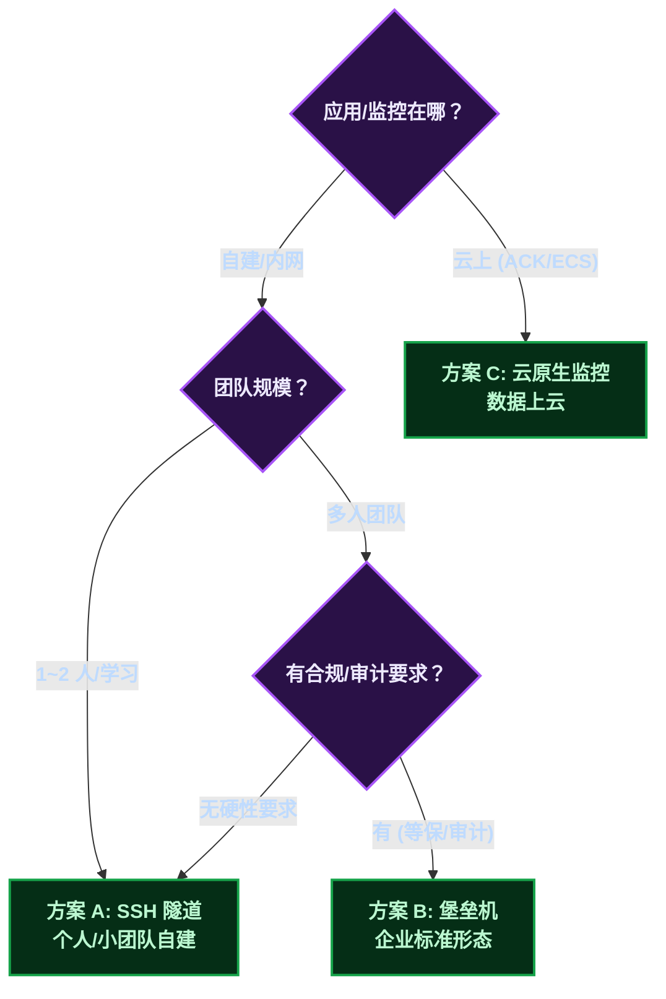

# 三条路看监控：隧道、堡垒机，还是数据上云？

在之前的文章里，我们为了"看一眼监控面板"折腾过不少事：部署在内网的 Prometheus/Grafana 不能直接访问，要开 SSH 隧道；隧道会断，断了要重连；连上之后还有账号密码、端口、地址一堆细节。这些"问题太多"的感慨，根源其实是同一个问题——**监控系统放在私有网络里，人在外面，怎么合法地看到它？**

围绕这个问题，行业给出了三种主流答案，恰好代表三种完全不同的网络哲学：

1. **SSH 隧道**（人带着加密通道进内网看数据）
2. **堡垒机**（把入口收敛到一台"守门员"，人过安检后进内网）
3. **云原生监控**（数据送出来给人看，人根本不用进内网）

这篇把三种方案的原理讲透，再放到同一张对比表里，最后给一张决策地图。它们没有优劣，只有"你愿意把哪一边放到公网上"的选择。

## 1. 方案 A：SSH 隧道 + 自建内网监控

### 原理

监控组件（Prometheus/Grafana）部署在**内网**，监听地址是内网 IP，公网完全摸不到。运维人员通过 **SSH 端口转发**（本地转发 ` -L ` 或反向转发 ` -R ` ）把内网端口"搬"到自己笔记本的 localhost 上，浏览器访问 ` localhost:32090 ` 时，流量顺着 SSH 加密通道流到内网。

这套方案的核心组件：

- **中转机**：一台有公网 IP 的机器作为唯一入口，只开 SSH；
- **反向隧道**：内网服务器主动用 ` autossh ` （自动重连的 SSH）连到中转机，建立常驻加密通道——这样即使内网没有公网 IP、人在任何网络，通道都在；
- **本地转发**：运维人员笔记本再 `ssh -L` 把通道接回 localhost。

### 特性

- **数据全程在内网**：指标、日志不出内网，只有加密隧道里流动的"查看请求"；
- **暴露面最小化**：公网只有中转机一个 SSH 端口，内网零暴露；
- **零新增组件**：复用系统自带的 SSH，不需要额外部署任何产品；
- **认证模型**：SSH 密钥对，个人密钥直连。

### 真实的坑（来自本系列实践）

隧道是这条链路上最脆弱的环节。SSH 双重跳转（笔记本 → 中转机 → 内网）空闲一段时间后，中转机侧可能重置连接，症状是 ` Read from remote host: Connection reset by peer ` ，浏览器打开看板立刻 ` HTTP 000 ` 。解法是 ` autossh ` 保活 + 心跳参数，但**自动重连只解决内网侧的反向隧道**，笔记本侧的本地转发断了还是得手动拉起——这就是"单点"的代价。

### 适用场景

个人开发者、小团队、自建监控、学习环境。本系列的学习环境就是这个方案的完整形态（ECS 中转 + 反向隧道 + 内网 Prometheus/Grafana）。

## 2. 方案 B：堡垒机（跳板机）

### 原理

堡垒机把"运维入口"做成一个**产品**：一台部署在 DMZ 或双网卡的机器，外网卡接公网（或经负载均衡映射），内网卡接管理网段。所有运维访问（SSH/RDP/数据库协议）先到堡垒机，经**认证 → 授权 → 审计**三道闸，再由堡垒机代为连接内网目标。

和方案 A 的本质区别：方案 A 是"用系统自带的 SSH 自己搭一条通道"，方案 B 是"一台专门的守门员机器 + 一套访问控制产品"。

### 产品化带来的能力

| 能力 | 方案 A（裸 SSH） | 方案 B（堡垒机） |
|------|:---:|:---:|
| 账号管理 | 个人密钥直连 root | 统一账号，**不把内网 root 发给个人** |
| 授权粒度 | 连上就是全部 | 谁能连哪台、能跑哪些命令 |
| 审计 | 系统日志 | **录屏 + 全量命令记录**，可回放 |
| 双因子 | 无 | 标配 |
| 会话管理 | 无 | 断线重连、会话共享、批量运维 |

开源代表是 JumpServer，云上对应阿里云云盾 Bastionhost（部署在 VPC 内，管理入口经公网负载均衡映射——连堡垒机自己的 IP 都隐藏了）。

### 特性

- **公网入口唯一且产品化**：所有运维流量过一道闸，安全能力（认证/审计/授权）由产品保证而不是个人纪律；
- **数据仍在内网**：监控、业务数据不出内网，堡垒机只是"过路的门"；
- **符合合规**：等保、ISO 27001 的"运维操作可追溯"要求，只有这种方案能直接满足。

### 适用场景

企业、多人团队、有合规要求的运维体系。规模上去之后，方案 A 自然会长成方案 B 的样子——这也是行业标准答案。

## 3. 方案 C：云原生监控（SaaS / 托管）

### 原理

前面两个方案都是"**人进内网看数据**"。方案 C 反着来：**把数据送出来给人看**。

监控组件（托管 Prometheus、Grafana Cloud 之类）跑在云上，业务服务器上只留一个轻量采集器（agent），把指标通过 `remote-write` 协议或 agent 上报推到云端的托管监控；工程师在任意网络用浏览器打开公网控制台就能看面板——**全程不需要接入内网**。

### 特性

- **人零暴露需求**：内网不开任何入口，采集器只"出"不"进"——防火墙规则最干净；
- **监控免运维**：TSDB 扩容、升级、备份全由云厂商负责，团队不需要"监控的运维"；
- **高可用天然**：SaaS 自带多副本和 SLA，没有"隧道断了看不了"这类单点问题；
- **数据主权代价**：指标数据存在第三方（云厂商）网络里，敏感业务的数据出境/出网需要合规评估——这是它和 A/B 最本质的差别；
- **成本模型**：按量付费，小规模很便宜，大规模注意看账单。

### 适用场景

应用已上云、中小团队快速起步、不想养监控运维、需要告警直达手机的场景。阿里云 ACK 生态里的 ARMS Prometheus 就是标准形态：托管版集群开箱即用，指标采集免部署。

## 4. 三维对比：同表看差异

| 维度 | A SSH 隧道 | B 堡垒机 | C 云原生监控 |
|------|------|------|------|
| **数据位置** | 内网 | 内网 | 云上（第三方） |
| **人的网络接入** | 需要（隧道） | 需要（过堡垒机） | **不需要** |
| **公网暴露面** | 一台中转机 | 一台堡垒机 | 内网零暴露 |
| **认证模型** | SSH 密钥 | 账号 + 双因子 | SaaS 账号 / SSO |
| **审计能力** | 系统日志 | 录屏 + 命令审计 | SaaS 访问日志 |
| **部署成本** | 零组件 | 中（产品部署） | 低（开箱） |
| **运维成本** | 自己管监控 + 隧道 | 自己管监控 + 堡垒机 | 监控免运维 |
| **故障模式** | 隧道断 = 看不了 | 堡垒机 HA | SaaS SLA |
| **数据主权** | 完全自持 | 完全自持 | 交给云厂商 |
| **适用规模** | 个人 / 小团队 | 企业 / 合规 | 云上 / 快速起步 |

## 5. 原理层面的三个本质差异

**差异一：数据动，还是人动？**

A/B 是"人接入内网看数据"——网络接入动作发生在人这一侧；C 是"数据送出内网给人看"——网络接入动作发生在采集器这一侧。这一个差异决定了后面所有特性：C 的内网零暴露、免运维、手机可达，都是"数据主动出网"换来的；A/B 的数据主权、审计可信，都是"人进内网"守住的。

**差异二：暴露面收敛到什么程度？**

A 收敛到"一台中转机"，安全靠个人纪律（密钥管理、fail2ban、最小端口）；B 收敛到"一台堡垒机"，安全靠产品（账号体系、双因子、审计）；C 收敛到"零"——内网没有入口，攻击者连摸都摸不到采集器背后的内网。

**差异三：信任模型**

A 信任"密钥 + 个人操作纪律"；B 信任"组织账号体系 + 全程审计"；C 信任"云厂商的隔离与 SLA"。信任对象不同，意味着出事时谁能证明、能追到什么程度也不一样——这正是合规评估的核心。

## 6. 决策地图

三条路不是互斥的，现实中常常混用：内网自建监控走堡垒机（A 的通道 + B 的管控），业务上云后用云厂商托管监控（C），两边面板并存。演进路径一般是 A → B（规模扩大）→ C（业务上云）。

## 7. 总结

回到开头那个感慨——"看个监控怎么这么多问题"。现在可以回答了：**监控系统在私有网络里，访问它必须先回答三个问题：你是谁（认证）、从哪进（入口）、留没留痕（审计）**。三种方案只是对这三个问题的不同回答方式：

- **SSH 隧道**：密钥回答"你是谁"，中转机回答"从哪进"，系统日志回答"留没留痕"——一切从简，适合一个人；
- **堡垒机**：产品把三个问题都规范化了——适合一个组织；
- **云原生监控**：干脆把"从哪进"这个问题消掉（数据自己出来），适合云上的世界。

我们学习环境里反复折腾的连接问题，其实是方案 A 的"成长烦恼"——等规模上去、应用上云，自然走向 B 和 C。但 A 的原理值得每个人都亲手搭一次：**只有亲手维护过隧道，才知道堡垒机替你省了什么；只有亲手部署过自建监控，才知道云原生监控替你省了什么。**

（本篇无图片/视频占位。）
