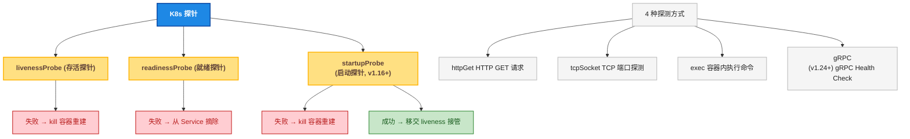
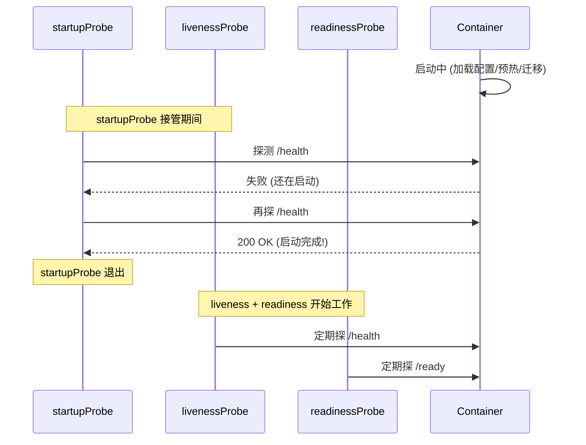
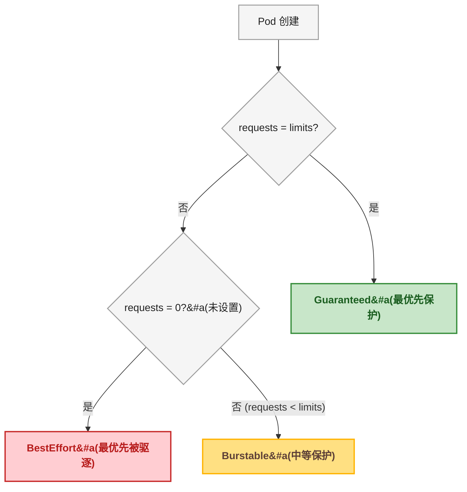
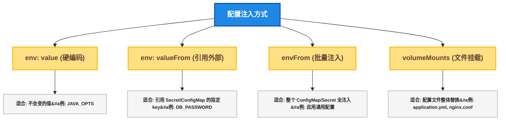
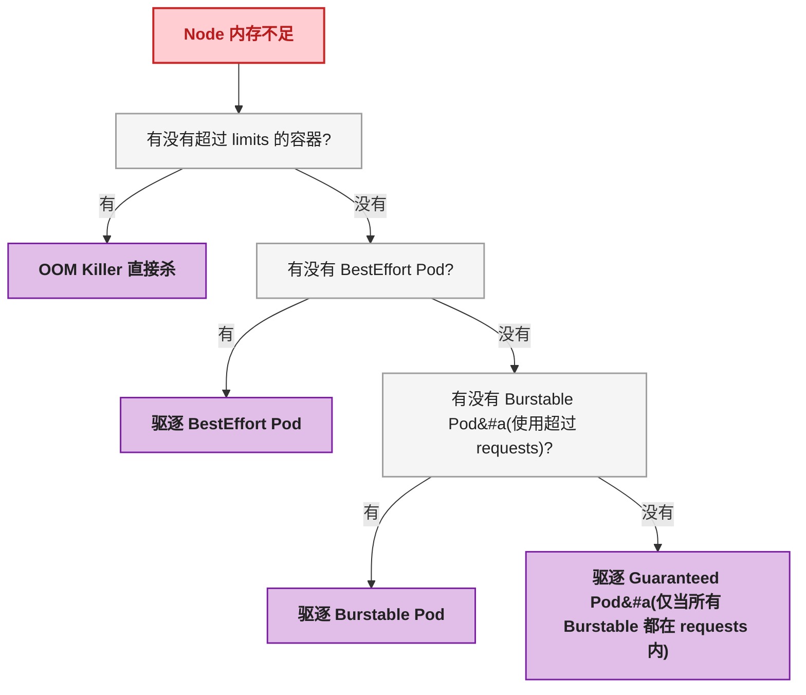

# 第2步：让 Pod 活得久一点 —— 探针、资源和配置注入实战

## 一、目标说明

上一篇文章成功部署了第一个 K8s 应用。但现实是——**Pod 不会永远乖乖 Running**。第二天打开监控一看：一个 Pod 被 OOMKilled，一个在 CrashLoopBackOff 无限重启，还有一个 Pending 了 3 小时没人管。

这篇文章要解决的就是：**怎么让 Pod 活得久、死得明白、配置配得清楚**。

读完这篇文章，读者能：

- 区分三种探针的适用场景，写出正确的探针配置
- 给容器设置合理的 resources 限制，避免 OOMKilled 和 CPU 被偷
- 掌握环境变量注入的 3 种方式及其选型标准
- 用 Volume Mount 把配置文件挂进 Pod
- 看懂 Pod 最常见的 6 种异常状态及其排查方向

---

## 二、前置条件

| 前置条件 | 要求 | 验证命令 |
|----------|------|----------|
| 已完成第 1 步 | 本地 K8s 能正常 deploy | `kubectl get deploy -n my-first-app` |
| 理解 Pod 基本概念 | 知道 Pod 里跑容器 | 看一眼第 0 步速查表即可 |
| 理解 Deployment 基本概念 | 知道 replicas、selector | 看一眼第 1 步 Deployment YAML 即可 |

---

## 三、环境准备

沿用第 1 步的环境，先重新部署一遍做基准：

```bash
kubectl apply -f ~/k8s-first-app/
kubectl get pods -n my-first-app -w
```

确认 2 个 Pod 都 Running 后继续。

---

## 四、分步实践

### 4.1 第一步：探针全景 —— 三种探针，四种探测方式

K8s 提供了 **3 种探针 × 4 种探测方式 = 12 种组合**。但 90% 的场景只需要掌握其中 3 ~ 4 种。



#### 4.1.1 httpGet —— 最常用，HTTP 服务首选

```yaml
livenessProbe:
  httpGet:
    path: /healthz
    port: 8080
    httpHeaders:                    # 可选：自定义请求头
    - name: X-Custom-Header
      value: probe
  initialDelaySeconds: 15          # 启动后等 15 秒
  periodSeconds: 10                # 每 10 秒探一次
  timeoutSeconds: 3                # 单次探测超时 3 秒
  failureThreshold: 3              # 连续失败 3 次才判定
  successThreshold: 1              # 连续成功 1 次即恢复
```

| 参数 | 默认值 | 含义 |
|------|:---:|------|
| `initialDelaySeconds` | 0 | 容器启动后等多久才开始探 |
| `periodSeconds` | 10 | 探测间隔 |
| `timeoutSeconds` | 1 | 单次探测超时时间 |
| `failureThreshold` | 3 | 连续失败多少次才判定失败 |
| `successThreshold` | 1 | 连续成功多少次才判定恢复 |

**关键理解：判定窗口**

```
failureThreshold=3, periodSeconds=10
→ 3 × 10 = 30 秒后判定失败
→ 第 1 次失败 + 10s + 第 2 次失败 + 10s + 第 3 次失败 = 判定失败
```

> ⚠️ 新手提示：`httpGet` 的返回值 **2xx 或 3xx 才算健康**，4xx 和 5xx 都算失败。如果你的 `/health` 端点在数据库断连时返回 503，Pod 就会被探针打死——如果你的 liveness 也在检查数据库的话。这就是很多人把 "/health" 端点逻辑写得过于复杂导致 Pod 反复重启的原因。**liveness 只查"进程本身还活着吗"，readiness 才查"依赖就绪了吗"。**

#### 4.1.2 tcpSocket —— 适用于非 HTTP 服务（数据库、Redis、gRPC）

```yaml
readinessProbe:
  tcpSocket:
    port: 6379                    # 能建立 TCP 连接就算健康
  initialDelaySeconds: 5
  periodSeconds: 5
```

简单粗暴——只要端口能连通，就算健康。适合 Redis、MySQL、PostgreSQL 这种非 HTTP 协议的服务。

#### 4.1.3 exec —— 最灵活，也最容易写出 Bug

```yaml
livenessProbe:
  exec:
    command:
    - sh
    - -c
    - |
      pgrep java && \
      curl -s http://localhost:8080/healthz | grep -q "UP"
  initialDelaySeconds: 20
  periodSeconds: 15
```

在容器内执行任意命令，**退出码为 0 就是健康**，非 0 就是失败。

> ⚠️ 新手提示：exec 探针的 `command` 是在**容器内**执行的。如果容器是基于 `alpine` 镜像（没有 `curl`，只有 `wget`），你的 `curl` 命令会直接报 `/bin/sh: curl: not found`——然后探针一直失败。务必确认基础镜像里有你需要的命令。

#### 4.1.4 startupProbe —— 拯救启动慢的应用

```yaml
startupProbe:
  httpGet:
    path: /health
    port: 8080
  initialDelaySeconds: 0
  periodSeconds: 5
  failureThreshold: 30            # 30 × 5s = 最长等 150 秒
```

startupProbe 存在期间，liveness 和 readiness **不会执行**。startupProbe 成功后，转交 liveness 接管。



**什么时候必须用 startupProbe？**

| 场景 | 不用 startupProbe | 用了 startupProbe |
|------|------------------|------------------|
| 应用启动要 60 秒 | liveness 的 `initialDelaySeconds=60`，启动后**一直无人检查** | startupProbe 每 5 秒检查一次，启动完**立刻**交棒 liveness |
| 启动有时快有时慢 | 设 60 秒太短→误杀，设 120 秒太长→真死了 2 分钟后才知道 | `failureThreshold=30`，最多等 150 秒，提前完成提前交棒 |

> ⚠️ 新手提示：如果应用启动需要 60 秒以上，**不要只调大 liveness 的 initialDelaySeconds**。设成 90 秒意味着：启动如果卡死了，也要 90 秒后才知道。用 startupProbe 既能给足启动时间，又能在启动完成后立即启用 liveness 保护。

### 4.2 第二步：资源限制 —— CPU 和内存的"生死线"

#### 4.2.1 requests vs limits 再深入

```yaml
resources:
  requests:            # K8s 调度时"口头承诺"给你留的量
    cpu: "100m"        # 100 millicores = 0.1 核
    memory: "128Mi"
  limits:              # 硬上限，超过就动手
    cpu: "500m"        # 最多用 0.5 核
    memory: "256Mi"
```

**CPU 超限 = 被限流（Throttling），不会死**：

<div style="max-width:640px;margin:16px auto;padding:12px;background:#F5F5F5;border:1.5px solid #9E9E9E;border-radius:8px;">

<div style="font-size:13px;font-weight:bold;color:#212121;margin-bottom:8px;">CPU Throttling 示意图（limits=200m, 实际用到 400m）</div>

<div style="display:flex;height:80px;gap:2px;align-items:flex-end;margin-bottom:8px;">
  <div style="flex:1;background:#C8E6C9;border-radius:2px 2px 0 0;height:100%;" title="0-100ms: 正常使用"></div>
  <div style="flex:1;background:#C8E6C9;border-radius:2px 2px 0 0;height:100%;" title="100-200ms: 正常使用"></div>
  <div style="flex:1;background:#FFCDD2;border-radius:2px 2px 0 0;height:60%;" title="200-300ms: 被限流!"></div>
  <div style="flex:1;background:#FFCDD2;border-radius:2px 2px 0 0;height:60%;" title="300-400ms: 被限流!"></div>
  <div style="flex:1;background:#C8E6C9;border-radius:2px 2px 0 0;height:100%;" title="400-500ms: 正常使用"></div>
</div>

<div style="font-size:11px;color:#616161;">每 100ms 为一个时间片，K8s 按 limits 分配 CPU 时间。超限部分被限流→应用变慢但不死。</div>

</div>

**内存超限 = OOMKilled，立刻死**：

```
Pod STATUS: OOMKilled
Exit Code: 137           # 137 = 128 + 9 (SIGKILL)
```

内存不像 CPU 可以"等一下再跑"——进程申请了内存，内核要么给、要么不给。不给→OOM Killer 出手→容器被杀→Pod 重建。

> ⚠️ 新手提示：JVM 应用要特别注意——`-Xmx` 设置的是**堆**上限，JVM 进程还额外需要 Metaspace、线程栈、Native Memory。如果 `-Xmx=200m`，容器 `limits.memory=256Mi`，大概率 OOMKilled。建议容器内存 limits 至少是 `-Xmx` 的 **1.3 ~ 1.5 倍**。

#### 4.2.2 三种 QoS 等级

K8s 根据 requests 和 limits 的配置关系，自动给 Pod 分等级：



| QoS | 条件 | Node 内存紧张时 |
|-----|------|----------------|
| **Guaranteed** | 每个容器都设了 requests = limits（且 > 0）| 最后被驱逐 |
| **Burstable** | 至少一个容器设了 requests，但不等于 limits | 在 BestEffort 之后被驱逐 |
| **BestEffort** | 没有任何容器设置 requests 或 limits | **第一个被驱逐** |

> ⚠️ 新手提示：生产环境**任何时候都不要用 BestEffort**。一个 BestEffort 的内存泄漏 Pod 会吃掉整个 Node 的内存，K8s 会先把所有 BestEffort Pod 杀一遍，然后是 Burstable，最后是 Guaranteed。你的核心服务如果是 Burstable，可能被别人的 BestEffort 连累。

### 4.3 第三步：环境变量注入 —— 三种方式，三种场景



#### 方式一：硬编码 `value`

```yaml
env:
- name: JAVA_OPTS
  value: "-Xms128m -Xmx256m -Duser.timezone=Asia/Shanghai"
```

适合跟环境无关、不会变的值。启动参数、时区设置这类。

#### 方式二：引用 `valueFrom`

```yaml
env:
- name: DB_PASSWORD
  valueFrom:
    secretKeyRef:
      name: app-secret
      key: DB_PASSWORD
- name: LOG_LEVEL
  valueFrom:
    configMapKeyRef:
      name: app-config
      key: LOG_LEVEL
```

逐 key 引用。环境变量名可以和 ConfigMap/Secret 里的 key 不同。

#### 方式三：批量注入 `envFrom`

```yaml
envFrom:
- configMapRef:
    name: app-config
- secretRef:
    name: app-secret
```

把整个 ConfigMap/Secret 的所有 key-value 都变成环境变量。**环境变量名 = key 名**。

> ⚠️ 新手提示：`envFrom` 会把整个 Secret 和 ConfigMap 一次性注入。如果 ConfigMap 有 100 个 key，你的应用就能读 100 个环境变量。这通常不是问题，但如果某个 key 刚好跟系统已有的环境变量重名（比如 `PATH`、`HOME`）——恭喜，覆盖掉了，排查到天亮。

#### 方式四：Volume Mount 文件挂载（配置文件的正确姿势）

环境变量适合简单的 key=value。**整个配置文件**（比如 `application.yml`、`nginx.conf`）用 Volume Mount：

```yaml
apiVersion: v1
kind: ConfigMap
metadata:
  name: nginx-config
  namespace: my-first-app
data:
  nginx.conf: |
    server {
        listen 80;
        server_name localhost;
        location / {
            root /usr/share/nginx/html;
        }
        location /api {
            proxy_pass http://backend-svc:8080;
        }
    }
---
# Deployment 中挂载
spec:
  containers:
  - name: nginx
    image: nginx:1.25-alpine
    volumeMounts:
    - name: nginx-config-volume
      mountPath: /etc/nginx/conf.d/default.conf    # 挂载到具体文件
      subPath: nginx.conf                           # 只挂这个 key, 不覆盖整个目录
  volumes:
  - name: nginx-config-volume
    configMap:
      name: nginx-config
```

**关键参数：**

| 参数 | 含义 |
|------|------|
| `mountPath` | 挂载到容器里的哪个路径 |
| `subPath` | 只挂载 ConfigMap 的**一个 key**，不覆盖 `mountPath` 目录下的其他文件 |

> ⚠️ 新手提示：**如果不用 `subPath`，ConfigMap 挂载会把目标目录整个覆盖掉**。比如 `/etc/nginx/conf.d/` 下面原本有 `default.conf`，挂载后只剩你 ConfigMap 里的那几个文件。用了 `subPath` 才会精确替换单个文件。

**环境变量 vs 文件挂载决策表：**

| 场景 | 用哪种 |
|------|--------|
| 几个简单的 key=value（端口、日志级别）| `env` / `envFrom` |
| 密码、Token、证书 | `env.valueFrom.secretKeyRef` |
| 整个 application.yml / nginx.conf | **Volume Mount + subPath** |
| 几千行的 JSON 配置 | **Volume Mount**（ConfigMap 上限 1MB） |

### 4.4 第四步：修改上一篇文章的 Deployment

把探针、资源、配置注入的知识整合，改写出一个"生产级"的 Deployment YAML：

```yaml
apiVersion: apps/v1
kind: Deployment
metadata:
  name: my-app-v2
  namespace: my-first-app
  labels:
    app: my-app
spec:
  replicas: 2
  selector:
    matchLabels:
      app: my-app
  template:
    metadata:
      labels:
        app: my-app
    spec:
      containers:
      - name: app
        image: nginx:1.25-alpine
        ports:
        - containerPort: 80
        env:
        - name: DB_PASSWORD
          valueFrom:
            secretKeyRef:
              name: app-secret
              key: DB_PASSWORD
        envFrom:
        - configMapRef:
            name: app-config
        resources:
          requests:                        # 要了 Guaranteed QoS
            memory: "64Mi"
            cpu: "100m"
          limits:
            memory: "64Mi"                 # requests = limits
            cpu: "100m"
        startupProbe:                      # 新增启动探针
          httpGet:
            path: /
            port: 80
          periodSeconds: 5
          failureThreshold: 12             # 最多等 60 秒启动
        livenessProbe:
          httpGet:
            path: /
            port: 80
          periodSeconds: 10
          failureThreshold: 3
        readinessProbe:
          httpGet:
            path: /
            port: 80
          periodSeconds: 5
          failureThreshold: 3
        volumeMounts:                      # 新增文件挂载
        - name: config-volume
          mountPath: /usr/share/nginx/html/index.html
          subPath: index.html
      volumes:
      - name: config-volume
        configMap:
          name: nginx-config
```

保存为 `03-deployment-v2.yaml`，apply：

```bash
kubectl apply -f 03-deployment-v2.yaml -n my-first-app
kubectl get pods -n my-first-app -w
```

---

## 五、部署验证与故障模拟

### 5.1 验证探针——故意让 liveness 失败

先确认 Pod 都在 Running：

```bash
kubectl get pods -n my-first-app
```

nginx 没有 `/healthz` 路径——如果之前的 liveness 设了这个路径，Pod 会一直被探针 kill。不过这正好验证了探针的"杀伤力"：把 liveness 的 `path` 改成一个**不存在的路径**，重新 apply，然后观察：

```bash
kubectl get pods -n my-first-app -w
```

应该看到 `RESTARTS` 列的数字不断增加——每次 liveness 失败都会重建容器。

### 5.2 验证资源限制——故意把内存 limits 设得过小

```yaml
resources:
  limits:
    memory: "8Mi"         # 8MB, nginx 绝对不够
```

apply 后 Pod 启动即 OOMKilled：

```bash
kubectl describe pod <pod-name> -n my-first-app | grep OOMKilled
```

### 5.3 验证文件挂载

```bash
kubectl exec -n my-first-app <pod-name> -- cat /usr/share/nginx/html/index.html
```

应该输出 ConfigMap 中的 nginx.conf 内容。

### 5.4 常见故障速查

以下 6 种状态是开发者日常一定会遇到的：

| 状态 | 含义 | 第一步排查 |
|------|------|-----------|
| **ImagePullBackOff** | 镜像拉不下来 | `kubectl describe pod` 看 Events → 镜像名拼错？registry 没配 Secret？ |
| **ErrImagePull** | 拉镜像失败（网络/权限）| 同上，也可能是 Docker Hub 限流 |
| **CrashLoopBackOff** | 启动后崩溃，反复重启 | `kubectl logs --previous <pod>` 看上一次崩溃日志 |
| **OOMKilled** | 内存超 limits | `kubectl describe pod` 看 State → Reason: OOMKilled |
| **Pending** | 无法调度 | `kubectl describe pod` → 资源不足？PVC 绑不上？Node 有污点？ |
| **CreateContainerConfigError** | ConfigMap/Secret 不存在或格式错误 | 检查 ConfigMap/Secret 是否已创建，key 名是否匹配 |

> ⚠️ 新手提示：`CrashLoopBackOff` 不要立刻手动重启。先 `kubectl logs --previous` 看上一次崩溃的日志——80% 的情况看日志就能定位。剩下的 20% 是配置问题（环境变量没注入、ConfigMap 挂载路径不对）。

---

## 六、原理简述

### 6.1 kubelet 的探针执行模型

kubelet 不是自己发 HTTP 请求去探 Pod，而是**在容器的网络命名空间中执行探测**。这意味着：

- `httpGet`：kubelet 通过 Pod 的网络命名空间发 HTTP 请求到 `localhost:port/path`
- `exec`：kubelet 直接在容器内（通过 CRI）执行命令
- `tcpSocket`：kubelet 在 Pod 的网络命名空间中尝试 TCP 连接

探针的执行**不占用容器的 CPU 配额**——由 kubelet 进程自己承担。

### 6.2 OOM Killer 的决策链

当 Node 内存不足时，K8s 的驱逐顺序（简化版）：



核心结论：**设了 limits 且 limits=requests（Guaranteed QoS）的 Pod 最安全。但设了 limits > requests（Burstable）的 Pod 可以利用 Burstable 的"弹性"——平时空闲的 CPU/内存被其他 Pod 共享，紧张时至少保证 requests 的量。**

---

## 七、总结与下一步

### 7.1 三个默认值你该记住

| 配置 | 不写的后果 | 推荐值 |
|------|-----------|--------|
| 没写 resources | QoS = BestEffort，随时被驱逐 | 至少写 requests |
| 没写 livenessProbe | 进程僵死 K8s 不知道，永远不重启 | httpGet `/health` periodSeconds=10 |
| 没写 readinessProbe | Pod 启动后立刻接流量（可能还没 Ready） | httpGet `/ready` periodSeconds=5 |

### 7.2 配置优先级速查

```
ConfigMap/Secret 更新后:
  - env (环境变量方式): Pod 不重启不生效, 必须 kubectl rollout restart
  - volumeMount (文件挂载方式): ConfigMap 更新后约 60 ~ 90 秒自动同步到容器内
                                  (kubelet 定时 sync, 不是实时的!)
```

### 7.3 下一步

下一篇文章《第 3 步：kubectl 生存手册》将涵盖开发者每天必用的 kubectl 命令：

- `get` / `describe` / `logs` / `exec` / `port-forward` 的进阶用法
- `rollout restart` / `rollout undo` / `rollout history`
- 9 种 Pod 异常状态的完整排查流程
- `--tail` / `-f` / `--previous` / `--sort-by` 等实用技巧
