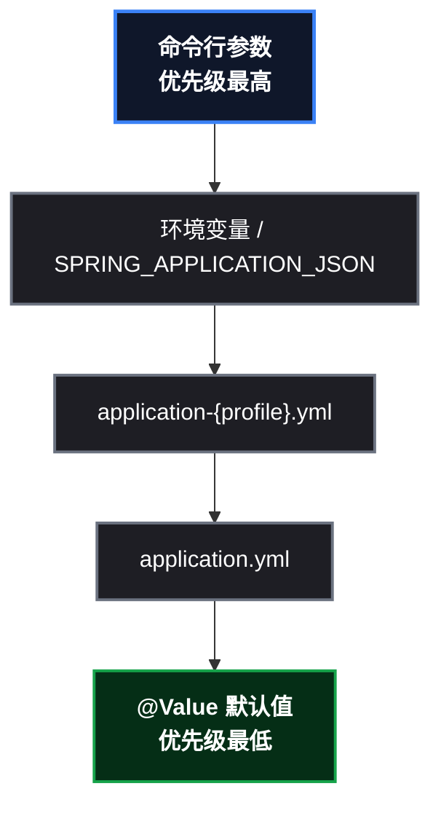

# Spring Boot 上 K8s 的第一课：打包镜像，注入配置

前面三篇用 nginx 把集群、Deployment、Service/Ingress 都打通了，但从这一篇开始，画风要变——**主角换成真实的 Spring Boot 应用**。毕竟我们是 Java 开发者，最终上云（ACK/AWS）跑的是自己的微服务，不是 nginx。这篇完成两件事：把 Spring Boot 应用**容器化**（多阶段构建 + 瘦身），再把配置从代码里**搬到集群里**（ConfigMap/Secret 注入）。学完你就掌握了"镜像一份，配置到处变"的核心玩法。

> 📌 前置知识：建议先读本系列前三篇（kind 集群搭建、Deployment 实战、Service/Ingress 实战），本文的操作都在同一套 kind 集群上进行，镜像预载（ ` kind load ` ）的原理不再展开。

## 这次要做什么

```
目标：把一个真实 Spring Boot 应用部署进 kind 集群，配置由集群注入
产出：多阶段构建的镜像 + ConfigMap/Secret 注入的配置 + 验证"配置覆盖代码默认值"
主角：k8s-demo-app（Spring Boot 3.3.5 / Java 17）
```

主角应用很小但五脏俱全：`/api/hello` 返回配置值和当前 Pod 名，Actuator 暴露健康检查端点（为下篇探针做准备），内置优雅停机配置（为下下篇做准备）。

## 前置条件

| 项 | 本次实测 |
|---|---|
| 集群 | kind ` learn ` （1 主 2 从，K8s v1.36.1） |
| 工具 | docker + kubectl，宿主机 Docker 已配代理 |
| 网络 | 国内环境：构建期依赖下载走代理，镜像预载用 `kind load` |

## 第1步：一个真实的 Spring Boot 应用

工程结构：

```
k8s-demo-app/
├── pom.xml                          # Spring Boot 3.3.5 + web + actuator
├── Dockerfile
└── src/main/
    ├── java/com/demo/k8s/
    │   ├── DemoApplication.java     # 启动类
    │   └── HelloController.java     # /api/hello
    └── resources/application.yml
```

关键代码（配置注入的验证点）：

```java
@RestController
public class HelloController {

    @Value("${app.message:hello-from-config-default}")
    private String message;

    @GetMapping("/api/hello")
    public String hello() throws Exception {
        String pod = InetAddress.getLocalHost().getHostName();
        return "{\"message\":\"" + message + "\", \"pod\":\"" + pod + "\"}";
    }
}
```

`@Value` 的默认值 `hello-from-config-default` 就是用来做"注入对比"的：如果集群注入生效，返回的 message 会变成别的值。

application.yml 里的两个预埋（后面两篇的伏笔）：

```yaml
server:
  shutdown: graceful              # 优雅停机（下下篇）
spring:
  lifecycle:
    timeout-per-shutdown-phase: 30s
management:
  endpoint:
    health:
      probes:
        enabled: true             # 暴露 /actuator/health/liveness 等探针端点（下篇）
```

## 第2步：多阶段 Dockerfile（本篇核心）

```dockerfile
# ---- 阶段 1: 构建 ----
FROM maven:3.9-eclipse-temurin-17 AS build
WORKDIR /app
COPY pom.xml .
RUN mvn dependency:go-offline -B        # 先下载依赖, 单独成层
COPY src ./src
RUN mvn package -DskipTests -B          # 再编译打包

# ---- 阶段 2: 运行 (只留 JRE) ----
FROM eclipse-temurin:17-jre
WORKDIR /app
COPY --from=build /app/target/k8s-demo-app-1.0.0.jar app.jar
EXPOSE 8080
ENTRYPOINT ["java", "-XX:MaxRAMPercentage=75", "-jar", "app.jar"]
```

逐行拆解：

| Dockerfile 设计 | 目的 | 收益 |
|---|---|---|
| 两个 FROM（构建/运行分离） | 编译需要 JDK+Maven，运行只需要 JRE | 镜像从 504MB 瘦身到 **317MB** |
| 先 COPY pom.xml 再 COPY src | 依赖下载独立成层 | 改代码重建时跳过下载，秒级完成 |
| `-XX:MaxRAMPercentage=75` | JVM 按容器内存限制自适应堆大小 | 防 OOM（本系列第五篇展开） |

> ⚠️ 新手提示：**首次构建 20 分钟不是"打包慢"，是"下载依赖慢"**。Spring Boot 全家桶有上千个小文件，走代理时每个文件都有握手延迟，密集小文件是主要耗时；编译本身只要几秒。生产环境用阿里云公共 Maven 镜像（` maven.aliyun.com `）+ CI 缓存 ` ~/.m2 `，首次构建能压到 2 ~ 3 分钟。

构建命令：

```bash
docker build -t k8s-demo-app:1.0 .
```

## 第3步：本地冒烟测试（进集群前先验证）

```bash
docker run -d --name demo-test -p 18080:8080 k8s-demo-app:1.0
sleep 18   # 等 JVM 起来
curl http://127.0.0.1:18080/api/hello
# {"message":"hello-from-config-default", "pod":"154f82799289"}   ← 默认值
curl http://127.0.0.1:18080/actuator/health
# {"status":"UP","groups":["liveness","readiness"]}               ← 探针端点已就绪
docker rm -f demo-test
```

> ⚠️ 新手提示：镜像先在本机跑通再进集群，能省掉大量集群内的排障时间。这一步验证的是"jar 本身没问题"，集群部署只验证"调度和注入"。

## 第4步：镜像进集群

```bash
kind load docker-image k8s-demo-app:1.0 --name learn
```

> 📌 原理回顾（详见系列第二篇）：kind 节点内的 containerd 不走宿主 Docker 代理，所以先拉到宿主机再一次性导入所有节点。

## 第5步：创建 ConfigMap 与 Secret

```yaml
# configmap: 普通配置
apiVersion: v1
kind: ConfigMap
metadata:
  name: demo-config
data:
  APP_MESSAGE: "hello-from-k8s-configmap"
  APP_MODE: "production"
```

```yaml
# secret: 敏感信息
apiVersion: v1
kind: Secret
metadata:
  name: demo-secret
type: Opaque
stringData:
  DB_PASSWORD: "S3cr3t-P@ss"
```

> 📌 概念辨析：Secret 里的值只是 **base64 编码**，不是加密！K8s 负责的是"传输加密 + 权限隔离"，不是数据加密。数据库密码这类敏感信息，配合挂载成文件使用（见下一步）。

## 第6步：Deployment 三种注入姿势

```yaml
apiVersion: apps/v1
kind: Deployment
metadata:
  name: demo-app
spec:
  replicas: 2
  selector:
    matchLabels:
      app: demo-app
  template:
    metadata:
      labels:
        app: demo-app
    spec:
      containers:
      - name: demo
        image: k8s-demo-app:1.0
        ports:
        - containerPort: 8080
        envFrom:                      # 姿势1: 整包注入 ConfigMap
        - configMapRef:
            name: demo-config
        env:
        - name: DB_PASSWORD           # 姿势2: 单值注入 Secret
          valueFrom:
            secretKeyRef:
              name: demo-secret
              key: DB_PASSWORD
        volumeMounts:                 # 姿势3: 挂载成文件
        - name: secret-volume
          mountPath: /etc/app-secret
          readOnly: true
      volumes:
      - name: secret-volume
        secret:
          secretName: demo-secret
```

| 姿势 | 适用场景 |
|---|---|
| `envFrom` 整包注入 | 一组配置整体注入（注意：键名必须符合环境变量命名规范，含点号的键会被跳过并产生事件） |
| `secretKeyRef` 单值 | 挑出个别敏感项注入 |
| 挂载成文件 | 数据库密码、TLS 证书等，应用按路径读取 |

## 第7步：验证注入结果

```bash
# 1. Pod 里的环境变量
kubectl exec <pod> -- env | grep -E "APP_MESSAGE|APP_MODE|DB_PASSWORD"
# APP_MESSAGE=hello-from-k8s-configmap
# APP_MODE=production
# DB_PASSWORD=S3cr3t-P@ss

# 2. Secret 挂载的文件
kubectl exec <pod> -- cat /etc/app-secret/DB_PASSWORD
# S3cr3t-P@ss

# 3. 应用实际读到的配置（重点!）
kubectl run dns-test --image=busybox:1.36 --restart=Never --command -- sleep 3600
kubectl exec dns-test -- wget -qO- http://demo-app-svc:8080/api/hello
# {"message":"hello-from-k8s-configmap", "pod":"demo-app-579cfc4fbb-fvhs2"}
```

注意第 3 步的输出：**message 从代码默认值变成了集群注入值**——配置外部化验证成功。

## 原理：为什么环境变量能覆盖 Spring 配置

### 配置优先级



### 宽松绑定（Relaxed Binding）

Spring Boot 会把环境变量名**自动映射**到属性名： ` APP_MESSAGE ` → ` app.message ` （大写转小写、下划线转点号）。所以 K8s 注入的环境变量**天然就是 Spring 配置**，应用代码零改动。这就是"镜像一份，配置到处变"的实现基础——同一个镜像，在 dev/test/prod 集群里被不同 ConfigMap 注入，行为就不同。

## 与 Nacos Config 的取舍（Java 开发者必做决策）

| 维度 | ConfigMap | Nacos Config |
|---|---|---|
| 配置位置 | 随应用所在集群 | 独立配置中心 |
| 动态刷新 | 需额外机制（如 reloader） | 原生支持 |
| 灰度/历史版本 | 无 | 原生支持 |
| 简单配置 | ✅ 足够 | 杀鸡用牛刀 |
| 微服务多环境 | 每环境一份 | 命名空间分组管理 |

**结论**：简单配置（端口、日志级别、开关）用 ConfigMap 就好；需要灰度发布、历史版本、动态刷新的复杂配置，保留 Nacos（把 Nacos 部署进集群即可）。两者可以共存：敏感信息放 Secret，业务配置放 Nacos。

## 总结与下一步

### 本课收获速查

| 概念 | 证据 |
|---|---|
| 多阶段构建 | 504MB → 317MB |
| 分层缓存 | 改代码重建秒级完成 |
| 首次构建慢的真相 | 上千小文件下载 > 编译本身 |
| 三种注入姿势 | envFrom / secretKeyRef / 挂载文件 |
| 宽松绑定 | ` APP_MESSAGE ` → ` app.message ` ，零代码改动 |
| 配置优先级 | 环境变量 > application.yml > 默认值 |
| Secret 本质 | base64 存储 + 权限隔离，非加密 |

### 踩坑速查

| 坑 | 现象 | 解法 |
|---|---|---|
| 首次构建 20 分钟 | 卡在下载依赖 | 阿里云 Maven 镜像 + CI 缓存；层缓存保后续快 |
| 镜像进集群拉不到 | ImagePullBackOff | `kind load` 预载（节点 containerd 不走代理） |
| 环境变量注入不生效 | 键含点号被跳过 | 键名符合环境变量规范，或改用 `configMapKeyRef` 单值 |

### 下一步

本系列将从"把应用部署上去"进入"**让应用活得好**"：探针三兄弟（startup/readiness/liveness，应用已内置探针端点）、优雅停机（应用已内置 graceful 配置）、JVM 资源管理（ ` MaxRAMPercentage ` 的实战验证）——都是 Java 应用上 K8s 的生死线。

系列文章：kind 搭建集群 → Deployment 实战 → Service/Ingress 实战 → Spring Boot 容器化与配置注入（本篇）→ 探针/优雅停机/资源管理。
