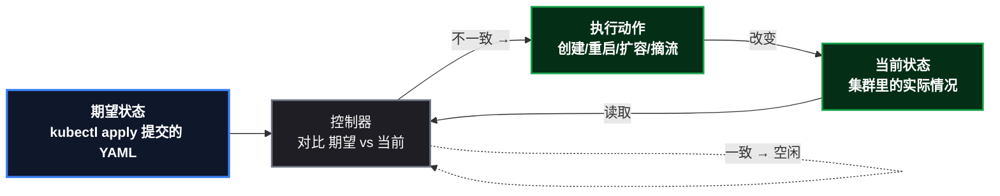

# 先回答为什么，再谈怎么用

这是系列的自我批评篇，也是**全系列的导航页**。回看前十三篇文章，我发现一个通病：每篇都把"K8s 怎么做"讲得很细——清单、命令、预期输出、踩坑，可复现性拉满；但"**为什么必须这么做**"几乎没讲——没有 K8s 之前，同样的流程是怎么跑的？痛点在哪？K8s 的机制到底回应了什么？

作为 Java 开发者，你手里握着最好的参照系：**Spring Cloud 时代的微服务**。Nacos 配置中心、Eureka 注册中心、停机发布、人工巡检——这些痛点我们亲历过。这篇就用它当镜子，逐话题对照 K8s 的设计回应，每个话题都附上对应教程的链接——**先看这篇理解"为什么"，再点链接去"怎么做"**。

> 📌 系列结构：环境搭建见 [kind 集群实战](/posts/kubernetes/KindLocalK8sClusterSetup/)，开发者总览见 [Java 开发工程师的 K8s 职责清单](/posts/kubernetes/JavaDeveloperK8sChecklist/)。

## 1. 总设计思想：声明式 + 控制回路

K8s 所有机制的地基是两个思想，先立起来：

- **声明式（Declarative）**：你不说"怎么做到"，只说"我要什么"。传统方式是命令式——"把包拷到这台机器、改这个配置、重启这个进程"；K8s 方式是"**这是我想要的最终状态（YAML），你来实现**"。
- **控制回路（Control Loop）**：K8s 的控制器永远在循环"当前状态 vs 期望状态"——不一致就动手收敛，一致就闲着。这跟空调温控一个原理：设定 26 度（期望），温度计（当前），制冷/制热（动作），周而复始。

**这个思想替代了什么**：传统运维的"巡检 + 手动修复"是**人肉控制回路**——人发现、人决策、人执行，慢且会忘。K8s 把回路自动化了。下面七个话题，全是这个思想的展开。

## 2. 七话题对照：Spring Cloud 时代 vs K8s 时代

### 2.1 配置管理：配置中心 vs ConfigMap

**传统做法**：Spring Cloud 时代用 Nacos/Spring Cloud Config 当配置中心——配置放服务端，应用启动时拉取，支持动态刷新。听起来挺好，但有两个隐性成本：配置中心本身是**要运维的高可用组件**（它挂了全链路启动失败）；配置变更的"审计"靠自觉。

**痛点**：小团队为了"改个数据库地址"，要维护一个配置中心集群；而部署层的差异（这个环境连哪套库）还是靠人肉保证。

**K8s 的回应**：ConfigMap/Secret 把"部署态配置"下沉到平台——镜像里不写环境差异，Pod 启动时注入。**分工变了**：部署态（环境差异、版本差异）交给 K8s，运行态（业务开关、动态调参）继续留在配置中心。不是替代，是各归其位。

> 📌 设计思想：**配置与代码分离**。镜像只有一份，环境差异由注入解决——"同一镜像跑三个环境"从此成立。

📎 **深入阅读**：[配置注入实战（课3）](/posts/kubernetes/SpringBootContainerizeAndConfig/)

### 2.2 服务发现：注册中心 vs Service

**传统做法**：Eureka/Nacos 注册中心——服务启动时注册自己的 IP 端口，消费者轮询拉取实例列表。维护注册中心本身是工作；实例上下线有"感知延迟"（心跳超时一般几十秒）；跨环境（dev/prod）还得各起一套。

**痛点**：**IP 是会变的**——实例重建、扩缩容、故障替换，谁在变、变成什么，全靠注册中心这个"中间人"传话。

**K8s 的回应**：Service 用**逻辑名 + 虚拟 IP** 把"服务是谁"和"实例在哪"彻底解耦—— ` demo-app-svc:8080 ` 永远指向"当前所有健康副本"，Pod 死了换新的，DNS 不用动、消费者不用动。kube-proxy 在数据面实时维护转发规则。

> 📌 设计思想：**逻辑标识与物理实例解耦**。这是分布式系统最古老也最有效的解药——"不要依赖会变的地址"。

📎 **深入阅读**：[Service/Ingress 实战（课2）](/posts/kubernetes/K8sServiceIngressPractice/)

### 2.3 健康与恢复：监控告警 vs 探针控制回路

**传统做法**：应用挂了——监控系统发现指标异常 → 告警 → 值班人 SSH 上去看日志 → 手动重启/摘流。**人肉控制回路**，从故障发生到恢复，最快也要几分钟。

**痛点**：恢复时间 = 人的响应时间。凌晨三点，告警电话响，爬起来开电脑。

**K8s 的回应**：探针（readiness/liveness/startup）让 **kubelet 替人做判定和干预**——健康检查失败，摘流量、重启，全程无人参与，恢复时间从"分钟级"压到"秒级"。人只负责写对探针配置。

> 📌 设计思想：**控制回路自动化**。把"发现→决策→执行"从人肉循环变成程序循环——这是 K8s 相对传统运维最本质的飞跃。

📎 **深入阅读**：[探针三兄弟实战（课4）](/posts/kubernetes/K8sProbesPractice/)

### 2.4 发布升级：停机窗口 vs 滚动 + 优雅停机

**传统做法**：发版 = 选个凌晨低峰，停服 → 备份 → 替换包 → 重启 → 验证 → 开服。**停机窗口**是常态，"发版不断连"是奢望。

**痛点**：发布即事故高发时段；回滚靠备份还原，慢且容易出二次事故。

**K8s 的回应**：Deployment 滚动更新（新副本先起、就绪后才摘旧的）+ 优雅停机三层配合（readiness 摘流 → preStop 缓冲 → 应用处理在途）——**发版不再需要窗口**，任何时间点发，流量无缝切换。回滚 = `kubectl rollout undo` 一条命令。

> 📌 设计思想：**不可变基础设施**。不"修改"运行的实例，而是"替换"——新实例就绪才销毁旧实例，永远有可用副本。这是滚动、回滚、灰度一切发布能力的地基。

📎 **深入阅读**：[镜像构建与 Deployment（课1）](/posts/kubernetes/K8sDeploymentHandsOn/)、[优雅停机与资源管理（课5）](/posts/kubernetes/K8sGracefulShutdownResources/)

### 2.5 弹性伸缩：容量评估 vs 资源配额 + 自动伸缩

**传统做法**：容量靠"预估 + 买机器"——大促前扩容，平时闲置。Java 应用的内存问题靠"这台机器跑几个实例"的经验法则。

**痛点**：预估永远不准——预估多了浪费钱，预估少了扛不住；扩容要买机器、装环境、配负载均衡，按天计。

**K8s 的回应**：requests/limits 把资源变成**可声明的配额**（调度按申请、运行按上限），HPA 按指标自动扩缩副本，节点池按需扩缩机器——**弹性从"运维操作"变成"平台行为"**。

> 📌 设计思想：**资源即 API**。资源不再是"机器上的模糊概念"，而是可声明、可度量、可调度的第一等公民。

📎 **深入阅读**：[资源账本与 OOM 实测（课5）](/posts/kubernetes/K8sGracefulShutdownResources/)

### 2.6 存储：本地盘 vs PV/PVC 动态供应

**传统做法**：有状态服务（Redis、ES）的数据在服务器本地盘——挂盘靠运维手工，扩容靠"停机 + 搬数据"，机器坏了数据跟着遭殃。

**痛点**：**存储与计算绑定**——数据绑死在某台机器上，一切迁移都变灾难。

**K8s 的回应**：PV/PVC/StorageClass 把存储从机器上剥离——开发者声明"我要 100Mi"，StorageClass 动态供应（云上自动建云盘），Pod 调度到哪、数据跟到哪（跨节点重挂载）。StatefulSet 给有状态服务稳定标识和专属盘。

> 📌 设计思想：**存储与计算解耦**。状态从"机器的属性"变成"集群的资源"。

📎 **深入阅读**：[StatefulSet 与存储实战（课7）](/posts/kubernetes/K8sStatefulSetStoragePractice/)

### 2.7 可观测性：自建监控 vs 指标即契约

**传统做法**：Micrometer 暴露指标，自己搭 Prometheus/Grafana 采集展示——**这套在 K8s 内外其实一样**，因为可观测性是应用侧契约。

**但平台侧变了**：K8s 时代，探针（控制回路）和指标（观察回路）共用同一套 Actuator 端点；集群本身的健康（节点、Pod、调度）也变成可观测对象。**观察范围从"应用"扩展到"应用 + 平台"**。

> 📌 设计思想：**可观测性是应用的交付物之一**——不是上线后补的，是清单里写的。

📎 **深入阅读**：[可观测性实战（课6）](/posts/kubernetes/K8sObservabilityPractice/)

## 3. 一张总对照表

| 话题 | Spring Cloud 传统方式 | 痛点 | K8s 机制 | 设计思想 | 对应教程 |
|------|------|------|------|------|------|
| 配置 | Nacos 配置中心 | 配置中心要运维、环境靠人肉 | ConfigMap/Secret | 配置与代码分离 | [课3](/posts/kubernetes/SpringBootContainerizeAndConfig/) |
| 服务发现 | Eureka 注册中心 | IP 会变、感知延迟 | Service + DNS | 逻辑名与实例解耦 | [课2](/posts/kubernetes/K8sServiceIngressPractice/) |
| 健康恢复 | 监控告警 + 人肉重启 | 恢复 = 人的响应时间 | 探针控制回路 | 回路自动化 | [课4](/posts/kubernetes/K8sProbesPractice/) |
| 发布 | 停机窗口 + 替换包 | 发布即事故、回滚难 | 滚动 + 优雅停机 | 不可变基础设施 | [课1](/posts/kubernetes/K8sDeploymentHandsOn/)、[课5](/posts/kubernetes/K8sGracefulShutdownResources/) |
| 弹性 | 预估容量 + 买机器 | 预估不准、扩缩容按天 | requests/limits + HPA | 资源即 API | [课5](/posts/kubernetes/K8sGracefulShutdownResources/) |
| 存储 | 本地盘 + 手工挂载 | 数据绑死机器 | PV/PVC/StorageClass | 存储与计算解耦 | [课7](/posts/kubernetes/K8sStatefulSetStoragePractice/) |
| 可观测 | 自建监控 | 平台侧盲区 | 指标契约 + 平台监控 | 可观测即交付物 | [课6](/posts/kubernetes/K8sObservabilityPractice/) |

**读法**：每一行都是一个"痛点 → 回应 → 深入"的完整路径——先看痛点理解"为什么"，点链接去教程复现"怎么做"。系列的每一课，都是这张表某一行在 kind 上的展开。

## 4. 对 Java 开发者的意义

这套"为什么"对 Java 开发者不是理论——它直接回答了一个现实问题：**Spring Cloud 那套还要不要学、学什么**。

- **注册中心/配置中心**：K8s 接管了"部署态"的服务发现和配置（Service/ConfigMap），但**运行态的注册中心（服务间治理）和配置中心（动态刷新）依然有存在价值**——微服务架构里 Nacos 不会消失，只是职责收窄到"应用级治理"，不再负责"基础设施级发现"。
- **网关**：Ingress 接管了南北向的 7 层路由，Spring Cloud Gateway 退回到"东西向/业务级网关"（鉴权、聚合）。
- **熔断限流（Sentinel/Hystrix）**：K8s 没有原生的熔断限流——这仍是应用层的活，K8s 管不了你的业务容错。
- **优雅停机**：Spring Boot 的 graceful 配置 K8s 没有替代，它是三层配合中的应用侧那一层。

一句话：**K8s 吃掉的是"运维痛苦"这一层，保留的是"业务治理"这一层**。知道哪些被吃掉了，才知道自己该学什么——这也是 [Java 开发者职责清单](/posts/kubernetes/JavaDeveloperK8sChecklist/)（八项必修/三类免学）背后的逻辑。

## 5. 总结

系列前十三篇回答了"K8s 是什么、怎么用"，这篇回答"为什么是它"。三个记忆点：

1. **一切机制源于两个思想**：声明式（说想要什么）+ 控制回路（不断收敛）——探针、滚动、伸缩、自愈全是回路的变体；
2. **每个 K8s 组件都对应一个传统痛点**：配置中心要运维、IP 会变、恢复靠人、发布要窗口、容量靠估、数据绑机器——K8s 是逐个痛点给出的工程回应；
3. **对 Java 开发者**：K8s 接管"运维痛苦层"，保留"业务治理层"——学 K8s 不是推翻 Spring Cloud，是给 Spring Cloud 补上它管不了的那一层。

补上了"为什么"，系列才算完整。后续文章也会按这个标准写：先讲传统怎么做、痛点在哪，再讲 K8s 的机制——把"为什么"变成每篇的固定开场。云上选型的两家对比见 [EKS 与 ACK 托管对比](/posts/kubernetes/EksVsAckComparison/)。

