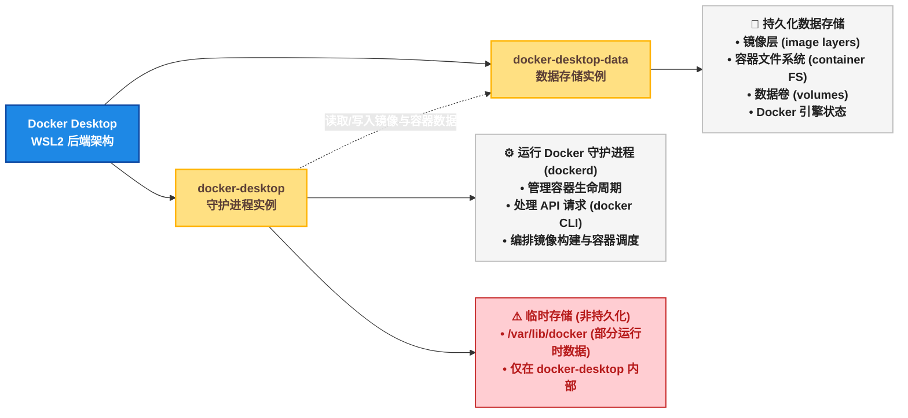
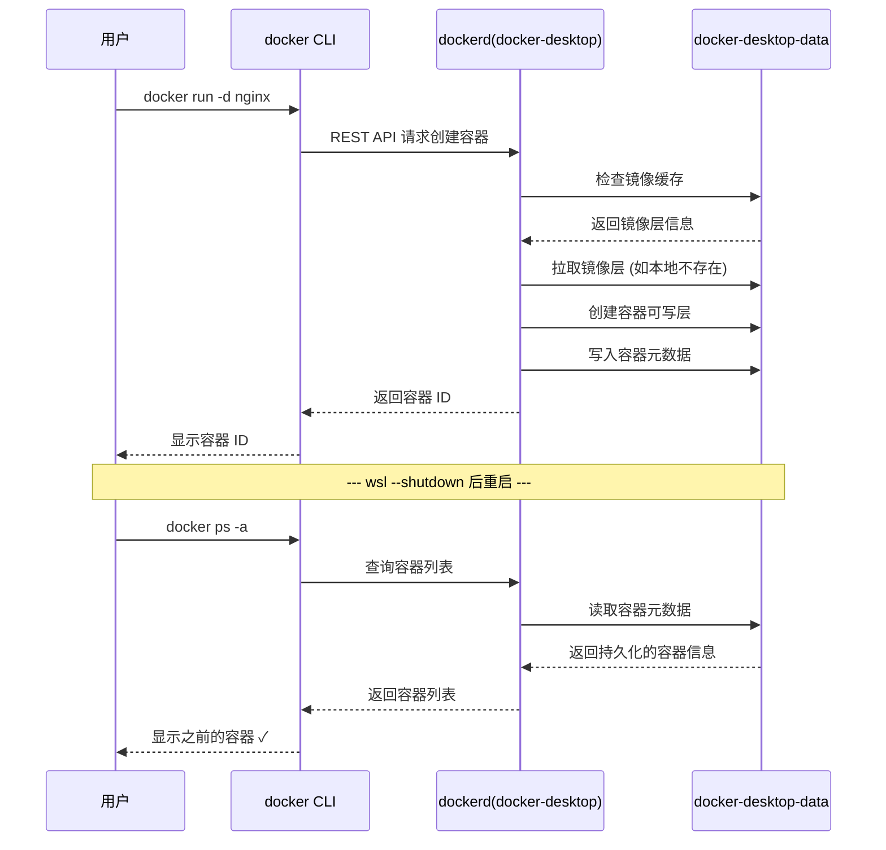
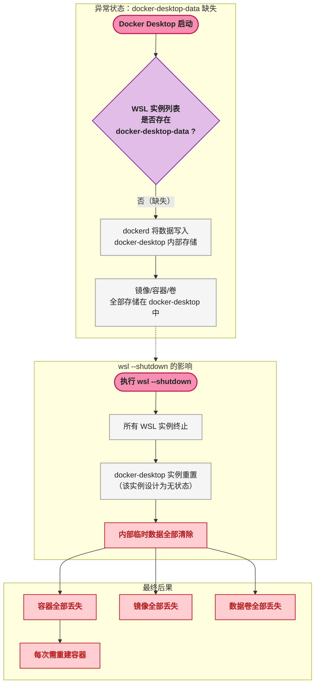
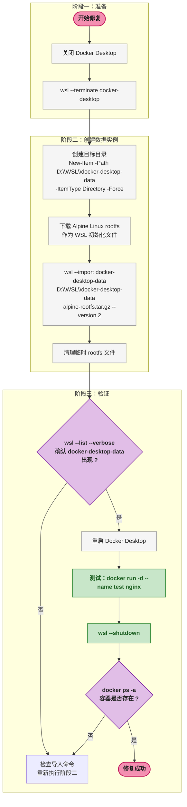

# ☸️ WSL2 Docker 数据持久化：docker-desktop-data 缺失导致容器丢失的诊断与修复

## 📌 一、问题场景

在日常开发中，使用 Docker Desktop + WSL2 后端是一个常见组合。然而部分开发者在执行 `wsl --shutdown` 后，重新打开终端时发现一个严重问题： **之前创建的所有容器、镜像、数据卷全部消失** 。

以下是一个典型的问题复现过程：

```bash
#  1. 正常使用 Docker，创建测试容器
$ docker run -d --name my-app -p 8080:80 nginx
Unable to find image 'nginx:latest' locally
latest: Pulling from library/nginx
...
cc3c2e0be814: Pull complete
Status: Downloaded newer image for nginx:latest
a1b2c3d4e5f6...  # 容器启动成功

#  2. 确认容器正在运行
$ docker ps
CONTAINER ID   IMAGE     COMMAND                  CREATED         STATUS         PORTS                  NAMES
a1b2c3d4e5f6   nginx     "/docker-entrypoint.…"   5 seconds ago   Up 5 seconds   0.0.0.0:8080->80/tcp   my-app

#  3. 手动执行 WSL 关闭（或系统重启触发）
$ wsl --shutdown

#  4. 重新打开终端，检查容器
$ docker ps -a
CONTAINER ID   IMAGE     COMMAND   CREATED   STATUS    PORTS     NAMES
#  输出为空 —— 所有容器消失！
```

这个场景的核心问题在于：Docker Desktop 在 WSL2 中的持久化数据没有被正确保存，导致 `wsl --shutdown` 后所有状态丢失。本文将深入分析根因并提供完整的修复方案。

## 🔍 二、Docker Desktop 在 WSL2 中的架构

要理解数据为什么丢失，首先需要搞清楚 Docker Desktop 在 WSL2 模式下的内部架构。

### 🔢 2.1 核心组件

Docker Desktop 在 WSL2 中运行时会创建 **两个** WSL 发行版（WSL Distribution），各自承担不同的职责：



### 🛠️ 2.2 两个 WSL 实例的职责对比

| 组件 | WSL 实例名称 | 核心职责 | 数据持久性 | `wsl --shutdown` 后 |
|------|-------------|---------|:---:|:---:|
| **守护进程实例** | `docker-desktop` | 运行 Docker 守护进程（dockerd），处理 CLI 请求 | 运行时临时数据 | 重置（临时数据丢失） |
| **数据存储实例** | `docker-desktop-data` | 存储镜像层、容器文件系统、数据卷、网络配置等 | **持久化存储** | 数据保留（存储在独立 VHD 中） |

两者的关系可以概括为： `docker-desktop` 是 **计算层** ， `docker-desktop-data` 是 **存储层** 。Docker 守护进程在 `docker-desktop` 中运行，但所有需要持久化的数据都写入 `docker-desktop-data` 对应的虚拟磁盘文件中。

### 🔢 2.3 正常状态下的数据流



在正常情况下， `docker-desktop-data` 独立存储所有持久化数据， `wsl --shutdown` 后守护进程重启时能够从数据实例中恢复完整状态。

## ⚙️ 三、问题根因分析

### 🔢 3.1 故障状态的架构

当 `docker-desktop-data` 实例缺失时，系统处于以下异常状态：



### 🛠️ 3.2 为什么安装路径（C盘/D盘）不是根因

很多用户将 WSL2 安装在 D 盘，遇到问题后第一反应是"磁盘路径有问题"。但实际上：

| 因素 | 与问题的关系 | 说明 |
|------|:---:|------|
| WSL 安装在 C 盘 | 无直接关系 | 默认安装同样可能出现此问题 |
| WSL 安装在 D 盘 | 无直接关系 | 只是 VHD 文件存放位置不同 |
| Docker Desktop 安装路径 | 无直接关系 | 问题出在 WSL 实例层面 |
| **docker-desktop-data 实例缺失** | **直接根因** | 缺少持久化存储目标 |

问题本质是 **Docker Desktop 初始化 WSL2 后端时未能正确创建 `docker-desktop-data` 实例** ，导致持久化数据无处存放。这与磁盘分区、安装路径无关。

### ✅ 3.3 如何确认自己是否遇到此问题

```bash
#  检查 WSL 实例列表
$ wsl --list --verbose
  NAME                   STATE           VERSION
* docker-desktop         Running         2
```

如果输出中 **只有** `docker-desktop` 而 **缺少** `docker-desktop-data` ，则你的环境存在本文描述的问题。正常环境应同时出现两个实例：

```bash
#  正常环境的输出
$ wsl --list --verbose
  NAME                   STATE           VERSION
* docker-desktop         Running         2
  docker-desktop-data    Stopped         2
```

## 📊 四、解决方案

### 🔢 4.1 整体修复流程

以下是完整的修复流程概览：



### 🔢 4.2 详细操作步骤

#### 🛠️ 步骤一：准备工作

首先关闭 Docker Desktop，可以通过系统托盘图标右键退出，然后终止 WSL 中正在运行的 `docker-desktop` 实例：

```powershell
#  在 PowerShell（管理员权限）中执行
wsl --terminate docker-desktop
```

`--terminate` 会优雅终止指定 WSL 实例中的所有进程，比 `--shutdown` （终止所有实例）更精准。

#### 📥 步骤二：下载 Alpine Linux rootfs

WSL 的 `--import` 命令需要一个合法的 Linux rootfs 文件作为初始化的种子。这里选择 Alpine Linux，因为它体积小（约 3 MB）：

```powershell
#  下载 Alpine mini rootfs
Invoke-WebRequest -Uri "https://dl-cdn.alpinelinux.org/alpine/v3.19/releases/x86_64/alpine-minirootfs-3.19.0-x86_64.tar.gz" -OutFile "D:\alpine-rootfs.tar.gz"
```

`rootfs` （Root Filesystem）是 Linux 系统的最小文件系统骨架，包含 `/bin` 、 `/etc` 、 `/lib` 等基础目录结构。WSL 用它初始化新实例的根文件系统。

#### 🔧 步骤三：创建 docker-desktop-data 实例

```powershell
#  创建目标目录
New-Item -Path "D:\WSL\docker-desktop-data" -ItemType Directory -Force

#  导入 WSL 实例
wsl --import docker-desktop-data "D:\WSL\docker-desktop-data" "D:\alpine-rootfs.tar.gz" --version 2
```

参数说明：

| 参数 | 含义 |
|------|------|
| `docker-desktop-data` | 新 WSL 实例的名称（必须与此完全一致） |
| `D:\WSL\docker-desktop-data` | 实例的 VHD 虚拟磁盘存放路径 |
| `D:\alpine-rootfs.tar.gz` | 用于初始化的 rootfs 文件 |
| `--version 2` | 指定使用 WSL2 内核 |

#### ✅ 步骤四：清理并验证

```powershell
#  删除临时 rootfs 文件
Remove-Item "D:\alpine-rootfs.tar.gz"

#  确认实例创建成功
wsl --list --verbose
```

期望输出：

```
  NAME                   STATE           VERSION
* docker-desktop         Stopped         2
  docker-desktop-data    Stopped         2
```

注意 `docker-desktop-data` 状态为 `Stopped` 是正常的——该实例不需要主动运行，Docker Desktop 只会挂载其虚拟磁盘来读写数据。

#### 🔄 步骤五：重启 Docker Desktop 并验证

启动 Docker Desktop，等待引擎就绪后执行测试：

```bash
#  创建测试容器
$ docker run -d --name test-nginx nginx

#  确认容器存在
$ docker ps
CONTAINER ID   IMAGE     ...   NAMES
b2c3d4e5f6a7   nginx     ...   test-nginx

#  执行 shutdown 测试
$ wsl --shutdown

#  重启后验证
$ docker ps -a
CONTAINER ID   IMAGE     ...   NAMES
b2c3d4e5f6a7   nginx     ...   test-nginx  # 容器依然存在！
```

### 🔢 4.3 修复前后的状态对比

| 维度 | 修复前 | 修复后 |
|------|--------|--------|
| WSL 实例数量 | 1 个（仅 `docker-desktop`） | 2 个（`docker-desktop` + `docker-desktop-data`） |
| 数据存储位置 | `docker-desktop` 内部（临时） | `docker-desktop-data` 的独立 VHD 中 |
| `wsl --shutdown` 后 | 所有容器/镜像/卷丢失 | 数据完整保留 |
| 磁盘占用 | 占用 C 盘（默认 VHD 位置） | 数据固定在指定路径（可放 D 盘） |

## 🛠️ 五、注意事项

### 🔢 5.1 旧数据无法恢复

此方案是 **创建新的 `docker-desktop-data` 实例** ，而非修复已有实例。在修复之前，Docker 的镜像和容器数据从未真正持久化过——它们被写入 `docker-desktop` 的内部临时存储中，每次 `wsl --shutdown` 时都会被清除。因此：

- **修复前的容器/镜像/卷会丢失** ：这本就是问题本身的症状，这些数据从未被持久化。
- 如需保留当前运行中的容器数据，可在修复前执行 `docker commit` 或导出镜像备份。

### 🛠️ 5.2 docker-desktop-data 的 Stopped 状态

执行 `wsl --list --verbose` 时， `docker-desktop-data` 显示为 `Stopped` 是 **完全正常** 的：

- `docker-desktop-data` 不需要运行一个独立的 Linux 内核实例
- Docker Desktop 通过 **挂载其虚拟磁盘（VHD）** 的方式访问其中的数据
- 只有在需要手动维护（如备份/导出）时才需要启动该实例

### 🔢 5.3 关于备份

创建好 `docker-desktop-data` 后，建议定期备份：

```powershell
#  导出数据实例为 tar 文件
wsl --export docker-desktop-data D:\backup\docker-data-$(Get-Date -Format 'yyyyMMdd').tar
```

`wsl --export` 会将 WSL 实例的完整文件系统打包为 tar 归档，包含了所有 Docker 数据（镜像层、容器、卷）。

## 📋 六、延伸与优化

### 🔢 6.1 磁盘空间管理

该方案天然附带了一个好处： **数据实例的 VHD 文件固定在指定路径** （本例为 `D:\WSL\docker-desktop-data` ），不会占用 C 盘空间。Docker 镜像和容器长期使用后可能累积几十 GB，将其固定在 D 盘是磁盘管理的有效手段。

可以通过以下命令查看 VHD 文件的实际大小：

```powershell
#  查看 WSL 实例对应的 VHD 文件
Get-ChildItem -Path "D:\WSL\docker-desktop-data" -Recurse | Select-Object Name, Length
```

### 🔢 6.2 快速诊断命令速查

| 目的 | 命令 |
|------|------|
| 查看 WSL 实例列表 | `wsl --list --verbose` |
| 查看 Docker 容器 | `docker ps -a` |
| 创建数据实例 | `wsl --import docker-desktop-data <路径> <rootfs> --version 2` |
| 关闭所有 WSL 实例 | `wsl --shutdown` |
| 终止单个实例 | `wsl --terminate docker-desktop` |
| 备份数据实例 | `wsl --export docker-desktop-data <备份路径.tar>` |
| 查看 VHD 文件位置 | 在注册表 `HKCU\Software\Microsoft\Windows\CurrentVersion\Lxss` 中查找 |

### 🔢 6.3 类似问题的排查思路

日后遇到 Docker Desktop 在 WSL2 中的异常（容器丢失、启动报错、镜像拉取失败等），优先执行：

```bash
wsl --list --verbose
```

检查输出中是否同时存在 `docker-desktop` 和 `docker-desktop-data` 。如果 `docker-desktop-data` 缺失或状态异常，优先修复该实例。这是绝大多数 WSL2 + Docker Desktop 数据问题的首要排查点。

## 🔧 七、总结

本文讨论的问题根因是 **Docker Desktop 在 WSL2 后端初始化时未能正确创建 `docker-desktop-data` 数据存储实例** ，导致镜像、容器、数据卷等持久化数据被写入 `docker-desktop` 守护进程实例的内部存储中。由于 `docker-desktop` 实例被设计为无状态（每次启动时重置），一旦执行 `wsl --shutdown` 或系统重启，所有临时写入的数据将被清除。

修复的核心思路是手动创建缺失的 `docker-desktop-data` WSL 实例，为 Docker Desktop 提供一个独立的持久化存储目标。该方案同时解决了数据持久性问题，并允许开发者将 Docker 数据固定到指定磁盘路径。

```mermaid
flowchart LR
    %% ==========================================
    %% 样式定义
    %% ==========================================
    classDef root fill:#1E88E5,stroke:#0D47A1,stroke-width:2px,color:#FFFFFF,font-weight:bold;
    classDef branch fill:#FFE082,stroke:#FFB300,stroke-width:2px,color:#5D4037,font-weight:bold;
    classDef leaf fill:#F5F5F5,stroke:#BDBDBD,stroke-width:1.5px,color:#212121;
    classDef highlight fill:#C8E6C9,stroke:#388E3C,stroke-width:1.5px,color:#1B5E20,font-weight:bold;

    ROOT[Docker Desktop\nWSL2 数据持久化]

    ROOT --> PROBLEM["问题：docker-desktop-data 缺失"]
    ROOT --> ROOT_CAUSE["根因：持久化数据无处存放\n写入 docker-desktop 内部临时存储"]
    ROOT --> SOLUTION["方案：手动创建\ndocker-desktop-data 实例"]
    ROOT --> VERIFY["验证：wsl --shutdown 后\n数据不再丢失"]

    PROBLEM --> SYMPTOM["症状\n• wsl --shutdown 后容器消失\n• docker ps -a 为空\n• 需反复重建容器"]
    ROOT_CAUSE --> MECHANISM["机制\n• docker-desktop：无状态守护进程\n• 数据写在内置临时路径\n• shutdown 触发实例重置"]
    SOLUTION --> STEPS["操作\n• wsl --import 创建实例\n• 指定 VHD 存放路径\n• 重启 Docker Desktop"]
    VERIFY --> RESULT["结果\n• 容器/镜像持久化\n• 数据固定在指定磁盘\n• 可定期备份导出"]

    class ROOT root;
    class PROBLEM,ROOT_CAUSE,SOLUTION,VERIFY branch;
    class SYMPTOM,MECHANISM,STEPS,RESULT highlight;
```



| 关键点 | 说明 |
|--------|------|
| **问题现象** | `wsl --shutdown` 后 Docker 容器、镜像、数据卷全部消失 |
| **直接根因** | `docker-desktop-data` WSL 实例缺失 |
| **与安装路径无关** | WSL 装在 C 盘还是 D 盘不是问题原因 |
| **修复方式** | 使用 `wsl --import` 手动创建 `docker-desktop-data` 实例 |
| **附带好处** | 数据 VHD 固定在指定路径，可节省 C 盘空间 |
| **日常排查** | 遇到 Docker 问题先执行 `wsl --list --verbose` |
