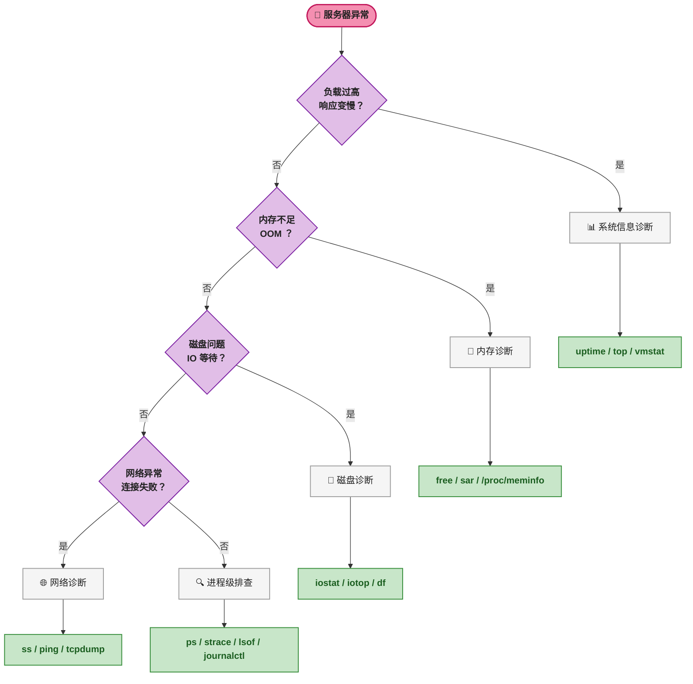
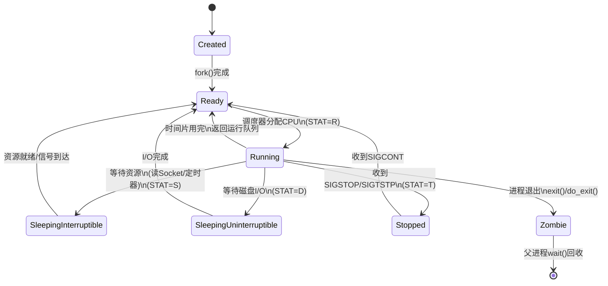
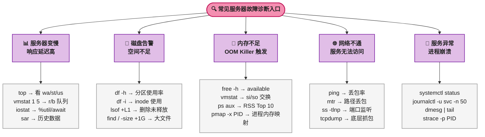
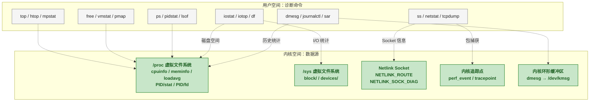

# 🐧 开发常用 100 条 Linux 指令全解析：从系统监控到性能调优

## 引言：为什么要掌握这些指令

在日常开发和运维工作中，服务器出现问题时的第一反应往往是 SSH 登录上去排查。能不能在最短的时间内定位到根本原因，取决于对 Linux 诊断指令的熟练程度。这些指令不仅是敲几个字母的组合，更重要的是—— **能看懂输出里每一个数字和字段代表什么** 。

下图展示了从服务器出现异常到定位根因的完整诊断链路，以及各个环节对应的核心指令分类：




本文按照 **10 大分类** 组织 100 条指令，每一条都包含常用选项、实际输出示例、输出参数逐列解读，以及能从这些数据中看出服务器的什么状态。

> 📌 前置知识：阅读本文需要基本的 Linux 终端操作经验（知道如何打开终端、SSH 登录远程服务器）。文中涉及的概念（如进程、内存分页、Socket、inode）会在首次出现时用括号给出简短定义。

---

## 📌 一、系统信息与状态（10 条）

系统信息指令是登录服务器后的 **第一组命令** ，用于快速了解服务器的基础环境：什么系统、运行多久、负载如何、硬件配置怎样。

### 🖥️ 1. uname — 系统内核信息

**常用选项：** `-a`（全部信息）、`-r`（内核版本）、`-m`（机器架构）、`-n`（主机名）

```bash
$ uname -a
Linux prod-server-01 5.15.0-91-generic #101-Ubuntu SMP Tue Nov 14 13:30:08 UTC 2023 x86_64 x86_64 x86_64 GNU/Linux
```

**怎么看输出（从左到右）：**

| 字段 | 示例值 | 含义 |
|------|--------|------|
| 内核名称 | `Linux` | 操作系统内核类型 |
| 主机名 | `prod-server-01` | 服务器在网络中的名称 |
| 内核版本 | `5.15.0-91-generic` | 主版本.次版本.补丁-发行版标识 |
| 编译信息 | `#101-Ubuntu SMP ...` | 内核编译次数、发行版、编译时间 |
| 架构 | `x86_64` | CPU 指令集架构 |
| OS 名称 | `GNU/Linux` | 完整操作系统名称 |

**可以看出服务器什么状态：** 内核版本是否过旧（存在已知漏洞）、架构是 32 位还是 64 位（影响内存寻址上限）、主机名确认是否登录了正确的服务器。

### 🖥️ 2. hostnamectl — 主机名详细信息

**常用选项：** `status`（默认）、`set-hostname`（修改主机名）

```bash
$ hostnamectl
   Static hostname: prod-server-01
         Icon name: computer-vm
           Chassis: vm
        Machine ID: a1b2c3d4e5f6...
           Boot ID: f6e5d4c3b2a1...
    Virtualization: kvm
  Operating System: Ubuntu 22.04.3 LTS
            Kernel: Linux 5.15.0-91-generic
      Architecture: x86-64
```

**怎么看输出：** 每条都是键值对。重点关注 `Virtualization`（确认是物理机还是虚拟机，以及虚拟化技术类型是 KVM / VMware / Xen）、`Operating System`（系统版本）、`Boot ID`（每次启动变化，可用于判断服务器最近是否重启过）。

### 🖥️ 3. uptime — 系统运行时间与负载

```bash
$ uptime
 14:32:10 up 237 days,  3:15,  2 users,  load average: 0.15, 0.22, 0.18
```

**怎么看输出：**

| 字段 | 含义 |
|------|------|
| `14:32:10` | 当前系统时间 |
| `up 237 days, 3:15` | 系统已持续运行 237 天 3 小时 15 分钟 |
| `2 users` | 当前登录用户数 |
| `load average: 0.15, 0.22, 0.18` | 过去 **1 分钟** / **5 分钟** / **15 分钟** 的平均负载 |

**可以看出服务器什么状态：** 负载值需要结合 CPU 核心数解读。假设是 4 核 CPU：
- `load average < 4.0`：系统负载正常，CPU 未饱和
- `load average ≈ 4.0`：CPU 刚好满负荷
- `load average > 4.0`：有任务在排队等待 CPU，值越大排队越长
- **1 分钟值远大于 15 分钟值** ：负载正在快速上升，需立即排查
- **1 分钟值远小于 15 分钟值** ：之前的高峰已过去

如果运行时间很短（刚重启），要警惕是否发生了意外重启。

### 📁 4. lsb_release — 发行版信息

```bash
$ lsb_release -a
Distributor ID: Ubuntu
Description:    Ubuntu 22.04.3 LTS
Release:        22.04
Codename:       jammy
```

**怎么看输出：** `Release` 是版本号，`Codename` 是代号（用于匹配 APT 源配置）。确认系统版本后才知道该用什么包管理工具（apt / yum / dnf）和软件源。

### 🖥️ 5. dmesg — 内核环形缓冲区日志

**常用选项：** `-T`（显示人类可读时间戳）、`--level=err,warn`（只显示错误和警告）

```bash
$ dmesg -T | tail -20
[Wed Nov 15 14:30:01 2023] TCP: request_sock_TCP: Possible SYN flooding on port 80. Sending cookies.
[Wed Nov 15 14:32:05 2023] EXT4-fs (sda1): mounted filesystem with ordered data mode.
[Wed Nov 15 14:35:00 2023] Out of memory: Killed process 28431 (java) total-vm:4194304kB
```

**怎么看输出：** 每条日志包含时间戳和事件描述。重点关注：
- `Out of memory` / `OOM`：进程被 OOM Killer（内核在内存不足时强制终止进程的机制）杀掉
- `SYN flooding`：可能遭受 SYN Flood 攻击或 Web 服务并发过高
- `segfault`：程序访问了非法内存地址，通常意味着代码有 Bug
- `I/O error`：磁盘硬件可能故障

**可以看出服务器什么状态：** `dmesg` 记录的是内核级事件，能看到应用层看不到的硬件错误、OOM 杀死记录、驱动问题。服务器出现莫名重启或进程无故消失时，优先查 `dmesg`。

### 📁 6. lscpu — CPU 架构信息

```bash
$ lscpu
Architecture:            x86_64
CPU(s):                  8
Thread(s) per core:      2
Core(s) per socket:      4
Socket(s):               1
Model name:              Intel(R) Xeon(R) Platinum 8370C CPU @ 2.80GHz
CPU MHz:                 2800.000
L1d cache:               128 KiB
L1i cache:               128 KiB
L2 cache:                4 MiB
L3 cache:                16 MiB
```

**怎么看输出：** 总 CPU 数 = Socket 数 × 每槽核心数 × 每核线程数 = 1 × 4 × 2 = 8。如果开启了超线程，实际物理核心 = `CPU(s)` / `Thread(s) per core`。

**可以看出服务器什么状态：** 确认 CPU 是否跑在标称频率（有时因散热或电源管理降频）、缓存大小（影响性能优化策略）、是否支持特定指令集（`Flags` 字段，如 `avx512` 表示支持 AVX-512 向量指令）。

### 📁 7. lsblk — 块设备列表

```bash
$ lsblk
NAME   MAJ:MIN RM  SIZE RO TYPE MOUNTPOINT
sda      8:0    0  200G  0 disk
├─sda1   8:1    0    1G  0 part /boot
├─sda2   8:2    0  180G  0 part /
└─sda3   8:3    0   19G  0 part [SWAP]
sdb      8:16   0  500G  0 disk /data
```

**怎么看输出：**

| 字段 | 含义 |
|------|------|
| `NAME` | 设备名称，`sd*` 表示 SCSI/SATA 磁盘，`nvme*` 表示 NVMe SSD |
| `RM` | 1 = 可移动设备，0 = 固定磁盘 |
| `RO` | 1 = 只读，0 = 可读写 |
| `TYPE` | `disk` = 整块磁盘，`part` = 分区 |
| `MOUNTPOINT` | 挂载位置，`[SWAP]` 表示该分区用作交换空间 |

**可以看出服务器什么状态：** 磁盘是否已分区、哪些磁盘挂载到了哪些目录、是否有 SWAP 分区、磁盘使用 MBR 还是 GPT（`gdisk -l` 进一步确认）。

### 📁 8. lspci — PCI 设备列表

```bash
$ lspci | grep -i ethernet
01:00.0 Ethernet controller: Intel Corporation 82599ES 10-Gigabit SFI/SFP+ Network Connection (rev 01)
```

**怎么看输出：** `01:00.0` 是 PCI 总线地址（总线:设备.功能）。通过 `grep` 过滤可以快速找到网卡、显卡、存储控制器等设备型号。

**可以看出服务器什么状态：** 确认网卡型号和速率（10-Gigabit 即万兆）、RAID 卡型号、GPU 型号。当网络性能不达预期时，先确认硬件规格。

### 📁 9. lsusb — USB 设备列表

```bash
$ lsusb
Bus 002 Device 001: ID 1d6b:0003 Linux Foundation 3.0 root hub
Bus 001 Device 002: ID 0781:5591 SanDisk Corp. Ultra Flair
```

**怎么看输出：** `ID 0781:5591` 中 `0781` 是厂商 ID（此处为 SanDisk），`5591` 是产品 ID。可以用来确认外接设备是否被系统识别。

### 🖥️ 10. dmidecode — DMI 表信息

**常用选项：** `-t memory`（内存信息）、`-t system`（系统信息）、`-t bios`（BIOS 版本）

```bash
$ sudo dmidecode -t memory | grep -E "Size|Speed|Type"
        Size: 32 GB
        Speed: 3200 MT/s
        Type: DDR4
```

**可以看出服务器什么状态：** 物理内存插了多少、每条多大、频率多少、型号是 DDR4 还是 DDR5。这是确认服务器真实硬件配置的终极手段——有时你以为有 64G 内存，`dmidecode` 一看只有 32G。

> ⚠️ 新手提示：`dmidecode` 读取的是 BIOS 写入的 DMI 表（Desktop Management Interface，主板固件记录的硬件配置信息），不依赖操作系统配置，因此它能反映真实物理硬件，不会被虚拟化层蒙蔽。

---

## 🔍 二、文件与目录操作（10 条）

文件操作是日常开发中使用频率最高的指令类别。掌握它们的高级选项能大幅提升效率。

### 📁 11. ls — 列出目录内容

**常用选项：** `-l`（长格式）、`-a`（显示隐藏文件）、`-h`（人类可读大小）、`-t`（按时间排序）、`-S`（按大小排序）、`-i`（显示 inode 号）

```bash
$ ls -lah
total 24K
drwxr-xr-x  5 dev dev 4.0K Nov 15 14:30 .
drwxr-xr-x 10 dev dev 4.0K Nov 14 09:00 ..
-rw-r--r--  1 dev dev  220 Nov 15 14:28 .bashrc
-rwxr-xr-x  1 dev dev  12K Nov 15 14:30 app
drwxr-xr-x  2 dev dev 4.0K Nov 15 14:29 logs
```

**怎么看输出：**

| 字段 | 示例 | 含义 |
|------|------|------|
| `-rw-r--r--` | 10 个字符 | 类型+权限：`-` 是文件，`d` 是目录，`l` 是软链接；接着 3 组 rwx 分别代表所有者/组/其他人权限 |
| `1` | 硬链接数 | 指向该 inode 的硬链接数量 |
| `dev` | 所有者 | 文件所属用户 |
| `dev` | 所属组 | 文件所属用户组 |
| `220` / `12K` | 文件大小 | `-h` 选项将其转为 KB/MB/GB |
| `Nov 15 14:28` | 修改时间 | 文件内容最后修改时间 |

**可以看出服务器什么状态：** 检查关键配置文件的权限是否过于宽松（如 `.ssh/id_rsa` 权限应为 `-rw-------`），检查日志文件大小是否异常增长（磁盘可能被日志写满）。

### 📁 12. find — 搜索文件

**常用选项：** `-name`（按名称）、`-type`（按类型 f/d/l）、`-size`（按大小）、`-mtime`（按修改时间）、`-exec`（对结果执行命令）

```bash
$ find /var/log -name "*.log" -type f -size +100M -mtime -7
/var/log/app/error.log
/var/log/nginx/access.log
```

**怎么看输出：** 命令查找 `/var/log` 下过去 7 天（`-mtime -7`）修改过的、大于 100MB（`-size +100M`）的 `.log` 文件。结果可以直接判断哪些日志文件在快速增长。

**可以看出服务器什么状态：** 快速定位大文件（磁盘空间问题）、找最近修改的配置文件、批量清理过期日志（配合 `-exec rm {} \;` 或 `-delete`）。

### 📁 13. stat — 文件/文件系统状态

```bash
$ stat app.log
  File: app.log
  Size: 20480           Blocks: 40         IO Block: 4096   regular file
Device: 801h/2049d      Inode: 131072      Links: 1
Access: (0644/-rw-r--r--)  Uid: (1000/dev)   Gid: (1000/dev)
Access: 2023-11-15 14:30:00.000000000 +0800
Modify: 2023-11-15 14:28:00.000000000 +0800
Change: 2023-11-15 14:28:00.000000000 +0800
```

**怎么看输出：**

| 字段 | 含义 |
|------|------|
| `Size` | 文件字节大小 |
| `Blocks` | 文件占用的扇区数（磁盘实际分配块数） |
| `IO Block` | 文件系统块大小（4096 字节，即 4KB） |
| `Inode` | 文件的 inode 号（索引节点，文件系统中文件的唯一标识） |
| `Access` | 最后访问时间（atime） |
| `Modify` | 最后修改时间（mtime，文件 **内容** 被修改） |
| `Change` | 最后状态变更时间（ctime，文件 **元数据** 如权限/所有者被修改） |

> ⚠️ 新手提示：`Modify` 和 `Change` 的区别是常见面试题。修改文件内容只会变 `Modify`；用 `chmod` 改权限只会变 `Change`。修改内容时 `Change` 也会同时更新（因为文件大小这个元数据变了）。

### 💿 14. du — 磁盘使用量

**常用选项：** `-h`（人类可读）、`-s`（汇总）、`-d 1`（深度为 1 层）、`--max-depth=N`（限制深度）

```bash
$ du -sh /home/dev/*
1.2G    /home/dev/project
350M    /home/dev/logs
48K     /home/dev/scripts
```

**可以看出服务器什么状态：** 快速找到哪个目录占用磁盘最多。排查磁盘空间告警时，从根目录逐层 `du` 下去，快速定位"元凶"。

### 📁 15. tree — 目录树展示

```bash
$ tree -L 2 -d /etc/nginx
/etc/nginx
├── conf.d
├── modules-available
├── modules-enabled
├── sites-available
└── sites-enabled
```

**常用选项：** `-L N` 限制深度、`-d` 只显示目录、`-h` 显示文件大小。方向项目快速了解目录结构时非常有用。

### 📁 16. file — 文件类型识别

```bash
$ file app
app: ELF 64-bit LSB shared object, x86-64, version 1 (SYSV), dynamically linked, not stripped

$ file unknown.dat
unknown.dat: PNG image data, 1920 x 1080, 8-bit/color RGB, non-interlaced
```

**怎么看输出：** `file` 通过"魔数"（magic number，文件头部的标识字节）判断文件类型，不依赖后缀名。`not stripped` 表示二进制文件仍包含调试符号；`stripped` 表示已被裁剪（生产环境发布版）。

### 📝 17. wc — 字数统计

**常用选项：** `-l`（行数）、`-w`（单词数）、`-c`（字节数）、`-m`（字符数）

```bash
$ wc -l access.log
125430 access.log

$ find src -name "*.java" | xargs wc -l | tail -1
  45230 total
```

**可以看出服务器什么状态：** 快速统计日志行数（评估日志量）、代码行数、进程数（`ps aux | wc -l`）。

### 📁 18. diff — 文件差异比较

**常用选项：** `-u`（统一格式，最常用）、`-r`（递归比较目录）、`-q`（只报告是否不同）

```bash
$ diff -u nginx.conf.bak nginx.conf
--- nginx.conf.bak      2023-11-15 10:00:00
+++ nginx.conf  2023-11-15 14:30:00
@@ -10,7 +10,7 @@
-worker_connections 1024;
+worker_connections 4096;
```

**怎么看输出：** `---` 是旧文件，`+++` 是新文件。`@@ -10,7 +10,7 @@` 表示旧文件从第 10 行开始共 7 行，新文件从第 10 行开始共 7 行。以 `-` 开头的是被删除的行，以 `+` 开头的是新增的行。

### 🗜️ 19. tar — 归档管理

```bash
#  打包压缩
$ tar -czvf backup.tar.gz /var/log/app/

#  解压
$ tar -xzvf backup.tar.gz -C /tmp/restore/

#  不解压查看内容
$ tar -tzvf backup.tar.gz
-rw-r--r-- dev/dev  20480 2023-11-15 14:30 var/log/app/app.log
```

**常用选项记忆口诀：** `-c` create / `-x` extract / `-t` list（查内容）、`-z` gzip（`.gz`）、`-j` bzip2（`.bz2`）、`-v` verbose、`-f` file。

### 📁 20. rsync — 远程文件同步

```bash
$ rsync -avz --progress /local/dir/ user@remote:/remote/dir/
```

**常用选项：** `-a`（归档模式，保留权限和属性）、`-v`（详细输出）、`-z`（传输时压缩）、`--delete`（删除目标端比源端多的文件）、`-n`（dry-run，模拟运行不实际传输）、`--progress`（显示进度）。

**可以看出服务器什么状态：** `rsync` 的 `--progress` 能显示传输速率，当速率异常低时可能说明网络带宽瓶颈或磁盘 I/O 瓶颈。

---

## ⚙️ 三、文本处理与日志查看（10 条）

文本处理指令是日志分析和数据提取的核心武器。这 10 条指令组合使用能覆盖 90% 的文本处理需求。

### 📁 21. cat — 连接并显示文件

```bash
$ cat /etc/os-release
NAME="Ubuntu"
VERSION="22.04.3 LTS (Jammy Jellyfish)"
```

**常用选项：** `-n`（显示行号）、`-A`（显示所有不可见字符，包括 `$` 表示行尾、`^I` 表示 Tab）。适合查看小文件，大文件请用 `less`。

### 📁 22. less — 分页浏览文件

```bash
$ less /var/log/syslog
```

**常用快捷键：** `g` 跳到开头、`G` 跳到末尾、`/keyword` 向下搜索、`?keyword` 向上搜索、`n` 下一个匹配、`N` 上一个匹配、`F` 进入 tail -f 模式（实时监控）、`Ctrl+C` 退出实时模式、`q` 退出。

> ⚠️ 新手提示：`less` 不会将整个文件读入内存，而是按需加载，因此打开几个 GB 的大文件也不会卡死。`less` 比 `more` 强大的核心区别是可以 **向前翻页** （more 只能向后）。

### 📁 23. head — 显示文件头部

```bash
$ head -n 5 access.log
192.168.1.10 - - [15/Nov/2023:14:30:01 +0800] "GET /api/users HTTP/1.1" 200 1234
192.168.1.11 - - [15/Nov/2023:14:30:02 +0800] "POST /api/orders HTTP/1.1" 201 567
```

**常用选项：** `-n N`（显示前 N 行，默认 10）、`-c N`（显示前 N 字节）。也可以配合管道查看命令输出的前几行：`ps aux | head -5`。

### 📁 24. tail — 显示文件尾部/实时跟踪

```bash
$ tail -f /var/log/app/app.log
2023-11-15 14:35:01 INFO  RequestHandler - Processing request #12845
2023-11-15 14:35:02 ERROR DatabasePool - Connection timeout after 30s
```

**常用选项：** `-f`（follow，文件有新内容时自动显示）、`-n N`（显示最后 N 行）、`-F`（同 `-f` 但文件被 rotate 后会自动重新打开新文件，运维场景优先用 `-F`）。

**可以看出服务器什么状态：** `tail -f` 是实时监控日志的首选。如果错误日志刷屏速度异常快，说明线上可能出现大量报错。如果日志长时间没有新输出，要检查进程是否已挂起。

### 📝 25. grep — 文本搜索

```bash
$ grep -c "ERROR" app.log
42

$ grep -n -B2 -A3 "NullPointerException" app.log
128-2023-11-15 14:28:01 INFO  ServiceA - Processing order
129-2023-11-15 14:28:01 DEBUG ServiceA - Order item: null
130:2023-11-15 14:28:01 ERROR ServiceA - NullPointerException at line 42
131-2023-11-15 14:28:01 WARN  ServiceA - Falling back to default
132-2023-11-15 14:28:01 INFO  ServiceA - Order failed
```

**常用选项：** `-c`（计数）、`-i`（忽略大小写）、`-n`（显示行号）、`-r`（递归搜索目录）、`-v`（反向匹配）、`-A N`（显示匹配行后 N 行）、`-B N`（显示匹配行前 N 行）、`-C N`（显示匹配行前后 N 行）、`-P`（使用 Perl 正则）、`-E`（扩展正则）、`--color=auto`（高亮匹配项）。

**可以看出服务器什么状态：** `grep -c` 快速统计错误数量、`grep "OutOfMemory"` 定位 OOM、`grep "killed" /var/log/syslog` 查看被 OOM Killer 杀掉的进程。

### 📝 26. sed — 流编辑器

```bash
#  替换文本
$ sed 's/ERROR/CRITICAL/g' app.log

#  删除第 1 ~ 5 行
$ sed '1,5d' app.log

#  打印第 10 ~ 20 行
$ sed -n '10,20p' app.log

#  就地修改文件（-i）
$ sed -i 's/127.0.0.1/10.0.1.50/g' config.properties
```

**常用选项：** `-i`（in-place，直接修改文件，macOS 上需 `-i ''`）、`-n`（只输出被 `p` 标记的行）、`-e`（执行多个表达式）、`-r`（使用扩展正则）。

> ⚠️ 新手提示：`sed -i` 会直接修改文件内容，建议先在副本上测试。`-i` 在 Linux 和 macOS 上的行为不同——macOS 要求 `-i ''` 提供备份后缀（空字符串表示不备份）。

### 📝 27. awk — 文本处理语言

```bash
#  按列提取
$ awk '{print $1, $7}' access.log
192.168.1.10 /api/users

#  条件过滤 + 统计
$ awk '$9 >= 500 {count++} END {print "5xx count:", count}' access.log
5xx count: 42

#  列求和
$ awk '{sum+=$10} END {print "Total bytes:", sum}' access.log
Total bytes: 1234567890
```

**常见内置变量：** `$1, $2, ...`（第 N 列）、`$0`（整行）、`NR`（行号）、`NF`（当前行列数）、`FS`（输入列分隔符，默认空格）、`OFS`（输出列分隔符）、`END{}`（所有行处理完后执行）。

**可以看出服务器什么状态：** 从日志中快速提取和分析数据——统计请求总数、按状态码统计错误率、计算平均响应时间、按 IP 统计访问量。

### 📝 28. sort — 排序

**常用选项：** `-n`（按数值排序而非字典序）、`-r`（逆序）、`-k N`（按第 N 列排序）、`-t`（指定列分隔符）、`-u`（去重排序）

```bash
#  按请求量统计 Top 10 IP
$ awk '{print $1}' access.log | sort | uniq -c | sort -rn | head -10
  1523 192.168.1.100
   892 192.168.1.101
   456 10.0.0.50
```

**可以看出服务器什么状态：** 结合日志分析，快速发现刷接口的 IP、访问最频繁的 URL、最耗时的请求。

### 📝 29. uniq — 去重

**常用选项：** `-c`（统计每行出现次数）、`-d`（只显示重复行）、`-u`（只显示唯一行）

**关键点：** `uniq` 只能去除 **相邻** 的重复行，通常配合 `sort` 使用（先排序再去重）。

```bash
$ cat ips.txt | sort | uniq -c | sort -rn
   1523 192.168.1.100
    892 192.168.1.101
      1 10.0.0.99
```

### 🔢 30. cut — 列截取

```bash
#  按分隔符截取（-d 指定分隔符，-f 指定字段）
$ cat /etc/passwd | cut -d':' -f1,7
root:/bin/bash
daemon:/usr/sbin/nologin
dev:/bin/bash

#  按字符位置截取（-c）
$ echo "20231115" | cut -c1-4,5-6,7-8
2023-11-15
```

**常用选项：** `-d`（分隔符，默认 Tab）、`-f`（字段序号，从 1 开始，逗号分隔多个，`-` 表示范围）、`-c`（字符位置）。

---

## 📊 四、进程管理（10 条）

进程管理指令是排查应用问题的核心工具——找到进程、分析状态、发送信号、调整优先级。

### 🔄 31. ps — 进程快照

```bash
$ ps aux --sort=-%mem | head -5
USER       PID %CPU %MEM    VSZ   RSS TTY      STAT START   TIME COMMAND
dev      28431  2.5 45.3 4194304 1740800 ?    Sl   Nov14  12:30 java -jar app.jar
mysql     1234  0.8 12.1 2097152 464896 ?     Ssl  Nov14   5:00 /usr/sbin/mysqld
```

**怎么看输出（核心字段）：**

| 字段 | 含义 | 解读提示 |
|------|------|---------|
| `PID` | 进程 ID | 唯一标识，后续操作（kill/strace）的对象 |
| `%CPU` | CPU 使用率 | 单核 100%，多核可达 N×100% |
| `%MEM` | 物理内存占用百分比 | 超过 80% 要关注内存泄漏 |
| `VSZ` | 虚拟内存大小（KB） | 包含已分配但未实际使用的内存 |
| `RSS` | 常驻内存大小（KB） | 进程实际占用的物理内存 |
| `STAT` | 进程状态码 | 见下方详解 |
| `START` | 进程启动时间 | 判断进程是否最近重启过 |
| `TIME` | 累计 CPU 时间 | CPU 密集型进程此值较高 |

**STAT 状态码详解：**

| 状态码 | 含义 | 常见原因 |
|--------|------|---------|
| `R` | Running，正在运行或在运行队列中等待 | CPU 密集型任务 |
| `S` | Sleeping，可中断睡眠 | 等待 I/O、网络响应、定时器 |
| `D` | 不可中断睡眠 | 等待磁盘 I/O 完成，无法被 kill |
| `Z` | Zombie，僵尸进程 | 子进程已退出但父进程未调用 `wait()` |
| `T` | 被信号停止 | 收到 SIGSTOP 或被调试器暂停 |
| `<` | 高优先级 | 手动调高或被调度器提升 |
| `s` | 会话首进程 | 通常是 shell 或 init |
| `l` | 多线程 | 包含多个线程的进程 |

> ⚠️ 新手提示：如果有大量 `D` 状态进程，说明磁盘 I/O 是瓶颈。`Z` 状态进程无法被杀掉（它已经死了），需要重启父进程来清理。`ps aux | grep Z` 查看僵尸进程数量。

下图展示了 Linux 进程在整个生命周期中的状态转换关系，这是理解 `ps` STAT 列的基础：



| 状态 | STAT 码 | 本质 | 能否被 kill | 占用的内存能否释放 |
|------|:---:|------|:---:|:---:|
| 就绪（Ready） | `R` | 在运行队列中等待 CPU | 是 | 是 |
| 运行（Running） | `R` | 正在使用 CPU | 是 | 是 |
| 可中断睡眠 | `S` | 等待事件（Socket/管道/定时器） | 是 | 是 |
| 不可中断睡眠 | `D` | 等待磁盘 I/O 完成 | **否** | 否 |
| 停止 | `T` | 被 SIGSTOP 或调试器暂停 | 是（SIGKILL 后变 Z） | 是 |
| 僵尸 | `Z` | 已退出但父进程未回收 | **否** （已死，无法再被杀） | 内存已释放，仅残留 PCB |

> ⚠️ 新手提示： **不可中断睡眠（D）** 状态是内核的一种保护机制——进程正在等待磁盘 I/O，如果此时被杀死，磁盘数据可能处于不一致状态。因此内核不允许任何信号（包括 SIGKILL）中断 D 状态进程。这也是为什么 NFS 服务端宕机时，客户端的进程会"卡死"在 D 状态——它们正在等待永远不会完成的 I/O。

### 🔄 32. top — 实时进程监控

```bash
$ top
top - 14:35:01 up 237 days,  3:18,  2 users,  load average: 0.15, 0.22, 0.18
Tasks: 245 total,   1 running, 244 sleeping,   0 stopped,   0 zombie
%Cpu(s):  2.3 us,  0.5 sy,  0.0 ni, 97.2 id,  0.0 wa,  0.0 hi,  0.0 si,  0.0 st
MiB Mem :  32000.0 total,   8000.0 free,  14000.0 used,  10000.0 buff/cache
MiB Swap:   4096.0 total,   4096.0 free,      0.0 used.  16000.0 avail Mem
```

**怎么看 CPU 行：**

| 字段 | 含义 | 告警阈值 |
|------|------|---------|
| `us` | 用户态 CPU 时间 | 高说明应用占 CPU 多 |
| `sy` | 内核态 CPU 时间 | 高说明系统调用频繁（大量 I/O 或上下文切换） |
| `ni` | 低优先级用户态 CPU | 被 nice 调整过的进程占用 |
| `id` | 空闲 CPU | 越低说明 CPU 越忙 |
| `wa` | 等待 I/O 的 CPU 时间 | **持续 > 10% 说明磁盘瓶颈** |
| `hi` | 硬件中断 | 网卡、磁盘等硬件中断处理 |
| `si` | 软件中断 | 网络包处理等软中断 |
| `st` | 被 hypervisor 偷走的时间 | **> 5% 说明宿主机超卖，虚拟机被限流** |

**怎么看内存行：**

| 字段 | 含义 |
|------|------|
| `total` | 物理内存总量 |
| `free` | 完全空闲的内存 |
| `used` | 已使用内存 |
| `buff/cache` | 缓冲区+页缓存（Linux 用空闲内存做缓存，可随时释放） |
| `avail Mem` | 真正可分配给新进程的内存（= free + 可释放的 buff/cache） |

**可以看出服务器什么状态：** `top` 是"一站式"概览面板。`wa` 高→磁盘问题，`st` 高→虚拟机宿主机超卖，`used` 高但 `avail` 也高→实际内存没问题（只是被缓存占用），`used` 高且 `avail` 低→需要加内存或排查内存泄漏。

### 🔄 33. htop — 增强型进程监控

```bash
$ htop
```

`htop` 是 `top` 的增强版，支持鼠标点击、颜色高亮、树形进程视图（`F5`）、水平垂直滚动。相比 `top`，`htop` 的 CPU 和内存条是可视化柱状图，更容易一眼判断系统状态。

> 📌 前置知识：`htop` 通常不是预装的，需要 `sudo apt install htop`（Debian/Ubuntu）或 `sudo yum install htop`（CentOS/RHEL）。

### 🔄 34. kill — 发送信号给进程

```bash
$ kill -l          # 列出所有信号
 1) SIGHUP       2) SIGINT       3) SIGQUIT      9) SIGKILL
15) SIGTERM     17) SIGCHLD     18) SIGCONT     19) SIGSTOP
```

**常用信号：**

| 信号 | 编号 | 行为 | 使用场景 |
|------|:---:|------|---------|
| `SIGTERM` | 15 | 请求进程优雅退出（默认） | 正常停止服务，进程可做清理工作 |
| `SIGKILL` | 9 | 强制杀死，进程无法捕获 | 进程卡死无法响应 TERM 时 |
| `SIGHUP` | 1 | 挂断信号 | 重新加载配置文件（nginx -s reload 等效） |
| `SIGINT` | 2 | 中断信号 | 等同于 `Ctrl+C` |
| `SIGQUIT` | 3 | 退出并生成 core dump | 需要保留现场调试时 |
| `SIGUSR1` | 10 | 用户自定义 | 应用可自定义处理，如重新打开日志文件 |

```bash
$ kill -15 28431    # 优雅停止 PID 28431
$ kill -9  28431    # 强制杀死（谨慎使用！）
$ kill -1  28431    # 重新加载配置（nginx/php-fpm）
```

> ⚠️ 新手提示：`kill -9` 是最后手段，不要一上来就用。`-9` 不给进程任何清理机会（不关闭文件句柄、不释放锁、不回写缓存数据），可能导致数据损坏。正确的顺序：先 `-15`，等待几秒，进程还在再 `-9`。

### 🔄 35. pkill — 按名称终止进程

```bash
$ pkill -f "java -jar app.jar"   # 按完整命令匹配
$ pkill -HUP nginx               # 重新加载 nginx 配置
```

**常用选项：** `-f`（匹配完整命令行而非只匹配进程名）、`-u user`（只杀掉指定用户的进程）、`-9`（SIGKILL）、`-SIGNAL`（指定信号）。

### 🔄 36. nice / renice — 进程优先级

```bash
$ nice -n 10 tar -czf backup.tar.gz /data/   # 以较低优先级运行
$ renice -n -5 -p 28431                       # 提升已有进程的优先级
```

**怎么看优先级：** Linux 优先级范围是 `-20`（最高优先级）到 `19`（最低优先级）。默认是 `0`。`nice` 值越大，进程越"友好"（让出 CPU 给其他进程）。普通用户只能调大 nice 值（降低优先级），只有 root 能调小（提高优先级）。

**可以看出服务器什么状态：** 如果某个备份任务或批处理任务拖慢了线上服务，用 `renice` 降低其优先级而不用杀死它。

### 🔄 37. nohup — 忽略挂断信号

```bash
$ nohup java -jar app.jar > app.log 2>&1 &
[1] 28432
```

**怎么看输出：** `[1]` 是任务编号（jobs 命令可用），`28432` 是 PID。`> app.log 2>&1` 将标准输出和标准错误都重定向到 app.log。命令在后台运行且 SSH 断开后不终止。

### 🔄 38. jobs / bg / fg — 任务前后台切换

```bash
$ jobs -l
[1]  28432 Running    nohup java -jar app.jar &
[2]+ 28435 Stopped    vim config.yml

$ fg %2          # 将任务 2 调到前台
$ bg %2           # 将任务 2 在后台继续运行
$ kill %2         # 用任务号终止（等价于 kill 28435）
```

**可以看出服务器什么状态：** `jobs` 列出当前 shell 的后台任务状态。`Stopped` 状态通常是因为按了 `Ctrl+Z` 暂停了前台进程。

### 🔄 39. pgrep — 按名称查找进程 PID

```bash
$ pgrep -a java
28431 java -jar app.jar
28450 java -jar worker.jar

$ pgrep -u dev -f "app.jar"
28431
```

**常用选项：** `-a`（列出 PID 和完整命令）、`-u user`（指定用户）、`-l`（列出进程名）、`-f`（匹配完整命令行）。

### 🔄 40. pidstat — 进程资源统计

```bash
$ pidstat -p 28431 1 3
14:35:01   UID      PID    %usr %system  %guest   %wait    %CPU   CPU  Command
14:35:02  1000    28431    2.00    0.50    0.00    0.00    2.50     0  java
14:35:03  1000    28431    1.50    0.50    0.00    0.00    2.00     0  java
14:35:04  1000    28431    3.00    1.00    0.00    0.00    4.00     0  java
```

**怎么看输出：** `1 3` 表示每 1 秒采样一次，共 3 次。`%usr` 是用户态 CPU，`%system` 是内核态，`%wait` 是进程等待 CPU 的时间（值高说明 CPU 竞争激烈）。

**可以看出服务器什么状态：** 针对某个进程做精细的 CPU 使用率分析。如果 `%system` 远大于 `%usr`，说明进程把大量时间消耗在系统调用上（可能是频繁 I/O、锁竞争或网络操作）。

---

## 🛠️ 五、内存与 CPU 监控（10 条）

这类指令帮助判断服务器是否缺内存、CPU 是否饱和、是否存在内存泄漏。

### 🔢 41. free — 内存使用概览

```bash
$ free -h
              total        used        free      shared  buff/cache   available
Mem:           31Gi        13Gi       7.8Gi       356Mi        10Gi        17Gi
Swap:         4.0Gi          0B       4.0Gi
```

**怎么看输出：**

| 字段 | 含义 | 判断标准 |
|------|------|---------|
| `total` | 物理内存总量 | 硬件规格 |
| `used` | 已使用（含 buff/cache 外的所有） | 需结合 `available` 看 |
| `free` | 完全未使用的内存 | 低不一定是坏事（Linux 会主动做缓存） |
| `shared` | 共享内存（tmpfs 占用） | 主要由 `/dev/shm` 和共享内存段占用 |
| `buff/cache` | 缓冲区 + 页缓存 | 可以随时释放给应用 |
| `available` | **真正可用的内存** | **这是最关键的指标** ，低说明真的缺内存 |
| `Swap used` | 已使用的交换空间 | **> 0 且有持续增长趋势 → 内存不足** |

> ⚠️ 新手提示：不要盯着 `free` 列看。Linux 的内存管理策略是"尽可能用空闲内存做缓存"，所以 `free` 低但 `available` 高是完全正常的。判断内存是否不足的唯一可靠指标是 `available` 列。

### ⏰ 42. vmstat — 虚拟内存统计

```bash
$ vmstat 1 5
procs -----------memory---------- ---swap-- -----io---- -system-- ------cpu-----
 r  b   swpd   free   buff  cache   si   so    bi    bo   in   cs us sy id wa st
 1  0      0 8000000 2000000 5000000    0    0    10    50  500 1000  2  1 97  0  0
 0  0      0 7998000 2000000 5000010    0    0     0   200  450  900  1  0 99  0  0
```

**怎么看输出（关键字段）：**

| 列组 | 字段 | 含义 | 告警阈值 |
|------|------|------|---------|
| `procs` | `r` | 运行队列中的进程数 | **> CPU 核数表示 CPU 饱和** |
| `procs` | `b` | 不可中断睡眠的进程数 | **> 0 持续存在说明 I/O 瓶颈** |
| `swap` | `si` | 从磁盘 swap 换入（KB/s） | **> 0 说明内存不足** |
| `swap` | `so` | 换出到磁盘 swap（KB/s） | **> 0 说明内存不足** |
| `io` | `bi` | 从块设备读入（KB/s） | 高值→读磁盘频繁 |
| `io` | `bo` | 写出到块设备（KB/s） | 高值→写磁盘频繁 |
| `system` | `in` | 每秒中断数 | 突然猛增→硬件或网络异常 |
| `system` | `cs` | 每秒上下文切换次数 | **> 50000 说明线程切换过于频繁** |
| `cpu` | `wa` | CPU 等待 I/O 时间 | **> 10% 说明磁盘瓶颈** |

### 📁 43. mpstat — CPU 使用率统计

```bash
$ mpstat -P ALL 1 3
14:35:01  CPU    %usr   %nice    %sys %iowait    %irq   %soft  %steal  %guest   %idle
14:35:02  all    2.50    0.00    0.50    0.00    0.00    0.00    0.00    0.00   97.00
14:35:02    0    3.00    0.00    1.00    0.00    0.00    0.00    0.00    0.00   96.00
14:35:02    1    2.00    0.00    0.00    0.00    0.00    0.00    0.00    0.00   98.00
```

**怎么看输出：** `-P ALL` 显示每个 CPU 核心的统计数据。如果某个核心的 `%usr` 或 `%iowait` 远高于其他核心，说明存在负载不均衡——可能是应用没有做多核亲和性绑定，或者某个线程把单核跑满了。

**可以看出服务器什么状态：** 对比各核心的使用率是否均衡。不均衡时需要排查是否是单线程应用跑满了某个核心。

### 🖥️ 44. sar — 系统活动报告

**常用选项：** `-u`（CPU 历史）、`-r`（内存历史）、`-n DEV`（网络历史）、`-b`（I/O 历史）

```bash
$ sar -u -f /var/log/sysstat/sa15
14:20:01    %usr     %sys     %iowait    %idle
14:30:01    2.50     0.50      0.00     97.00
14:40:01   45.00     5.00     30.00     20.00    # 异常！
14:50:01   50.00     8.00     25.00     17.00    # 持续高负载
```

**怎么看输出：** `sar` 最大的价值是 **看历史数据** 。当服务器凌晨 3 点出问题而没人值守时，`sar` 保留了当时的 CPU、内存、I/O、网络快照。`-f` 指定历史日志文件（通常在 `/var/log/sysstat/` 下）。

**可以看出服务器什么状态：** 回溯历史性能问题。如果某个时间段的 `%iowait` 突然飙升，可能是定时任务的数据库全量备份导致的。

### 📁 45. /proc/cpuinfo — CPU 详细信息

```bash
$ cat /proc/cpuinfo | grep -E "processor|model name|cpu cores|siblings"
processor       : 0
model name      : Intel(R) Xeon(R) Platinum 8370C CPU @ 2.80GHz
cpu cores       : 4
siblings        : 8
```

**怎么看输出：** `processor` 是逻辑 CPU 编号，`cpu cores` 是每颗物理 CPU 的物理核心数，`siblings` 是每颗物理 CPU 的逻辑核心数（含超线程）。`siblings / cpu cores = 2` 说明开启了超线程（Hyper-Threading）。

### 🖥️ 46. /proc/meminfo — 内存详细信息

```bash
$ cat /proc/meminfo | grep -E "MemTotal|MemFree|MemAvailable|Cached|SwapTotal|SwapFree"
MemTotal:       32768000 kB
MemFree:         8000000 kB
MemAvailable:   16000000 kB
Cached:         10000000 kB
SwapTotal:       4096000 kB
SwapFree:        4096000 kB
```

**怎么看输出：** 这是 `free` 命令的底层数据源。`Cached` 就是 `free` 中的 `buff/cache` 部分。`MemAvailable` 是内核估算可以立即分配给新进程的内存量（不含已使用的 Swap）。

### 🖥️ 47. /proc/loadavg — 系统负载平均值

```bash
$ cat /proc/loadavg
0.15 0.22 0.18 2/1245 35190
```

**怎么看输出（前三个是 `uptime` 同款的负载平均值）：**

| 字段 | 含义 |
|------|------|
| `0.15 0.22 0.18` | 1 分钟/5 分钟/15 分钟平均负载 |
| `2/1245` | 当前运行的线程数 / 系统总线程数 |
| `35190` | 最近创建的进程 PID |

**可以看出服务器什么状态：** 如果当前运行线程数（`2`）持续接近总线程数，说明线程资源紧张。最后的 PID 可以粗略判断系统启动以来创建了多少进程。

### ⏰ 48. numastat — NUMA 节点统计

```bash
$ numastat
                           node0
numa_hit                123456789
numa_miss                 1234567
numa_foreign             1234567
interleave_hit             12345
local_node             120000000
other_node               3456789
```

**怎么看输出：** NUMA（Non-Uniform Memory Access，非一致内存访问）架构下，每个 CPU 有自己的本地内存。`numa_miss` 表示 CPU 需要访问远端节点的内存——这比访问本地内存慢。`numa_miss` 值持续高说明应用的内存分配策略没有做好 NUMA 绑定。

> 📌 前置知识：NUMA 是多路服务器的内存架构。一台双路服务器有两个物理 CPU，每个 CPU 有自己的本地内存条。CPU 访问自己的本地内存快，访问另一个 CPU 的远程内存慢 30% ~ 50%。不需要手动管 NUMA 的常见场景：单路服务器（只有一颗 CPU）、小型虚拟机。

### 🔄 49. pmap — 进程内存映射

```bash
$ pmap -x 28431 | head -20
Address           Kbytes     RSS   Dirty Mode  Mapping
0000000000400000       4       4       0 r---- java
0000000000401000     500     100       0 r-x-- java
00007f0000000000 4194304 1740800 1740800 rw---   [ anon ]
```

**怎么看输出：** 每一行是一个内存映射区域（VMA，Virtual Memory Area）。`RSS` 是该区域实际占用的物理内存，`Dirty` 是已修改但未写回磁盘的页。`[ anon ]` 表示匿名映射（通常由 `malloc` 或 JVM 堆分配产生）。

**可以看出服务器什么状态：** 确认 JVM 堆实际大小（`[ anon ]` 中 RSS 最大的那一段）、进程是否映射了大量共享库、是否有异常大的匿名内存区域（内存泄漏嫌疑）。

### 🔄 50. slabtop — 内核 Slab 缓存

```bash
$ sudo slabtop -o --once
 Active / Total Objects (% used)    : 12345678 / 12400000 (99.6%)
 Active / Total Slabs (% used)      : 234567 / 234567 (100%)
```

**常用选项：** `-o`（按占用排序）、`--once`（打印一次后退出，而非交互式）。`slabtop` 显示内核 Slab 分配器（管理内核对象内存的机制）的缓存使用情况。

**可以看出服务器什么状态：** 如果某个 slab 类型（如 `dentry`、`inode_cache`）占用异常高，可能是文件系统操作过于频繁（大量打开/关闭文件），需要优化应用的文件 I/O 模式。

---

## 📋 六、磁盘与 I/O 监控（10 条）

磁盘问题在服务器故障中占比很高——空间写满、I/O 打满、文件系统损坏、磁盘硬件故障。

### 📁 51. df — 文件系统磁盘空间

```bash
$ df -h
Filesystem      Size  Used Avail Use% Mounted on
/dev/sda2       180G  120G   51G  71% /
/dev/sda1       1.0G  200M  769M  21% /boot
/dev/sdb        500G  450G   50G  91% /data
```

**怎么看输出：** `Use%` 达到 100% 时该分区不可再写入。重点关注 `/` 根分区和 `/data`、`/var` 等数据分区。

**可以看出服务器什么状态：** 快速定位哪个分区快满了。`/boot` 分区如果满了（通常是旧内核积累），会导致 `apt upgrade` 失败。`df -i` 查看 inode 使用率——即使空间没满，inode 用完也无法创建新文件（常见于小文件极多的场景如邮件服务器）。

### ⏰ 52. iostat — I/O 统计

```bash
$ iostat -x 1 3
Device   r/s   w/s    rkB/s    wkB/s  await  svctm  %util
sda     50.0 100.0  2000.0  4000.0   5.00   0.80  12.00
sdb    200.0 300.0  8000.0 12000.0  30.00   1.50  95.00   # 瓶颈！
```

**怎么看输出（关键字段）：**

| 字段 | 含义 | 告警阈值 |
|------|------|---------|
| `r/s` / `w/s` | 每秒读写请求数（IOPS） | 取决于磁盘类型（HDD ~ 150，SSD ~ 100000） |
| `rkB/s` / `wkB/s` | 每秒读写数据量（吞吐量） | 取决于磁盘和接口带宽 |
| `await` | 单个 I/O 请求的平均等待时间（ms） | **> 10ms（HDD）或 > 1ms（SSD）需关注** |
| `svctm` | 单个 I/O 请求的平均服务时间（ms） | 配合 `await` 使用 |
| `%util` | 设备带宽利用率 | **> 80% 说明磁盘接近饱和** |

**可以看出服务器什么状态：** `%util` 持续接近 100% 说明磁盘是瓶颈，需要扩容、加缓存层或优化 I/O。`await` 远大于 `svctm` 说明请求在队列中等待了很长时间——大量 I/O 请求堆积。

### 🔄 53. iotop — I/O 进程监控

```bash
$ sudo iotop -o -P
Total DISK READ:       50.00 M/s | Total DISK WRITE:      100.00 M/s
  TID  PRIO  USER     DISK READ  DISK WRITE  COMMAND
28432 be/4   dev        30.00 M/s    80.00 M/s  java -jar app.jar
 1234 be/4   mysql      20.00 M/s    20.00 M/s  mysqld
```

**怎么看输出：** `-o` 只显示有 I/O 活动的进程，`-P` 显示进程级（而非线程级）。可以精确定位哪个进程在疯狂读写磁盘——数据库备份脚本、日志写入、文件同步任务是最常见的"I/O 大户"。

### 💿 54. fdisk — 磁盘分区管理

```bash
$ sudo fdisk -l
Disk /dev/sda: 200 GiB, 214748364800 bytes, 419430400 sectors
Device     Boot Start       End   Sectors  Size Id Type
/dev/sda1  *     2048   2099199   2097152    1G 83 Linux
/dev/sda2      2099200 419430399 417331200  199G 83 Linux
```

**常用选项：** `-l` 列出所有磁盘和分区。`fdisk` 用于查看分区表和创建/删除分区。操作分区表是高风险操作，务必确认磁盘名称。

### 🔢 55. blkid — 块设备属性

```bash
$ blkid
/dev/sda1: UUID="a1b2c3d4-e5f6-7890-abcd-ef1234567890" TYPE="ext4" PARTUUID="12345678-01"
/dev/sda2: UUID="b2c3d4e5-f6a7-8901-bcde-f12345678901" TYPE="ext4" PARTUUID="12345678-02"
```

**怎么看输出：** `UUID` 是文件系统的唯一标识符，用于 `/etc/fstab` 中挂载磁盘（比 `/dev/sda1` 更可靠，因为设备名可能变化）。`TYPE` 是文件系统类型。

### 📁 56. mount — 挂载文件系统

```bash
$ mount | column -t
/dev/sda2  on  /       type  ext4       (rw,relatime,errors=remount-ro)
/dev/sda1  on  /boot   type  ext4       (rw,relatime)
tmpfs      on  /dev/shm  type  tmpfs    (rw,nosuid,nodev)
```

**怎么看输出：** 每行展示一个挂载点。关注挂载选项：
- `rw` / `ro`：读写 / 只读。如果 `/` 变成了 `ro`，说明文件系统检测到错误后自动降级为只读保护
- `noexec`：禁止在该挂载点上执行程序（安全策略）
- `noatime`：不更新文件访问时间（减少 I/O）

### 📁 57. fsck — 文件系统检查

```bash
$ sudo fsck -N /dev/sda2
[/usr/sbin/fsck.ext4 (1) -- /dev/sda2] fsck.ext4 /dev/sda2
```

**重要：** `fsck` 不能对已挂载的文件系统运行！`-N` 只是显示会执行什么命令而不实际执行。文件系统检查需要在卸载状态或单用户模式下进行。

### 💿 58. dd — 数据转换和复制

```bash
#  磁盘写入速度测试
$ dd if=/dev/zero of=/tmp/test bs=1M count=1024 conv=fdatasync
1073741824 bytes (1.1 GB) copied, 5.12345 s, 210 MB/s

#  磁盘读取速度测试
$ dd if=/tmp/test of=/dev/null bs=1M count=1024
1073741824 bytes (1.1 GB) copied, 2.54321 s, 422 MB/s
```

**可以看出服务器什么状态：** 用 `dd` 测试磁盘的原始读写性能。对比标称值可以判断磁盘是否严重降速（如 SSD 寿命即将耗尽时写入速度可能暴跌）。

### 📁 59. lsof — 列出打开的文件

```bash
#  谁在用 /data 目录
$ lsof /data
COMMAND   PID USER   FD   TYPE DEVICE SIZE/OFF NODE NAME
java    28431  dev  256r   REG   8,16  1048576  512 /data/app/temp.dat

#  查看某个进程打开的所有文件
$ lsof -p 28431 | wc -l
1024

#  查看某个端口被谁占用
$ lsof -i :8080
COMMAND   PID USER   FD   TYPE DEVICE SIZE/OFF NODE NAME
java    28431  dev   50u  IPv6 123456      0t0  TCP *:8080 (LISTEN)

#  查看已删除但仍被进程占用的文件（磁盘空间"幽灵"）
$ lsof +L1
COMMAND   PID USER   FD   TYPE DEVICE SIZE/OFF NLINK NODE NAME
java    28431  dev   10w   REG   8,2  419430400     0 1024 /var/log/app.log (deleted)
```

**怎么看输出：**

| 字段 | 含义 |
|------|------|
| `COMMAND` | 进程名 |
| `PID` | 进程 ID |
| `FD` | 文件描述符编号，`r`=读 `w`=写 `u`=读写，后缀数字是 fd 号 |
| `TYPE` | 文件类型：`REG`=普通文件，`DIR`=目录，`IPv4/IPv6`=网络套接字 |
| `NODE` | inode 号 |
| `NAME` | 文件路径。`(deleted)` 标记表示文件已被删除但仍被进程持有 |

> ⚠️ 新手提示：`lsof +L1` 是最常用的诊断命令之一。当 `df` 显示磁盘满了但 `du` 统计不出谁占用了空间时，几乎一定是某个进程打开了已被删除的大文件——文件已从目录中消失但进程仍持有文件句柄，空间不会释放。解决办法：找到对应进程后重启它。

### 📁 60. fuser — 文件使用者识别

```bash
$ fuser -v /data
                     USER        PID ACCESS COMMAND
/data:               dev       28431 F.... java

$ fuser -v 8080/tcp
                     USER        PID ACCESS COMMAND
8080/tcp:            dev       28431 F.... java
```

**可以看出服务器什么状态：** `fuser` 能快速回答"谁在用这个文件/目录/端口"。当需要 `umount` 某个挂载点但提示 `target is busy` 时，用 `fuser -vm /mountpoint` 看谁在占用。

---

## 🔧 七、网络诊断（10 条）

网络问题排查是最需要系统化思路的领域——从物理连通性到应用层协议，逐层往下排查。

### 🌐 61. ping — 连通性测试

```bash
$ ping -c 4 8.8.8.8
PING 8.8.8.8 (8.8.8.8) 56(84) bytes of data.
64 bytes from 8.8.8.8: icmp_seq=1 ttl=117 time=1.50 ms
64 bytes from 8.8.8.8: icmp_seq=2 ttl=117 time=1.45 ms
64 bytes from 8.8.8.8: icmp_seq=3 ttl=117 time=1.48 ms
64 bytes from 8.8.8.8: icmp_seq=4 ttl=117 time=1.52 ms

--- 8.8.8.8 ping statistics ---
4 packets transmitted, 4 received, 0% packet loss, time 3004ms
rtt min/avg/max/mdev = 1.450/1.487/1.520/0.031 ms
```

**怎么看输出：**

| 字段 | 含义 | 告警阈值 |
|------|------|---------|
| `icmp_seq` | 包序列号 | 如果不连续说明丢包 |
| `ttl` | 生存时间（经过的路由器跳数） | 初始值通常是 64/128/255 |
| `time` | 往返延迟（RTT） | LAN < 1ms，同城 < 5ms，跨国 100 ~ 300ms |
| `packet loss` | 丢包率 | **> 1% 需关注，> 5% 需立即排查** |
| `mdev` | RTT 抖动 | **> 10ms 说明网络不稳定** |

**可以看出服务器什么状态：** 丢包率高 → 网络质量差或带宽拥塞。RTT 突然增大 → 网络路径变化或中间路由器拥塞。`mdev` 大 → 网络时延不稳定（对实时应用如视频/游戏影响大）。

### 🔢 62. traceroute — 路由追踪

```bash
$ traceroute 8.8.8.8
 1  _gateway (192.168.1.1)  0.500 ms  0.450 ms  0.480 ms
 2  10.0.0.1 (10.0.0.1)  2.100 ms  2.050 ms  2.080 ms
 3  172.16.0.1 (172.16.0.1)  5.300 ms  5.250 ms  5.280 ms
 4  * * *
 5  8.8.8.8 (8.8.8.8)  1.500 ms  1.480 ms  1.520 ms
```

**怎么看输出：** 每一行代表一个网络跳（hop）。三列时间是三次探测的 RTT。`* * *` 表示该节点不响应探测包（防火墙拦截或路由器不回应 ICMP），不一定是故障，只要后面还能到达目标即可。

**可以看出服务器什么状态：** 如果在某一跳之后全是 `* * *`，说明到该节点之后网络不通——可能该节点宕机或路由配置有问题。如果某一跳的延迟突然暴涨，说明该链路是瓶颈。

### 🌐 63. ip — 网络配置管理

```bash
#  查看所有网络接口
$ ip addr show
1: lo: <LOOPBACK,UP,LOWER_UP> ...
2: eth0: <BROADCAST,MULTICAST,UP,LOWER_UP> ...
    inet 192.168.1.100/24 brd 192.168.1.255 scope global eth0

#  查看路由表
$ ip route show
default via 192.168.1.1 dev eth0
192.168.1.0/24 dev eth0 proto kernel scope link src 192.168.1.100

#  查看 ARP 缓存
$ ip neigh show
192.168.1.1 dev eth0 lladdr 00:11:22:33:44:55 REACHABLE
```

> 📌 前置知识：`ip` 命令（iproute2 套件）是现代 Linux 的网络配置标准工具，替代了老旧的 `ifconfig`、`route`、`arp`。在较新的发行版中这些老命令可能未预装。

### 🌐 64. ss — Socket 统计

```bash
$ ss -tlnp
State    Recv-Q   Send-Q   Local Address:Port     Peer Address:Port   Process
LISTEN   0        128      0.0.0.0:80             0.0.0.0:*           users:(("nginx",pid=5678,fd=6))
LISTEN   0        128      0.0.0.0:443            0.0.0.0:*           users:(("nginx",pid=5678,fd=7))
LISTEN   0        50       127.0.0.1:3306          0.0.0.0:*           users:(("mysqld",pid=1234,fd=20))
LISTEN   0        128          *:8080                *:*                users:(("java",pid=28431,fd=50))
```

**怎么看输出（关键字段）：**

| 字段 | 含义 | 解读提示 |
|------|------|---------|
| `State` | Socket 状态 | `LISTEN`=监听，`ESTAB`=已建立连接，`TIME-WAIT`=等待关闭 |
| `Recv-Q` | 接收队列中等待被应用读取的字节数 | **> 0 持续说明应用处理不过来了** |
| `Send-Q` | 发送队列中等待被对端 ACK 的字节数 | **> 0 说明对端接收慢或网络拥塞** |
| `Local Address:Port` | 本地地址和端口 | `0.0.0.0` 监听所有网卡，`127.0.0.1` 只监听本地 |

**常用选项组合：**

```bash
$ ss -s            # Socket 统计摘要
$ ss -tan          # 所有 TCP socket（含状态）
$ ss -tan state time-wait | wc -l  # 统计 TIME-WAIT 数量
$ ss -tan state established '( sport = :443 )' | wc -l  # 到 443 端口的连接数
```

**可以看出服务器什么状态：** `TIME-WAIT` 数量巨大（几万甚至几十万）→ 可能是短连接过多，需要优化连接池或开启 `tcp_tw_reuse`。`Recv-Q` 持续 > 0 → 应用读取速度跟不上网络流入速度，可能是应用处理瓶颈。

### 🌐 65. netstat — 网络连接统计

```bash
$ netstat -i
Kernel Interface table
Iface      MTU    RX-OK RX-ERR RX-DRP RX-OVR    TX-OK TX-ERR TX-DRP TX-OVR Flg
eth0      1500  123456789      0   1000 0       987654321      0      0      0 BMRU
lo       65536      1234      0      0 0            1234      0      0      0 LRU
```

**怎么看输出（关键字段）：**

| 字段 | 含义 | 告警解读 |
|------|------|---------|
| `RX-ERR` / `TX-ERR` | 收发包错误数 | **> 0 初始值且持续增长说明网卡/网线/驱动有问题** |
| `RX-DRP` / `TX-DRP` | 收发包丢弃数 | **> 0 说明接收 Ring Buffer 满了，CPU 来不及处理** |
| `RX-OVR` / `TX-OVR` | 收发包溢出数 | **> 0 说明硬件 FIFO 溢出，网卡本身处理不过来** |

> ⚠️ 新手提示：`netstat` 在很多新发行版中已被 `ss` 取代，但 `netstat -i` 的网卡错误统计仍然是快速判断物理网络问题的好工具。`ss` 侧重 Socket 级别，`netstat -i` 侧重网卡驱动级别——两者互补。

### 🌐 66. curl — 数据传输工具

```bash
#  测试 HTTP 接口响应时间
$ curl -o /dev/null -s -w "time_total: %{time_total}\nhttp_code: %{http_code}\n" https://api.example.com/health
time_total: 0.234
http_code: 200

#  查看详细请求-响应过程（含 TCP 握手、TLS 握手时间）
$ curl -w "@curl-format.txt" -o /dev/null -s https://api.example.com
time_namelookup:  0.001s     # DNS 解析时间
time_connect:     0.050s     # TCP 三次握手时间
time_appconnect:  0.120s     # TLS/SSL 握手时间
time_starttransfer: 0.200s   # 首字节到达时间（TTFB）
time_total:       0.234s     # 总时间
```

**可以看出服务器什么状态：** 将各阶段时间分解后可以精准定位瓶颈：`time_namelookup` 大→DNS 慢，`time_connect` 大→网络延迟高，`time_appconnect` 大→TLS 协商慢（可能是证书链长或 CA 响应慢），`time_starttransfer` 与 `time_connect` 差值大→服务端处理慢。

### 📁 67. wget — 文件下载

```bash
$ wget -O /tmp/test.tar.gz https://releases.example.com/app-1.0.tar.gz
--2023-11-15 14:35:01--  https://releases.example.com/app-1.0.tar.gz
Resolving releases.example.com... 93.184.216.34
Connecting to releases.example.com|93.184.216.34|:443... connected.
HTTP request sent, awaiting response... 200 OK
Length: 52428800 (50M) [application/gzip]
Saving to: '/tmp/test.tar.gz'
/tmp/test.tar.gz   100%[===================>]  50.00M  25.0MB/s    in 2.0s
```

**怎么看输出：** `25.0MB/s` 是实际下载速率。如果服务器带宽是 100Mbps（≈12.5MB/s），但下载速率只有 1MB/s，说明中间有带宽瓶颈或限速。

### 🔢 68. nslookup / dig — DNS 查询

```bash
$ dig api.example.com +short
93.184.216.34

$ dig api.example.com +trace
#  从根 DNS 开始逐级追踪解析过程

$ nslookup api.example.com 8.8.8.8
Server:         8.8.8.8
Address:        8.8.8.8#53
Name:   api.example.com
Address: 93.184.216.34
```

**可以看出服务器什么状态：** 如果 DNS 解析超时或返回了错误的 IP，应用对外部服务的调用会全部失败。用 `dig +trace` 可以确认是根 DNS 问题、权威 DNS 问题还是本地 DNS 缓存问题。

### 📁 69. tcpdump — 网络抓包

```bash
#  抓取 80 端口的 HTTP 流量，打印包内容
$ sudo tcpdump -i eth0 -A port 80 -c 10
14:35:01.234567 IP 192.168.1.100.54321 > 93.184.216.34.80: Flags [S], seq 123456789
14:35:01.236789 IP 93.184.216.34.80 > 192.168.1.100.54321: Flags [S.], seq 987654321, ack 123456790
```

**常用选项：** `-i eth0`（指定网卡）、`-A`（以 ASCII 格式打印包内容）、`-X`（同时打印 Hex 和 ASCII）、`-c N`（抓 N 个包后停止）、`-w file.pcap`（保存到文件用 Wireshark 分析）、`-n`（不解析主机名，加速显示）。

**可以看出服务器什么状态：** 当应用层日志看不出问题时，抓包是最底层的诊断手段。可以看到是否发出了请求、是否收到了响应、TCP 握手是否完整、TLS 握手是否成功。

> ⚠️ 新手提示：`tcpdump` 在高流量服务器上谨慎使用——抓包本身会消耗 CPU。用 `-c` 限制包数或用 `port` 过滤特定流量。

### 🌐 70. nc (netcat) — 网络瑞士军刀

```bash
#  测试 TCP 端口连通性
$ nc -zv 192.168.1.100 8080
Connection to 192.168.1.100 8080 port [tcp/http-alt] succeeded!

#  临时启动一个 TCP 服务（测试用）
$ nc -l -p 9999

#  传输文件
$ nc -l -p 9999 > received.tar.gz   # 接收端
$ nc 192.168.1.100 9999 < file.tar.gz  # 发送端
```

**常用选项：** `-z`（只扫描不发送数据）、`-v`（详细输出）、`-l`（监听模式）、`-p`（指定端口）、`-u`（UDP 模式）、`-w N`（超时秒数）。

---

## 📦 八、网络分析与服务（10 条）

### 🌐 71. ifconfig — 网络接口配置

```bash
$ ifconfig eth0
eth0: flags=4163<UP,BROADCAST,RUNNING,MULTICAST>  mtu 1500
        inet 192.168.1.100  netmask 255.255.255.0  broadcast 192.168.1.255
        ether 00:11:22:33:44:55  txqueuelen 1000
        RX packets 123456789  bytes 98765432100 (91.9 GiB)
        RX errors 0  dropped 1000  overruns 0  frame 0
        TX packets 98765432  bytes 12345678900 (11.4 GiB)
        TX errors 0  dropped 0  overruns 0  carrier 0  collisions 0
```

> 📌 前置知识：`ifconfig` 来自 net-tools 套件，在现代 Linux 发行版中已逐渐被 `ip` 命令取代，但仍广泛存在于旧系统中。

### 🔢 72. route — 路由表管理

```bash
$ route -n
Kernel IP routing table
Destination     Gateway         Genmask         Flags Metric Ref    Use Iface
0.0.0.0         192.168.1.1     0.0.0.0         UG    100    0        0 eth0
192.168.1.0     0.0.0.0         255.255.255.0   U     100    0        0 eth0
```

**怎么看输出：** `0.0.0.0` 的 Destination 是默认路由，`Flags` 中 `U`=路由可用 `G`=需要经过网关。所有出网流量先匹配最精确的路由，都没有匹配时才走默认路由。

### 🔢 73. arp — ARP 缓存表

```bash
$ arp -n
Address                  HWtype  HWaddress           Flags Mask            Iface
192.168.1.1              ether   00:11:22:33:44:55   C                     eth0
192.168.1.101            ether   66:77:88:99:aa:bb   C                     eth0
```

**怎么看输出：** ARP 表（Address Resolution Protocol，IP 地址到 MAC 地址的映射缓存）。如果网关的 MAC 地址变成了陌生地址，可能是 ARP 欺骗攻击。`Flags` 中 `C`=动态学习到的条目。

### 🌐 74. iptables — 防火墙规则

```bash
$ sudo iptables -L -n -v
Chain INPUT (policy ACCEPT 0 packets, 0 bytes)
 pkts bytes target     prot opt in     out     source               destination
 1234  123K ACCEPT     tcp  --  *      *       0.0.0.0/0            0.0.0.0/0            tcp dpt:22
 5678  567K ACCEPT     tcp  --  *      *       0.0.0.0/0            0.0.0.0/0            tcp dpt:80
```

**怎么看输出：** 每行是一条规则。`pkts` 和 `bytes` 是匹配到该规则的包数和字节数——如果某个预期端口（如 8080）没有对应规则，说明外部无法访问该端口。`policy ACCEPT/DROP` 是默认策略。

> 📌 前置知识：较新的系统（Ubuntu 20.04+、CentOS 8+）使用 `nftables` 替代 `iptables`，但 `iptables` 命令语法仍被广泛支持（通过兼容层）。

### 🔢 75. nmap — 端口扫描

```bash
$ nmap -sT -p 1-1000 192.168.1.100
PORT    STATE  SERVICE
22/tcp  open   ssh
80/tcp  open   http
443/tcp closed https
```

**可以看出服务器什么状态：** 从外部视角确认哪些端口是开放的。如果发现不该开放的端口（如 3306 直接暴露在外网），说明防火墙配置有安全漏洞。

### 🌐 76. mtr — 网络诊断结合

```bash
$ mtr -r -c 10 8.8.8.8
HOST                   Loss%   Snt   Last   Avg  Best  Wrst StDev
1. 192.168.1.1          0.0%    10    0.5   0.5   0.4   0.6   0.1
2. 10.0.0.1             0.0%    10    2.1   2.0   1.9   2.2   0.1
3. 172.16.0.1           0.0%    10    5.3   5.5   5.2   6.0   0.3
4. 8.8.8.8              0.0%    10    1.5   1.5   1.4   1.6   0.1
```

**怎么看输出：** `mtr` = `ping` + `traceroute` 的合体，持续探测每一跳的丢包率和延迟。如果中间某一跳的 `Loss%` 非常高而后续跳恢复正常，通常是该节点限制了 ICMP 响应速率（不影响实际流量）。如果从某跳开始到最后一跳全部严重丢包，说明该节点实质故障。

### 🔢 77. ethtool — 网卡设置

```bash
$ ethtool eth0
Settings for eth0:
        Speed: 10000Mb/s
        Duplex: Full
        Link detected: yes

$ ethtool -S eth0 | head -10    # 网卡硬件统计
```

**怎么看输出：** `Speed` 确认网卡协商速率（10000Mb/s = 万兆）。如果 `Speed: Unknown!` 或速率远低于预期，可能是网线/交换机端口不支持更高速度或自动协商失败。`ethtool -S` 显示网卡芯片级别的包统计（比 `ifconfig` 更详细）。

### 🔢 78. host — DNS 查询

```bash
$ host -a example.com
Trying "example.com"
;; ->>HEADER<<- opcode: QUERY, status: NOERROR, id: 12345
example.com.            IN  A       93.184.216.34
example.com.            IN  MX      10 mail.example.com.
```

`host` 是比 `nslookup` 更简洁的 DNS 查询工具，适合快速确认域名是否能解析。

### 👤 79. whois — 域名信息

```bash
$ whois example.com | grep -E "Registrar|Creation Date|Name Server"
   Registrar: IANA
   Creation Date: 1995-08-14
   Name Server: A.IANA-SERVERS.NET
```

**可以看出服务器什么状态：** 确认域名是否过期（`Registry Expiry Date`）、DNS 服务器配置是否正确、域名所有者信息。

### 🌐 80. iperf — 网络带宽测试

```bash
#  服务端
$ iperf -s

#  客户端
$ iperf -c 192.168.1.100 -t 10
[ ID] Interval       Transfer     Bandwidth
[  3]  0.0-10.0 sec  1.10 GBytes   940 Mbits/sec
```

**可以看出服务器什么状态：** 实测两台服务器之间的 TCP 带宽。如果实际带宽远低于网卡标称速度（如万兆网卡只能跑 2Gbps），需要排查中间交换机带宽、TCP 窗口配置、丢包率等因素。

---

## 💡 九、用户权限与安全（10 条）

### 🔐 81. who — 当前登录用户

```bash
$ who
dev      pts/0        2023-11-15 14:20 (192.168.1.50)
ops      pts/1        2023-11-15 14:25 (10.0.0.100)
```

**可以看出服务器什么状态：** 查看当前有哪些用户登录了服务器。如果看到可疑 IP 或不认识的用户，可能是安全事件。`pts/0` 中的 `pts` 表示伪终端（pseudo-terminal，SSH 连接分配的虚拟终端）。

### 🔐 82. w — 用户活动详情

```bash
$ w
 14:35:01 up 237 days,  3:18,  2 users,  load average: 0.15, 0.22, 0.18
USER     TTY      FROM             LOGIN@   IDLE   JCPU   PCPU WHAT
dev      pts/0    192.168.1.50     14:20    5:00   0.15s  0.01s tail -f app.log
ops      pts/1    10.0.0.100       14:25    2:00   0.10s  0.00s htop
```

**怎么看输出：** `IDLE` 是该会话的空闲时间，`JCPU` 是该终端上所有进程累计 CPU 时间，`PCPU` 是当前活跃进程（`WHAT` 列）的 CPU 时间。可以确认每个用户在做什么操作。

### 👤 83. last — 登录历史

```bash
$ last -n 10
dev      pts/0        192.168.1.50     Wed Nov 15 14:20   still logged in
ops      pts/1        10.0.0.100       Wed Nov 15 09:00 - 18:00  (09:00)
reboot   system boot  5.15.0-91-generic Tue Nov 14 10:00   still running
```

**可以看出服务器什么状态：** 查看谁在什么时间从什么 IP 登录了服务器。`reboot` 条目记录了系统重启时间。如果看到非预期的登录记录，需要进一步排查安全风险。

### 🔐 84. chmod — 权限修改

```bash
$ chmod 755 script.sh        # rwxr-xr-x
$ chmod 600 ~/.ssh/id_rsa    # rw-------
$ chmod -R o-w /var/www      # 递归去掉其他人的写权限
```

**权限数字速查表：**

| 数字 | 二进制 | 权限 | 含义 |
|:---:|--------|------|------|
| 7 | 111 | `rwx` | 读 + 写 + 执行 |
| 6 | 110 | `rw-` | 读 + 写 |
| 5 | 101 | `r-x` | 读 + 执行 |
| 4 | 100 | `r--` | 只读 |
| 3 | 011 | `-wx` | 写 + 执行 |
| 2 | 010 | `-w-` | 只写 |
| 1 | 001 | `--x` | 只执行 |
| 0 | 000 | `---` | 无权限 |

### 🔐 85. chown — 所有者修改

```bash
$ chown dev:dev app.log
$ chown -R www-data:www-data /var/www/html
```

### 🔐 86. useradd / userdel — 用户管理

```bash
$ sudo useradd -m -s /bin/bash newdev        # 创建用户，创建家目录，指定 shell
$ sudo userdel -r newdev                     # 删除用户并清理家目录
$ cat /etc/passwd | grep newdev              # 验证
newdev:x:1001:1001::/home/newdev:/bin/bash
```

### 🌐 87. passwd — 密码管理

```bash
$ passwd           # 修改当前用户密码
$ sudo passwd dev  # 管理员重置某用户密码
$ passwd -S dev    # 查看密码状态
dev P 11/15/2023 0 99999 7 -1
```

**怎么看 `-S` 输出：** `P`=密码已设置（`L`=锁定 `NP`=无密码），`11/15/2023`=上次修改日期，`0`=最短修改间隔，`99999`=密码有效期天数，`7`=过期前警告天数，`-1`=过期后宽限天数。

### 🔐 88. su / sudo — 用户切换

```bash
$ su - root                   # 切换为 root，并加载 root 环境变量
$ sudo -u www-data whoami     # 以 www-data 身份执行命令
$ sudo -i                     # 以 root 身份打开登录 shell
$ sudo !!                     # 以 sudo 重新执行上一条命令（最常用的快捷键之一）
```

### 🔐 89. visudo — sudoers 编辑

```bash
$ sudo visudo
#  添加行：dev ALL=(ALL) NOPASSWD: /bin/systemctl restart nginx
```

**** 编辑 `/etc/sudoers` 而不是直接用 vim。`visudo` 会在保存时做语法检查，防止因写错 sudoers 而导致所有用户无法 `sudo`（这是一个非常难修复的问题，因为修复它本身就需要 `sudo`）。

### 🔢 90. ulimit — 资源限制

```bash
$ ulimit -a
core file size          (blocks, -c) 0
open files                      (-n) 1024
max user processes              (-u) 65535

$ ulimit -n 65535   # 临时增大当前 shell 的文件打开上限
```

**可以看出服务器什么状态：** `open files` 是单个进程能打开的最大文件数（含网络连接）。高并发服务（如 Nginx、Java 应用）如果没有调大这个值，会在流量高峰时出现 `Too many open files` 错误。

---

## 🏁 十、系统服务与性能（10 条）

### ⚙️ 91. systemctl — 服务管理

```bash
$ systemctl status nginx
● nginx.service - A high performance web server
   Loaded: loaded (/lib/systemd/system/nginx.service; enabled)
   Active: active (running) since Tue 2023-11-14 10:00:00 CST; 2 days ago
 Main PID: 5678 (nginx)
    Tasks: 5 (limit: 65535)
   Memory: 128.0M
   CGroup: /system.slice/nginx.service
           ├─5678 nginx: master process
           ├─5679 nginx: worker process
           ├─5680 nginx: worker process

$ systemctl list-units --state=failed   # 列出所有启动失败的服务
```

**怎么看输出（关键字段）：**

| 字段 | 含义 | 告警解读 |
|------|------|---------|
| `Loaded` | 服务单元文件状态 | `enabled`=开机自启，`disabled`=不会自启 |
| `Active` | 运行状态 | `active (running)`=正常，`inactive (dead)`=已停止，`failed`=启动失败 |
| `Main PID` | 主进程 PID | 用于后续进程级监控 |
| `Memory` | 内存占用 | 对比历史值判断是否有内存泄漏 |

### ⚙️ 92. journalctl — systemd 日志

```bash
#  按服务过滤
$ journalctl -u nginx -n 50 --no-pager

#  按时间过滤
$ journalctl --since "2023-11-15 14:00" --until "2023-11-15 15:00"

#  实时跟踪（类似 tail -f）
$ journalctl -u app -f

#  按级别过滤
$ journalctl -p err -n 20
```

**可以看出服务器什么状态：** `journalctl` 是 systemd 系统日志的统一入口。`-p err` 只看错误级别日志，快速发现服务启动失败、配置错误等问题。如果结合 `grep` 使用，性能优于 grep 直接扫日志文件。

### ⏰ 93. crontab — 定时任务

```bash
$ crontab -l
0 2 * * * /opt/scripts/backup.sh >> /var/log/backup.log 2>&1
*/5 * * * * /opt/scripts/health-check.sh

$ sudo crontab -l -u www-data     # 查看指定用户的 crontab
```

**Cron 表达式格式：** `分 时 日 月 周`
- `0 2 * * *` → 每天凌晨 2:00
- `*/5 * * * *` → 每 5 分钟
- `0 9 * * 1-5` → 工作日上午 9:00

**可以看出服务器什么状态：** 确认服务器的定时任务什么时候触发。如果凌晨某个时间服务器负载突然飙升，可能是 crontab 中的全量备份、日志切割或数据同步任务。

### 🖥️ 94. strace — 系统调用追踪

```bash
$ strace -p 28431 -e trace=network -c
% time     seconds  usecs/call     calls    errors syscall
------ ----------- ----------- --------- --------- ----------------
 99.50    0.123456       12345        10           recvfrom
  0.50    0.000620          62        10           sendto

$ strace -p 28431 -e trace=open,openat
openat(AT_FDCWD, "/etc/resolv.conf", O_RDONLY) = 7
openat(AT_FDCWD, "/data/app/config.yml", O_RDONLY) = -1 ENOENT (No such file or directory)
```

**常用选项：** `-p PID`（附加到运行中的进程）、`-c`（统计模式，输出系统调用汇总）、`-e trace=network`（只追踪网络系统调用）、`-e trace=file`（只追踪文件系统调用）、`-f`（追踪子进程）、`-t`（显示时间戳）。

**可以看出服务器什么状态：** `strace` 是排查"进程卡住了在等什么"的终极工具。如果 `-c` 显示 99% 的时间都在 `futex`（用户态快速锁）——说明锁竞争严重。如果大部分时间在 `read`/`write`——说明 I/O 操作密集。

> ⚠️ 新手提示：`strace` 对进程性能有显著影响（每个系统调用都要暂停进程并记录），生产环境谨慎使用，尽量用 `-e trace=` 限定追踪的系统调用类型。

### ⏰ 95. watch — 周期性执行命令

```bash
$ watch -n 1 'ss -tan | wc -l'             # 每秒查看 TCP 连接数变化
$ watch -n 2 -d 'df -h /'                   # 每 2 秒刷新磁盘空间，高亮差异
$ watch 'ps aux --sort=-%cpu | head -5'     # 持续监控 CPU Top 5 进程
```

**常用选项：** `-n N`（每 N 秒执行一次）、`-d`（高亮显示与上次输出的差异）。

### 🔢 96. time — 命令执行时间

```bash
$ time tar -czf backup.tar.gz /data/
real    5m30.123s       # 实际流逝时间（墙上时钟时间）
user    4m20.456s       # 用户态 CPU 时间
sys     0m45.789s       # 内核态 CPU 时间
```

**怎么看输出：**

| 指标 | 含义 | 解读 |
|------|------|------|
| `real` | 从命令开始到结束的墙上时间 | 反映用户感知的耗时 |
| `user` | 用户态 CPU 执行时间 | 应用代码的计算耗时 |
| `sys` | 内核态 CPU 执行时间 | 系统调用（I/O、内存分配等）的耗时 |

**判断性能瓶颈：**
- `real ≈ user + sys` → CPU 密集（纯计算），优化算法或加 CPU
- `real >> user + sys` → I/O 密集或等待密集（磁盘、网络、锁），优化 I/O 或减少等待
- `real < user + sys` → 多核并行（总 CPU 时间可能大于墙上时间）

### 🔢 97. perf — 性能分析

```bash
$ sudo perf top      # 实时显示热点函数（CPU 占用最高的函数）
$ sudo perf record -p 28431 -g -- sleep 30   # 录制进程 30 秒的性能数据
$ sudo perf report   # 查看录制结果（火焰图的数据源）
```

**可以看出服务器什么状态：** `perf` 是 Linux 内核自带的性能分析工具，能定位到"CPU 在哪个函数上消耗了最多时间"。火焰图（Flame Graph）就是基于 `perf` 数据生成的。

### 🔢 98. sysctl — 内核参数

```bash
$ sysctl -a | grep tcp_keepalive
net.ipv4.tcp_keepalive_time = 7200
net.ipv4.tcp_keepalive_intvl = 75
net.ipv4.tcp_keepalive_probes = 9

$ sudo sysctl -w net.core.somaxconn=1024    # 临时修改
$ sudo sysctl -p /etc/sysctl.conf           # 从配置文件加载（永久修改）
```

**可以看出服务器什么状态：** 内核参数直接决定了 TCP 协议栈、文件系统、内存管理等核心行为。高并发服务通常需要调整 `somaxconn`（全连接队列长度）、`tcp_tw_reuse`（TIME-WAIT 复用）、`vm.swappiness`（内存交换倾向）等参数。

### 🖥️ 99. timedatectl — 时间日期管理

```bash
$ timedatectl
               Local time: Wed 2023-11-15 14:35:01 CST
           Universal time: Wed 2023-11-15 06:35:01 UTC
                 RTC time: Wed 2023-11-15 06:35:01
                Time zone: Asia/Shanghai (CST, +0800)
System clock synchronized: yes
              NTP service: active
```

**可以看出服务器什么状态：** 时间不同步会导致 TLS 证书校验失败、日志时间错乱、分布式系统时钟漂移、Token 过期判断异常等问题。`NTP service: active` 确认自动时间同步已启用，`System clock synchronized: yes` 确认当前时间已与 NTP 服务器同步。

### 🐚 100. alias — 命令别名

```bash
$ alias ll='ls -alFh'
$ alias grep='grep --color=auto'
$ alias vi='vim'
$ alias k='kubectl'
$ alias | head -5
alias grep='grep --color=auto'
alias ll='ls -alFh'
```

**常用持久化：** 将别名写入 `~/.bashrc` 或 `~/.bash_aliases`，每次登录自动生效。好的别名可以大幅减少打字量——`ll` 比 `ls -alFh` 省了 7 个字符。

---

## 指令速查：按场景快速定位

下面这张图总结了常见故障场景到对应诊断指令的映射关系：



下面按排查顺序汇总 **各场景的首选指令组合** ：

| 场景 | 第一步 | 第二步 | 第三步 | 关键参数 |
|------|--------|--------|--------|---------|
| 服务器变慢 | `uptime` 看负载 | `top` 看 wa/us | `iostat -x` 看磁盘 | `wa > 10%` / `r > CPU 核数` |
| 磁盘告警 | `df -h` 定位分区 | `du -sh /*` 逐层找 | `lsof +L1` 找幽灵文件 | `Use% 100%` / `(deleted)` 标记 |
| 内存不足 | `free -h` 看 available | `ps aux --sort=-%mem` | `pmap -x PID` | `available < 10% total` / `swap used > 0` |
| 网络不通 | `ping` 测连通 | `ss -tlnp` 查端口 | `tcpdump` 抓包 | `packet loss` / `Recv-Q > 0` |
| 服务崩溃 | `systemctl status` | `journalctl -u svc` | `dmesg \| tail -20` | `Active: failed` / `OOM` / `segfault` |
| 高并发瓶颈 | `ss -s` 看连接量 | `sar -n DEV` 看流量 | `perf top` 找热点 | `TIME-WAIT` 数量 / `%sys` 占比 |

---

## Linux 诊断命令与内核数据源对应关系

下图展示了常用诊断命令与 Linux 内核暴露的数据源之间的交互关系，帮助理解"这些命令的数据从哪来"：



> ⚠️ 新手提示：`/proc` 不是一个真实的磁盘目录，它是内核在内存中维护的一个"窗口"，映射了内核数据结构的当前状态。当你 `cat /proc/meminfo` 时，内核直接在内存中生成内容返回给你——零磁盘 I/O。这也是为什么这些诊断命令执行极快的原因。

---

## 🎯 总结

本文覆盖了开发与运维中常用的 100 条 Linux 指令，按以下分类组织：

| 分类 | 指令数量 | 核心价值 |
|------|:---:|------|
| 系统信息与状态 | 10 条 | 登录后第一眼了解服务器基本盘 |
| 文件与目录操作 | 10 条 | 日常开发最高频使用 |
| 文本处理与日志查看 | 10 条 | 日志分析和数据提取 |
| 进程管理 | 10 条 | 找到问题进程并操作它 |
| 内存与 CPU 监控 | 10 条 | 判断资源是否饱和 |
| 磁盘与 I/O 监控 | 10 条 | 排查磁盘空间和 I/O 瓶颈 |
| 网络诊断 | 10 条 | 系统化网络问题排查 |
| 网络分析与服务 | 10 条 | 深入网络配置和带宽测试 |
| 用户权限与安全 | 10 条 | 用户管理和安全审计 |
| 系统服务与性能 | 10 条 | 服务管理和深度性能分析 |

**关键原则：**

1. **先概览再深入** ：登录服务器后 `uptime` → `top` → `df -h` → `free -h` 形成肌肉记忆
2. **先看队列再看容量** ：`vmstat` 的 `r`/`b` 列、`ss` 的 `Recv-Q`/`Send-Q`、`iostat` 的 `await` 比总利用率更早暴露问题
3. **善用历史数据** ：`sar` 和 `journalctl --since` 能让没人在凌晨值守时的问题"回溯重现"
4. **知道数据从哪来** ：`/proc` 是绝大多数诊断命令的数据源，理解它能让你写出更精准的诊断脚本

`perf top` 中的函数名、`tcpdump` 中的 TCP Flags、`strace` 中的系统调用名——这些是区分"会用命令"和"真正会排查问题"的分水岭。不要只记住命令拼写，去理解每条输出背后的含义。
