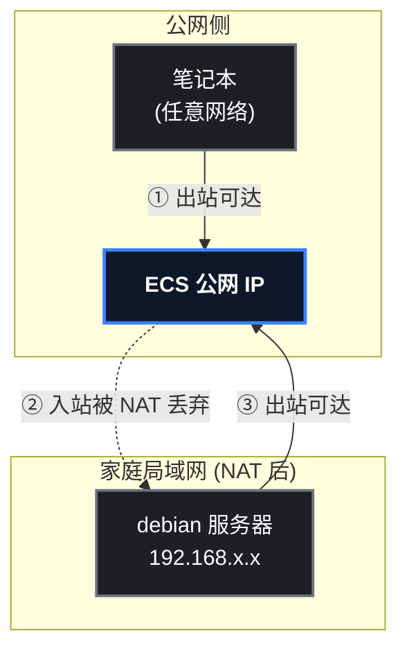

# 一条隧道，把 NAT 后的服务器接到公网

家里有台 debian 服务器，跑着 mihomo、Docker、kind 集群，人在公司或外地的时候想连上去干活——但它在家庭局域网后面，没有公网 IP，外面根本摸不到它。某开发者的解法：**让它自己主动"爬"出去，在唯一有公网 IP 的阿里云 ECS 上挂一个隧道入口**。从此不管在哪，一条命令直达家里的服务器，而且安全到脚本小子无从下手。

这篇文章完整记录这个方案：先讲透原理（NAT 为什么挡人、反向隧道为什么能钻出去），再对比工具选型，然后给出全部配置过程和真实踩过的三个坑。

## 这次要做什么

```
目标：通过公网 ECS 中转，实现在任意网络 SSH 访问位于家庭 NAT 后的 debian 服务器
产出：ssh debian-lan 一条命令直达；局域网内原有直连不受影响
安全：至少挡住脚本小子——不暴露额外公网端口、隧道账号无 shell、全链路密钥认证
```

## 原理：NAT 挡住了什么，隧道就钻什么

### 第一步：理解 NAT 的"单向门"

NAT（Network Address Translation，网络地址转换）让内网设备共享一个公网出口，但它是一扇**单向门**：内网设备主动出站，路由器放行并记住映射；公网侧想主动连进来，路由器没有对应记录，直接丢弃。



图中 ② 那条虚线就是死路：**别人永远无法主动找到你**。但注意 ① 和 ③——出站永远是通的。这就是全部突破口。

> 📌 一句话原理：**NAT 挡得住"别人来找你"，挡不住"你去找别人"。**

### 第二步：反向隧道 = 把"出站"变成"入站通道"

思路很朴素：既然 debian 能主动连 ECS，那就让它**主动连过去之后别断开**，并请求 ECS 开一个本地端口，把该端口收到的所有字节原封不动通过这条连接送回 debian 的 22 端口。这就是 SSH 反向端口转发（ ` -R ` ）：

```
ECS 上: 127.0.0.1:22022 (隧道入口, 只绑回环)
                 │
             隧道(常驻连接)
                 │
debian 上: sshd :22 (真正的服务)
```

之后你想访问 debian，只需先 SSH 到 ECS，再从 ECS 连 ` 127.0.0.1:22022 ` ——字节流顺着隧道就到了 debian。整个模型就像 IM 软件：两个 NAT 后的客户端都主动连公共服务器，服务器做会合点和中转。

> ⚠️ 新手提示：隧道只绑 ` 127.0.0.1 ` （回环地址）是关键安全动作——公网上**扫不到**这个端口，只有 ECS 本机进程能连。这是第一道，也是最重要的一道防线。

### 第三步：为什么 SSH 隧道足够安全

| 防护 | 手段 | 效果 |
|---|---|---|
| 端口不暴露 | 隧道绑 `127.0.0.1` | 公网扫描器看不到 22022，杜绝端口扫描 + 爆破 |
| 隧道账号无权限 | ECS 建 `tunnel` 用户（nologin）+ 密钥加 `permitlisten` 限制 | 即使隧道密钥泄露，也只能监听 22022 这一个端口，拿不到 shell |
| 全链路密钥 | 两端都禁密码登录 | 没有私钥 = 进不来 |
| 入口防爆破 | fail2ban + `PermitRootLogin prohibit-password` | 暴力猜密码直接封 IP |

## 工具选型：为什么是 SSH 隧道

| 方案 | 新增组件 | 安全性 | 墙内可用性 | 结论 |
|---|---|---|---|---|
| **SSH 反向隧道（autossh）** | 仅 debian 装 autossh | 高（复用 OpenSSH 安全模型） | ✅ 走 22 端口，稳 | **本次选用** |
| frp | 两端各一个守护进程 | 中（依赖 token 配置） | ✅ | 配置面大，安全性靠自觉 |
| WireGuard | 两端 + ECS 都要装 | 高（现代加密） | ✅ 需开 UDP 端口 | 适合以后升级为虚拟局域网 |
| Tailscale | 两端装客户端 | 高 | ⚠️ 控制面在海外，连通性不稳 | 墙内体验打折 |

SSH 隧道最大的优势：**ECS 上什么都不用装**（只用系统自带的 sshd），复用你已有的密钥体系，一条 systemd 服务就能托管。

## 前置条件

| 角色 | 要求 | 本次实测 |
|---|---|---|
| 内网服务器（debian） | Linux + 能出网 + root | Debian 13 (trixie) |
| 中转机（ECS） | 公网 IP + sshd + root | 阿里云 ECS，Debian 11，8.163.99.15 |
| 本机（笔记本） | ssh 客户端 | Windows + OpenSSH |

验证命令（先跑通再动手）：

```bash
# 内网服务器能出网连中转机？
ssh debian 'timeout 5 bash -c "echo > /dev/tcp/8.163.99.15/22" && echo 可达'
# 中转机 sshd 状态？
ssh server01 'sshd -T | grep -E "passwordauthentication|gatewayports"'
```

## 第1步：内网服务器装 autossh 并生成专用密钥

```bash
# debian 上执行
apt-get install -y autossh

# 生成隧道专用密钥（不要复用日常密钥，职责分离）
ssh-keygen -t ed25519 -f /root/.ssh/id_ed25519_tunnel -N "" -C "debian-tunnel@ECS"

# 复制公钥内容，下一步要用
cat /root/.ssh/id_ed25519_tunnel.pub
```

## 第2步：ECS 建受限隧道账号并安装公钥

```bash
# ECS 上执行
useradd -m -s /usr/sbin/nologin tunnel     # nologin: 永远无法登录 shell
mkdir -p /home/tunnel/.ssh && chmod 700 /home/tunnel/.ssh

# 写入受限公钥: 禁 agent/X11/pty/rc, 只允许监听 127.0.0.1:22022
echo 'no-agent-forwarding,no-X11-forwarding,no-pty,no-user-rc,permitlisten="127.0.0.1:22022" ssh-ed25519 AAAA... debian-tunnel@ECS' \
  > /home/tunnel/.ssh/authorized_keys
chmod 600 /home/tunnel/.ssh/authorized_keys && chown tunnel:tunnel /home/tunnel/.ssh/authorized_keys
```

> 📌 前置知识： ` permitlisten ` 是 OpenSSH 7.6+ 的 authorized_keys 选项，精准限制"这个密钥能请求监听哪些端口"，是隧道账号防滥用的核心。

## 第3步：ECS 安全加固

```bash
# 防爆破
apt-get install -y fail2ban && systemctl enable --now fail2ban

# 收紧 root 登录: 只允许密钥
sed -i 's/^PermitRootLogin yes/PermitRootLogin prohibit-password/' /etc/ssh/sshd_config
sshd -t && systemctl reload ssh
```

## 第4步：内网服务器 systemd 托管隧道

autossh 是"带心跳的 ssh"——连接断了会自动重连，配合 systemd 的 `Restart=always` 双保险：

```ini
# /etc/systemd/system/autossh-tunnel.service
[Unit]
Description=autossh reverse tunnel to ECS
After=network-online.target
Wants=network-online.target

[Service]
User=root
ExecStart=/usr/bin/autossh -M 0 -N \
  -o "ServerAliveInterval 30" -o "ServerAliveCountMax 3" \
  -o "ExitOnForwardFailure yes" -o "StrictHostKeyChecking accept-new" \
  -i /root/.ssh/id_ed25519_tunnel \
  -R 127.0.0.1:22022:localhost:22 tunnel@8.163.99.15
Restart=always
RestartSec=10

[Install]
WantedBy=multi-user.target
```

```bash
systemctl daemon-reload && systemctl enable --now autossh-tunnel
# 验证 ECS 侧出现监听
ssh server01 'ss -tlnp | grep 22022'   # 应显示 127.0.0.1:22022
```

> 📌 关键参数： ` -R 127.0.0.1:22022:localhost:22 ` = 在 ECS 上监听 127.0.0.1:22022，转发到 debian 的 22 端口； ` ServerAliveInterval 30 ` = 每 30 秒心跳保活； ` -M 0 ` = 关闭 autossh 老式监控端口，改用 SSH 自带心跳。

## 第5步：笔记本配置一条命令直达

```ini
# ~/.ssh/config 追加
Host debian-lan
  HostName 127.0.0.1
  Port 22022
  User root
  ProxyJump server01        # 先跳到 ECS
  IdentityFile C:/Users/beluga/.ssh/id_ed25519_debian
```

`ProxyJump` 的语义：先 SSH 到 server01（跳板），再从 server01 发起对 `127.0.0.1:22022` 的连接——正好落在隧道入口上。两段连接各自用各自的密钥认证。

## 第6步：补 known_hosts 条目（关键，别漏）

隧道入口的主机名是 ` 127.0.0.1:22022 ` ，而 debian 的密钥之前登记在 ` 192.168.8.26 ` 名下，SSH 会因"主机名对不上"拒绝连接。同一台机器的密钥相同，直接补一条别名条目：

```bash
grep "^192.168.8.26 " ~/.ssh/known_hosts \
  | sed 's/^192\.168\.8\.26 /[127.0.0.1]:22022 /' >> ~/.ssh/known_hosts
```

## 部署验证

```bash
ssh debian-lan 'hostname && hostname -I'
# 预期输出: debian 与 192.168.8.26 —— 说明字节流已穿过 笔记本→ECS→隧道→debian
```

完整链路示意：


## 踩过的坑（都是真实发生的）

### 坑1： ` restrict ` 和 ` permitlisten ` 打架（最坑）

一开始公钥写的是 ` restrict,permitlisten="127.0.0.1:22022" ` ，结果一直报 ` remote forward failure ` 。查了半天才发现：OpenSSH 8.4 上， ` restrict ` 隐含的"禁止转发"**优先级高于** ` permitlisten ` ，两者同时出现时转发被一刀切。

> ✅ 解法：不用 ` restrict ` ，把要禁的逐项写清楚： ` no-agent-forwarding,no-X11-forwarding,no-pty,no-user-rc,permitlisten=... ` 。效果一样，兼容性更好。

### 坑2：Host key verification failed

隧道入口主机名是 ` 127.0.0.1:22022 ` ，known_hosts 里登记的却是 ` 192.168.8.26 ` ，SSH 视为"陌生主机"直接拒绝。不是安全问题，是主机名对不上。

> ✅ 解法：把已知的 debian 主机密钥补一条隧道地址的条目（同一台机器，密钥一致），见第6步。

### 坑3： ` systemctl is-active ` 骗了你

检查 ECS 时 ` systemctl is-active fail2ban ` 返回 ` inactive ` ，以为装好了只是没启动——其实**根本没装**（单元文件不存在时它同样返回 inactive）。启动时报 ` Unit file fail2ban.service does not exist ` 才发现。

> ✅ 解法：确认软件是否安装用 ` dpkg -l fail2ban ` / ` apt list --installed ` ，别只看 systemctl 状态。

### 坑4（不算坑）：post-quantum 警告

新版 OpenSSH 客户端连旧版服务器（Debian 11 的 OpenSSH 8.4）时，每次都打印 "store now, decrypt later" 警告。这只是算法协商提示，不影响使用；根治方法是升级服务器 OpenSSH 版本。

## 总结与维护

**最终效果**： ` ssh debian-lan ` 一条命令，从任何网络直达家里的 debian；局域网内继续用 ` ssh debian ` 直连，互不干扰。

**可用性设计**：debian 重启后 systemd 自动拉起隧道；断线后 autossh 靠心跳感知并 10 秒内重连；ECS 重启也不影响（隧道是 debian 主动发起的，会自动重新建立）。

**安全边界回顾**：公网只暴露 ECS 的 22 端口（fail2ban 防爆破）；隧道入口绑回环、扫不到；隧道密钥即使泄露也只有一个受限于 `permitlisten` 的监听口，且账号无 shell。这套组合对脚本小子足够，对高级威胁建议后续升级 WireGuard 私有网络。

**运维小抄**：

```bash
ssh debian-lan                 # 外网访问内网服务器
ssh debian                     # 局域网直连
ssh server01 'ss -tlnp | grep 22022'   # 检查隧道入口是否在线
ssh debian 'systemctl status autossh-tunnel'   # 检查隧道守护状态
```
