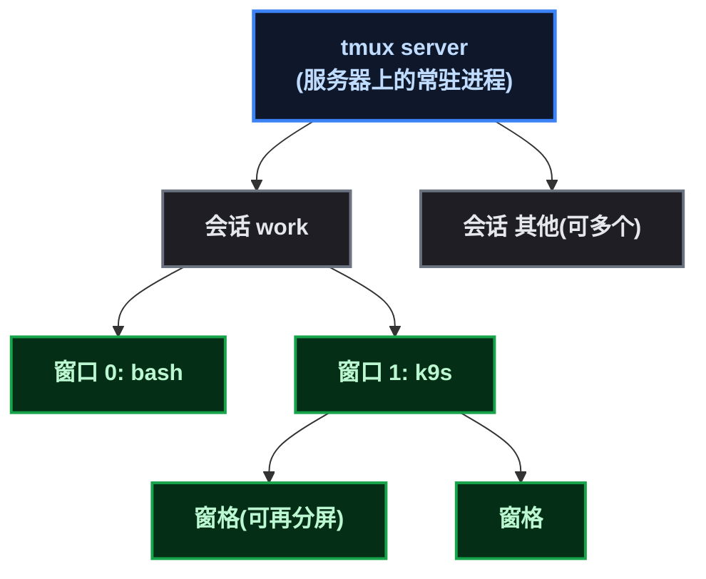
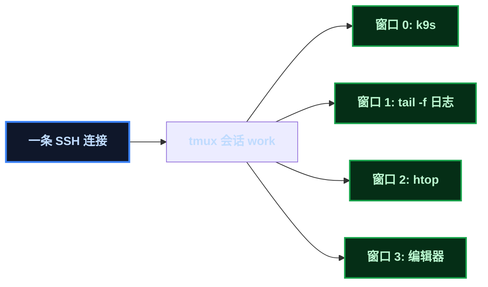

# 一个 SSH 连接，管所有终端

说一个真实的痛点。远程 SSH 到服务器后用 k9s 看集群，发现两件事很烦：k9s 启动要等一两秒，而且**它会把我的 Ctrl+B 截断**——Ctrl+B 本来是我切换 SSH 终端的快捷键，进了 k9s 就失灵；想切终端只能新开一个 SSH 连接，重新认证、重新进目录、重新找上下文，来回切几次心态就崩了。

tmux 就是来解决这类问题的标准工具（运维和开发都推荐）：**一个 SSH 连接里开多个终端窗口，会话持久保存——SSH 断了，会话还在**。这篇记录安装、核心概念、常用操作，以及我在服务器上的真实演示。

## 1. 动机先行：三个痛点，一个回应

| 痛点 | 没有 tmux 时 | 有 tmux 后 |
|------|------|------|
| 多终端切换 | 新开 SSH 连接（重新认证、丢上下文） | 一个连接内 Ctrl+B 切窗口 |
| 快捷键冲突 | k9s 等全屏工具截断 Ctrl+B | k9s 放进 tmux 窗口，切换归 tmux 管 |
| SSH 断线 | 正在跑的任务中断、上下文全丢 | **会话在服务器上继续跑，重连 attach 恢复** |

第三点是 tmux 最被低估的价值：**tmux 的会话属于服务器上的 tmux 进程，不属于你的 SSH 连接**——SSH 断了、电脑合盖了、网络抖了，会话照跑不误，重连回来 `tmux attach` 一切如初。

## 2. 安装

```bash
apt-get install -y tmux
tmux -V   # tmux 3.5a (Debian 源里就有, 一行搞定)
```

## 3. 原理：会话 / 窗口 / 窗格三件套

tmux 的层级关系一句话讲清：

- **会话（session）**：一次"工作现场"——最外层，可以命名、可以多个；
- **窗口（window）**：会话里的一个终端页签（类似浏览器 tab）；
- **窗格（pane）**：窗口里再分屏的小终端（上下/左右）。



**操作模型**：所有快捷键都是"先按前缀键，再按功能键"。tmux 默认前缀是 **Ctrl+B**（和你切换 SSH 终端的习惯一致，冲突问题见第 6 节）。

## 4. 常用操作速查

### 会话管理

| 操作 | 命令 / 快捷键 |
|------|------|
| 创建会话 | `tmux new -s 名字` |
| 创建分离会话（不进入） | `tmux new -s 名字 -d` |
| 列出会话 | `tmux ls` |
| 重新进入会话 | `tmux attach -t 名字` |
| 分离（退出但保持运行） | 前缀 + `d` |
| 销毁会话 | `tmux kill-session -t 名字` |

### 窗口管理（前缀 = Ctrl+B）

| 操作 | 快捷键 |
|------|------|
| 新建窗口 | 前缀 + `c` |
| 下一个 / 上一个窗口 | 前缀 + `n` / `p` |
| 跳到第 N 个窗口 | 前缀 + `0` ~ `9` |
| 关闭当前窗口 | 前缀 + `&` |
| 重命名窗口 | 前缀 + `,` |

### 窗格（分屏）

| 操作 | 快捷键 |
|------|------|
| 左右分屏 | 前缀 + `%` |
| 上下分屏 | 前缀 + `"` |
| 切换窗格 | 前缀 + 方向键 |

## 5. 亲自演示：真实终端输出

以下全部在我服务器上实测（非虚构）。

### 5.1 创建会话、执行命令

```bash
tmux new-session -d -s work          # 后台创建一个叫 work 的会话
tmux ls                              # 列出会话
```

```text
work: 1 windows (created Tue Aug 25 17:34:48 2026)
```

往会话的窗口里发命令（ ` send-keys ` 等于"模拟按键"， ` capture-pane ` 等于"给终端截图"）：

```bash
tmux send-keys -t work "echo hello-from-tmux && pwd" Enter
tmux capture-pane -t work -p
```

```text
root@debian:~# echo hello-from-tmux && pwd
hello-from-tmux
/root
root@debian:~#
```

### 5.2 把 k9s 放进 tmux 窗口（解决快捷键截断）

开第二个窗口专门跑 k9s：

```bash
tmux new-window -t work -n k9s       # 新建窗口, 命名 k9s
tmux send-keys -t work:k9s "k9s" Enter
tmux capture-pane -t work:k9s -p     # 截图: k9s 界面已经在窗口里
```

```text
 Context: kind-learn [RW]                          K9s Rev: v0.51.0
 Cluster: kind-learn                               ____  __ ________
 User:    kind-learn
```

k9s 在 tmux 窗口里正常运行。现在切换终端不再被截断——**Ctrl+B 属于 tmux（切换窗口），k9s 只在它自己的窗口里响应自己的快捷键**，两者各管各的。

### 5.3 跨 SSH 断线持久化（核心价值演示）

关键实验：**断开当前 SSH，新开一条 SSH，会话还在吗？**

```bash
# SSH 连接 1: 创建会话 + 跑 k9s (第 5.1/5.2 节) —— 然后断开这条 SSH
# SSH 连接 2 (全新连接):
tmux ls
```

```text
work: 2 windows (created Tue Aug 25 17:34:48 2026)
```

**会话 `work` 完整存活**——两个窗口、k9s 还在跑。这就是"SSH 断了不丢"的实证：tmux 会话归服务器上的 tmux 进程，不归你的 SSH 连接。重连后 `tmux attach -t work` 就回到原来的现场。

> ⚠️ 新手提示： ` tmux attach ` 需要一个真正的终端。在非交互环境（如脚本里）会报 ` open terminal failed: not a terminal ` ——这不是 tmux 坏了，是它要求 TTY，交互式 SSH 里正常。

## 6. 配置建议：前缀键冲突的解法

tmux 默认前缀 Ctrl+B——如果你和我一样，SSH 客户端（或终端模拟器）也用 Ctrl+B 切终端 tab，两个会打架：tmux 前台时 Ctrl+B 被 tmux 吃掉。两个解法：

**解法一（推荐）：用 tmux 窗口代替 SSH 切 tab**——进入 tmux 后不再需要 SSH 层切换，Ctrl+B 数字直接跳窗口，习惯几天就很顺。

**解法二：改前缀键**——`~/.tmux.conf` 里换成 Ctrl+A（screen 风格，注意 Ctrl+A 在 shell 里是行首跳转，二选一）：

```bash
cat >> ~/.tmux.conf <<'EOF'
set -g prefix C-a            # 前缀从 Ctrl+B 改成 Ctrl+A
unbind C-b
bind C-a send-prefix
EOF
```

可选增强（新人建议都开）：

```bash
set -g mouse on              # 鼠标滚轮/选择
set -g history-limit 10000   # 回滚历史加大
```

改完 `tmux kill-server` 重启生效（旧会话会丢，先确认没有重要会话）。

## 7. 实战场景

| 场景 | 怎么用 |
|------|------|
| 远程运维 | SSH 连一次，窗口 0 跑 k9s、窗口 1 跟日志（ ` tail -f ` ）、窗口 2 查指标——Ctrl+B 0/1/2 切换 |
| 长任务不中断 | 构建、压测、数据迁移放 tmux 会话里，断开 SSH 任务照跑，重连 `attach` 看结果 |
| 多服务器管理 | 每台服务器一个会话（ ` tmux new -s debian ` / ` -s server01 ` ）， ` tmux ls ` 一目了然 |
| 掉线自愈 | 网络抖了 SSH 断了，重连 `tmux attach` 回到原现场——不用重新 cd、不用重新找上下文 |



## 8. 总结

三个记忆点：

1. **一个 SSH 连接，N 个窗口**：Ctrl+B 前缀键管理窗口/窗格，k9s 这类全屏工具放进自己的窗口，快捷键各管各的；
2. **会话在服务器上，不在你的连接里**：SSH 断了会话照跑，重连 `tmux attach` 恢复现场——这是远程运维的保命技能；
3. **前缀键冲突有解**：要么用 tmux 窗口代替 SSH 切 tab，要么 `set -g prefix C-a` 改键。

和 k9s 搭配的最终形态：SSH 连一次 → tmux 会话 → k9s/日志/监控/编辑器各占一个窗口——Ctrl+B 自由切换，断线不慌，重连即回。这基本就是远程运维的标准姿势了。

（本篇无图片/视频占位。）
