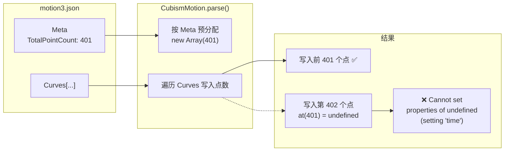
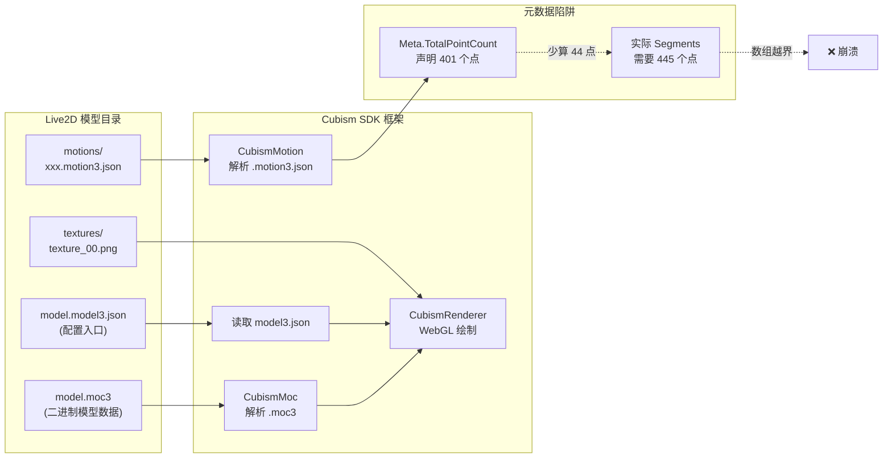

# Live2D 调包侠踩坑记：一个「少算 44 个点」引发的渲染崩溃

## 故事的开端

某开发者最近在折腾网页 Live2D 看板娘。项目基于 naihe-live2d-widget-v3，它对标的是经典的 live2d-widget，但底层换成了最新的 Cubism SDK for Web v5，专门渲染 .moc3 格式的新版模型。

一切看起来都很顺利——直到把从游戏里提取的一个猫耳角色模型（编号 416）丢进去。

模型加载了，但动作一播放就崩。刷新，又崩。时好时坏，但大部分时间页面一片空白，控制台躺着一行红字：

```
Uncaught (in promise) TypeError: Cannot set properties of undefined (setting 'time')
```

对调包侠来说，这可能就是那一刻想关电脑的信号。

## 定位问题：不是模型坏了，是 Meta 骗了 SDK

报错指向 `live2d-sdk.js` 中 `parse` 函数的某个 `.time` 赋值操作。顺着调用栈往上翻：

```
parse → create → loadMotion → preLoadMotionGroup → setupModel → loadAssets
```

——动作文件解析时崩溃了。

> 📌 前置知识：Live2D 的 `.motion3.json` 文件描述了一条条动画曲线。每条曲线包含一串「段」（segments），每个段由若干个「控制点」（points）定义。Meta 段会预先声明总点数和总段数，方便 SDK 预分配内存。

某个开发者的直觉是：会不会是 Meta 里声明的数量跟实际数据对不上？

写了一段简单的验证脚本跑了一下：

```javascript
let calculatedPoints = 0;
for (const curve of curves) {
    const segs = curve.Segments;
    let pos = 0, first = true;
    while (pos < segs.length) {
        if (first) { calculatedPoints++; pos += 2; first = false; }
        const segType = segs[pos];
        switch (segType) {
            case 0: calculatedPoints++; pos += 3; break;  // 线性
            case 1: calculatedPoints += 3; pos += 7; break; // 贝塞尔
            case 2: calculatedPoints++; pos += 3; break;  // 步进
            case 3: calculatedPoints++; pos += 3; break;  // 反向步进
        }
    }
}
```

结果一看——**全都对不上**。

## 数据不会骗人

该模型有 8 个 `.motion3.json` 文件，逐个检查：

| 文件 | Meta 声明点数 | 实际需要点数 | 差值 |
|------|:---:|:---:|:---:|
| broken_1 | 401 | 445 | +44 |
| broken_2 | 746 | 790 | +44 |
| broken_3 | 1231 | 1275 | +44 |
| broken_4 | 176 | 220 | +44 |
| broken_5 | 255 | 299 | +44 |
| daiji_idle_01 | 1708 | 1752 | +44 |
| login | 357 | 401 | +44 |
| shake | 337 | 381 | +44 |

规律非常整齐：**每个文件都少算了 44 个点**。段数也多算了 46 段（把起始点的伪段也算进去了）。

8 个文件，同一套错误模式，误差完全一致。不是随机损坏，是提取工具的计算公式有 bug。



流程一目了然：Meta 说 401 → 分配 401 个坑 → 实际写了 445 个 → 第 402 个坑开始就是 `undefined` → 赋值 `.time` 时崩溃。

这其实是一个很经典的**元数据与数据不一致**的 bug，放在数据库、消息队列、配置文件里都似曾相识。只是这次藏在了 Live2D 的动作文件里。

## 为什么提取工具会算错

游戏提取工具在打包 `.motion3.json` 时，需要遍历 Curves 数组，解析每个 Segments，累加出 TotalPointCount 和 TotalSegmentCount。

问题出在**段类型的边界处理**上。Cubism SDK 的 Segments 数组格式是：

```
[起始时间, 起始值, 段类型0, 参数..., 段类型1, 参数..., ...]
```

- 段类型 `0` （线性）：+1 个点
- 段类型 `1` （贝塞尔）：+3 个点
- 段类型 `2` / `3` （步进/反向步进）：+1 个点

但起始的 `[时间, 值]` **本身也算一个点**，却**不占一个段类型位置**。提取工具很可能在处理这个「无类型的起始点」时数漏了，导致每个曲线末尾少算几个点。因为模型有 45 条曲线，累计下来恰好 44 个点——差不多每条曲线少算 1 个点的样子。

> ⚠️ 新手提示：如果你用 Cubism Editor 官方工具导出的是不会出这个问题的。只有用第三方游戏提取工具才会遇到。官方导出的 Meta 计数是精确的。

## 修复方案

### 方案一：手动改 Meta（不推荐）

找到每个文件的 `Meta.TotalPointCount` 和 `Meta.TotalSegmentCount` ，改成正确的值。8 个文件改 16 个数字，看起来简单，但下次再遇到一个新模型又得来一遍。

### 方案二：自动化修复脚本（推荐）

写一个 Node.js 脚本，遍历所有 `.motion3.json` 文件，重新计算正确计数并写回。

核心逻辑就是上面的验证代码加一层文件读写：

```javascript
const fs = require('fs');
const path = require('path');

function fixMotionFile(filePath) {
    const data = JSON.parse(fs.readFileSync(filePath, 'utf-8'));
    let points = 0, segments = 0;

    for (const curve of data.Curves) {
        let pos = 0, first = true;
        while (pos < curve.Segments.length) {
            if (first) { points++; pos += 2; first = false; }
            else { segments++; }
            const t = curve.Segments[pos];
            if (t === 0 || t === 2 || t === 3) { points++; pos += 3; }
            else if (t === 1) { points += 3; pos += 7; }
        }
    }

    data.Meta.TotalPointCount = points;
    data.Meta.TotalSegmentCount = segments;
    fs.writeFileSync(filePath, JSON.stringify(data, null, 2));
}
```

跑一遍，全部修好，立竿见影。

### 方案三：加固 SDK 解析器（治本）

在 `CubismMotion.parse()` 中，当实际写入点数超出 Meta 声明时，自动扩容而不是直接崩溃——但这需要改动框架代码，维护成本更高。对调包侠来说，修好数据本身才是性价比最高的选择。

## 学到的教训

1. **游戏提取的 Live2D 资源文件，Meta 段不一定可信。** 遇到 `.motion3.json` 解析崩溃，优先怀疑 TotalPointCount。

2. **"Cannot set properties of undefined" 这个报错，关键是看它在**哪一步**崩溃。调包栈比看具体变量名更有用。从 `parse → create → loadMotion → preLoadMotionGroup` 这个链路，可以锁定是动作文件解析阶段的问题。

3. **统计规律是很好的调试线索。** 8 个文件偏差都是 44，而不是随机的 37、51、22，说明是系统性错误而不是随机损坏。这让人能放心地批量修复，而不是逐个排查。

4. **把修复过程工具化。** 把脚本提交到模型仓库的 `tools/` 目录，以后任何新模型进来跑一遍就行。吃过的亏，不让它吃第二次。



其实说到底，这个 bug 跟 Live2D 本身没有太大关系。它就是一个「A 说 401，B 实际有 445」的不一致问题。只不过因为 Live2D 的二进制模型文件（ `.moc3` ）对大多数人来说是黑盒，大家容易觉得是模型坏了，而忽略了藏在 JSON 里的这个小小的数字。

## 后续

修复脚本已经提交到了模型仓库，顺便写了一篇 README，立下了新模型入库的规范：

```
model/<model-name>/
├── <name>.model3.json    # 模型配置（必需）
├── <name>.moc3           # 模型数据（必需）
├── <name>.physics3.json  # 物理演算（可选）
├── config.json           # 挂件配置（scale/translate）
├── motions/              # 动作文件
├── exp/                  # 表情文件
└── tools/                # 修复工具
```

下次遇到类似问题，跑一句 `node tools/fix-motion-metadata.js model/xxx` 就行。

这件事也说明一个道理：**不管是多高深的技术栈，bug 的根因往往朴实无华。** 有时就是少算了一个数而已。而作为调包侠，最关键的技能不是看懂每一行 SDK 源码，而是知道怀疑哪里、怎么验证、修完怎么确保不再犯。
