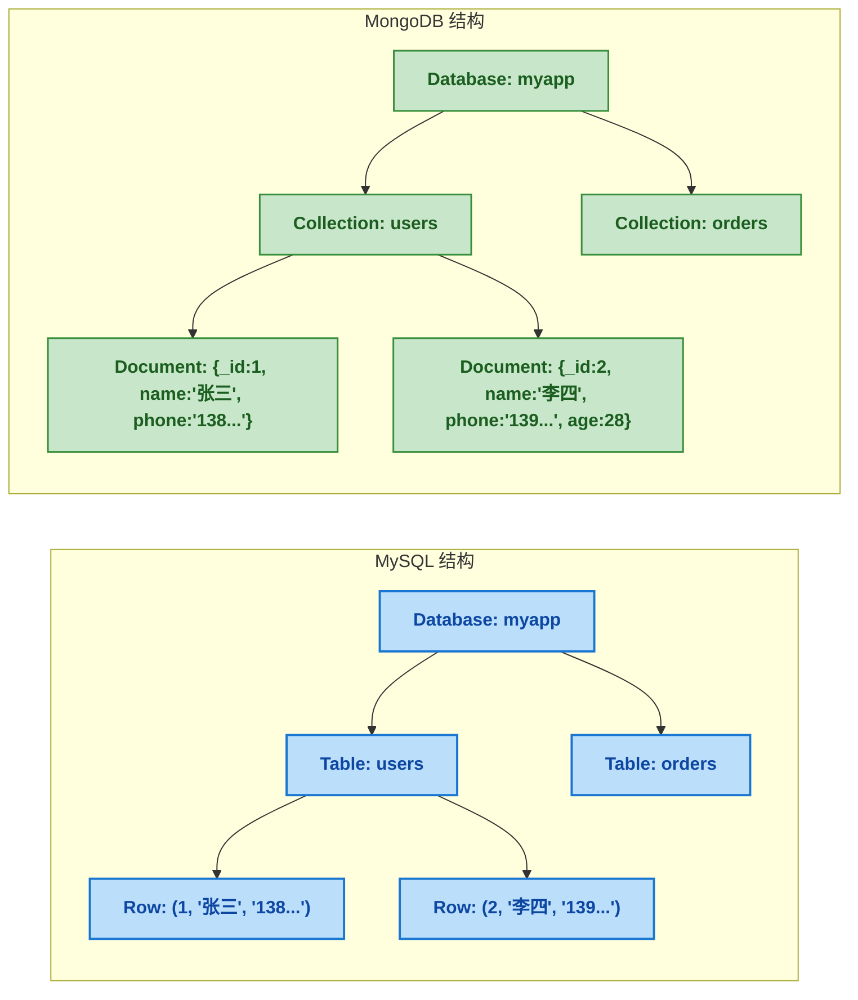

# MongoDB 核心概念：文档模型、BSON 与查询操作符全解析

## 一、⚡ 问题切入：MySQL 为什么不适合这个场景？

先看一个典型的系统设计需求。你正在开发一个 SaaS 平台的"用户自定义表单"功能——每个客户可以自己创建表单，定义不同的字段：

```
客户A：报名表     → 姓名、手机号、紧急联系人姓名、紧急联系人电话、是否过敏（是/否）
客户B：问卷表     → 昵称、年龄、兴趣爱好（多选）、详细简历（文本）、作品链接
客户C：订单表     → 商品名、单价、数量、收货地址（省/市/区/详细）、发票抬头、纳税人识别号
```

用 MySQL 做这件事，摆在面前的有三条路：

**方案一：一张宽表**

```sql
CREATE TABLE form_data (
    id BIGINT PRIMARY KEY,
    field_1 VARCHAR(200),   -- 姓名/昵称/商品名
    field_2 VARCHAR(200),   -- 手机号/年龄/单价
    field_3 VARCHAR(200),   -- 紧急联系人/兴趣爱好/数量
    -- ... 预留 50 个字段
    field_50 VARCHAR(200)
);
```

客户A的"紧急联系人电话"存在 `field_4`，客户B的"作品链接"存在 `field_5`，客户C的"纳税人识别号"存在 `field_7`。字段名没有任何业务含义，查询时只能对着文档翻"field_4 到底存了什么"。SQL 写成：

```sql
SELECT * FROM form_data WHERE field_1 = '张三' AND field_2 = '13800000000';
```

这已经不是在写代码了，是在玩解谜游戏。

**方案二：EAV 模型（Entity-Attribute-Value）**

```sql
CREATE TABLE form_field_values (
    record_id BIGINT,
    field_name VARCHAR(50),     -- "姓名"、"手机号"、"兴趣爱好"
    field_value VARCHAR(500),   -- "张三"、"13800000000"、"篮球,足球"
    PRIMARY KEY (record_id, field_name)
);
```

一条记录拆成 N 行，查询"爱好包含篮球且年龄大于 25 的用户"需要自关联 JOIN 多次，SQL 膨胀到几十行。看似灵活，实则<strong>把行级操作变成了表级灾难</strong>。

**方案三：JSON 列**

```sql
CREATE TABLE form_data (
    id BIGINT PRIMARY KEY,
    data JSON
);
INSERT INTO form_data VALUES (1, '{"name":"张三","phone":"13800000000","allergy":false}');
```

MySQL 5.7 开始支持 JSON 类型，能存、能查、能建虚拟列索引。但 JSON 字段没法建普通索引，复杂嵌套查询的 SQL 语法别扭得像在写正则。而且 500 万条 JSON 数据放在一张表里，查询性能堪忧。

这三个方案都在暴露同一个根本问题：<strong>MySQL 要求所有行有相同的列结构（Schema），而你的数据天生是异构的</strong>——不同客户定义不同的字段，同一套 Schema 装不下所有的数据形状。

这就是 MongoDB 存在的根本原因。

## 二、🧬 MongoDB 是什么：基于文档模型的 NoSQL 数据库

### 2.1 定义

MongoDB 是一个<strong>基于文档模型的、分布式、NoSQL 数据库</strong>。每一个词都是核心特征：

| 特征 | 含义 |
|------|------|
| **基于文档模型** | 数据以 Document（文档）为单位存储，一个 Document 是一段自包含的 JSON-like 结构（BSON）。同一个 Collection 中的 Document 可以有完全不同的字段 |
| **分布式** | 原生支持分片（Sharding）+ 副本集（Replica Set），横向扩展能力与生俱来 |
| **NoSQL** | 没有固定的表结构（Schema-less），不需要预先定义字段类型；没有 JOIN；没有事务（4.0 开始支持多文档事务，但性能不如单文档操作） |

<strong>MongoDB 的核心设计理念</strong>：单个 Document 里嵌入所有相关数据，一次查询就能拿到完整信息。不需要跨表 JOIN，不需要 ORM 做对象关系映射。存在 MongoDB 里的 JSON 和你代码里的 Java 对象，长得几乎一模一样。

### 2.2 核心概念速查：对比 MySQL 学 MongoDB

MySQL 和 MongoDB 的概念有对应关系，建立这个映射能快速上手：

| MongoDB | MySQL | 说明 |
|------|------|------|
| **Database** | Database | 数据库，一个应用一个 Database |
| **Collection（集合）** | Table（表） | 一组 Document 的集合。不需要 `CREATE TABLE`——直接往里写就自动创建 |
| **Document（文档）** | Row（行） | 一条记录，以 BSON 格式存储。同一个 Collection 里的 Document 字段可以完全不同 |
| **Field（字段）** | Column（列） | 文档中的一个 Key-Value 对 |
| **`_id`** | Primary Key | 必选字段，MongoDB 自动生成 ObjectId（12 字节全局唯一 ID） |
| **Index** | Index | 同样是 B-Tree 索引，创建一个索引的语法几乎相同 |
| **Embedded Document** | JOIN 表 | 把关联数据直接嵌入到主 Document 里，不需要跨表查询 |



注意 `N_DOC2` 比 `N_DOC1` 多了一个 `age` 字段——这在 MongoDB 里完全合法，但在 MySQL 里你需要 ALTER TABLE 先加列。

### 2.3 BSON —— MongoDB 的数据格式

MongoDB 存储的数据格式叫 <strong>BSON（Binary JSON）</strong>。它和 JSON 的关系是：<strong>JSON 是给人看的，BSON 是给机器存的</strong>。

```json
// JSON（文本格式，人类可读）
{
  "_id": "507f1f77bcf86cd799439011",
  "name": "张三",
  "age": 28,
  "tags": ["Java", "MongoDB"],
  "address": {
    "city": "北京",
    "street": "中关村大街"
  }
}
```

BSON 与 JSON 的核心区别：

| 维度 | JSON | BSON |
|------|------|------|
| **格式** | 文本字符串 | 二进制编码 |
| **数据类型** | 只有 String / Number / Boolean / Array / Object / null | <strong>额外支持</strong>：Date、ObjectId、Int32、Int64、Decimal128、Binary Data |
| **解析** | 遍历字符串解析，O(n) | 直接读长度前缀，O(1) 跳过多余字段 |
| **存储大小** | 更小（文本压缩） | 更大（冗余字段方便快速遍历） |
| **适用场景** | 网络传输、人类阅读 | 磁盘存储、内存遍历 |

JSON 没有原生的日期类型——所有日期在 JSON 里都是字符串 `"2024-01-15"`，解析时需要手动转。BSON 有 `Date` 类型，直接存 UTC 时间戳，毫秒精度。这对按日期查询和排序的场景至关重要。

BSON 支持的数据类型速查：

| 类型 | 别名 | 说明 | 示例 |
|------|------|------|------|
| Double | `"double"` | 64 位浮点数 | `3.14` |
| String | `"string"` | UTF-8 字符串 | `"张三"` |
| Object | `"object"` | 嵌入文档 | `{ "city": "北京" }` |
| Array | `"array"` | 数组 | `["Java", "Go"]` |
| ObjectId | `"objectId"` | 12 字节全局唯一 ID | `ObjectId("507f...")` |
| Date | `"date"` | UTC 时间戳（毫秒） | `ISODate("2024-01-15T10:30:00Z")` |
| Int32 | `"int"` | 32 位整数 | `28` |
| Int64 | `"long"` | 64 位整数 | `NumberLong("1234567890")` |
| Decimal128 | `"decimal"` | 高精度小数（金额专用） | `NumberDecimal("6999.00")` |
| Bool | `"bool"` | true / false | `true` |
| Null | `"null"` | 空值 | `null` |

<strong>ObjectId 的巧妙设计</strong>：12 个字节不是随机的，它们有结构：

```
ObjectId = 4字节时间戳 + 5字节随机值 + 3字节计数器
                  ↑              ↑            ↑
            按时间排序      机器+进程标识    同一秒内的自增

// 这意味着 ObjectId 天然按生成时间排序——用来做 _id 时不需要额外的 createTime 索引
```

### 2.4 MongoDB vs MySQL 思维差异

从 MySQL 转向 MongoDB，最根本的思维转变是对"数据长什么样"的理解：

| 思维 | MySQL | MongoDB |
|------|-------|---------|
| **数据组织** | 按行对齐——每行字段完全一样 | 按文档聚合——同一个 Collection 里文档可以不同 |
| **关联查询** | JOIN——查一次关联一次 | 嵌入——把关联数据直接放进主文档 |
| **Schema** | 强制执行（ALTER TABLE） | 不强制——可以没有任何 Schema，也可以用 JSON Schema 做验证 |
| **事务** | 所有操作都在事务里 | 4.0+ 支持多文档事务，但<strong>推荐优先用单文档原子操作</strong> |
| **扩展方式** | 主从读写分离 + 分库分表（复杂） | 副本集自动故障转移 + 分片自动数据分布 |

一个具体的例子——电商的"订单 + 订单明细"：

```sql
-- MySQL：两张表 + 外键 + JOIN
CREATE TABLE orders (
    id BIGINT PRIMARY KEY,
    user_id BIGINT,
    total DECIMAL(10,2),
    create_time DATETIME
);
CREATE TABLE order_items (
    id BIGINT PRIMARY KEY,
    order_id BIGINT,
    product_name VARCHAR(200),
    price DECIMAL(10,2),
    quantity INT,
    FOREIGN KEY (order_id) REFERENCES orders(id)
);
-- 查询：SELECT * FROM orders o JOIN order_items oi ON o.id = oi.order_id WHERE o.id = 10001;
```

```javascript
// MongoDB：一个 Document 嵌入所有数据
{
  _id: ObjectId("..."),
  userId: 1001,
  total: NumberDecimal("6999.00"),
  createTime: ISODate("2024-01-15T10:30:00Z"),
  items: [
    { productName: "华为Mate60 Pro", price: NumberDecimal("6999.00"), quantity: 1 }
  ]
}
// 查询：db.orders.findOne({ _id: ObjectId("...") })
// 一次查询，订单 + 明细一次性全拿到了
```

这就是 MongoDB 的核心哲学：<strong>一起被读取的数据，应该存在一起</strong>。

## 三、🔧 mongosh 基础操作

### 3.1 安装 MongoDB

推荐 Docker 方式：

```bash
# 启动单节点 MongoDB 7.0
docker run -d --name mongo7 -p 27017:27017 mongo:7.0

# 进入 mongosh 交互式 shell
docker exec -it mongo7 mongosh
# 输出：test>
```

`mongosh` 是 MongoDB 的官方交互式 Shell，完全基于 JavaScript 语法。这意味着<strong>你可以在 Shell 里写 JavaScript 代码</strong>——循环、变量、函数全都可以。

### 3.2 Database & Collection 操作

```javascript
// 查看所有数据库
show dbs

// 切换/创建数据库（MongoDB 在第一次写入数据时才真正创建）
use myapp

// 查看当前数据库
db.getName()
// 返回：myapp

// 查看所有 Collection
show collections

// Collection 不需要手动创建——第一次写入数据时自动创建
// 但也可以显式创建（指定配置项）
db.createCollection("users", {
  validator: {                          // JSON Schema 验证（可选）
    $jsonSchema: {
      bsonType: "object",
      required: ["name", "email"],
      properties: {
        name: { bsonType: "string" },
        email: { bsonType: "string" },
        age: { bsonType: "int", minimum: 0, maximum: 150 }
      }
    }
  }
})

// 删除 Collection
db.users.drop()
```

### 3.3 文档 CRUD

<strong>插入（Insert）</strong>

```javascript
// 插入一条
db.users.insertOne({
  name: "张三",
  email: "zhangsan@example.com",
  age: 28,
  tags: ["Java", "MongoDB"],
  address: { city: "北京", street: "中关村大街" }
})
// 返回：{ acknowledged: true, insertedId: ObjectId("...") }

// 插入多条
db.users.insertMany([
  { name: "李四", email: "lisi@example.com", age: 32, tags: ["Go", "Docker"] },
  { name: "王五", email: "wangwu@example.com", age: 25 }   // 没有 tags 和 address，完全合法
])

// 插入一条没有 age 字段的
db.users.insertOne({ name: "赵六", email: "zhaoliu@example.com", gender: "男" })
// gender 字段其他文档都没有，也完全合法
```

<strong>查询（Find）</strong>

```javascript
// 查询所有
db.users.find()

// 条件查询：age = 28
db.users.find({ age: 28 })

// 条件查询：age > 25
db.users.find({ age: { $gt: 25 } })

// 多条件 AND
db.users.find({ age: { $gt: 25 }, "address.city": "北京" })

// 只返回指定字段（1 = 包含，0 = 排除。_id 默认包含）
db.users.find({ age: { $gt: 25 } }, { name: 1, email: 1, _id: 0 })

// 查一条（返回 Document 本身，不是 Cursor）
db.users.findOne({ name: "张三" })
```

<strong>更新（Update）</strong>

```javascript
// 更新单条：找到 name=张三 → 改 age 为 29
db.users.updateOne(
  { name: "张三" },
  { $set: { age: 29 } }
)

// 更新多条：所有 age < 20 的标记为 junior
db.users.updateMany(
  { age: { $lt: 20 } },
  { $set: { level: "junior" } }
)

// 注意以下常见错误：
// ❌ db.users.updateOne({name:"张三"}, {age: 29})
// 不写 $set → 整个文档被替换成 {age:29}，其他字段全部丢失！

// 原子增减
db.users.updateOne(
  { name: "张三" },
  { $inc: { age: 1 } }           // age 原子 +1
)

// push 元素到数组
db.users.updateOne(
  { name: "张三" },
  { $push: { tags: "Spring" } }   // tags 数组追加 "Spring"
)
```

<strong>删除（Delete）</strong>

```javascript
// 删除一条
db.users.deleteOne({ name: "赵六" })

// 删除多条（条件匹配的全部删除）
db.users.deleteMany({ age: { $lt: 18 } })

// 删除 Collection 中所有文档
db.users.deleteMany({})
```

### 3.4 查询操作符详解

MongoDB 的查询操作符以 `$` 开头，这与 JSON/JS 生态保持一致。以下是分类速查：

<strong>比较操作符</strong>

| 操作符 | 含义 | 示例 |
|--------|------|------|
| `$eq` | 等于（=） | `{ age: { $eq: 28 } }` |
| `$ne` | 不等于（!=） | `{ age: { $ne: 28 } }` |
| `$gt` | 大于（>） | `{ age: { $gt: 28 } }` |
| `$gte` | 大于等于（>=） | `{ age: { $gte: 28 } }` |
| `$lt` | 小于（<） | `{ age: { $lt: 30 } }` |
| `$lte` | 小于等于（<=） | `{ age: { $lte: 30 } }` |
| `$in` | 在集合中 | `{ age: { $in: [25, 28, 32] } }` |
| `$nin` | 不在集合中 | `{ age: { $nin: [25, 30] } }` |

<strong>逻辑操作符</strong>

```javascript
// $and：所有条件都满足
db.users.find({
  $and: [
    { age: { $gt: 25 } },
    { tags: "Java" }
  ]
})
// 注：多数情况下不需要显式写 $and。直接写逗号分隔的条件就是 AND：
// db.users.find({ age: {$gt: 25}, tags: "Java" })

// $or：任一条件满足
db.users.find({
  $or: [
    { age: { $lt: 25 } },
    { tags: "Java" }
  ]
})

// $not：条件取反
db.users.find({
  age: { $not: { $gt: 30 } }    // age 不大于 30 = age ≤ 30
})

// $nor：所有条件都不满足
db.users.find({
  $nor: [
    { tags: "Java" },
    { age: { $gt: 35 } }
  ]
})
// 等价 SQL：NOT (tags CONTAINS 'Java' OR age > 35)
```

<strong>元素操作符</strong>

```javascript
// $exists：字段存在/不存在
db.users.find({ age: { $exists: true } })    // 有 age 字段的
db.users.find({ gender: { $exists: false } }) // 没有 gender 字段的

// $type：按类型筛选
db.users.find({ age: { $type: "int" } })      // age 是 int32 类型的
db.users.find({ age: { $type: ["int", "long"] } })  // age 是整数类型的
```

<strong>数组操作符</strong>

```javascript
// 精确匹配整个数组（很少用）
db.users.find({ tags: ["Java", "MongoDB"] })
// 只匹配 tags 恰好 = ["Java", "MongoDB"] 的，顺序也必须一样

// $all：包含所有指定值（无视顺序、无视额外元素）
db.users.find({ tags: { $all: ["Java", "MongoDB"] } })
// 匹配 tags = ["Java", "MongoDB", "Spring"] ✓
// 匹配 tags = ["MongoDB", "Java"] ✓
// 匹配 tags = ["Java"] ✗

// $elemMatch：数组中至少一个元素满足所有条件
db.orders.find({
  items: {
    $elemMatch: {
      productName: "华为手机",
      price: { $gt: 5000 }
    }
  }
})
// 查找"订单中至少有一个商品是华为手机且价格 > 5000"的订单

// $size：数组长度
db.users.find({ tags: { $size: 2 } })    // tags 数组恰好 2 个元素
```

<strong>嵌套文档查询</strong>

```javascript
// 用点号访问嵌入文档的字段
db.users.find({ "address.city": "北京" })

// 精确匹配整个嵌入文档（字段顺序也必须一样，很少用）
db.users.find({ address: { city: "北京", street: "中关村大街" } })
// 推荐始终用点号，而不是精确匹配嵌入文档
```

### 3.5 排序、分页与计数

```javascript
// 排序：1 = 升序，-1 = 降序
db.users.find().sort({ age: -1 })

// 多字段排序：先按 age 降序，age 相同的按 name 升序
db.users.find().sort({ age: -1, name: 1 })

// 分页：skip + limit
db.users.find().skip(0).limit(10)    // 第 1 页
db.users.find().skip(10).limit(10)   // 第 2 页

// 计数
db.users.countDocuments({ age: { $gt: 25 } })

// 去重
db.users.distinct("address.city")
// 返回：["北京", "上海", "深圳"]
```

> ⚠️ 新手提示：`skip + limit` 分页越到后面越慢——MongoDB 也需要遍历前 N 条再跳过（跟 ES 的 `from + size` 一样的问题）。深度分页建议用<strong>游标分页</strong>：记录上一页最后一条的 `_id`，下一页从 `_id > lastId` 开始查。第四篇会详细讲。

## 四、📊 B-Tree 索引入门

MongoDB 的索引底层也是 <strong>B-Tree</strong>（和 MySQL 一样）。但 MongoDB 不叫"建索引"，叫 <strong>createIndex</strong>。

```javascript
// 给 email 字段建唯一索引
db.users.createIndex({ email: 1 }, { unique: true })

// 给 age 建降序索引
db.users.createIndex({ age: -1 })

// 复合索引（age + name）
db.users.createIndex({ age: 1, name: 1 })

// 查看索引
db.users.getIndexes()

// 删除索引
db.users.dropIndex("email_1")
```

索引的创建和使用规则跟 MySQL 几乎一致——最左前缀匹配、覆盖索引、索引选择性。不同的是 MongoDB 还支持一些特殊索引类型（文本索引、TTL 索引、地理空间索引），这些在第四篇详细展开。

用一个实际查询验证索引效果：

```javascript
// 没有索引时（COLLSCAN：全 Collection 扫描）
db.users.find({ email: "zhangsan@example.com" }).explain("executionStats")
// "winningPlan": { "stage": "COLLSCAN" }  ← 全表扫描
// "executionTimeMillis": 52

// 创建索引后
db.users.createIndex({ email: 1 })

// 再次 explain
db.users.find({ email: "zhangsan@example.com" }).explain("executionStats")
// "winningPlan": { "stage": "IXSCAN" }  ← 索引扫描
// "executionTimeMillis": 1
```

`explain("executionStats")` 是 MongoDB 的 `EXPLAIN`——看查询走没走索引、扫描了多少文档、耗时多少。`stage: "COLLSCAN"` 就是全表扫描信号，需要建索引。

## 五、🎯 总结

本文从 MySQL 不能高效处理"异构数据"的困境出发，逐步拆解了 MongoDB 的核心概念：

1. <strong>文档模型 vs 关系模型</strong>：MongoDB 存的是 BSON 文档，同一个 Collection 里的 Document 字段可以完全不同。核心哲学是"一起被读取的数据，应该存在一起"——用嵌入替代 JOIN。

2. <strong>BSON 数据类型</strong>：比 JSON 多了 Date、ObjectId、Decimal128 等原生类型。ObjectId 的 12 字节结构包含时间戳，天然按时间排序。

3. <strong>mongosh CRUD</strong>：`insertOne/insertMany`、`find/findOne`（支持 $gt/$lt/$in/$and/$or/$elemMatch 等操作符）、`updateOne/updateMany`（务必用 `$set/$inc/$push`，否则整个文档被替换）、`deleteOne/deleteMany`。

4. <strong>索引入门</strong>：底层 B-Tree，`createIndex` 建索引，`explain("executionStats")` 查看索引使用情况。`COLLSCAN` = 全表扫描，需要建索引。

理解 MongoDB 的关键不是记住每个操作符，而是理解 <strong>"数据为什么要存成文档而不是行，什么场景下嵌入优于关联"</strong>。脑子里有了这张图，后续的聚合管道、索引优化、Schema 设计都建立在这个基础上。

> 📖 <strong>下一步阅读</strong>：掌握了 MongoDB 的核心概念和 mongosh 操作后，下一步是在 SpringBoot 项目中使用 Java 代码操作 MongoDB。继续阅读 [<strong>SpringBoot MongoDB 全操作指南</strong>]()，一篇覆盖 MongoTemplate / MongoRepository / Criteria 查询 / 聚合初探的完整实战教程。
