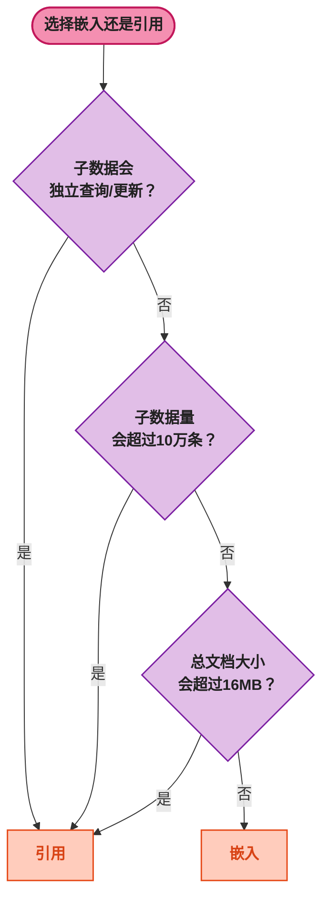

# 生产落地的三件套：索引、事务与调优

> 📖 <strong>前置阅读</strong>：本文是 MongoDB 系列的<strong>生产调优篇</strong>，假设读者已经掌握了 MongoDB 文档模型、SpringBoot 操作和聚合管道。如果还没有，建议先阅读前三篇：
> - [<strong>MongoDB 核心概念：文档模型、BSON 与查询操作符全解析</strong>]() —— 介绍篇
> - [<strong>SpringBoot MongoDB 全操作指南</strong>]() —— 实战篇
> - [<strong>MongoDB 聚合管道深入</strong>]() —— 进阶篇

## 一、⚡ 问题切入：查询怎么越来越慢了？

用户表单数据从 10 万增长到 500 万，"按手机号查询表单记录"从 5ms 变成了 800ms。你用 `explain()` 一看——`stage: "COLLSCAN"`，全表扫描。

这场景和 MySQL 一样——<strong>数据量大了没建索引，写什么数据库都快不了</strong>。但 MongoDB 的索引有一些 MySQL 没有的类型，还有 Schema 设计的决策（嵌入还是引用？要不要用事务？）直接影响性能。

本篇要解决的问题：<strong>怎么设计索引、怎么看懂 explain、怎么选嵌入还是引用、什么时候用事务——以及遇到性能问题时从哪下手排查</strong>。

## 二、📊 索引类型与策略

### 2.1 单字段索引与复合索引

底子和 MySQL 一样——B-Tree。创建一个索引语法几乎一样：

```javascript
// 单字段索引
db.users.createIndex({ email: 1 })        // 1 = 升序，-1 = 降序（单字段索引中不重要）

// 复合索引（多个字段组合）
db.orders.createIndex({ userId: 1, createTime: -1 })

// 查看所有索引
db.orders.getIndexes()
```

<strong>复合索引的 ESR 规则</strong>——这是 MongoDB 复合索引最重要的设计原则：

```
Equality（等值）→ Sort（排序）→ Range（范围）
```

索引字段按这个顺序排列：<strong>先放等值查询的字段，再放排序字段，最后放范围查询字段</strong>。

```javascript
// 典型查询：某个用户的已支付订单，按创建时间倒序，取第一页
db.orders.find({
  userId: 1001,                      // ← 等值查询
  status: "paid",                    // ← 等值查询
  total: { $gte: 100 }              // ← 范围查询
}).sort({ createTime: -1 })          // ← 排序


// ESR 规则 → 索引设计：
// 第 1 位：userId（等值）
// 第 2 位：status（等值）
// 第 3 位：total（范围）
// 第 4 位：createTime（排序）
db.orders.createIndex({
  userId: 1,
  status: 1,
  total: 1,
  createTime: -1
})
```

如果把 `createTime` 放在 `total` 前面，排序就无法利用索引——因为 `total` 的范围查询破坏了 `createTime` 的有序性。

<strong>排序方向</strong>：如果查询 `sort({ createTime: -1 })`，索引中 `createTime` 的方向应该是 `-1`。升序查和降序扫对复合索引来说是可以利用的——MongoDB 会反向扫描索引。

### 2.2 多值索引（Multikey Index）—— 数组字段的索引

MongoDB 最独特的索引类型之一。<strong>给数组字段建索引时，MongoDB 自动为数组中的每个元素创建一个索引条目</strong>。

```javascript
// 文档：
// { name: "张三", tags: ["数据存储"] }

db.users.createIndex({ tags: 1 })

// 查询 tags 包含 "Java" 时走索引
db.users.find({ tags: "Java" }).explain("executionStats")
// "winningPlan": { "stage": "IXSCAN" }
```

MongoDB 把这个文档的 `tags` 索引拆成三条独立的条目：`"Java" → doc1`、`"MongoDB" → doc1`、`"Spring" → doc1`。查询 `tags: "Java"` 时只查一个索引条目。

<strong>限制</strong>：一个 Collection 最多只能有 1 个多值索引作为复合索引的一部分。也就是说你不能 `{ tags: 1, categories: 1 }`，如果 tags 和 categories 都是数组——MongoDB 不知道如何做笛卡尔积。

### 2.3 文本索引（Text Index）—— 全文搜索

MongoDB 内置了轻量级的全文搜索能力。虽然没有 ES 强大，但对于<strong>不需要分词、不需要相关性评分的简单搜索</strong>来说够用：

```javascript
// 创建文本索引（一个 Collection 只能有一个）
db.articles.createIndex({ title: "text", content: "text" })

// 全文搜索
db.articles.find({ $text: { $search: "MongoDB 聚合管道" } })
// 返回包含 "MongoDB" 或 "聚合" 或 "管道" 的文档，按相关度排序

// 搜索短语（精确匹配）
db.articles.find({ $text: { $search: "\"聚合管道\"" } })

// 按文本相关度排序 + 过滤
db.articles.find(
  { $text: { $search: "MongoDB" } },
  { score: { $meta: "textScore" } }      // 取出相关度分数
).sort({ score: { $meta: "textScore" } })  // 按相关度排序
```

MongoDB 的文本索引是<strong>按空格分词</strong>的，对中文不友好（不会按词拆分）。如果需要中文分词 + 复杂搜索，还是用 ES。如果只是英文博客搜索、商品描述关键字匹配，MongoDB 文本索引就是一个轻量选择——不需要再部署一套 ES。

### 2.4 TTL 索引 —— 自动过期删除

MySQL 需要定时任务 `DELETE FROM sessions WHERE expire_time < NOW()`。MongoDB 可以直接建一个 TTL 索引，<strong>过期自动删</strong>：

```javascript
// 60 秒后自动删除
db.sessions.createIndex({ createdAt: 1 }, { expireAfterSeconds: 60 })

// 指定过期时间字段
db.sessions.createIndex({ expireAt: 1 }, { expireAfterSeconds: 0 })
// expireAt = ISODate("2024-01-15T11:00:00Z") → 到了这个时间就自动删
```

TTL 索引非常适合的场景：Session、验证码、临时 token、限流计数器。

> ⚠️ 新手提示：TTL 索引的删除不是实时的——MongoDB 每 60 秒运行一次后台任务来清理过期文档。删得没有 `expireAfterSeconds` 设置的时间那么精确，有几秒到几十秒的延迟。

### 2.5 地理空间索引 —— LBS 场景

MongoDB 原生支持地理空间查询——适合"附近的 xx"这种 LBS 场景：

```javascript
// 2dsphere 索引（地球球面坐标）
db.stores.createIndex({ location: "2dsphere" })

// 插入门店
db.stores.insertOne({
  name: "中关村店",
  location: { type: "Point", coordinates: [116.310, 39.983] }  // [经度, 纬度]
})

// 查附近 2 公里内的门店
db.stores.find({
  location: {
    $near: {
      $geometry: { type: "Point", coordinates: [116.320, 39.980] },
      $maxDistance: 2000              // 单位：米
    }
  }
})
```

### 2.6 通配符索引（Wildcard Index）—— 异构字段的索引

还记得第一篇里那个用户自定义表单的场景吗？每个 Form 的字段都不一样。常规索引没法建——因为不知道有哪些字段。

```javascript
// dynamic_forms Collection:
// { formId: "A", fields: { "姓名": "张三", "手机号": "138...", "是否过敏": true } }
// { formId: "B", fields: { "昵称": "小明", "兴趣爱好": ["篮球"], "作品链接": "..." } }

// 通配符索引：对 fields 下的所有子字段建索引
db.dynamic_forms.createIndex({ "fields.$**": 1 })

// 查询任意子字段都能走索引
db.dynamic_forms.find({ "fields.手机号": "13800000000" })  // 走索引
db.dynamic_forms.find({ "fields.昵称": "小明" })           // 走索引
```

这就是 MongoDB 对"异构数据"场景的索引方案。MySQL 的 JSON 列想做到这一点需要为每个可能的键建虚拟列索引——完全不现实。

### 2.7 覆盖索引（Covered Query）

和 MySQL 一样——如果查询需要的所有字段都在索引里，MongoDB 就不需要回表（Fetch），直接返回索引中的数据：

```javascript
// 索引包含了查询和返回的字段
db.users.createIndex({ email: 1, name: 1, age: 1 })

db.users.find(
  { email: "zhangsan@example.com" },
  { name: 1, age: 1, _id: 0 }
).explain("executionStats")
// "totalDocsExamined": 0   ← 没有读取任何文档，全从索引返回
```

`totalDocsExamined: 0` 是覆盖索引的标志。

## 三、🔍 explain() —— 读懂查询计划

`explain()` 是 MongoDB 性能问题的诊断入口。就像读化验单一样，需要知道每个指标代表什么。

### 3.1 三种 detail 级别

```javascript
// queryPlanner：只看查询计划（默认）
db.orders.find({ userId: 1001 }).explain()

// executionStats：看实际执行统计（最常用）
db.orders.find({ userId: 1001 }).explain("executionStats")

// allPlansExecution：看所有候选计划的对比（调优用）
db.orders.find({ userId: 1001 }).explain("allPlansExecution")
```

### 3.2 winningPlan 解读

`explain("executionStats")` 返回的 JSON 中，`winningPlan` 是 MongoDB 优化器选中的执行计划：

```javascript
// ❌ 全表扫描——没建索引
{
  "winningPlan": {
    "stage": "COLLSCAN",                    // Collection Scan = 全表扫描
    "direction": "forward"
  },
  "executionStats": {
    "totalDocsExamined": 5000000,           // 扫描了 500 万条文档
    "nReturned": 1,                         // 只返回了 1 条
    "executionTimeMillis": 820              // 800ms——当然慢
  }
}

// ✅ 索引扫描——建了索引
{
  "winningPlan": {
    "stage": "FETCH",                       // 先 IXSCAN 再 FETCH 文档
    "inputStage": {
      "stage": "IXSCAN",                    // Index Scan = 索引扫描
      "indexName": "userId_1",
      "direction": "forward"
    }
  },
  "executionStats": {
    "totalDocsExamined": 1,                 // 只查了 1 条文档
    "totalKeysExamined": 1,                 // 只查了 1 个索引条目
    "nReturned": 1,
    "executionTimeMillis": 1                // 1ms
  }
}

// ⭐ 覆盖索引——不需要 FETCH
{
  "winningPlan": {
    "stage": "PROJECTION_COVERED",          // 覆盖索引：全从索引返回
    "inputStage": {
      "stage": "IXSCAN"
    }
  },
  "executionStats": {
    "totalDocsExamined": 0,                 // 没有查任何文档！
    "totalKeysExamined": 1
  }
}
```

<strong>explain() 关键指标速查</strong>：

| 指标 | 含义 | 健康值 |
|------|------|:---:|
| `stage: "COLLSCAN"` | 全表扫描 | <strong>不要出现</strong> |
| `stage: "IXSCAN"` | 索引扫描 | ✅ |
| `totalDocsExamined` | 扫描了多少文档 | 越接近 `nReturned` 越好 |
| `totalKeysExamined` | 扫描了多少索引条目 | 同上 |
| `executionTimeMillis` | 执行耗时 | 根据 SLA 定 |
| `rejectedPlans` | 被淘汰的候选计划 | 有值说明优化器评估了多个方案 |

### 3.3 索引诊断命令

```javascript
// 查看当前正在执行的操作
db.currentOp({ active: true, secs_running: { $gt: 1 } })
// 输出正在运行的慢查询（超过 1 秒的）

// 杀掉慢查询
db.killOp(opId)

// 查看 Collection 的索引使用统计
db.orders.aggregate([{ $indexStats: {} }])
// 输出每个索引被访问了多少次——哪个索引从来没用过一目了然
```

## 四、🏗️ Schema 设计：嵌入 vs 引用

MongoDB 没有 JOIN（`$lookup` 是后补的），Schema 设计从第一天就影响性能。<strong>嵌入还是引用</strong>，这是 MongoDB 设计的核心决策。

### 4.1 嵌入（Embedding）—— 一查全拿

```javascript
// 把订单 + 订单明细存一起
{
  _id: ObjectId("..."),
  userId: 1001,
  total: 6999,
  items: [
    { product: "手机", qty: 1, price: 6999 }
  ],
  address: {            // 收货地址也嵌入
    province: "北京", city: "海淀", detail: "中关村大街 1 号"
  }
}
```

<strong>优点</strong>：一次查询拿到所有数据。没有 JOIN 开销。原子更新单文档（不需要事务）。
<strong>缺点</strong>：文档可能膨胀（Bson 限制 16MB）。嵌入的数据可能重复（同一个地址在多个订单中出现）。

<strong>适合嵌入</strong>：
- "包含"关系——订单和订单明细、用户和收货地址
- 数据一起读、一起写，从不单独查询子实体
- 子数据量小（几十条以内）

### 4.2 引用（Referencing）—— 分两条查

```javascript
// orders Collection
{ _id: 1, userId: 1001, total: 6999, itemIds: [101, 102] }

// items Collection
{ _id: 101, orderId: 1, product: "手机", qty: 1 }
{ _id: 102, orderId: 1, product: "耳机", qty: 1 }
```

<strong>优点</strong>：数据不重复。可以单独查询、单独更新子实体。
<strong>缺点</strong>：需要两次（或更多）查询，或用 `$lookup`。

<strong>适合引用</strong>：
- "关联"关系——用户和他的订单、商品和它的评论
- 子数据独立更新（商品信息变了不需要改订单）
- 子数据量大（一个订单有上百条明细，可能超过 16MB）

### 4.3 一个实用的决策框架



不需要钻牛角尖。一个最直接的判断：<strong>这个数据是不是"父母-孩子"的关系？孩子离开父母没有独立意义？</strong>订单明细离开了订单没有意义 → 嵌入。商品的评论离开了商品也有独立价值 → 引用。

而且 MongoDB 不要求绝对——一个项目里订单明细嵌入、评论引用，完全可以混用。

## 五、🔒 事务 —— 什么时候用、什么时候不用

### 5.1 MongoDB 事务的工作方式

MongoDB 4.0 开始支持<strong>多文档事务</strong>（Replica Set 环境），4.2 扩展到分片集群。语法和关系型数据库类似：

```java
// SpringBoot 中使用 MongoDB 事务
@Service
public class OrderService {

    @Autowired
    private MongoTemplate mongoTemplate;

    @Transactional  // 开启 MongoDB 事务
    public Order createOrder(Order order) {
        // 1. 扣减库存
        Query query = new Query(Criteria.where("productId").is(order.getProductId()));
        Update update = new Update().inc("stock", -order.getQuantity());
        mongoTemplate.updateFirst(query, update, Inventory.class);

        // 2. 创建订单
        Order saved = mongoTemplate.insert(order);

        // 如果 1 或 2 任何一步失败，全部回滚
        return saved;
    }
}
```

配置事务管理器：

```java
@Configuration
public class MongoConfig {

    @Bean
    public MongoTransactionManager transactionManager(MongoDatabaseFactory factory) {
        return new MongoTransactionManager(factory);
    }
}
```

### 5.2 事务的性能代价

MongoDB 事务和 MySQL 事务不一样——<strong>MongoDB 的事务有显著的性能开销</strong>：

- 事务中的写入操作延迟比非事务写入高 <strong>2-3 倍</strong>
- 事务持有锁，并发写入场景下吞吐量下降明显
- 事务超时默认 60 秒，超时后自动回滚

### 5.3 优先用单文档原子操作

MongoDB 的设计哲学是<strong>用单个文档的原子操作替代事务</strong>。单文档更新（`updateOne` / `findAndModify`）天然是原子的——不需要事务：

```java
// ❌ 不推荐：用事务跨文档扣库存
@Transactional
public void deductStock(String productId, int qty) {
    Inventory inv = mongoTemplate.findById(productId, Inventory.class);
    if (inv.getStock() >= qty) {
        inv.setStock(inv.getStock() - qty);
        mongoTemplate.save(inv);
    }
}

// ✅ 推荐：单文档原子操作，不需要事务
public boolean deductStock(String productId, int qty) {
    Query query = new Query(Criteria.where("_id").is(productId)
        .and("stock").gte(qty));                  // 只有库存够才操作
    Update update = new Update().inc("stock", -qty);
    UpdateResult result = mongoTemplate.updateFirst(query, update, Inventory.class);
    return result.getModifiedCount() > 0;          // >0 = 扣减成功
}
```

<strong>什么时候必须用事务？</strong>

只有当<strong>两个操作分别属于不同 Collection 且必须同时成功或同时失败</strong>时才有必要用事务。比如：
- 转账：A 账户减钱 + B 账户加钱（跨文档、同 Collection）
- 下单：扣库存 + 创建订单（跨 Collection）

但这类场景还有个更轻量的备选方案——<strong>用一个 Document 包住所有数据</strong>，利用单文档的原子性避免跨文档事务。把库存信息嵌入到订单文档里，整个下单流程变成一次 `insertOne`。

## 六、📋 MongoDB 生产性能自查清单

1. <strong>检查索引</strong>：`db.collection.getIndexes()` 确认查询条件字段都有索引

2. <strong>检查 COLLSCAN</strong>：`explain("executionStats")` 看 `winningPlan.stage`——出现 `COLLSCAN` 就说明有查询没走索引

3. <strong>检查 ESR 规则</strong>：复合索引字段顺序是否等值 → 排序 → 范围

4. <strong>检查没用过的索引</strong>：`$indexStats` 看哪些索引从来没被访问——多余的索引浪费写入性能

5. <strong>检查文档大小</strong>：`Object.bsonsize(doc)` 看单个文档是否接近 16MB 上限——接近的话考虑拆分

6. <strong>检查深分页</strong>：代码里是否有 `skip` 值特别大的分页——改成 `_id > lastId` 游标分页

7. <strong>检查 `$lookup`</strong>：关联字段有没有索引——没有索引的话 `$lookup` 是全表扫描

8. <strong>检查事务</strong>：有没有可以用单文档原子操作替代的事务——能不用就不用

9. <strong>检查慢查询日志</strong>： MongoDB 的慢查询阈值和日志路径是否配置了

10. <strong>检查 mongostat / mongotop</strong>：看当前实例的 QPS、锁等待、内存使用是否健康

```bash
# 慢查询日志配置
# mongod.conf 或 mongosh 中：
db.setProfilingLevel(1, { slowms: 100 })  # 超过 100ms 的查询记录到 system.profile Collection

# 查看最近的慢查询
db.system.profile.find().sort({ ts: -1 }).limit(10)

# mongostat（终端命令，每 1 秒刷新）
mongostat --uri "mongodb://localhost:27017"
# 输出：insert qps / query qps / update qps / vsize / res / 锁 / 网络等
```

## 七、🎯 总结

本文从"查询怎么越来越慢"的生产困境出发，覆盖了 MongoDB 性能调优的 5 个核心方向：

1. <strong>索引类型</strong>：单字段/复合（ESR 规则）、多值索引（数组字段自动拆项）、文本索引（轻量全文搜索）、TTL 索引（自动过期删除）、地理空间索引（LBS）、通配符索引（异构字段）。底层都是 B-Tree。

2. <strong>explain() 分析</strong>：`stage: "COLLSCAN"` 是红灯（全表扫描），`stage: "IXSCAN"` 是绿灯。`totalDocsExamined` 越接近 `nReturned` 越好，`totalDocsExamined: 0` 表示覆盖索引。

3. <strong>Schema 设计</strong>：嵌入（一次查询拿完）vs 引用（分两次查或用 `$lookup`）。判断依据：子数据是否独立存在、数据量是否过大、文档是否超 16MB。订单明细嵌入、评论引用，可以混用。

4. <strong>事务</strong>：MongoDB 4.0+ 支持多文档事务，但有性能开销。优先用单文档原子操作（`updateOne` / `findAndModify`）替代事务。只有跨 Collection 且必须强一致性时才用事务。

5. <strong>性能自查清单</strong>：10 条可操作的排查项——从索引检查到慢查询日志到分页方式。

<strong>MongoDB 四篇系列到这里全部结束了</strong>。从第一篇讲"为什么要用文档模型"，到第四篇能设计索引、读懂 explain、在嵌入和引用之间做正确决策——这就是一个人从零开始学会 MongoDB 并在生产环境中用好的完整路径。
