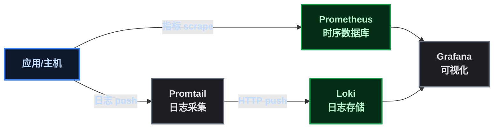

# PLG 能跑 ≠ 能生产，这 40 个参数决定它会不会炸

## 第 1 步：目标——别把"能跑"当成"能上线"

某开发者第一次搭 Prometheus + Loki + Grafana 的时候，docker-compose 一把梭，数据能出图、日志能搜到，觉得"这不就完了吗"。

直到有一天：磁盘写满、Loki 摄入速率爆了、Prometheus 查询超时、Grafana 裸奔在公网被扫——才意识到**玩具和生产是两回事**。

这篇把 PLG 生产化的参数和注意事项一次性讲透，分四块：

| 组件 | 生产化核心问题 |
|------|--------------|
| Prometheus | 数据存多久？查询会不会拖垮？挂了怎么办？ |
| Loki | 日志会不会把磁盘写爆？摄入限额？标签会不会爆炸？ |
| Promtail | 标签设计红线 + 采集可靠性 |
| Grafana | 认证、数据库、配置管理、备份 |

> 📌 定位：写给后端开发兼职运维的人——不追求架构极客，只求**上线后别半夜被磁盘告警叫醒**。

## 第 2 步：前置——先理解 PLG 各自的生产"命门"

四件套的生产风险完全不一样，先建立直觉：



| 组件 | 生产命门 | 典型事故 |
|------|---------|---------|
| **Prometheus** | 内存（TSDB 缓存）、磁盘（时序数据）、查询并发 | OOM、磁盘写满、查询拖垮 |
| **Loki** | 磁盘（日志量）、摄入速率、流数量（标签基数） | 磁盘爆、摄入拒绝、流爆炸 |
| **Promtail** | 标签设计、位置文件、网络缓冲 | 流爆炸、重启重采日志 |
| **Grafana** | 认证、数据库、配置漂移 | 裸奔被入侵、配置丢失 |

## 第 3 步：Prometheus 生产参数——存储、查询、高可用

### 3.1 数据保留期（默认 15 天，必须显式设置）

```bash
# docker-compose 启动参数
prometheus:
  command:
    - '--storage.tsdb.retention.time=30d'      # 按时间保留（推荐）
    - '--storage.tsdb.retention.size=50GB'     # 按大小保留（和上面二选一或都用）
```

**为什么**：默认 15 天，生产一般要 30 ~ 90 天。但**保留期越长磁盘越大**——50GB 磁盘 + 30 天保留，要提前算好每台机器的指标量（一般每 target 每小时几百 KB，几十个 target 一天约 1 ~ 2GB）。

> ⚠️ **坑**： `retention.time` 和 `retention.size` 同时设时，**先到者生效**。只设 size 不设 time 的话，时间无限但磁盘满了就删——可能把近期数据删了。生产建议两个都设。

### 3.2 采集与评估节奏（别用默认值裸奔）

```bash
--scrape_interval=15s          # 全局采集间隔，生产一般 15s~1m，别用 5s（资源浪费）
--scrape_timeout=10s           # 单次采集超时，必须 < scrape_interval！
--evaluation_interval=1m       # 告警规则评估周期，默认 1m 就行
--query.timeout=30s            # 查询超时，防慢查询拖死
--query.max-concurrency=20     # 最大并发查询，防 Grafana 刷爆
--query.max-samples=50000000   # 单查询最大样本数
```

> ⚠️ **坑**： `scrape_timeout` 必须**小于** `scrape_interval` ，否则采集会重叠堆积。10s 超时配 15s 间隔是安全组合。

### 3.3 数据持久化与备份

```yaml
# docker-compose：TSDB 数据必须挂持久卷！
volumes:
  - ./data/prometheus:/prometheus
```

生产备份用**快照 API**（在线备份，不丢数据）：

```bash
# 触发快照（会生成到 /prometheus/snapshots/）
curl -X POST http://localhost:9090/api/v1/admin/tsdb/snapshot
# 然后把快照目录拷走即可
```

> ⚠️ **坑**：容器重建时如果没挂卷，**数据全丢**。这个坑和 nginx 配置一样，属于"容器化必修课"。

### 3.4 高可用（生产最重要的参数）

**单实例 Prometheus 挂了 = 监控全盲**。生产至少双实例：

```yaml
# 两个 Prometheus 实例采集同一批 target
# 通过 --web.external-url 和标签区分
prometheus-1:
  command: ['--storage.tsdb.retention.time=30d', '--web.external-url=http://prometheus-1:9090']
prometheus-2:
  command: ['--storage.tsdb.retention.time=30d', '--web.external-url=http://prometheus-2:9090']
```

Grafana 里配**两个数据源**（同 URL 前缀），查询时轮询；Alertmanager 做**集群**去重，避免重复告警：

```yaml
alertmanager:
  command:
    - '--cluster.listen-address=0.0.0.0:9094'   # 集群通信端口
    - '--cluster.peer=alertmanager-2:9094'      # 对端地址
```

> 📌 长期存储：数据超过保留期要留存审计？上 **Thanos 或 VictoriaMetrics**（对象存储归档）。小团队可以先不上，但要**知道有这条路**。

### 3.5 安全（别裸奔）

```yaml
# 用 web.config 加 basic auth（配合反代更佳）
--web.config.file=/etc/prometheus/web.yml
```

```yaml
# web.yml
basic_auth_users:
  admin: $2y$10$...   # bcrypt 哈希
tls_server_config:     # 或交给 nginx 反代做 TLS
  cert_file: /etc/prometheus/certs/server.crt
  key_file: /etc/prometheus/certs/server.key
```

> ⚠️ **坑**：Prometheus 默认**无认证**，9090 端口一旦暴露公网，任何人都能查到你的全部指标（包括容器名、IP、业务路径）。生产必须加认证 + 不暴露公网。

## 第 4 步：Loki 生产参数——限额、压缩、保留

### 4.1 摄入限额（防日志洪峰打爆 Loki）

Loki 默认限额很宽松，生产必须收紧：

```yaml
limits_config:
  # 单实例摄入速率（默认 4MB/s，日志洪峰时调大但要评估磁盘）
  ingestion_rate_mb: 8
  ingestion_burst_size_mb: 16

  # 单租户最大流数（0 = 无限！必须设）
  max_streams_per_user: 5000
  max_global_streams_per_user: 10000

  # 单查询限制（防大查询拖死）
  max_entries_limit_per_query: 5000
  max_query_length: 720h    # 查询时间范围上限（30天）
```

> ⚠️ **坑**： `max_streams_per_user` 默认是 0（无限）。**标签基数爆炸时，流数量会指数级增长**，直接把 Loki 拖垮。这个参数是保命符。

### 4.2 保留期与压缩（Loki 不会自动删日志！）

```yaml
compactor:
  working_directory: /loki/compactor
  compactor_ring:
    kvstore:
      store: inmemory
  retention_enabled: true      # 必须显式开启！
  retention_period: 720h       # 保留 30 天

limits_config:
  retention_period: 720h       # 与 compactor 保持一致
```

> ⚠️ **坑**：Loki **默认不删任何日志**！不开 compactor retention，磁盘会被日志写满直到爆炸。而且 retention 是按**标签**粒度删的，配置要仔细。

### 4.3 存储后端（单机 vs 生产）

```yaml
# 单机开发（本地文件系统）
storage_config:
  filesystem:
    directory: /loki/chunks

# 生产推荐（对象存储，如 MinIO/S3/OSS）
storage_config:
  aws:
    s3: s3://access-key:secret@minio:9000/loki
    s3forcepathstyle: true
```

| 后端 | 适用 | 说明 |
|------|------|------|
| 本地文件系统 | 开发/小规模 | 单点、磁盘有限 |
| MinIO/S3 | 生产 | 对象存储，容量可扩展 |
| 云厂商 OSS | 生产 | 阿里云/腾讯云对象存储 |

> 📌 Loki 3.x 起默认用 TSDB 索引（替代 boltdb-shipper），单机模式下配置更简单，生产也够用。

### 4.4 数据持久化

```yaml
volumes:
  - ./data/loki:/loki   # WAL + chunks + compactor 全在这
```

Loki 的 WAL（预写日志）也在数据目录，**必须持久化**，否则崩溃丢数据。

## 第 5 步：Promtail 生产参数——标签红线 + 采集可靠性

### 5.1 标签设计（最重要的一条红线！）

**高基数标签 = 流爆炸 = Loki 崩溃**。这是 PLG 生产最大的坑：

```yaml
scrape_configs:
  - job_name: app-logs
    static_configs:
      - targets: [localhost]
        labels:
          job: myapp
          __path__: /var/log/app/*.log
    # ❌ 错误示范：把高基数字段当标签
    # pipeline_stages:
    #   - regex:
    #       expression: '.*user_id=(?P<user_id>\d+).*'
    #   - labels:
    #       user_id: ''      # ← 每个用户一条流，几万用户 = 几万流！
```

| 标签 | 基数 | 能否当标签 |
|------|------|:---:|
| job / level / service | 低（个位数） | ✅ |
| host / instance | 低（机器数） | ✅ |
| user_id / request_id / ip | 高（无限增长） | ❌ 绝对禁止 |

> ⚠️ **坑**：把 user_id 当标签，日志量不变但**流数量爆炸**——Loki 每条流都有开销，几万流直接拖垮。正确做法：高基数字段放**日志内容里**（用 json 解析），查询时用 LogQL 过滤，不当标签。

### 5.2 客户端缓冲（网络抖动不丢日志）

```yaml
clients:
  - url: http://loki:3100/loki/api/v1/push
    batchsize: 1048576        # 单批 1MB
    batchwait: 5s             # 5 秒凑不够也发
    backoff_config:
      min_period: 100ms
      max_period: 30s         # 失败重试退避
```

### 5.3 位置文件（防重启重采）

```yaml
# positions.yaml 记录已读日志位置，必须持久化！
volumes:
  - ./data/promtail:/etc/promtail/positions   # 挂出来
```

> ⚠️ **坑**：不持久化 positions 文件，Promtail 每次重启**重新读一遍全量日志**，Loki 收到重复数据，磁盘白白翻倍。

### 5.4 日志轮转配合

Promtail 依赖日志文件轮转（logrotate）。生产要保证应用日志有轮转策略，否则单个日志文件无限增长，Promtail 读起来也吃力：

```bash
# /etc/logrotate.d/app
/var/log/app/*.log {
  daily
  rotate 7
  compress
  missingok
  copytruncate    # 关键：不移动文件，Promtail 位置文件不失效
}
```

## 第 6 步：Grafana 生产参数——认证、数据库、配置管理

### 6.1 认证（第一优先级）

```yaml
environment:
  - GF_SECURITY_ADMIN_PASSWORD=强密码        # 别用默认 admin/admin！
  - GF_USERS_ALLOW_SIGN_UP=false             # 关闭开放注册
  - GF_AUTH_ANONYMOUS_ENABLED=false          # 关闭匿名访问
```

> ⚠️ **坑**：Grafana 默认 admin/admin + 开放注册，暴露公网 = 被人注册个账号进去看你的监控数据（甚至配告警）。生产必须关。

### 6.2 数据库（SQLite → MySQL/PostgreSQL）

```yaml
environment:
  - GF_DATABASE_TYPE=mysql
  - GF_DATABASE_HOST=mysql:3306
  - GF_DATABASE_NAME=grafana
  - GF_DATABASE_USER=grafana
  - GF_DATABASE_PASSWORD=xxx
```

> 📌 小规模 SQLite 也能跑，但**并发写入会锁库**，多人同时用 Grafana 时卡顿。生产建议 MySQL/PostgreSQL。

### 6.3 配置代码化（provisioning）

```yaml
# 数据源和 dashboard 用文件管理，随代码走
volumes:
  - ./grafana/provisioning:/etc/grafana/provisioning
  - ./grafana/dashboards:/var/lib/grafana/dashboards
```

```yaml
# provisioning/datasources/prometheus.yml
apiVersion: 1
datasources:
  - name: Prometheus
    type: prometheus
    url: http://prometheus:9090
    isDefault: true
```

> 📌 好处：数据源、面板**进 git**，换机器/灾备时一键恢复，不用手点。

### 6.4 备份

- **配置**：provisioning 目录 + grafana.db（或数据库）一起备份
- **面板**：provisioning 里管理，git 就是备份

## 第 7 步：部署验证 + 通用注意事项

### 7.1 上线前自检清单

```bash
# 1. 各组件健康
curl -s http://prometheus:9090/-/healthy
curl -s http://loki:3100/ready
curl -s http://grafana:3000/api/health

# 2. Prometheus 内存评估（关键！）
# 内存 ≈ 活跃时序数 × 2KB + 缓存，用这个接口看：
curl -s http://prometheus:9090/api/v1/status/runtimeinfo | jq .data

# 3. Loki 磁盘评估
du -sh /loki/chunks

# 4. 日志流数量（防标签爆炸）
# Grafana Explore 里执行: count by (job) (count_over_time({job=~".+"}[1m]))

# 5. 全链路：应用日志 → Promtail → Loki → Grafana 能搜到
```

### 7.2 后端兼职运维最容易忽略的 12 个坑

| # | 坑 | 后果 | 对策 |
|---|-----|------|------|
| 1 | Prometheus 数据不挂卷 | 容器重建全丢 | 挂持久卷 |
| 2 | retention 不设 | 磁盘写满 | 显式设 time+size |
| 3 | scrape_timeout > interval | 采集重叠 | timeout < interval |
| 4 | Loki 不开 retention | 磁盘无限增长 | compactor + retention |
| 5 | 高基数标签 | 流爆炸崩溃 | 低基数标签 + 内容里放高基数 |
| 6 | Promtail positions 不持久化 | 重启重采 | 挂载 positions 文件 |
| 7 | Grafana 默认密码 + 开放注册 | 被入侵 | 强密码 + 关注册 + 关匿名 |
| 8 | 组件裸奔公网 | 数据泄露 | 内网 + 认证 + 反代 |
| 9 | 版本用 latest | 不可控升级 | 锁版本号 |
| 10 | 内存估算不足 | Prometheus OOM | 按时序数评估，给足内存 |
| 11 | 日志无轮转 | 单文件无限增长 | logrotate + copytruncate |
| 12 | 不监控监控栈自身 | 监控挂了不知道 | blackbox 探活 PLG |

### 7.3 监控栈自身（最后一块拼图）

```yaml
# 用 blackbox_exporter 探活 PLG 组件，告警链最外层
scrape_configs:
  - job_name: blackbox
    metrics_path: /probe
    params:
      module: [http_2xx]
    static_configs:
      - targets:
          - http://prometheus:9090/-/healthy
          - http://loki:3100/ready
          - http://grafana:3000/api/health
    relabel_configs:
      - source_labels: [__address__]
        target_label: __param_target
      - source_labels: [__param_target]
        target_label: instance
```

> 📌 核心思路：**监控栈自己是最后一环，它挂了没人报**。blackbox 探活 + 独立的告警通道（比如直接发企业微信），保证"监控挂了"这件事也能被知道。

## 原理简述——为什么这些参数是命门

### 一环：Prometheus 内存与时序数的关系

Prometheus 每个活跃时序在内存里占用约 1 ~ 2KB（chunk 缓存）。假设 10000 条时序，仅缓存就要 10 ~ 20MB；加上查询缓存、规则评估，**内存和时序数强相关**。所以评估内存 = 先估时序数，而不是拍脑袋给个 1GB。

### 二环：Loki 为什么"流数量"比"日志量"更要命

Loki 的索引按"流"组织。一条流 = 一组相同标签的日志。日志量 1GB 但如果只有 10 条流，Loki 很轻松；日志量 100MB 但有 10 万条流（user_id 标签），索引膨胀、摄入变慢、查询变慢。**流的开销远大于日志内容本身**——这是 Loki 和其他日志系统最大的不同。

### 三环：Grafana provisioning 为什么是生产标配

Grafana 的所有配置（数据源、面板、告警）本质是 JSON。手工在 UI 里点 = 不可复现、不可审计、丢了就没了。provisioning 把配置变成**代码**，进 git、可回滚、可灾备——这是"配置即代码"在可观测性领域的落地。

## 总结与下一步

PLG 生产化，核心就三句话：

```
Prometheus: 数据要留、查询要限、挂了要有备
Loki:       日志要限流、要压缩、标签要低基数
Grafana:    要认证、要代码化、配置要能恢复
```

某开发者把这些坑踩过一遍后的体会：**生产化不是加功能，是加"护栏"**——每个参数都是防止某一种崩溃方式的护栏。配置时多花 10 分钟，省的是半夜爬起来清磁盘的时间。

下一步想做的：把这套生产配置整理成一个 docker-compose 生产模板（含备份脚本、探活、告警），放到 GitHub 上开源，让后来者少踩坑。如果这篇对你有帮助，欢迎评论区交流你的 PLG 生产经验。
