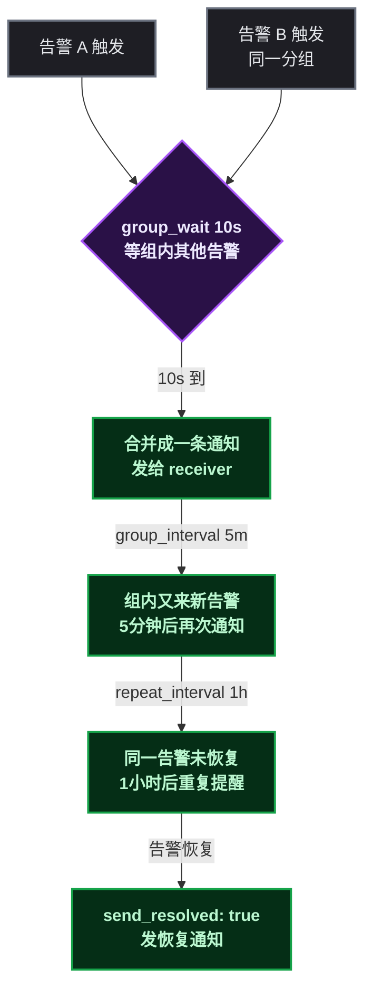
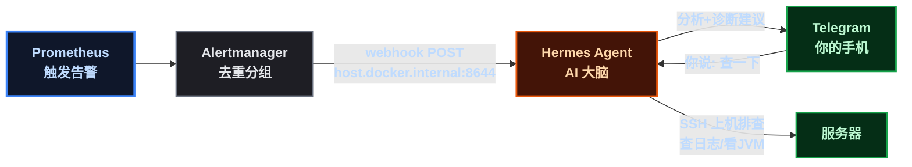
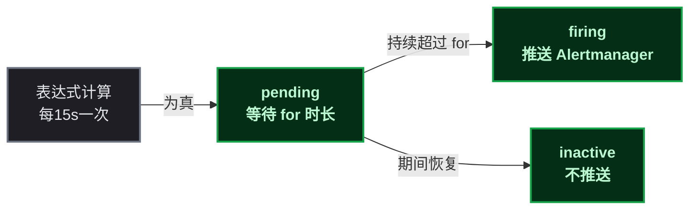

# 告警别只发通知，让 AI 替你干活

## 第 1 步：目标——从"看面板"到"手机响"

上一篇把 Prometheus + Grafana 搭起来，指标也采进来了。但有个问题：**指标不会自己说话**。

某开发者当时的状态是：白天盯着 Grafana 面板看 CPU 曲线，晚上睡觉心里发毛——万一凌晨 3 点服务挂了，谁叫我？

这篇文章的目标很直白：

```
❌ 旧世界：出问题 → 用户投诉 → 你爬起来开电脑 → SSH → 查日志 → 修复
✅ 新世界：出问题 → 手机响 → 聊天框里说"查一下" → AI 排查完给你结论
```

具体拆成三个里程碑：

| 里程碑 | 内容 | 产出 |
|--------|------|------|
| ① 告警规则 | Prometheus 检测 CPU/内存/磁盘异常 | 8 条可用的告警规则 |
| ② Alertmanager | 告警去重分组、统一出口 | 一个能收敛告警的中枢 |
| ③ ChatOps | 告警 → webhook → AI → Telegram | 手机上收告警 + 动嘴指挥 |

> 📌 前置知识：假设你已经跑通了上一篇的 Prometheus + Grafana + node-exporter，知道 `up` 、 `rate()` 这些基本 PromQL。

## 第 2 步：前置条件——你需要什么

| 组件 | 版本 | 用途 |
|------|------|------|
| Docker + docker-compose | 任意新版本 | 跑监控栈 |
| Prometheus | v2.47.2 | 指标存储 + 告警规则引擎 |
| Alertmanager | v0.27.0 | 告警收敛 + 通知出口 |
| node-exporter | latest | 主机指标（CPU/内存/磁盘） |
| Hermes Agent | 最新 | AI 大脑 + IM 网关 |
| Telegram Bot | 任意 | 告警落地的聊天框 |

验证环境（能通过再往下走）：

```bash
docker ps                    # 容器在跑
curl -s localhost:9090/-/healthy   # Prometheus 健康
curl -s localhost:9093/-/healthy   # Alertmanager 健康
curl -s localhost:9100/metrics | head -3  # node-exporter 有指标
```

## 第 3 步：环境搭建——docker-compose 加一个 Alertmanager

Prometheus 和 node-exporter 上一篇已经有了，这里只补 Alertmanager 服务：

```yaml
# docker-compose.yml 追加
alertmanager:
  image: prom/alertmanager:v0.27.0
  container_name: alertmanager
  restart: "no"
  user: "root"
  ports:
    - "9093:9093"
  volumes:
    - ./data/alertmanager/alertmanager.yml:/etc/alertmanager/alertmanager.yml
    - ./data/alertmanager/data:/alertmanager
  command:
    - "--config.file=/etc/alertmanager/alertmanager.yml"
```

```bash
docker compose up -d --force-recreate alertmanager
```

> ⚠️ 新手提示：如果启动报 `unsupported scheme "" for URL` ，多半是 `alertmanager.yml` 里写了 `slack_api_url: ""` 这种空值，删掉即可。

## 第 4 步：写告警规则——8 条规则管住一台机器

Prometheus 的告警规则长这样：**表达式 + 持续时间 + 标签 + 注解**。表达式为真并持续超过 `for` 的时间，就触发。

```yaml
# /etc/prometheus/rules/node-alerts.yml
groups:
  - name: node-exporter-alerts
    rules:
      - alert: HighCPUUsage
        expr: |
          100 - (avg by(instance) (rate(node_cpu_seconds_total{mode="idle"}[5m])) * 100) > 80
        for: 3m
        labels: { severity: warning }
        annotations:
          summary: "{{ $labels.instance }} CPU 使用率过高"
          description: "CPU 使用率 {{ $value | humanize }}% 持续超过 80% 已达 3 分钟"
```

几个容易踩的点：

**① CPU 使用率要用 `rate()` 算增量。** `node_cpu_seconds_total` 是累计值（从开机到现在 idle 了多少秒），直接除没有意义，必须 `rate()` 取 5 分钟内的变化率：

```promql
# 错误：总量直接算，数值永远是"开机以来平均值"
100 - (avg(node_cpu_seconds_total{mode="idle"}) * 100)

# 正确：rate() 取增量
100 - (avg by(instance) (rate(node_cpu_seconds_total{mode="idle"}[5m])) * 100)
```

**② `for` 字段是防抖。** 加 `for: 3m` 表示"持续 3 分钟才告警"，避免偶发尖峰刷屏。生产环境建议 5 分钟起步。

**③ 内存用 `MemAvailable` 不用 `MemFree` 。** `MemFree` 只是"完全空闲"的内存，Linux 的页缓存（page cache）也算可用内存，用 `MemAvailable` 才是真实可用：

```promql
(1 - (node_memory_MemAvailable_bytes / node_memory_MemTotal_bytes)) * 100 > 85
```

完整 8 条规则一览：

| 告警 | 表达式阈值 | for | 级别 |
|------|-----------|-----|------|
| HighCPUUsage | CPU > 80% | 3m | warning |
| CriticalCPUUsage | CPU > 95% | 2m | critical |
| HighMemoryUsage | 内存 > 85% | 3m | warning |
| CriticalMemoryUsage | 内存 > 95% | 2m | critical |
| HighDiskUsage | 磁盘 > 80% | 5m | warning |
| CriticalDiskUsage | 磁盘 > 90% | 5m | critical |
| InstanceDown | `up == 0` | 1m | critical |
| HighLoadAverage | `node_load1 > 4` | 5m | warning |

**挂载 + 加载规则文件：** Prometheus 主配置里引用规则文件，并指向 Alertmanager：

```yaml
# prometheus.yml
global:
  scrape_interval: 5s
  evaluation_interval: 15s   # 规则评估周期

rule_files:
  - '/etc/prometheus/rules/*.yml'

alerting:
  alertmanagers:
    - static_configs:
        - targets: ['alertmanager:9093']
```

```bash
docker compose up -d --force-recreate prometheus   # 重新挂载规则
```

验证规则加载：浏览器开 `http://localhost:9090/rules` ，能看到 8 条规则和当前状态（inactive/pending/firing）。

> ⚠️ 新手提示：Prometheus 只在告警**状态变化**时推送 Alertmanager。改完规则后想立刻看到效果，重启一下 Prometheus 让它重新评估并推送所有活跃告警。

## 第 5 步：Alertmanager 配置——告警收敛的中枢

Alertmanager 的职责是：**去重、分组、抑制**。比如 10 台机器同时 CPU 飙高，它不会发 10 条通知，而是合并成一条"10 台机器 CPU 告警"。

```yaml
# alertmanager.yml
route:
  group_by: ['alertname', 'job']   # 按告警名+任务分组
  group_wait: 10s                  # 组内第一条等 10s，等后续告警一起发
  group_interval: 5m               # 组内新告警 5 分钟后再通知
  repeat_interval: 1h              # 同一条告警 1 小时才重复提醒
  receiver: 'default'

receivers:
  - name: 'default'
    webhook_configs:
      - url: 'http://host.docker.internal:8644/webhooks/prometheus-alerts'
        send_resolved: true
```

三个时间参数是新手最容易困惑的，用一张图说明：



验证链路：Prometheus 触发告警 → Alertmanager 收到（ `http://localhost:9093` 网页能看到 active 告警）→ webhook 转发。

## 第 6 步：告警进 IM——传统三姿势 vs AI ChatOps

这是整篇最核心的部分。告警从 Alertmanager 出来，怎么到你的手机？

### 姿势一：Alertmanager 原生 Receiver（无 AI）

Alertmanager **内置**一堆通知渠道，配置即用，根本不需要 AI：

| 渠道 | 配置项 | 国内可用 |
|------|--------|:---:|
| 企业微信 | `wechat_configs` | ✅ |
| 钉钉 | `dingtalk_configs` | ✅ |
| 飞书 | `feishu_configs` | ✅ |
| 邮件 | `email_configs` | ✅ |
| Telegram | `telegram_configs` | ⚠️ 需代理 |
| Webhook | `webhook_configs` | ✅ 万能 |

```yaml
receivers:
  - name: 'wechat'
    wechat_configs:
      - corp_id: 'ww123456789'
        agent_id: '1000002'
        api_secret: 'xxx'
        to_party: '运维部'
```

这是**纯单向通知**——告诉你"出事了"，然后你自己开电脑查。Alertmanager 在这里是终点。

### 姿势二：webhook → Hermes → Telegram（AI 增强）

把 webhook 指向 Hermes Agent，告警就**不是终点而是起点**——AI 收到后能继续干活：



**传统 Alertmanager = 只会喊"着火啦"的报警器；AI ChatOps = 收到火警自己跑去灭火、还跟你汇报的消防员。** 两者不冲突，生产环境建议双路并行（传统保底 + AI 增强）。

### 姿势三：deliver-only 直达（零 AI 成本）

Hermes webhook 有个 `deliver-only` 模式——**不经过 AI 分析，直接把渲染后的消息推送到 IM**。毫秒级响应、零 token 消耗，适合纯通知场景：

```bash
hermes webhook subscribe prometheus-alerts \
  --prompt "🚨 告警: {payload.alerts.0.labels.alertname}
级别: {payload.alerts.0.labels.severity}
实例: {payload.alerts.0.labels.instance}
详情: {payload.alerts.0.annotations.description}" \
  --deliver telegram --deliver-chat-id "2031690359" \
  --deliver-only
```

想让 AI 分析就用姿势二，想纯通知就用姿势三，可以同时订阅两个。

## 第 7 步：部署验证——从触发到手机响的完整链路

### 7.1 验证 webhook 订阅

```bash
hermes webhook list
# 能看到 prometheus-alerts 订阅即 OK
```

### 7.2 手动投递一条告警测试

```bash
curl -X POST http://localhost:9093/api/v2/alerts \
  -H 'Content-Type: application/json' \
  -d '[{"labels":{"alertname":"TestAlert","severity":"warning","instance":"node-exporter:9100"},
        "annotations":{"description":"端到端测试告警"},
        "startsAt":"2026-08-20T05:25:00.000Z",
        "endsAt":"2026-08-20T05:35:00.000Z"}]'
```

### 7.3 验证标准

| 检查项 | 命令/位置 | 通过标准 |
|--------|----------|---------|
| Prometheus 规则加载 | `:9090/rules` | 8 条规则可见 |
| 告警到 Alertmanager | `:9093` 网页 | active 告警 |
| Hermes 收到 webhook | gateway 日志 | `POST route=prometheus-alerts` |
| Telegram 收到消息 | 手机 | 机器人发来告警 |

### 7.4 踩坑实录（每一条都是血泪）

**坑 1：`\\wsl.localhost` 改文件后 Docker 挂载失同步**

症状：改了 WSL 里的配置文件，容器内 `cat` 还是旧内容；重启容器报 `mount ... no such file or directory` 。

原因：通过 Windows 的 `\\wsl.localhost` 路径编辑 WSL 文件，会让 Docker Desktop 的 bind-mount 缓存失同步。

解法：**改完文件用 `docker compose up -d --force-recreate` 重建容器**，不要 `restart` 。

**坑 2：Grafana 12 禁用 `/api/login`**

症状：API 调用一直 401。

原因：Grafana 12 默认关闭了 login API（安全策略）。但 **Basic Auth 仍然有效**。

解法：用 `Authorization: Basic base64(admin:密码)` 头访问 API，别用 `/api/login` 。

**坑 3：Telegram chat_id 不是 user_id**

症状：webhook 配置 `deliver-chat-id` 后报 `Chat not found` 。

原因： `TELEGRAM_ALLOWED_USERS` 里的 ID 是 user_id，但投递消息需要 **chat_id**（和 bot 的会话 ID），两者可能不同。

解法：从 `~/.hermes/sessions/sessions.json` 里查真实的 chat_id。

**坑 4：INSECURE_NO_AUTH 只能在 loopback 用**

症状：webhook 订阅被跳过，日志提示 `INSECURE_NO_AUTH is only allowed on loopback hosts` 。

原因：Hermes 的安全机制——无认证 webhook 只允许本机回环访问，而 webhook 平台默认监听 `0.0.0.0` 。

解法：把 webhook 平台的 host 改成 `127.0.0.1` ：

```bash
hermes config set platforms.webhook.extra.host "127.0.0.1"
```

> ⚠️ 新手提示： `INSECURE_NO_AUTH` 只适合内网练习。生产环境暴露公网时**必须用 HMAC 签名**（ `hermes webhook subscribe` 默认生成，让发送方在请求头带 `X-Webhook-Signature` ）。

**坑 5：容器访问 Windows 服务用 host.docker.internal**

症状：Alertmanager 在 Docker 里，webhook 指向 `localhost:8644` 不通。

原因：容器里的 `localhost` 是容器自己，不是宿主机。

解法：用 `host.docker.internal` 指向宿主机。WSL2 镜像网络模式下，容器访问 `host.docker.internal` 能到达 Windows 的 loopback 服务。

## 原理简述——告警链路每一环在干什么

### 一环：Prometheus 规则评估

Prometheus 每隔 `evaluation_interval` （默认 15s）重新计算一次规则表达式。表达式结果为真 → 告警进入 `pending` ；持续超过 `for` 时长 → 变 `firing` 。**告警状态只在变化时通知 Alertmanager**，所以长期 firing 的告警不会反复推送。



### 二环：Alertmanager 通知管线

Alertmanager 收到告警后走 路由（route）→ 分组（group）→ 抑制（inhibit）→ 静默（silence）→ 通知（notify）五步。 `group_by` 决定哪些告警合并成一条通知， `repeat_interval` 防止同一告警刷屏。webhook receiver 把渲染后的告警 POST 给目标 URL——这个 URL 可以是企业微信机器人，也可以是 Hermes。

### 三环：Hermes 的两种模式

- **agent 模式**：webhook 收到 → 把 payload 渲染进 prompt → 大模型分析 → 响应投递到 Telegram。告警附带了 AI 诊断。
- **deliver-only 模式**：跳过 agent，渲染后的 prompt 直接作为消息推送。零延迟零成本，适合纯通知。

## 总结与下一步

一套完整的告警体系，本质是三件事：

```
能检测（Prometheus 规则）
→ 能收敛（Alertmanager 分组去重）
→ 能触达（webhook → IM / AI ChatOps）
```

这套架构对云服务器同样适用，迁移时注意三点：webhook 地址从 `host.docker.internal` 换成 Hermes 所在机器的内网 IP； `INSECURE_NO_AUTH` 换成 HMAC 签名；国内 ECS 上 Telegram 需要配代理或改用企业微信/飞书。

下一步可以做的：

- 把 Spring Boot 应用接入（ `micrometer-registry-prometheus` ），让 JVM/接口指标也进告警
- 给 Hermes 配 SSH 工具集，告警后让它自动上机排查
- 加 `node_exporter` 之外的目标：MySQL、Redis、Nginx 各自有 exporter

到这一步，你的手机就是监控大屏，而 Hermes 是那个 7×24 待命的运维员工。剩下的，就是往这套体系里塞更多监控目标了。
