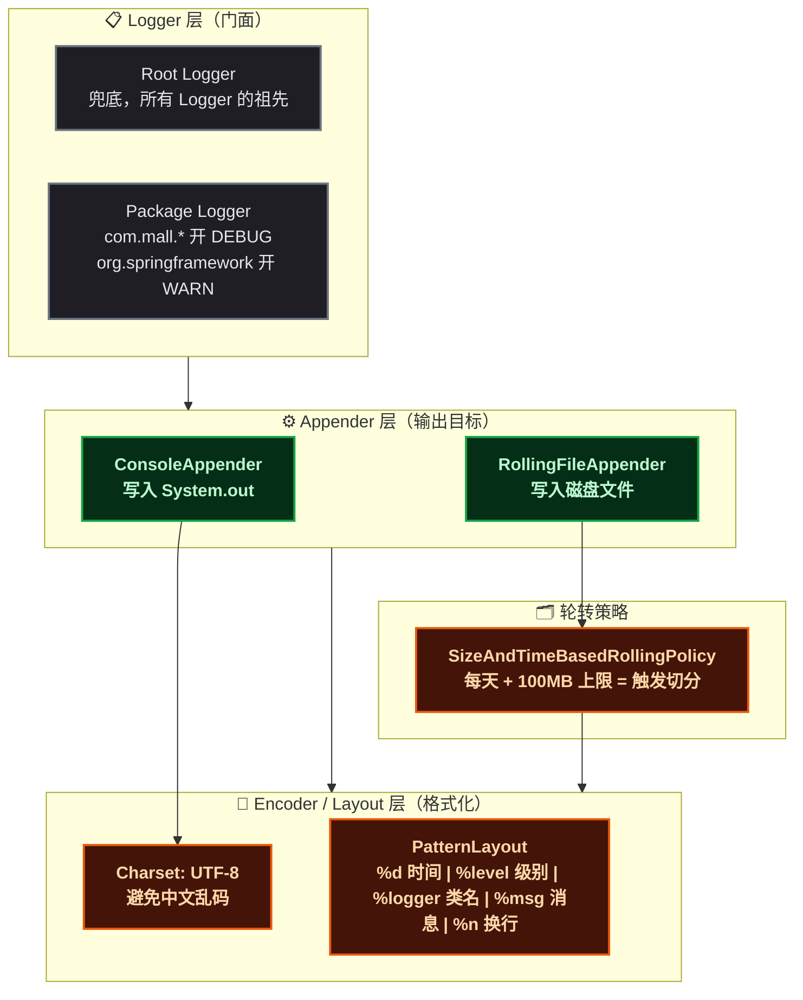
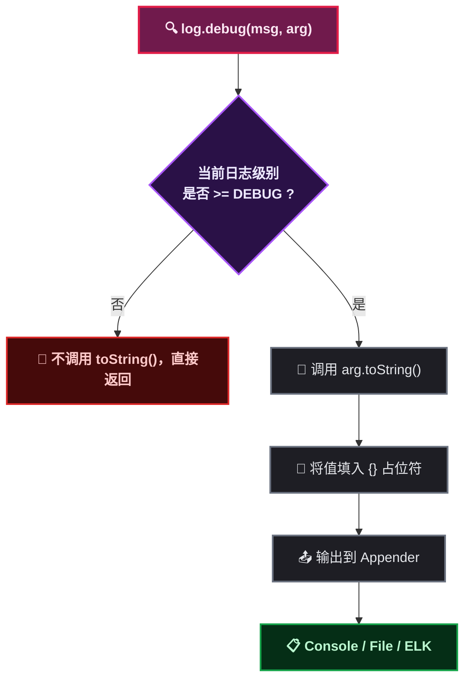
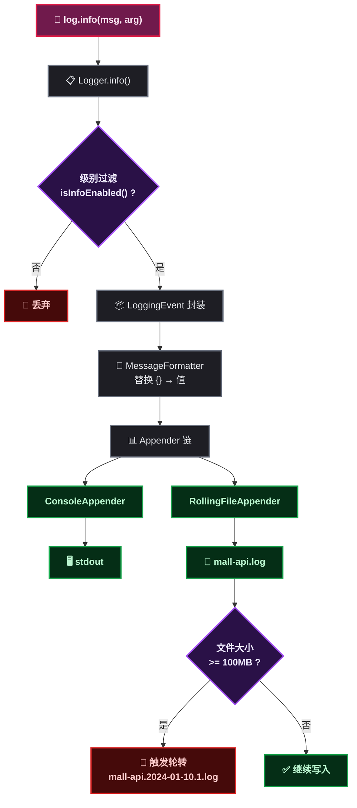
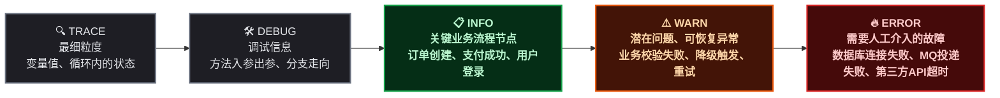
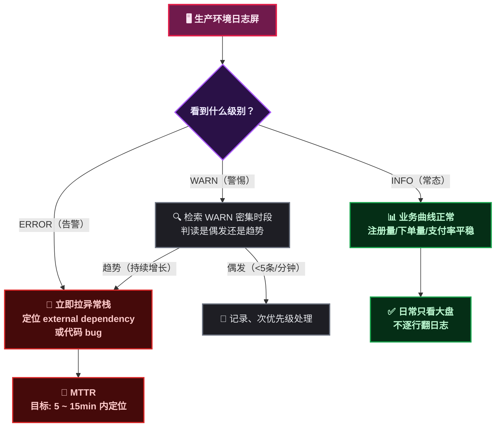
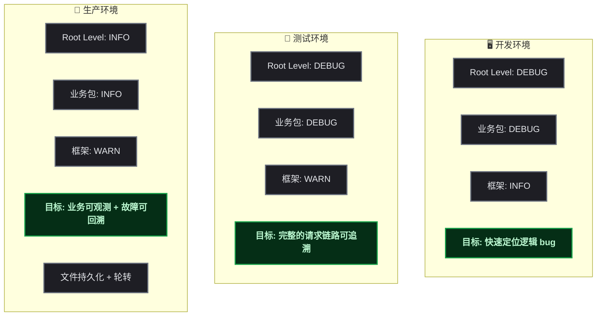

# 结构化日志改造实录

## 第1步：目标说明 — 结构化日志到底解决什么问题

某开发者接手了一个 Spring Boot 商城项目的维护。项目跑得挺稳，直到某天凌晨收到告警——短信发送失败了，但翻遍日志找不到任何记录，因为 `catch(Exception e)` 的块是空的。

这就是非结构化日志的典型场景：**日志看似写了，但关键信息全丢了**。

结构化日志（Structured Logging）不是一门新技术，而是一种**日志编写规范**。它的核心目标只有一句话：

> 让日志既可以被**人**快速理解，也可以被**机器**（ELK、Loki、Splunk）精确检索。

本次教程通过一个真实商城项目的日志审计和改造过程，教会读者：

- 如何识别团队代码中的日志反模式
- 如何用 SLF4J 的参数化语法替代字符串拼接
- 如何配置 logback 实现 **dev 控制台** + **prod 文件持久化** 的双环境策略
- 如何避免异常栈丢失、日志级别混乱等常见坑

完成本教程后，读者能独立完成一个 Spring Boot 项目的日志规范化改造。

---

## 第2步：前置条件 — 需要准备什么

开始之前，确保本地环境满足以下条件。

| 前置项 | 版本要求 | 说明 |
|--------|----------|------|
| JDK | 1.8+ | Spring Boot 2.x 编译和运行 |
| Spring Boot | 2.x | 自带 `spring-boot-starter-logging`（Logback + SLF4J） |
| Lombok | 1.18+ | 提供 `@Slf4j` 注解，免去手写 Logger 声明 |
| Maven | 3.6+ | 项目构建工具 |

验证命令：

```bash
# 检查 JDK
java -version

# 检查 Maven
mvn -version

# 检查 Lombok 依赖（在 IDE 中确认 @Slf4j 可用）
```

> 📌 **前置知识**：读者需要了解 Java 异常体系的基本概念（checked / unchecked exception）、Spring Boot 项目的基本结构（Controller → Service → Mapper），以及日志级别 TRACE / DEBUG / INFO / WARN / ERROR 的含义。

---

## 第3步：环境搭建 — 从零创建 logback-spring.xml

Spring Boot 默认提供了 ConsoleAppender，但输出格式固定、无文件持久化、无日志轮转。生产环境需要自定义配置。

在 `src/main/resources/` 下创建 `logback-spring.xml`：

```xml
<?xml version="1.0" encoding="UTF-8"?>
<configuration>
    <!-- dev 环境：仅控制台，简洁格式 -->
    <springProfile name="dev">
        <property name="CONSOLE_PATTERN"
                  value="%d{HH:mm:ss.SSS} %-5level [%thread] %logger{36} - %msg%n"/>
        <appender name="CONSOLE" class="ch.qos.logback.core.ConsoleAppender">
            <encoder>
                <pattern>${CONSOLE_PATTERN}</pattern>
                <charset>UTF-8</charset>
            </encoder>
        </appender>
        <root level="INFO">
            <appender-ref ref="CONSOLE"/>
        </root>
    </springProfile>

    <!-- prod 环境：控制台 + 文件双通道 -->
    <springProfile name="prod">
        <property name="CONSOLE_PATTERN"
                  value="%d{yyyy-MM-dd HH:mm:ss.SSS} %-5level [%thread] %logger{36} - %msg%n"/>
        <property name="FILE_PATTERN"
                  value="%d{yyyy-MM-dd HH:mm:ss.SSS} %-5level [%thread] %logger{36} - %msg%n"/>
        <property name="LOG_PATH" value="${LOG_PATH:-logs}"/>

        <appender name="CONSOLE" class="ch.qos.logback.core.ConsoleAppender">
            <encoder>
                <pattern>${CONSOLE_PATTERN}</pattern>
                <charset>UTF-8</charset>
            </encoder>
        </appender>

        <appender name="FILE" class="ch.qos.logback.core.rolling.RollingFileAppender">
            <file>${LOG_PATH}/mall-api.log</file>
            <encoder>
                <pattern>${FILE_PATTERN}</pattern>
                <charset>UTF-8</charset>
            </encoder>
            <rollingPolicy class="ch.qos.logback.core.rolling.SizeAndTimeBasedRollingPolicy">
                <fileNamePattern>${LOG_PATH}/mall-api.%d{yyyy-MM-dd}.%i.log</fileNamePattern>
                <maxFileSize>100MB</maxFileSize>
                <maxHistory>30</maxHistory>
                <totalSizeCap>10GB</totalSizeCap>
            </rollingPolicy>
        </appender>

        <root level="INFO">
            <appender-ref ref="CONSOLE"/>
            <appender-ref ref="FILE"/>
        </root>

        <!-- 框架日志降噪 -->
        <logger name="org.springframework" level="WARN"/>
        <logger name="com.alibaba" level="WARN"/>
        <logger name="org.apache" level="WARN"/>
    </springProfile>
</configuration>
```

**关键设计点**：

| 配置项 | dev 环境 | prod 环境 |
|--------|----------|-----------|
| appender | 仅 Console | Console + File |
| 时间格式 | `HH:mm:ss.SSS`（简洁） | `yyyy-MM-dd HH:mm:ss.SSS`（完整） |
| 文件轮转 | 无 | 按天 + 单文件 100MB 切分 |
| 文件保留 | 无 | 30 天，总上限 10GB |
| 框架日志 | 全部 INFO | Spring / Alibaba / Apache → WARN |

> ⚠️ **新手提示**：`${LOG_PATH:-logs}` 表示环境变量 `LOG_PATH` 如果未设置，则默认使用 `logs` 目录。容器部署时通常设置 `LOG_PATH=/var/log/app`。

---

## 第4步：理解 logback-spring.xml — 它是怎么来的，每段怎么写

上一章直接把完整 XML 贴了出来。这里反过来，把它拆开逐段解释——搞清楚每个节点是干什么的，以后自己写配的时候心里有数。

### 4.1 Spring Boot 如何发现并加载 logback-spring.xml

很多新人以为只要把 XML 扔到 `resources/` 下就会自动生效——确实会，但背后的加载过程值得搞清楚。

```
Spring Boot 启动
  → LoggingApplicationListener 监听到 ApplicationEnvironmentPreparedEvent
    → 检查 classpath 下是否有 logback-spring.xml（优先）或 logback.xml
      → 有：交给 Logback 的 JoranConfigurator 解析 XML，构建 LoggerContext
      → 无：使用 DefaultLogbackConfiguration（纯 Console，INFO 级别）
```

> 📌 **前置知识**：`logback-spring.xml` 和 `logback.xml` 的区别只有一点——前者支持 `<springProfile>` 标签，后者不支持。Spring Boot 官方强烈推荐用 `-spring` 后缀，因为 `<springProfile>` 可以根据 `spring.profiles.active` 动态切换配置。如果不加 `-spring`，`<springProfile>` 标签会被 Logback 直接报错。

加载时机很关键：**Logback 在 Spring ApplicationContext 初始化之前就完成了加载**。这意味着两点：

1. `logback-spring.xml` 里不能用 `${server.port}` 之类的 Spring 占位符——Spring 还没启动
2. 但可以用 `${LOG_PATH:-logs}` 这种**系统属性占位符**——Logback 从 JVM 系统属性中取值

### 4.2 Logback 的三大核心组件

整个 logback-spring.xml 只做一件事：**把 Logger 收到的日志事件，路由到 Appender，按 Encoder 的格式输出**。



**Logger**：负责**收**。每个 `log.info()` 调用背后都有一个 Logger 实例（通过 `@Slf4j` 注入）。Logger 之间有父子继承关系——`com.mall.service.pay.PayService` 的 Logger 如果自己没有配 level，就向上找 `com.mall.service.pay` → `com.mall.service` → `com.mall` → Root。最后一级 Root Logger **必须配**，否则 Logback 自己会补一个默认的。

**Appender**：负责**发**。一个 Logger 可以绑定多个 Appender（比如同时输出到控制台和文件）。Appender 之间完全独立——Console 挂了不影响 File 写入。additivity（可加性）控制子 Logger 的日志是否向上传播到父 Logger 的 Appender，默认 true，通常不需要改。

**Encoder / Layout**：负责**格式化**。把 `LoggingEvent` 对象（包含时间戳、级别、线程名、消息、异常）串成一行字符串。Pattern 占位符如下：

| 占位符 | 含义 | 示例输出 |
|--------|------|----------|
| `%d{yyyy-MM-dd HH:mm:ss.SSS}` | 日期时间 | `2024-06-07 10:30:15.456` |
| `%-5level` | 日志级别（左对齐 5 字符） | `INFO ` / `ERROR` |
| `%thread` | 线程名 | `http-nio-8011-exec-3` |
| `%logger{36}` | Logger 名称（压缩到 36 字符） | `c.m.s.p.PayService` |
| `%msg` | 日志消息体 | `订单创建成功, orderCode:...` |
| `%n` | 换行符 | |
| `%X{traceId}` | MDC 中 key 为 `traceId` 的值（链路追踪） | `a1b2c3d4` |
| `%ex` | 异常堆栈（`log.error(msg, e)` 的第二个参数） | 完整 stack trace |

### 4.3 RollingFileAppender 的轮转策略

生产环境用 `RollingFileAppender` 而不是普通 `FileAppender`，因为它能**自动切分文件**。没有轮转的日志文件会无限膨胀——一个周末回来发现磁盘写满了，写过的都懂。

`SizeAndTimeBasedRollingPolicy` 是生产环境的标准选择，它同时按两个条件触发切分：

| 触发条件 | 配置 | 效果 |
|----------|------|------|
| 按时间 | `%d{yyyy-MM-dd}` | 每天零点自动切分（不管文件大小） |
| 按大小 | `<maxFileSize>100MB</maxFileSize>` | 单文件超过 100MB 时切分 |
| 保留天数 | `<maxHistory>30</maxHistory>` | 超过 30 天的自动删除 |
| 总量上限 | `<totalSizeCap>10GB</totalSizeCap>` | 所有日志文件总和不超过 10GB |

切分后的文件名格式：`mall-api.2024-06-07.0.log` → `mall-api.2024-06-07.1.log` → `mall-api.2024-06-08.0.log`。`.0`、`.1` 的序号是因为同一天内可能触发了多次大小切分。

> ⚠️ **新手提示**：`maxHistory` 和 `totalSizeCap` 是**同时生效**的，不是"或"关系。比如 `maxHistory=30, totalSizeCap=10GB`——即使不到 30 天，只要总量超过 10GB，也会触发删除。这个设计防止了某天突发 200GB 日志把磁盘撑爆。

### 4.4 `<logger>` 的继承和覆盖规则

```xml
<!-- Root：兜底级别，所有 Logger 最终都会查到这里 -->
<root level="INFO">
    <appender-ref ref="CONSOLE"/>
    <appender-ref ref="FILE"/>
</root>

<!-- 包级别覆盖：com.mall 开 DEBUG，比 Root 的 INFO 更宽松 -->
<logger name="com.mall" level="DEBUG"/>

<!-- 框架降噪：org.springframework 开 WARN，比 Root 的 INFO 更严格 -->
<logger name="org.springframework" level="WARN"/>
```

规则很简单：**子 Logger 如果没有显式配置 level，就继承父 Logger 的 level**。查询顺序是——从当前 Logger 开始，沿着包名逐级向上（`c.m.s.p.PayService` → `c.m.s.p` → `c.m.s` → `c.m` → `c` → Root），**第一个配置了 level 的祖先就是有效 level**。

注意 `<logger>` 只设 level 没加 `<appender-ref>` 时，日志会**继续向上传播**到父 Logger 的 Appender。所以只需要在 Root 绑 Appender，所有 `<logger>` 自动继承输出通道，改 level 就行。

---

## 第5步：分步实践 — 诊断并修复真实项目的日志反模式

以下是某商城项目代码审计中真实发现的 5 类日志问题，以及对应的修复方法。

### 4.1 反模式一：字符串拼接

**问题代码** — 来自 `WebSocketServer.java`：

```java
// ❌ 全部 8 处日志都用 + 拼接
log.info("用户连接:" + userId + ",当前在线人数为:" + getOnlineCount());
log.error("请求的userId:" + userId + "不在该服务器上");
log.error("服务器推送失败:" + e.getMessage());
```

这段代码有 **三个问题**：

1. **性能开销**：即使用 WARN 级别过滤掉 INFO 日志，`userId` + `getOnlineCount()` 的拼接操作已经执行了
2. **`e.getMessage()` 丢失异常栈**：只记录了错误消息字符串，堆栈信息全部丢弃
3. **日志框架无法索引**：结构化日志系统（如 ELK）需要按 `userId` 字段检索，但拼接后的字符串无法被解析

**修复后**：

```java
// ✅ SLF4J 参数化消息
log.info("用户连接:{}, 当前在线人数为:{}", userId, getOnlineCount());
log.error("请求的userId:{} 不在该服务器上", userId);
log.error("服务器推送失败", e);  // 异常作为最后一个参数
```

这里的 `{}` 就是 SLF4J 的**占位符**。日志框架在确认日志级别满足条件后才会调用 `toString()`，并在输出时将占位符替换为实际值。

### 4.2 反模式二：`e.printStackTrace()` 直接写 stderr

**问题代码** — 来自 `WebSocketServer.java` 和 `CommonAreaService.java`：

```java
// ❌ 异常直接打印到 stderr，绕过日志框架
@OnError
public void onError(Session session, Throwable error) {
    log.error("用户错误:" + this.userId + ",原因:" + error.getMessage());
    error.printStackTrace();  // 完全绕过 logback
}
```

`printStackTrace()` 直接输出到 `System.err`，不受 logback 配置管理。在容器环境中，stdout 和 stderr 可能被写入不同的流，导致异常信息与业务日志**错位**，排查时上下文断裂。

**修复后**：

```java
// ✅ 异常作为 log.error 的第二个参数，框架自动打印完整栈
@OnError
public void onError(Session session, Throwable error) {
    log.error("用户错误:{}, 原因:{}", this.userId, error.getMessage(), error);
}
```

SLF4J 的规则：**`log.error(msg, throwable)` 中 throwable 必须是最后一个参数，且前面不应对应 `{}` 占位符**。框架会自动调用 `Throwable.printStackTrace()` 并写入 appender。

### 4.3 反模式三：异步回调中异常栈丢失

**问题代码** — 来自 `MqHelper.java`：

```java
// ❌ throwable 被当作 {} 占位符的值，异常栈全部丢失
rocketMQTemplate.asyncSend(topic, message, new SendCallback() {
    @Override
    public void onException(Throwable throwable) {
        log.error("消息发送失败, topic:{},throwable:{}", topic, throwable);
    }
});
```

这段代码非常隐蔽。`throwable` 被传给 `throwable:{}` 这个占位符，SLF4J 只调用了 `throwable.toString()`——仅仅打印了异常类名和消息，**完整的堆栈信息被丢弃**。

这是异步回调中最常见的日志错误，写过的都懂——排查异步消息投递失败时，看着日志里光秃秃的 `throwable:xxxException: send failed` 而没有任何堆栈，那种无力感。

**修复后**：

```java
// ✅ throwable 作为最后一个参数，不绑定到任何 {}
@Override
public void onException(Throwable throwable) {
    log.error("消息发送失败, topic:{}", topic, throwable);
}
```

对比输出：

```
// ❌ 旧日志
2024-06-07 10:30:15 ERROR 延迟消息发送失败, topic:ORDER_CANCEL,throwable:org.apache.rocketmq.client.exception.MQClientException: send failed

// ✅ 新日志
2024-06-07 10:30:15 ERROR 延迟消息发送失败, topic:ORDER_CANCEL
org.apache.rocketmq.client.exception.MQClientException: send failed
    at org.apache.rocketmq.client.impl.producer.DefaultMQProducerImpl.sendKernelImpl(...)
    at org.apache.rocketmq.client.impl.producer.DefaultMQProducerImpl.sendDefaultImpl(...)
    ... 完整 stack trace
```

### 4.4 反模式四：日志级别混乱

**问题代码** — 来自 `GlobalExceptionHandler.java`：

```java
// ❌ 业务异常和权限异常用 log.info
if (e instanceof BusinessException) {
    log.info("请求出现业务异常：", e);
    return ApiResultUtil.error(...);
} else if (e instanceof AccessDeniedException) {
    log.info("权限异常：", e);
    return ApiResultUtil.error(...);
// 参数校验失败完全不打印日志
} else if (e instanceof MethodArgumentNotValidException) {
    // 没有任何 log 语句
    return ApiResultUtil.error(...);
}
```

两个问题：

1. **级别错误**：业务异常和权限异常用 `INFO` 级别。生产环境通常只开启 WARN 及以上，这些异常会被**全部丢弃**
2. **信息缺失**：只记录了异常类型，没有记录请求 URI。出问题时无从知晓是哪个接口触发的

**修复后**：

```java
// ✅ 级别升到 WARN + 记录请求 URI
if (e instanceof BusinessException) {
    BusinessException be = (BusinessException) e;
    log.warn("业务异常, uri:{}, msg:{}", request.getRequestURI(), be.getMessage());
    return ApiResultUtil.error(be.getCode(), be.getMessage());
} else if (e instanceof AccessDeniedException) {
    log.warn("权限异常, uri:{}", request.getRequestURI(), e);
    return ApiResultUtil.error(...);
} else if (e instanceof MethodArgumentNotValidException) {
    MethodArgumentNotValidException me = (MethodArgumentNotValidException) e;
    BindingResult br = me.getBindingResult();
    if (br.hasErrors()) {
        String msg = br.getFieldError().getDefaultMessage();
        log.warn("参数校验失败, uri:{}, msg:{}", request.getRequestURI(), msg);
        return ApiResultUtil.error(..., msg);
    }
    log.warn("参数校验失败, uri:{}", request.getRequestURI());
    return ApiResultUtil.error(...);
}
```

### 4.5 反模式五：`System.out.println` 残留

**问题代码** — 来自 `CommonAreaService.java` 和 `RandomUtil.java`：

```java
// ❌ 调试代码直接 stdout，日志框架管理不到
System.out.println(districtEntity.getName());

// main 方法里的测试输出
public static void main(String[] args) {
    System.out.println(getFourBitRandom());
    System.out.println(getSixBitRandom());
}
```

这类代码通常是开发调试时的临时输出，忘记删除就带进了生产代码。修复方案：生产代码中直接删除 `System.out` 调用；测试 `main` 方法加 `@Slf4j` 改用 `log.info`。

---

## 第6步：部署验证 — 检查日志输出是否正确

完成代码修改后，按以下步骤验证。

### 5.1 本地启动验证（dev 环境）

```bash
# 启动 API 模块
cd mall-api
mvn spring-boot:run -Dspring-boot.run.profiles=dev
```

**预期输出**（控制台）：

```
12:30:15.456 INFO  [http-nio-8011-exec-1] c.m.a.mobile.WebUserController - 用户登录成功, userId:1001
12:30:16.789 WARN  [http-nio-8011-exec-2] c.m.common.handler.GlobalExceptionHandler - 业务异常, uri:/api/v1/trade/submit, msg:库存不足
12:30:17.012 ERROR [http-nio-8011-exec-3] c.m.service.helper.MqHelper - 消息发送失败, topic:ORDER_CREATE
org.apache.rocketmq.client.exception.MQClientException: send failed
    at org.apache.rocketmq.client.impl.producer.DefaultMQProducerImpl.sendKernelImpl(...)
    ...
```

注意几点：

- 业务异常 **出现在 WARN 级别**，不是 INFO
- 异常日志 **包含完整堆栈**
- 日志中 **出现了 URI 上下文**

### 5.2 检查文件日志（prod 环境）

```bash
# 使用 prod profile 启动
java -jar mall-api.jar --spring.profiles.active=prod

# 检查日志文件
tail -f logs/mall-api.log
```

### 5.3 验证文件轮转

```bash
# 向指定文件写入 110MB 数据，触发大小切分
# 验证轮转后的文件名格式：mall-api.2024-01-10.0.log
```

---

## 第7步：原理简述 — SLF4J 参数化 + 日志流转路径

### 6.1 SLF4J 参数化为什么比字符串拼接快

SLF4J 的参数化消息不是简单的 `String.format()`。它在调用 `toString()` 之前会先检查日志级别。



**关键结论**：

- 当运行在 INFO 级别时，所有 `log.debug(...)` 调用的参数**不会触发 `toString()`**
- 字符串拼接 `"id:" + user.getId()` **无论级别如何都必须执行拼接**
- 项目跑在 prod（INFO 级别）时，DEBUG 日志中的字符串拼接白白消耗 CPU

### 6.2 日志的完整流转路径

从 `log.info()` 到最终输出，日志经过以下路径：



`LoggingEvent` 是整个 logback 的核心数据结构——每次 `log.info()` 调用都会创建一个 `LoggingEvent` 对象，包含：时间戳、日志级别、logger 名称、格式化后的消息、异常对象（如果有）、MDC（Mapped Diagnostic Context）上下文。

> ⚠️ **新手提示**：`LoggingEvent` 是线程绑定的——每个线程持有自己的事件对象。因此在高并发下，不要在日志参数中执行耗时操作（如远程调用），否则每个线程都会被阻塞。

---

## 第8步：日志级别与环境策略 — 生产环境到底看什么

前面的改造解决了"怎么写日志"的问题。但还有一个更基础的问题没聊：**什么情况下该写哪个级别？不同环境看什么？**

### 8.1 五个级别的真正含义

SLF4J 定义了五个级别，从低到高：



> 📌 **前置知识**：级别是**包含关系**。如果 root level 设为 INFO，则 INFO / WARN / ERROR 都会输出，TRACE 和 DEBUG 被丢弃。

下面逐级拆解——每条附真实日志输出，直接感受生产环境 `tail -f` 时会看到什么。

#### TRACE — 最细粒度，追踪算法每一步

**触发条件**：循环体内变量变化、递归每一层的状态、sharding 路由时 hash 取模后的中间值。

**排查什么问题**：数据在复杂算法中经历了什么变形——比如分库分表路由算法中，`code` 字段被 hash 后取模，最终落在了 `ds1.order_trade_0`，只有 TRACE 级别能看到中间每一步的计算过程。

**代码**：

```java
log.trace("第{}次重试, delay={}ms", retryCount, delay);
```

**生产环境实际不会输出**（TRACE 低于 INFO）。`logback-spring.xml` 中如果针对某个包临时开了 TRACE，控制台会看到：

```log
12:30:15.456 TRACE [pool-3-thread-1] c.m.s.sharding.OrderDataBasePreciseShardingAlgorithm - sharding列code=R20240607001, hash=3847, 取模后=1, 路由到ds1
```

#### DEBUG — 调试逻辑，还原决策路径

**触发条件**：方法入口参数（尤其是 Controller 和核心 Service）、`if/else` 分支选择后的结果、SQL 参数绑定值、缓存命中/未命中。

**排查什么问题**：上线前的逻辑验证——"为什么这单走了满减券而不是折扣券？"、"ES 搜索为什么返回了这 3 个商品？"。DEBUG 级别下，从头到尾的决策路径都可追溯。

**代码**：

```java
log.debug("优惠券匹配结果, couponId:{}, 优惠金额:{}, 券类型:{}, 匹配条件:{}", id, amount, type, condition);
```

**开发/测试环境输出**：

```log
12:30:16.123 DEBUG [http-nio-8011-exec-2] c.m.s.coupon.CouponMatchService - 优惠券匹配结果, couponId:10086, 优惠金额:15.00, 券类型:满减, 匹配条件:订单金额>=99
12:30:16.124 DEBUG [http-nio-8011-exec-2] c.m.s.coupon.CouponMatchService - 用户券列表共5张, 命中2张, 最优券:10086(满减15.00)
```

#### INFO — 生产环境的眼睛，业务监控的命脉

**触发条件**：核心业务节点完成（订单创建/支付成功/退款发起）、定时任务开始与结束、配置加载完成、用户登录/注册。

**排查什么问题**：**INFO 是生产环境唯一持续输出的业务级别**。用它画 Grafana 曲线——今天注册量、下单量、支付成功率。也是用户投诉时回溯时间线的唯一依据。

**代码**：

```java
log.info("订单创建成功, orderCode:{}, userId:{}, amount:{}", code, uid, amount);
```

**生产环境输出**：

```log
2024-06-07 10:30:15.456 INFO  [http-nio-8011-exec-1] c.m.s.trade.TradeService - 订单创建成功, orderCode:R20240607001, userId:1001, amount:299.00
2024-06-07 10:30:18.789 INFO  [http-nio-8011-exec-2] c.m.s.pay.PayService - 支付回调处理完成, orderCode:R20240607001, tradeNo:2024060722001, 支付金额:299.00
```

> ⚠️ **新手提示**：INFO 日志不是"觉得重要就打"。一条订单链路如果打了 50 条 INFO，生产环境一分钟几百单，日志量直接炸。原则是：**只记录外部可见的业务节点**——创建、支付、退款、发货。内部查询缓存的细节放 DEBUG。

#### WARN — "不对劲但还能跑"，排查毛刺的入口

**触发条件**：业务校验失败（验证码错误、库存不足、优惠券过期）、操作重试成功、降级触发（Redis 不可用走本地缓存）、接近限流阈值。

**排查什么问题**：系统没有挂，但行为不太正常——"为什么优惠券使用率从 80% 掉到了 60%？"、"为什么最近 Redis 重试变多了？"。WARN 日志是发现**性能劣化**和**业务异常趋势**的最佳信号源。

**代码**：

```java
log.warn("库存扣减首次失败触发重试, orderCode:{}, skuId:{}, 重试次数:{}", code, skuId, retryCount);
```

**生产环境输出**：

```log
2024-06-07 10:31:22.334 WARN  [http-nio-8011-exec-5] c.m.s.inventory.InventoryService - 库存扣减首次失败触发重试, orderCode:R20240607005, skuId:SKU8891, 重试次数:1
2024-06-07 10:31:22.891 WARN  [http-nio-8011-exec-5] c.m.s.inventory.InventoryService - 库存扣减重试成功, orderCode:R20240607005, 重试次数:1
```

看到这种输出，就要警觉了——库存扣减为什么越来越频繁需要重试？是不是 DB 连接池不够了？还是某个 SKU 热点太严重？

#### ERROR — 需要立刻人工介入

**触发条件**：数据库操作失败、MQ 投递失败、第三方 API 超时或返回异常、支付回调验签失败、订单状态机非法转换。**一句话：不是程序 bug 就是外部依赖挂了**。

**排查什么问题**：触发告警后，拿着 ERROR 日志里的异常栈 + 上下文信息（topic、orderCode、API URL）直接定位故障点。

**代码**：

```java
log.error("RocketMQ投递失败, topic:{}, orderCode:{}", topic, code, e);
```

**生产环境输出**——注意异常栈紧随消息行之后：

```log
2024-06-07 03:15:44.001 ERROR [pool-3-thread-2] c.m.s.helper.MqHelper - RocketMQ投递失败, topic:ORDER_CANCEL, orderCode:R20240607001
org.apache.rocketmq.client.exception.MQClientException: send message failed
    at org.apache.rocketmq.client.impl.producer.DefaultMQProducerImpl.sendKernelImpl(DefaultMQProducerImpl.java:850)
    at org.apache.rocketmq.client.impl.producer.DefaultMQProducerImpl.sendDefaultImpl(DefaultMQProducerImpl.java:610)
    ... 68 more
Caused by: java.net.SocketTimeoutException: connect timed out
    at java.net.PlainSocketImpl.socketConnect(Native Method)
    ... 34 more
```

看到这一行，三件事立刻明确：
1. 凌晨 3 点 RocketMQ 投递超时 — 是 MQ 集群挂了还是网络抖动？
2. `orderCode:R20240607001` — 这条订单的取消消息丢了，补偿机制需要介入
3. 根因是 `SocketTimeoutException` — 先检查 MQ 集群健康状态



上图总结了生产环境排障的标准路径：**常态看 INFO 大盘，毛刺查 WARN 趋势，故障追 ERROR 栈**。三个级别三个画面，互不干扰。

> ⚠️ **新手提示**：ERROR 日志不等于"出错了就记 ERROR"。用户输错验证码（业务校验失败）记 WARN 就够了——那是正常业务流程中的可预期分支。ERROR 留给**需要立刻被通知**的场景：短信发送连续失败、支付回调验签失败、订单状态机非法转换。告警规则通常就钉在 ERROR 计数上——告警疲劳意味着真正的故障被淹没。

### 8.2 三个环境，三种策略

同一个项目在 dev / test / prod 三个环境的日志配置应该完全不同:



#### 开发环境（dev）

**目标**：代码改了立刻看到效果，bug 一眼定位。

| 配置项 | 值 | 理由 |
|--------|-----|------|
| root level | `DEBUG` | 本机资源充足，DEBUG 信息全开 |
| 业务包 `com.mall` | `DEBUG` | Service 方法入口参数、SQL 参数绑定全部输出 |
| 框架包 `org.springframework` | `INFO` | 启动时能看到自动装配报告，但不会被 Bean 实例化细节淹没 |
| MyBatis SQL | `DEBUG` | 每条 SQL 语句和参数直接打印，拼错字段名立刻发现 |
| 日志输出 | 仅 Console | 不需要持久化，终端看就够了 |

**dev 环境重点看什么**：

- `DEBUG` 级别的 **方法入参出参** — "传进来的 userId 是 null？哦，token 解析那里出问题了"
- MyBatis 的 **SQL 打印** — "为啥查不出数据？哦，字段名 `create_time` 写成了 `creat_time`"
- 启动日志中的**配置加载** — "Redis 连上了没？端口是不是对的？"

#### 测试环境（test）

**目标**：QA 跑完一轮回归，能拿到完整链路日志来定位"为什么订单状态没流转"。

| 配置项 | 值 | 理由 |
|--------|-----|------|
| root level | `DEBUG` | 保留足够信息量用于问题定位 |
| 业务包 `com.mall` | `DEBUG` | 逻辑分支、中间结果全部记录 |
| 框架包 `org.springframework` | `WARN` | 框架层回退到 WARN，避免无效日志干扰测试报告 |
| 日志输出 | Console + File | 文件持久化，测试跑完可以导出给开发分析 |

**test 环境重点看什么**：

- **全链路 DEBUG 日志** — 从 Controller 接收参数 → Service 处理 → Mapper 执行 SQL → 返回值，每一步都有日志
- **异常前的最后几行日志** — 500 报错时，ERROR 上面的 DEBUG 信息才是最关键的上下文
- **定时任务执行日志** — 测试环境通常加速跑定时任务，观察 cron 触发和任务内逻辑是否正确

#### 生产环境（prod）

**目标**：一句话——**不出问题时只看 INFO 大盘，出问题时 ERROR 能精准定位**。

| 配置项 | 值 | 理由 |
|--------|-----|------|
| root level | `INFO` | 只记录关键业务节点，不打印 DEBUG/TRACE |
| 业务包 `com.mall` | `INFO` | 订单、支付、登录、退款等核心节点记录 |
| 框架包 `org.springframework` | `WARN` | 只关注框架层的异常行为 |
| 框架包 `com.alibaba` | `WARN` | Druid、Dubbo 等阿里中间件的内部日志抑制 |
| 文件日志 | 启用 | 按天轮转、100MB 切分、保留 30 天 |
| SQL 日志 | 关闭 | `shardingsphere.props.sql.show: false` |

**prod 环境重点看什么** — 这才是最关键的部分：

| 场景 | 看的级别 | 看什么 | 怎么查 |
|------|:---:|------|------|
| **日常业务监控** | INFO | 注册量、登录量、下单量、支付成功率 | `grep "订单创建成功" \| wc -l` 或 Grafana 面板直接展示 |
| **用户投诉"我的订单去哪了"** | INFO + WARN | 用 userId 或 orderCode 过滤，看这条订单经过哪些节点 → 创建成功？支付成功？回调收到？ | `grep "orderCode:202406070001" mall-api.log` 还原完整时间线 |
| **凌晨 3 点短信发送大量失败** | ERROR | 阿里云 SMS API 返回了什么？是网络超时还是签名被禁用？ | `grep "短信发送失败" mall-api.log \| tail -100` 找到第一条 ERROR 发生时间 |
| **MQ 消息积压** | WARN + ERROR | RocketMQ 投递失败是不是集中在某个 topic？延迟消息的 delayLevel 配错了？ | `grep "消息发送失败" \| awk '{print $NF}' \| sort \| uniq -c` 按 topic 统计 |
| **接口响应突然变慢** | WARN | 有没有 `库存扣减重试` 的 WARN 大量出现？Redis 连接池是不是耗尽了？ | 搜索 `重试` 关键词，按时间排序，看是否密集出现 |
| **安全事件排查** | INFO + WARN | 某个 IP 反复尝试登录、权限异常集中在某个接口 | `grep "权限异常" \| awk '{print $NF}' \| sort \| uniq -c \| sort -rn` 按 URI 统计 |

### 8.3 prod 环境为什么不能用 DEBUG

经常有新人问："为什么不直接开 DEBUG？信息多不是更好排查吗？"

四个字：**磁盘、性能、噪音、安全**。

| 维度 | 问题 |
|------|------|
| **磁盘** | 一个中等规模的 Spring Boot 应用在 INFO 级别下，每小时产出约 50 ~ 200MB 日志。开到 DEBUG 会膨胀到 2 ~ 5GB。30 天保留需要 6TB — 成本爆炸 |
| **性能** | 每条日志都要经过 `Logger.isDebugEnabled()` 判断 → `MessageFormatter` 格式化 → `OutputStream` 写盘。DEBUG 级别下每秒多出数万次 I/O 操作，CPU 和磁盘 I/O 都会被拖累 |
| **噪音** | 排查线上问题时翻日志，一秒钟滚过去 200 行 DEBUG，真正有用的那行 INFO 早就被淹没了。日志量越大，信噪比越低 |
| **安全** | DEBUG 日志可能包含请求体、SQL 参数、用户手机号/身份证号。生产环境这些敏感数据落在文件里，如果没有脱敏处理，等于一个合规大坑 |

> ⚠️ **新手提示**：如果真的需要在 prod 临时开 DEBUG（比如排查某个诡异 bug 死活复现不了），建议用 **动态日志级别调整**。Actuator 的 `/actuator/loggers` 端点可以针对**单个 class** 临时开到 DEBUG，排查完立刻关掉，不用重启应用。例如：`curl -X POST http://localhost:8011/actuator/loggers/com.mall.service.pay.PayService -H 'Content-Type: application/json' -d '{"configuredLevel":"DEBUG"}'`

---

## 第9步：总结与下一步

### 核心约束清单

完成本教程的改造后，建议将以下规则写入团队的**代码评审 Checklist**：

| # | 规则 | 检查方法 |
|---|------|----------|
| 1 | 禁止字符串拼接 | grep `log\.\w+\(.*\+` |
| 2 | 禁止 `e.printStackTrace()` | grep `printStackTrace` |
| 3 | 禁止 `System.out.println` | grep `System\.out` |
| 4 | 异常必须作为 `log.error` 的**末位参数** | review 异步回调 `onException` |
| 5 | `BusinessException` 用 `WARN`，系统异常用 `ERROR` | review `GlobalExceptionHandler` |
| 6 | 异常日志必须包含 URI / 业务 ID 等**上下文** | 人工 review |
| 7 | prod 日志级别：框架 WARN，业务 INFO | 检查 `logback-spring.xml` |
| 8 | 文件日志必须配置**轮转**和**保留期限** | 检查 `rollingPolicy` |

### 下一步建议

1. **引入 MDC（Mapped Diagnostic Context）**：在过滤器/拦截器中设置 `MDC.put("traceId", UUID.randomUUID().toString())`，让请求链路的每一行日志都带有相同的 `traceId`，排查跨服务问题效率提升 10 倍
2. **日志采集**：架设 ELK 或 Grafana Loki，将文件日志统一采集到中心化平台，支持按 `traceId`、`userId`、时间范围精确检索
3. **配置告警**：在 Prometheus / Grafana 中配置 ERROR 日志的监控告警规则，ERROR 数量超过阈值即触发通知
4. **JSON 格式输出**：当日志采集平台就绪后，将 logback 的 appender 切换为 `net.logstash.logback.encoder.LogstashEncoder`，每行日志为一条 JSON，便于日志平台直接索引

> 📌 **前置知识**：MDC 本质上是 `ThreadLocal<Map<String, String>>`，每次请求在进入时设置、离开时清除。Spring Boot 中通常通过 `HandlerInterceptor` 或 Filter 实现。

### 本次改造的真实数据

本次教程参考的真实商城项目，在日志审计中发现：

- **67 个** `@Slf4j` 类，**176 处**日志调用点
- **8 处**字符串拼接（全部在同一个 `WebSocketServer.java`）
- **2 处** `e.printStackTrace()` 直接写 stderr
- **2 处**异步回调异常栈丢失
- **2 处** `log.info` 记录异常导致生产无法回溯
- **3 处** `System.out.println` 调试代码残留
- **0 个** `logback-spring.xml` 配置文件（完全依赖 Spring Boot 默认值）

改造后：新增 **2 个** `logback-spring.xml`，修复 **16 处**日志代码问题，覆盖 mall-api、mall-job、mall-service、mall-common 四个模块。编译通过，日志输出规范化，生产环境文件日志可持续化。

---

*注：本文中涉及的代码示例均为真实项目改造的脱敏版本，核心逻辑完好保留。*
