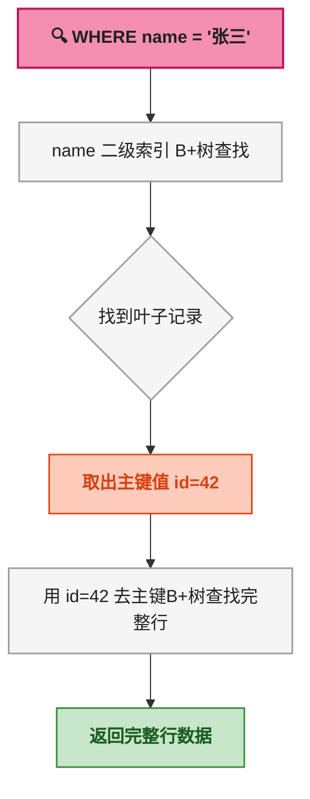

# MySQL B+树索引体系：从数据结构到查询执行

> 📌 <strong>前置知识</strong>：读者需了解磁盘与内存的速度差异（磁盘寻道 ~ 10ms，内存访问 ~ 100ns），以及基本的数据结构概念（链表、树、二分查找）。本文所有讨论基于 InnoDB 存储引擎。

## 1. 为什么是 B+树

MySQL 的数据是存在磁盘上的。磁盘 IO 的速度比内存慢约 10 万倍，所以数据库设计的第一原则是：<strong>尽量减少磁盘 IO 次数</strong>。

要理解为什么用 B+树，先看二叉搜索树（BST，Binary Search Tree）。

在 BST 中，每个节点只存一个键，每层只有两个子节点。如果数据量是 100 万行，树高就是 log₂(1000000) ≈ 20 层。执行一次查找最多需要 <strong>20 次磁盘 IO</strong>——因为每一层的节点都可能分散在不同的磁盘页上，每次读一个节点就是一次磁盘 IO。

这个代价太高了。解决的思路是：<strong>让每个节点存更多的键，增加每层的分叉数，降低树的高度</strong>。


从二叉树到 B+树的演进：

| 结构 | 节点存储 | 分叉数 | 100 万行树高 | 磁盘 IO |
|------|----------|--------|-------------|---------|
| 二叉搜索树 | 1 个键 | 2 | ~20 层 | ~20 次 |
| AVL 平衡树 | 1 个键 | 2 | ~20 层 | ~20 次 |
| B 树 | 多个键 | 多路 | ~ 4 ~ 5 层 | ~ 4 ~ 5 次 |
| B+树 | 多个键，仅叶子存数据 | 多路 | ~ 3 ~ 4 层 | ~ 3 ~ 4 次 |

B+树相对 B 树的核心改进有两个：
1. <strong>非叶子节点只存键不存数据</strong>——每个 16KB 的页能装更多的键，树更矮
2. <strong>叶子节点用双向链表串联</strong>——范围查询不需要回溯，顺着链表扫就行

> ⚠️ <strong>新手提示</strong>：InnoDB 默认页大小是 16KB。一个 `INT` 主键占 4 字节，加上页指针 4 字节，每个键约 8 字节。一个非叶子页能装约 1200 个键。1200³ = 17.28 亿行，只需 3 层。这就是为什么 MySQL 的 B+树通常只有 3 ~ 4 层。

## 2. B+树的完整结构：根、内部节点、叶子链表

B+树由三种节点组成：


<strong>三类节点各司其职</strong>：

<strong>根节点（Root Node）</strong>：树的入口。数据少时可能同时是叶子节点，数据增长后升级为纯索引节点。

<strong>内部节点（Internal / Non-leaf Node）</strong>：只存索引键和指向下一层节点的指针。叶子节点中的最小键值会"上浮"到内部节点作为路由信息。内部节点的键值在它指向的叶子中 <strong>不一定真实存在</strong>——它只是路由标记。

<strong>叶子节点（Leaf Node）</strong>：存储完整数据行（聚簇索引）或主键值（二级索引）。所有叶子节点通过 <strong>双向指针</strong>（prev / next）连接成有序链表。

一个具体的 B+树结构示例（以主键 `id` 为索引）：

```text
              [50 | 100]              ← 根节点（键+页指针）
             /    |    \
      [10|25|45] [60|80|95] [110|140|180]  ← 内部节点
       /  ...    /  ...     /  ...
     [叶子1]↔[叶子2]↔[叶子3]↔...↔[叶子N]   ← 叶子节点双向链表
```

树的高度从根节点（第 1 层）开始计数，叶子节点是第 3 层——这就是典型的 3 层 B+树。

> 📌 <strong>前置知识</strong>：InnoDB 通过 <strong>页号（Page Number）</strong> 在磁盘上定位页面。每个页有唯一的 4 字节页号。上面图中内部节点存的"指针"本质就是页号。

## 3. InnoDB 页结构：16KB 的内部长什么样

B+树的每一个节点，在 InnoDB 中对应一个 <strong>16KB 的数据页（Page）</strong>。理解页的内部布局是理解后续所有概念（聚簇索引、回表、页分裂）的前提。

下面用 HTML+CSS 画出一个 16KB 页的内部字节布局：

<div style="max-width:700px;font-family:JetBrains Mono,Consolas,monospace;font-size:13px;line-height:1.6">

<div style="background:#F5F5F5;border:2px solid #BDBDBD;padding:0;color:#212121">

<div style="background:#1E88E5;color:#FFFFFF;padding:8px 12px;font-weight:bold;font-size:15px">
📄 InnoDB 数据页（16KB / 16384 字节）
</div>

<div style="padding:12px">

<!-- File Header -->
<div style="background:#E1BEE7;border:2px solid #7B1FA2;padding:10px;margin-bottom:6px;font-size:12px">
<strong style="color:#4A148C">📋 File Header（38 字节）</strong><br/>
<span style="color:#4A148C">页号 | 页类型 | 上一页号 | 下一页号 | 所属表空间ID | LSN | 校验和</span>
</div>

<!-- Page Header -->
<div style="background:#FFE082;border:2px solid #FFB300;padding:10px;margin-bottom:6px;font-size:12px">
<strong style="color:#5D4037">📊 Page Header（56 字节）</strong><br/>
<span style="color:#5D4037">页内记录数 | Free Space 起始位置 | 已删除字节数 | 当前槽数量 | 最后插入位置 | 页方向 | 页内堆顶</span>
</div>

<!-- Infimum + Supremum -->
<div style="background:#FFCDD2;border:2px solid #C62828;padding:10px;margin-bottom:6px;font-size:12px">
<strong style="color:#B71C1C">📍 Infimum（13 字节） + Supremum（13 字节）</strong><br/>
<span style="color:#B71C1C">Infimum = 虚拟最小记录（所有记录中的"下界"） | Supremum = 虚拟最大记录（"上界"）</span>
</div>

<!-- User Records -->
<div style="background:#C8E6C9;border:2px solid #388E3C;padding:10px;margin-bottom:6px">
<strong style="color:#1B5E20">📝 User Records（用户记录区）</strong><br/>
<div style="margin-top:6px;color:#1B5E20;font-size:12px">
┌──────────┬──────┬─────┬─────┐<br/>
│ 记录头(5B) │ id=5 │ name│ age │  ← Record 1<br/>
└──────────┴──────┴─────┴─────┘<br/>
┌──────────┬──────┬─────┬─────┐<br/>
│ 记录头(5B) │ id=12│ name│ age │  ← Record 2<br/>
└──────────┴──────┴─────┴─────┘<br/>
<span style="font-size:11px">... 更多记录 ...</span>
</div>
</div>

<!-- Free Space -->
<div style="background:#FFF3E0;border:2px dashed #FF9800;padding:10px;margin-bottom:6px;font-size:12px">
<strong style="color:#E65100">🆓 Free Space（空闲空间）</strong><br/>
<span style="color:#E65100">新记录从这里分配。插入数据时向上增长 ↑</span>
</div>

<!-- Page Directory -->
<div style="background:#E1BEE7;border:2px solid #7B1FA2;padding:10px;margin-bottom:6px;font-size:12px">
<strong style="color:#4A148C">📑 Page Directory（页目录 / 槽）</strong><br/>
<span style="color:#4A148C">每 4 ~ 8 条记录一组，记录每组最大记录的页内偏移。二分查找时用槽定位记录区间，然后在该区间内顺序扫描。</span>
</div>

<!-- File Trailer -->
<div style="background:#E1BEE7;border:2px solid #7B1FA2;padding:10px;font-size:12px">
<strong style="color:#4A148C">🔒 File Trailer（8 字节）</strong><br/>
<span style="color:#4A148C">校验和（与 File Header 一致则写入成功） | LSN 低 4 字节（损坏检测）</span>
</div>

</div>
</div>

</div>

<br/>

<strong>页内记录的组织方式</strong>：

每个用户记录除了字段值外，还有一个 <strong>记录头（Record Header，5 字节）</strong>，包含：
- <strong>下一条记录的偏移量（next_record）</strong>——逻辑顺序，不是物理顺序。即使记录物理位置改变，只要更新偏移量即可
- <strong>记录类型</strong>：0=普通叶子记录，1=非叶子节点记录，2=Infimum，3=Supremum
- <strong>是否被删除（delete_flag）</strong>——标记为删除而非物理删除（提高性能）
- <strong>记录所属的最小记录数（n_owned）</strong>——只在槽的第一条记录中有意义

<strong>查找过程</strong>：二分查找 Page Directory 的槽 → 定位到具体的记录区间 → 在区间内顺序扫描 next_record 链表 → 找到目标行。

> ⚠️ <strong>新手提示</strong>：虽然 User Records 区看起来是从上往下排列的，但实际的物理写入方向是 <strong>User Records 向上增长、Free Space 向下压缩</strong>，两者相向而行，在中间相遇时触发页分裂。同时，记录之间通过 next_record 指针维持逻辑有序，物理插入位置是随机的（堆组织表 Heap Table）。

## 4. 聚簇索引：主键就是数据

InnoDB 的聚簇索引（Clustered Index）是最核心的索引结构。<strong>数据即索引，索引即数据</strong>。


聚簇索引的四个关键特征：

<strong>① 表数据按主键顺序存储在 B+树的叶子节点中</strong>。主键值小的行在左边叶子，大的在右边叶子。因此 InnoDB 表也叫 <strong>索引组织表（Index-Organized Table）</strong>——表本身就是一个 B+树。

<strong>② 叶子节点存储完整的行数据</strong>。包括所有列（name、age、email 等），不只是主键。读主键索引一次 IO 就能拿到整行。

<strong>③ 非叶子节点只存主键值 + 页号指针</strong>。这就是为什么主键越小越好——非叶子页能装更多键，树更矮。

<strong>④ InnoDB 强制要求聚簇索引</strong>。建表时自动选择主键作为聚簇索引；没有主键则选第一个 UNIQUE NOT NULL 列；都没有则自动生成一个 6 字节的隐藏列 `DB_ROW_ID`。

> ⚠️ <strong>新手提示</strong>：推荐用自增 ID（`AUTO_INCREMENT`）作为主键。因为新数据总是追加在最右边的叶子，避免了页内随机插入导致的页分裂。如果用 UUID 之类的随机值，插入会频繁触发页分裂，导致 B+树"膨胀"，性能下降。

## 5. 二级索引：回表是怎么回的事

既然数据已经按主键排好了，为什么还需要辅助索引？因为 <strong>主键索引只对主键查询快</strong>，如果 `WHERE name = '张三'`，主键索引帮不上忙。

<strong>二级索引（Secondary Index）</strong>是一棵独立的 B+树：

- <strong>内部节点</strong>：存索引列的值（如 `name` 列的值）
- <strong>叶子节点</strong>：存索引列的值 + <strong>主键值</strong>（而不是完整行数据）
- 按索引列的值排序


查询 `SELECT * FROM users WHERE name = '张三'` 的执行过程：



从二级索引叶子拿到主键值后，再走一遍主键 B+树拿到完整行——这个过程叫 <strong>回表（Index Lookup / Bookmark Lookup）</strong>。

> ⚠️ <strong>新手提示</strong>：理解回表的代价。如果 SQL 查询了 1000 行但二级索引不包含它们，就需要从主键索引获取完整行数据——也就是 1000 次回表。每行回表都是一次独立的 B+树查找（3 ~ 4 次磁盘 IO），总计 3000 ~ 4000 次 IO。这也是为什么会慢。

<strong>覆盖索引（Covering Index）</strong>可以避免回表：

```sql
-- 要回表：二级索引只存 name + id，age 在主键索引里
SELECT * FROM users WHERE name = '张三';

-- 不用回表：name 和 id 都在二级索引的叶子中，不需要查主键索引
SELECT name, id FROM users WHERE name = '张三';
```

第二个查询叫 <strong>覆盖索引</strong>——查询的列全部在索引中，不需要回表。EXPLAIN 里 `Extra` 列会显示 `Using index`。

## 6. 联合索引：多列是如何在 B+树中排序的

<strong>联合索引（Composite Index）</strong>将多个列组合成一个索引。比如 `INDEX idx_ab(a, b)` 在 B+树中的排列规则是：<strong>先按 a 排序，a 相同时再按 b 排序</strong>。


以 `(last_name, first_name)` 联合索引为例，B+树叶子节点的排列是：

```text
叶子1: (Adams, Alice) (Adams, Bob) (Adams, Charlie)
  ↕
叶子2: (Baker, David) (Baker, Eve) (Baker, Frank)
  ↕
叶子3: (Smith, George) (Smith, Helen) (Smith, Ian)
```

<strong>最左前缀原则</strong>：联合索引只有从最左侧开始匹配时才能使用。原因很简单——B+树首先按第一列排序，如果第一列不确定，就无法确定从树的哪个位置开始查找。

| WHERE 条件 | 能用 idx_ab(a,b)？ | 原因 |
|------------|:---:|------|
| `a = 1 AND b = 2` | ✅ | 完整匹配联合索引两列 |
| `a = 1` | ✅ | 匹配最左列 a |
| `a > 1 AND b = 2` | ⚠️ 仅 a 部分 | a 用范围后，b 的排序失效 |
| `b = 2` | ❌ | 跳过最左列 a，b 在树中无序 |
| `a = 1 OR b = 2` | ❌ | OR 两边不同列，无法合并 |

> ⚠️ <strong>新手提示</strong>：联合索引的列顺序非常关键。把区分度高的列放在前面，把范围查询的列放在后面。比如 `(status, create_time)`，如果 `status` 只有 3 种值而 `create_time` 几乎不重复，建议用 `(create_time, status)` 或单独建索引。

## 7. 四种 SQL 在 B+树上的完整执行路径

理解了聚簇索引和二级索引的 B+树结构后，来看四种基本 SQL 操作在 B+树上到底做了什么。

```mermaid
flowchart TD
    subgraph SELECT_PATH ["🔍 SELECT 查询路径"]
        S1["WHERE 条件"] --> S2{"有匹配的<br/>二级索引?"}
        S2 -->|"有"| S3["查二级索引B+树<br/>拿到主键"]
        S3 --> S4["回表查主键B+树<br/>拿完整行"]
        S2 -->|"无"| S5["全表扫描<br/>沿主键B+树叶子链表"]
        S4 --> S6["返回结果"]
        S5 --> S6
    end

    subgraph INSERT_PATH ["✏️ INSERT 插入路径"]
        I1["拿到自增主键值"] --> I2["二分查找主键B+树<br/>定位插入叶子页"]
        I2 --> I3{"叶子页<br/>有空闲?"}
        I3 -->|"有"| I4["写入记录<br/>更新槽/next_record"]
        I3 -->|"满了"| I5["页分裂<br/>分配新页+数据对半分"]
        I5 --> I6{"父节点<br/>有空闲?"}
        I6 -->|"有"| I7["父节点新增键+指针"]
        I6 -->|"满了"| I8["父节点也分裂<br/>递归向上"]
    end

    subgraph DELETE_PATH ["🗑️ DELETE 删除路径"]
        D1["定位目标叶子页"] --> D2["标记 delete_flag=1"]
        D2 --> D3["不物理删除"]
        D3 --> D4{"页内空间使用率<br/>< 50%?"}
        D4 -->|"是"| D5["Purge线程物理删除"]
        D5 --> D6{"进一步<br/>< 合并阈值?"}
        D6 -->|"是"| D7["页合并"]
    end

    subgraph UPDATE_PATH ["🔄 UPDATE 更新路径"]
        U1{"更新了<br/>主键?"}
        U1 -->|"否(原地)"| U2{"新值长度<br/><=旧值?"}
        U2 -->|"是"| U3["同页就地更新"]
        U2 -->|"否"| U4["先删旧记录+插入新记录"]
        U1 -->|"是"| U5["先删旧主键行<br/>再插新主键行"]
    end

    classDef startEnd fill:#F48FB1,stroke:#C2185B,stroke-width:2px,color:#212121,font-weight:bold
    classDef condition fill:#E1BEE7,stroke:#7B1FA2,stroke-width:1.5px,color:#212121,font-weight:bold
    classDef process fill:#F5F5F5,stroke:#9E9E9E,stroke-width:1.5px,color:#212121
    classDef reject fill:#FFCDD2,stroke:#C62828,stroke-width:1.5px,color:#B71C1C,font-weight:bold
    classDef data fill:#C8E6C9,stroke:#388E3C,stroke-width:1.5px,color:#1B5E20,font-weight:bold

    class S6,F,B6,FEEDBACK data
    class S2,I3,I6,D4,D6,U1,U2 condition
    class S5,D3,U4 reject
    class I5,I8,D7 highlight
```



### SELECT 路径详解

1. MySQL 优化器根据 WHERE 条件选择合适的索引（主键或二级索引）
2. 从 B+树根节点开始，逐层二分查找，找到目标叶子页
3. 如果是主键索引 → 直接返回叶子中的完整行；如果是二级索引 → 拿到主键值后回表
4. 如果 WHERE 条件中有 `>`, `<`, `BETWEEN` → 找到范围起点后沿叶子链表扫描

### INSERT 路径详解

以自增主键为例：

1. 拿到主键值后，在 B+树中二分查找插入位置
2. 写入记录到目标叶子页的 User Records 区
3. 更新记录头中的 next_record 指针和 Page Directory 的槽信息
4. 如果页内空间不足（Free Space 不够放新记录），触发 <strong>页分裂</strong>（见第 11 节）

### DELETE 路径详解

1. 定位到目标行所在叶子页
2. <strong>不物理删除</strong>，只在记录头设置 `delete_flag = 1`
3. Purge 线程后台异步物理删除标记记录
4. 页内空间利用率过低时触发 <strong>页合并</strong>（见第 11 节）

### UPDATE 路径详解

UPDATE 分三种情况：

- <strong>不更新主键、新值长度不变或更短</strong>：原地更新，只改行内字段值
- <strong>不更新主键、新值长度更长</strong>：标记旧记录删除 + 插入新记录（B+树位置可能变）
- <strong>更新了主键</strong>：先删旧主键行 + 再插新主键行（走两次 B+树操作）

## 8. 范围查询：为什么 B+树的叶子链表是神来之笔

```sql
SELECT * FROM users WHERE age BETWEEN 20 AND 30;
```

在 `age` 二级索引的 B+树上，范围查询的执行过程：


<strong>两步走</strong>：

<strong>第一步：定位起点</strong>。从 B+树根节点开始，二分查找找到 `age = 20` 的第一条记录所在叶子页。这走的是"树搜索"路径，树高几次 IO。

<strong>第二步：沿链表扫描</strong>。从第一条 `age = 20` 开始，<strong>沿叶子节点的 next 指针向右扫描</strong>，逐条读取，直到 `age > 30` 停止。这一步利用的是叶子节点之间的 <strong>双向链表</strong>——不需要回到内部节点。

这个设计是 B+树相比 B 树的杀手级优势。B 树的叶子节点间没有链表，范围查询必须回溯到内部节点再往下找，多条结果会导致大量的重复 IO。

<strong>范围查询 + 回表</strong>：如果上面的 SQL 是 `SELECT *`，那每条 `age BETWEEN 20 AND 30` 的记录从二级索引拿到主键后，都需要回表查主键 B+树。假设有 5000 行命中，就是最多 5000 次回表 IO。

MySQL 有一个优化叫 <strong>MRR（Multi-Range Read，多范围读取）</strong>：先把二级索引拿到的主键值收集起来，<strong>按主键排序</strong>后再去主键 B+树查找。这样回表的访问模式从"随机 IO"变成了"近似顺序 IO"，大幅减少磁盘磁头移动。

## 9. 模糊查询：为什么 `LIKE '%abc'` 不走索引

```sql
-- 走索引
SELECT * FROM users WHERE name LIKE 'Zhang%';

-- 不走索引（全表扫描）
SELECT * FROM users WHERE name LIKE '%Zhang';
```


B+树的排序方式是 <strong>从左到右逐个字符比较</strong>。在 `name` 二级索引的 B+树中：

<strong>`LIKE 'Zhang%'` 能走索引</strong>：B+树清楚 `Zhang` 开头的数据从哪开始——定位到 B+树中 `name = 'Zhang'` 的位置，然后沿叶子链表扫描，直到前缀不再是 `Zhang`。这叫 <strong>前缀匹配</strong>。

<strong>`LIKE '%Zhang'` 不走索引</strong>：B+树不知道 `%Zhang` 在哪——因为数据是按第一个字符排序的，不是按最后一个字符。随便一个值都可能以 `Zhang` 结尾，索引无能为力。只能全表扫描。

<strong>索引条件下推（ICP，Index Condition Pushdown）</strong> 是 MySQL 5.6 引入的优化：

```sql
-- 联合索引 idx_ab(a, b)
SELECT * FROM t WHERE a LIKE 'hello%' AND b > 10;
```

没有 ICP 时：先在索引中找到 `a LIKE 'hello%'` 的记录 → 每条都回表 → 在 Server 层过滤 `b > 10`。

有 ICP 时：MySQL 在<strong>引擎层（索引扫描时）</strong>就过滤掉 `b <= 10` 的记录，只有 `b > 10` 的才回表。减少了回表次数。

## 10. 分页查询：深分页为什么越来越慢

```sql
SELECT * FROM users ORDER BY id LIMIT 1000000, 10;
```


这条 SQL 看起来很无辜，实际执行过程是：

1. 从主键 B+树最左边叶子开始，沿链表向右扫描
2. <strong>跳过前 100 万行</strong>——一条一条地扫过 100 万行，只是不返回给客户端
3. 扫到第 1,000,001 行时，开始返回 10 行

也就是说，`LIMIT 1000000, 10` <strong>确实读了 100 万行</strong>，只是丢弃了而已。

<strong>解决方案：基于游标的分页</strong>（游标分页 / Keyset Pagination）：

```sql
-- 第一页
SELECT * FROM users ORDER BY id LIMIT 10;
-- 假设返回的最后一行的 id = 10

-- 第二页：用上一页最后 id 作为起点
SELECT * FROM users WHERE id > 10 ORDER BY id LIMIT 10;
```

第二种写法直接从 B+树中 `id > 10` 的位置开始扫描，不需要跳过任何行，每个"下一页"都是 O(log N) 的树查找 + 固定扫描。

> ⚠️ <strong>新手提示</strong>：游标分页也有局限性。如果 WHERE 条件复杂、有多列排序、或者需要支持跳页（直接跳到第 100 页），游标分页就不适用了。在这些场景下，可以考虑用 Elasticsearch 等搜索引擎做分页，MySQL 不擅长这个。

## 11. 页分裂与页合并：B+树的动态成长与收缩

B+树不是静态的，随着数据插入和删除，树在不断地"长大"和"收缩"。

### 页分裂（Page Split）

当向一个已满的叶子页插入新记录时，InnoDB 会做页分裂：


<strong>分裂过程</strong>（以自增主键为例，插入的页已满 16KB）：

1. <strong>申请新页</strong>：从表空间分配一个新的 16KB 页
2. <strong>数据对半分</strong>：将旧页中 ~50% 的记录移到新页（非自增主键的情况下），更新各记录的 next_record 指针
3. <strong>更新链表</strong>：旧页的 next 指向新页，新页的 prev 指向旧页，重新接入叶子链表
4. <strong>在父节点插入新键</strong>：将新页的第一个键 + 新页号插入父节点
5. <strong>递归检查父节点</strong>：如果父节点也满了，继续分裂，直到根节点。如果根节点也满了，分裂根节点并新建一个根，树高 +1

### 页合并（Page Merge）

当页内记录删除过多、空间利用率低于 <strong>MERGE_THRESHOLD（默认 50%）</strong> 时，InnoDB 会尝试与相邻兄弟页合并：

1. 检查相邻页的空闲空间是否足够容纳当前页的所有记录
2. 如果能容纳，将当前页记录全部迁移到兄弟页，当前页回收
3. 更新父节点中的键值和指针
4. 如果合并后父节点只剩一个指针，父节点降级或删除

> ⚠️ <strong>新手提示</strong>：页分裂是 INSERT 变慢的主要原因之一。如果用随机 UUID 做主键，每次插入都可能触发页分裂，产生大量的页碎片。同时，频繁的分裂和合并会导致 B+树的叶子链表物理上不连续，范围扫描的 IO 模式退化为随机 IO。

<strong>InnoDB 页结构中的关键源码</strong>（摘自 `storage/innobase/include/page0page.h`）：

```c
/** Page directory slot */
struct page_dir_slot_t {
  uint16_t  rec_offset; /* 记录的页内偏移量，通过二分查找定位 */
  uint16_t  n_owned;    /* 该槽"管辖"的记录数（4~8条） */
};

/** Page header */
struct page_header_t {
  uint16_t  page_dir_size;    /* 槽的总数 */
  uint16_t  page_heap_top;    /* 堆顶位置（第一个空闲字节） */
  uint16_t  page_n_recs;      /* 页内记录总数（不含Infimum/Supremum） */
  uint16_t  page_free;        /* 空闲记录链表的头指针 */
  uint16_t  page_garbage;     /* 已标记删除的字节总数 */
  uint16_t  page_last_insert; /* 最后插入的位置 */
  uint8_t   page_direction;   /* 插入方向：LEFT/DOWN/RIGHT_UP等 */
  uint16_t  page_n_direction; /* 同方向连续插入次数 */
  uint16_t  page_max_trx_id;  /* 页内最大的事务ID（MVCC用） */
};
```

逐行解释：
- `page_dir_slot_t`：每个槽记录一组记录中最大记录的偏移量，以及该组的记录数。二分查找 Page Directory 时用这个结构定位目标记录所在的组
- `page_heap_top`：堆组织表中的"堆顶"，新记录的物理空间从这个位置向上分配
- `page_garbage`：被标记删除但尚未 Purge 的字节数。当这个值过大时触发页合并
- `page_n_direction`：记录插入方向的连续性。如果连续多次在同一方向插入，InnoDB 会预判插入位置，跳过每次二分查找
- `page_max_trx_id`：页内所有记录中最大的事务 ID，MVCC 判断可见性时用于快速跳过整个页

## 12. 总结

B+树是 MySQL InnoDB 中一切查询行为的地基。整个系列的后续文章——Join 策略、事务 MVCC、锁机制——都是在 B+树这个数据结构之上构建的。

<strong>核心要点回顾</strong>：

- B+树通过"矮胖"结构将磁盘 IO 次数降到 3 ~ 4 次
- InnoDB 的 16KB 页内有 File Header、Page Directory、User Records、Free Space 等区域
- 聚簇索引的叶子存完整行数据，二级索引的叶子存主键值，通过回表获取完整行
- 联合索引按最左前缀排序，列顺序决定哪些查询能用索引
- 叶子节点的双向链表是范围查询和排序高效的关键
- 页分裂和页合并是 B+树动态平衡的手段
- `LIMIT OFFSET` 深分页慢是因为它确实扫过了 OFFSET 行
- `LIKE '%abc'` 不走索引是因为 B+树按前缀排序，不知道后缀在哪

下一篇讲 <strong>MySQL Join 原理</strong>——多表连接时 B+树到底在做什么，以及为什么"小表驱动大表"能快一个数量级。
