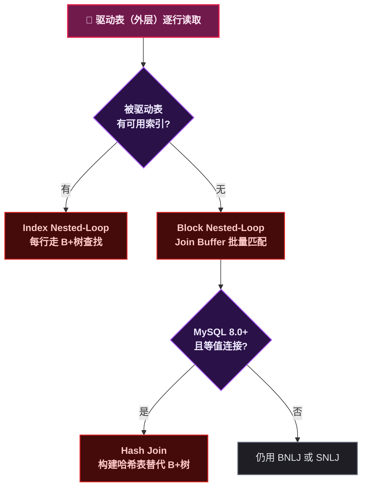

# B+树上的表连接——彻底搞懂 Join

> 📌 <strong>前置知识</strong>：这篇基于前一篇 B+树索引体系的内容。默认读者已经理解聚簇索引、二级索引、回表、B+树叶子链表这几个概念。这不会是一篇"查字典"式的 SQL 语法说明，而是从 InnoDB 引擎视角解释 Join 到底在干什么。

## 1. Join 的本质：笛卡尔积的引擎视角

从数学上讲，Join 是两张表的 <strong>笛卡尔积 + 过滤条件</strong>：

```sql
SELECT * FROM A JOIN B ON A.id = B.a_id WHERE A.age > 20;
```

逻辑上等价于：先穷举 A × B 的所有组合（笛卡尔积），再保留满足 `A.id = B.a_id AND A.age > 20` 的行。但现实中没有引擎会真去算笛卡尔积——100 万 × 100 万 = 1 万亿行，物理世界做不到。

MySQL 实际的做法是：<strong>选一张表做驱动（外层循环），另一张做被驱动（内层查找），逐行匹配</strong>。算法的核心差异在于"如何查找被驱动表中匹配的行"——这才有了 SNLJ、BNLJ、INLJ、Hash Join 四种策略。



这四种算法，接下来逐个拆解。

## 2. SNLJ：每次去被驱动表里翻一遍全表

<strong>Simple Nested-Loop Join（SNLJ）</strong>是最朴素的做法，也是理解其他算法的基础。


假设 `users` 表有 1000 行，`orders` 表有 10 万行：

```text
for user in users (1000 行):
    for order in orders (10 万行):
        if user.id == order.user_id:
            输出(user, order)
```

复杂度是 `O(M × N)`——驱动表每行都触发一次被驱动表的 <strong>全表扫描</strong>。在磁盘上，orders 表被完整扫描了 1000 次，总共扫描了 1000 × 10 万 = <strong>1 亿行</strong>。

> ⚠️ <strong>新手提示</strong>：SNLJ 在任何实际数据库中都不应该是默认行为。MySQL 会自动检测被驱动表上是否有索引；有索引用 INLJ，无索引用 BNLJ。但理解 SNLJ 是理解后续优化为什么有效的必经之路——所有优化都在回答"怎么减少内层扫描量"。

## 3. BNLJ：Join Buffer 带来的批量革命

Block Nested-Loop Join（BNLJ）是 MySQL 对 SNLJ 的第一个优化。核心思路：<strong>一次读一批驱动表行，在 Join Buffer 里批量匹配被驱动表，减少被驱动表的全表扫描次数</strong>。


假设 Join Buffer 能装 100 行：

```text
while users 还有剩余行:
    取 100 行 users 放入 Join Buffer
    for order in orders (扫描 1 次全表):
        for user in Join Buffer:
            if user.id == order.user_id:
                输出(user, order)
```

<strong>关键差异</strong>：orders 表的全表扫描次数从 1000 次（SNLJ）降到了 <strong>10 次</strong>（1000 ÷ 100）。每次扫描还是 10 万行，但只做了 10 次而不是 1000 次。

Join Buffer 的大小由 `join_buffer_size` 参数控制，默认 256KB。如果驱动表的行很大、Buffer 装不了几行，效果打折扣，所以建议只 SELECT 需要的列，不要 `SELECT *`。

> 📌 <strong>前置知识</strong>：Join Buffer 存的是驱动表中<strong>需要的列</strong>（SELECT + WHERE 中引用的），不是整行。所以减少 SELECT 列数能让 Buffer 装更多行，进一步减少被驱动表扫描次数。

## 4. INLJ：索引让 Join 变成 B+树查找

Index Nested-Loop Join（INLJ）是 Join 性能最高的算法（在没有 Hash Join 之前）。前提是被驱动表的 Join 列上有索引。


```text
for user in users (1000 行):
    用 user.id 在 orders.user_id 二级索引上做 B+树查找
    找到后回表获取完整 order 行
    输出(user, order)
```

<strong>被驱动表的访问变成了 B+树查找</strong>，每次是 3 ~ 4 次磁盘 IO，而不是一次全表扫描。总代价约 1000 × 4 = 4000 次 IO，对比 SNLJ 的 1 亿次行扫描，差距是四个数量级。

INLJ 的要求只有一个：<strong>被驱动表的 Join 列上有索引</strong>。对于 `ON a.id = b.user_id` 这样的语句，在 `b.user_id` 上建索引即可。

> ⚠️ <strong>新手提示</strong>：建索引时优先用 <strong>覆盖索引</strong>。如果 `b.user_id` 的二级索引包含 SELECT 中需要的所有列（如 `INDEX idx_uid_cols(user_id, col1, col2)`），回表这一步省掉了，INLJ 更快。

<strong>INLJ 下驱动表的选择逻辑</strong>：

```text
场景 A：user 表 100 行 × orders 索引查找 4 IO = 400 IO
场景 B：orders 表 10 万行 × user 索引查找 4 IO = 40 万 IO
```

MySQL 优化器会自动选小表做驱动。但有时优化器判断失误——比如统计信息过期——需要用 `STRAIGHT_JOIN` 或 `JOIN_ORDER` hint 手动指定驱动表。

## 5. Hash Join：MySQL 8.0 的杀手锏

MySQL 8.0.18 引入了 Hash Join，终结了"没索引的 Join 必然慢"的问题。


<strong>两阶段</strong>：

<strong>Build 阶段</strong>：选一张表（通常是小的那张），在内存中构建哈希表。Key = Join 列的哈希值，Value = 驱动表行数据。

<strong>Probe 阶段</strong>：扫描被驱动表，对每一行计算 Join 列的哈希值，去哈希表里查找匹配。

复杂度从 O(M × N) 降到了 O(M + N)。而且<strong>不需要索引</strong>——哈希表就是内存中的数据结构，不管被驱动表 Join 列上有没有索引，查找都是 O(1)。

> ⚠️ <strong>新手提示</strong>：Hash Join 只适用于 <strong>等值连接</strong>（`=`、`IN`），不支持范围条件（`>`、`BETWEEN`）。遇到非等值 Join，MySQL 仍然回退到 BNLJ。另外，哈希表在 `join_buffer_size` 中构建，如果驱动表太大装不下，会写磁盘临时文件，Hash Join 退化为"磁盘 Hash Join"，性能下降。

## 6. INNER / LEFT / RIGHT Join 在 B+树上的数据流差异

三种 Join 类型的选择不改变算法，但改变 <strong>哪些行作为驱动、哪些行必定输出</strong>。


<strong>INNER JOIN</strong>：两边都匹配才输出。MySQL 通常自动选小表做驱动表。不匹配的行丢弃。

<strong>LEFT JOIN</strong>：<strong>左表固定为驱动表</strong>，右表为被驱动表。左表所有行都保留，右表匹配不上的列填充 NULL。因为"左表所有行都保留"这个语义，MySQL 不能随意调换驱动表。

<strong>RIGHT JOIN</strong>：右表固定为驱动表。等价于把表名换一下的 LEFT JOIN（`A RIGHT JOIN B` = `B LEFT JOIN A`），实际项目中很少用。

<strong>四种算法在 LEFT JOIN 中的表现</strong>：

| 算法 | LEFT JOIN 行为 |
|------|---------------|
| INLJ | 左表每行去右表做 B+树查找，找不到 → 右列填 NULL |
| BNLJ | 左表一批进 Buffer，扫右表匹配，某左行没匹配 → 填 NULL |
| Hash Join | Build 左表哈希 → Probe 右表，左行没被命中 → 填 NULL |
| SNLJ | 左表每行扫一遍右表全表，找不到 → 填 NULL |

LEFT JOIN 的语义决定了<strong>不能调换驱动表</strong>。这就是为什么 `LEFT JOIN` 往往比 `INNER JOIN` 慢——优化器损失了选择最优驱动表的能力。如果没有"所有左表行都要保留"的业务需求，用 `INNER JOIN` 让优化器自由选择。

> ⚠️ <strong>新手提示</strong>：很多开发习惯用 LEFT JOIN 写"以防万一"，结果表多了优化器完全没空间调整顺序，查询慢到飞起。写 SQL 的时候多问一句：左表不匹配的行真的需要保留吗？大部分情况下不需要，直接 INNER JOIN 更优。

## 7. Join 顺序优化：小表驱动大表原则

假设有三个表 `A (100行) B (1000行) C (100000行)`：

```sql
SELECT * FROM A JOIN B ON A.bid = B.id JOIN C ON B.cid = C.id;
```

MySQL 可能的 Join 顺序有 3! = 6 种（N 个表就是 N! 种）。优化器会基于统计信息估算每种顺序的代价，选代价最小的。

<strong>小表驱动大表原则</strong>的推理：

```text
A→B→C: 100 × log(1000) × log(100000) ≈ 100 × 10 × 17 = 17000 次查找
C→B→A: 100000 × log(1000) × log(100) ≈ 100000 × 10 × 7 = 7000000 次查找
```

差距是几百倍。原则很简单：<strong>尽可能让小表在外层（驱动），大表在内层利用索引</strong>。每次外层行数增加，内层查找次数等比放大。

<strong>优化器的局限</strong>：

- <strong>统计信息不准</strong>：`innodb_stats_persistent` 开启了但长期没 `ANALYZE TABLE`，优化器用的 `n_rows` 偏离实际行数
- <strong>8 表以上</strong>：搜索所有排列代价太大，优化器用启发式剪枝，可能选不到最优顺序
- <strong>子查询展开后</strong>：SQL 被重写，和内层 SQL 完全不同，优化器可能判断失误

<strong>日常开发可用的手段</strong>：

```sql
-- 1. 强制 Join 顺序
SELECT STRAIGHT_JOIN * FROM small_table JOIN large_table ON ...;

-- 2. MySQL 8.0.20+ 用 optimizer_switch 的 JOIN_ORDER hint
SELECT /*+ JOIN_ORDER(small_table, large_table) */ * FROM small_table JOIN large_table ON ...;

-- 3. 更新统计信息
ANALYZE TABLE orders;
```

## 8. 总结：什么时候 Join 会慢

Join 慢就慢在<strong>内层被驱动表的访问方式</strong>。四种算法的差异一目了然：

| 算法 | 被驱动表访问方式 | 每行代价 | 适用条件 |
|------|:---|:---|------|
| SNLJ | 全表扫描 | O(N) | 无（理论基线） |
| BNLJ | 全表扫描（批量化） | O(N) × 批次 | 无索引时 |
| INLJ | B+树查找 | O(log N) | Join 列有索引 |
| Hash Join | 哈希查找 | O(1) | 等值连接 (MySQL 8.0+) |

<strong>日常开发检查清单</strong>：

1. 被驱动表的 Join 列上有索引吗？没有就加索引用 INLJ，或升级到 MySQL 8.0 用 Hash Join
2. 驱动表是不是小的那个？LEFT JOIN 写多了驱动表被锁死，考虑改用 INNER JOIN
3. Join Buffer 够大吗？`SHOW VARIABLES LIKE 'join_buffer_size'`，如果被驱动表扫描次数很高，考虑调大
4. SELECT 的列够少吗？减少列数能让 Join Buffer 装更多行，减少扫描批次
5. 多表 Join 时索引都覆盖到了吗？EXPLAIN 看 `key` 列，确认每个 Join 步骤都有索引用

下一篇讲 <strong>MySQL 事务与 MVCC</strong>——四种隔离级别、ReadView、Undo Log，以及 MVCC 在 B+树上的多版本是怎么维护的。
