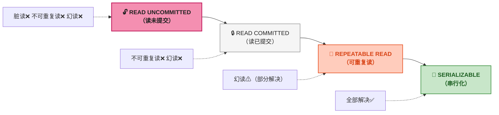

# MySQL 事务与 MVCC：多版本并发控制的完整原理

> 📌 <strong>前置知识</strong>：这篇需要理解前两篇的 B+树结构和聚簇索引。核心概念——隐藏列、Undo Log、ReadView——都是在 B+树的聚簇索引叶子页上工作的。建议读到这里时回想前文 InnoDB 页结构中 User Records 的记录头信息。

## 1. 四种事务隔离级别：MySQL 到底在"隔离"什么

事务隔离级别解决的是 <strong>并发事务同时读写同一行数据</strong> 时的可见性问题。如果只有一个连接在操作数据库，根本不需要隔离级别——但现实的线上系统有几十上百个并发连接，读写冲突无处不在。

隔离级别定义了<strong>一个事务能看到其他并发事务的哪些修改</strong>。SQL 标准定义了四种级别，从宽松到严格：

| 隔离级别 | 脏读 (Dirty Read) | 不可重复读 (Non-Repeatable Read) | 幻读 (Phantom Read) |
|------|:---:|:---:|:---:|
| READ UNCOMMITTED | ✅ 可能 | ✅ 可能 | ✅ 可能 |
| READ COMMITTED (RC) | ❌ 不会 | ✅ 可能 | ✅ 可能 |
| REPEATABLE READ (RR) | ❌ 不会 | ❌ 不会 | ⚠ 部分避免 |
| SERIALIZABLE | ❌ 不会 | ❌ 不会 | ❌ 不会 |

<strong>三种并发问题的定义</strong>：

<strong>脏读（Dirty Read）</strong>：读到其他事务<strong>未提交</strong>的修改。事务 A 修改某行但未提交，事务 B 读到了这个未提交的值——如果事务 A 回滚了，事务 B 读到的数据就是"脏"的、从来没有真正存在过的。

<strong>不可重复读（Non-Repeatable Read）</strong>：同一个事务内，<strong>同一条记录的两次读取结果不一致</strong>。事务 A 读某行（age=25），事务 B 修改该行并提交（age=30），事务 A 再读同一条（age=30）。两次读的版本不一样。

<strong>幻读（Phantom Read）</strong>：同一个事务内，<strong>同一条查询的两次执行结果集行数不同</strong>。事务 A 查询 `WHERE age > 20`（返回 10 行），事务 B 插入一行 `age=30` 并提交，事务 A 再查 `WHERE age > 20`（返回 11 行）。数据"多出来了"，像幻象一样。

> ⚠️ <strong>新手提示</strong>：不可重复读和幻读很多人区分不清楚。区分的关键是——不可重复读是<strong>同一条记录的内容变了</strong>（UPDATE 导致），幻读是<strong>结果集的行数变了</strong>（INSERT/DELETE 导致）。MVCC 的 ReadView 机制在 RR 下能解决不可重复读，但幻读需要 Next-Key Lock 配合才能彻底解决——这是下篇的锁机制要讲的。

MySQL InnoDB 的默认隔离级别是 <strong>REPEATABLE READ</strong>。这个选择背后就是 MVCC 的设计——让 RR 在性能和一致性之间找到平衡。

## 2. MVCC 是什么：为什么要维护多个版本

MVCC（Multi-Version Concurrency Control，多版本并发控制）的核心思想一句话就能说清楚：<strong>读不阻塞写，写不阻塞读</strong>。

在传统的锁并发控制（LBCC，Lock-Based Concurrency Control）中，要读一行数据需要加共享锁，要写一行需要加排他锁。读写冲突时，要么读在等写锁释放，要么写在等读锁释放——吞吐量被锁等待吃掉。

MVCC 的做法是：<strong>每次修改不覆盖原数据，而是生成一个新版本</strong>。读操作根据事务开始的时间，选择一个"应该看到"的版本，不需要加锁；写操作创建新版本后旧版本仍然保留，不影响正在进行的读。这样读写分离、互不阻塞。

MVCC 的"多版本"体现在 InnoDB 维护了三个机制：

1. <strong>隐藏列</strong>：每行数据有两个隐藏字段，记录最后一次修改的事务 ID 和指向旧版本的回滚指针
2. <strong>Undo Log（回滚日志）</strong>：旧版本数据存在 Undo Log 中，通过回滚指针串联成版本链
3. <strong>ReadView（读视图）</strong>：读操作创建一个"快照"，记录当前活跃事务的集合。用这个快照判断版本链上的每个版本是否可见

接下来的三节逐个拆解这三个机制。

## 3. 隐藏列：每行数据自带的三个隐藏字段

InnoDB 在用户的每一行数据后面偷偷加了三个隐藏字段。建表时看不到它们，但它们真实地存在 16KB 页的 User Records 区域里。

📄 InnoDB 行记录格式（COMPACT 行格式）

📋 <strong>变长字段长度列表</strong> — VARCHAR 等变长列的实际长度（2 字节/列）

📍 <strong>NULL 值位图</strong> — 哪些列是 NULL（1 bit/可空列）

🔖 <strong>记录头信息（5 字节）</strong> — delete_flag / min_rec_flag / n_owned / next_record 偏移量

📝 <strong>用户列数据</strong> — id / name / age / ...（用户定义的列）

🔑 <strong>DB_ROW_ID（6 字节）</strong> — 隐藏主键。用户如果没定义主键 + 无 UNIQUE NOT NULL 列，InnoDB 自动生成

🔄 <strong>DB_TRX_ID（6 字节）</strong> — <strong>最近一次修改本行的事务 ID</strong>。MVCC 可见性判断的核心依据

↩ <strong>DB_ROLL_PTR（7 字节）</strong> — <strong>回滚指针</strong>。指向 Undo Log 中的上一个版本。如果本行被多次更新，这个指针把各版本串联起来

 

<strong>DB_TRX_ID 和 DB_ROLL_PTR 是 MVCC 的物理基础</strong>：

- <strong>DB_TRX_ID</strong>：每个事务有全局唯一的递增 ID。修改一行时，把当前事务的 ID 写入本行的 DB_TRX_ID 字段。读操作通过比较这个 ID 和 ReadView 中的活跃事务列表，判断该版本是否可见。
- <strong>DB_ROLL_PTR</strong>：指向 Undo Log 中的旧版本。如果一行被更新了 5 次，就有 5 个版本通过 5 个回滚指针串联成版本链。

## 4. Undo Log：版本链是怎么串起来的

Undo Log 不只是一串"旧值"的集合——不同类型的操作产生不同类型和不同用途的 Undo 日志。

<strong>INSERT 操作</strong>：因为插入的行对其他事务不可见（在插入事务提交之前），所以 INSERT Undo Log 只需记录插入行的主键值。事务提交后，INSERT Undo Log <strong>立即可以被回收</strong>。

<strong>UPDATE 操作</strong>（分两种情况）：
- <strong>不更新主键</strong>：UPDATE Undo Log 记录被修改列的<strong>旧值</strong>。把当前行的 DB_TRX_ID 备份到 Undo Log，再把新的 DB_TRX_ID 写入行。同时将 DB_ROLL_PTR 指向刚写入的 Undo Log。
- <strong>更新了主键</strong>：等同于 DELETE（对旧主键行打 delete_flag）+ INSERT（新主键行）。

<strong>DELETE 操作</strong>（分两个阶段）：
- <strong>阶段一 delete mark</strong>：只打 `delete_flag = 1`，不物理删除。记录 DELETE Undo Log。
- <strong>阶段二 purge</strong>：Purge 线程负责物理删除。条件是 undo log 对应的旧版本<strong>不再被任何 ReadView 需要</strong>。

下面用 HTML+CSS 展示一个更新操作形成的版本链：

🔗 版本链：某行被更新 3 次后形成的 Undo Log 链

📝 <strong>当前行（聚簇索引叶子页中的最新版本）</strong> 
DB_TRX_ID = <strong>300</strong> &nbsp; | &nbsp; DB_ROLL_PTR ──→ Undo Log #2 
id=42 &nbsp; name='Charlie' &nbsp; age=28

↩ <strong>Undo Log #2</strong>（UPDATE Undo） 
DB_TRX_ID = <strong>200</strong> &nbsp; | &nbsp; DB_ROLL_PTR ──→ Undo Log #1 
旧值：name='Bob' &nbsp; age=25

↩ <strong>Undo Log #1</strong>（UPDATE Undo） 
DB_TRX_ID = <strong>100</strong> &nbsp; | &nbsp; DB_ROLL_PTR ──→ Undo Log #0 
旧值：name='Alice' &nbsp; age=22

↩ <strong>Undo Log #0</strong>（INSERT Undo） 
DB_TRX_ID = <strong>100</strong> &nbsp; | &nbsp; DB_ROLL_PTR = NULL（链尾） 
这是插入该行的原始版本

<strong>🔍 可见性判断流程</strong>：ReadView → 读当前行的 DB_TRX_ID（300）→ 不可见？→ 沿 DB_ROLL_PTR 到 Undo Log #2 → 读 DB_TRX_ID（200）→ 不可见？→ Undo Log #1 → DB_TRX_ID（100）→ 可见！→ 返回 name='Alice' age=22

 

<strong>版本链的关键特征</strong>：

- 链尾始终是 INSERT Undo Log——这是该行的"出生证明"。之前的版本不存在。
- PURGE 线程定期清理不再被任何 ReadView 需要的旧版本。如果某条 Undo Log 的 DB_TRX_ID 比所有活跃事务的 ID 都小（说明所有事务都能看到更新版本），这个 Undo Log 就安全了，可以被清理。
- 长事务会阻止 Undo Log 清理。如果一个事务运行了很久，它的 ReadView 还是旧的——活跃事务 ID 列表里包含很多已经提交的事务。这些"已经提交但 ReadView 认为还不该看到"的事务产生的 Undo Log 不会清理，导致 Undo Log 膨胀。

## 5. ReadView：那一刻"谁在跑"决定了你能看到什么

ReadView 的核心数据结构简单但精妙。它是一个<strong>事务在读取数据时创建的快照</strong>，记录了那一时刻"谁还在跑"。

📷 ReadView 结构（事务执行 SELECT 时创建）

<strong style="color:#4A148C">creator_trx_id（6 字节）</strong> 
创建该 ReadView 的事务 ID。判断可见性时：DB_TRX_ID == creator_trx_id → 自己修改的 → 始终可见

<strong style="color:#5D4037">trx_ids（可变长度列表）</strong> 
创建 ReadView 时，系统中<strong>所有活跃事务（未提交）</strong>的 ID 列表。如 [101, 105, 108, 112]——这四个事务还没 COMMIT，它们的修改当前不可见

<strong style="color:#1B5E20">min_trx_id（6 字节）</strong> 
trx_ids 列表中的最小值。当前活跃事务中最早开始的。DB_TRX_ID &lt; min_trx_id → 修改已提交 → 可见

<strong style="color:#BF360C">max_trx_id（6 字节）</strong> 
系统下一个将分配的事务 ID（当前最大事务 ID + 1）。DB_TRX_ID ≥ max_trx_id → 修改来自"未来"事务 → 不可见

 

<strong>可见性判断的完整规则</strong>（从一行数据的 DB_TRX_ID 开始逐条判断）：

| 判断条件 | 结论 | 说明 |
|------|:---:|------|
| `DB_TRX_ID == creator_trx_id` | ✅ 可见 | 自己改的，自己当然能看到 |
| `DB_TRX_ID < min_trx_id` | ✅ 可见 | 修改该行的事务在 ReadView 创建前已提交 |
| `DB_TRX_ID >= max_trx_id` | ❌ 不可见 | 修改该行的事务在 ReadView 创建后才开始——"未来的修改" |
| `DB_TRX_ID` 在 `trx_ids` 中 | ❌ 不可见 | 修改该行的事务在 ReadView 创建时还未提交 |
| `DB_TRX_ID` 不在 `trx_ids` 中 | ✅ 可见 | 修改该行的事务虽然在 ReadView 创建后才开始...等等，这个条件其实意味着它在 ReadView 创建后开始但在当前查询前提交了 |

注意最后一条的边界情况：`min_trx_id ≤ DB_TRX_ID < max_trx_id` 但 `DB_TRX_ID` 不在 `trx_ids` 中。这意味着这个事务在 ReadView 创建时不存在——它<strong>在 ReadView 创建之后才开始，但已经提交了</strong>。RC 下这种事务的修改可见（因为 RC 要看到最新的已提交版本），RR 下不可见（因为 RR 要求"可重复读"，ReadView 快照之后的所有修改都要假装不存在）。

## 6. MVCC 完整流程：从 SELECT 到返回结果

这一节用一张完整的流程图串联前文所有知识点——SELECT 语句执行时，MVCC 从头到尾做了什么。

<strong>流程分四步</strong>：

<strong>第一步：创建 ReadView</strong>。RC 下每次 SELECT 都创建新的 ReadView（所以能看到别的事务刚提交的修改）；RR 下只在事务第一次 SELECT 时创建（后续复用同一个 ReadView，保证一致性）。

<strong>第二步：B+树查找目标行</strong>。走聚簇索引或二级索引定位到聚簇索引叶子页中的最新行版本。

<strong>第三步：版本链遍历</strong>。读该行的 DB_TRX_ID，对照 ReadView 判断可见性。不可见？沿 DB_ROLL_PTR 跳到 Undo Log 中的上一个版本，继续判断，直到找到第一个可见版本或到达链表尾部。链表尾部就是 INSERT Undo——再往前就没有该行的任何版本了。

<strong>第四步：返回可见版本的数据</strong>。如果在版本链上找到了可见版本，返回那个版本对应的值。如果走到链尾还没找到可见版本（这种情况极少见——说明该行在 ReadView 创建之后才插入并且提交了），则该行对当前事务不可见，跳过这一行。

> ⚠️ <strong>新手提示</strong>：REPEATABLE READ（RR）下的 MVCC 不是绝对意义上的"可重复读"——它只保证<strong>已读过的行</strong>不会变。如果事务 A 的 SELECT 还没扫到某个范围，事务 B 在该范围内插入新行并提交，事务 A 再次 SELECT 那个范围时能看到新行——这就是幻读。RR 的不彻底之处就在这里。彻底消除幻读要靠 Next-Key Lock（下篇讲）。

## 7. RC vs RR：ReadView 的创建时机决定了隔离级别

RC 和 RR 的隔离行为差异，根源在于 <strong>ReadView 创建的时机不同</strong>。

<strong>READ COMMITTED（RC）</strong>：<strong>每次 SELECT 都创建新的 ReadView</strong>。这意味着每次读都能看到最新的已提交版本——不同事务的修改一旦提交就对当前事务可见。优点是"读已提交"语义简单、Undo Log 压力小（旧版本很快被 Purge 回收）。缺点是同一个事务内对同一行的两次查询可能得到不同结果（不可重复读）。

<strong>REPEATABLE READ（RR）</strong>：<strong>只在本事务第一次 SELECT 时创建 ReadView，后续所有读复用同一个</strong>。ReadView 在事务开始时"冻结"了一幅快照，之后其他事务的任何提交在当前事务中都不可见。优点是避免了不可重复读。缺点是 Undo Log 压力大——一个长事务的 ReadView 持有很旧的 trx_ids 列表，阻止 Purge 线程回收任何它认为"不可见"的版本的 Undo Log。

| 维度 | RC（读已提交） | RR（可重复读） |
|------|------|------|
| ReadView 创建 | 每次 SELECT | 事务内首次 SELECT |
| 不可重复读 | 可能 | 不会 |
| Undo Log 压力 | 小 | 大（长事务致命） |
| 适用场景 | 报表统计、对一致性要求不高 | OLTP 业务（InnoDB 默认） |

<strong>MVCC 无法替代锁的场景</strong>：MVCC 只解决"读-写"冲突，而<strong>写-写</strong>冲突 MVCC 不管。假设当前行版本的 age=25，事务 A 和事务 B 同时读到 age=25 并都想改为 26。如果只用 MVCC，两个事务都会创建各自的新版本，最终只有一个能成功——另一个会在 COMMIT 时被检查到冲突（这个检查不是 MVCC 做的，是锁机制做的，下篇详述）。

## 8. 总结

MVCC 是理解 MySQL 事务的核心。三句话总结其本质：

<strong>MVCC 通过维护多版本数据实现了"读写互不阻塞"</strong>。每次修改产生新版本而非覆盖旧版本，读操作通过 ReadView 快照选择可见版本，完全不需要锁。

<strong>Undo Log + DB_ROLL_PTR 组成版本链</strong>。行记录的隐藏列指向 Undo Log 中的旧版本，形成一个由新到旧的单向链表。ReadView 沿链表遍历，找到第一个"当时已提交"的版本。

<strong>ReadView 的创建时机是 RC 和 RR 唯一的分叉</strong>。RC 每次 SELECT 创建新视图、RR 在事务首次 SELECT 创建后复用——这一差异决定了脏读和不可重复读的表现。

下一篇讲 <strong>MySQL 锁与日志系统</strong>——LBCC 的锁类型（Record Lock / Gap Lock / Next-Key Lock）、Redo Log 和 Binlog 的两阶段提交、以及崩溃恢复怎么靠日志保证数据不丢。
