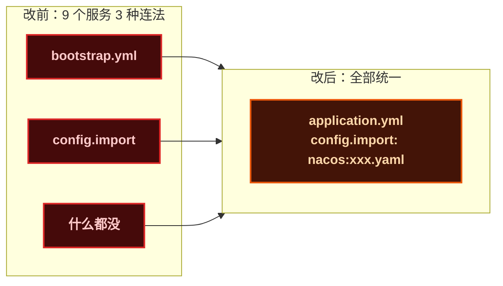
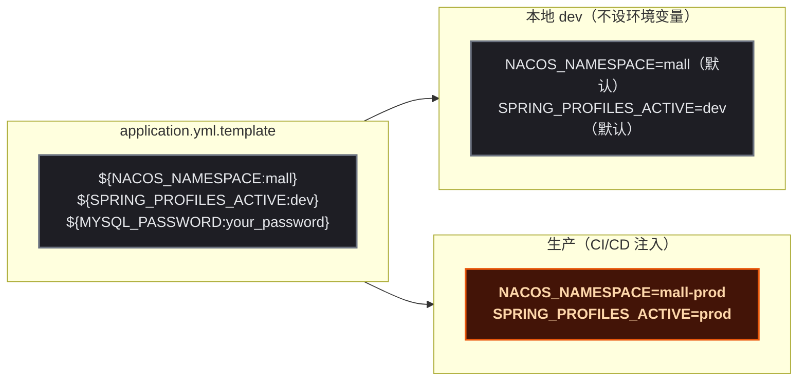
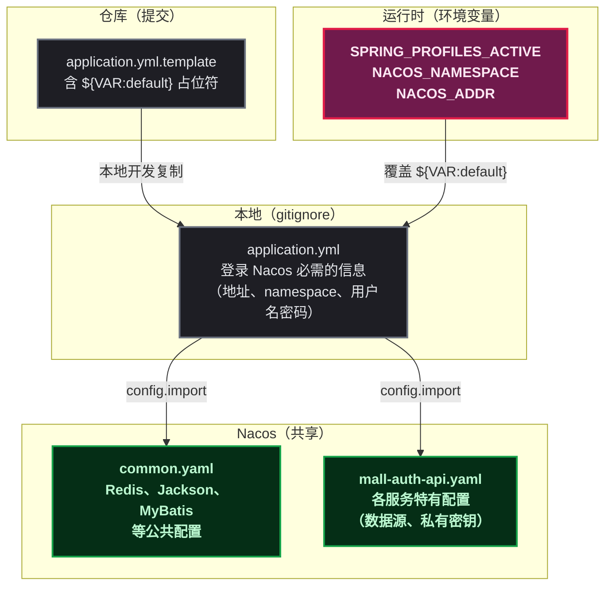

# Nacos 配置管理：一套标准化方案如何搞定 9 个微服务

接手了一套 Spring Cloud Alibaba 微服务项目。读完代码后先看了一遍它的配置管理——毕竟 9 个服务各有各的数据库、Redis、Token 密钥，还不用同一套连接机制，这不配置爆炸谁配置爆炸。

检查结果不出所料：有的服务用 `bootstrap.yml` 连 Nacos，有的用 `config.import`，还有的既没 `bootstrap.yml` 也没 `config.import`，全靠本地 `application.yml` 硬撑着。更离谱的是，9 个服务在 Nacos 上重复配置了 9 遍 Redis、9 遍 JWT 密钥，改一次密码要改 9 个 dataId。

分享一套标准化方案，从 9 个服务的混乱配置中理出了头绪。

## bootstrap.yml 还是 config.import？

Spring Cloud Alibaba 项目连接 Nacos 有两种做法。第一种是传统方案，在 `bootstrap.yml` 中配置 Nacos 参数：

```yaml
# bootstrap.yml — 旧方案
spring:
  cloud:
    nacos:
      config:
        server-addr: ${NACOS_ADDR:localhost:8848}
        namespace: ${NACOS_NAMESPACE:mall}
        file-extension: yaml
```

需要额外引入 `spring-cloud-starter-bootstrap` 依赖才能生效。这是 Spring Cloud 2020 之前的标准做法。

第二种是新方案，直接在 `application.yml` 中通过 `spring.config.import` 指定：

```yaml
# application.yml — 新方案
spring:
  config:
    import: nacos:${spring.application.name}.yaml
```

Spring Cloud 2023.x 已默认关闭 bootstrap 上下文，官方推荐使用 `config.import`。

**选型建议：新项目无脑用 config.import。** 已经在用 bootstrap 的项目如果没必要可以不迁移，但如果像某项目这样**9 个服务里只有一个用 bootstrap**，统一成 config.import 能少维护一套机制。



> ⚠️ 改 config.import 后记得删掉 `spring-cloud-starter-bootstrap` 依赖和 `bootstrap.yml`，否则两套机制同时生效，可能重复加载 Nacos 配置。

## Namespace 隔离环境，而不是 dataId 后缀

很多项目在 dataId 上加环境后缀来区分环境：

```yaml
# 看似合理，实则有坑
mall-auth-api-dev.yaml       # dev 环境
mall-auth-api-prod.yaml      # prod 环境
```

这套方案的问题是：开发环境和生产环境的 dataId 名称不同，意味着配置管理页面要维护两套命名，CI/CD 也要根据环境拼接不同的 dataId。

更简洁的方案是：**dataId 固定不变，用 namespace 隔离环境**。

```yaml
spring:
  cloud:
    nacos:
      config:
        namespace: ${NACOS_NAMESPACE:mall}
  config:
    import: nacos:mall-auth-api.yaml    # ← 永远不变
```

| 环境 | NACOS_NAMESPACE | Namespace 名称 | dataId |
|------|----------------|---------------|--------|
| 本地 dev | 不设（默认 `mall`） | mall | `mall-auth-api.yaml`（不变） |
| 生产 | `mall-prod` | mall-prod | `mall-auth-api.yaml`（不变） |

切换环境只需改一个环境变量，dataId 描述、CI/CD 配置都不用动。Nacos 控制台上两个 namespace 各自维护独立配置，互不干扰。

## 模板标准化：占位符代替死值

配置文件里最忌讳的就是"在仓库里提交带着密码的 application.yml"，以及"模板里全是死值，换环境要手动改十处"。推荐的模板格式是**所有可变值用 `${VAR:default}` 占位符**：

```yaml
# application.yml.template — 提交到仓库
spring:
  profiles:
    active: ${SPRING_PROFILES_ACTIVE:dev}
  cloud:
    nacos:
      config:
        server-addr: ${NACOS_ADDR:your_nacos_host:8848}
        namespace: ${NACOS_NAMESPACE:mall}
  config:
    import: nacos:mall-auth-api.yaml
  datasource:
    url: jdbc:mysql://${DB_HOST:localhost}:${DB_PORT:3306}/mall_auth
    username: ${DB_USER:root}
    password: ${MYSQL_PASSWORD:your_mysql_password}
```

占位符的默认值（`:` 后面的部分）有两个作用：本地开发不设环境变量也能直接跑，同时它也是"说明书"——告诉后来人这个配置项是干什么的。



这样做的收益：

- **本地开发**直接复制 template → `application.yml`，填上密码就能跑。本地 `application.yml` 被 `.gitignore` 排除，不会误提交。
- **CI/CD 部署**通过环境变量注入生产值，不改模板文件。K8s 部署直接在 Deployment 的 `env` 字段里指定。
- **仓库安全**密码不上库，模板里只有占位符。

## 配置描述规范

在 Nacos 控制台创建 dataId 时有一个"配置描述"字段，很多开发者的做法是空着或者随便写几个字。团队协作中，这个字段是定位问题、确认维护方的重要入口。

标准写法：

```
[服务名] [环境] 配置 — [一句话职责说明]。维护人：@[团队名]。

包含：
- [关键配置项 1]
- [关键配置项 2]
```

实际例子：

```
mall-auth 服务 dev 环境配置 — 用户认证授权、RBAC 权限模型、收货地址、鉴权 Starter。维护人：@基础架构团队

包含：
- 认证数据库源 mall_auth
- Redis 缓存（session/token）
- JWT 签名密钥
- 用户角色权限映射
```

规范化的描述让运维同学在排查问题时一眼就能定位到责任人，也方便新成员快速了解每个 dataId 承载的内容。

## 避免 9 个服务配 9 遍公共配置

这是项目中最容易被忽视的问题。9 个微服务各自有一个 dataId，里面的 Redis 配置、JWT secret、Jackson 序列化配置几乎完全一样。

常规做法是抽一个公共的 `common.yaml` 配置，在各自服务的 `spring.cloud.nacos.config.shared-configs` 或 `extension-configs` 中引用：

```yaml
spring:
  cloud:
    nacos:
      config:
        shared-configs:
          - data-id: common.yaml
            group: mall-cloud
            refresh: true
```

这样 Redis 配置只需在 `common.yaml` 中维护一次，9 个服务共享。改密码只需改一个文件，而不是 9 个。如果某个服务的 Redis 配置确实需要不同，在自己的 dataId 中覆盖即可——Nacos 配置合并优先级是：自己 dataId 的配置 > shared-configs > extension-configs。

## 配置文件的四种角色

把一套微服务的配置梳理清楚后，可以归纳为四层角色：



| 层级 | 谁维护 | 内容 |
|------|--------|------|
| 模板（仓库） | 开发者 | 占位符 + 默认值，作为配置契约 |
| 本地（gitignore） | 开发者本地 | Nacos 连接信息 + 个人调试配置 |
| Nacos 配置 | 运维 / 开发 | 全量业务配置，按 namespace 隔离环境 |
| 环境变量 | CI/CD / K8s | 注入敏感值和环境标识 |

四层明确的职责划分避免了"配置到底该放哪里"的模糊地带——每层只做自己该做的事，不越界。

## 总结

从 9 个微服务配置管理的混乱中梳理出这套标准化方案，核心原则其实只有三条：

1. **用 namespace 隔离环境，不改 dataId 名称**
2. **模板里全部占位符化，不留死值**
3. **公共配置抽到 shared-configs，不重复维护**

这套方案不光让项目本身的配置管理变得清晰——每加一个微服务，只需要在模板里复制一份、在 Nacos 上建一个 dataId，不用操心 Redis 配没配、JWT 密钥哪里填。更本质的是，它让团队对"配置到底在哪里"这件事有了共识：代码仓库里只有模板，真配置在 Nacos，敏感信息靠环境变量注入。
