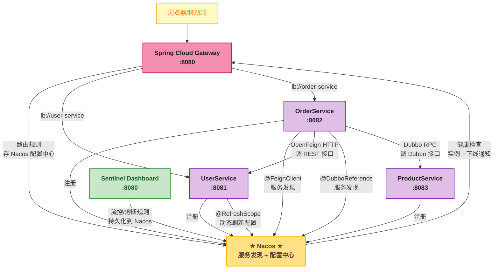

# 集群与生产部署——中间件整合总览

> 📖 <strong>前置阅读</strong>：本文假设读者已掌握 Nacos 的服务发现和配置中心机制。如果还不熟悉，建议先阅读前三篇：[<strong>核心概念</strong>]()、[<strong>服务发现</strong>]()、[<strong>配置中心</strong>]()。

## 一、⚡ 单机 Nacos 挂了——整个微服务体系全部变瞎子

单机 Nacos 开发环境跑得挺好——但生产环境下，Nacos 是<strong>整个微服务体系的命脉</strong>：

```
Nacos 挂了 → 后果：
  ① 新服务无法注册——滚动更新时新实例注册不上
  ② 新调用无法发现——Consumer 拿不到最新实例列表（本地缓存还能撑一会）
  ③ 配置改不了——Sentinel 规则、Gateway 路由、业务开关全改不了
  ④ Dashboard 看不了——不知道哪些服务在线、哪些不在线

虽然本地缓存能兜底——但这是"缓兵之计"不是"长久之计"
Nacos 集群是必须的——而且要做高可用
```

## 二、🏗️ Nacos 集群架构——三个节点 + MySQL

### 2.1 为什么需要 MySQL？

Nacos 内嵌了一个 Derby 数据库（单机默认）。集群模式下 <strong>必须用外部 MySQL</strong>——所有节点共享同一个数据源：

```
Nacos 集群架构：

   ┌──────────┐    ┌──────────┐    ┌──────────┐
   │  Nacos 1 │    │  Nacos 2 │    │  Nacos 3 │    ← Nacos 节点（无状态）
   │  :8848   │    │  :8848   │    │  :8848   │
   └────┬─────┘    └────┬─────┘    └────┬─────┘
        │               │               │
        └───────────────┼───────────────┘
                        │
                 ┌──────▼──────┐
                 │   MySQL     │    ← 共享数据库——存注册信息和配置
                 │  (主从/集群) │
                 └─────────────┘

Nacos 节点之间用 Raft 协议选举 Leader
  → Leader 负责写 MySQL
  → Follower 从 MySQL 读数据并同步到内存
  → 任何节点收到客户端请求——都能处理读请求
```

### 2.2 配置 MySQL

```sql
-- 初始化 Nacos 数据库
-- 执行 Nacos 安装包中 conf/mysql-schema.sql
-- 创建数据库
CREATE DATABASE IF NOT EXISTS nacos_config DEFAULT CHARACTER SET utf8mb4;

-- 配置 Nacos 数据源
```

```properties
# nacos/conf/application.properties
# ① MySQL 配置
spring.datasource.platform=mysql
db.num=1
db.url.0=jdbc:mysql://mysql-cluster:3306/nacos_config?useSSL=false&allowPublicKeyRetrieval=true
db.user.0=nacos
db.password.0=nacos_password_123

# ② 切换为集群模式
nacos.core.auth.enabled=true
```

### 2.3 集群节点配置

```properties
# nacos/conf/cluster.conf——每个节点一行 IP:Port
# 注意：端口是 Raft 通信端口——默认 7848（不是 8848！）
10.0.1.11:7848
10.0.1.12:7848
10.0.1.13:7848
```

## 三、🐳 Docker Compose——一键启动 Nacos 集群

```yaml
version: '3.8'
services:

  # ===== MySQL——Nacos 共享存储 =====
  mysql:
    image: mysql:8.0
    container_name: nacos-mysql
    environment:
      MYSQL_ROOT_PASSWORD: root123
      MYSQL_DATABASE: nacos_config
      MYSQL_USER: nacos
      MYSQL_PASSWORD: nacos_password_123
    ports:
      - "3306:3306"
    volumes:
      - mysql-data:/var/lib/mysql
      - ./mysql-schema.sql:/docker-entrypoint-initdb.d/01-schema.sql
    healthcheck:
      test: ["CMD", "mysqladmin", "ping", "-h", "localhost"]
      interval: 10s
      retries: 5

  # ===== Nacos 集群——3 节点 =====
  nacos1:
    image: nacos/nacos-server:v2.3.0
    container_name: nacos1
    depends_on:
      mysql:
        condition: service_healthy
    environment:
      - MODE=cluster
      - NACOS_SERVERS=nacos1:7848,nacos2:7848,nacos3:7848
      - SPRING_DATASOURCE_PLATFORM=mysql
      - MYSQL_SERVICE_HOST=mysql
      - MYSQL_SERVICE_PORT=3306
      - MYSQL_SERVICE_DB_NAME=nacos_config
      - MYSQL_SERVICE_USER=nacos
      - MYSQL_SERVICE_PASSWORD=nacos_password_123
      - NACOS_AUTH_ENABLE=true
      - NACOS_AUTH_IDENTITY_KEY=nacos
      - NACOS_AUTH_IDENTITY_VALUE=nacos
      - NACOS_AUTH_TOKEN=SecretKey012345678901234567890123456789012345678901234567890123456789
    ports:
      - "8848:8848"
      - "7848:7848"
    volumes:
      - nacos1-logs:/home/nacos/logs

  nacos2:
    image: nacos/nacos-server:v2.3.0
    container_name: nacos2
    depends_on:
      mysql:
        condition: service_healthy
    environment:
      - MODE=cluster
      - NACOS_SERVERS=nacos1:7848,nacos2:7848,nacos3:7848
      - SPRING_DATASOURCE_PLATFORM=mysql
      - MYSQL_SERVICE_HOST=mysql
      - MYSQL_SERVICE_PORT=3306
      - MYSQL_SERVICE_DB_NAME=nacos_config
      - MYSQL_SERVICE_USER=nacos
      - MYSQL_SERVICE_PASSWORD=nacos_password_123
      - NACOS_AUTH_ENABLE=true
      - NACOS_AUTH_IDENTITY_KEY=nacos
      - NACOS_AUTH_IDENTITY_VALUE=nacos
      - NACOS_AUTH_TOKEN=SecretKey012345678901234567890123456789012345678901234567890123456789
    ports:
      - "8849:8848"
      - "7849:7848"

  nacos3:
    image: nacos/nacos-server:v2.3.0
    container_name: nacos3
    depends_on:
      mysql:
        condition: service_healthy
    environment:
      - MODE=cluster
      - NACOS_SERVERS=nacos1:7848,nacos2:7848,nacos3:7848
      - SPRING_DATASOURCE_PLATFORM=mysql
      - MYSQL_SERVICE_HOST=mysql
      - MYSQL_SERVICE_PORT=3306
      - MYSQL_SERVICE_DB_NAME=nacos_config
      - MYSQL_SERVICE_USER=nacos
      - MYSQL_SERVICE_PASSWORD=nacos_password_123
      - NACOS_AUTH_ENABLE=true
    ports:
      - "8850:8848"
      - "7850:7848"

  # ===== Prometheus——采集 Nacos 指标 =====
  prometheus:
    image: prom/prometheus:v2.48.0
    ports:
      - "9090:9090"
    volumes:
      - ./prometheus.yml:/etc/prometheus/prometheus.yml

volumes:
  mysql-data:
  nacos1-logs:
```

### prometheus.yml

```yaml
global:
  scrape_interval: 15s

scrape_configs:
  - job_name: 'nacos'
    metrics_path: '/nacos/actuator/prometheus'
    static_configs:
      - targets:
        - 'nacos1:8848'
        - 'nacos2:8848'
        - 'nacos3:8848'
```

## 四、📊 Nacos 监控——Prometheus + Grafana

Nacos 内置了 Prometheus 指标暴露——访问 `http://nacos:8848/nacos/actuator/prometheus` 即可获取。

<strong>Nacos 关键监控指标</strong>：

| 指标 | 含义 | 告警阈值 |
|------|------|:---:|
| `nacos_monitor_healthCheck` | 健康检查耗时 | > 1000ms |
| `nacos_monitor_serviceCount` | 服务总数 | — |
| `nacos_monitor_instanceCount` | 实例总数 | — |
| `nacos_monitor_cpu` | Nacos 节点 CPU | > 80% |
| `nacos_monitor_memory` | Nacos 节点内存 | > 80% |
| `nacos_monitor_avgPushCost` | 平均推送耗时 | > 500ms |

Grafana 中导入 Nacos 仪表盘（ID: 13221）即可看到完整面板。

## 五、🔧 Nacos JVM 调优

```bash
# Nacos 默认 JVM 参数——堆 512m~2g（生产建议上调）
JAVA_OPT="${JAVA_OPT} -server -Xms2g -Xmx2g -Xmn1g"
JAVA_OPT="${JAVA_OPT} -XX:+UseG1GC -XX:G1HeapRegionSize=16m"
JAVA_OPT="${JAVA_OPT} -XX:+PrintGCDetails -XX:+PrintGCTimeStamps"

# 如果 Nacos 实例数 > 1000——堆得再加大
# Nacos 2.x 把所有实例信息存在内存中——服务越多堆越大
# 粗略估算：1000 个服务 × 5 个实例 ≈ 5000 个实例 ∈ 内存——2G 堆够用
```

## 六、🔗 中间件大串联——一张图看全貌

这是整个微服务系列最核心的一张图——所有中间件通过 Nacos 串联在一起：



<strong>这张图中每个中间件的角色</strong>：

| 中间件 | 在架构中的角色 | 和 Nacos 的关系 |
|------|------|------|
| <strong>Nacos</strong> | 注册中心 + 配置中心——整个体系的"电话本 + 公告栏" | — |
| <strong>Spring Cloud Gateway</strong> | 统一入口——鉴权/限流/路由 | 从 Nacos 发现服务（lb://）+ 路由规则存 Nacos |
| <strong>OpenFeign</strong> | 声明式 HTTP 调用 | 从 Nacos 发现服务——调用 UserService |
| <strong>Dubbo</strong> | 高性能 RPC | 从 Nacos 发现服务——调用 ProductService |
| <strong>Sentinel</strong> | 限流熔断系统保护 | 规则持久化到 Nacos——重启不丢失 |
| <strong>gRPC</strong> | 跨语言 RPC | 手动注册到 Nacos——或通过 Spring Cloud 适配 |

## 七、📋 每个中间件的 Nacos 接入配置——速查表

### Dubbo → Nacos

```yaml
dubbo:
  registry:
    address: nacos://nacos-cluster:8848
    parameters:
      namespace: production
      group: DUBBO_GROUP
```

### OpenFeign → Nacos

```java
@FeignClient(name = "user-service")  // 名字自动从 Nacos 查找
public interface UserClient { ... }
```

### Gateway → Nacos

```yaml
spring.cloud.gateway.discovery.locator.enabled: true
spring.cloud.gateway.routes[0].uri: lb://user-service
```

### Sentinel → Nacos

```yaml
spring.cloud.sentinel.datasource.flow-rules.nacos:
  server-addr: nacos-cluster:8848
  data-id: ${spring.application.name}-flow-rules
  group-id: SENTINEL_GROUP
  rule-type: flow
```

### gRPC → Nacos

```java
// 需要手动注册和发现——见 NacosServiceDiscovery.md 第八章
// 或者用 grpc-spring-boot-starter 配合 Spring Cloud 自动注册
```

### Nacos Config → 所有服务

```yaml
spring.cloud.nacos.config:
  server-addr: nacos-cluster:8848
  namespace: production
  shared-configs:
    - data-id: common-mysql.yaml
      group: COMMON_GROUP
```

## 八、🧪 故障演练——Nacos 挂了一个节点怎么办？

| 故障场景 | 现象 | 恢复方式 |
|------|------|------|
| <strong>1 个 Nacos 节点挂了</strong> | 不影响——集群自动 Failover | 重启挂掉的节点——自动重新加入集群 |
| <strong>2 个 Nacos 节点挂了</strong> | 集群不可用——Raft 无法达成共识 | 至少恢复 1 个——集群重新选举 Leader |
| <strong>MySQL 挂了</strong> | 现有数据能读——新注册/新配置无法写 | <strong>立刻恢复 MySQL</strong>——Nacos 节点从 MySQL 恢复 |
| <strong>整个 Nacos 集群挂了</strong> | 服务调用不受影响——本地缓存兜底 | 恢复 Nacos 集群——服务列表从 MySQL 重建——推送更新 |
| <strong>网络分区</strong> | 少数节点的分区不可用——无法和 Leader 通信 | 网络恢复后自动同步 |

<strong>关键事实</strong>：Nacos 集群全挂了——服务间调用不受影响（本地缓存 + 直连）。受影响的是服务上下线感知和配置变更。

## 九、📋 生产上线 12 项 Checklist

| # | 检查项 | 配置/验证 |
|:--:|------|------|
| 1 | <strong>生产用集群模式——不用 standalone</strong> | `MODE=cluster`——至少 3 个节点 |
| 2 | <strong>MySQL 做主从或集群</strong> | Nacos 的数据都在 MySQL——MySQL 挂了一切写操作停 |
| 3 | <strong>Nacos 节点至少 3 个</strong> | Raft 协议要求多数派——奇数（3/5/7） |
| 4 | <strong>Namespace 隔离环境</strong> | 生产/测试/开发用不同 Namespace——绝不能混 |
| 5 | <strong>Nacos 鉴权开启</strong> | `NACOS_AUTH_ENABLE=true`——默认 nacos/nacos 必须改 |
| 6 | <strong>所有中间件统一 Nacos 地址</strong> | Dubbo/Gateway/Sentinel 都连同一个 Nacos 集群 |
| 7 | <strong>Sentinel 规则持久化到 Nacos</strong> | `datasource.flow-rules.nacos`——重启不丢 |
| 8 | <strong>Gateway 路由存 Nacos</strong> | `gateway-routes.yaml`——动态路由不用重启 Gateway |
| 9 | <strong>@RefreshScope 只用于可热更新的配置</strong> | 开关、阈值——连接池大小和端口不要 RefreshScope |
| 10 | <strong>本地缓存开启</strong> | `naming-load-cache-at-start: true`——Nacos 挂了服务还能调 |
| 11 | <strong>Nacos 监控接入 Prometheus</strong> | `nacos/actuator/prometheus`——CPU/内存/QPS |
| 12 | <strong>Nacos 版本升级前先压测</strong> | 1.x → 2.x gRPC 协议变化——Client 和 Server 版本要一致 |

## 🎯 总结——微服务中间件版图

从第一篇 Spring Cloud Alibaba 总览开始——到这篇 Nacos 集群部署——微服务中间件系列的整体版图就完整了：

```
                             ┌──────────────┐
                             │   Gateway    │  ← 统一入口——鉴权/限流/路由
                             └──────┬───────┘
                                    │
                    ┌───────────────┼───────────────┐
                    │               │               │
              ┌─────▼─────┐ ┌──────▼──────┐ ┌─────▼─────┐
              │  OpenFeign │ │    Dubbo    │ │    gRPC   │  ← 三种 RPC 通信方式
              │ (HTTP)     │ │ (TCP+二进制)│ │(HTTP/2    │
              │ 拆分起步   │ │ 高性能内部  │ │  ProtoBuf) │
              └─────┬─────┘ └──────┬──────┘ └─────┬─────┘
                    │               │               │
                    └───────────────┼───────────────┘
                                    │
                          ┌─────────▼─────────┐
                          │      Nacos        │  ← 注册中心 + 配置中心（命脉）
                          │  服务发现 配置中心  │
                          └─────────┬─────────┘
                                    │
                          ┌─────────▼─────────┐
                          │     Sentinel      │  ← 限流 熔断 系统保护
                          │  规则持久化 Nacos  │
                          └───────────────────┘
```

<strong>每个中间件的交互都经过 Nacos</strong>：服务注册到 Nacos → Consumer 从 Nacos 发现 → 直连调用。配置在 Nacos 中统一管理 → 动态刷新。Sentinel 规则存 Nacos → 重启不丢。Gateway 路由存 Nacos → 动态生效。

<strong>Nacos 不是众多中间件中的一个——它是把其他中间件串在一起的"骨架"。</strong>

---

> 📖 <strong>系列回顾</strong>：Nacos 系列到此结束——
> 1. [<strong>核心概念与快速上手</strong>]() —— 服务发现 + 配置中心、AP/CP 切换、命名空间/分组
> 2. [<strong>服务发现深度解析</strong>]() —— 心跳/剔除/保护阈值/本地缓存、Dubbo/Feign/gRPC 接入
> 3. [<strong>配置中心全操作</strong>]() —— 三层配置隔离、@RefreshScope、Gateway 路由/Sentinel 规则持久化
> 4. [<strong>集群与生产部署</strong>]() —— 三节点+MySQL、Docker Compose、Prometheus 监控、中间件整合全景图
