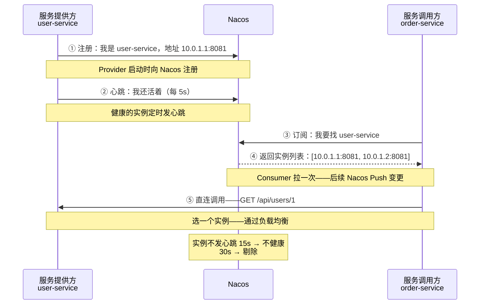

# Nacos 服务发现深度解析

> 📖 <strong>前置阅读</strong>：本文假设读者已掌握 Nacos 的核心概念——命名空间/分组/服务/实例。如果还不熟悉，建议先阅读 [<strong>Nacos 核心概念与快速上手</strong>]()。

## 一、⚡ 服务注册上去了——但为什么偶尔调不通？

Nacos Dashboard 里看到服务是"健康"的——但 Feign 偶尔报 `Connection Refused`。排查后发现：<strong>那个实例 5 分钟前就挂了——Nacos 还没把它剔掉。</strong>

服务发现不是"注册上去了就完了"——你要理解它背后的机制：心跳怎么维护？挂了的实例多久被剔除？本地缓存的作用是什么？

## 二、🔄 服务注册流程全景



<strong>关键点——Nacos 不参与业务流量</strong>：服务注册/发现只在"找地址"阶段经过 Nacos。一旦 Consumer 拿到了实例列表——后续的 RPC 调用是直连 Provider——不经过 Nacos。

```
❌ 错误理解：Consumer → Nacos → Provider（Nacos 是代理）
✅ 正确理解：Consumer 问 Nacos 地址 → Consumer 直连 Provider（Nacos 只给地址）
```

## 三、💓 心跳与健康检查——Nacos 怎么知道服务挂了？

### 3.1 临时实例（AP）——客户端主动上报心跳

```yaml
spring:
  cloud:
    nacos:
      discovery:
        ephemeral: true      # ← 临时实例（默认）——Spring Cloud 服务都用临时实例
        # Nacos 1.x 用 HTTP 心跳，Nacos 2.x 用 gRPC 长连接维护心跳
        # 不需要显式配置心跳——Client 连接到 Nacos 后自动维护
```

```
临时实例的健康检查（Nacos 2.x——gRPC 长连接模式）：
  ① 服务启动 → 向 Nacos 建立 gRPC 长连接
  ② Nacos 通过连接状态判断实例存活——连接断开 = 实例下线
  ③ 连接断开后：
     → 15s 内：标记为"不健康"
     → 30s 后：从服务列表中剔除

临时实例的生命周期：
  上线 → 注册到 Nacos → 维持长连接 → 连接断开 → 30s 后剔除
  适合：Spring Cloud 微服务——实例频繁上下线（滚动更新、弹性伸缩）
```

### 3.2 持久实例（CP）——Nacos 主动探测

```yaml
spring:
  cloud:
    nacos:
      discovery:
        ephemeral: false      # ← 持久实例——Nacos 主动健康检查
        # 需要在 Nacos 侧配置健康检查方式——HTTP / TCP / MySQL
```

```
持久实例的健康检查：
  ① 服务注册时——声明健康检查类型（HTTP / TCP / MySQL）
  ② 服务下线时——不会自动剔除——标记为"下线"但保留在列表
  ③ Nacos 周期性主动健康检查：
     → 调 /health 端点看是否返回 200
     → 连续失败 N 次 → 标记为"不健康"

持久实例的生命周期：
  上线 → 注册 → Nacos 定期检查 → 不健康 → 保留在列表但标记 → 人工或自动恢复后标记为健康
  适合：数据库、Redis、Nginx 等运维部署的中间件
```

| 维度 | 临时实例（AP） | 持久实例（CP） |
|------|:---:|:---:|
| <strong>健康检查</strong> | 客户端上报心跳（被动） | Nacos 主动探测（HTTP/TCP） |
| <strong>下线行为</strong> | 自动剔除——30s | 保留在列表——标记为"不健康" |
| <strong>适用</strong> | <strong>微服务（Java）</strong>——弹性伸缩 | 数据库/Redis/Nginx——运维部署 |
| <strong>典型配置</strong> | `ephemeral: true` | `ephemeral: false` |

## 四、🛡️ 保护阈值——防止 Nacos 把健康实例也误剔

### 4.1 问题：网络抖动——所有实例心跳全丢了

```
场景：user-service 有 10 个实例——网络瞬时抖动——所有心跳同时丢了
  Nacos 判断：10 个实例全部不健康 → 全部剔除
  结果：order-service 查不到 user-service → 调不通

实际上 user-service 全活着——只是心跳丢了一瞬间
这比不剔除还糟糕——全剔了等于全挂了
```

### 4.2 保护阈值——解决"全剔除"

```yaml
# Nacos Dashboard → 服务详情 → 保护阈值（默认 0）
# 设为 0.8（80%）——意思是：
#   如果健康实例比例 < 80%——Nacos 不再剔除不健康实例
#   保留它们在服务列表中——让 Consumer 继续尝试
```

```
保护阈值 = 0.8 时的行为：
  总实例 10 个——都健康 → 正常
  网络抖动——3 个心跳丢失 → 健康率 = 70%（< 80%）
  → Nacos 触发保护——不再剔除那 3 个"不健康"实例
  → 保留所有 10 个实例在列表中——Consumer 可能调到不健康的
  → 但至少有人能调到健康的——比全不可用强
```

> ⚠️ 新手提示：保护阈值不是越大越好——设 1.0 等于永远不剔除——挂了也不剔除。一般设 <strong>0.6~0.8</strong>。

## 五、💾 本地缓存——Nacos 挂了服务还能调

Nacos Client 会在本地缓存一份服务列表。<strong>即使 Nacos Server 全挂了——Consumer 依然能用本地缓存调 Provider</strong>：

```java
// Nacos Client 的本地缓存机制
// C:\Users\xxx\nacos\naming\public\user-service
// 里面缓存了 user-service 的所有实例信息

// 当 Nacos 不可用时——调用链：
Consumer → 先查本地缓存 → 命中 → 用缓存中的实例列表 → 继续调 Provider
        → 本地缓存过期 → 调不通 → 服务不可用
```

```yaml
# 本地缓存相关配置（一般不改——默认就很好）
spring:
  cloud:
    nacos:
      discovery:
        naming-load-cache-at-start: true   # 启动时加载本地缓存
        watch:
          enabled: true                    # 监听 Nacos 推送——有变更立刻更新缓存
```

这就是为什么 Nacos 挂了不会立刻导致雪崩——本地缓存给了你 24 小时以上的容错窗口。

## 六、🔗 串联：Dubbo 用 Nacos 做注册中心

前面写了 Dubbo 有专门的 Service Discovery 篇——这里直接把 Dubbo 接到 Nacos 上：

```xml
<dependency>
    <groupId>org.apache.dubbo</groupId>
    <artifactId>dubbo-spring-boot-starter</artifactId>
</dependency>
<dependency>
    <groupId>com.alibaba.nacos</groupId>
    <artifactId>nacos-client</artifactId>
</dependency>
```

```yaml
# Dubbo 使用 Nacos 注册中心
dubbo:
  application:
    name: user-service
  registry:
    address: nacos://localhost:8848       # ← nacos:// 协议——一行接入
    parameters:
      namespace: production               # Nacos 命名空间
      group: DUBBO_GROUP                  # Dubbo 服务放一个分组
  protocol:
    name: dubbo
    port: 20880

# 还支持多注册中心——Nacos + Zookeeper 同时用（迁移时）
# dubbo:
#   registry:
#     address: nacos://nacos1:8848,zookeeper://zk1:2181
```

```java
// Dubbo 的 @DubboService 自动注册到 Nacos
@DubboService  // 注册到 Nacos——服务名：com.example.UserService
public class UserServiceImpl implements UserService { ... }

// Dubbo 的 @DubboReference 自动从 Nacos 发现
@DubboReference
private UserService userService;  // 从 Nacos 拿到实例列表——直连调用
```

<strong>Dubbo 在 Nacos 中的服务名</strong>：打开 Nacos Dashboard → 服务列表——看到的不是 `user-service`，而是 `com.example.UserService`（接口全限定名）。Dubbo 以接口为粒度注册——和 Spring Cloud 以服务为粒度不同。

## 七、🔗 串联：OpenFeign 用 Nacos 做服务发现

```yaml
spring:
  cloud:
    nacos:
      discovery:
        server-addr: localhost:8848
```

```java
// Feign 接口——name 就是 Nacos 中的服务名
@FeignClient(name = "user-service")  // ← 从 Nacos 查到 user-service 的实例
public interface UserClient {

    @GetMapping("/api/users/{userId}")
    User getUser(@PathVariable("userId") Long userId);
}

// LoadBalancer 从 Nacos 拿到实例列表——轮询选一个——发给它
// 不需要写 URL——不需要知道 IP:Port
```

Feign 通过 LoadBalancer 集成 Nacos——整个过程对开发者透明。

## 八、🔗 串联：gRPC 用 Nacos 做服务发现

gRPC 不像 Dubbo/Feign 那样 Spring Cloud 原生支持 Nacos——需要手动注册：

```java
// gRPC Server——注册到 Nacos
@Component
public class GrpcNacosRegistrar implements ApplicationListener<ApplicationReadyEvent> {

    @Autowired
    private NacosServiceRegistry nacosServiceRegistry;

    @Override
    public void onApplicationEvent(ApplicationReadyEvent event) {
        // 把 gRPC 端口注册到 Nacos——标记为 gRPC 协议
        NacosRegistration registration = NacosRegistration.builder()
                .serviceId("user-service")
                .address("10.0.1.1")
                .port(9090)              // gRPC 端口
                .metadata(Map.of("protocol", "grpc"))  // 标记协议——方便识别
                .build();
        nacosServiceRegistry.register(registration);
    }
}
```

```java
// gRPC Client——从 Nacos 发现 gRPC 服务
@Component
public class GrpcNacosNameResolver extends NameResolver {

    @Autowired
    private NacosServiceDiscovery nacosServiceDiscovery;

    @Override
    public void start(Listener2 listener) {
        // 从 Nacos 拿到 user-service 的所有 gRPC 实例
        List<ServiceInstance> instances = nacosServiceDiscovery
                .getInstances("user-service");

        List<EquivalentAddressGroup> addresses = instances.stream()
                .filter(i -> "grpc".equals(i.getMetadata().get("protocol"))) // 过滤 gRPC 协议
                .map(i -> new EquivalentAddressGroup(
                        new InetSocketAddress(i.getHost(), i.getPort())))
                .toList();

        listener.onAddresses(addresses, Attributes.EMPTY);
    }
}
```

## 九、⚖️ Nacos vs Eureka vs Zookeeper vs Consul

| 维度 | Nacos | Eureka | Zookeeper | Consul |
|------|:---:|:---:|:---:|:---:|
| <strong>CAP</strong> | AP + CP 可切换 | AP | CP | CP（默认） |
| <strong>一致性协议</strong> | Raft-Distro 混合 | Peer to Peer（异步复制） | ZAB | Raft |
| <strong>健康检查</strong> | Client 心跳 + Server 主动探测 | Client 心跳 | 连接保持（Session） | Client 心跳 + Server 探测 |
| <strong>配置中心</strong> | ✅ 内置 | ❌——需要 Spring Cloud Config | ❌——Watcher 机制可以但原始 | ✅ 内置 |
| <strong>动态配置刷新</strong> | ✅ 原生支持 | ❌ | ❌——可以但麻烦 | ✅ |
| <strong>管理界面</strong> | ✅ Dashboard 丰富 | ✅ Dashboard 简陋 | ❌——需要第三方 | ✅ Dashboard |
| <strong>Spring Cloud 集成</strong> | ✅ Alibaba 原生 | ✅ Netflix 原生 | ✅ | ✅ |
| <strong>适用场景</strong> | <strong>国内 Java 微服务——首选</strong> | 已过时——不推荐新项目 | Dubbo 历史项目 | 多语言环境——非 Java |

## 🎯 总结

1. <strong>Nacos 不参与业务流量——只负责给地址</strong>：Consumer 问 Nacos 服务在哪里——拿到地址后直连 Provider。Nacos 挂了不影响已有的调用——本地缓存兜底。

2. <strong>临时实例用心跳——持久实例用主动探测</strong>：Spring Cloud 微服务是临时实例（AP）——连接断开后 30s 剔除。数据库/Redis 用持久实例（CP）——下线后保留在列表，Nacos 主动健康检查。

3. <strong>保护阈值防止误剔除</strong>：健康率 < 阈值时不剔除——宁可调不到几台，不能全不可用。设 0.6~0.8 合适。

4. <strong>Dubbo/Feign/gRPC 都能接入 Nacos</strong>：Dubbo 和 Feign 原生支持——一行配置。gRPC 需要手动注册——但原理相同。

> 📖 <strong>下一步阅读</strong>：服务发现搞定了——配置中心才是 Nacos 的另一半：怎么组织配置？多服务共享配置怎么配？怎么灰度发布配置？继续阅读 [<strong>Nacos 配置中心全操作</strong>]()。
