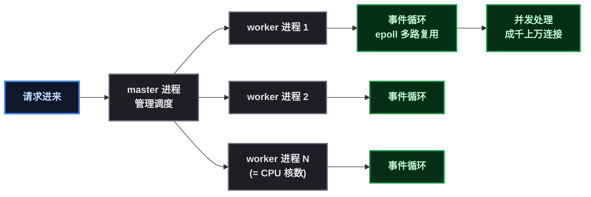

# nginx 不再是"服务器"了，它是你家微服务的门卫

## 第 1 步：目标——搞懂 nginx 在微服务里到底干嘛

先说个某开发者的真实转变。以前写单体应用，nginx 的活就是：把静态资源甩给浏览器，把动态请求转发给 Tomcat。配置嘛，抄一份改改就能跑。

后来上了微服务，Spring Cloud Gateway 成了统一入口，nginx 的位置就尴尬了——**它既不用管静态资源，也不直接碰业务**，但它卡在所有流量的最前面。

```
浏览器
  ↓
nginx      ← 我们这篇的主角：流量大门
  ↓
Spring Cloud Gateway   ← 路由/鉴权/限流
  ↓
微服务 A   微服务 B   微服务 C
```

nginx 在这条链路上的职责变成了：

| 职责 | 说明 |
|------|------|
| TLS 终结 | HTTPS 证书在 nginx 上解掉，网关不用管证书 |
| 流量分发 | 把请求转发给 gateway（可能不止一个实例） |
| 连接管理 | 复用客户端连接，减少网关压力 |
| 基础防护 | 隐藏版本号、限流、挡扫描器 |
| 日志入口 | 记录所有进站请求（网关日志不覆盖 nginx 这一层） |

> 📌 关键认知：**nginx 挂 = 整个系统挂**。它前面没有别的挡箭牌，所以 nginx 的配置质量直接决定入口的稳定性。这也是为什么值得花一篇的篇幅讲清楚。

这篇的目标很实在：**让你（或让 AI 代你）改 nginx 配置时，知道哪些是命门、哪些是锦上添花，别把入口配成瓶颈。**

## 第 2 步：前置条件——先弄懂 nginx 的"体力"从哪来

动手配之前，必须理解 nginx 的工作模型。它跟 Tomcat 那种"一连接一线程"完全不同：



几个必须记住的数字关系：

```
worker 进程数      = CPU 核数（worker_processes auto）
单 worker 并发上限  = worker_connections
nginx 最大并发连接  ≈ worker_processes × worker_connections
```

> ⚠️ 新手提示：**最大并发不是"能撑住"而是"能排队"**。超过上限的请求会直接 502/拒绝，所以这个数要留余量，但也别无脑调大——后面有个隐藏坑（文件描述符上限）会教做人。

## 第 3 步：关键配置——微服务场景必配清单

以下配置按"重要性"排序，前三项是命门，后几项是优化和安全。

### 3.1 worker 配置（命门一）

```nginx
worker_processes  auto;              # 自动 = CPU 核数，别手动写死
events {
    worker_connections  2048;        # 单 worker 并发连接数
    use epoll;                       # Linux 默认就是 epoll，可写可不写
}
```

**注意**： `worker_connections` 调大后，容器/系统要同步放开文件描述符上限，否则日志会警告：

```bash
# 日志里出现这个警告 = 配置超了系统限制
# [warn] 2048 worker_connections exceed open file resource limit: 1024

# 容器运行时加参数
docker run ... --ulimit nofile=65536:65536 ...
# 或宿主机
ulimit -n 65536
```

> ⚠️ 这就是某开发者踩过的坑：把 worker_connections 从 1024 调到 2048，重启后 nginx 日志一直在 warn，查了半天才发现是容器内 `ulimit -n` 还是 1024。**配置和系统限制要一起调**。

### 3.2 代理到 gateway（命门二）

微服务场景 nginx 的 `location` 基本都是反向代理，这是核心配置：

```nginx
upstream gateway_cluster {
    server 10.0.0.11:8080 weight=5;   # gateway 实例 1
    server 10.0.0.12:8080 weight=5;   # gateway 实例 2
    keepalive 32;                      # 到 gateway 的复用连接数（重要！）
}

server {
    listen 443 ssl;
    server_name api.example.com;

    location / {
        proxy_pass http://gateway_cluster;

        # 传递客户端真实信息给 gateway（必须配！）
        proxy_set_header Host $host;
        proxy_set_header X-Real-IP $remote_addr;
        proxy_set_header X-Forwarded-For $proxy_add_x_forwarded_for;
        proxy_set_header X-Forwarded-Proto $scheme;

        # 超时配置（按业务调整）
        proxy_connect_timeout 5s;
        proxy_read_timeout   60s;     # gateway 处理慢请求时别急着断
        proxy_send_timeout   60s;
    }
}
```

**proxy_set_header 为什么必须配**：Spring Cloud Gateway 拿到 `X-Forwarded-For` 才能做真实的 IP 限流和审计；拿到 `X-Forwarded-Proto` 才知道客户端是 http 还是 https（否则重定向会错）。不配这几行，网关层的很多能力直接失效。

**keepalive 32 为什么重要**：nginx 到 gateway 每次请求都新建 TCP 连接的话，高并发下握手开销巨大。配了 keepalive，连接复用，gateway 压力直线下降。

### 3.3 超时配置（命门三）

微服务链路长，一个请求可能经过 gateway → 服务 A → 服务 B，超时设置错了会引发连锁问题：

```nginx
# 上游超时
proxy_connect_timeout 5s;    # 连接 gateway 超时（短一点，快速失败）
proxy_read_timeout   60s;    # 等待 gateway 响应超时（要覆盖慢业务）
proxy_send_timeout   60s;    # 发送请求体超时

# 客户端超时
client_body_timeout  30s;
client_header_timeout 30s;
```

> ⚠️ **超时错位是微服务常见事故**：nginx 的 `proxy_read_timeout` 设成 30s，但 gateway 到服务的超时是 60s——结果 gateway 还在等服务 B 返回，nginx 先断了连接，客户端收到 504，日志里两边各说各话。**原则：nginx 超时 > 网关超时 > 服务超时**。

### 3.4 gzip 压缩（优化）

```nginx
gzip on;
gzip_comp_level 5;                     # 1-9，5 是性价比点
gzip_min_length 1024;                  # 小于 1KB 不压缩（压缩了反而大）
gzip_types text/plain text/css application/javascript application/json image/svg+xml;
```

某开发者实测：一篇 58KB 的页面，gzip 后 15KB，**省 73% 流量**。对带宽紧张的服务器是实打实的收益。

### 3.5 安全基础（防扫描）

```nginx
server_tokens off;                     # 隐藏 nginx 版本号
add_header X-Content-Type-Options nosniff always;
add_header X-Frame-Options SAMEORIGIN always;
```

**为什么隐藏版本号**：全网扫描器会先探测 `Server: nginx/1.24.0` ，然后针对性打已知漏洞。关了版本号，扫描器少一个下手点。

### 3.6 限流（防打爆 gateway）

```nginx
# 定义限流区：每 IP 每秒 5 个请求，突发 10
limit_req_zone $binary_remote_addr zone=api_limit:10m rate=5r/s;

server {
    location /api/ {
        limit_req zone=api_limit burst=10 nodelay;
        proxy_pass http://gateway_cluster;
    }
}
```

> 📌 这是 nginx 层的第一道防线，gateway 里还有更细的业务限流（Sentinel/Resilience4j）。**nginx 管粗粒度（别打爆入口），gateway 管细粒度（按业务限）**，两层各司其职。

### 3.7 日志（排障的命根子）

```nginx
log_format  main  '$remote_addr - $remote_user [$time_local] "$request" '
                  '$status $body_bytes_sent "$http_referer" '
                  '"$http_user_agent" "$http_x_forwarded_for"';

access_log  /var/log/nginx/access.log  main;
error_log   /var/log/nginx/error.log   warn;
```

**容器部署一定要把日志挂载出来**——nginx 官方镜像默认把日志软链到 stdout/stderr，容器一删日志就没了：

```bash
# 挂载日志目录（容器部署）
-v /var/www/nginx/logs:/var/log/nginx
```

## 第 4 步：完整示例——一套能上线的微服务 nginx 配置

把上面所有要点拼成一个完整配置（以容器挂载方式组织）：

```nginx
# /etc/nginx/nginx.conf
user  nginx;
worker_processes  auto;

error_log  /var/log/nginx/error.log warn;
pid        /run/nginx.pid;

events {
    worker_connections  2048;
}

http {
    include       /etc/nginx/mime.types;
    default_type  application/octet-stream;

    server_tokens off;

    log_format  main  '$remote_addr - $remote_user [$time_local] "$request" '
                      '$status $body_bytes_sent "$http_referer" '
                      '"$http_user_agent" "$http_x_forwarded_for"';
    access_log  /var/log/nginx/access.log  main;

    sendfile        on;
    tcp_nopush      on;
    keepalive_timeout  65;

    gzip on;
    gzip_comp_level 5;
    gzip_min_length 1024;
    gzip_types text/plain text/css application/javascript application/json image/svg+xml;

    add_header X-Content-Type-Options nosniff always;
    add_header X-Frame-Options SAMEORIGIN always;

    include /etc/nginx/conf.d/*.conf;
}
```

```nginx
# /etc/nginx/conf.d/api.conf
upstream gateway_cluster {
    server 10.0.0.11:8080 weight=5;
    server 10.0.0.12:8080 weight=5;
    keepalive 32;
}

limit_req_zone $binary_remote_addr zone=api_limit:10m rate=5r/s;

server {
    listen 80;
    server_name api.example.com;
    return 301 https://$host$request_uri;
}

server {
    listen 443 ssl;
    http2 on;
    server_name api.example.com;

    ssl_certificate     /etc/nginx/certs/api.example.com.crt;
    ssl_certificate_key /etc/nginx/certs/api.example.com.key;
    ssl_protocols       TLSv1.2 TLSv1.3;

    location / {
        limit_req zone=api_limit burst=10 nodelay;

        proxy_pass http://gateway_cluster;
        proxy_set_header Host $host;
        proxy_set_header X-Real-IP $remote_addr;
        proxy_set_header X-Forwarded-For $proxy_add_x_forwarded_for;
        proxy_set_header X-Forwarded-Proto $scheme;

        proxy_connect_timeout 5s;
        proxy_read_timeout   60s;
        proxy_send_timeout   60s;
    }

    location ~* \.(css|js|png|jpg|svg|ico|woff2?)$ {
        expires 7d;
        add_header Cache-Control "public, max-age=604800";
    }
}
```

**改配置后的标准操作**：

```bash
# 先测配置语法（务必先做！配错会直接挂服务）
nginx -t

# 平滑重载（不中断连接）
nginx -s reload
# 容器里：
docker exec <nginx容器> nginx -t && docker exec <nginx容器> nginx -s reload
```

## 第 5 步：如何借 AI 维护 nginx——实践方法

这是这篇最想分享的部分。某开发者现在维护 nginx 的方式，基本是"把 AI 当成一个熟悉 nginx 的同事"，具体有三招：

### 招数一：让 AI 审配置

改配置前，把完整配置丢给 AI，问几个固定问题：

```
帮我看这份 nginx 配置：
1. 有没有会导致性能瓶颈的地方？
2. worker_connections 和系统 ulimit 匹配吗？
3. 代理到 gateway 的头部信息是否完整？
4. 超时设置是否符合"nginx > 网关 > 服务"的原则？
5. 有没有明显的安全隐患？
```

AI 会指出你漏配的 `X-Forwarded-*`、过大的 `worker_connections` 、缺 `keepalive` 这类问题。**把它当 code review 用**。

### 招数二：让 AI 分析日志

出了 502/504，把日志片段丢给 AI：

```
nginx access.log 里有大量 504，贴几条：
<日志>
帮我分析：504 是 gateway 超时还是 nginx 超时？
应该查网关日志还是服务日志？
```

AI 能根据 `upstream timed out` 、 `connect() failed` 这类关键字帮你定位是**哪一层**超时，少走弯路。

### 招数三：让 AI 出调优建议

把监控数据（连接数、QPS、错误率）丢给 AI，让它给配置建议：

```
nginx 当前状态：worker_connections 1024，QPS 峰值 800，
错误率 5% 都是 502，gateway 的 CPU 只有 30%。
帮我分析瓶颈在哪，怎么调？
```

**不过要注意**：AI 的建议要结合你的实际业务判断，尤其是超时和限流参数——AI 不知道你的业务接口到底多慢。**AI 是顾问，不是决策者**。

### 把这三招固化成 skill

如果这套流程用得频繁，可以做成一个"nginx 排障 skill"（类似 ssh-server-troubleshoot），把常用诊断命令、配置模板、常见报错对照表都写进去，以后一条指令就能让 AI 跑完整套检查。

## 第 6 步：部署验证——改配置后怎么确认没搞坏

```bash
# 1. 语法检查（必做）
nginx -t
# nginx: configuration file /etc/nginx/nginx.conf test is successful

# 2. 平滑重载
nginx -s reload

# 3. 验证代理链路
curl -s -o /dev/null -w '%{http_code}' https://api.example.com/api/ping
# 200 = 链路通

# 4. 验证转发头
curl -s -I https://api.example.com/ | grep -i x-forwarded

# 5. 观察错误日志（重载后 1 分钟）
tail -20 /var/log/nginx/error.log
# 没有新的 warn/error 就对了
```

## 原理简述——配置为什么这么设

### 一环：事件驱动 vs 线程驱动

nginx 一个 worker 用 epoll 同时盯几万个连接，哪个连接有数据就处理哪个，**没有线程切换开销**。Tomcat 一连接一线程，线程一多 CPU 就花在线程调度上。所以 nginx 才能用很小的内存扛住高并发——这也是"worker 数 = CPU 核数"的原因：worker 是 CPU 密集的事件循环，多了反而抢 CPU。

### 二环：为什么 keepalive 到 upstream 这么重要

每次 TCP 连接建立要三次握手（1 个 RTT），TLS 还要再加几次。nginx → gateway 之间如果不复用连接，高并发下握手开销能占到很大比例。 `keepalive 32` 让 nginx 缓存 32 条空闲连接到 gateway，新请求直接复用，省掉握手。

### 三环：X-Forwarded-* 是怎么传递的

nginx 在转发请求时把客户端真实信息塞进请求头： `X-Real-IP` （客户端 IP）、 `X-Forwarded-For` （完整代理链）、 `X-Forwarded-Proto` （原始协议）。gateway 和下游服务读这些头才能知道"真正的客户端是谁"。**不配这些头，网关拿到的是 nginx 的 IP，限流和审计全废**。

## 总结与下一步

微服务架构下 nginx 的运维，核心就三句话：

```
worker 配置决定并发上限（记得配合 ulimit）
proxy 头决定网关能力（X-Forwarded-* 必须配）
超时链决定故障表象（nginx > 网关 > 服务）
```

某开发者的体会是：nginx 配置**大部分时间不用动**，但一旦要动，就是线上事故的边缘。所以把配置模板、验证命令、排查套路都沉淀下来，配合 AI 当 review 和顾问，心里才踏实。

下一步想做的：把这套配置和排障套路做成 skill，以后让 AI 一键巡检 nginx——检查配置完整性、看错误日志、报连接数水位，有问题直接给结论。到时候再来一篇实践记录。

如果这篇对你有帮助，或者你也在微服务里维护 nginx，欢迎评论区聊聊你的配置经验。说得不对的地方，也请指正。
