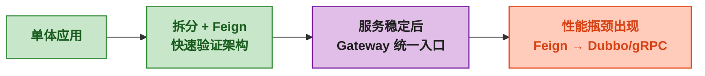

# OpenFeign 核心概念与快速上手

## 一、⚡ 微服务拆了——然后呢？

你把单体应用拆成了用户服务和订单服务。数据库拆了、代码拆了、团队也拆了。然后订单服务需要查用户信息：

```java
// 拆分之前——同一个 JVM，直接调方法
User user = userService.getUserById(userId);

// 拆分之后——跨 JVM、跨机器
// 你必须写一堆 HTTP 调用代码
RestTemplate restTemplate = new RestTemplate();
String url = "http://user-service:8081/api/users/" + userId;
User user = restTemplate.getForObject(url, User.class);
```

这段代码有四个问题：

| 问题 | RestTemplate 写法 | 怎么解决 |
|------|------|------|
| <strong>URL 硬编码</strong> | `"http://user-service:8081/api/users/"` | 服务名代替 IP:Port——自动发现 |
| <strong>参数拼接繁琐</strong> | `url + userId` 手动拼 | 声明参数——自动放到 URL 上 |
| <strong>返回值无类型保障</strong> | `getForObject(url, User.class)` 手动指定 | 接口方法声明返回类型——编译器检查 |
| <strong>和本地调用差距太大</strong> | 完全不同的调用方式——学习成本 | 写法完全和本地方法一样 |

<strong>OpenFeign 解决的就是这个问题——让你调远程服务和调本地方法一样，而且完全不侵入被调方的接口。</strong>

## 二、🧩 OpenFeign 是什么——一句话

OpenFeign 是一个<strong>声明式 HTTP 客户端</strong>。你只需要写一个 Java 接口 + 注解，Feign 自动帮你生成 HTTP 调用的实现。

```
你写的代码：                           Feign 生成的实现：
@FeignClient("user-service")          自动发 HTTP 请求到 user-service
public interface UserClient {         GET /api/users/123
    @GetMapping("/api/users/{id}")    Accept: application/json
    User getUser(@PathVariable Long id);  → 把响应 JSON 转成 User 对象
}
```

<strong>整个过程你没写一行 HTTP 调用代码</strong>——Feign 全自动。

## 三、🔧 第一个 OpenFeign 项目

### 3.1 依赖

```xml
<dependencies>
    <!-- OpenFeign 核心 -->
    <dependency>
        <groupId>org.springframework.cloud</groupId>
        <artifactId>spring-cloud-starter-openfeign</artifactId>
    </dependency>

    <!-- 负载均衡——Feign 默认集成了 Spring Cloud LoadBalancer -->
    <!-- 不需要额外引入——spring-cloud-starter-openfeign 自带 -->
</dependencies>
```

### 3.2 启动类——开启 Feign

```java
@SpringBootApplication
@EnableFeignClients  // ← 一句话开启——Spring 会自动扫描 @FeignClient 接口
public class OrderServiceApplication {
    public static void main(String[] args) {
        SpringApplication.run(OrderServiceApplication.class, args);
    }
}
```

### 3.3 定义 Feign 客户端接口——核心步骤

```java
// 这就是 Feign 的"接口即契约"
// 注意：这个接口放在订单服务中——由调用方定义
// 被调方（用户服务）不需要实现它——完全不侵入
@FeignClient(name = "user-service",      // ① 服务名——对应 Nacos/Eureka 中的服务
             url = "http://localhost:8081")  // ② 开发环境直连——生产用 Nacos 后删掉 url
public interface UserClient {

    // ③ 方法声明和 Spring MVC 注解完全一样
    @GetMapping("/api/users/{userId}")
    User getUser(@PathVariable("userId") Long userId);

    @PostMapping("/api/users")
    User createUser(@RequestBody User user);

    @PutMapping("/api/users/{userId}")
    User updateUser(@PathVariable("userId") Long userId,
                    @RequestBody User user);

    @DeleteMapping("/api/users/{userId}")
    void deleteUser(@PathVariable("userId") Long userId);

    // ④ 复杂查询——多个参数
    @GetMapping("/api/users")
    List<User> listUsers(@RequestParam("keyword") String keyword,
                         @RequestParam("page") int page,
                         @RequestParam("size") int size);

    // ⑤ 返回 ResponseEntity——保留 HTTP 状态码和响应头
    @GetMapping("/api/users/{userId}")
    ResponseEntity<User> getUserWithStatus(@PathVariable("userId") Long userId);
}
```

### 3.4 在 Service 中调 Feign——和本地方法调用一模一样

```java
@Service
public class OrderService {

    // 注入 Feign 接口——和注入普通 Service 完全一样
    @Autowired
    private UserClient userClient;

    public Order createOrder(CreateOrderRequest request) {
        // ① 调用户服务查用户——和本地方法调用完全一样
        User user = userClient.getUser(request.getUserId());

        if (user == null) {
            throw new BusinessException("用户不存在");
        }

        // ② 创建订单——和以前一样
        Order order = Order.builder()
                .userId(user.getUserId())
                .userName(user.getUserName())  // 冗余用户名
                .items(request.getItems())
                .build();

        return orderRepository.save(order);
    }
}
```

### 3.5 被调方（用户服务）——完全不知道 Feign 存在

```java
// 用户服务的 Controller——和以前完全一样
// 不需要实现 Feign 接口、不需要改任何东西
// Feign 只是 HTTP 客户端——调的就是这个普通的 REST Controller
@RestController
@RequestMapping("/api/users")
public class UserController {

    @GetMapping("/{userId}")
    public User getUser(@PathVariable Long userId) {
        return userService.getUser(userId);
    }

    @PostMapping
    public User createUser(@RequestBody User user) {
        return userService.createUser(user);
    }
}
```

<strong>这是 OpenFeign 最大的优势：完全零侵入</strong>。用户服务根本不知道订单服务是用 Feign 调的它，还是用 RestTemplate 调的，还是用 curl 调的——它就是一个普通的 REST 接口。

## 四、⚖️ Feign vs RestTemplate vs Dubbo——为什么微服务第一步是 Feign？

| 维度 | RestTemplate | OpenFeign | Dubbo |
|------|:---:|:---:|:---:|
| <strong>代码量</strong> | 多——URL 拼接、序列化、异常处理 | <strong>少</strong>——只写接口 + 注解 | 少——@DubboReference |
| <strong>接口侵入性</strong> | 无侵入——调的是普通 REST | <strong>无侵入</strong>——调的是普通 REST | 有侵入——需要定义 Dubbo Service 接口 |
| <strong>学习成本</strong> | 低——但写起来繁琐 | <strong>极低</strong>——和写 Controller 一样 | 中——需要理解 RPC 概念 |
| <strong>性能</strong> | HTTP——文本/JSON | HTTP——文本/JSON | <strong>高</strong>——TCP+二进制 |
| <strong>浏览器能调吗</strong> | ✅ 能 | ✅ 能（本质还是 HTTP） | ❌ 不能 |
| <strong>类型安全</strong> | ❌——没编译期检查 | ✅——接口定义有编译器检查 | ✅——接口定义有编译器检查 |
| <strong>适用阶段</strong> | 快速原型 | <strong>微服务拆分第一步</strong> | 最终优化阶段 |

<strong>微服务拆分的建议路线</strong>：



<strong>不要一开始就用 Dubbo/gRPC</strong>——拆分初期的重点是"拆对边界"，不是"调得快"。Feign 调的是 REST——前端能调、Postman 能调、curl 能调——排查问题比 Dubbo 的二进制协议方便 10 倍。等边界稳定了、QPS 上来了——再逐步切 Dubbo/gRPC。

## 五、📦 Feign 支持的注解——和 Spring MVC 完全一样

Feign 的注解和 Spring MVC 共用一套——写 Controller 怎么写，写 Feign 接口就怎么写：

| 注解 | 用途 | 示例 |
|------|------|------|
| `@GetMapping` | GET 请求 | `@GetMapping("/api/users/{id}")` |
| `@PostMapping` | POST 请求 | `@PostMapping("/api/users")` |
| `@PutMapping` | PUT 请求 | `@PutMapping("/api/users/{id}")` |
| `@DeleteMapping` | DELETE 请求 | `@DeleteMapping("/api/users/{id}")` |
| `@RequestMapping` | 通用——可以指定多个方法 | `@RequestMapping(method=GET, value="/api/users")` |
| `@PathVariable` | 路径参数 | `getUser(@PathVariable("id") Long id)` |
| `@RequestParam` | 查询参数 | `listUsers(@RequestParam("page") int page)` |
| `@RequestHeader` | 请求头 | `getUser(@RequestHeader("X-Token") String token)` |
| `@RequestBody` | 请求体 | `createUser(@RequestBody User user)` |
| `@SpringQueryMap` | 把对象转成 Query 参数 | `listUsers(@SpringQueryMap UserQuery query)` |

### 几个容易出错的地方

```java
@FeignClient(name = "user-service")
public interface UserClient {

    // ❌ 错误——@PathVariable 没有指定 value
    @GetMapping("/api/users/{userId}")
    User getUser(@PathVariable Long userId);
    // Feign 报错：PathVariable annotation was empty on param 0
    // 原因：Java 编译时不保留参数名——Feign 不知道这是 "userId"

    // ✅ 正确——显式指定 value
    @GetMapping("/api/users/{userId}")
    User getUser(@PathVariable("userId") Long userId);

    // ❌ 错误——GET 请求用了 @RequestBody
    @GetMapping("/api/users/search")
    List<User> search(@RequestBody UserSearchRequest request);
    // 虽然 HTTP 规范没说 GET 不能有 Body——但很多框架不支持

    // ✅ 正确——用 @SpringQueryMap 把对象转成 Query 参数
    @GetMapping("/api/users/search")
    List<User> search(@SpringQueryMap UserSearchRequest request);
    // UserSearchRequest 的字段会变成 ?keyword=xxx&page=1&size=20
}
```

> ⚠️ 新手提示：`@PathVariable` 必须写 `value`——Feign 需要它来匹配路径中的变量。Java 8+ 虽然支持 `-parameters` 编译参数保留参数名——但默认为关闭。<strong>显式写 `@PathVariable("userId")` 是最安全的做法</strong>。

## 六、🔗 Feign 和 Nacos 配合——不用写死 URL

上面的例子中 `url = "http://localhost:8081"` 是写死的。接入 Nacos 后——Feign 自动按服务名发现：

```xml
<!-- 加上 Nacos 依赖 -->
<dependency>
    <groupId>com.alibaba.cloud</groupId>
    <artifactId>spring-cloud-starter-alibaba-nacos-discovery</artifactId>
</dependency>
```

```yaml
spring:
  cloud:
    nacos:
      discovery:
        server-addr: localhost:8848
```

```java
// url 去掉——Feign 自动从 Nacos 查到 user-service 的实例
@FeignClient(name = "user-service")  // ← name 就是 Nacos 中的服务名
public interface UserClient {

    @GetMapping("/api/users/{userId}")
    User getUser(@PathVariable("userId") Long userId);
}
```

<strong>Feign + Nacos 的工作过程</strong>：

```
Feign 构造 HTTP 请求 →
  LoadBalancer 拦截 → 向 Nacos 询问 "user-service 有哪些实例？"
  Nacos 返回：10.0.1.1:8081, 10.0.1.2:8081, 10.0.1.3:8081 →
  LoadBalancer 选一个（轮询）→ 发给 10.0.1.2:8081 →
  user-service 响应 → Feign 把 JSON 转成 User 对象 → 返回
```

## 七、🧬 Feign 的底层——JDK 动态代理

如果你好奇 `UserClient` 只是一个接口——没有实现类——为什么能调？

```java
@Autowired
private UserClient userClient;  // 这是个接口——实现类在哪？谁生成的？

// 调用时
User user = userClient.getUser(1L);
// getClass().getName() = com.sun.proxy.$Proxy123  ← JDK 动态代理
// 这是 Feign 在启动时用 JDK 动态代理生成的实现类
// 它拦截所有方法调用 → 根据注解构造 HTTP 请求 → 发出去 → 解析响应
```

```
Feign 启动时做了三件事：
  ① 扫描所有 @FeignClient 接口
  ② 对每个接口——用 JDK 动态代理生成实现类
  ③ 实现类中——每个方法调用被拦截
     → 读方法上的 @GetMapping 注解 → 知道 URL 是 /api/users/{userId}
     → 读参数上的 @PathVariable → 知道 userId 替换到 URL 中
     → 构造 HTTP 请求 → 发出去 → 解析响应 → 返回
```

## 🎯 总结

1. <strong>OpenFeign = 声明式 HTTP 客户端</strong>：写一个接口 + Spring MVC 注解——Feign 自动生成 HTTP 调用实现。调远程服务和调本地方法一样——没有 URL 拼接、没有手动序列化。

2. <strong>最关键的优点——零侵入</strong>：被调方（用户服务）不知道 Feign 存在——它就是一个普通 REST Controller。这就是为什么微服务拆分第一步选 Feign 而不是 Dubbo——你不需要改被调方的接口。

3. <strong>拆分路线上——Feign 在前、Dubbo 在后</strong>：拆分初期用 Feign 快速验证服务边界（REST 可调试、可 curl、可 Postman）。等边界稳定、QPS 上来——逐步切 Dubbo/gRPC。

4. <strong>Feign + Nacos = 不再写死 IP</strong>：`@FeignClient(name = "user-service")` + Nacos——Feign 自动发现实例、自动负载均衡。

> 📖 <strong>下一步阅读</strong>：基本调用搞定了——但生产环境还有超时、重试、鉴权 Header 传递、日志、降级这些问题——继续阅读 [<strong>OpenFeign 进阶——配置、拦截器与容错</strong>]()。
