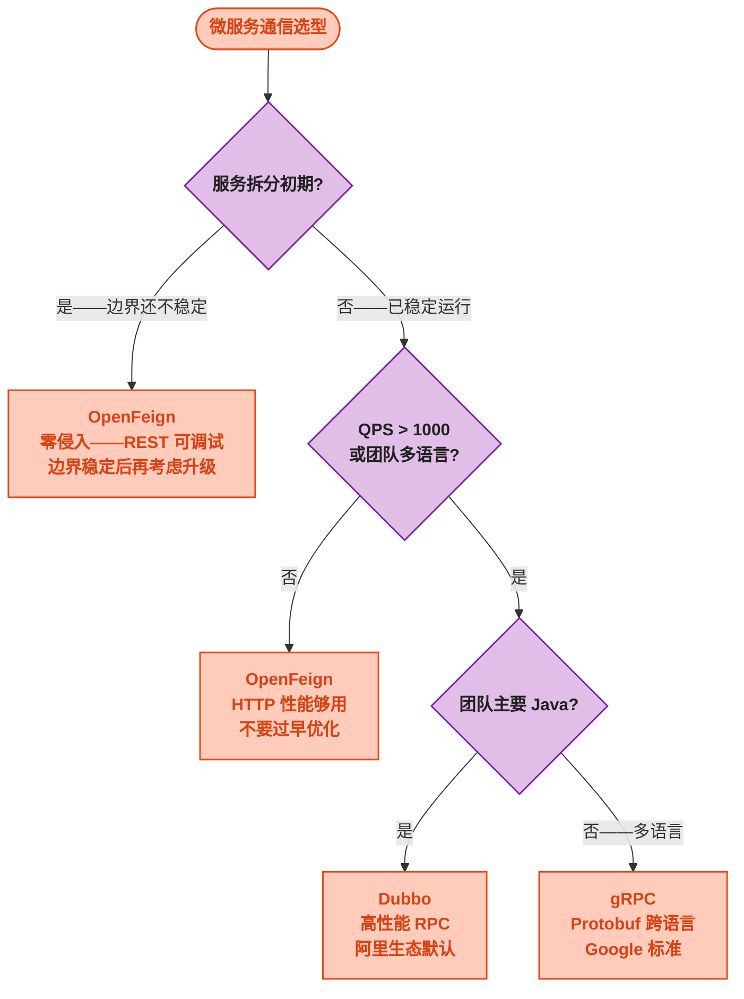

# OpenFeign 生产实战——Nacos + Sentinel + 性能调优

> 📖 <strong>前置阅读</strong>：本文假设读者已掌握 OpenFeign 的配置和容错机制。如果还不熟悉，建议先阅读 [<strong>OpenFeign 核心概念与快速上手</strong>]() 和 [<strong>进阶——配置、拦截器与容错</strong>]()。

## 一、⚡ Feign 调通了——但生产环境的三块拼图还缺着

前两篇搞定了 Feign 的基本用法、超时、重试、拦截器、Fallback。但生产环境还有三件事必须做：

```
① Feign + Nacos —— 不再写死 URL——服务自动发现、负载均衡
② Feign + Sentinel —— 被调服务慢/挂了——熔断降级保护调用方
③ Feign + 性能调优 —— Gzip 压缩、连接池、异步并发
```

## 二、🧩 Feign + Nacos 服务发现——零 URL 硬编码

### 2.1 依赖

```xml
<dependencies>
    <!-- OpenFeign -->
    <dependency>
        <groupId>org.springframework.cloud</groupId>
        <artifactId>spring-cloud-starter-openfeign</artifactId>
    </dependency>
    <!-- Nacos 服务发现 -->
    <dependency>
        <groupId>com.alibaba.cloud</groupId>
        <artifactId>spring-cloud-starter-alibaba-nacos-discovery</artifactId>
    </dependency>
    <!-- LoadBalancer——Feign 自动集成——不需要显式引入 -->
</dependencies>
```

### 2.2 配置

```yaml
spring:
  application:
    name: order-service
  cloud:
    nacos:
      discovery:
        server-addr: localhost:8848
        namespace: production            # 命名空间——隔离环境
        group: ORDER_GROUP               # 分组
```

```java
// Feign 接口——只声明服务名，不写 URL
@FeignClient(name = "user-service")  // Nacos 中有 user-service 这个服务
public interface UserClient {

    @GetMapping("/api/users/{userId}")
    User getUser(@PathVariable("userId") Long userId);
}
```

### 2.3 负载均衡策略

Feign 默认用 Spring Cloud LoadBalancer——轮询策略。想换成随机或加权策略：

```yaml
spring:
  cloud:
    loadbalancer:
      ribbon:
        enabled: false             # 如果用了 LoadBalancer——关掉遗留的 Ribbon
      cache:
        enabled: true
        ttl: 35s                   # 实例列表缓存 35s
```

```java
// 自定义负载均衡策略——从 Nacos 实例列表中选一个
@Configuration
public class LoadBalancerConfig {

    @Bean
    public ReactorLoadBalancer<ServiceInstance> randomLoadBalancer(
            Environment env,
            LoadBalancerClientFactory factory) {
        String name = env.getProperty(LoadBalancerClientFactory.PROPERTY_NAME);
        // 随机策略——替换默认轮询
        return new RandomLoadBalancer(factory.getLazyProvider(name, ServiceInstanceListSupplier.class), name);
    }
}
```

## 三、🛡️ Feign + Sentinel 熔断降级——比 Fallback 更强

### 3.1 Feign 原生的 Fallback 的局限

Feign 的 `fallback` 和 `fallbackFactory` 只在<strong>HTTP 调用失败</strong>时触发（网络异常、超时、HTTP 500）。但 Sentinel 的熔断能捕获<strong>"接口变慢了"</strong>——即使 HTTP 返回 200，但耗时 5s——Sentinel 能熔断。

<strong>两者结合——Feign 的 fallback 处理"接口挂了"，Sentinel 的降级处理"接口变慢了"。</strong>

### 3.2 依赖与配置

```xml
<dependency>
    <groupId>com.alibaba.cloud</groupId>
    <artifactId>spring-cloud-starter-alibaba-sentinel</artifactId>
</dependency>
<!-- Sentinel 对 Feign 的支持——使 Feign 接口成为 Sentinel 资源 -->
<dependency>
    <groupId>org.springframework.cloud</groupId>
    <artifactId>spring-cloud-starter-openfeign</artifactId>
</dependency>
```

```yaml
spring:
  cloud:
    sentinel:
      transport:
        dashboard: localhost:8080
        port: 8720
      datasource:
        degrade-rules:
          nacos:
            server-addr: localhost:8848
            data-id: ${spring.application.name}-degrade-rules
            group-id: SENTINEL_GROUP
            data-type: json
            rule-type: degrade

# 关键——开启 Sentinel 对 Feign 的支持
feign:
  sentinel:
    enabled: true              # ← 开启后——每个 Feign 方法自动成为 Sentinel 资源
```

### 3.3 Sentinel + Feign Fallback——双保险

```java
// ① Feign 接口——同时声明 Sentinel fallback
@FeignClient(name = "user-service",
             fallbackFactory = UserClientFallbackFactory.class)  // ← Feign 原生
public interface UserClient {

    @GetMapping("/api/users/{userId}")
    User getUser(@PathVariable("userId") Long userId);

    @GetMapping("/api/users")
    List<User> listUsers(@RequestParam("keyword") String keyword,
                         @RequestParam("page") int page,
                         @RequestParam("size") int size);
}

// ② FallbackFactory——Feign 调用失败时降级
@Component
public class UserClientFallbackFactory implements FallbackFactory<UserClient> {

    @Override
    public UserClient create(Throwable cause) {
        System.err.println("UserClient 降级——原因: " + cause);

        return new UserClient() {
            @Override
            public User getUser(Long userId) {
                User user = new User();
                user.setUserId(userId);
                // 根据异常类型区分
                if (cause instanceof RetryableException) {
                    user.setUserName("用户服务超时");
                } else if (cause instanceof FeignException.ServiceUnavailable) {
                    user.setUserName("用户服务已下线");
                } else {
                    user.setUserName("用户服务暂时不可用");
                }
                return user;
            }

            @Override
            public List<User> listUsers(String keyword, int page, int size) {
                return Collections.emptyList();
            }
        };
    }
}

// ③ Sentinel 降级规则——在 Nacos 中配
// Nacos config: order-service-degrade-rules
// 内容：
[
  {
    "resource": "GET#http://user-service/api/users/{userId}",
    "grade": 0,
    "count": 300,
    "slowRatioThreshold": 0.5,
    "minRequestAmount": 10,
    "statIntervalMs": 1000,
    "timeWindow": 10
  }
]
// 这个规则：如果 50% 的 getUser 请求 RT > 300ms——熔断 10s
```

<strong>两个降级层级</strong>：

| 层级 | 触发条件 | 处理者 | 结果 |
|------|------|------|------|
| Sentinel 熔断 | 慢调用/异常比例达到阈值 | Sentinel → 抛 `DegradeException` → Feign 捕获 → 调 FallbackFactory | 10s 内所有请求直接降级 |
| Feign Fallback | HTTP 调用失败（500/超时/网络） | Feign 捕获异常 → 调 FallbackFactory | 单次失败降级——下次请求继续尝试 |

### 3.4 Sentinel Dashboard 中查看 Feign 资源

开启 `feign.sentinel.enabled=true` 后——Dashboard 的簇点链路中会出现：

```
GET#http://user-service/api/users/{userId}
POST#http://user-service/api/users
GET#http://product-service/api/products/{productId}
```

每个 Feign 方法都是一个 Sentinel 资源——可以独立配流控和熔断规则。

## 四、📜 Contract 契约优先——消除 DTO 不一致

### 4.1 问题：Feign 接口和被调方 Controller 可能不同步

```
订单服务的 UserClient.getUser() 返回 User
用户服务的 UserController.getUser() 返回 User

两个 User 是一样的类吗？
  → 如果没有共享模块——各自写各自的 DTO
  → 开发改了 UserController 的返回——加了字段——但忘了改 Feign 的 User
  → 不报错——但新字段就是 null
```

### 4.2 共享接口模块——Contract 模式

```
项目结构：
  ├── user-service-api/         # ① 用户服务对外暴露的契约——独立模块
  │   ├── pom.xml               #    不依赖任何业务模块——纯接口 + DTO
  │   └── src/main/java/
  │       └── com/example/user/api/
  │           ├── UserClient.java      # Feign 接口
  │           └── dto/
  │               ├── UserDTO.java     # 共享 DTO
  │               └── CreateUserRequest.java
  │
  ├── user-service/             # ② 用户服务——实现契约中定义的接口
  │   └── src/main/java/
  │       └── com/example/user/controller/
  │           └── UserController.java  # 实现了 user-service-api 中的接口
  │
  └── order-service/            # ③ 订单服务——依赖契约模块——可以直接调 Feign
      └── src/main/java/
          └── com/example/order/service/
              └── OrderService.java    # 注入 UserClient——调 Feign
```

<strong>user-service-api 模块——只定义接口和 DTO，不包含实现</strong>：

```java
// user-service-api/src/main/java/com/example/user/api/UserClient.java
// 这个接口是"契约"——用户服务实现它，订单服务调用它
@FeignClient(name = "user-service")
public interface UserClient {

    @GetMapping("/api/users/{userId}")
    UserDTO getUser(@PathVariable("userId") Long userId);

    @PostMapping("/api/users")
    UserDTO createUser(@RequestBody CreateUserRequest request);
}
```

```java
// user-service-api/src/main/java/com/example/user/api/dto/UserDTO.java
// 共享 DTO——服务提供方和调用方用同一个类——不存在不同步
@Data
public class UserDTO {
    private Long userId;
    private String userName;
    private String email;
    private String phone;
    private Integer status;
}
```

```java
// 用户服务——Controller 可以引用共享模块的接口
// 但只是参考——不需要实际实现 Feign 接口
@RestController
@RequestMapping("/api/users")
public class UserController {

    @GetMapping("/{userId}")
    public UserDTO getUser(@PathVariable Long userId) {
        // 返回和共享模块中一样的 UserDTO——保证契约一致
        return userService.getUserDTO(userId);
    }
}
```

<strong>契约模块的价值</strong>：DTO 定义在共享模块中——Provider 和 Consumer 引用同一个类。改了 UserDTO 加字段——两边同时编译——不存在"忘了改 Consumer 的 DTO 导致字段为 null"。

## 五、⚡ 性能调优——压缩、连接池、异步

### 5.1 Gzip 压缩——省 70% 带宽

Feign 默认不压缩请求和响应。开启 Gzip 后——传输量大幅降低（纯文本 JSON 压缩比最高）：

```yaml
spring:
  cloud:
    openfeign:
      compression:
        request:
          enabled: true
          mime-types: application/json,application/xml
          min-request-size: 2048      # 小于 2KB 不压缩——压缩本身也有开销
        response:
          enabled: true
          useGzipDecoder: true        # 解压 Gzip 响应——需要这行
```

<strong>注意</strong>：开了 Gzip 后——看到网络传输量下降——但 CPU 会多消耗一点做压缩/解压。小请求（< 2KB）不压缩——CPU 开销不值得。

### 5.2 连接池调优

```yaml
spring:
  cloud:
    openfeign:
      httpclient:
        hc5:
          enabled: true
        # 连接池参数——默认值通常够用
      client:
        config:
          default:
            connect-timeout: 2000
            read-timeout: 5000
```

Apache HttpClient 5 默认连接池参数：

| 参数 | 默认值 | 建议 |
|------|:---:|------|
| `max-connections` | 200 | 够用——除非你并发 > 200 的 Feign 调用 |
| `max-connections-per-route` | 50 | 每个后端最多 50 个连接——超过了要排队 |
| `connection-time-to-live` | — | 建议设 30s——定期回收空闲连接 |

### 5.3 异步并发——用 CompletableFuture 加速

```java
@Service
public class OrderService {

    @Autowired
    private UserClient userClient;
    @Autowired
    private ProductClient productClient;
    @Autowired
    private InventoryClient inventoryClient;

    // 同步版本——串行调用——总耗时 = sum（每个服务的 RT）
    public OrderDetail getOrderDetailSync(Long orderId) {
        Order order = orderRepository.findById(orderId);          // 30ms
        User user = userClient.getUser(order.getUserId());        // 50ms
        Product product = productClient.getProduct(order.getProductId()); // 60ms
        Inventory inventory = inventoryClient.getInventory(order.getProductId()); // 40ms
        // 总耗时 = 30 + 50 + 60 + 40 = 180ms
        return new OrderDetail(order, user, product, inventory);
    }

    // 异步版本——并发调用——总耗时 = max（每个服务的 RT）
    public OrderDetail getOrderDetailAsync(Long orderId) {
        Order order = orderRepository.findById(orderId);          // 30ms

        // 三个 Feign 调用并发执行——互相不阻塞
        CompletableFuture<User> userFuture =
                userClient.getUserAsync(order.getUserId());       // 50ms
        CompletableFuture<Product> productFuture =
                productClient.getProductAsync(order.getProductId()); // 60ms
        CompletableFuture<Inventory> inventoryFuture =
                inventoryClient.getInventoryAsync(order.getProductId()); // 40ms

        // 等最慢的那个
        CompletableFuture.allOf(userFuture, productFuture, inventoryFuture).join();

        // 总耗时 = 30 + max(50, 60, 40) = 90ms——省了 90ms
        return new OrderDetail(order,
                userFuture.join(), productFuture.join(), inventoryFuture.join());
    }
}
```

```java
// Feign 异步接口——返回 CompletableFuture
@FeignClient(name = "user-service")
public interface UserClient {

    @GetMapping("/api/users/{userId}")
    CompletableFuture<User> getUserAsync(@PathVariable("userId") Long userId);
}
```

### 5.4 批量接口——减少网络往返

```java
// ❌ 反模式——N 个 ID 调 N 次
// 100 个用户 = 100 次 HTTP 请求 = 100 次网络往返
List<User> users = userIds.stream()
        .map(userClient::getUser)
        .toList();

// ✅ 增加批量接口——一次 HTTP 请求返回一批数据
// user-service-api 中加批量接口
@FeignClient(name = "user-service")
public interface UserClient {

    @PostMapping("/api/users/batch")
    List<User> batchGetUsers(@RequestBody List<Long> userIds);
    // 100 个用户 = 1 次 HTTP 请求——网络开销从 100 × RTT 降到 1 × RTT
}
```

## 六、⚖️ 终极选型：Feign vs RestTemplate vs Dubbo vs gRPC

经过 Feign 系列、Dubbo 系列、gRPC 系列的讲解——这里给一个完整的选型对比：

| 维度 | RestTemplate | OpenFeign | Dubbo | gRPC |
|------|:---:|:---:|:---:|:---:|
| <strong>代码简洁度</strong> | ★★☆☆☆ | ★★★★★ | ★★★★☆ | ★★★★☆ |
| <strong>接口侵入性</strong> | 无——调 REST | <strong>无</strong>——调 REST | 有——需 Dubbo Service 接口 | 有——需 proto 定义 |
| <strong>可调试性</strong> | curl/Postman 直接调 | curl/Postman 直接调 | 需要 Dubbo 专用工具 | 需要 grpcurl |
| <strong>性能</strong> | ★★☆☆☆（文本 JSON/HTTP） | ★★☆☆☆（文本 JSON/HTTP） | ★★★★☆（二进制/长连接） | ★★★★★（Protobuf/HTTP2） |
| <strong>学习成本</strong> | 极低 | <strong>极低</strong> | 中 | 高——Protobuf 语法 |
| <strong>浏览器支持</strong> | ✅ | ✅ | ❌——TCP 协议 | ❌——HTTP/2 |
| <strong>SpringBoot 集成</strong> | 自带 | 引入 starter 即可 | 引入 starter | 引入 starter + proto 插件 |
| <strong>推荐场景</strong> | 临时调用或不值得建 Feign 接口 | <strong>微服务拆分第一步</strong> | 内部高性能 RPC | 多语言微服务 |



<strong>选 Feign 的三个信号</strong>：
1. 刚拆分微服务——边界还在调整
2. 需要前端/Postman/curl 能直接调试
3. QPS < 500——HTTP 性能完全够用

<strong>选 Dubbo/gRPC 的三个信号</strong>：
1. 内部服务间 QPS > 1000——序列化开始成为瓶颈
2. 所有调用方都是自己团队维护的——不对外暴露
3. 需要更精细的 RPC 特性——如异步调用、流式传输

## 七、📋 Feign 生产上线 Checklist

| # | 配置项 | 推荐值 | 说明 |
|:--:|------|------|------|
| 1 | Nacos 服务发现 | `name = "service-name"`——删掉 `url` | 不写死 IP——服务上下线自动感知 |
| 2 | HttpClient 5 | 替换默认 HttpURLConnection | 连接池——省 TCP 握手开销 |
| 3 | connect-timeout | 2~5s | 建立连接的容忍时间 |
| 4 | read-timeout | 3~10s | 根据接口正常 RT × 3 |
| 5 | Gzip 压缩 | 开启 + min 2KB | 省 50%~70% 带宽——CPU 多做一点压缩 |
| 6 | 重试 | GET 最多 3 次——POST 不重试 | 只对幂等操作重试 |
| 7 | FallbackFactory | 每个 FeignClient 都配 | 被调服务挂了——至少知道为什么 |
| 8 | Sentinel 熔断 | `feign.sentinel.enabled=true` | Feign 方法成为 Sentinel 资源——可配慢调用熔断 |
| 9 | RequestInterceptor | 统一注入 Token + TraceId | 不要每个方法手写 `@RequestHeader` |
| 10 | 契约模块 | `xxx-service-api` 独立模块 | DTO 共享——API 变更双方同时感知 |

## 🎯 总结

1. <strong>Feign + Nacos = 不再写死 IP</strong>：`@FeignClient(name = "user-service")` 让 Feign 从 Nacos 自动发现实例。服务扩容缩容——调用方无感知。

2. <strong>Feign + Sentinel = 双保险</strong>：Feign 原生 Fallback 处理 HTTP 失败，Sentinel 熔断处理"接口变慢"。开启 `feign.sentinel.enabled=true` 后——每个 Feign 方法都是 Sentinel 资源——Dashboard 中可配流控和熔断。

3. <strong>契约模块消除 DTO 不一致</strong>：`xxx-service-api` 独立模块定义 Feign 接口 + DTO。Provider 和 Consumer 引用同一个类——加字段两边同时编译——不存在同步问题。

4. <strong>Feign 是微服务通信的第一步——不是最后一步</strong>：拆分初期用 Feign——零侵入、可调试。QPS 上来后逐步切 Dubbo/gRPC——Protocol Buffers + 长连接——性能翻倍。

---

> 📖 <strong>系列回顾</strong>：OpenFeign 系列到此结束——
> 1. [<strong>核心概念与快速上手</strong>]() —— @FeignClient、注解映射、零侵入设计
> 2. [<strong>进阶——配置、拦截器与容错</strong>]() —— 超时、重试、连接池、拦截器、ErrorDecoder、Fallback
> 3. [<strong>生产实战——Nacos + Sentinel + 性能调优</strong>]() —— Nacos 服务发现、Sentinel 熔断、Contract 契约、Gzip/异步/批量优化、终极选型指南
