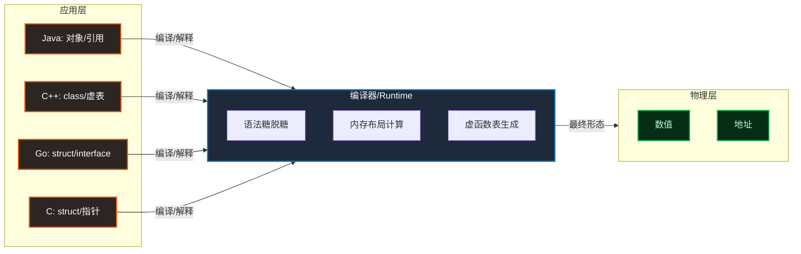
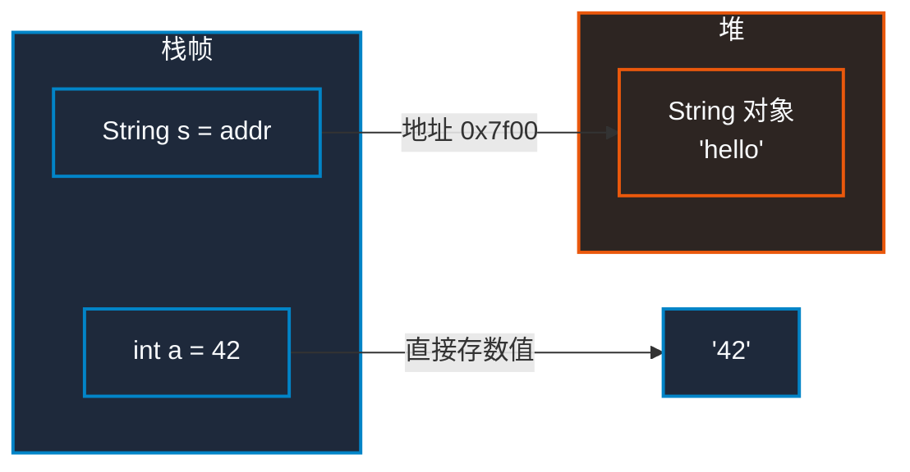
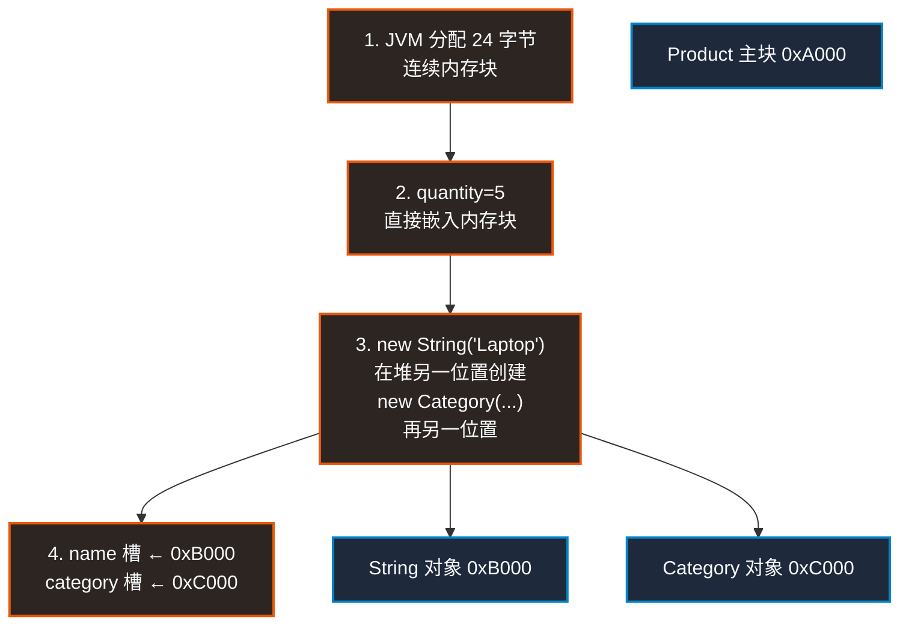
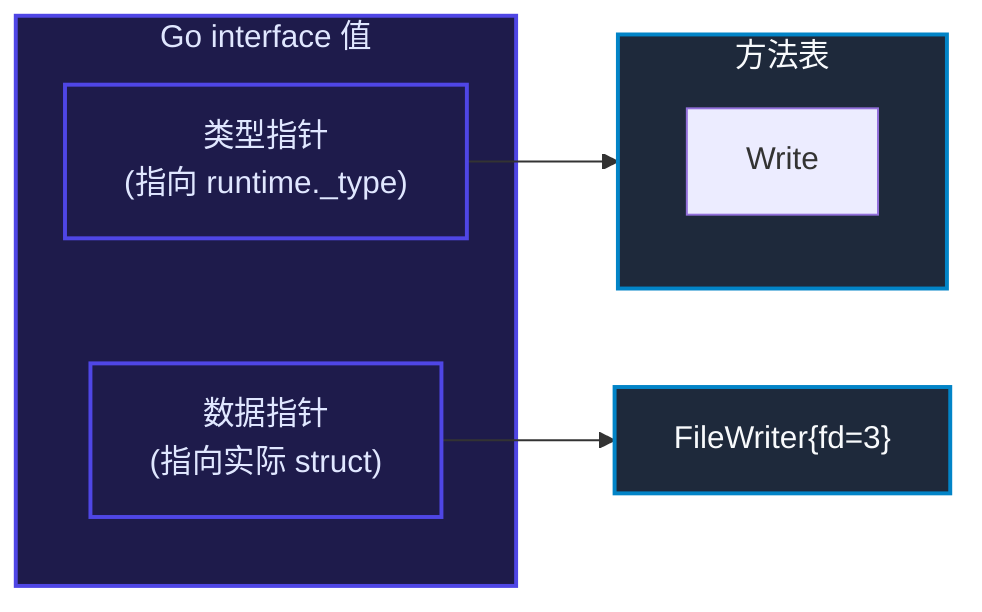
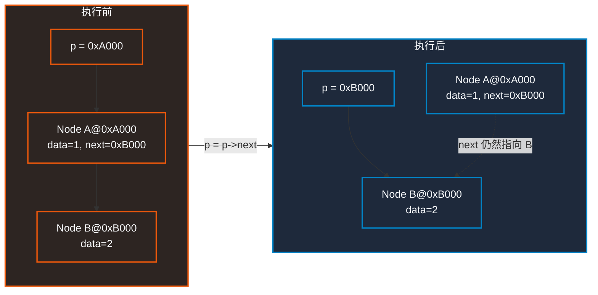
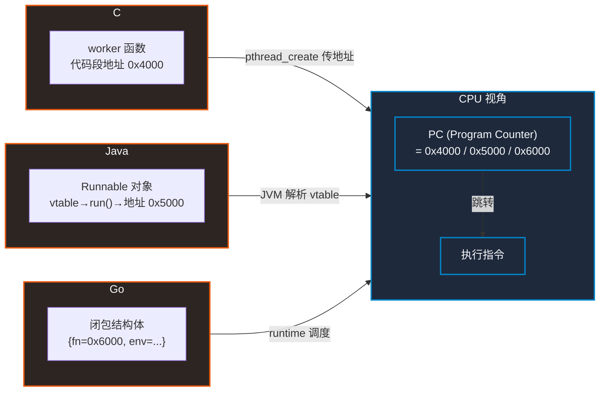

# 语法迷雾之下，物理内存里只有「数值」与「地址」

## 一、导言：被抽象概念包围的困惑

某开发者学了三年 Java，突然被扔去写 C——struct 是什么？ ` *p ` 又是什么？ ` void * ` 是什么东西？回头再看 Go，interface 怎么不用 ` implements ` ？再翻翻 C++ 源码，一个 class 里又是 virtual 又是 this——每个语言都有一套自己的"数据创造论"，把内存的本质层层包裹起来。

Java 说「一切皆对象」，C 说「一切皆指针」，Go 说「用组合不要继承」，C++ 说「我全都要」。刚入门的读者站在这些口号中间，CPU 和 RAM 到底是怎么看待这些概念的？

**破局点只有一句话：CPU 和 RAM 根本不懂面向对象。物理内存里永远只有两样东西——「数值」与「地址」。**

int 是数值，指针是地址，对象的字段是数值和地址的排列组合，接口变量是两个地址凑一对。所有语言的语法特性，最终在内存里都还原为这个二元模型。



这篇文章的任务：把 C、C++、Java、Go 的语法糖一颗颗剥开，露出底下那个统一的物理内存画卷。

---

## 二、面向对象的物理原貌：C++ Class 与 Java 内存模型

### 2.1 C++ Class 的真面目

C++ 的 class 本质上就是 C struct 的语法扩充版。

```cpp
// C++：class 带方法
class Point {
    int x, y;
public:
    Point(int x, int y) : x(x), y(y) {}
    void move(int dx, int dy) { x += dx; y += dy; }
};
```

```c
// C：struct + 函数，完全等价
typedef struct { int x, y; } Point;
void Point_init(Point *this, int x, int y) {
    this->x = x; this->y = y;
}
void Point_move(Point *this, int dx, int dy) {
    this->x += dx; this->y += dy;
}
```

**区别只在于：** C++ 编译器自动帮你传了 ` this ` 指针，自动把 ` move ` 绑定到 ` Point ` 的命名空间。内存布局完全一样——两个 int 挨着放，一共 8 字节。

> 📌 前置知识：C++ 有虚函数时，对象头部会多一个 ` vptr ` （虚表指针），指向一个存储虚函数地址的 vtable。这是 C struct 没有的额外开销。

**认知修正 1：** 抛弃面向对象的神圣感。对象在内存里就是"结构体打包"。 ` this ` 不过是个隐藏的指针参数。

### 2.2 Java 的内存大一统法则

Java 做了比 C++ 更彻底的切割：8 大基本类型（Primitive）+ 引用类型（Reference）。

```java
int a = 42;           // 栈帧: [a = 42] ——这是数值
String s = "hello";   // 栈帧: [s = 0x7f00] → 堆: [0x7f00: "hello"]
```

```c
int a = 42;           // 栈帧: [a = 42]
char *s = "hello";    // 栈帧: [s = 0x7f00] → .rodata: [0x7f00: "hello"]
```

Java 的 ` String s ` 和 C 的 ` char *s ` 在内存层是同一个东西：一个存地址的变量。Java 换了个名字叫"引用"好让人忘记指针的恐怖，但底层就是地址。

**认知修正 2：**
- ❌ 误区：以为 Java 里所有变量都是对象
- ✅ 真相：基本类型直接在栈上存数值，引用类型存的是堆内存地址。 `int` 就是 `int` ， `String` 就是 `char *` 换了个文明的说法。



---

## 三、深入堆内存：new 一个对象底层到底发生了什么？

### 3.1 猜想推演：主内存块分配与嵌套引用

用一个 ` Product ` 类来推演：

```java
class Product {
    int quantity;       // 基本类型
    String name;        // 引用类型
    Category category;  // 引用类型
}

Product p = new Product();
p.quantity = 5;
p.name = new String("Laptop");
p.category = new Category("Electronics");
```

一个 ` Product ` 实例在堆上占据多大空间？32 位 JVM 上大约是：对象头（12 字节）+ ` quantity ` （4 字节）+ ` name ` 引用（4 字节）+ ` category ` 引用（4 字节）= 24 字节。

### 3.2 底层执行四部曲

**认知修正 3（核心推演验证）：**

1. **分配主内存块**：JVM 在堆上划出一块连续内存（≈24 字节），作为 Product 对象的栖息地
2. **嵌入基本类型**： ` quantity = 0 ` （默认值）——这个数值**直接嵌入**到主块内部，不另占空间
3. **异地分配引用对象**： ` new String("Laptop") ` 在堆的另一位置创建了一个 String 对象； ` new Category(...) ` 又在另一位置创建了一个 Category 对象
4. **地址填槽**：把 String 对象的地址写入主块的 ` name ` 槽位，把 Category 的地址写入 ` category ` 槽位

```
堆内存快照：

0xA000 (Product 对象):
  [0xA000] 对象头 (mark word + klass pointer)    — 12 bytes
  [0xA00C] quantity = 5                          — 4 bytes (数值直接嵌入)
  [0xA010] name = 0xB000                         — 4 bytes (存的是地址)
  [0xA014] category = 0xC000                     — 4 bytes (存的是地址)

0xB000 (String 对象):
  [0xB000] 对象头
  [0xB00C] value[] → 字符数组地址
  [0xB010] hash = 0

0xC000 (Category 对象):
  [0xC000] 对象头
  [0xC00C] name = "Electronics"
```



---

## 四、Go 语言的减法艺术：没有 Class 怎么搞面向对象？

### 4.1 Struct + Method + 隐式接口（Duck Typing）

Go 做了一个大胆的决定：砍掉 class、砍掉继承、砍掉 ` implements ` 关键字。

```go
type Writer interface {
    Write([]byte) (int, error)
}

type FileWriter struct {
    fd int
}

// 这个方法让 FileWriter 自动实现了 Writer
func (f *FileWriter) Write(data []byte) (int, error) {
    return syscall.Write(f.fd, data)
}
```

Go 的 interface 值在内存里是个两字结构： ` [类型指针 | 数据指针] ` 。没有虚表、没有继承链、没有 ` extends ` 关键字。



**认知修正 4：** 没有 class 不代表没有面向对象能力。Go 的隐式接口实现了**非侵入式的行为组合**——实现者不需要知道自己实现了哪个接口，接口是使用者定义的。这叫"Duck Typing"（鸭子类型）：长得像鸭子、叫得像鸭子，那它就是鸭子。

---

## 五、破除 C 语言"怪异语法"恐惧：类型视角与解引用

### 5.1 剥洋葱法则：拆解 ` *(int *)arg`

```c
void *thread_func(void *arg) {
    int value = *(int *)arg;  // 让人头皮发麻的一行
    return NULL;
}
```

**认知修正 5：** 从右向左、从内向外读：

1. ` arg ` → 这是一个 ` void * ` 类型的变量（收到一个地址，不知道它指向什么类型）
2. ` (int *)arg ` → 强转：告诉编译器"这个地址指向一个 int"
3. ` *(int *)arg ` → 解引用：去那个地址把 int 值读出来

```
arg = 0x7F00        ← 收到的是地址
(int *)arg = 0x7F00  ← 同一个地址，但现在标记为"指向 int"
*(int *)arg = 42    ← 从 0x7F00 读 4 字节，得到数值 42
```

跟 Java 对比一下就明白了：

```java
// Java 完全不让你看见这个层次
// 但底层 JVM 也在做同样的事
Object arg = ...;          // 相当于 void *
int value = (int) arg;     // 相当于 *(int *)arg — 类型强转 + 取值
```

### 5.2 解引用的全貌：不只有 ` *`

C 语言有两个解引用操作符：

| 操作符 | 用途 | 示例 |
|--------|------|------|
| ` * ` | 通用解引用——去地址取值 | ` *ptr ` |
| ` -> ` | 结构体/联合体指针的复合解引用 | ` ptr->field ` |

```c
struct Point { int x, y; };
struct Point pt = {10, 20};
struct Point *pp = &pt;

(*pp).x = 30;   // 完整写法：先解引用得 struct，再取字段
pp->x = 30;     // 语法糖：完全等价
```

`-> ` 就是 ` (*). ` 的打字优化版，没有任何特殊功能。

---

## 六、终极通关：链表遍历 ` p = p->next ` 的物理真相（全篇高潮）

```c
struct Node {
    int data;
    struct Node *next;
};

// 链表遍历
struct Node *p = head;
while (p != NULL) {
    printf("%d\n", p->data);
    p = p->next;  // ← 这行到底在干什么？
}
```

### 6.1 箭头操作符（ ` -> ` ）的单一使命

`p->next ` 等价于 ` (*p).next ` ，做的事只有一件：
1. 拿到 ` p ` 里存的地址
2. 去那个地址读取 ` next ` 字段的值（这个值是一个地址——下一个节点的地址）

**箭头本身不移动指针。** 它只是去内存里读了一条数据。

### 6.2 赋值号（ ` =`）的物理分工与类型匹配

**认知修正 6（最大困惑破解）：**

某开发者曾经以为 ` -> ` 有某种"把指针推到下一个节点"的神秘力量。事实是，这个操作被拆成了左右两边各干各的：

```c
p = p->next;
```

- **右边 RHS ` p->next ` **：去 ` p ` 指向的节点内存里，读取 ` next ` 字段的值 → 产生一个 ` struct Node * ` 类型的地址值（比如 0xB000）
- **左边 LHS ` p = ` **：把右边算出来的这个新地址值，覆盖写入变量 ` p`

```
执行前：
  p = [0xA000]
  0xA000 (Node A): {data=1, next=0xB000}
  0xB000 (Node B): {data=2, next=0xC000}

p = p->next 的执行过程：
  步骤1 (RHS): p->next → 读取 0xA000 偏移 data+4 的地方 → 得到 0xB000
  步骤2 (LHS): p = 0xB000 → 把 0xB000 写入变量 p

执行后：
  p = [0xB000]  ← p 现在指向 Node B
  0xA000 (Node A): {data=1, next=0xB000}  ← 没变
  0xB000 (Node B): {data=2, next=0xC000}
```



**理解了 ` p = p->next ` ，你就理解了 C 语言 50% 的指针。** 剩下 50% 是 ` *p ` （解引用取值）和 ` &x ` （取地址），但这行代码是所有概念的汇合点。

---

## 七、跨语言思维映射：C 函数指针 vs Java Runnable

### 7.1 POSIX pthreads start_routine 与 Java Runnable.run() 的灵魂对齐

```c
// C: 线程需要一个函数地址
void *worker(void *arg) {
    printf("Hello from C thread\n");
    return NULL;
}
pthread_create(&tid, NULL, worker, (void *)42);
```

```java
// Java: 线程需要一个 Runnable 对象
Thread t = new Thread(() -> {
    System.out.println("Hello from Java thread");
});
t.start();
```

```go
// Go: 线程需要一个 goroutine
go func() {
    fmt.Println("Hello from Go goroutine")
}()
```

这三个写法完全不同，但在 CPU 眼里是同一件事：**告诉硬件从哪开始执行指令。**

| 语言 | 形式 | 物理本质 |
|------|------|----------|
| C | 函数指针 ` void *(*)(void *) ` | 代码段的一个地址，CPU 直接跳转 |
| Java | ` Runnable ` 对象 | 对象里有 ` run() ` 方法的 vtable 偏移，JVM 找到地址再跳转 |
| Go | goroutine + 闭包 | 函数地址 + 捕获变量的内存块，runtime 调度后跳转 |

**认知修正 7：** 面向过程的"函数入口地址"，在面向对象里就是"实现了任务接口的对象"。本质都是"告诉 CPU 从哪开始运行"，包装方式不同而已。



---

## 八、结语：穿透语法糖，回归物理内存

往回看这七个认知修正，一条主线贯穿始终：

> **所有高级语言的特性，在物理内存层都还原为「数值」与「地址」的排列组合。**

- C++ class → C struct + this 指针（地址）
- Java 引用 → 堆内存地址
- Go interface → 类型指针 + 数据指针（两个地址）
- ` p->next ` → 读内存中的地址 → 写入变量
- 线程回调 → 无论用什么包装，最终都是函数入口地址

写代码时要有两层思维同时运行：
1. **抽象层**：用 Java 的 Stream、Go 的 goroutine、C++ 的 RAII 高效表达业务逻辑
2. **物理层**：脑海里保持 RAM 内存块与地址偏移的物理画卷，知道每一行代码最终怎么跟硬件打交道

两层的分界线就是今天这篇文章的核心：语法变了又变，硬件没变。掌握了物理层，每个新语言就只是换了一套方言。

---

**占位提醒：** 无需要替换的图片或视频占位。
