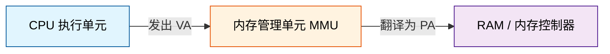
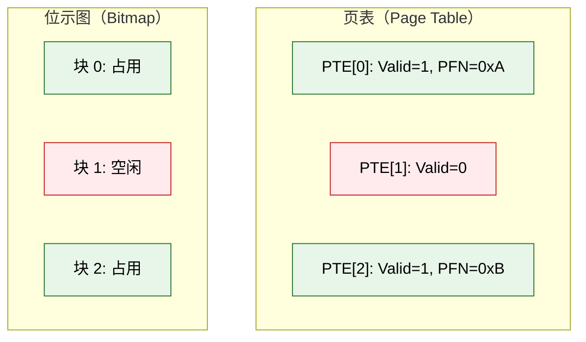
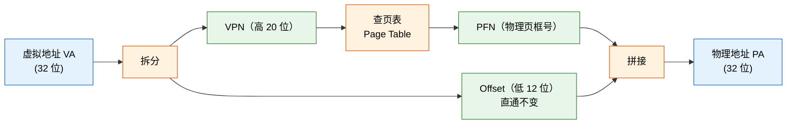
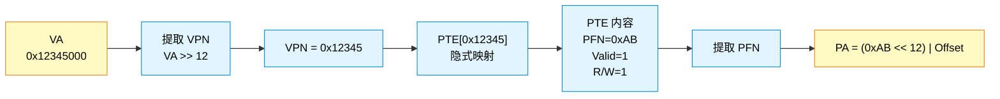
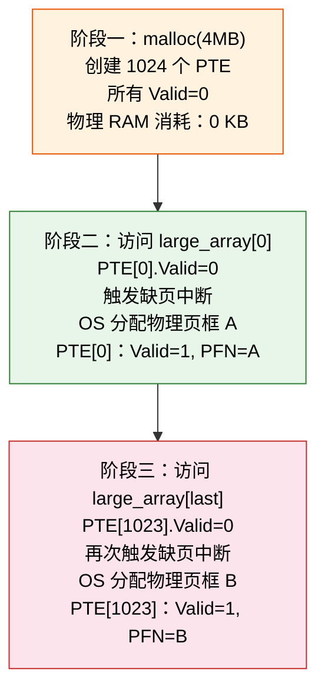
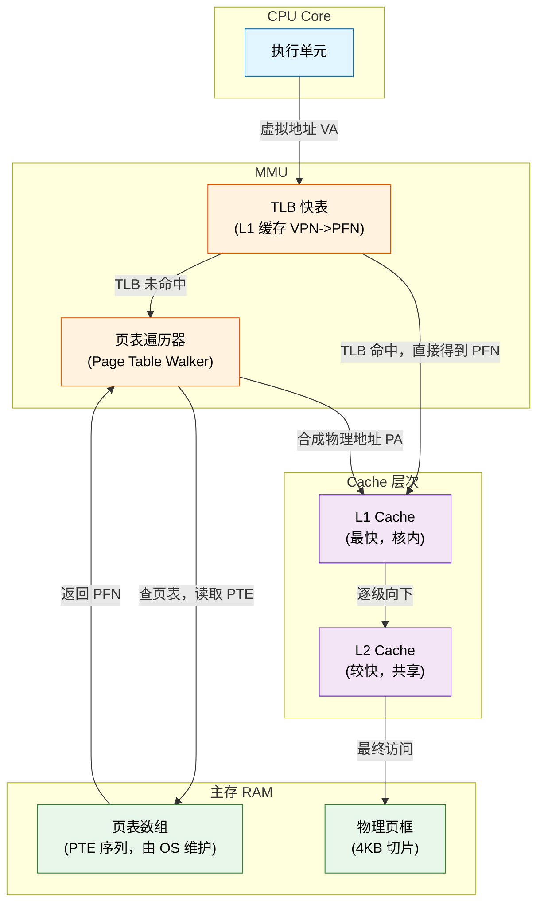

# 虚拟地址、物理地址与页表：从懵圈到通透只差这篇文章

## 一、起源：一个看似简单的哲学追问

### 1.1 初始疑惑：虚拟地址和物理地址一样，也是面向 CPU 的编号吗？

一个常见的困惑：虚拟地址（Virtual Address，VA，程序看到的地址）和物理地址（Physical Address，PA，硬件真正使用的地址）都是数字，那它们到底有什么区别？某位开发者曾盯着 `printf("%p", ptr)` 打印出的十六进制数，天真地以为这个数字就是内存条上的物理位置——直到他发现进程的虚拟内存空间比物理 RAM 还大，才意识到事情没那么简单。

**核心区别在于它们服务的 CPU 阶段不同：**

- **VA（虚拟地址）**：面向程序与 MMU（Memory Management Unit，内存管理单元）。CPU 在执行 `LOAD` 指令时，发出的第一个请求就是 VA。程序中的每一个指针、每一个变量地址，都是在 VA 空间中定义的。
- **PA（物理地址）**：面向 RAM 与内存控制器。经过 MMU 翻译之后，VA 变成 PA，才是内存条上真正的硬件编号。内存控制器只认 PA，它不关心也不理解虚拟化这件事。

来看一段最直观的 C 代码：

```c
#include <stdio.h>
#include <stdlib.h>

int main() {
    int x = 42;
    int *ptr = &x;
    // ptr 的值是一个虚拟地址，不是物理地址
    printf("变量 x 的虚拟地址: %p\n", (void *)ptr);
    printf("变量 x 的值: %d\n", *ptr);
    return 0;
}
```

`ptr` 里存储的地址是 VA。当 `printf` 读取 `*ptr` 时，CPU 发出 `LOAD [ptr]` 指令，硬件自动经过 MMU 翻译为 PA 之后才去 RAM 中取值。整个过程对程序员透明——这也是为什么很多人长期把 VA 误当作「内存的真实坐标」。

📌 **前置知识**：现代 CPU 都内置了 MMU。MMU 就像一个硬件翻译官，程序只跟翻译官打交道，翻译官再去找真正的 RAM 要数据。

### 1.2 进阶追问：物理地址出厂就定了，那虚拟地址谁来设定？

物理地址的布局由主板设计和内存控制器（Memory Controller）决定。插上内存条，加电之后，每个字节在总线上的物理编号就固定了——这是硬件厂商定好的游戏规则。

虚拟地址的分配则是一场软件和硬件的合谋：

- **编译器（Compiler）与链接器（Linker）**：在编译阶段决定了代码段、数据段、BSS 段（未初始化全局变量区）在虚拟地址空间中的**相对位置**。例如 Linux ELF 文件默认的链接基地址是 `0x400000 `。
- **操作系统（OS）**：在进程创建时，决定进程的**绝对基地址**，并负责构建一张核心数据结构——页表（Page Table）。页表记录了每个虚拟页面对应哪个物理页框。

整个过程可以用一张图来概括：



也就是说，MMU 是 VA 和 PA 之间的唯一桥梁。没有 MMU，CPU 发出的 VA 就无法转化为 RAM 能理解的 PA。页表是 MMU 执行翻译的依据——理解了页表，就理解了整个内存管理的核心。

## 二、联想与类比：从代码运行到数据结构的灵光一闪

### 2.1 引入代码实战：4MB 大型数组

纸上谈兵终觉浅。来看一段会让人产生「物理内存没少？」困惑的代码：

```c
#include <stdio.h>
#include <stdlib.h>
#include <string.h>
#include <unistd.h>

int main() {
    size_t size = 4 * 1024 * 1024;  // 4MB
    char *large_array = (char *)malloc(size);
    
    printf("Allocated %zu MB\n", size / 1024 / 1024);
    printf("Virtual address: %p\n", (void *)large_array);
    printf("Press Enter to read /proc/self/status...\n");
    getchar();  // 此时检查 VmRSS
    
    // Write to first page
    large_array[0] = 'A';
    printf("Wrote to large_array[0]\n");
    
    // Write to last page
    large_array[size - 1] = 'Z';
    printf("Wrote to large_array[last]\n");
    
    getchar();  // 此时再检查 VmRSS
    free(large_array);
    return 0;
}
```

在 Linux 上运行这段代码，在第一个 `getchar()` 处查看 `/proc/self/status` 中的 `VmRSS `（Resident Set Size，常驻内存集大小）。会发现：**即使 malloc 声称分配了 4MB，VmRSS 几乎没有变化**。

⚠️ **新手提示**： ` malloc` 返回的是一段虚拟地址空间——它只是一个「承诺」，OS 还没有真正向物理 RAM 索要页面。只有当程序开始读写这些地址时，才会触发物理内存的实际分配。

这个观察让很多人脊背发凉：「我申请了 4MB，为什么物理内存没反应？」答案就在页表里。

### 2.2 跨界联想：页表怎么和文件系统的位示图（Bitmap）这么像？

看穿了页表之后，某开发者发现页表和文件系统的位示图在结构上有惊人的相似性。

**相似性：**

| 特征 | 页表（Page Table） | 位示图（Bitmap） |
|---|---|---|
| 管理粒度 | 4KB 虚拟页 / 物理页框 | 4KB 数据块 |
| 状态标志 | Valid / Present / Dirty | 已分配 / 空闲 |
| 数组结构 | PTE 按 VPN 索引 | 位按块号索引 |
| 索引即编号 | PTE[n] 对应 VPN=n | bit[n] 对应块号=n |

**关键差异：**

- 页表服务于**实时地址翻译**——每次内存访问都需要查表，性能敏感度极高。
- 位示图服务于**持久空间分配**——只在文件创建或删除时访问，性能要求远低于页表。



这种「索引即编号」的模式，是计算机科学中经典的「间接层 + 隐式映射」思想。页表的高明之处在于：它不需要显式存储「我映射到哪个虚拟页」，因为索引本身就已经给出了答案。这一点会在后面详细展开。

## 三、碰撞与纠偏：在细节处踩坑，在推演中蜕变

这一节是本文的核心——四个初学者几乎必然会踩的坑，逐个击破。

### 3.1 第一次概念偏差：每个 PTE（Page Table Entry，页表项）都包含页号和页内地址吗？

**纠偏一（页内地址去哪了）：**

很多人直觉上认为 PTE 应该存「完整的物理地址」，就像 `map[VA] = PA` 那样。但这是错的。

页内偏移（Offset，低 12 位）**在 VA 到 PA 的翻译过程中保持不变**——硬件术语叫「低位直通」（offset pass-through）。MMU 在做地址翻译时，会把 VA 拆成两部分：

```
VA = [ VPN（Virtual Page Number，虚拟页号，高 20 位） | Offset（页内偏移，低 12 位） ]
```

MMU 只翻译 VPN 部分，找到对应的 PFN（Page Frame Number，物理页框号），然后将 PFN 和原封不动的 Offset 拼起来，就得到了 PA。

**PTE 中 NEVER 存储 Offset！** PTE 只存储两样东西：

1. **PFN（物理页框号）**：告诉 MMU 这个虚拟页对应哪个物理页框。
2. **状态位（Status Bits）**：Valid（有效位）、Dirty（脏位）、Present（存在位）、权限位等。



📌 **前置知识**：4KB 页面大小意味着 12 位偏移（$2^{12}=4096$）。对于 32 位地址空间，VPN 占 20 位，Offset 占 12 位。

### 3.2 第二次概念偏差：页表项是内存真实的切割，还是抽象？

**纠偏二（真与假的界限）：**

这是一个更深层的哲学问题。物理内存的页框（Page Frame）是真实的——内存控制器确实把 RAM 看作若干 4KB 大小的物理切片，每个切片有一个唯一的 PFN。

但页表项（PTE）本身是**纯抽象的**。物理内存自己并不知道什么页表，它只是一块连续的电子存储介质。页表完全是 OS + MMU 为了虚拟化而创造的一层映射数据。

打个比方：页框就像现实世界中的仓库货架，是物理存在的；页表则是一张「仓库地图」，地图本身可以放在仓库里（通常页表就存储在 RAM 中），但地图上的标记、编号、路线都是人为约定的抽象符号。

物理内存不读页表——**MMU 才读页表**。RAM 只是被动地按 PA 存取数据，它不在乎这个 PA 是从 VA 翻译来的还是直接发来的。

### 3.3 第三次概念偏差：1 个 PTE 代表 1 个虚拟地址吗？

**纠偏三（数量级震撼）：**

一个常见的直觉是：每个地址都有一个对应的页表项。但这个直觉如果成立，页表本身就会把 RAM 撑爆。

**事实：1 个 PTE 代表 1 个虚拟页面 = 4096 个虚拟地址。**

来算一笔账：

- 32 位虚拟地址空间 = 4GB。
- 页面大小 4KB = $2^{12}$。
- 页表项数量 = $4\text{GB} / 4\text{KB} = 2^{32} / 2^{12} = 2^{20} = 1,048,576$ 个 PTE。
- 每个 PTE 8 字节（以 32 位系统为例，实际可能更大）。
- 页表总大小 = $1,048,576 \times 8 = 8,388,608 \text{ 字节} \approx 8\text{MB}$。

8MB 的页表是完全可以接受的。但如果 PTE 和地址是 1:1 的关系：

- 4GB $\times$ 8 字节 / 地址 = 32GB 的页表。
- 页表比它管理的内存还大——这显然不可行。

**1 个 PTE = 4096 个虚拟地址**，这个认识让人豁然开朗。PTE 的粒度是「页」，不是「字节」。

### 3.4 第四次深入追问：PTE 存了 4096 个地址的信息吗？它怎么知道自己对应哪个虚拟地址？

**核心顿悟（隐式映射的精妙）：**

既然 1 个 PTE 覆盖 4096 个地址，那 PTE 它自己怎么知道对应哪个 VA 范围？难道在 PTE 里存一个 VPN 字段吗？

**不需要。** 这就是隐式映射（Implicit Mapping）的精妙之处。

- PTE 只有 8 字节，它的核心内容是：PFN（物理页框号，通常 20-28 位）+ 状态位（Valid、Present、Dirty、权限位等）。
- **PTE 不需要存 VPN。** 因为 VPN 可以从 PTE 在页表数组中的**索引**推导出来。
- `PTE[n]` 的 VPN = `n `。索引本身就是虚拟页号。

就像 C 语言的数组： ` arr[i]` 不需要存储 `i `， ` i` 就是访问数组时用的索引。页表本质上就是一个数组，MMU 用 VPN 作为下标去访问：

```
PA = PFN_from_PTE[VPN] << PAGE_SHIFT | Offset
```



⚠️ **新手提示**：这个「索引即 VPN」的设计是理解页表的关键一步。很多人在此之前一直困惑「PTE 怎么知道它管哪个虚拟地址」，原因就是用「HashMap 思维」去想页表——但页表比 HashMap 简单得多，它就是一个数组。

## 四、闭环实战：重新审视 4MB 数组在幕后的动态演化

理论说通了，回到代码。4MB 数组从创建到访问的完整生命周期。

### 4.1 阶段一：malloc(4MB) 发生时

当程序调用 `malloc(4MB)` 时，glibc 内部调用 `brk()` 或 `mmap()` 系统调用。OS 的响应：

- 在页表中创建了 1024 个 PTE（$4\text{MB} / 4\text{KB} = 1024$）。
- **所有这些 PTE 的 Valid 位都被设为 0**——表示「已映射，但未分配物理页」。
- 物理内存消耗：**0 KB**（用于这 4MB 数据本身，页表本身的 8KB 开销由内核维护）。

这就是为什么在第一个 `getchar()` 时 `VmRSS` 几乎没有变化。程序拥有了 4MB 的虚拟地址空间，但这些地址背后没有任何物理 RAM 支撑——它们只是页表中的 1024 行「空头支票」。

### 4.2 阶段二：访问 large_array[0]

当程序执行 `large_array[0] = 'A'` 时，好戏才开始：

1. CPU 发出 `large_array[0]` 的 VA。
2. MMU 提取 VPN（高 20 位），找到对应的 PTE。
3. PTE[0] 被读取，Valid bit = 0。
4. **MMU 触发缺页中断（Page Fault）**，暂停当前指令，切换到内核态。
5. OS 的缺页中断处理程序（Page Fault Handler）开始执行：
   - 找到一个空闲的物理页框（4KB）。
   - 在 PTE[0] 中写入：Valid=1, PFN=该页框的编号。
   - 刷新 TLB（Translation Lookaside Buffer，地址转换后备缓冲器）。
6. 返回用户态，重新执行那条 `LOAD/STORE` 指令。
7. 这次 PTE[0].Valid=1，翻译成功，数据被写入物理内存。

整个过程对程序员完全透明。程序只是执行了一行 `large_array[0] = 'A'`，背后却经历了一场内核态的中断处理。

### 4.3 阶段三：访问 large_array[末尾]

当程序执行 `large_array[size - 1] = 'Z'` 时，情况类似但不同：

- `size - 1` = `4 * 1024 * 1024 - 1 `，这属于最后一页。
- VA 对应的 VPN 为 1023，即 PTE[1023]。
- PTE[1023] 的 Valid 位同样为 0——因为 `malloc` 时只创建了条目，没有分配物理内存。
- 再次触发缺页中断。
- OS 分配另一个空闲物理页框，更新 PTE[1023]。
- 执行成功。

**最终结果**：一个 4MB 的虚拟数组，**只消耗了 8KB 的物理 RAM**（2 个页面 $\times$ 4KB）。

剩下的 1022 个页面依然处于「虚拟存在、物理悬空」的状态。它们只占了页表中的 1022 行记录（共 8KB），但对应的物理 RAM 为 0 KB。



## 五、终局总结：从困惑到通透的映射公式

现在把所有知识点整合成一套完整的数学公式和可运行的模拟代码。

### 5.1 虚拟地址拆解

对于 32 位地址空间、4KB 页面大小的系统：

$$VA = \text{VPN (高 20 位)} + \text{Offset (低 12 位)}$$

其中：

$$\text{VPN} = VA \gg 12$$

$$\text{Offset} = VA \ \&\ (4096 - 1) = VA \ \&\ \text{0xFFF}$$

### 5.2 映射计算核心

$$\text{Index(VPN)} \xrightarrow{\text{查页表}} \text{PTE} \xrightarrow{\text{提取}} \text{PFN}$$

用数组索引的话说：

$$PFN = \text{page_table[VPN]}.pfn$$

### 5.3 物理地址合成

$$PA = (\text{PFN} \ll 12) \ | \ \text{Offset}$$

注意：Offset 是那个从 VA 中拆出来的、从未改变的 12 位低位——它直接穿过 MMU 翻译过程。

---

以下是一段用 C 语言模拟 VA 到 PA 翻译过程的代码，它把上面的公式全部变成了可运行的逻辑：

```c
#include <stdio.h>
#include <stdint.h>

#define PAGE_SHIFT 12     // 4KB = 2^12
#define PAGE_SIZE  4096
#define PAGE_MASK  (~(PAGE_SIZE - 1))  // 0xFFFFF000

// 简化的 PTE 结构
typedef struct {
    uint32_t pfn : 20;    // Physical Frame Number
    uint32_t valid : 1;
    uint32_t rw : 1;
    uint32_t present : 1;
    uint32_t unused : 9;
} PTE;

// 模拟 VA 到 PA 的翻译
uint32_t translate(uint32_t va, PTE *page_table) {
    uint32_t vpn = va >> PAGE_SHIFT;          // 提取 VPN（高 20 位）
    uint32_t offset = va & (PAGE_SIZE - 1);   // 提取 Offset（低 12 位）

    PTE entry = page_table[vpn];
    if (!entry.valid) {
        printf("  PAGE FAULT! VPN=%u (virtual page not in RAM)\n", vpn);
        return 0;  // 模拟缺页
    }

    uint32_t pa = (entry.pfn << PAGE_SHIFT) | offset;
    return pa;
}

int main() {
    // 构造一个迷你页表，只含 3 个 PTE
    PTE table[3] = {
        { .pfn = 0x00001, .valid = 1, .rw = 1, .present = 1 },  // PFN=1
        { .pfn = 0,       .valid = 0 },                            // 未映射
        { .pfn = 0x000AB, .valid = 1, .rw = 1, .present = 1 },  // PFN=0xAB
    };

    uint32_t test_va = 0x00000000;   // VPN=0, Offset=0
    uint32_t pa = translate(test_va, table);
    printf("VA 0x%08X -> PA 0x%08X\n", test_va, pa);

    test_va = 0x00001004;            // VPN=1, Offset=0x004
    pa = translate(test_va, table);
    printf("VA 0x%08X -> PA 0x%08X\n", test_va, pa);

    test_va = 0x00002000;            // VPN=2, Offset=0x000
    pa = translate(test_va, table);
    printf("VA 0x%08X -> PA 0x%08X\n", test_va, pa);

    // 触发缺页的 VPN
    test_va = 0x00001000;            // VPN=1, Offset=0x000 -> PTE[1].valid=0
    pa = translate(test_va, table);

    return 0;
}
```

编译运行后，输出应当类似：

```
VA 0x00000000 -> PA 0x00001000
VA 0x00001004 -> PA 0x00000004
VA 0x00002000 -> PA 0x00AB0000
  PAGE FAULT! VPN=1 (virtual page not in RAM)
```

这个模拟器虽然简单，但它展示了 VA->PA 翻译的全部核心步骤：拆 VPN、查数组、提 PFN、拼 Offset。理解了这段代码，就理解了页表的核心机制。

---

最后，用一张完整的硬件架构图来收尾，把 CPU、MMU、Cache、RAM 和页表的关系全部串联起来：



回顾整篇文章，从开头的「VA 和 PA 都是编号」的哲学追问，到最后的 `PA = (PFN << 12) | Offset` 公式推导，核心脉络其实只有一句话：

> **虚拟地址是问题的起点，页表是解题的过程，物理地址是最终的答案。**

MMU 用页表把 VA 翻译成 PA，操作系统用缺页机制按需分配物理内存，而程序员看到的是那个 4MB 的数组——感觉不到任何异样。这就是虚拟内存系统最迷人的地方：它在硬件层面做了一件极其复杂的事，却让每一行代码都感觉像是直接操作物理内存。
