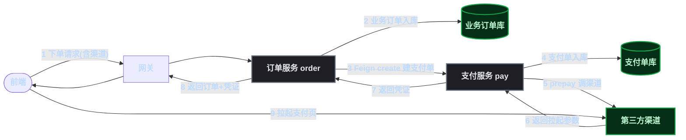
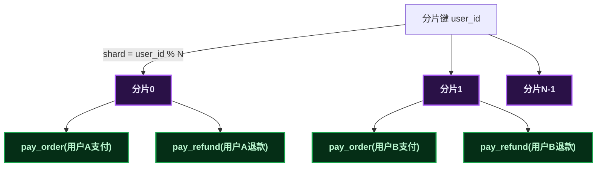
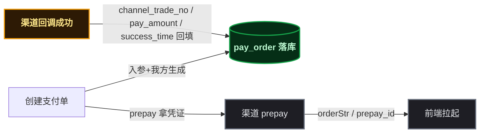
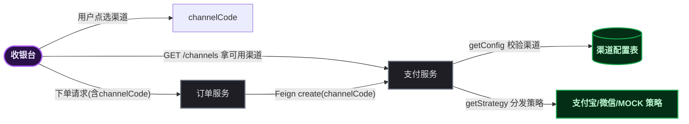

# 支付服务：每个"为什么"背后都是真金白银

## 为什么支付服务和普通业务完全不一样

写业务代码，最常见的是 CRUD。增删改查写熟了，觉得什么服务都差不多——直到被分配写支付服务。

支付和普通业务有本质区别：**普通业务操作的是信息，支付操作的是钱**。信息写错了能改，钱出去了就是真金白银的损失。更扎心的是，支付服务里每一个看似"怎么做都行"的设计决策，背后都藏着一个"做错了会怎样"的财务事故。

这一篇不讲支付怎么接入第三方（那是另一篇的活），专门讲**设计决策**：先落库还是先调渠道、支付单和退款单要不要分开、前端该直连支付还是走订单、状态机怎么拆、将来分库分表怎么留预案。这些决策不写明白，代码写对了也是悬的——哪天线上出了对不上账的事故，回头看全是今天的"小事"。

## 设计决策 1：先落库支付单，还是先调渠道 prepay？

### 踩坑现场

第一次写支付创建接口的人，几乎都会纠结这个顺序。有人觉得"先调渠道拿参数，再落库，这样能确认渠道成功"——听着有道理，其实是财务黑洞的开端。

### 为什么必须"先落库、后调渠道"

```
插入 pay_order 失败？→ 直接抛异常终止，永不调渠道
插入 pay_order 成功？→ 调渠道 prepay → 拿拉起参数 → 返回前端
```

这笔顺序是**强同步串行**的，理由有三个：

**① pay_order 是"我方要收这笔钱"的唯一凭证**。必须先记账，再去碰第三方。渠道 prepay 失败、渠道宕机时，本地已有待支付单——可重试、可追溯、可对账。反过来，渠道调好了本地啥都没有，这笔支付意图就丢了。

**② 反向顺序是财务黑洞**。先调渠道拿参数、再落库，万一落库失败（DB 故障、唯一键冲突、事务回滚），渠道侧已经有一笔预支付交易、本地没有单。用户真拿着参数付了款，渠道回调过来本地无单可匹配——用户钱付了，我方账上没收，直接资金风险。

**③ prepay 本身不扣款**。 ` alipay.trade.app.pay ` 只是"下单拿拉起参数"，用户还没付款。所以先落库后调渠道，即使渠道失败也没有资金损失，重试即可。

### 顺带一个容易踩的长事务坑

创建接口标了 ` @Transactional ` ，prepay 这个外部 HTTP 调用被包进了本地事务——prepay 慢（外部网络）会**长时间占用数据库连接**，高并发下单时是隐患。严谨做法是把 prepay 移出事务：

```
事务 A：insert pay_order（本地，快）
无事务：调渠道 prepay（外部，慢）
事务 B：prepay 失败则更新 pay_order 状态
```

顺序本身不变，但别让外部调用拖住数据库事务。

## 设计决策 2：支付单和退款单，为什么分成两张表？

### 踩坑现场

看表结构时容易嘀咕：支付单和退款单字段挺像的——都有金额、订单号、渠道、用户、时间。为什么不合成一张表，用个"方向"字段区分？

### 为什么必须分开

**① 一对多是硬约束**。一笔支付可以多次退款：买 399 退一件 99，再退一件 100——支付单只有一笔（399），退款单有两笔（99+100）。退款独立成表才能记录多次退款历史，塞进支付单就毁了。

**② 状态机本质不同**。支付单管"收钱"：待支付 → 已支付 → 关闭/失败；退款单管"退钱"：待处理 → 处理中 → 成功/失败 + 审核流。两个状态机混在一张表必然打架。

**③ 资金流向对冲（财务核心）**。支付单记录**用户 → 商户**的资金流入，退款单记录**商户 → 用户**的资金流出——两表构成同一笔交易的对冲两半。对账时 `SUM(pay_amount) - SUM(refund_amount)` 算净额，两个字段在各自的表里独立聚合，这正是"无联表"设计的支撑。

### 业界是不是都这么做？

是的，这是行业主流。支付宝有 ` alipay.trade.refund ` ，微信有 ` POST /v3/refund/domestic/refunds ` ——**渠道自己就把退款作为独立于下单支付的一笔交易**，对账单里退款是独立的行（带 ` refund_no ` ）。聚合支付服务商（Stripe、Ping++）的数据库也是 Charge/Payment + Refund 分离。跟着渠道模型走，日后对账直接对齐，最省事。

> ⚠️ 新手提示：两张表看着像（都带审计底座），但业务核心字段完全不同——支付单有 ` merchant_order_no ` （渠道商户单号）、 ` total_amount ` ；退款单有 ` refund_no ` 、 ` pay_order_id ` （关联回支付单）、 ` refund_fee ` （手续费）、 ` audit_status ` （审核流）。像"发票"和"红字冲销单"，长得像，一个是收钱一个是退钱。

## 设计决策 3：前端直连支付，还是走订单服务中转？

### 踩坑现场

支付链路最容易被画成两种样子：

```
方案 B：前端 → 网关 → mall-pay（直连）       ← 看着省事
方案 A：前端 → 网关 → order → pay（中转）    ← 业界主流
```

直觉上方案 B 少一跳、更快。但真实业务里方案 B 根本走不通，或者走得很难受。

### 为什么业界主流是方案 A（前端 → order → pay）

**① 前端一个请求，不是两个。** 方案 B 其实不是"前端一个请求直连 pay"——pay 建支付单必须依赖 order 的业务订单（要绑 ` bizOrderNo ` 、金额、商品名，全在下单后才有）。所以方案 B 真实形态是"前端先调 order 下单，拿到订单号，**再**调 pay 建支付单"——**两个串行网络请求**，网络差时体验很差。

方案 A 是前端**只发一个请求**给 order，order 内部 Feign 调 pay，一个响应同时带回"订单 + 支付凭证"：



**② order 不是"代理支付"，是业务编排。** order 调 pay 是正常的服务间编排（Feign 内部调用，毫秒级，不是网络往返），跟"下单后调库存服务扣减"一个性质。支付核心（落库支付单、调渠道、验签、对账）全在 pay，order 只负责编排和透传凭证。

**③ 一致性**。业务订单和支付单在同一次请求链路里创建，前端拿到"订单已建 + 凭证已备"的完整结果，不用等两次往返。

## 设计决策 4：支付状态机，为什么要拆成"支付"和"退款"两个维度？

### 踩坑现场

早期支付状态枚举常见这样：

```java
WAIT_PAY(1), PAYMENT(2), REFUND(3), FAILURE(4)   // 把"已退款"当支付状态
```

一眼看没啥问题，但想想这个场景：**订单已支付 + 部分退款**——状态是"已支付"还是"已退款"？单一状态字段表达不了。

### 为什么拆两个维度

```
支付单 pay_status：待支付(10) → 已支付(20) / 已关闭(30) / 支付失败(40)
                  （只关心"收钱"，终态后退款走另一个维度）

退款单 refund_status：待处理(0) → 处理中(1) → 成功(2) / 失败(3)
                  （管"退钱"）
```

一个订单可以"已支付 + 部分退款"，拆分后两个维度各管各的，互不干扰。

### 最容易搞混的：已关闭 vs 支付失败

| 场景 | 支付单状态 |
|------|:---:|
| 用户中途打断支付（返回手势） | 待支付(10) |
| 用户主动取消 / 超时 | 已关闭(30) |
| **资金不足 / 风控拦截** | **支付失败(40)** |

关键区分：
- **已关闭(30)** = 用户**主动不付**（取消/返回）或**超时**——"不付了"，钱没动
- **支付失败(40)** = 渠道**明确拒绝**（余额不足/风控）——"试了但没付成"

余额不足**不能**标成已关闭——那是被动失败不是主动放弃，对账、风控、前端提示（"已取消" vs "支付失败，请重试"）处理完全不同。资金不足必须标 `40 支付失败`，业务订单保持已下单，可重新发起。

> ⚠️ 新手提示：还有个容易混的点——**业务订单状态和支付单状态是两套**。业务订单管"交易履约"（已下单→已支付→已发货→已完成），支付单只管"收钱"。支付完成后业务订单继续走履约，支付单则到了终态（退款另走退款维度）。前端感知"支付成功"是靠**轮询业务订单状态**，不是等渠道回调（回调是服务端内部的事，前端不可见）。

## 设计决策 5：将来分库分表，支付单和退款单被分到不同库怎么办？

### 踩坑现场

单库阶段最容易被忽略的坑：支付单和退款单如果将来分库分表，分片键选不对，关联数据被拆到不同库，对账和退款关联查询直接炸。

### 为什么用 user_id 分片 + 无联表设计双保险

**① 分片键一致 = 关联数据必然同库。** 支付单和退款单都用 ** ` user_id ` ** 做分片键（ ` shard = user_id % N ` ）——同一用户的支付单和退款单**必然落在同一个库**，天然解决"支付在 A 库、退款在 B 库"的问题。这是分片预案的第一道保险。

**② 无联表 + 冗余字段 = 分库也能扛。** 设计上支付库表之间**不设外键、不做 JOIN**，跨表信息靠**冗余字段**（退款单冗余了 ` user_id ` / ` biz_order_no ` / ` pay_order_id ` ）+ 唯一索引 + 应用层二次查询。即使将来真被分到不同库，退款单自己带着支付单的所有关联信息，**不需要跨库 JOIN**。这是第二道保险。



**③ 对账是"双批查询 + 内存撮合"，分库也能跑。** 对账逐笔对比不做跨表 JOIN——两侧各自单表查询（ ` recon_temp ` 按 ` batch_no ` 、 ` pay_order ` 按 ` channel_code + success_time ` ），在内存里按 ` merchant_order_no ` 撮合。分库后这两批查询各落在自己的分片上，无广播扫描。

> ⚠️ 新手提示：分库分表后最怕**跨表 JOIN**——分片键无法路由时，只能全分片广播扫描，必然出错或退化。所以"能不加 JOIN 就不加"不是洁癖，是给未来留退路。

## 设计决策 6：支付服务的渠道配置，要不要加缓存？

### 踩坑现场

看到 ` pay_channel_config ` （渠道配置表，存密钥、回调地址）每次下单都查，很容易想"加个 Caffeine 缓存吧，启动时全量加载"。

### 为什么不能缓存（至少不该缓存渠道密钥）

**① 密钥变更必须立即生效。** 商户换了证书、渠道密钥轮换，如果缓存里还是旧值——线上全挂，还说不清为什么。渠道配置是"配置变了必须马上生效"的东西，缓存会让变更延迟甚至失效。

**② 支付 QPS 远不到打爆 DB 的量级。** 缓存是为了抗高频读，但下单场景的读频率，MySQL 轻松扛住。为了不存在的性能瓶颈引入缓存一致性风险，得不偿失。

**③ 支付是"状态机 + 账目"系统，每一个状态流转都是持久化事实。** 支付状态（待支付→已支付）**绝对不能有缓存层**——缓存里是"已支付"但 DB 还是"待支付"，对账立刻发现短款，资金风险不可接受。渠道配置同理，严谨性优先。

> ⚠️ 新手提示：支付服务里**唯一的缓存例外**是回调防重放用的 nonce 去重（Redis 短 TTL 5 分钟）——那不是业务状态缓存，是短期去重标记，不影响账目一致性。别把"防重放"和"业务缓存"混为一谈。

## 设计决策 7：拉起支付，前端拿到的"凭证"到底是什么？

### 踩坑现场

很多第一次做支付的人以为"后端返回一个支付订单号，前端拿着它拉起支付"——大方向对，但细节差得远。

### 支付宝 vs 微信：凭证形式不同，前端动作也不同

```
支付宝：后端调 alipay.trade.app.pay → 返回 orderStr（签名后的字符串）
        → 前端原样透传：PayTask.payV2(orderStr)   ← 不做任何签名

微信：  后端调 POST /v3/pay/transactions/app → 返回 prepay_id
        → 前端拿 prepay_id 拼参数 + 客户端签名 → 拉起微信 SDK   ← 要多做一步
```

**核心认知**：前端拿到的**不是订单号，是"拉起支付所需的参数"**——支付宝是 ` orderStr ` （服务端私钥签好的完整串），微信是 ` prepay_id ` （前端要再拼参数签名）。这个参数由支付服务调渠道 prepay 获得，经订单服务透传回前端。

> ⚠️ 新手提示：**微信移动端比支付宝多一步**。支付宝 orderStr 已含签名，前端原样传；微信要拿 prepay_id 拼 `appid/partnerid/noncestr/timestamp/package` 并算 `sign` 再拉起。这也是很多聚合支付 SDK 把微信这步封装掉的原因。

### 返回给前端的是一组信息，不是孤零零一串

```json
{
  "prepayParams": "orderStr 或 prepay_id",
  "channelCode": "ALIPAY / WECHAT_PAY / WECHAT_MINI",
  "payOrderNo": "1723000000000000001",
  "merchantOrderNo": "M1723...",
  "payStatus": 10
}
```

** ` channelCode ` 必不可少**——前端必须知道是哪个渠道，才知道 prepayParams 是"直接透传"还是"拼签名"。只给一串参数不给渠道，前端无从判断。

## 设计决策 8：落库支付单的字段，绝不依赖渠道返回值

### 踩坑现场

有人写创建接口时，顺手把渠道 prepay 返回的某个值填进 pay_order——想着"反正渠道给的数据更准"。

### 为什么落库字段必须自给自足

支付单落库的字段应该**全部来自业务方入参或我方自生成**：

```
payOrderNo / merchantOrderNo → 我方雪花 ID 生成
bizOrderNo / channelCode / userId / totalAmount → 业务方入参
payStatus=10（待支付）→ 我方定值
expireTime → 我方计算
```

**零依赖渠道 prepay 返回的任何值**。原因：pay_order 记录的是业务订单的真实应付款，是"我方记账的依据"；渠道返回的 orderStr/prepay_id 只是"交给前端的凭证"，不掺入账务数据。这样对账时才拿得准"我方该收多少"。

**渠道值要等回调才回填**—— ` channel_trade_no ` 、 ` pay_amount ` 、 ` success_time ` 这些渠道返回/回调值，**只在支付成功回调时写入**。创建时不填，否则一旦用户没付款，渠道交易号占了但钱没来，对账混乱。



## 设计决策 9：为什么不能走 BFF，以及渠道选择归谁

### 踩坑现场

微服务架构里最容易被绕晕的：支付链路要不要经过 BFF（Backend For Frontend，前端专用聚合层）？渠道选择（支付宝/微信）到底由谁决定？

### C 端支付必须直连，不经过 BFF

**C 端支付链路是前端 → 网关 → 订单 → 支付 → 渠道，没有任何 BFF 节点。** BFF 是做多服务数据聚合的（尤其管理端后台），支付链路加一层 BFF 纯属增加延迟和复杂度。移动端 C 端直接走各业务服务的 `/v1/mobile/*` 接口，不经过 BFF。唯一例外是渠道回调——渠道的 notify 直连支付服务（网关放行该路径），因为是外部系统服务端通知，不是前端请求。

### 渠道选择是分层职责，不是单一一方

| 环节 | 谁负责 |
|------|--------|
| "哪些渠道可用" | 支付服务（渠道配置表 ` pay_channel_config ` ，status=1 才是可用） |
| "用户选哪个" | 前端收银台（用户交互） |
| "channelCode 透传" | 订单服务（下单时透传给支付服务） |
| "渠道校验 + 策略分发 + 渠道下单" | 支付服务（按 channelCode 走对应策略） |

**支付服务要暴露"可用渠道列表"接口**（如 ` GET /v1/mobile/pay/channels ` ），返回启用中的渠道（编码 + 名称，**不含密钥**）——前端收银台才能渲染支付方式。渠道表在支付服务完全合理，因为支付服务是渠道的唯一事实来源（密钥、启用状态、回调地址都在它这）。



## 设计决策 10：渠道配置、金额单位、ID 生成这些"基建"怎么定

### 金额一律用分（bigint）

所有国内支付 SDK 金额均以**分**为单位（微信）或**元**（支付宝），对账要精确加减避免浮点误差。设计统一以**分（bigint）**为存储单位，**元→分换算只发生在各渠道策略内部**：

```
微信：金额本来就是分，原样传
支付宝：total_amount 是元（字符串），提交时 分 ÷ 100 → 元
对账：两侧都归一为分再比对，无浮点误差
```

> ⚠️ 新手提示：这是最容易翻车的地方——微信账单金额是**元**，支付宝账单是**分**（csv 格式还不同），解析时统一换算为分入库，换算只封在渠道策略里，对外永远用分。

### ID 生成

- 主键/支付单号/退款单号：雪花 ID（分布式唯一）
- ` merchant_order_no ` （提交给渠道的商户订单号）：由支付服务生成（雪花派生），满足渠道格式约束（微信要求 6-32 位字母数字），**不是业务方传入**——保证全局唯一且格式合规
- 双号设计： ` pay_order_no ` （对内对外主号）+ ` merchant_order_no ` （渠道侧订单号）。渠道账单/回调里带的是 ` merchant_order_no ` ，靠它反查 ` pay_order_no `

### 渠道配置存表 + 密钥加密

- 渠道密钥（appSecret/privateKey）**AES 加密落库**，数据库脱敏展示
- 密钥的加解密密钥（ ` crypto.secret-key ` ）由 Nacos 配置，dev/prod 各自独立，**密钥不许跨环境混用**
- 渠道配置每次**直查 DB**（见设计决策 6，不缓存）

## 总结：支付服务设计的三条铁律

把上面十个决策浓缩成三条，写代码前先对一遍：

**① 钱账分离，记账优先。** 支付单先落库再调渠道；落库字段自给自足不依赖渠道返回值；渠道值等回调回填。先记账、后取凭证，防止"渠道有单、我方没记"的对账黑洞。

**② 状态拆维，资金流向清晰。** 支付单管收钱、退款单管退钱，两表分开（一对多 + 状态机不同）；支付/退款两个状态维度各管各的；已关闭（主动放弃）vs 支付失败（被动失败）绝不可混。

**③ 留好退路，别把未来堵死。** 支付/退款同用 user_id 分片（关联数据必然同库）；无联表 + 冗余字段（分库也能扛）；对账双批查询内存撮合（无广播扫描）；渠道配置不缓存（变更立即生效）。

支付服务难的不是写代码，是把每个"为什么"想明白。这篇的每个决策，都是真金白银换来的教训——写之前想清楚，比上线后补窟窿便宜一万倍。

> 参考：本文的设计决策均来自一套生产级支付服务的设计文档（统一支付服务设计方案、代码结构设计、新手引导、官方接口参考），涉及支付宝 App 支付（返回 ` orderStr ` ）、微信 App/JSAPI（返回 ` prepay_id ` ）、每日对账系统（拉取渠道账单 → 解析 → 临时表 → 逐笔对比 → 差异处置）。
